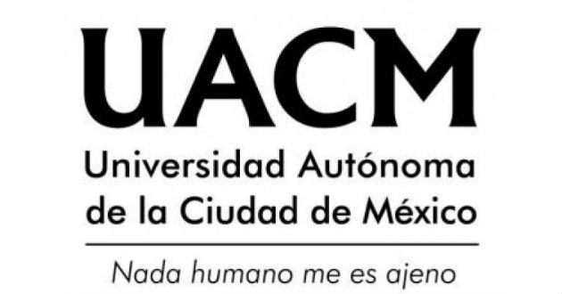

```{r setup, include=FALSE}
knitr::opts_chunk$set(echo = TRUE)
```


# sistemas de punto flotante

## historia de los metodos numericos

## Conversion de base 10 a base 2

## tipos de error


# Sistemas de Ecuaciones lineales

{width=450}


## Metodos Directos


### Gauss simple

#### Ejemplo/ejercicio

##### Paso 1

##### Paso 2


### Gauss con pivoteo parcial

#### Ejemplo/ejercicio

##### Paso 1

##### Paso 2


## Metodos Interativos


### Gauss-seidel
#### Ejemplo/ejercicio

##### Paso 1

##### Paso 2

### Gauss-Jacobi
#### Ejemplo/ejercicio

##### Paso 1

##### Paso 2


# Raices de funciones

# Solucion numeerica de ecuaciones diferenciales

# Practicas de laboratorio

# Revision de programas

# Mis notas


