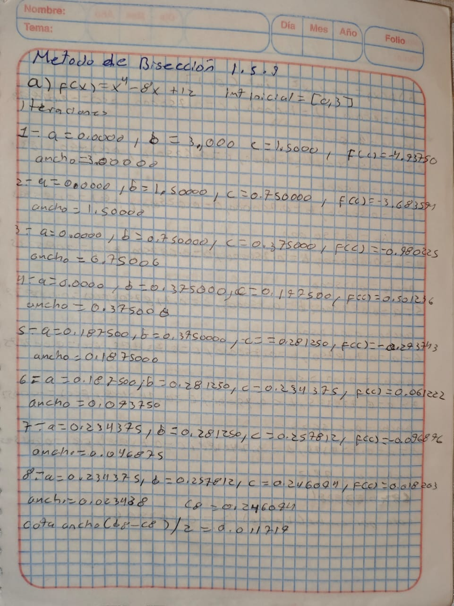
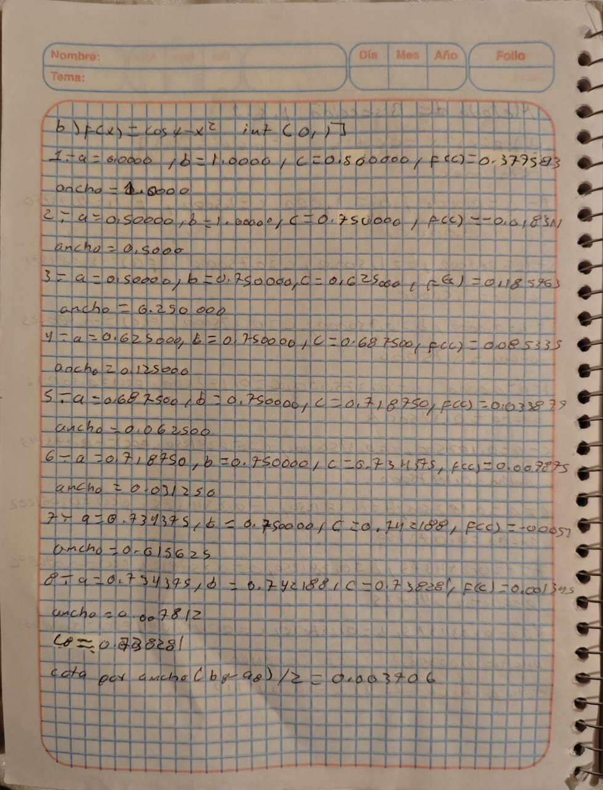
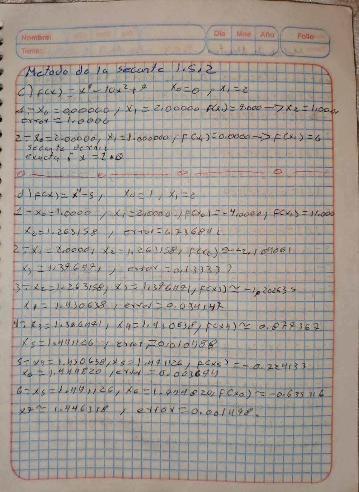
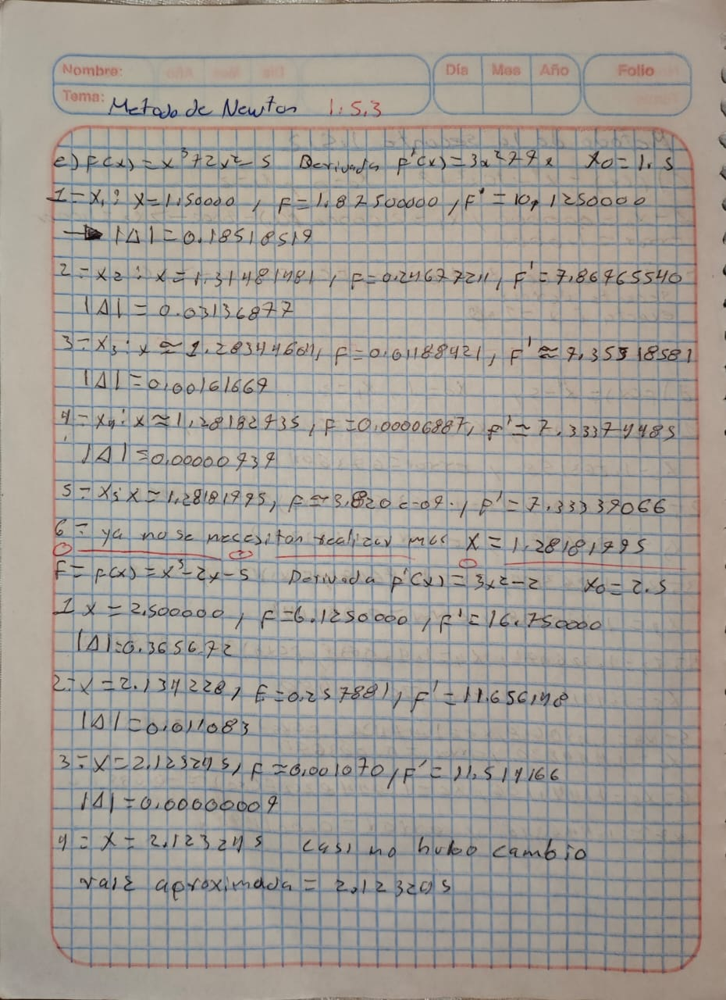
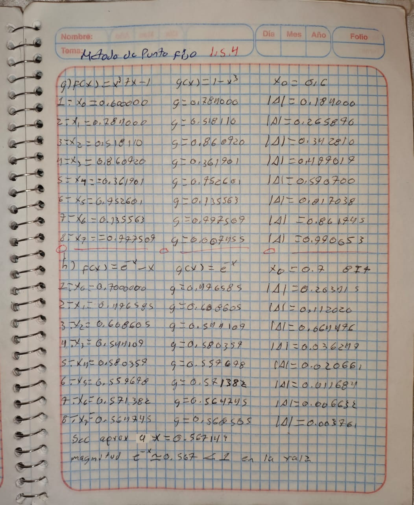

## 1.6 Tarea para el portafolio

------------------------------------------------------------------

## 1. Método de Bisección

#### Función general

``` {r}
biseccion <- function(f, a, b, n){
  datos <- data.frame(
    iter = 1:n,
    a = NA, b = NA, xm = NA,
    fa = NA, fb = NA, fxm = NA,
    error = NA
  )

  for(i in 1:n){
    xm <- (a + b) / 2
    fa <- f(a)
    fb <- f(b)
    fxm <- f(xm)

    datos$a[i] <- a
    datos$b[i] <- b
    datos$xm[i] <- xm
    datos$fa[i] <- fa
    datos$fb[i] <- fb
    datos$fxm[i] <- fxm

    if(i > 1){
      datos$error[i] <- abs(datos$xm[i] - datos$xm[i-1])
    }

    if(fa * fxm < 0){
      b <- xm
    } else {
      a <- xm
    }
  }

  return(datos)
}
```

------------------------------------------------------------------------

## 2. Método de la Secante

``` {r}
secante <- function(f, x0, x1, n){
  datos <- data.frame(
    iter = 1:n,
    x0 = NA, x1 = NA, x2 = NA,
    fx0 = NA, fx1 = NA,
    error = NA
  )

  for(i in 1:n){
    fx0 <- f(x0)
    fx1 <- f(x1)
    x2 <- x1 - fx1 * (x1 - x0) / (fx1 - fx0)

    datos$x0[i] <- x0
    datos$x1[i] <- x1
    datos$x2[i] <- x2
    datos$fx0[i] <- fx0
    datos$fx1[i] <- fx1

    if(i > 1){
      datos$error[i] <- abs(datos$x2[i] - datos$x2[i-1])
    }

    x0 <- x1
    x1 <- x2
  }

  return(datos)
}
```

------------------------------------------------------------------------

## 3. Método de Newton

``` {r}
newton <- function(f, df, x0, n){
  datos <- data.frame(
    iter = 1:n,
    x = NA, fx = NA, dfx = NA,
    x_new = NA,
    error = NA
  )

  for(i in 1:n){
    fx <- f(x0)
    dfx <- df(x0)
    x_new <- x0 - fx / dfx

    datos$x[i] <- x0
    datos$fx[i] <- fx
    datos$dfx[i] <- dfx
    datos$x_new[i] <- x_new

    if(i > 1){
      datos$error[i] <- abs(datos$x_new[i] - datos$x_new[i-1])
    }

    x0 <- x_new
  }

  return(datos)
}
```

------------------------------------------------------------------------

## 4. Método del Punto Fijo

``` {r}
punto_fijo <- function(g, x0, n){
  datos <- data.frame(
    iter = 1:n,
    x = NA, gx = NA,
    error = NA
  )

  for(i in 1:n){
    gx <- g(x0)

    datos$x[i] <- x0
    datos$gx[i] <- gx

    if(i > 1){
      datos$error[i] <- abs(datos$gx[i] - datos$gx[i-1])
    }

    x0 <- gx
  }

  return(datos)
}
```

------------------------------------------------------------------------

## 5. Ejemplos de ejecución

(Puedes reemplazarlos por los ejercicios reales que te piden entregar.)

###### Ejemplo Bisección

``` {r}
f <- function(x) x^2 - 5
biseccion(f, 2, 3, 8)
```

###### Ejemplo Secante

``` {r}
f <- function(x) x^2 - 5
secante(f, 1, 3, 8)
```

###### Ejemplo Newton

``` {r}
f <- function(x) x^2 - 5
df <- function(x) 2*x
newton(f, df, 3, 8)
```

###### Ejemplo Punto Fijo

``` {r}
g <- function(x) sqrt(5)
punto_fijo(g, 1, 8)
```

## Ejercicios a mano

```{r}

```

```{r}

```

```{r}

```

```{r}

```

```{r}

```