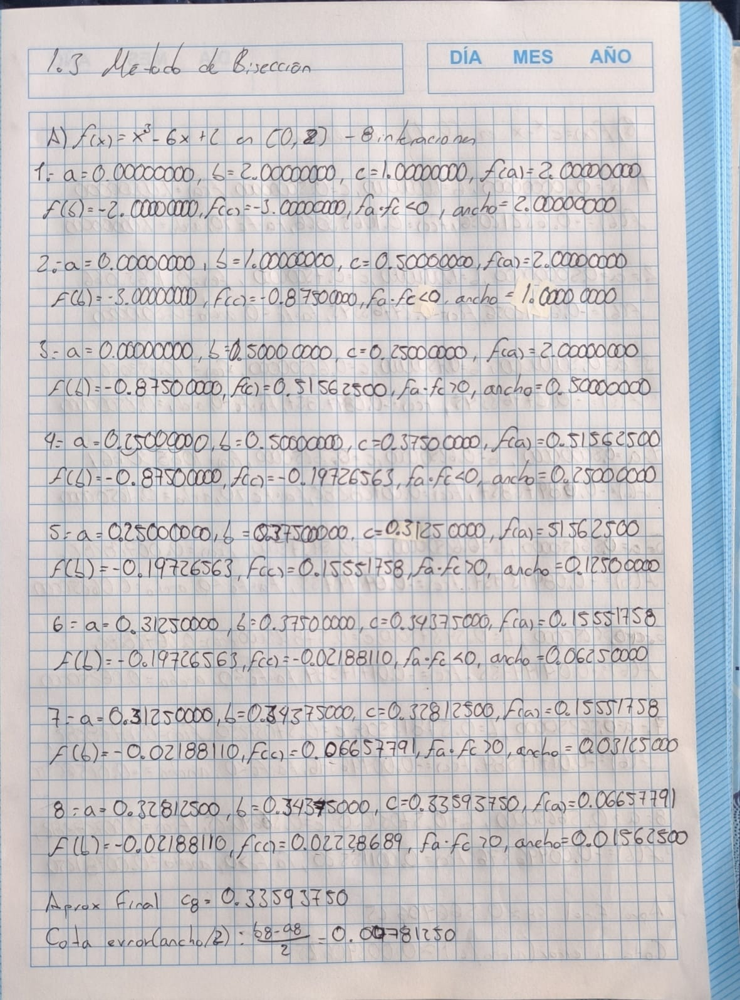
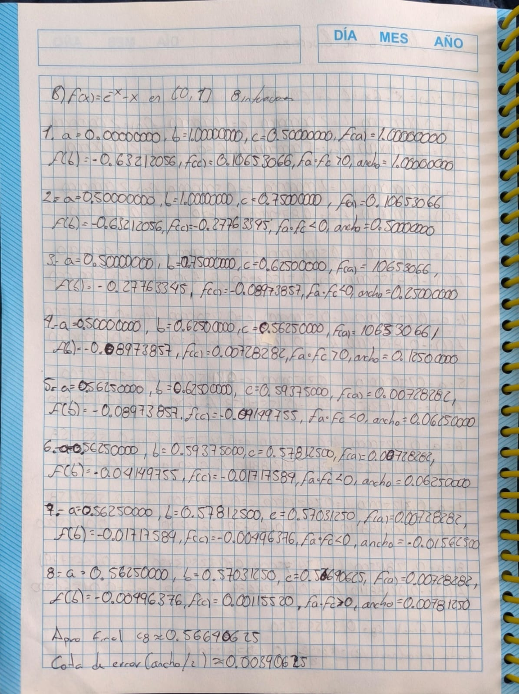
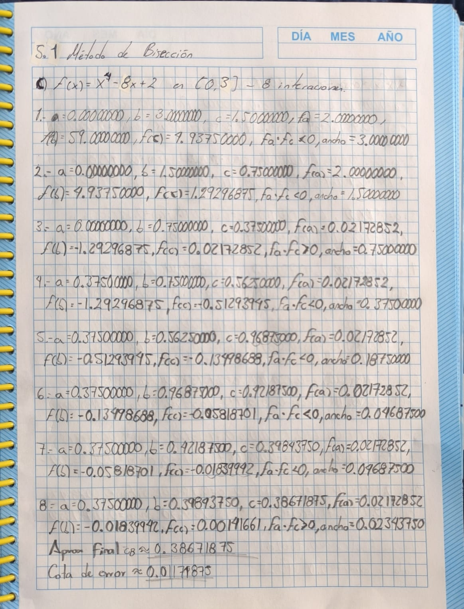
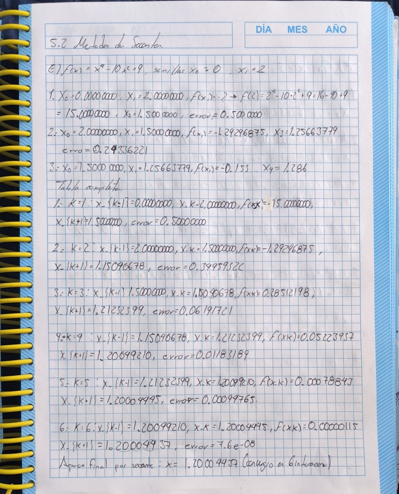
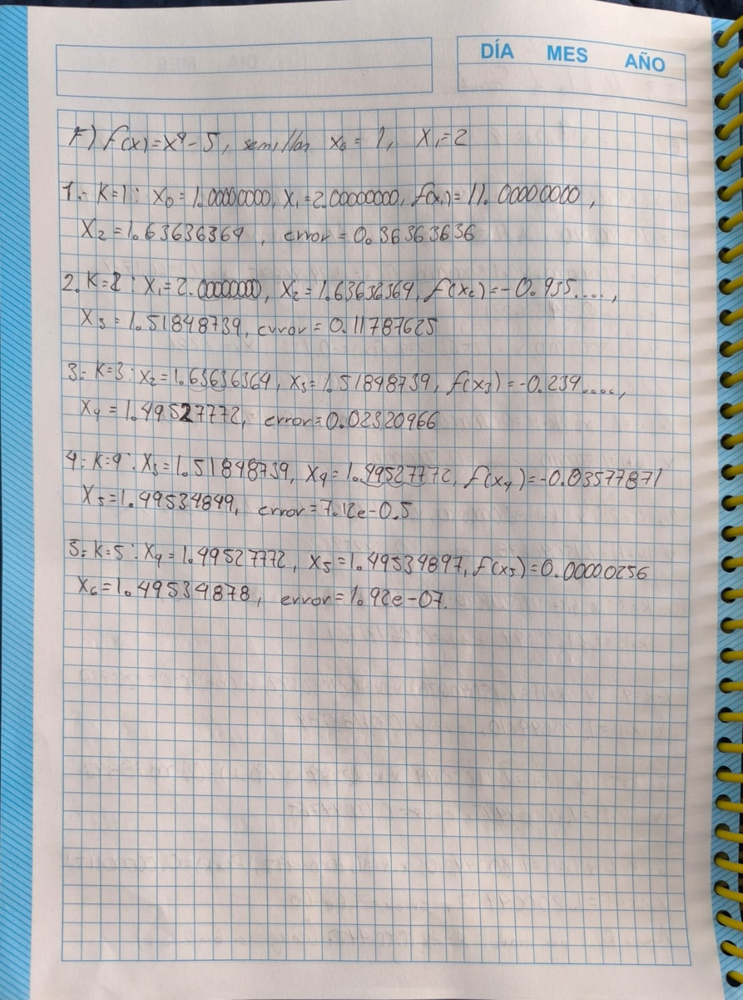

```{r setup, include=FALSE}
paquetes <- c("ggplot2", "dplyr")
inst <- paquetes[!paquetes %in% installed.packages()]
if(length(inst)) install.packages(inst)

library(ggplot2)
library(dplyr)

knitr::opts_chunk$set(echo=TRUE, message=FALSE, warning=FALSE)
```

## Funciones auxiliares

```{r funciones-aux}
biseccion <- function(f, a, b, n_iter = 8, tol = 1e-12) {
  fa <- f(a); fb <- f(b)
  if (fa * fb >= 0) stop("El intervalo inicial no cumple f(a)*f(b) < 0")

  hist <- data.frame(
    k = integer(), a = numeric(), b = numeric(), c = numeric(),
    fa = numeric(), fb = numeric(), fc = numeric(),
    signo = character(), error = numeric(), stringsAsFactors = FALSE
  )

  for (k in 1:n_iter) {
    c <- (a + b) / 2
    fc <- f(c)
    signo <- ifelse(fa * fc < 0, "fa*fc < 0", "fa*fc > 0")

    hist[k,] <- list(k, a, b, c, fa, fb, fc, signo, abs(b - a))

    if (abs(fc) < tol) break
    if (fa * fc < 0) { b <- c; fb <- fc } else { a <- c; fa <- fc }
  }
  list(hist = hist, raiz = (a + b)/2, error_cota = abs(b-a)/2)
}

grafica_biseccion <- function(f, hist, titulo=NULL){
  xs <- seq(min(hist$a), max(hist$b), length.out=400)
  df <- data.frame(x=xs, y=sapply(xs, f))
  ggplot(df, aes(x,y)) +
    geom_line() + geom_hline(yintercept=0, linetype="dashed") +
    ggtitle(titulo)
}

secante <- function(f, x0, x1, n_iter = 12, tol = 1e-5){
  hist <- data.frame(
    k = integer(), x_prev=numeric(), x_curr=numeric(),
    f_curr=numeric(), x_next=numeric(), error=numeric()
  )
  for(k in 1:n_iter){
    f0 <- f(x0); f1 <- f(x1)
    if(abs(f1 - f0) < 1e-14) stop("División por cero en secante")

    x2 <- x1 - f1 * (x1 - x0) / (f1 - f0)
    hist[k,] <- list(k, x0, x1, f1, x2, abs(x2 - x1))

    if(abs(x2 - x1) < tol) break
    x0 <- x1; x1 <- x2
  }
  list(hist=hist, raiz=x2)
}
```

## Punto 1.3 — Bisección

```{r punto-1.3}
f1_1 <- function(x) x^3 - 6*x + 2
f1_2 <- function(x) exp(-x) - x
f1_3 <- function(x) x^2 - 4

casos <- list(
  list(f=f1_1, a=0, b=2, n=12, nombre="x^3 - 6x + 2"),
  list(f=f1_2, a=0, b=1, n=12, nombre="exp(-x) - x"),
  list(f=f1_3, a=-1, b=4, n=12, nombre="x^2 - 4")
)

for(i in seq_along(casos)){
  caso <- casos[[i]]
  res <- biseccion(caso$f, caso$a, caso$b, caso$n)

  cat("\n### Ejercicio 1.3:", caso$nombre, "\n")

  tabla <- res$hist
  tabla[, sapply(tabla, is.numeric)] <- round(tabla[, sapply(tabla, is.numeric)], 8)
  print(tabla)

  print(grafica_biseccion(caso$f, res$hist, caso$nombre))
}
```

## Punto 5.1 — Bisección

```{r punto-5.1}
f_list_5_1 <- list(
  list(f=function(x) x^2 - 5, a=2, b=3, nombre="x^2 - 5")
)

for(i in seq_along(f_list_5_1)){
  caso <- f_list_5_1[[i]]

  res <- try(biseccion(caso$f, caso$a, caso$b, 8), silent=TRUE)
  if(inherits(res, "try-error")){
    cat("\nError en:", caso$nombre, "\n")
    next
  }

  cat("\n### 5.1:", caso$nombre, "\n")
  tabla <- res$hist
  tabla[, sapply(tabla, is.numeric)] <- round(tabla[, sapply(tabla, is.numeric)], 8)
  print(tabla)
  print(grafica_biseccion(caso$f, res$hist, caso$nombre))
}
```

## Punto 5.2 — Secante

```{r punto-5.2}
f_list_5_2 <- list(
  list(f=function(x) x^2 - 2*x -3, x0=0, x1=3, nombre="x^2 - 2x -3")
)

for(i in seq_along(f_list_5_2)){
  caso <- f_list_5_2[[i]]

  res <- try(secante(caso$f, caso$x0, caso$x1), silent=TRUE)
  if(inherits(res, "try-error")){
    cat("\nError en:", caso$nombre, "\n")
    next
  }

  cat("\n### 5.2:", caso$nombre, "\n")
  tabla <- res$hist
  tabla[, sapply(tabla, is.numeric)] <- round(tabla[, sapply(tabla, is.numeric)], 8)
  print(tabla)
}
```

## Ejercicios a mano 
``` {r}

```

``` {r}

```

``` {r}

```

``` {r}
knitr::include_graphics("Biseccion5-1,2.png")
```

``` {r}

```

``` {r}

```

