```{r setup, include=FALSE}
knitr::opts_chunk$set(echo = TRUE)
```

# Revisión

# Ejercicios

## Ejercicios generales

### $7.1$ Conversiones en base 2

#### Ejercicios a mano

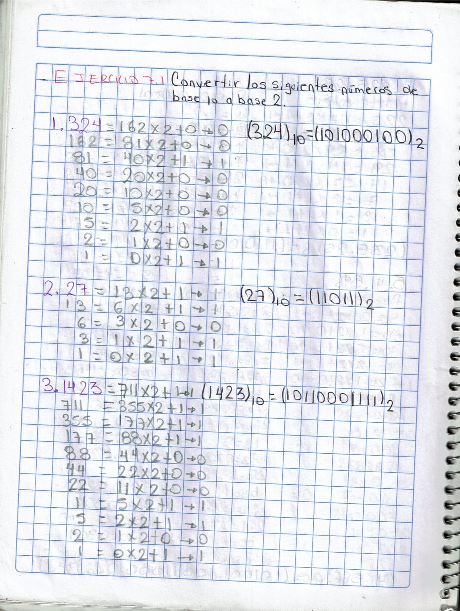{width=600}


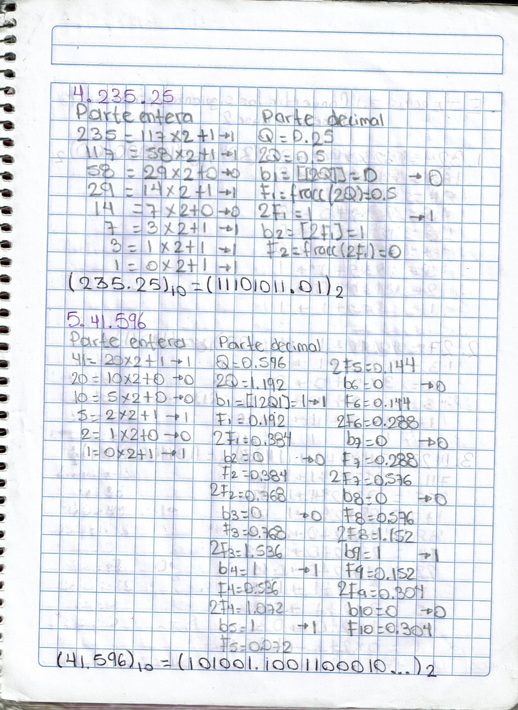{width=600}


```{r}
# Asignación de funciones

# Parte entera

binario <- function(x) {
    if (x == 0) return("0")
    nueva_x <- abs(x)
    iteracion <- ""
    while (nueva_x > 0) {
        iteracion <- paste0(nueva_x %% base, iteracion)
        nueva_x <- nueva_x %/% base
    }
    if (x < 0) iteracion <- paste0("-", iteracion)
    return(iteracion)
}

# Parte decimal

decimal <- function(x2) {
    if (x2 == 0) return("0")
    nueva_x <- x2
    iteracion <- "."
    for (i in 1:10) {
      nueva_x <- nueva_x * base
      if (nueva_x >= 1)
      {
        iteracion <- paste0(iteracion, "1")
       nueva_x <- nueva_x -1
      }
      else {
        iteracion <- paste0(iteracion, "0")
      }
      if (nueva_x == 0) break
    } 
    return(iteracion)
}

```

#### $1.$ $324$

##### Procedimiento

```{r}
x <- 324 #Número a convertir
base <- 2 #Base a la que se convierte

resultado <- binario(x)
```

##### Resultado

```{r}
paste0("El número ", x, " convertido a base ", base, " es: ", resultado)
```

#### $2.$ $27$

##### Procedimiento

```{r}
x <- 27 #Número a convertir
base <- 2 #Base a la que se convierte

resultado <- binario(x)
```

##### Resultado

```{r}
paste0("El número ", x, " convertido a base ", base, " es: ", resultado)
```

#### $3.$ $1423$

##### Procedimiento

```{r}
x <- 1423 #Número a convertir
base <- 2 #Base a la que se convierte

resultado <- binario(x)
```

##### Resultado

```{r}
paste0("El número ", x, " convertido a base ", base, " es: ", resultado)
```

#### $4.$ $235.25$

##### Procedimiento

```{r}
# Parte entera

x1 <- 235 #Número a convertir
base <- 2 #Base a la que se convierte

resultado1 <- binario(x1)

paste0("La parte entera es: ", resultado1)

# Parte decimal

x2 <- 0.25 #Número a convertir
base <- 2 #Base a la que se convierte

resultado2 <- decimal(x2)

paste0("La parte decimal es: ", resultado2)

numero <- x1 + x2
```

##### Resultado

```{r}
paste0("Juntando las dos partes, el número ", numero, " es: ", resultado1, resultado2)
```


#### $5.$ $41.596$

##### Procedimiento

```{r}
# Parte entera

x1 <- 41 #Número a convertir
base <- 2 #Base a la que se convierte

resultado1 <- binario(x1)

paste0("La parte entera es: ", resultado1)

# Parte decimal

x2 <- 0.596 #Número a convertir
base <- 2 #Base a la que se convierte

resultado2 <- decimal(x2)

paste0("La parte decimal es: ", resultado2)
numero <- x1 + x2
```

##### Resultado

```{r}
paste0("Juntando las dos partes, el número ", numero, " es: ", resultado1, resultado2)
```

### $7.2$ Breve historia de métodos númericos y base 2

#### $1.$ Breve historia

Historia y evolución de los métodos numéricos

El análisis numérico representa una disciplina fundamental dentro de las matemáticas aplicadas, dedicada al diseño y estudio de algoritmos para obtener soluciones aproximadas a problemas matemáticos complejos. Estos procedimientos sistemáticos, conocidos como métodos numéricos, han evolucionado a la par del desarrollo tecnológico y científico de la humanidad, constituyendo un puente esencial entre la teoría matemática y las aplicaciones prácticas en ingeniería, física, economía y muchas otras áreas del conocimiento.

Los primeros indicios de haberse utilizado los métodos numéricos se remontan a las civilizaciones antiguas, donde ya existía la necesidad de resolver problemas de cálculo en la vida cotidiana. Los babilonios que se conocen por haber utilizado una de las primeras herramientas para el cálculo conocido como el ábaco, alrededor del 2000 a.C., utilizaban métodos iterativos para calcular raíces cuadradas, como lo demuestran las tablillas de barro que se encontraron y se tienen conservadas hoy en día. No obstante, fueron los griegos quienes establecieron un precedente conceptual fundamental con Arquímedes (287-212 a.C.), cuyo "método de exhaución" permitió acotar el valor de π (pi) y calcular el área del círculo mediante polígonos regulares, encapsulando la esencia de la aproximación sucesiva que caracteriza a los métodos numéricos modernos.

El desarrollo histórico de estas técnicas experimentó un impulso significativo durante los siglos XVII y XVIII con el surgimiento del cálculo infinitesimal y las contribuciones de genios matemáticos como Isaac Newton, Leonhard Euler y Carl Friedrich Gauss. Newton no solo desarrolló los fundamentos del cálculo, sino que también aportó algoritmos prácticos como el método que lleva su nombre para encontrar raíces de ecuaciones. Euler estableció las bases para resolver ecuaciones diferenciales con su propuesta numérica, mientras que Gauss desarrolló procedimientos fundamentales para sistemas de ecuaciones lineales y técnicas de integración avanzada. Sin embargo, la aplicación de estos métodos permaneció limitada a la tecnología de su época.

La verdadera revolución en el campo ocurrió durante el siglo XX con la aparición de las computadoras electrónicas. Como señala Vargas et al. (s. f.)  de la UNAM, esta innovación tecnológica transformó radicalmente la disciplina, permitiendo implementar algoritmos numéricos para resolver problemas a una escala antes inconcebible. Este periodo presenció el surgimiento formal del análisis numérico como una disciplina dedicada no solo a crear métodos, sino también a analizar su estabilidad, convergencia y el impacto de los errores de redondeo. La creación de librerías estandarizadas como EISPACK y LINPACK consolidó las mejores prácticas y garantizó la confiabilidad de los cálculos, estableciendo estándares de calidad en la implementación computacional.

Su importancia radica en su capacidad para resolver problemas que carecen de solución analítica exacta o que son demasiado complejos para abordarse mediante métodos tradicionales. Desde la industria aeroespacial y la predicción meteorológica, hasta en la economía y el entrenamiento de sistemas de inteligencia artificial, estos algoritmos permiten modelar y analizar sistemas del mundo real con un nivel de precisión sin precedentes.
La evolución de los métodos numéricos ha estado marcada por la interacción constante entre las necesidades prácticas y el desarrollo teórico. Cada avance tecnológico, desde el ábaco hasta las supercomputadoras modernas, ha expandido los horizontes de lo que es posible calcular. El Renacimiento trajo consigo el desarrollo de métodos para ecuaciones algebraicas, mientras que la era industrial impulsó la creación de técnicas para ecuaciones diferenciales que modelaban sistemas físicos complejos. El siglo XX, con la computación digital, permitió implementar estos métodos de manera sistemática y a gran escala además de rápida, dando lugar a nuevas áreas como el análisis de error y el estudio de la estabilidad numérica.

Entornos de programación como MATLAB, Python con sus librerías especializadas han puesto estas herramientas al alcance de todos, permitiendo a estudiantes, investigadores y profesionales implementar soluciones numéricas sin requerir conocimientos profundos en computación. Esta accesibilidad ha acelerado la innovación y ha permitido que los métodos numéricos encuentren aplicación en campos tan diversos como la bioinformática, la ciencia de datos y la inteligencia artificial.

En perspectiva, la historia de los métodos numéricos representa un viaje continuo desde la intuición hasta el rigor algorítmico, desde la aproximación manual hasta la simulación computacional de alta fidelidad. Como bien señala Vargas et al. (s. f.), estos métodos constituyen hoy una herramienta indispensable en el arsenal de cualquier científico o ingeniero, permitiendo traducir problemas del mundo real a formulaciones matemáticas y encontrar soluciones útiles incluso cuando los métodos analíticos tradicionales resultan insuficientes. Esto solo afirma que la humanidad siempre busca cuantificar la información que posee y este avanza al mismo tiempo que la humanidad misma.

Bibliografía

Martínez, R. C. (s. f.). Notas sobre Métodos Numéricos con R. GitHub. https://github.com/ProfTodoMundo/ProyectosMN/blob/main/Notas/NotasRaicesFunciones.pdf

Pantoja, R. (2018). Guía de estudio de Métodos Numéricos [PDF]. https://www.cucei.udg.mx/maestrias/matedu/sites/default/files/25._met_num.pdf

Vargas, T., & Zamora, A. (s. f.). Historia métodos numéricos. Matemáticas y Métodos Numéricos. https://blogceta.zaragoza.unam.mx/mnumericos/mn/mnintro/mn1b/


#### $2.$ Conversiones en base 2 a mano

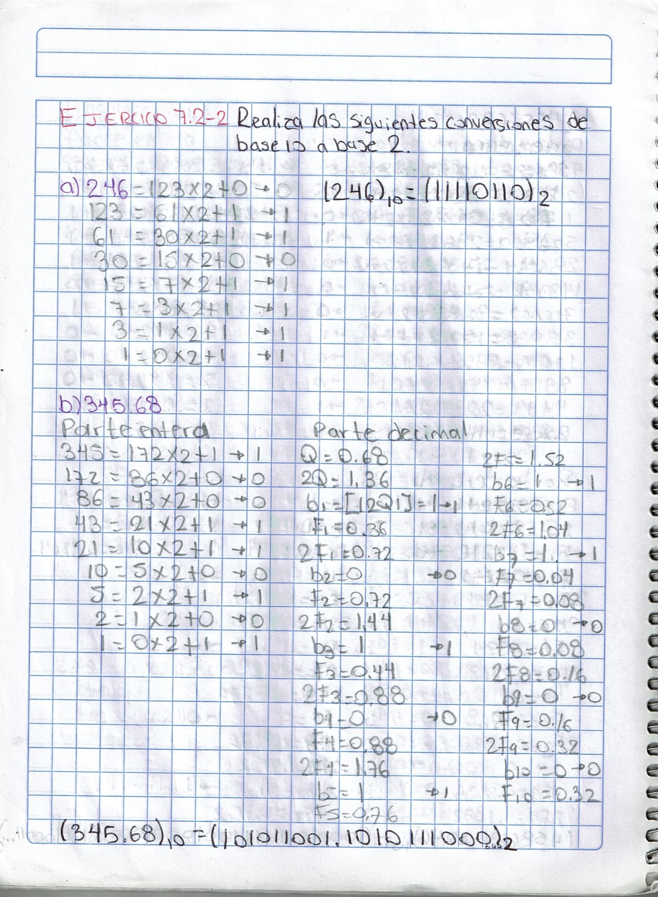{width=600}

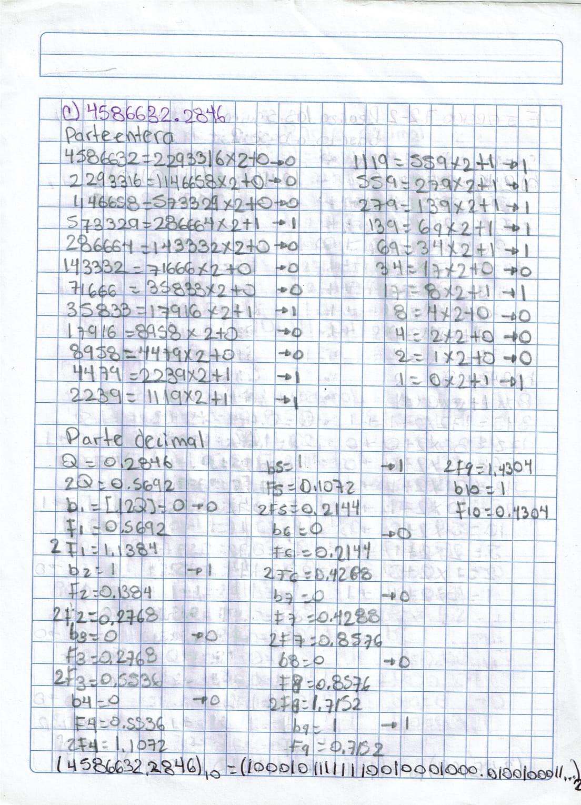{width=600}

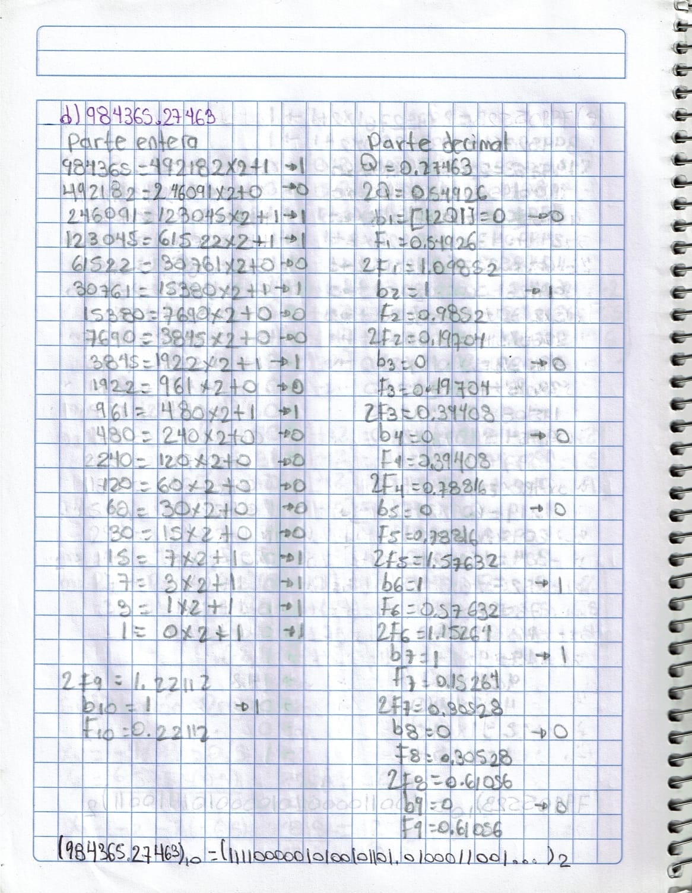{width=600}

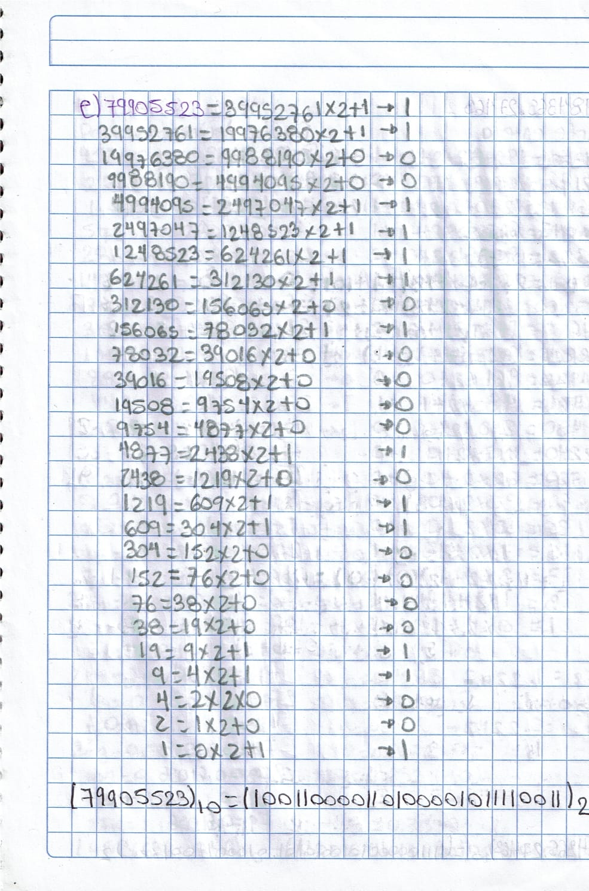{width=600}

#### $3.$ Conversiones en base 2 en R

##### $a)$ $246$

###### Procedimiento

```{r}
x <- 246 #Número a convertir
base <- 2 #Base a la que se convierte

resultado <- binario(x)
```

###### Resultado

```{r}
paste0("El número ", x, " convertido a base ", base, " es: ", resultado)
```

##### $b)$ $345.68$

###### Procedimiento

```{r}
# Parte entera

x1 <- 345 #Número a convertir
base <- 2 #Base a la que se convierte

resultado1 <- binario(x1)

paste0("La parte entera es: ", resultado1)

# Parte decimal

x2 <- 0.68 #Número a convertir
base <- 2 #Base a la que se convierte

resultado2 <- decimal(x2)

paste0("La parte decimal es: ", resultado2)
numero <- x1 + x2
```

###### Resultado

```{r}
paste0("Juntando las dos partes, el número ", numero, " es: ", resultado1, resultado2)
```

##### $c)$ $4586632.2846$

###### Procedimiento

```{r}
# Parte entera

x1 <- 4586632 #Número a convertir
base <- 2 #Base a la que se convierte

resultado1 <- binario(x1)

paste0("La parte entera es: ", resultado1)

# Parte decimal

x2 <- 0.2846 #Número a convertir
base <- 2 #Base a la que se convierte

resultado2 <- decimal(x2)

paste0("La parte decimal es: ", resultado2)
numero <- x1 + x2
```

###### Resultado

```{r}
paste0("Juntando las dos partes, el número ", numero, " es: ", resultado1, resultado2)
```

##### $d)$ $984365.27463$

###### Procedimiento

```{r}
# Parte entera

x1 <- 984365 #Número a convertir
base <- 2 #Base a la que se convierte

resultado1 <- binario(x1)

paste0("La parte entera es: ", resultado1)

# Parte decimal

x2 <- 0.27463 #Número a convertir
base <- 2 #Base a la que se convierte

resultado2 <- decimal(x2)

paste0("La parte decimal es: ", resultado2)
numero <- x1 + x2
```

###### Resultado

```{r}
paste0("Juntando las dos partes, el número ", numero, " es: ", resultado1, resultado2)
```

##### $e)$ $79905523$

###### Procedimiento

```{r}
x <- 79905523 #Número a convertir
base <- 2 #Base a la que se convierte

resultado <- binario(x)
```

###### Resultado

```{r}
paste0("El número ", x, " convertido a base ", base, " es: ", resultado)
```


#### $4.$ Tipos de Errores

Descripción Exhaustiva de los Tipos de Errores en Métodos Numéricos

En el ámbito de los métodos numéricos, la confiabilidad de un resultado depende críticamente de la comprensión y el control de los errores inherentes a todo proceso de cálculo. Dado que las soluciones rara vez son exactas, es fundamental cuantificar y gestionar las discrepancias entre el valor calculado y el valor real o teórico. Para expresar numéricamente este nivel de confianza, se emplea el concepto de “cifras significativas”, que permite comunicar la precisión de una medición o cálculo de manera estandarizada.

$1$. Clasificación General de los Errores

Los errores en los cálculos numéricos se pueden clasificar en dos categorías principales según su origen:

$1.1$. Errores Inherentes o del Modelo

Estos errores son intrínsecos al problema mismo y surgen antes de iniciar cualquier cálculo numérico. Sus fuentes principales son:

	Incertidumbres en los datos de entrada: Ninguna magnitud física puede medirse con exactitud absoluta debido a las limitaciones de los instrumentos o a la naturaleza misma del fenómeno.
	
	Equivocaciones: Errores humanos groseros, como una lectura incorrecta de un instrumento, una mala transcripción de datos o un descuido en el procedimiento, a menudo referidos como "ceguera de taller".
	
	Simplificaciones del modelo matemático: Las suposiciones y simplificaciones que se realizan para modelar un fenómeno físico introducen inevitablemente una discrepancia con la realidad. Estos errores no pueden eliminarse por completo.

$1.2$. Errores del Método Numérico

Estos errores son introducidos por las aproximaciones necesarias para resolver el problema de manera computacional. Se subdividen en:

Error de Truncamiento: Surge cuando un procedimiento matemático exacto, que requiere un número infinito de operaciones, es reemplazado por uno aproximado y finito. Un ejemplo clásico es el uso de un número limitado de términos en una serie de Taylor para aproximar una función, o la discretización de un proceso continuo usando un tamaño de paso $(h)$. La notación $O(hⁿ)$ se utiliza para describir el orden de magnitud de este error.

	Error de Redondeo: Se produce debido a que las computadoras tienen una precisión finita y deben representar los números reales con un conjunto limitado de bits (formato de punto flotante). Cuando un número no puede almacenarse con exactitud, debe ser redondeado. A diferencia del truncamiento, el redondeo afecta la última cifra significativa retenida. Existe un equilibrio crucial entre ambos: aumentar la precisión para reducir el redondeo puede incrementar el costo computacional y, en algunos casos, la propagación de otros errores.
	
$2$. Cuantificación de los Errores

Para evaluar la magnitud de un error, se utilizan las siguientes definiciones:

Error Absoluto $(E)$: Representa la diferencia directa entre el valor real $(V_{real})$ y el valor aproximado $(V_{aprox})$.

$E = |V_{real} – V_{aprox}|$

Error Relativo $(e)$: Proporciona una medida del error en relación con la magnitud del valor real, lo que lo hace más significativo para comparar precisiones en diferentes escalas. Suele expresarse como porcentaje.

$e = \frac{|V_{real} – V_{aprox}|}{|V_{real}|} × 100%$

En la práctica del análisis numérico, donde el valor real exacto a menudo se desconoce, es común aproximar el error absoluto en un proceso iterativo como la diferencia entre dos iteraciones consecutivas: $E ≈ |V_i – V_{i-1}|$.

$3$. Errores en Punto Flotante y Precisión de Máquina

Dado que las computadoras almacenan números en formato binario de punto flotante, la representación exacta de muchos números reales es imposible. Un número real $(x)$ se almacena como una aproximación, $fl(x)$, tal que:

 $x = fl(x) × (1 + ε),donde |ε| ≤ ε_{mach}$

El valor $ε_{mach}$ se conoce como “precisión de máquina” y representa el error de redondeo relativo máximo posible para un sistema computacional dado. Su valor depende directamente del número de bits asignados a la mantisa.

$4$. Aproximación Numérica: Convergencia, Estabilidad y Robustez

Una “aproximación numérica” es un valor que se acerca a la solución real, y la diferencia entre ambos constituye el error. En este contexto, se evalúan propiedades clave de los métodos numéricos:

Convergencia: Un método es convergente si, a medida que avanza el proceso iterativo (por ejemplo, reduciendo el tamaño de paso $h$), la solución aproximada se acerca progresivamente a la solución exacta. Un método converge de forma monótona si $|x_n – x_{n-1}| ≤ |x_{n-1} – x_{n-2}|$.

	Estabilidad: Un método es estable si los pequeños errores iniciales (como los de redondeo) no se amplifican descontroladamente durante los sucesivos cálculos, evitando que la solución se desvíe catastróficamente.
	
	Robustez: Un método robusto combina la convergencia y la estabilidad, siendo capaz de proporcionar resultados confiables incluso ante una amplia gama de condiciones iniciales o problemas mal condicionados, sin ser excesivamente sensible a las perturbaciones numéricas.
	
La búsqueda de métodos que sean a la vez convergentes, estables y robustos es uno de los objetivos centrales en el diseño y la selección de algoritmos numéricos efectivos.

## Solucion de Sistemas de Ecuaciones Lineales por métodos directos

### $7.3.$ Eliminación Gaussiana Simple (Método directo)

#### Ejercicios a mano

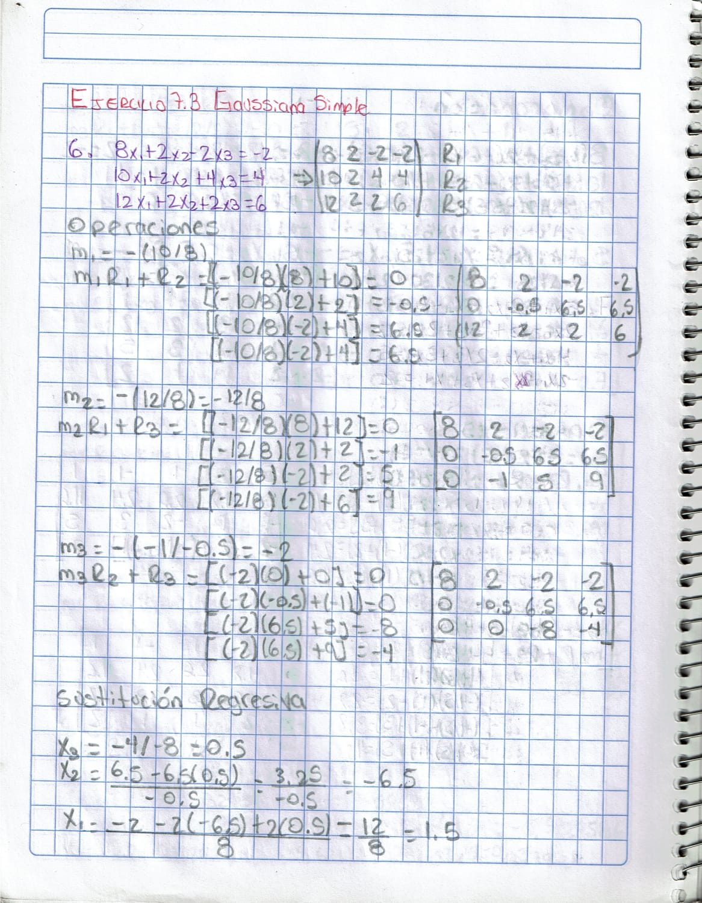{width=600}

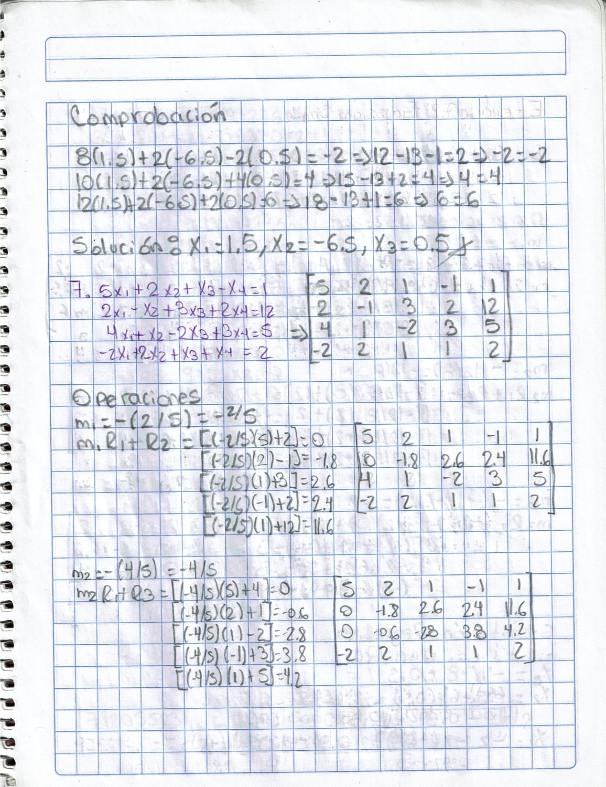{width=600}

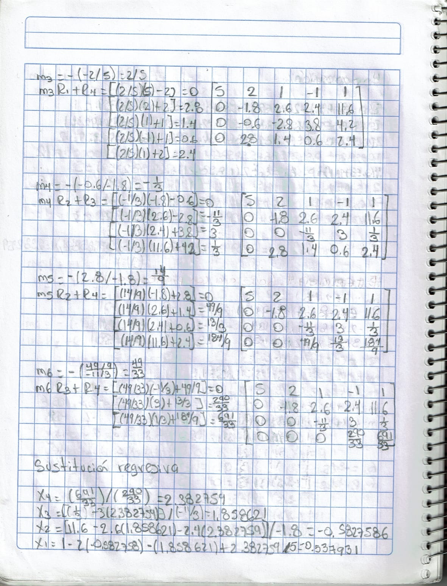{width=600}

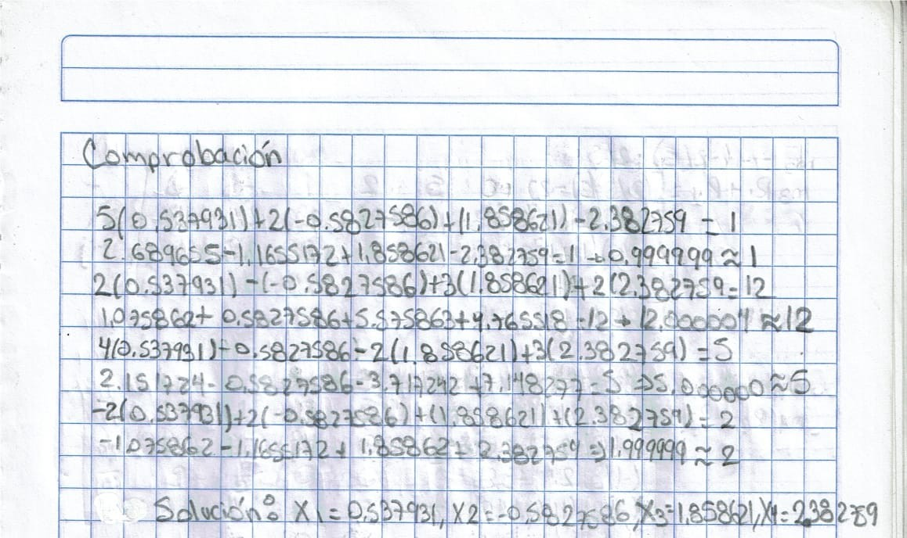{width=600}

#### Sistema $1$

$x_1 − 2x_2 + 0.5x_3 = −5$

$−2x_1 + 5x_2 − 1.5x_3 = 0$

$−0.2x_1 + 1.75x_2 − x_3 = 10$

```{r}
A <- matrix(c(1, -2, 0.5,
              -2, 5, -1.5,
              -0.2, 1.75, -1),
      nrow = 3, byrow = TRUE)
b <- matrix(c(-5, 0, 10), nrow = 3)

Ab <- cbind(A,b); (Ab)

```

##### Procedimiento

```{r}
# Primera eliminación

m1 <- -Ab[2,1] / Ab[1,1]
(m1)
m2 <- -Ab[3,1] / Ab[1,1]
(m2)
A1 <- Ab[1,]
(A1)
A2 <- m1 * Ab[1,] + Ab[2,]
(A2)
A3 <- m2 * Ab[1,] + Ab[3,]
(A3)
NuevaA <- rbind(A1, A2, A3)
(NuevaA)
```

```{r}
# Segunda eliminación

Ab <- NuevaA
m3 <--Ab[3,2] / Ab[2,2]
(m3)
A3 <- m3 * Ab[2,] + Ab[3,]
(A3)
NuevaA <- rbind(A1, A2, A3)
(NuevaA)
```

Con esto sabemos los valores de $x_n$

```{r}
# Sustitución regresiva

Ab <- NuevaA
x3 <- Ab[3,4] / Ab[3,3]; (x3)
x2 <- (Ab[2,4] - (Ab[2,3] * x3)) / Ab[2,2]; (x2)
x1 <- (Ab[1,4] - (Ab[1,2] * x2) - (Ab[1,3] * x3)) / Ab[1,1]; (x1)
```

```{r}
# Comprobación

I <- b[1,]; (I)
II <- b[2,]; (II)
III <- b[3,]; (III)
c1 <- (A[1,1] * x1) + (A[1,2] * x2) + (A[1,3] * x3); paste0("El resultado es: ",c1)
c2 <- (A[2,1] * x1) + (A[2,2] * x2) + (A[2,3] * x3); paste0("El resultado es: ",c2)
c3 <- (A[3,1] * x1) + (A[3,2] * x2) + (A[3,3] * x3); paste0("El resultado es: ",c3)

paste0("En la ecuación 1: ", c1, " tecnicamente es: ", I)
paste0("En la ecuación 2: ", c2, " tecnicamente es: ", II)
paste0("En la ecuación 3: ", c3, " tecnicamente es: ", III)
```

##### Resultados

```{r}
cat("Por lo tanto, los valores son:")
paste0("x1 = ", x1)
paste0("x2 = ", x2)
paste0("x3 = ", x3)
```

#### Sistema $2$

$3x_1 − x_2 + 6x_4 = 2.3$

$4x_1 + 2x_2 − x_3 − 5x_4 = 6.9$

$−5x_1 + x_2 − 3x_3 = −36$

$10x_2 − 4x_3 + 7x_4 = −36$

```{r}
A <- matrix(c(3, -1, 0, 6,
              4, 2, -1, -5,
              -5, 1, -3, 0,
              0, 10, -4, 7),
      nrow = 4, byrow = TRUE)
b <- matrix(c(2.3, 6.9, -36, -36), nrow = 4)

Ab<- cbind(A,b);(Ab)

```

##### Procedimiento  

```{r}
# Primera eliminación

m1 <- -Ab[2,1] / Ab[1,1]
(m1)
m2 <- -Ab[3,1] / Ab[1,1]
(m2)
m3 <- -Ab[4,1] / Ab[1,1]
(m3)
A1 <- Ab[1,]
(A1)
A2 <- m1 * Ab[1,] + Ab[2,]
(A2)
A3 <- m2 * Ab[1,] + Ab[3,]
(A3)
A4 <- m3 * Ab[1,] + Ab[4,]
(A4)
NuevaA <- rbind(A1, A2, A3, A4)
(NuevaA)
```

```{r}
# Segunda eliminación

Ab <- NuevaA
m4 <- -Ab[3,2] / Ab[2,2]
(m4)
m5 <- -Ab[4,2] / Ab[2,2]
(m5)
A3<- m4 * Ab[2,] + Ab[3,]
(A3)
A4<- m5 * Ab[2,] + Ab[4,]
(A4)
NuevaA<- rbind(A1, A2, A3, A4)
(NuevaA)
```

```{r}
# Tercera eliminación

Ab <- NuevaA
m6 <- -Ab[4,3] / Ab[3,3]
(m5)
A4<- m6 * Ab[3,] + Ab[4,]
(A4)
NuevaA<- rbind(A1, A2, A3, A4)
(NuevaA)
```

Con esto sabemos los valores de $x_n$

```{r}
# Sustitución regresiva

Ab <- NuevaA
x4 <- Ab[4,5] / Ab[4,4]; (x4)
x3 <- (Ab[3,5] - (Ab[3,4] * x4)) / Ab[3,3]; (x3)
x2 <- (Ab[2,5] - (Ab[2,3] * x3) - (Ab[2,4] * x4)) / Ab[2,2]; (x2)
x1 <- (Ab[1,5] - (Ab[1,2] * x2) - (Ab[1,4] * x4)) / Ab[1,1]; (x1)
```

```{r}
# Comprobación

I <- b[1,]; (I)
II <- b[2,]; (II)
III <- b[3,]; (III)
IV <- b[4,]; (IV)
c1 <- (A[1,1] * x1) + (A[1,2] * x2) + (A[1,3] * x3) + (A[1,4] * x4); paste0("El resultado es: ", c1)
c2 <- (A[2,1] * x1) + (A[2,2] * x2) + (A[2,3] *x3) + (A[2,4] * x4); paste0("El resultado es: ", c2)
c3 <- (A[3,1] * x1) + (A[3,2] * x2) + (A[3,3] * x3) + (A[3,4] * x4); paste0("El resultado es: ", c3)
c4 <- (A[4,1] * x1 ) + (A[4,2] * x2) + (A[4,3] * x3) + (A[4,4] * x4); paste0("El resultado es: ", c4)

paste0("En la ecuación 1: ", c1, " tecnicamente es ", I)
paste0("En la ecuación 2: ", c2, " tecnicamente es", II)
paste0("En la ecuación 3: ", c3, " tecnicamente es", III)
paste0("En la ecuación 4: ", c4, " tecnicamente es", IV)
```

##### Resultados

```{r}
cat("Por lo tanto, los valores son:")
paste0("x1 = ", x1)
paste0("x2 = ", x2)
paste0("x3 = ", x3)
paste0("x4 = ", x4)
```

#### Sistema $3$

$0.003000x_1 + 59.14x_2 = 59.17$

$5.291x_1 − 6.130x_2 = 46.78$

Para este ejercicio se utiliza redondeo a 4 cifras significarivas.

##### Procedimiento

```{r}
A <- matrix(c(0.003000, 59.14,
              5.291, -6.130),
      nrow = 2, byrow = TRUE)
b <- matrix(c(59.17, 46.78), nrow = 2)

Ab <- cbind(A,b); (Ab)

```

```{r}
# Primera eliminación 

m1 <- round(-Ab[2,1] / Ab[1,1], 4)
(m1)
A1 <- round(Ab[1,], 4)
(A1)
A2 <- round((m1 * Ab[1,] + Ab[2,]), 4)
(A2)
NuevaA <- rbind(A1, A2)
(NuevaA)
```

Con esto sabemos los valores de $x_n$

```{r}
# Sustitución regresiva

Ab <- NuevaA
x2 <- Ab[2,3] / Ab[2,2]; (x2)
x1 <- (Ab[1,3] - (Ab[1,2] * x2)) / Ab[1,1]; (x1)
```

```{r}
# Comprobación

I <- b[1,]; (I)
II <- b[2,]; (II)
c1 <- (A[1,1] * x1) + (A[1,2] * x2); paste0("El resultado es: ",c1)
c2 <- (A[2,1] * x1) + (A[2,2] * x2); paste0("El resultado es: ",c2)

paste0("En la ecuación 1: ", c1, " tecnicamente es: ", I)
paste0("En la ecuación 2: ", c2, " tecnicamente es: ", II)
```

##### Resultados

```{r}
cat("Por lo tanto, los valores son:")
paste0("x1 = ", x1)
paste0("x2 = ", x2)
```

#### Sistema $4$

$4x_1 + 2x_2 = 2$

$2x_1 + 3x_2 + x_3 = -1$

$x_2 + \frac{5}{2}x_3 = 3$

##### Procedimiento

```{r}
A <- matrix(c(4, 2, 0,
              2, 3, 1,
              0, 1, 5/2),
      nrow = 3, byrow = TRUE)
b <- matrix(c(2, -1, 3), nrow = 3)

Ab <- cbind(A,b); (Ab)

```

```{r}
# Primera eliminación

m1 <- -Ab[2,1] / Ab[1,1]
(m1)
m2 <- -Ab[3,1] / Ab[1,1]
(m2)
A1 <- Ab[1,]
(A1)
A2 <- m1 * Ab[1,] + Ab[2,]
(A2)
A3 <- m2 * Ab[1,] + Ab[3,]
(A3)
NuevaA <- rbind(A1, A2, A3)
(NuevaA)
```

```{r}
# Segunda eliminación

Ab <- NuevaA
m3 <--Ab[3,2] / Ab[2,2]
(m3)
A3 <- m3 * Ab[2,] + Ab[3,]
(A3)
NuevaA <- rbind(A1, A2, A3)
(NuevaA)
```

Con esto sabemos los valores de $x_n$

```{r}
# Sustitución regresiva

Ab <- NuevaA
x3 <- Ab[3,4] / Ab[3,3]; (x3)
x2 <- (Ab[2,4] - (Ab[2,3] * x3)) / Ab[2,2]; (x2)
x1 <- (Ab[1,4] - (Ab[1,2] * x2) - (Ab[1,3] * x3)) / Ab[1,1]; (x1)
```

```{r}
# Comprobación

I <- b[1,]; (I)
II <- b[2,]; (II)
III <- b[3,]; (III)
c1 <- (A[1,1] * x1) + (A[1,2] * x2) + (A[1,3] * x3); paste0("El resultado es: ", c1)
c2 <- (A[2,1] * x1) + (A[2,2] * x2) + (A[2,3] * x3); paste0("El resultado es: ", c2)
c3 <- (A[3,1] * x1) + (A[3,2] * x2) + (A[3,3] * x3); paste0("El resultado es: ", c3)

paste0("En la ecuación 1: ", c1, " tecnicamente es: ", I)
paste0("En la ecuación 2: ", c2, " tecnicamente es: ", II)
paste0("En la ecuación 3: ", c3, " tecnicamente es: ", III)
```

##### Resultados

```{r}
paste0("Por lo tanto, los valores son:")
paste0("x1 = ", x1)
paste0("x2 = ", x2)
paste0("x3 = ", x3)
```

#### Sistema $5$

$3x_1 - 0.1x_2 - 0.2x_3 = 7.85$

$0.1x_1 + 7x_2 - 0.3x_3 = -19.3$

$0.3x_1 - 0.2x_2 + 10x_3 = 71.4$

##### Procedimiento

```{r}
A <- matrix(c(3, -0.1, -0.2,
              0.1, 7, -0.3,
              0.3, -0.2, 10),
      nrow = 3, byrow = TRUE)
b <- matrix(c(7.85, -19.3, 71.4), nrow = 3)

Ab <- cbind(A,b); (Ab)

```

```{r}
# Primera eliminación 

m1 <- -Ab[2,1] / Ab[1,1]
(m1)
m2 <- -Ab[3,1] / Ab[1,1]
(m2)
A1 <- Ab[1,]
(A1)
A2 <- m1 * Ab[1,] + Ab[2,]
(A2)
A3 <- m2 * Ab[1,] + Ab[3,]
(A3)
NuevaA <- rbind(A1, A2, A3)
(NuevaA)
```

```{r}
# Segunda eliminación

Ab <- NuevaA
m3 <--Ab[3,2] / Ab[2,2]
(m3)
A3 <- m3 * Ab[2,] + Ab[3,]
(A3)
NuevaA <- rbind(A1, A2, A3)
(NuevaA)
```

Con esto sabemos los valores de $x_n$

```{r}
# Sustitución regresiva

Ab <- NuevaA
x3 <- Ab[3,4] / Ab[3,3]; (x3)
x2 <- (Ab[2,4] - (Ab[2,3] * x3)) / Ab[2,2]; (x2)
x1 <- (Ab[1,4] - (Ab[1,2] * x2) - (Ab[1,3] * x3)) / Ab[1,1]; (x1)
```

```{r}
# Comprobación

I <- b[1,]; (I)
II <- b[2,]; (II)
III <- b[3,]; (III)
c1 <- (A[1,1] * x1) + (A[1,2] * x2) + (A[1,3] * x3); paste0("El resultado es: ",c1)
c2 <- (A[2,1] * x1) + (A[2,2] * x2) + (A[2,3] * x3); paste0("El resultado es: ",c2)
c3 <- (A[3,1] * x1) + (A[3,2] * x2) + (A[3,3] * x3); paste0("El resultado es: ",c3)

paste0("En la ecuación 1: ", c1, " tecnicamente es: ", I)
paste0("En la ecuación 2: ", c2, " tecnicamente es: ", II)
paste0("En la ecuación 3: ", c3, " tecnicamente es: ", III)
```

##### Resultados

```{r}
paste0("Por lo tanto, los valores son:")
paste0("x1 = ", x1)
paste0("x2 = ", x2)
paste0("x3 = ", x3)
```

#### Sistema $6$

$8x_1 + 2x_2 - 2x_3 = -2$

$10x_1 + 2x_2 + 4x_3 = 4$

$12x_1 - 2x_2 + 2x_3 = 6$

##### Procedimiento

```{r}
A <- matrix(c(8, 2, -2,
              10, 2, 4,
              12, 2, 2),
      nrow = 3, byrow = TRUE)
b <- matrix(c(-2, 4, 6), nrow = 3)

Ab <- cbind(A,b); (Ab)

```

```{r}
# Primera eliminación 

m1 <- -Ab[2,1] / Ab[1,1]
(m1)
m2 <- -Ab[3,1] / Ab[1,1]
(m2)
A1 <- Ab[1,]
(A1)
A2 <- m1 * Ab[1,] + Ab[2,]
(A2)
A3 <- m2 * Ab[1,] + Ab[3,]
(A3)
NuevaA <- rbind(A1, A2, A3)
(NuevaA)
```

```{r}
# Segunda eliminación

Ab <- NuevaA
m3 <--Ab[3,2] / Ab[2,2]
(m3)
A3 <- m3 * Ab[2,] + Ab[3,]
(A3)
NuevaA <- rbind(A1, A2, A3)
(NuevaA)
```

Con esto sabemos los valores de $x_n$

```{r}
# Sustitución regresiva

Ab <- NuevaA
x3 <- Ab[3,4] / Ab[3,3]; (x3)
x2 <- (Ab[2,4] - (Ab[2,3] * x3)) / Ab[2,2]; (x2)
x1 <- (Ab[1,4] - (Ab[1,2] * x2) - (Ab[1,3] * x3)) / Ab[1,1]; (x1)
```

```{r}
# Comprobación

I <- b[1,]; (I)
II <- b[2,]; (II)
III <- b[3,]; (III)
c1 <- (A[1,1] * x1) + (A[1,2] * x2) + (A[1,3] * x3); paste0("El resultado es: ",c1)
c2 <- (A[2,1] * x1) + (A[2,2] * x2) + (A[2,3] * x3); paste0("El resultado es: ",c2)
c3 <- (A[3,1] * x1) + (A[3,2] * x2) + (A[3,3] * x3); paste0("El resultado es: ",c3)

paste0("En la ecuación 1: ", c1, " tecnicamente es: ", I)
paste0("En la ecuación 2: ", c2, " tecnicamente es ", II)
paste0("En la ecuación 3: ", c3, " tecnicamente es ", III)
```

##### Resultados

```{r}
paste0("Por lo tanto, los valores son:")
paste0("x1 = ", x1)
paste0("x2 = ", x2)
paste0("x3 = ", x3)
```

#### Sistema $7$

$5x_1 + 2x_2 + x_3 - x_4 = 1$

$2x_1 - x_2 + 3x_3 + 2x_4 = 12$

$4x_1 + x_2 - 2x_3 + 3x_4 = 5$

$-2x_1 + 2x_2 + x_3 + x_4 = 2$

##### Procedimiento

```{r}
A <- matrix(c(5, 2, 1, -1,
              2, -1, 3, 2,
              4, 1, -2, 3,
              -2, 2, 1, 1),
      nrow = 4, byrow = TRUE)
b <- matrix(c(1, 12, 5, 2), nrow = 4)

Ab <- cbind(A,b); (Ab)

```

```{r}
# Primera eliminación

m1 <- -Ab[2,1] / Ab[1,1]
(m1)
m2 <- -Ab[3,1] / Ab[1,1]
(m2)
m3 <- -Ab[4,1] / Ab[1,1]
A1 <- Ab[1,]
(A1)
A2 <- m1 * Ab[1,] + Ab[2,]
(A2)
A3 <- m2 * Ab[1,] + Ab[3,]
(A3)
A4 <- m3 * Ab[1,] + Ab[4,]
(A4)
NuevaA <- rbind(A1, A2, A3, A4)
(NuevaA)
```

```{r}
# Segunda eliminación

Ab <- NuevaA
m4 <--Ab[3,2] / Ab[2,2]
(m4)
m5 <--Ab[4,2] / Ab[2,2]
(m5)
A3 <- m4 * Ab[2,] + Ab[3,]
(A3)
A4 <- m5 * Ab[2,] + Ab[4,]
(A4)
NuevaA <- rbind(A1, A2, A3, A4)
(NuevaA)
```

```{r}
# Tercera eliminación

Ab <- NuevaA
m6 <--Ab[4,3] / Ab[3,3]
(m6)
A4 <- m6 * Ab[3,] + Ab[4,]
(A4)
NuevaA <- rbind(A1, A2, A3, A4)
(NuevaA)
```

Con esto sabemos los valores de $x_n$

```{r}
# Sustitución regresiva

Ab <- NuevaA
x4 <- Ab[4,5] / Ab[4,4]; (x4)
x3 <- (Ab[3,5] - (Ab[3,4] * x4)) / Ab[3,3]; (x3)
x2 <- (Ab[2,5] - (Ab[2,4] * x4) - (Ab[2,3] * x3)) / Ab[2,2]; (x2)
x1 <- (Ab[1,5] - (Ab[1,4] * x4) - (Ab[1,3] * x3) - (Ab[1,2] * x2)) / Ab[1,1]; (x1)
```

```{r}
# Comprobación

I <- b[1,]; (I)
II <- b[2,]; (II)
III <- b[3,]; (III)
IV <- b[4,]; (IV)
c1 <- (A[1,1] * x1) + (A[1,2] * x2) + (A[1,3] * x3) + (A[1,4] * x4); paste0("El resultado es: ",c1)
c2 <- (A[2,1] * x1) + (A[2,2] *x2) + (A[2,3] * x3) + (A[2,4] * x4); paste0("El resultado es: ",c2)
c3 <- (A[3,1] * x1) + (A[3,2] * x2) + (A[3,3] * x3) + (A[3,4] * x4); paste0("El resultado es: ",c3)
c4 <- (A[4,1] * x1) + (A[4,2] * x2) + (A[4,3] * x3) + (A[4,4] * x4); paste0("El resultado es: ",c4)

paste0("En la ecuación 1: ", c1, " tecnicamente es: ", I)
paste0("En la ecuación 2: ", c2, " tecnicamente es: ", II)
paste0("En la ecuación 3: ", c3, " tecnicamente es: ", III)
paste0("En la ecuación 3: ", c4, " tecnicamente es: ", IV)
```

##### Resultados

```{r}
paste0("Por lo tanto, los valores son:")
paste0("x1 = ", x1)
paste0("x2 = ", x2)
paste0("x3 = ", x3)
paste0("x4 = ", x4)
```

#### Sistema $8$

$2x_1 + 3x_2 + 2x_3 + 4x_4 = 4$

$4x_1 + 10x_2 - 4x_3 = -8$

$-3x_1 - 2x_2 - 5x_3 - 2x_4 = -4$

$-2x_1 + 4x_2 + 4x_3 - 7x_4 = -1$

##### Procedimiento

```{r}
A <- matrix(c(2, 3, 2, 4,
              4, 10, -4, 0,
              -3, -2, -5, -2,
              -2, 4, 4, -7),
      nrow = 4, byrow = TRUE)
b <- matrix(c(4, -8, -4, -1), nrow = 4)

Ab <- cbind(A,b); (Ab)

```

```{r}
# Primera eliminación

m1 <- -Ab[2,1] / Ab[1,1]
(m1)
m2 <- -Ab[3,1] / Ab[1,1]
(m2)
m3 <- -Ab[4,1] / Ab[1,1]
A1 <- Ab[1,]
(A1)
A2 <- m1 * Ab[1,] + Ab[2,]
(A2)
A3 <- m2 * Ab[1,] + Ab[3,]
(A3)
A4 <- m3 * Ab[1,] + Ab[4,]
(A4)
NuevaA <- rbind(A1, A2, A3, A4)
(NuevaA)
```

```{r}
# Segunda eliminación

Ab <- NuevaA
m4 <--Ab[3,2] / Ab[2,2]
(m4)
m5 <--Ab[4,2] / Ab[2,2]
(m5)
A3 <- m4 * Ab[2,] + Ab[3,]
(A3)
A4 <- m5 * Ab[2,] + Ab[4,]
(A4)
NuevaA <- rbind(A1, A2, A3, A4)
(NuevaA)
```

```{r}
# Tercera eliminación

Ab <- NuevaA
m6 <--Ab[4,3] / Ab[3,3]
(m6)
A4 <- m6 * Ab[3,] + Ab[4,]
(A4)
NuevaA <- rbind(A1, A2, A3, A4)
(NuevaA)
```

Con esto sabemos los valores de $x_n$

```{r}
# Sustitución regresiva

Ab <- NuevaA
x4 <- Ab[4,5] / Ab[4,4]; (x4)
x3 <- (Ab[3,5] - (Ab[3,4] * x4)) / Ab[3,3]; (x3)
x2 <- (Ab[2,5] - (Ab[2,4] * x4) - (Ab[2,3] * x3)) / Ab[2,2]; (x2)
x1 <- (Ab[1,5] - (Ab[1,4] * x4) - (Ab[1,3] * x3) - (Ab[1,2] * x2)) / Ab[1,1]; (x1)
```

```{r}
# Comprobación

I <- b[1,]; (I)
II <- b[2,]; (II)
III <- b[3,]; (III)
IV <- b[4,]; (IV)
c1 <- (A[1,1] * x1) + (A[1,2] * x2) + (A[1,3] * x3) + (A[1,4] * x4); paste0("El resultado es: ",c1)
c2 <- (A[2,1] * x1) + (A[2,2] * x2) + (A[2,3] * x3) + (A[2,4] * x4); paste0("El resultado es: ",c2)
c3 <- (A[3,1] * x1) + (A[3,2] * x2) + (A[3,3] * x3) + (A[3,4] * x4); paste0("El resultado es: ",c3)
c4 <- (A[4,1] * x1) + (A[4,2] * x2) + (A[4,3] * x3) + (A[4,4] * x4); paste0("El resultado es: ",c4)

paste0("En la ecuación 1: ", c1, " debería ser ", I)
paste0("En la ecuación 2: ", c2, " debería ser ", II)
paste0("En la ecuación 3: ", c3, " debería ser ", III)
paste0("En la ecuación 3: ", c4, " debería ser ", IV)
```

##### Resultados

```{r}
paste0("Por lo tanto, los valores son:")
paste0("x1 = ", x1)
paste0("x2 = ", x2)
paste0("x3 = ", x3)
paste0("x4 = ", x4)
```

#### Sistema $9$

$1.133x_1 + 5.281x_2 - 2.454x_3 = 6.414$

$24.14x_1 - 1.21x_2 + 5.281x_3 = 113.8$

$-10.123x_1 + 6.387x_2 - x_3 = 1$

##### Procedimiento

```{r}
A <- matrix(c(1.133, 5.281, -2.454,
              24.14, -1.21, 5.281,
              -10.123, 6.387, -1),
      nrow = 3, byrow = TRUE)
b <- matrix(c(6.414, 113.8, 1), nrow = 3)

Ab <- cbind(A,b); (Ab)

```

```{r}
# Primera eliminación 

m1 <- -Ab[2,1] / Ab[1,1]
(m1)
m2 <- -Ab[3,1] / Ab[1,1]
(m2)
A1 <- Ab[1,]
(A1)
A2 <- m1 * Ab[1,] + Ab[2,]
(A2)
A3 <- m2 * Ab[1,] + Ab[3,]
(A3)
NuevaA <- rbind(A1, A2, A3)
(NuevaA)
```

```{r}
# Segunda eliminación

Ab <- NuevaA
m3 <--Ab[3,2] / Ab[2,2]
(m3)
A3 <- m3 * Ab[2,] + Ab[3,]
(A3)
NuevaA <- rbind(A1, A2, A3)
(NuevaA)
```

Con esto sabemos los valores de $x_n$

```{r}
# Sustitución regresiva

Ab <- NuevaA
x3 <- Ab[3,4] / Ab[3,3]; (x3)
x2 <- (Ab[2,4] - (Ab[2,3] * x3)) / Ab[2,2]; (x2)
x1 <- (Ab[1,4] - (Ab[1,2] * x2) - (Ab[1,3] * x3)) / Ab[1,1]; (x1)
```

```{r}
# Comprobación

I <- b[1,]; (I)
II <- b[2,]; (II)
III <- b[3,]; (III)
c1 <- (A[1,1] * x1) + (A[1,2] * x2) + (A[1,3] * x3); paste0("El resultado es: ",c1)
c2 <- (A[2,1] * x1) + (A[2,2] * x2) + (A[2,3] * x3); paste0("El resultado es: ",c2)
c3 <- (A[3,1] * x1) + (A[3,2] * x2) + (A[3,3] * x3); paste0("El resultado es: ",c3)

paste0("En la ecuación 1: ", c1, " tecnicamente es: ", I)
paste0("En la ecuación 2: ", c2, " tecnicamente es: ", II)
paste0("En la ecuación 3: ", c3, " tecnicamente es: ", III)
```

##### Resultados

```{r}
paste0("Por lo tanto, los valores son:")
paste0("x1 = ", x1)
paste0("x2 = ", x2)
paste0("x3 = ", x3)
```

#### Sistema $10$

$A=\begin{bmatrix} 2 & 3 & 2  & 4\\ 4 & 10 & -4 & 0 \\ -3 & -2 & -5 & -2 \\ -2 & 4 & 4 & -7\end{bmatrix}$

$b=\begin{bmatrix} 9\\-15 \\ 6 \\ 2\end{bmatrix}$

##### Procedimiento

```{r}
A <- matrix(c(2, 3, 2, 4,
              4, 10, -4, 0,
              -3, -2, -5, -2,
              -2, 4, 4, -7),
      nrow = 4, byrow = TRUE)
b <- matrix(c(9, -15, 6, 2), nrow = 4)

Ab <- cbind(A,b); (Ab)

```

```{r}
# Primera eliminación 

m1 <- -Ab[2,1] / Ab[1,1]
(m1)
m2 <- -Ab[3,1] / Ab[1,1]
(m2)
m3 <- -Ab[4,1] / Ab[1,1]
A1 <- Ab[1,]
(A1)
A2 <- m1 * Ab[1,] + Ab[2,]
(A2)
A3 <- m2 * Ab[1,] + Ab[3,]
(A3)
A4 <- m3 * Ab[1,] + Ab[4,]
(A4)
NuevaA <- rbind(A1, A2, A3, A4)
(NuevaA)
```

```{r}
# Segunda eliminación

Ab <- NuevaA
m4 <--Ab[3,2] / Ab[2,2]
(m4)
m5 <--Ab[4,2] / Ab[2,2]
(m5)
A3 <- m4 * Ab[2,] + Ab[3,]
(A3)
A4 <- m5 * Ab[2,] + Ab[4,]
(A4)
NuevaA <- rbind(A1, A2, A3, A4)
(NuevaA)
```

```{r}
# Tercera eliminación

Ab <- NuevaA
m6 <--Ab[4,3] / Ab[3,3]
(m6)
A4 <- m6 * Ab[3,] + Ab[4,]
(A4)
NuevaA <- rbind(A1, A2, A3, A4)
(NuevaA)
```

Con esto sabemos los valores de $x_n$

```{r}
# Sustitución regresiva

Ab <- NuevaA
x4 <- Ab[4,5] / Ab[4,4]; (x4)
x3 <- (Ab[3,5] - (Ab[3,4] * x4)) / Ab[3,3]; (x3)
x2 <- (Ab[2,5] - (Ab[2,4] * x4) - (Ab[2,3] * x3)) / Ab[2,2]; (x2)
x1 <- (Ab[1,5] - (Ab[1,4] * x4) - (Ab[1,3] * x3) - (Ab[1,2] * x2)) / Ab[1,1]; (x1)
```

```{r}
# Comprobación

I <- b[1,]; (I)
II <- b[2,]; (II)
III <- b[3,]; (III)
IV <- b[4,]; (IV)
c1 <- (A[1,1] * x1) + (A[1,2] * x2) + (A[1,3] * x3) + (A[1,4] * x4); paste0("El resultado es: ",c1)
c2 <- (A[2,1] * x1) + (A[2,2] * x2) + (A[2,3] * x3) + (A[2,4] * x4); paste0("El resultado es: ",c2)
c3 <- (A[3,1] * x1) + (A[3,2] * x2) + (A[3,3] * x3) + (A[3,4] * x4); paste0("El resultado es: ",c3)
c4 <- (A[4,1] * x1) + (A[4,2] * x2) + (A[4,3] * x3) + (A[4,4] *x4); paste0("El resultado es: ",c4)

paste0("En la ecuación 1: ", c1, " debería ser ", I)
paste0("En la ecuación 2: ", c2, " debería ser ", II)
paste0("En la ecuación 3: ", c3, " debería ser ", III)
paste0("En la ecuación 3: ", c4, " debería ser ", IV)
```

##### Resultados

```{r}
paste0("Por lo tanto, los valores son:")
paste0("x1 = ", x1)
paste0("x2 = ", x2)
paste0("x3 = ", x3)
paste0("x4 = ", x4)
```


### $7.4.$ Eliminación Gaussiana con Pivoteo (Método directo)

#### Ejercicios a mano

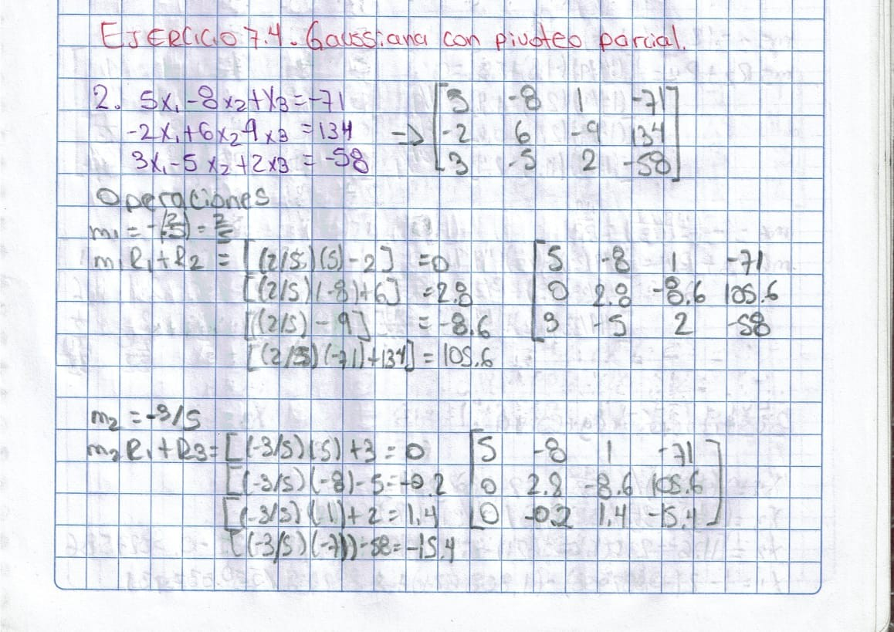{width=600}


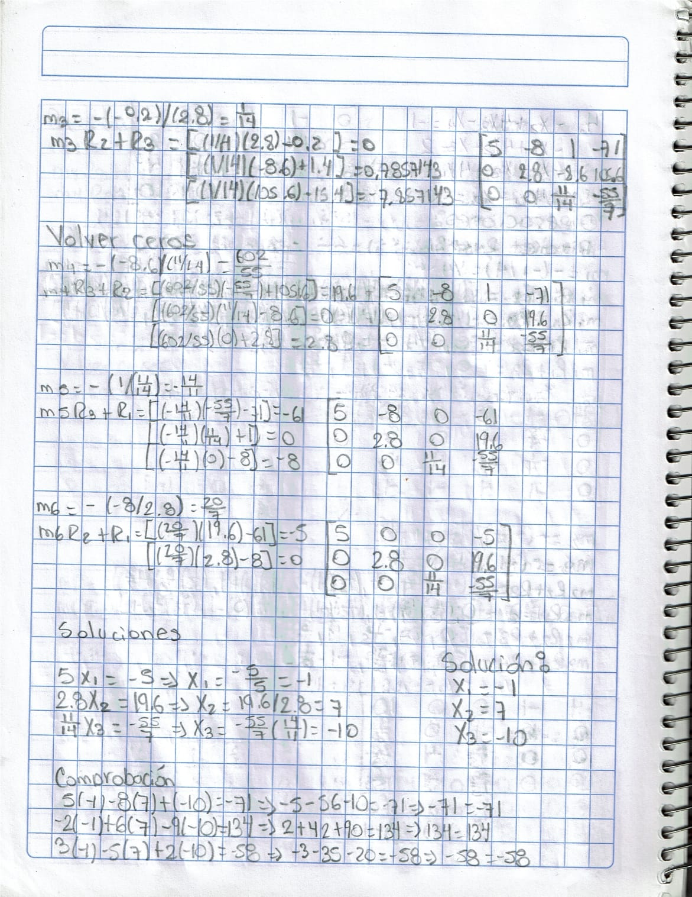{width=600}

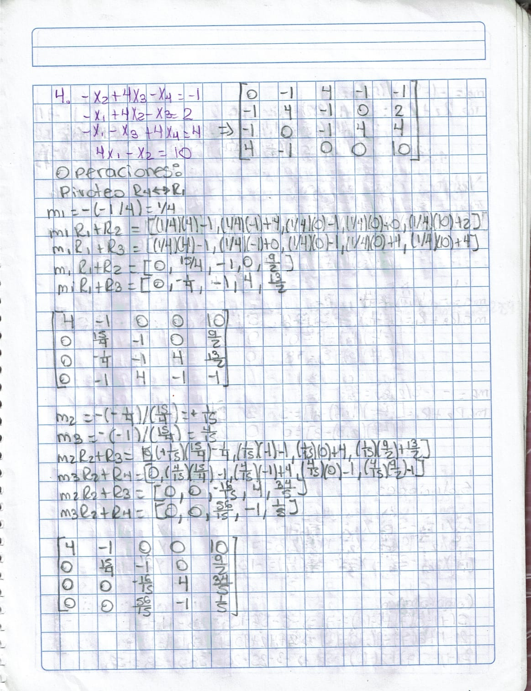{width=600}

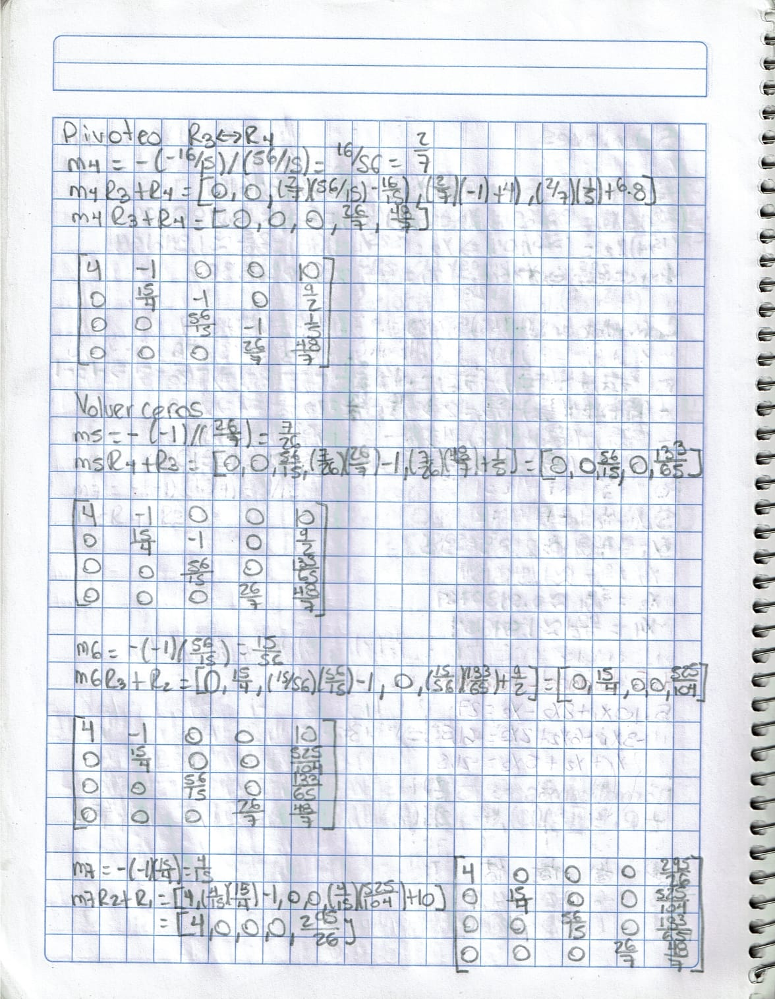{width=600}

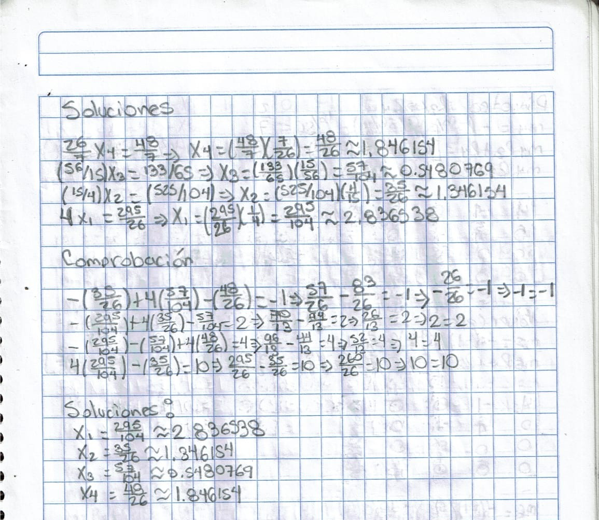{width=600}

#### Sistema $1$

$0.4x_1 - 1.5x_2 + 0.75x_3 = -20$

$-0.5x_1 - 15x_2 + 10x_3 = -10$

$-10x_1 - 9x_2 + 2.5x_3 = 30$

##### Procedimiento

```{r}

A <- matrix(c(0.4, -1.5, 0.75,
              -0.5, -15, 10,
              -10, -9, 2.5),
      nrow = 3, byrow = TRUE)
b <- matrix(c(-20, -10, 30), nrow = 3)

Ab <- cbind(A, b); (Ab)

```

###### Primera eliminación  

```{r}
# Primer pivoteo

NuevaA <- Ab[c(3, 2, 1), ]
(NuevaA)
```

```{r}
# Volver ceros

m1 <- - Ab[2,1] / Ab[1,1]
m2 <- - Ab[3,1] / Ab[1,1]
R1 <- NuevaA[1,]
R2 <- m1 * Ab[1,] + Ab[2,]
R3 <- m2 * Ab[1,] + Ab[3,]
NuevaA <- rbind(R1, R2, R3)
(NuevaA)
```

###### Segunda eliminación

```{r}
# Segundo pivoteo

Ab <- NuevaA[c(1, 3, 2), ]
(Ab)
```

```{r}
# Volver ceros 

m3 <- - Ab[3,2] / Ab[2,2]
R1 <- Ab[1,]
R2 <- Ab[2,]
R3 <- m3 * Ab[2,] + Ab[3,]
NuevaA <- rbind(R1, R2, R3)
(NuevaA)
```

Volver ceros con eliminación hacía atrás

```{r}
# Tercera columna

Ab <- NuevaA; (Ab)
m4 <- - Ab[2,3] / Ab[3,3]
m5 <- - Ab[1,3] / Ab[3,3]
R1 <- m5 * Ab[3,] + Ab[1,]
R2 <- m4 * Ab[3,] + Ab[2,]
R3 <- Ab[3,]

NuevaA<- rbind(R1, R2, R3)
(NuevaA)
```

```{r}
# Segunda columna

Ab <- NuevaA; (Ab)
m6 <- - Ab[1,2] / Ab[2,2]

R1 <- m6 * Ab[2,] + Ab[1,]
R2 <- Ab[2,]
R3 <- Ab[3,]

NuevaA <- rbind(R1, R2, R3)
(NuevaA)
```

```{r}
# Soluciones

Ab <- NuevaA; (Ab)
x1 <- Ab[1,4] / Ab[1,1]
x2 <- Ab[2,4] / Ab[2,2]
x3 <- Ab[3,4] / Ab[3,3]
```

```{r}
# Comprobación

I <- b[1,]; (I)
II <- b[2,]; (II)
III <- b[3,]; (III)
c1 <- (A[1,1] * x1) + (A[1,2] * x2) + (A[1,3] * x3); paste0("El resultado es: ",c1)
c2 <- (A[2,1] * x1) + (A[2,2] * x2) + (A[2,3] * x3); paste0("El resultado es: ",c2)
c3 <- (A[3,1] * x1) + (A[3,2] * x2) + (A[3,3] * x3); paste0("El resultado es: ",c3)

paste0("En la ecuación 1: ", c1, " tecnicamente es: ", I)
paste0("En la ecuación 2: ", c2, " tecnicamente es: ", II)
paste0("En la ecuación 3: ", c3, " tecnicamente es: ", III)
```

##### Resultados

```{r}
cat("Soluciones del sistema:")
cat("x1 =", x1)
cat("x2 =", x2) 
cat("x3 =", x3)
```

#### Sistema $2$

$5x_1 - 8x_2 + x_3 = -71$

$-2x_1 + 6x_2 - 9x_3 = 134$

$3x_1 - 5x_2 + 2x_3 = -58$

##### Procedimiento

```{r}

A <- matrix(c(5, -8, 1,
              -2, 6, -9,
              3, -5, 2),
      nrow = 3, byrow = TRUE)
b <- matrix(c(-71, 134, -58), nrow = 3)

Ab <- cbind(A, b); (Ab)

```

###### Primera eliminación 

No se necesita hacer el pivoteo ya que se encuentra acomodado

```{r}
# Volver ceros

m1 <- - Ab[2,1] / Ab[1,1]
m2 <- - Ab[3,1] / Ab[1,1]
R1 <- Ab[1,]
R2 <- m1 * Ab[1,] + Ab[2,]
R3 <- m2 * Ab[1,] + Ab[3,]
NuevaA <- rbind(R1, R2, R3)
(NuevaA)
```

###### Segunda eliminación

Tampoco se necesita pivoteo en esta ocasión

```{r}
# Volver ceros

Ab <- NuevaA
m3 <- - Ab[3,2] / Ab[2,2]
R1 <- Ab[1,]
R2 <- Ab[2,]
R3 <- m3 * Ab[2,] + Ab[3,]
NuevaA <- rbind(R1, R2, R3)
(NuevaA)
```

Volver ceros con eliminación hacía atrás

```{r}
# Tercera columna

Ab <- NuevaA; (Ab)
m4 <- - Ab[2,3] / Ab[3,3]
m5 <- - Ab[1,3] / Ab[3,3]
R1 <- m5 * Ab[3,] + Ab[1,]
R2 <- m4 * Ab[3,] + Ab[2,]
R3 <- Ab[3,]

NuevaA <- rbind(R1, R2, R3)
(NuevaA)
```

```{r}
# Segunda columna

Ab <- NuevaA; (Ab)
m6 <- - Ab[1,2] / Ab[2,2]

R1 <- m6 * Ab[2,] + Ab[1,]
R2 <- Ab[2,]
R3 <- Ab[3,]

NuevaA <- rbind(R1, R2, R3)
(NuevaA)
```

```{r}
# Soluciones

Ab <- NuevaA; (Ab)
x1 <- Ab[1,4] / Ab[1,1]
x2 <- Ab[2,4] / Ab[2,2]
x3 <- Ab[3,4] / Ab[3,3]
```

```{r}
# Comprobación

I <- b[1,]; (I)
II <- b[2,]; (II)
III <- b[3,]; (III)
c1 <- (A[1,1] * x1) + (A[1,2] * x2) + (A[1,3] * x3); paste0("El resultado es: ",c1)
c2 <- (A[2,1] * x1) + (A[2,2] * x2) + (A[2,3] * x3); paste0("El resultado es: ",c2)
c3 <- (A[3,1] * x1) + (A[3,2] * x2) + (A[3,3] * x3); paste0("El resultado es: ",c3)

paste0("En la ecuación 1: ", c1, " tecnicamente es: ", I)
paste0("En la ecuación 2: ", c2, " tecnicamente es: ", II)
paste0("En la ecuación 3: ", c3, " tecnicamente es: ", III)
```

##### Resultados

```{r}
cat("Soluciones del sistema:")
cat("x1 =", x1)
cat("x2 =", x2) 
cat("x3 =", x3)
```

#### Sistema $3$

$0.003000x_1 + 59.14x_2 = 59.17$

$5.291x_1 - 6.130x_2 = 46.78$

Utilice redondeo a 4 cifras significativas

##### Procedimiento

```{r}

A <- matrix(c(0.003000, 59.14,
              5.291, -6.130),
      nrow = 2, byrow = TRUE)
b <- matrix(c(59.17, 46.78), nrow = 2)

Ab <- cbind(A, b); (Ab)

```

###### Primera eliminación 

```{r}
# Primer pivoteo

NuevaA <- Ab[c(2, 1), ]
(NuevaA)
```

```{r}
# Volver ceros 

Ab <- NuevaA
m1 <- - Ab[2,1] / Ab[1,1]
R1 <- Ab[1,]
R2 <- round(m1 * Ab[1,] + Ab[2,], 4)
NuevaA <- rbind(R1, R2)
(NuevaA)
```

Volver ceros con eliminación hacía atrás

```{r}
# Segunda columna

Ab <- NuevaA; (Ab)
m2 <- - Ab[1,2] / Ab[2,2]
R1 <- round(m2 * Ab[2,] + Ab[1,], 4)
R3 <- Ab[2,]

NuevaA <- rbind(R1, R2)
(NuevaA)
```

```{r}
# Soluciones

Ab <- NuevaA; (Ab)
x1 <- round(Ab[1,3] / Ab[1,1], 4)
x2 <- round(Ab[2,3] / Ab[2,2], 4)
```

```{r}
# Comprobación

I <- b[1,]; (I)
II <- b[2,]; (II)
c1 <- round((A[1,1] * x1) + (A[1,2] * x2), 4); paste0("El resultado es: ", c1)
c2 <- round((A[2,1] * x1) + (A[2,2] * x2), 4); paste0("El resultado es: ", c2)

paste0("En la ecuación 1: ", c1, " tecnicamente es: ", I)
paste0("En la ecuación 2: ", c2, " tecnicamente es: ", II)

```

##### Resultados

```{r}
cat("Soluciones del sistema:")
cat("x1 =", x1)
cat("x2 =", x2) 
```

#### Sistema $4$

$-x_2 + 4x_3 - x_4 = -1$

$-x_1 + 4x_2 - x_3 = 2$

$-x_1 - x_3 + x_4 = 4$

$4x_1 - x_2 = 10$

##### Procedimiento

```{r}

A <- matrix(c(0, -1, 4, -1,
              -1, 4, -1, 0,
              -1, 0, -1, 4,
              4, -1, 0, 0),
      nrow = 4, byrow = TRUE)
b <- matrix(c(-1, 2, 4, 10), nrow = 4)

Ab <- cbind(A, b); (Ab)

```

###### Primera eliminación  

```{r}
# Primer pivoteo

NuevaA <- Ab[c(4, 3, 2, 1), ]
(NuevaA)
```

```{r}
# Volver ceros

Ab <- NuevaA
m1 <- - Ab[2,1] / Ab[1,1]
m2 <- - Ab[3,1] / Ab[1,1]
R1 <- Ab[1,]
R2 <- m1 * Ab[1,] + Ab[2,]
R3 <- m2 * Ab[1,] + Ab[3,]
R4 <- Ab[4,]
NuevaA <- rbind(R1, R2, R3, R4)
(NuevaA)
```

###### Segunda eliminación

```{r}
# Segundo pivoteo

Ab<- NuevaA[c(1,3,2,4), ]
(Ab)
```

```{r}
# Volver ceros 

m3 <- - Ab[3,2] / Ab[2,2]
m4 <- - Ab[4,2] / Ab[2,2]
R1 <- Ab[1,]
R2 <- Ab[2,]
R3 <- m3 * Ab[2,] + Ab[3,]
R4 <- m4 * Ab[2,] + Ab[4,]
NuevaA <- rbind(R1, R2, R3, R4)
(NuevaA)
```

###### Tercera eliminación

```{r}
# Segundo pivoteo

Ab<- NuevaA[c(1, 2, 4, 3), ]
(Ab)
```

```{r}
# Volver ceros 

m5 <- - Ab[4,3] / Ab[3,3]
R1 <- Ab[1,]
R2 <- Ab[2,]
R3 <- Ab[3,]
R4 <- m5 * Ab[3,] + Ab[4,]
NuevaA <- rbind(R1, R2, R3, R4)
(NuevaA)
```

Volver ceros con eliminación hacía atrás

```{r}
# Cuarta columna

Ab <- NuevaA; (Ab)
m6 <- - Ab[3,4] / Ab[4,4]
R1 <- Ab[1,]
R2 <- Ab[2,]
R3 <- m6 * Ab[4,] + Ab[3,]
R4 <- Ab[4,]

NuevaA <- rbind(R1, R2, R3, R4)
(NuevaA)
```

```{r}
# Tercera columna

Ab <- NuevaA; (Ab)
m7 <- - Ab[2,3] / Ab[3,3]

R1 <- Ab[1,]
R2 <- m7 * Ab[3,] + Ab[2,]
R3 <- Ab[3,]
R4 <- Ab[4,]
NuevaA<- rbind(R1, R2, R3, R4)
(NuevaA)
```

```{r}
# Segunda columna

Ab <- NuevaA; (Ab)
m8 <- - Ab[1,2] / Ab[2,2]

R1 <- m8 * Ab[2,] + Ab[1,]
R2 <- Ab[2,]
R3 <- Ab[3,]
R4 <- Ab[4,]
NuevaA<- rbind(R1, R2, R3, R4)
(NuevaA)
```

```{r}
# Soluciones

Ab<- NuevaA; (Ab)
x1<- Ab[1,5] / Ab[1,1]
x2<- Ab[2,5] / Ab[2,2]
x3<- Ab[3,5] / Ab[3,3]
x4<- Ab[4,5] / Ab[4,4]
```

```{r}
# Comprobación

I <- b[1,]; (I)
II <- b[2,]; (II)
III <- b[3,]; (III)
IV <- b[4,]; (IV)
c1 <- (A[1,1] * x1) + (A[1,2] * x2) + (A[1,3] * x3) + (A[1,4] * x4); paste0("El resultado es: ",c1)
c2 <- (A[2,1] * x1) + (A[2,2] * x2) + (A[2,3] * x3) + (A[2,4] * x4); paste0("El resultado es: ",c2)
c3 <- (A[3,1] * x1) + (A[3,2] * x2) + (A[3,3] * x3) + (A[3,4] * x4); paste0("El resultado es: ",c3)
c4 <- (A[4,1] * x1) + (A[4,2] * x2) + (A[4,3] * x3) + (A[4,4] * x4); paste0("El resultado es: ",c4)

paste0("En la ecuación 1: ", c1, " tecnicamente es: ", I)
paste0("En la ecuación 2: ", c2, " tecnicamente es: ", II)
paste0("En la ecuación 3: ", c3, " tecnicamente es: ", III)
paste0("En la ecuación 3: ", c4, " tecnicamente es: ", IV)
```

##### Resultados

```{r}
cat("Soluciones del sistema:")
cat("x1 =", x1)
cat("x2 =", x2) 
cat("x3 =", x3)
cat("x4 =", x4)
```

#### Sistema $5$

$0.00031000x_1 + 1.000000x_2 = 3.000000$

$1.00045534x_1 - 1.00034333x_2 = 7.000$

##### Procedimiento

```{r}

A <- matrix(c(0.00031000, 1.000000,
              1.00045534, 1.00034333),
      nrow = 2, byrow = TRUE)
b <- matrix(c(3.000000, 7.000), nrow = 2)

Ab <- cbind(A, b); (Ab)

```

###### Primera eliminación 

```{r}
# Primer pivoteo

NuevaA <- Ab[c(2, 1), ]
(NuevaA)
```

```{r}
# Volver ceros

Ab <- NuevaA
m1 <- - Ab[2,1] / Ab[1,1]
R1 <- Ab[1,]
R2 <- m1 * Ab[1,] + Ab[2,]
NuevaA <- rbind(R1, R2)
(NuevaA)
```

Volver ceros con eliminación hacía atrás

```{r}
# Segunda columna

Ab <- NuevaA; (Ab)
m2 <- - Ab[1,2] / Ab[2,2]
R1 <- m2 * Ab[2,] + Ab[1,]
R3 <- Ab[2,]

NuevaA <- rbind(R1, R2)
(NuevaA)
```

```{r}
# Soluciones

Ab <- NuevaA; (Ab)
x1 <- Ab[1,3] / Ab[1,1]
x2 <- Ab[2,3] / Ab[2,2]
```

```{r}
# Comprobación

I <- b[1,]; (I)
II <- b[2,]; (II)
c1 <- (A[1,1] * x1) + (A[1,2] * x2); paste0("El resultado es: ", c1)
c2 <- (A[2,1] * x1) + (A[2,2] * x2); paste0("El resultado es: ", c2)

paste0("En la ecuación 1: ", c1, " tecnicamente es: ", I)
paste0("En la ecuación 2: ", c2, " tecnicamente es: ", II)
```

##### Resultados

```{r}
cat("Soluciones del sistema:")
cat("x1 =", x1)
cat("x2 =", x2)
```

#### Sistema $6$

$A=\begin{bmatrix} 14 & 14 & -9 &  3 &  -5 \\ 14 & 52 & -15 &  2 &  -32 \\ -9 & -15 & 36 &  -5 &  16 \\ 3 &  2 &  -15 &  47 &  49 \\ -5 &  32 &  16 &  49 &  79 \end{bmatrix}$

$b=\begin{bmatrix} -15 \\ -100 \\ 106 \\ 329 \\ 463\end{bmatrix}$

$X=\begin{bmatrix} x_1\\ x_2 \\ x_3 \\ x_4 \\ x_5 \end{bmatrix}$

$Resolver para A$

##### Procedimiento

```{r}

A <- matrix(c(14, 14, -9, 3, -5,
              14, 52, -15, 2, -32,
              -9, -15, 36, -5, 16,
              3, 2, -5, 47, 49,
              -5, 32, 16, 49, 79),
      nrow = 5, byrow = TRUE)
b <- matrix(c(-15, -100, 106, 329, 463), nrow = 5)

Ab <- cbind(A, b); (Ab)

```

###### Primera eliminación 

No se necesita realizar pivoteo

```{r}
# Volver ceros

m1 <- - Ab[2,1] / Ab[1,1]
m2 <- - Ab[3,1] / Ab[1,1]
m3 <- - Ab[4,1] / Ab[1,1]
m4 <- - Ab[5,1] / Ab[1,1]

R1 <- Ab[1,]
R2 <- m1 * Ab[1,] + Ab[2,]
R3 <- m2 * Ab[1,] + Ab[3,]
R4 <- m3 * Ab[1,] + Ab[4,]
R5 <- m4 * Ab[1,] + Ab[5,]
NuevaA <- rbind(R1, R2, R3, R4, R5)
(NuevaA)
```

###### Segunda eliminación 

No se necesita realizar pivoteo

```{r}
# Volver ceros

Ab <- NuevaA; (Ab)

m5 <- - Ab[3,2] / Ab[2,2]
m6 <- - Ab[4,2] / Ab[2,2]
m7 <- - Ab[5,2] / Ab[2,2]

R1 <- Ab[1,]
R2 <- Ab[2,]
R3 <- m5 * Ab[2,] + Ab[3,]
R4 <- m6 * Ab[2,] + Ab[4,]
R5 <- m7 * Ab[2,] + Ab[5,]
NuevaA <- rbind(R1, R2, R3, R4, R5)
(NuevaA)
```
###### Tercera eliminación 

```{r}
# Primer pivoteo

Ab<- NuevaA[c(1, 2, 5, 4, 3), ]
(Ab)
```

```{r}
# Volver ceros

Ab <- NuevaA; (Ab)

m5 <- - Ab[3,2] / Ab[2,2]
m6 <- - Ab[4,2] / Ab[2,2]
m7 <- - Ab[5,2] / Ab[2,2]

R1 <- Ab[1,]
R2 <- Ab[2,]
R3 <- m5 * Ab[2,] + Ab[3,]
R4 <- m6 * Ab[2,] + Ab[4,]
R5 <- m7 * Ab[2,] + Ab[5,]
NuevaA <- rbind(R1, R2, R3, R4, R5)
(NuevaA)
```

###### Cuarta eliminación 

No se necesita hacer pivoteo

```{r}
# Volver ceros 

Ab <- NuevaA; (Ab)

m8 <- - Ab[4,3] / Ab[3,3]
m9 <- - Ab[5,3] / Ab[3,3]

R1 <- Ab[1,]
R2 <- Ab[2,]
R3 <- Ab[3,]
R4 <- m8 * Ab[3,] + Ab[4,]
R5 <- m9 * Ab[3,] + Ab[5,]
NuevaA <- rbind(R1, R2, R3, R4, R5)
(NuevaA)
```

###### Quinta eliminación 

```{r}
# Segundo pivoteo

Ab<- NuevaA[c(1, 2, 3, 5, 4), ]
(Ab)
```

```{r}
# Volver ceros 

Ab <- NuevaA; (Ab)

m10 <- - Ab[5,4] / Ab[4,4]

R1 <- Ab[1,]
R2 <- Ab[2,]
R3 <- Ab[3,]
R4 <- Ab[4,]
R5 <- m10 * Ab[4,] + Ab[5,]
NuevaA <- rbind(R1, R2, R3, R4, R5)
(NuevaA)
```

Volver ceros con eliminación hacía atrás

```{r}
# Quinta columna

Ab <- NuevaA; (Ab)
m11 <- - Ab[1,5] / Ab[5,5]
m12 <- - Ab[2,5] / Ab[5,5]
m13 <- - Ab[3,5] / Ab[5,5]
m14 <- - Ab[4,5] / Ab[5,5]
R1 <- m11 * Ab[5,] + Ab[1,]
R2 <- m12 * Ab[5,] + Ab[2,]
R3 <- m13 * Ab[5,] + Ab[3,]
R4 <- m14 * Ab[5,] + Ab[4,]
R5 <- Ab[5,]

NuevaA <- rbind(R1, R2, R3, R4, R5)
(NuevaA)
```

```{r}
# Cuarta columna

Ab <- NuevaA; (Ab)
m15 <- - Ab[1,4] / Ab[4,4]
m16 <- - Ab[2,4] / Ab[4,4]
m17 <- - Ab[3,4] / Ab[4,4]
R1 <- m15 * Ab[4,] + Ab[1,]
R2 <- m16 * Ab[4,] + Ab[2,]
R3 <- m17 * Ab[4,] + Ab[3,]
R4 <- Ab[4,]
R5 <- Ab[5,]

NuevaA <- rbind(R1, R2, R3, R4, R5)
(NuevaA)
```

```{r}
# Tercera columna

Ab <- NuevaA; (Ab)
m18 <- - Ab[1,3] / Ab[3,3]
m19 <- - Ab[2,3] / Ab[3,3]
R1 <- m18 * Ab[3,] + Ab[1,]
R2 <- m19 * Ab[3,] + Ab[2,]
R3 <- Ab[3,]
R4 <- Ab[4,]
R5 <- Ab[5,]

NuevaA <- rbind(R1, R2, R3, R4, R5)
(NuevaA)
```

```{r}
# Segunda columna

Ab <- NuevaA; (Ab)
m20 <- - Ab[1,2] / Ab[2,2]
R1 <- m20 * Ab[2,] + Ab[1,]
R2 <- Ab[2,]
R3 <- Ab[3,]
R4 <- Ab[4,]
R5 <- Ab[5,]

NuevaA <- rbind(R1, R2, R3, R4, R5)
(NuevaA)
```

```{r}
# Soluciones

Ab <- NuevaA; (Ab)
X <- matrix(c(1, 2, 3, 4, 5), nrow = 5)

X[1,] <- Ab[1,6] / Ab[1,1]
X[2,] <- Ab[2,6] / Ab[2,2]
X[3,] <- Ab[3,6] / Ab[3,3]
X[4,] <- Ab[4,6] / Ab[4,4]
X[5,] <- Ab[5,6] / Ab[5,5]
```

```{r}
# Comprobaciónç

I <- b[1,]; (I)
II <- b[2,]; (II)
III <- b[3,]; (III)
IV <- b[4,]; (IV)
V <- b[5,]; (V)
c1 <- (A[1,1] * X[1,]) + (A[1,2] * X[2,]) + (A[1,3] * X[3,]) + (A[1,4] * X[4,]) + (A[1,5] * X[5,]); paste0("El resultado es: ", c1)
c2 <- (A[2,1] * X[1,]) + (A[2,2] * X[2,]) + (A[2,3] * X[3,]) + (A[2,4] * X[4,]) + (A[2,5] * X[5,]); paste0("El resultado es: ", c2)
c3 <- (A[3,1] * X[1,]) + (A[3,2] * X[2,]) + (A[3,3] * X[3,]) + (A[3,4] * X[4,]) + (A[3,5] * X[5,]); paste0("El resultado es: ", c3)
c4 <- (A[4,1] * X[1,]) + (A[4,2] * X[2,]) + (A[4,3] * X[3,]) + (A[4,4] * X[4,]) + (A[4,5] * X[5,]); paste0("El resultado es: ", c4)
c5 <- (A[5,1] * X[1,]) + (A[5,2] * X[2,]) + (A[5,3] * X[3,]) + (A[5,4] * X[4,]) + (A[5,5] * X[5,]); paste0("El resultado es: ", c5)
paste0("En la ecuación 1: ", c1, " tecnicamente es: ", I)
paste0("En la ecuación 2: ", c2, " tecnicamente es: ", II)
paste0("En la ecuación 3: ", c3, " tecnicamente es: ", III)
paste0("En la ecuación 4: ", c4, " tecnicamente es: ", IV)
paste0("En la ecuación 5: ", c5, " tecnicamente es: ", V)
```

##### Resultados

```{r}
cat("Soluciones del sistema:")
cat("x1 = ", X[1,])
cat("x2 = ", X[2,]) 
cat("x3 = ", X[3,])
cat("x4 = ", X[4,])
cat("x5 = ", X[5,])
```

#### Sistema $7$

$A=\begin{bmatrix} \frac{1}{4} & \frac{1}{5} & \frac{1}{6} \\ \frac{1}{3} & \frac{1}{4} & \frac{1}{5} \\ \frac{1}{2} & 1 & 2 \end{bmatrix}$

$b=\begin{bmatrix} 9 \\ 8 \\ 8 \end{bmatrix}$

$X=\begin{bmatrix} x_1\\ x_2 \\ x_3 \end{bmatrix}$

$Resolver para A$

##### Procedimiento

```{r}

A <- matrix(c(1/4, 1/5, 1/6,
              1/3, 1/4, 1/5,
              1/2, 1, 2),
      nrow = 3, byrow = TRUE)
b <- matrix(c(9, 8, 8), nrow = 3)

Ab <- cbind(A, b); (Ab)

```

###### Primera eliminación

```{r}
# Primer pivoteo

Ab<- Ab[c(3, 2, 1), ]
(Ab)
```

```{r}
# Volver ceros

m1 <- - Ab[2,1] / Ab[1,1]
m2 <- - Ab[3,1] / Ab[1,1]

R1 <- Ab[1,]
R2 <- m1 * Ab[1,] + Ab[2,]
R3 <- m2 * Ab[1,] + Ab[3,]
NuevaA <- rbind(R1, R2, R3)
(NuevaA)
```

###### Segunda eliminación 

No se necesita realizar pivoteo

```{r}
# Volver ceros

Ab <- NuevaA; (Ab)

m3 <- - Ab[3,2] / Ab[2,2]

R1 <- Ab[1,]
R2 <- Ab[2,]
R3 <- m3 * Ab[2,] + Ab[3,]
NuevaA <- rbind(R1, R2, R3)
(NuevaA)
```

Volver ceros con eliminación hacía atrás

```{r}
# Tercera columna

Ab <- NuevaA; (Ab)
m4 <- - Ab[1,3] / Ab[3,3]
m5 <- - Ab[2,3] / Ab[3,3]
R1 <- m4 * Ab[3,] + Ab[1,]
R2 <- m5 * Ab[3,] + Ab[2,]
R3 <- Ab[3,]

NuevaA <- rbind(R1, R2, R3)
(NuevaA)
```

```{r}
# Segunda columna

Ab <- NuevaA; (Ab)
m6 <- - Ab[1,2] / Ab[2,2]
R1 <- m6 * Ab[2,] + Ab[1,]
R2 <- Ab[2,]
R3 <- Ab[3,]

NuevaA <- rbind(R1, R2, R3)
(NuevaA)
```

```{r}
# Soluciones

Ab <- NuevaA; (Ab)
X <- matrix(c(1, 2, 3), nrow = 3)

X[1,] <- Ab[1,4] / Ab[1,1]
X[2,] <- Ab[2,4] / Ab[2,2]
X[3,] <- Ab[3,4] / Ab[3,3]
```

```{r}
# Comprobación

I <- b[1,]; (I)
II <- b[2,]; (II)
III <- b[3,]; (III)

c1 <- (A[1,1] * X[1,]) + (A[1,2] * X[2,]) + (A[1,3] * X[3,]); paste0("El resultado es: ", c1)
c2 <- (A[2,1] * X[1,]) + (A[2,2] * X[2,]) + (A[2,3] * X[3,]); paste0("El resultado es: ", c2)
c3 <- (A[3,1] * X[1,]) + (A[3,2] * X[2,]) + (A[3,3] * X[3,]); paste0("El resultado es: ", c3)

paste0("En la ecuación 1: ", c1, " tecnicamente es: ", I)
paste0("En la ecuación 2: ", c2, " tecnicamente es: ", II)
paste0("En la ecuación 3: ", c3, " tecnicamente es: ", III)
```

##### Resultados

```{r}
cat("Soluciones del sistema:")
cat("x1 = ", X[1,])
cat("x2 = ", X[2,]) 
cat("x3 = ", X[3,])
```

#### Sistema $8$

$A=\begin{bmatrix} 1 & \frac{1}{2} & \frac{1}{3} & \frac{1}{4} \\ \frac{1}{2} & \frac{1}{3} & \frac{1}{4} & \frac{1}{5} \\ \frac{1}{3} & \frac{1}{4} & \frac{1}{5} & \frac{1}{6} \\ \frac{1}{4} & \frac{1}{5} & \frac{1}{6} & \frac{1}{7} \end{bmatrix}$

$b=\begin{bmatrix} \frac{1}{6} \\ \frac{1}{7} \\ \frac{1}{8} \\ \frac{1}{9} \end{bmatrix}$

$X=\begin{bmatrix} x_1\\ x_2 \\ x_3 \\ x_4 \end{bmatrix}$

$Resolver para A$

##### Procedimiento

```{r}

A <- matrix(c(1, 1/2, 1/3, 1/4,
              1/2, 1/3, 1/4, 1/5,
              1/3, 1/4, 1/5, 1/6,
              1/4, 1/5, 1/6, 1/7),
      nrow = 4, byrow = TRUE)
b <- matrix(c(1/6, 1/7, 1/8, 1/9), nrow = 4)

Ab <- cbind(A, b); (Ab)

```

###### Primera eliminación

No se necesita pivoteo

```{r}
# Volver ceros 

m1 <- - Ab[2,1] / Ab[1,1]
m2 <- - Ab[3,1] / Ab[1,1]
m3 <- - Ab[4,1] / Ab[1,1]

R1 <- Ab[1,]
R2 <- m1 * Ab[1,] + Ab[2,]
R3 <- m2 * Ab[1,] + Ab[3,]
R4 <- m3 * Ab[1,] + Ab[4,]
NuevaA <- rbind(R1, R2, R3, R4)
(NuevaA)
```

###### Segunda eliminación 

No se necesita realizar pivoteo

```{r}
# Volver ceros

Ab <- NuevaA; (Ab)

m4 <- - Ab[3,2] / Ab[2,2]
m5 <- - Ab[4,2] / Ab[2,2]

R1 <- Ab[1,]
R2 <- Ab[2,]
R3 <- m4 * Ab[2,] + Ab[3,]
R4 <- m5 * Ab[2,] + Ab[4,]
NuevaA <- rbind(R1, R2, R3, R4)
(NuevaA)
```

###### Tercera eliminación 

No se necesita realizar pivoteo

```{r}
# Volver ceros

Ab <- NuevaA; (Ab)

m6 <- - Ab[4,3] / Ab[3,3]


R1 <- Ab[1,]
R2 <- Ab[2,]
R3 <- Ab[3,]
R4 <- m6 * Ab[3,] + Ab[4,]
NuevaA <- rbind(R1, R2, R3, R4)
(NuevaA)
```

Volver ceros con eliminación hacía atrás

```{r}
# Cuarta columna

Ab <- NuevaA; (Ab)
m7 <- - Ab[1,4] / Ab[4,4]
m8 <- - Ab[2,4] / Ab[4,4]
m9 <- - Ab[3,4] / Ab[4,4]
R1 <- m7 * Ab[4,] + Ab[1,]
R2 <- m8 * Ab[4,] + Ab[2,]
R3 <- m9 * Ab[4,] + Ab[3,]
R4 <- Ab[4,]

NuevaA <- rbind(R1, R2, R3, R4)
(NuevaA)
```

```{r}
# Tercera columna

Ab <- NuevaA; (Ab)
m10 <- - Ab[1,3] / Ab[3,3]
m11 <- - Ab[2,3] / Ab[3,3]
R1 <- m10 * Ab[3,] + Ab[1,]
R2 <- m11 * Ab[3,] + Ab[2,]
R3 <- Ab[3,]
R4 <- Ab[4,]

NuevaA <- rbind(R1, R2, R3, R4)
(NuevaA)
```

```{r}
# Segunda columna

Ab <- NuevaA; (Ab)
m12 <- - Ab[1,2] / Ab[2,2]
R1 <- m12 * Ab[2,] + Ab[1,]
R2 <- Ab[2,]
R3 <- Ab[3,]
R4 <- Ab[4,]

NuevaA <- rbind(R1, R2, R3, R4)
(NuevaA)
```

```{r}
# Soluciones

Ab <- NuevaA; (Ab)
X <- matrix(c(1, 2, 3, 4), nrow = 4)

X[1,] <- Ab[1,5] / Ab[1,1]
X[2,] <- Ab[2,5] / Ab[2,2]
X[3,] <- Ab[3,5] / Ab[3,3]
X[4,] <- Ab[4,5] / Ab[4,4]
```

```{r}
# Comprobación

I <- b[1,]; (I)
II <- b[2,]; (II)
III <- b[3,]; (III)
IV <- b[4,]; (IV)

c1 <-  (A[1,1] * X[1,]) + (A[1,2] * X[2,]) + (A[1,3] * X[3,]) + (A[1,4] * X[4,]); paste0("El resultado es: ", c1)
c2 <- (A[2,1] * X[1,]) + (A[2,2] * X[2,]) + (A[2,3] * X[3,]) + (A[2,4] * X[4,]); paste0("El resultado es: ", c2)
c3 <- (A[3,1] * X[1,]) + (A[3,2] * X[2,]) + (A[3,3] * X[3,]) + (A[3,4] * X[4,]); paste0("El resultado es: ", c3)
c4 <- (A[4,1] * X[1,]) + (A[4,2] * X[2,]) + (A[4,3] * X[3,]) + (A[4,4] * X[4,]); paste0("El resultado es: ", c4)

paste0("En la ecuación 1: ", c1, " tecnicamente es: ", I)
paste0("En la ecuación 2: ", c2, " tecnicamente es: ", II)
paste0("En la ecuación 3: ", c3, " tecnicamente es: ", III)
paste0("En la ecuación 4: ", c4, " tecnicamente es: ", IV)
```

##### Resultados

```{r}
cat("Soluciones del sistema:")
cat("x1 = ", X[1,])
cat("x2 = ", X[2,]) 
cat("x3 = ", X[3,])
cat("x4 = ", X[4,])
```

#### Sistema $9$

$2x_1 + x_2 − x_3 + x_4 − 3x_5 = 7$

$x_1 + 2x3 − x4 + x5 = 2$

$− 2x_2 − x_3 + x_4 − x_5 = − 5$

$3x_1 + x_2 − 4x_3 + 5x_5 = 6$

$x_1 − x_2 − x_3 − x_4 + x_5 = 3$

##### Procedimiento

```{r}

A <- matrix(c(2, 1, -1, 1, -3,
              1, 0, 2, -1, 1,
              0, -2, -1, 1, -1,
              3, 1, -4, 0, 5,
              1, -1, -1, -1, 1),
      nrow = 5, byrow = TRUE)
b <- matrix(c(7, 2, -5, 6, 3), nrow = 5)

Ab <- cbind(A, b); (Ab)

```

###### Primera eliminación 

```{r}
# Primer pivoteo

NuevaA <- Ab[c(4,2, 3, 1, 5), ]
(NuevaA)
```

```{r}
# Volver ceros 

Ab <- NuevaA
m1 <- - Ab[2,1] / Ab[1,1]
m2 <- - Ab[3,1] / Ab[1,1]
m3 <- - Ab[4,1] / Ab[1,1]
m4 <- - Ab[5,1] / Ab[1,1]
R1 <- Ab[1,]
R2 <- m1 * Ab[1,] + Ab[2,]
R3 <- m2 * Ab[1,] + Ab[3,]
R4 <- m3 * Ab[1,] + Ab[4,]
R5 <- m4 * Ab[1,] + Ab[5,]
NuevaA <- rbind(R1, R2, R3, R4, R5)
(NuevaA)
```

###### Segunda Eliminación

```{r}
# Segundo pivoteo

Ab <- NuevaA[c(1,3, 2, 4, 5), ]
(Ab)
```

```{r}
# Volver ceros 

Ab <- NuevaA
m5 <- - Ab[3,2] / Ab[2,2]
m6 <- - Ab[4,2] / Ab[2,2]
m7 <- - Ab[5,2] / Ab[2,2]
R1 <- Ab[1,]
R2 <- Ab[2,]
R3 <- m5 * Ab[2,] + Ab[3,]
R4 <- m6 * Ab[2,] + Ab[4,]
R5 <- m7 * Ab[2,] + Ab[5,]
NuevaA <- rbind(R1, R2, R3, R4, R5)
(NuevaA)
```

###### Tercera Eliminación

No necesita pivoteo

```{r}
# Volver ceros 

Ab <- NuevaA
m8 <- - Ab[4,3] / Ab[3,3]
m9 <- - Ab[5,3] / Ab[3,3]
R1 <- Ab[1,]
R2 <- Ab[2,]
R3 <- Ab[3,]
R4 <- m8 * Ab[3,] + Ab[4,]
R5 <- m9 * Ab[3,] + Ab[5,]
NuevaA <- rbind(R1, R2, R3, R4, R5)
(NuevaA)
```

###### Cuarta Eliminación

No necesita pivoteo

```{r}
# Volver ceros

Ab <- NuevaA
m10 <- - Ab[5,4] / Ab[4,4]
R1 <- Ab[1,]
R2 <- Ab[2,]
R3 <- Ab[3,]
R4 <- Ab[4,]
R5 <- m10 * Ab[4,] + Ab[5,]
NuevaA <- rbind(R1, R2, R3, R4, R5)
(NuevaA)
```

Volver ceros con eliminación hacía atrás

```{r}
# Quinta columna

Ab <- NuevaA; (Ab)
m11 <- - Ab[1,5] / Ab[5,5]
m12 <- - Ab[2,5] / Ab[5,5]
m13 <- - Ab[3,5] / Ab[5,5]
m14 <- - Ab[4,5] / Ab[5,5]
R1 <- m11 * Ab[5,] + Ab[1,]
R2 <- m12 * Ab[5,] + Ab[2,]
R3 <- m13 * Ab[5,] + Ab[3,]
R4 <- m14 * Ab[5,] + Ab[4,]
R5 <- Ab[5,]

NuevaA <- rbind(R1, R2, R3, R4, R5)
(NuevaA)
```

```{r}
# Cuarta columna

Ab <- NuevaA; (Ab)
m15 <- - Ab[1,4] / Ab[4,4]
m16 <- - Ab[2,4] / Ab[4,4]
m17 <- - Ab[3,4] / Ab[4,4]
R1 <- m15 * Ab[4,] + Ab[1,]
R2 <- m16 * Ab[4,] + Ab[2,]
R3 <- m17 * Ab[4,] + Ab[3,]
R4 <- Ab[4,]
R5 <- Ab[5,]

NuevaA <- rbind(R1, R2, R3, R4, R5)
(NuevaA)
```

```{r}
# Tercera columna

Ab <- NuevaA; (Ab)
m18 <- - Ab[1,3] / Ab[3,3]
m19 <- - Ab[2,3] / Ab[3,3]
R1 <- m18 * Ab[3,] + Ab[1,]
R2 <- m19 * Ab[3,] + Ab[2,]
R3 <- Ab[3,]
R4 <- Ab[4,]
R5 <- Ab[5,]

NuevaA <- rbind(R1, R2, R3, R4, R5)
(NuevaA)
```

```{r}
# Segunda columna

Ab <- NuevaA; (Ab)
m20 <- - Ab[1,2] / Ab[2,2]
R1 <- m20 * Ab[2,] + Ab[1,]
R2 <- Ab[2,]
R3 <- Ab[3,]
R4 <- Ab[4,]
R5 <- Ab[5,]

NuevaA <- rbind(R1, R2, R3, R4, R5)
(NuevaA)
```

```{r}
# Soluciones

Ab <- NuevaA; (Ab)
X <- matrix(c(1, 2, 3, 4, 5), nrow = 5)

X[1,] <- Ab[1,6] / Ab[1,1]
X[2,] <- Ab[2,6] / Ab[2,2]
X[3,] <- Ab[3,6] / Ab[3,3]
X[4,] <- Ab[4,6] / Ab[4,4]
X[5,] <- Ab[5,6] / Ab[5,5]
```

```{r}
# Comprobación

I <- b[1,]; (I)
II <- b[2,]; (II)
III <- b[3,]; (III)
IV <- b[4,]; (IV)
V <- b[5,]; (V)
c1 <- (A[1,1] * X[1,]) + (A[1,2] * X[2,]) + (A[1,3] * X[3,]) + (A[1,4] * X[4,]) + (A[1,5] * X[5,]); paste0("El resultado es: ", c1)
c2 <- (A[2,1] * X[1,]) + (A[2,2] * X[2,]) + (A[2,3] * X[3,]) + (A[2,4] * X[4,]) + (A[2,5] * X[5,]); paste0("El resultado es: ", c2)
c3 <- - (A[3,1] * X[1,]) + (A[3,2] * X[2,]) + (A[3,3] * X[3,]) + (A[3,4] * X[4,]) + (A[3,5] * X[5,]); paste0("El resultado es: ", c3)
c4 <- (A[4,1] * X[1,]) + (A[4,2] * X[2,]) + (A[4,3] * X[3,]) + (A[4,4] * X[4,]) + (A[4,5] * X[5,]); paste0("El resultado es: ", c4)
c5 <- (A[5,1] * X[1,]) + (A[5,2] * X[2,]) + (A[5,3] * X[3,]) + (A[5,4] * X[4,]) + (A[5,5] * X[5,]); paste0("El resultado es: ", c5)
paste0("En la ecuación 1: ", c1, " tecnicamente es: ", I)
paste0("En la ecuación 2: ", c2, " tecnicamente es: ", II)
paste0("En la ecuación 3: ", c3, " tecnicamente es: ", III)
paste0("En la ecuación 4: ", c4, " tecnicamente es: ", IV)
paste0("En la ecuación 5: ", c5, " tecnicamente es: ", V)
```

##### Resultados 

```{r}
cat("Soluciones del sistema:")
cat("x1 = ", X[1,])
cat("x2 = ", X[2,]) 
cat("x3 = ", X[3,])
cat("x4 = ", X[4,])
cat("x5 = ", X[5,])
```

#### Sistema $10$

$3.333x_1 + 15920x_2 − 10.333x_3 = 15913$

$2.222x_1 + 16.71x_2 ? 9.612x_3 = 28.544$

$1.5611x_1 + 5.1791x_2 + 1.6852x_3 = 8.4254$

##### Procedimiento

```{r}

A <- matrix(c(3.333, 15920, -10.333,
              2.222, 16.71, 9.612,
              1.5611, 5.1791, 1.6852),
      nrow = 3, byrow = TRUE)
b <- matrix(c(15913, 28.544, 8.4254), nrow = 3)

Ab <- cbind(A, b); (Ab)

```

###### Primera eliminación 

No necesita pivoteo

```{r}
# Volver ceros

m1 <- - Ab[2,1] / Ab[1,1]
m2 <- - Ab[3,1] / Ab[1,1]
R1 <- Ab[1,]
R2 <- m1 * Ab[1,] + Ab[2,]
R3 <- m2 * Ab[1,] + Ab[3,]
NuevaA <- rbind(R1, R2, R3)
(NuevaA)
```

###### Segunda Eliminación

No necesita pivoteo

```{r}
# Volver ceros 

Ab <- NuevaA
m3 <- - Ab[3,2] / Ab[2,2]
R1 <- Ab[1,]
R2 <- Ab[2,]
R3 <- m3 * Ab[2,] + Ab[3,]
NuevaA <- rbind(R1, R2, R3)
(NuevaA)
```

Volver ceros con eliminación hacía atrás

```{r}
# Tercera columna

Ab <- NuevaA; (Ab)
m4 <- - Ab[1,3] / Ab[3,3]
m5 <- - Ab[2,3] / Ab[3,3]
R1 <- m4 * Ab[3,] + Ab[1,]
R2 <- m5 * Ab[3,] + Ab[2,]
R3 <- Ab[3,]

NuevaA <- rbind(R1, R2, R3)
(NuevaA)
```

```{r}
# Segunda columna

Ab <- NuevaA; (Ab)
m6 <- - Ab[1,2] / Ab[2,2]
R1 <- m6 * Ab[2,] + Ab[1,]
R2 <- Ab[2,]
R3 <- Ab[3,]

NuevaA <- rbind(R1, R2, R3)
(NuevaA)
```

```{r}
# Soluciones

Ab <- NuevaA; (Ab)
X <- matrix(c(1, 2, 3), nrow = 3)

X[1,] <- Ab[1,4] / Ab[1,1]
X[2,] <- Ab[2,4] / Ab[2,2]
X[3,] <- Ab[3,4] / Ab[3,3]
```

```{r}
# Comprobación

I <- b[1,]; (I)
II <- b[2,]; (II)
III <- b[3,]; (III)

c1 <- (A[1,1] * X[1,]) + (A[1,2] * X[2,]) + (A[1,3] * X[3,]); paste0("El resultado es: ", c1)
c2 <- (A[2,1] * X[1,]) + (A[2,2] * X[2,]) + (A[2,3] * X[3,]); paste0("El resultado es: ", c2)
c3 <- (A[3,1] * X[1,]) + (A[3,2] * X[2,]) + (A[3,3] * X[3,]); paste0("El resultado es: ", c3)

paste0("En la ecuación 1: ", c1, " tecnicamente es: ", I)
paste0("En la ecuación 2: ", c2, " tecnicamente es: ", II)
paste0("En la ecuación 3: ", c3, " tecnicamente es: ", III)
```

##### Resultados

```{r}
cat("Soluciones del sistema:")
cat("x1 = ", X[1,])
cat("x2 = ", X[2,]) 
cat("x3 = ", X[3,])
```

### $7.5.$ Eliminación Gauss-Jordan (Método directo)

#### Ejercicios a mano

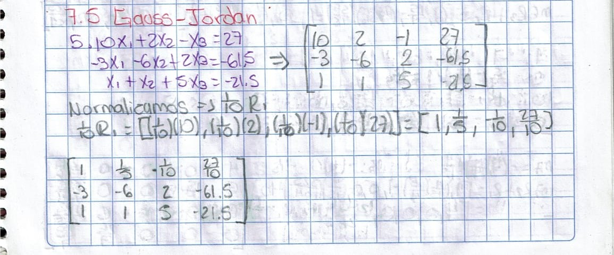{width=600}

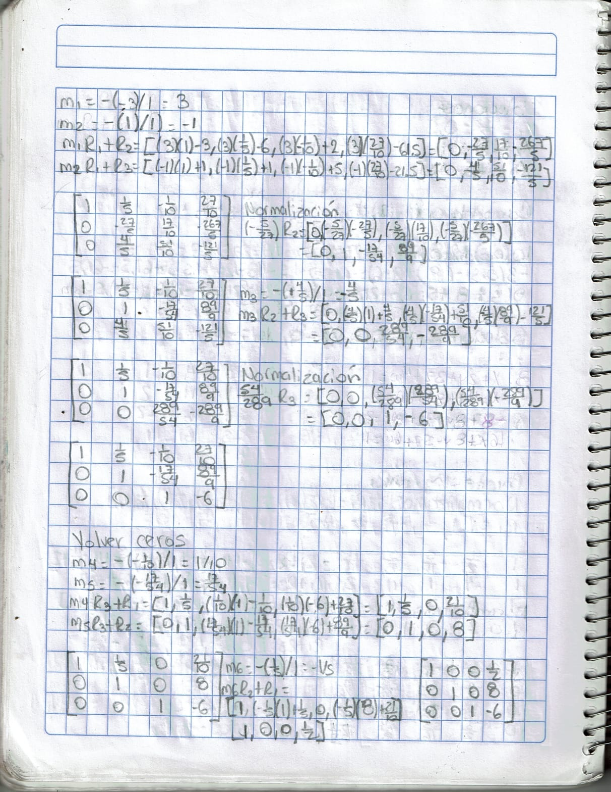{width=600}

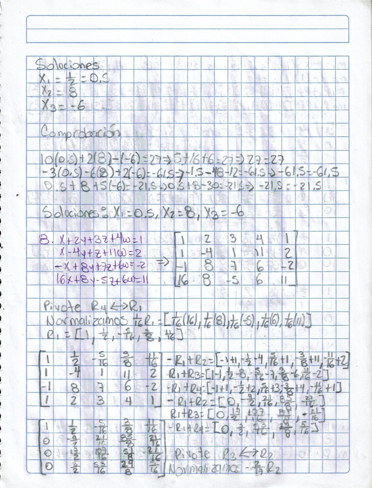{width=600}

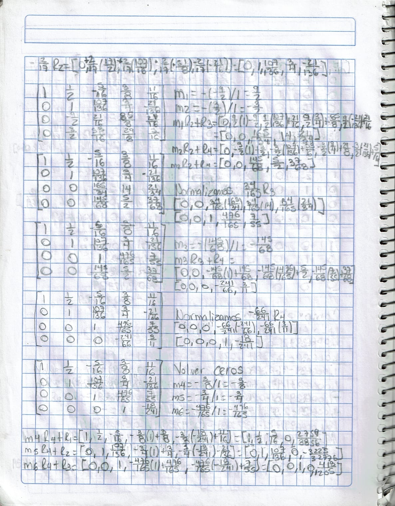{width=600}


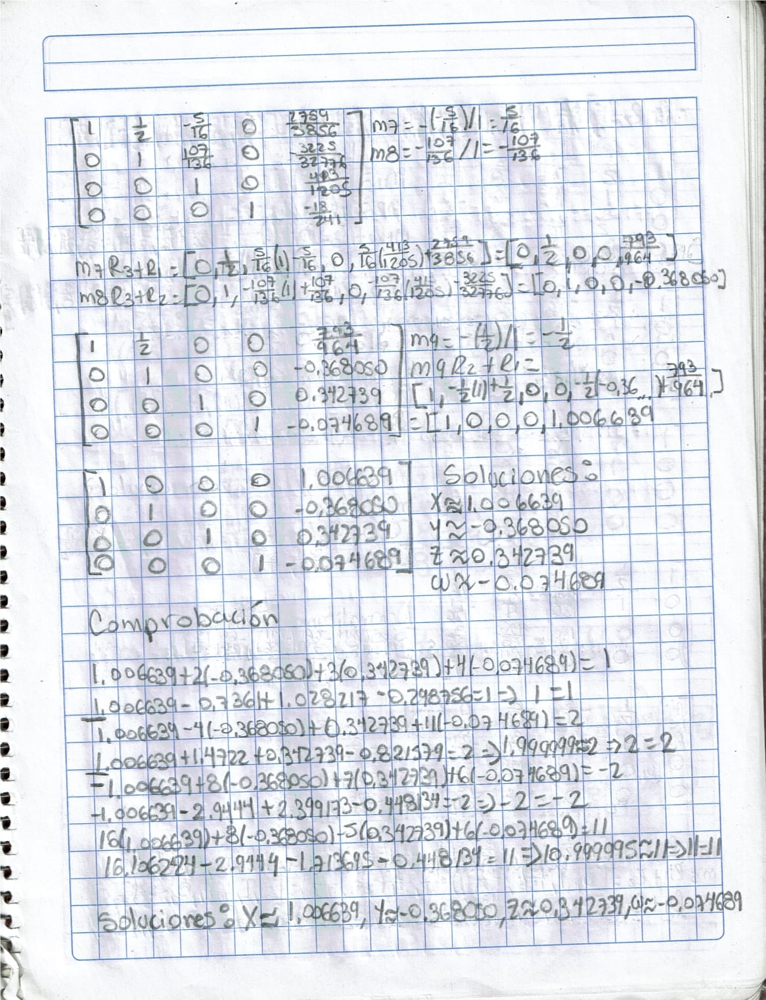{width=600}


#### Sistema $1$

$x_1 + 2x_2 + 3x_3 = 1$

$−0.4x_1 + 2x_2 − x_3 = 10$

$0.5x_1 − 3x_2 + x_3 = 15$

##### Procedimiento

```{r}

A <- matrix(c(1, 2, 3,
              -0.4, 2, -1,
              0.5, -3, 1),
      nrow = 3, byrow = TRUE)
b <- matrix(c(1, 10, 15), nrow = 3)

Ab <- cbind(A, b); (Ab)

```

###### Primera eliminación  

```{r}
m1 <- - Ab[2,1] / Ab[1,1]
(m1)
m2 <- - Ab[3,1] / Ab[1,1]
(m2)
A1 <- Ab[1,]
(A1)
A2 <- m1 * Ab[1,] + Ab[2,]
(A2)
A3 <- m2 * Ab[1,] + Ab[3,]
(A3)
NuevaA <- rbind(A1, A2, A3)
(NuevaA)
```

```{r}
# Primer pivote

Ab <- NuevaA[c(1, 3, 2), ]
(Ab)
```

```{r}
# Primera normalización

n1 <- 1 / Ab[2,2]
A1 <- Ab[1,]
A2 <- n1 * Ab[2,]
(A2)
A3 <- Ab[3,]
NuevaA <- rbind(A1, A2, A3)
(NuevaA)
```

###### Segunda eliminación

```{r}
Ab <- NuevaA
m3 <- - Ab[1,2] / Ab[2,2]
(m3)
m4 <- - Ab[3,2] / Ab[2,2]
(m4)
A1 <- m3 * Ab[2,] + Ab[1,]
A2 <- Ab[2,]
A3 <- m4 * Ab[2,] + Ab[3,]
(A3)
NuevaA <- rbind(A1, A2, A3)
(NuevaA)
```

```{r}
# Segunda normalización

Ab <- NuevaA
n2 <- 1 / Ab[3,3]
A1 <- Ab[1,]
A2 <- Ab[2,]
A3 <- n2 * Ab[3,]
(A3)
NuevaA <- rbind(A1, A2, A3)
(NuevaA)
```

###### Tercera eliminación

```{r}
Ab <- NuevaA
m5 <- - Ab[1,3] / Ab[3,3]
(m5)
m6 <- - Ab[2,3] / Ab[3,3]
(m6)
A1 <- m5 * Ab[3,] + Ab[1,]
A2 <- m6 * Ab[3,] + Ab[2,]
A3 <- Ab[3,]
(A3)
NuevaA <- rbind(A1, A2, A3)
(NuevaA)
```

```{r}
# Soluciones

Ab <- NuevaA; (Ab)
x1 <- Ab[1,4] / Ab[1,1]
x2 <- Ab[2,4] / Ab[2,2]
x3 <- Ab[3,4] / Ab[3,3]
```

```{r}
# Comprobación

I <- b[1,]; (I)
II <- b[2,]; (II)
III <- b[3,]; (III)
c1 <- (A[1,1] * x1) + (A[1,2] * x2) + (A[1,3] * x3); paste0("El resultado es: ",c1)
c2 <- (A[2,1] * x1) + (A[2,2] * x2) + (A[2,3] * x3); paste0("El resultado es: ",c2)
c3 <- (A[3,1] * x1) + (A[3,2] * x2) + (A[3,3] * x3); paste0("El resultado es: ",c3)

paste0("En la ecuación 1: ", c1, " tecnicamente es: ", I)
paste0("En la ecuación 2: ", c2, " tecnicamente es: ", II)
paste0("En la ecuación 3: ", c3, " tecnicamente es: ", III)
```

##### Resultados

```{r}
cat("Soluciones del sistema:")
cat("x1 =", x1)
cat("x2 =", x2) 
cat("x3 =", x3)
```

#### Sistema $2$

$2x_1 − 0.9x_2 + 3x_3 = −3.61$

$−0.5x_1 + 0.1x_2 − x_3 = 2.035$

$x_1 − 6.35x_2 − 0.45x_3 = 15.401$

##### Procedimiento

```{r}

A <- matrix(c(2, -0.9, 3,
              -0.5, 0.1, -1,
              1, -6.35, -0.45),
      nrow = 3, byrow = TRUE)
b <- matrix(c(-3.61, 2.035, 15.401), nrow = 3)

Ab <- cbind(A, b); (Ab)

```

###### Primera eliminación

```{r}
# Primera normalización

n1 <- 1 / Ab[1,1]
A1 <- n1 * Ab[1,]
(A1)
A2 <- Ab[2,]
A3 <- Ab[3,]
NuevaA <- rbind(A1, A2, A3)
(NuevaA)
```

```{r}
# Volver ceros
Ab <- NuevaA
m1 <- - Ab[2,1] / Ab[1,1]
(m1)
m2 <- - Ab[3,1] / Ab[1,1]
(m2)
A1 <- Ab[1,]
(A1)
A2 <- m1 * Ab[1,] + Ab[2,]
(A2)
A3 <- m2 * Ab[1,] + Ab[3,]
(A3)
NuevaA <- rbind(A1, A2, A3)
(NuevaA)
```

###### Segunda eliminación

```{r}
# Primer pivote

Ab <- NuevaA[c(1, 3, 2), ]
(Ab)
```

```{r}
# Segunda normalización

n1 <- 1 / Ab[2,2]
A1 <- Ab[1,]
A2 <- n1 * Ab[2,]
(A2)
A3 <- Ab[3,]
NuevaA <- rbind(A1, A2, A3)
(NuevaA)
```

```{r}
# Volver ceros

Ab <- NuevaA
m3 <- - Ab[1,2] / Ab[2,2]
(m3)
m4 <- - Ab[3,2] / Ab[2,2]
(m4)
A1 <- m3 * Ab[2,] + Ab[1,]
A2 <- Ab[2,]
A3 <- m4 * Ab[2,] + Ab[3,]
(A3)
NuevaA <- rbind(A1, A2, A3)
(NuevaA)
```

###### Tercera eliminación

```{r}
# Tercera normalización

Ab <- NuevaA
n2 <- 1 / Ab[3,3]
A1 <- Ab[1,]
A2 <- Ab[2,]
A3 <- n2 * Ab[3,]
(A3)
NuevaA <- rbind(A1, A2, A3)
(NuevaA)
```

```{r}
# Volver ceros

Ab <- NuevaA
m5 <- - Ab[1,3] / Ab[3,3]
(m5)
m6 <- - Ab[2,3] / Ab[3,3]
(m6)
A1 <- m5 * Ab[3,] + Ab[1,]
A2 <- m6 * Ab[3,] + Ab[2,]
A3 <- Ab[3,]
(A3)
NuevaA <- rbind(A1, A2, A3)
(NuevaA)
```

```{r}
# Soluciones

Ab <- NuevaA; (Ab)
x1 <- Ab[1,4] / Ab[1,1]
x2 <- Ab[2,4] / Ab[2,2]
x3 <- Ab[3,4] / Ab[3,3]
```

```{r}
# Comprobación

I <- b[1,]; (I)
II <- b[2,]; (II)
III <- b[3,]; (III)
c1 <- (A[1,1] * x1) + (A[1,2] * x2) + (A[1,3] * x3); paste0("El resultado es: ",c1)
c2 <- (A[2,1] * x1) + (A[2,2] * x2) + (A[2,3] * x3); paste0("El resultado es: ",c2)
c3 <- (A[3,1] * x1) + (A[3,2] * x2) + (A[3,3] * x3); paste0("El resultado es: ",c3)

paste0("En la ecuación 1: ", c1, " tecnicamente es: ", I)
paste0("En la ecuación 2: ", c2, " tecnicamente es: ", II)
paste0("En la ecuación 3: ", c3, " tecnicamente es: ", III)
```

##### Resultados
```{r}
cat("Soluciones del sistema:")
cat("x1 =", x1)
cat("x2 =", x2) 
cat("x3 =", x3)
```

#### Sistema $3$

$0.7x_1 + 2.7x_2 − 6x_3 + 0.7x_4 = 1.6487$

$2x_1 − 0.8x_2 + 3x_3 − x_4 = −2.342$

$−x_1 − 1.5x_2 + 1.4x_3 + 3x_4 = −4.189$

$7x_2 − 1.56x_3 + x_4 = 15.792$

##### Procedimiento

```{r}

A <- matrix(c(0.7, 2.7, -6, 0.7,
              2, -0.8, 3, -1,
              -1, -1.5, 1.4, 3,
              0, 7, -1.56, 1),
      nrow = 4, byrow = TRUE)
b <- matrix(c(1.6487, -2.342, -4.189, 15.792), nrow = 4)

Ab <- cbind(A, b); (Ab)

```

###### Primera eliminación

```{r}
# Primera normalización

n1 <- 1 / Ab[1,1]
A1 <- n1 * Ab[1,]
(A1)
A2 <- Ab[2,]
A3 <- Ab[3,]
A4 <- Ab[4,]
NuevaA <- rbind(A1, A2, A3, A4)
(NuevaA)
```

```{r}
# Volver ceros

Ab <- NuevaA
m1 <- - Ab[2,1] / Ab[1,1]
(m1)
m2 <- - Ab[3,1] / Ab[1,1]
(m2)
A1 <- Ab[1,]
(A1)
A2 <- m1 * Ab[1,] + Ab[2,]
(A2)
A3 <- m2 * Ab[1,] + Ab[3,]
(A3)
A4 <- Ab[4,]
(A4)
NuevaA <- rbind(A1, A2, A3, A4)
(NuevaA)
```

###### Segunda eliminación

```{r}
# Segunda normalización

Ab <- NuevaA
n <- 1 / Ab[2,2]
A1 <- Ab[1,]
A2 <- n * Ab[2,]
(A2)
A3 <- Ab[3,]
A4 <- Ab[4,]
NuevaA <- rbind(A1, A2, A3, A4)
(NuevaA)
```

```{r}
# Volver ceros

Ab <- NuevaA
m3 <- - Ab[1,2] / Ab[2,2]
(m3)
m4 <- - Ab[3,2] / Ab[2,2]
(m4)
m5 <- - Ab[4,2] / Ab[2,2]
(m5)
A1 <- m3 * Ab[2,] + Ab[1,]
A2 <- Ab[2,]
A3 <- m4 * Ab[2,] + Ab[3,]
(A3)
A4 <- m5 * Ab[2,] + Ab[4,]
(A4)
NuevaA <- rbind(A1, A2, A3, A4)
(NuevaA)
```

###### Tercera eliminación

```{r}
# Primer pivote

Ab <- NuevaA[c(1, 2, 4, 3), ]
(Ab)
```

```{r}
# Tercera normalización

Ab <- NuevaA
n2 <- 1 / Ab[3,3]
A1 <- Ab[1,]
A2 <- Ab[2,]
A3 <- n2 * Ab[3,]
(A3)
A4 <- Ab[4,]
NuevaA <- rbind(A1, A2, A3, A4)
(NuevaA)
```

```{r}
# Volver ceros

Ab <- NuevaA
m5 <- - Ab[1,3] / Ab[3,3]
(m5)
m6 <- - Ab[2,3] / Ab[3,3]
(m6)
m7 <- - Ab[4,3] / Ab[3,3]
(m7)
A1 <- m5 * Ab[3,] + Ab[1,]
A2 <- m6 * Ab[3,] + Ab[2,]
A3 <- Ab[3,]
A4 <- m7 * Ab[3,] + Ab[4,]
NuevaA <- rbind(A1, A2, A3, A4)
(NuevaA)
```

###### Cuarta eliminación

```{r}
#  Cuarta normalización

Ab <- NuevaA
n2 <- 1 / Ab[4,4]
A1 <- Ab[1,]
A2 <- Ab[2,]
A3 <- Ab[3,]
A4 <- n2 * Ab[4,]
(A4)
NuevaA <- rbind(A1, A2, A3, A4)
(NuevaA)
```

```{r}
# Volver ceros

Ab <- NuevaA
m5 <- - Ab[1,4] / Ab[4,4]
(m5)
m6 <- - Ab[2,4] / Ab[4,4]
(m6)
m7 <- - Ab[3,4] / Ab[4,4]
(m7)
A1 <- m5 * Ab[4,] + Ab[1,]
A2 <- m6 * Ab[4,] + Ab[2,]
A3 <- m7 * Ab[4,] + Ab[3,]
A4 <- Ab[4,]
NuevaA <- rbind(A1, A2, A3, A4)
(NuevaA)
```

```{r}
# Soluciones

Ab <- NuevaA; (Ab)
x1 <- Ab[1,5] / Ab[1,1]
x2 <- Ab[2,5] / Ab[2,2]
x3 <- Ab[3,5] / Ab[3,3]
x4 <- Ab[4,5] / Ab[4,4]
```

```{r}

# Comprobación
I <- b[1,]; (I)
II <- b[2,]; (II)
III <- b[3,]; (III)
IV <- b[4,]; (IV)
c1 <- (A[1,1] * x1) + (A[1,2] * x2) + (A[1,3] * x3) + (A[1,4] * x4); paste0("El resultado es: ",c1)
c2 <- (A[2,1] * x1) + (A[2,2] * x2) + (A[2,3] * x3) + (A[2,4] * x4); paste0("El resultado es: ",c2)
c3 <- (A[3,1] * x1) + (A[3,2] * x2) + (A[3,3] * x3) + (A[3,4] * x4); paste0("El resultado es: ",c3)
c4 <- (A[4,1] * x1) + (A[4,2] * x2) + (A[4,3] * x3) + (A[4,4] * x4); paste0("El resultado es: ",c4)

paste0("En la ecuación 1: ", c1, " tecnicamente es: ", I)
paste0("En la ecuación 2: ", c2, " tecnicamente es: ", II)
paste0("En la ecuación 3: ", c3, " tecnicamente es: ", III)
paste0("En la ecuación 4: ", c4, " tecnicamente es: ", IV)
```

##### Resultados

```{r}
cat("Soluciones del sistema:")
cat("x1 =", x1)
cat("x2 =", x2) 
cat("x3 =", x3)
cat("x4 =", x4)
```

#### Sistema $4$

$3x_1 − 0.1x_2 − 0.2x_3 = 7.85$

$0.1x_1 + 7x_2 − 0.3x_3 = −19.3$

$0.3x_1 − 0.2x_2 + 10x_3 = 71.4$

##### Procedimiento

```{r}

A <- matrix(c(3, - 0.1, -0.2,
              0.1, 7, -0.3,
              0.3, -0.2, 10),
      nrow = 3, byrow = TRUE)
b <- matrix(c(7.85, -19.3, 71.4), nrow = 3)

Ab <- cbind(A, b); (Ab)

```

###### Primera eliminación

```{r}
# Primera normalización

n1 <- 1 / Ab[1,1]
A1 <- n1 * Ab[1,]
(A1)
A2 <- Ab[2,]
A3 <- Ab[3,]
NuevaA <- rbind(A1, A2, A3)
(NuevaA)
```

```{r}
# Volver ceros

Ab <- NuevaA
m1 <- - Ab[2,1] / Ab[1,1]
(m1)
m2 <- - Ab[3,1] / Ab[1,1]
(m2)
A1 <- Ab[1,]
(A1)
A2 <- m1 * Ab[1,] + Ab[2,]
(A2)
A3 <- m2 * Ab[1,] + Ab[3,]
(A3)
NuevaA <- rbind(A1, A2, A3)
(NuevaA)
```

###### Segunda eliminación

```{r}
# Segunda normalización

Ab <- NuevaA
n1 <- 1 / Ab[2,2]
A1 <- Ab[1,]
A2 <- n1 * Ab[2,]
(A2)
A3 <- Ab[3,]
NuevaA <- rbind(A1, A2, A3)
(NuevaA)
```

```{r}
# Volver ceros

Ab <- NuevaA
m3 <- - Ab[1,2] / Ab[2,2]
(m3)
m4 <- - Ab[3,2] / Ab[2,2]
(m4)
A1 <- m3 * Ab[2,] + Ab[1,]
A2 <- Ab[2,]
A3 <- m4 * Ab[2,] + Ab[3,]
(A3)
NuevaA <- rbind(A1, A2, A3)
(NuevaA)
```

###### Tercera eliminación

```{r}
# Tercera normalización

Ab <- NuevaA
n2 <- 1 / Ab[3,3]
A1 <- Ab[1,]
A2 <- Ab[2,]
A3 <- n2 * Ab[3,]
(A3)
NuevaA <- rbind(A1, A2, A3)
(NuevaA)
```

```{r}
# Volver ceros

Ab <- NuevaA
m5 <- - Ab[1,3] / Ab[3,3]
(m5)
m6 <- - Ab[2,3] / Ab[3,3]
(m6)
A1 <- m5 * Ab[3,] + Ab[1,]
A2 <- m6 * Ab[3,] + Ab[2,]
A3 <- Ab[3,]
(A3)
NuevaA <- rbind(A1, A2, A3)
(NuevaA)
```

```{r}
# Soluciones

Ab <- NuevaA; (Ab)
x1 <- Ab[1,4] / Ab[1,1]
x2 <- Ab[2,4] / Ab[2,2]
x3 <- Ab[3,4] / Ab[3,3]
```

```{r}
# Comprobación

I <- b[1,]; (I)
II <- b[2,]; (II)
III <- b[3,]; (III)
c1 <- (A[1,1] * x1) + (A[1,2] * x2) + (A[1,3] * x3); paste0("El resultado es: ",c1)
c2 <- (A[2,1] * x1) + (A[2,2] * x2) + (A[2,3] * x3); paste0("El resultado es: ",c2)
c3 <- (A[3,1] * x1) + (A[3,2] * x2) + (A[3,3] * x3); paste0("El resultado es: ",c3)

paste0("En la ecuación 1: ", c1, " tecnicamente es: ", I)
paste0("En la ecuación 2: ", c2, " tecnicamente es: ", II)
paste0("En la ecuación 3: ", c3, " tecnicamente es: ", III)
```

##### Resultados

```{r}
cat("Soluciones del sistema:")
cat("x1 =", x1)
cat("x2 =", x2) 
cat("x3 =", x3)
```

#### Sistema $5$

$10x_1 + 2x_2 − x_3 = 27$

$−3x_1 − 6x_2 + 2x_3 = −61.5$

$x_1 + x_2 + 5x_3 = −21.5$

##### Procedimiento

```{r}

A <- matrix(c(10, 2, -1,
              -3, -6, 2,
              1, 1, 5),
      nrow = 3, byrow = TRUE)
b <- matrix(c(27, -61.5, -21.5), nrow = 3)

Ab <- cbind(A, b); (Ab)

```

###### Primera eliminación

```{r}
# Primera normalización

n1 <- 1 / Ab[1,1]
A1 <- n1 * Ab[1,]
(A1)
A2 <- Ab[2,]
A3 <- Ab[3,]
NuevaA <- rbind(A1, A2, A3)
(NuevaA)
```

```{r}
# Vovler ceros

Ab <- NuevaA
m1 <- - Ab[2,1] / Ab[1,1]
(m1)
m2 <- - Ab[3,1] / Ab[1,1]
(m2)
A1 <- Ab[1,]
(A1)
A2 <- m1 * Ab[1,] + Ab[2,]
(A2)
A3 <- m2 * Ab[1,] + Ab[3,]
(A3)
NuevaA <- rbind(A1, A2, A3)
(NuevaA)
```

###### Segunda eliminación

```{r}
# Segunda normalización

Ab <- NuevaA
n1 <- 1 / Ab[2,2]
A1 <- Ab[1,]
A2 <- n1 * Ab[2,]
(A2)
A3 <- Ab[3,]
NuevaA <- rbind(A1, A2, A3)
(NuevaA)
```

```{r}
# Volver ceros

Ab <- NuevaA
m3 <- - Ab[1,2] / Ab[2,2]
(m3)
m4 <- - Ab[3,2] / Ab[2,2]
(m4)
A1 <- m3 * Ab[2,] + Ab[1,]
A2 <- Ab[2,]
A3 <- m4 * Ab[2,] + Ab[3,]
(A3)
NuevaA <- rbind(A1, A2, A3)
(NuevaA)
```

###### Tercera eliminación

```{r}
# Tercera normalización

Ab <- NuevaA
n2 <- 1 / Ab[3,3]
A1 <- Ab[1,]
A2 <- Ab[2,]
A3 <- n2 * Ab[3,]
(A3)
NuevaA <- rbind(A1, A2, A3)
(NuevaA)
```

```{r}
# Volver ceros

Ab <- NuevaA
m5 <- - Ab[1,3] / Ab[3,3]
(m5)
m6 <- - Ab[2,3] / Ab[3,3]
(m6)
A1 <- m5 * Ab[3,] + Ab[1,]
A2 <- m6 * Ab[3,] + Ab[2,]
A3 <- Ab[3,]
(A3)
NuevaA <- rbind(A1, A2, A3)
(NuevaA)
```

```{r}
# Soluciones

Ab <- NuevaA; (Ab)
x1 <- Ab[1,4] / Ab[1,1]
x2 <- Ab[2,4] / Ab[2,2]
x3 <- Ab[3,4] / Ab[3,3]
```

```{r}
# Comprobación

I <- b[1,]; (I)
II <- b[2,]; (II)
III <- b[3,]; (III)
c1 <- (A[1,1] * x1) + (A[1,2] * x2) + (A[1,3] * x3); paste0("El resultado es: ",c1)
c2 <- (A[2,1] * x1) + (A[2,2] * x2) + (A[2,3] * x3); paste0("El resultado es: ",c2)
c3 <- (A[3,1] * x1) + (A[3,2] * x2) + (A[3,3] * x3); paste0("El resultado es: ",c3)

paste0("En la ecuación 1: ", c1, " tecnicamente es: ", I)
paste0("En la ecuación 2: ", c2, " tecnicamente es: ", II)
paste0("En la ecuación 3: ", c3, " tecnicamente es: ", III)
```

##### Resultados

```{r}
cat("Soluciones del sistema:")
cat("x1 =", x1)
cat("x2 =", x2) 
cat("x3 =", x3)
```

#### Sistema $6$

$A=\begin{bmatrix} 1 & 3 & -2 & 1 \\ 1 & 3 & -1 & 2 \\ 0 & 1 & -1 & 4 \\ 2 & 6 & 1 & 2 \end{bmatrix}$

$b=\begin{bmatrix} 4 \\ 1 \\ 5 \\ 2 \end{bmatrix}$

$X=\begin{bmatrix} x_1\\ x_2 \\ x_3 \\ x_4 \end{bmatrix}$

$Resolver para A$

##### Procedimiento

```{r}

A <- matrix(c(1, 3, -2, 1,
              1, 3, -1, 2,
              0, 1, -1, 4,
              2, 6, 1, 2),
      nrow = 4, byrow = TRUE)
b <- matrix(c(4, 1, 5, 2), nrow = 4)

Ab <- cbind(A, b); (Ab)

```

###### Primera eliminación

```{r}
# Primer pivote

Ab <- Ab[c(4, 2, 3, 1), ]
(Ab)
```

```{r}
# Primera normalización

n1 <- 1 / Ab[1,1]
A1 <- n1 * Ab[1,]
(A1)
A2 <- Ab[2,]
A3 <- Ab[3,]
A4 <- Ab[4,]
NuevaA <- rbind(A1, A2, A3, A4)
(NuevaA)
```

```{r}
# Vovler ceros

Ab <- NuevaA
m1 <- - Ab[2,1] / Ab[1,1]
(m1)
m2 <-  - Ab[4,1] / Ab[1,1]
(m2)
A1 <- Ab[1,]
(A1)
A2 <- m1 * Ab[1,] + Ab[2,]
(A2)
A3 <- Ab[3,]
(A3)
A4 <- m2 * Ab[1,] + Ab[4,]
(A4)
NuevaA <- rbind(A1, A2, A3, A4)
(NuevaA)
```

###### Segunda eliminación

```{r}
# Segundo pivote

Ab <- NuevaA[c(1, 3, 2, 4), ]
(Ab)
```

```{r}
# Volver ceros

m1 <- - Ab[1,2] / Ab[2,2]
(m1)
A1 <- m1 * Ab[2,] + Ab[1,] 
(A1)
A2 <- Ab[2,]
(A2)
A3 <- Ab[3,]
(A3)
A4 <- Ab[4,]
(A4)
NuevaA <- rbind(A1, A2, A3, A4)
(NuevaA)
```

###### Tercera eliminación

```{r}
# Tercer pivote

Ab <- NuevaA[c(1, 2, 4, 3), ]
(Ab)
```

```{r}
# Tercera normalización

Ab <- NuevaA
n2 <- 1 / Ab[3,3]
A1 <- Ab[1,]
A2 <- Ab[2,]
A3 <- n2 * Ab[3,]
(A3)
A4 <- Ab[4,]
NuevaA <- rbind(A1, A2, A3, A4)
(NuevaA)
```

```{r}
# Volver ceros

Ab <- NuevaA
m5 <- - Ab[1,3] / Ab[3,3]
(m5)
m6 <- - Ab[2,3] / Ab[3,3]
(m6)
m7 <- - Ab[4,3] / Ab[3,3]
(m7)
A1 <- m5 * Ab[3,] + Ab[1,]
A2 <- m6 * Ab[3,] + Ab[2,]
A3 <- Ab[3,]
A4 <- m7 * Ab[3,] + Ab[4,]
NuevaA <- rbind(A1, A2, A3, A4)
(NuevaA)
```

###### Cuarta eliminación

```{r}
# Cuarta normalización

Ab <- NuevaA
n2 <- 1 / Ab[4,4]
A1 <- Ab[1,]
A2 <- Ab[2,]
A3 <- Ab[3,]
A4 <- n2 * Ab[4,]
(A4)
NuevaA <- rbind(A1, A2, A3, A4)
(NuevaA)
```

```{r}
# Volver ceros

Ab <- NuevaA
m5 <- - Ab[1,4] / Ab[4,4]
(m5)
m6 <- - Ab[2,4] / Ab[4,4]
(m6)
m7 <- - Ab[3,4] / Ab[4,4]
(m7)
A1 <- m5 * Ab[4,] + Ab[1,]
A2 <- m6 * Ab[4,] + Ab[2,]
A3 <- m7 * Ab[4,] + Ab[3,]
A4 <- Ab[4,]
NuevaA <- rbind(A1, A2, A3, A4)
(NuevaA)
```

```{r}
# Soluciones

Ab <- NuevaA; (Ab)
x1 <- Ab[1,5] / Ab[1,1]
x2 <- Ab[2,5] / Ab[2,2]
x3 <- Ab[3,5] / Ab[3,3]
x4 <- Ab[4,5] / Ab[4,4]
```

```{r}
# Comprobación

I <- b[1,]; (I)
II <- b[2,]; (II)
III <- b[3,]; (III)
IV <- b[4,]; (IV)
c1 <- (A[1,1] * x1) + (A[1,2] * x2) + (A[1,3] * x3) + (A[1,4] * x4); paste0("El resultado es: ",c1)
c2 <- (A[2,1] * x1) + (A[2,2] * x2) + (A[2,3] * x3) + (A[2,4] * x4); paste0("El resultado es: ",c2)
c3 <- (A[3,1] * x1) + (A[3,2] * x2) + (A[3,3] * x3) + (A[3,4] * x4); paste0("El resultado es: ",c3)
c4 <- (A[4,1] * x1) + (A[4,2] * x2) + (A[4,3] * x3) + (A[4,4] * x4); paste0("El resultado es: ",c4)

paste0("En la ecuación 1: ", c1, " tecnicamente es: ", I)
paste0("En la ecuación 2: ", c2, " tecnicamente es: ", II)
paste0("En la ecuación 3: ", c3, " tecnicamente es: ", III)
paste0("En la ecuación 4: ", c4, " tecnicamente es: ", IV)
```

##### Resultados

```{r}
cat("Soluciones del sistema:")
cat("x1 =", x1)
cat("x2 =", x2) 
cat("x3 =", x3)
cat("x4 =", x4)
```

#### Sistema $7$

$6x_1 − x_2 − x_3 + 4x_4 = 17$

$x_1 − 10x_2 + 2x_3 − x_4 = −17$

$3x_1 − 2x_2 + 8x_3 − x_4 = 19$

$x_1 + x_2 + x_3 − 5x_4 = −14$

##### Procedimiento

```{r}

A <- matrix(c(6, -1, -1, 4,
              1, -10, 2, -1,
              3, -2, 8, -1,
              1, 1, 1, -5),
      nrow = 4, byrow = TRUE)
b <- matrix(c(17, -17, 19, -14), nrow = 4)

Ab <- cbind(A, b); (Ab)

```


###### Primera eliminación

```{r}
# Primera normalización

n1 <- 1 / Ab[1,1]
A1 <- n1 * Ab[1,]
(A1)
A2 <- Ab[2,]
A3 <- Ab[3,]
A4 <- Ab[4,]
NuevaA <- rbind(A1, A2, A3, A4)
(NuevaA)
```

```{r}
# Volver ceros

Ab <- NuevaA
m1 <- - Ab[2,1] / Ab[1,1]
(m1)
m2 <-  - Ab[3,1] / Ab[1,1]
(m2)
m3 <-  - Ab[4,1] / Ab[1,1]
(m3)
A1 <- Ab[1,]
(A1)
A2 <- m1 * Ab[1,] + Ab[2,]
(A2)
A3 <- m2 * Ab[1,] + Ab[3,]
(A3)
A4 <- m3 * Ab[1,] + Ab[4,]
(A4)
NuevaA <- rbind(A1, A2, A3, A4)
(NuevaA)
```

###### Segunda eliminación

```{r}
# Segunda normalización

Ab <- NuevaA
n1 <- 1 / Ab[2,2]
A1 <- Ab[1,]
A2 <- n1 * Ab[2,]
A3 <- Ab[3,]
A4 <- Ab[4,]
NuevaA <- rbind(A1, A2, A3, A4)
(NuevaA)
```

```{r}
# Volver ceros

Ab <- NuevaA
m1 <- - Ab[1,2] / Ab[2,2]
(m1)
m2 <-  - Ab[3,2] / Ab[2,2]
(m2)
m3 <-  - Ab[4,2] / Ab[2,2]
(m3)
A1 <- m1 * Ab[2,] + Ab[1,] 
(A1)
A2 <- Ab[2,]
(A2)
A3 <- m2 * Ab[2,] + Ab[3,]
(A3)
A4 <- m3 * Ab[2,] + Ab[4,]
(A4)
NuevaA <- rbind(A1, A2, A3, A4)
(NuevaA)
```

###### Tercera eliminación

```{r}
# Tercera normalización

Ab <- NuevaA
n2 <- 1 / Ab[3,3]
A1 <- Ab[1,]
A2 <- Ab[2,]
A3 <- n2 * Ab[3,]
(A3)
A4 <- Ab[4,]
NuevaA <- rbind(A1, A2, A3, A4)
(NuevaA)
```

```{r}
# Volver ceros

Ab <- NuevaA
m5 <- - Ab[1,3] / Ab[3,3]
(m5)
m6 <- - Ab[2,3] / Ab[3,3]
(m6)
m7 <- - Ab[4,3] / Ab[3,3]
(m7)
A1 <- m5 * Ab[3,] + Ab[1,]
A2 <- m6 * Ab[3,] + Ab[2,]
A3 <- Ab[3,]
A4 <- m7 * Ab[3,] + Ab[4,]
NuevaA <- rbind(A1, A2, A3, A4)
(NuevaA)
```

###### Cuarta eliminación

```{r}
# Cuarta normalización

Ab <- NuevaA
n2 <- 1 / Ab[4,4]
A1 <- Ab[1,]
A2 <- Ab[2,]
A3 <- Ab[3,]
A4 <- n2 * Ab[4,]
(A4)
NuevaA <- rbind(A1, A2, A3, A4)
(NuevaA)
```

```{r}
# Volver ceros

Ab <- NuevaA
m5 <- - Ab[1,4] / Ab[4,4]
(m5)
m6 <- - Ab[2,4] / Ab[4,4]
(m6)
m7 <- - Ab[3,4] / Ab[4,4]
(m7)
A1 <- m5 * Ab[4,] + Ab[1,]
A2 <- m6 * Ab[4,] + Ab[2,]
A3 <- m7 * Ab[4,] + Ab[3,]
A4 <- Ab[4,]
NuevaA <- rbind(A1, A2, A3, A4)
(NuevaA)
```

```{r}
# Soluciones

Ab <- NuevaA; (Ab)
x1 <- Ab[1,5] / Ab[1,1]
x2 <- Ab[2,5] / Ab[2,2]
x3 <- Ab[3,5] / Ab[3,3]
x4 <- Ab[4,5] / Ab[4,4]
```

```{r}
# Comprobación

I <- b[1,]; (I)
II <- b[2,]; (II)
III <- b[3,]; (III)
IV <- b[4,]; (IV)
c1 <- (A[1,1] * x1) + (A[1,2] * x2) + (A[1,3] * x3) + (A[1,4] * x4); paste0("El resultado es: ",c1)
c2 <- (A[2,1] * x1) + (A[2,2] * x2) + (A[2,3] * x3) + (A[2,4] * x4); paste0("El resultado es: ",c2)
c3 <- (A[3,1] * x1) + (A[3,2] * x2) + (A[3,3] * x3) + (A[3,4] * x4); paste0("El resultado es: ",c3)
c4 <- (A[4,1] * x1) + (A[4,2] * x2) + (A[4,3] * x3) + (A[4,4] * x4); paste0("El resultado es: ",c4)

paste0("En la ecuación 1: ", c1, " tecnicamente es: ", I)
paste0("En la ecuación 2: ", c2, " tecnicamente es: ", II)
paste0("En la ecuación 3: ", c3, " tecnicamente es: ", III)
paste0("En la ecuación 4: ", c4, " tecnicamente es: ", IV)
```

##### Resultados

```{r}
cat("Soluciones del sistema:")
cat("x1 =", x1)
cat("x2 =", x2) 
cat("x3 =", x3)
cat("x4 =", x4)
```

#### Sistema $8$

$x + 2y + 3z + 4w = 1$

$x − 4y + z + 11w = 2$

$−x + 8y + 7z + 6w = −2$

$16x + 8y − 5z + 6w = 11$

##### Procedimiento

```{r}

A <- matrix(c(1, 2, 3, 4,
              1, -4, 1, 11,
              -1, 8, 7, 6,
              16, 8, -5, 6),
      nrow = 4, byrow = TRUE)
b <- matrix(c(1, 2, -2, 11), nrow = 4)

Ab <- cbind(A, b); (Ab)

```

###### Primera eliminación

```{r}
# Primer pivote

Ab <- Ab[c(4, 2, 3, 1), ]
(Ab)
```

```{r}
# Primera normalización

n1 <- 1 / Ab[1,1]
A1 <- n1 * Ab[1,]
(A1)
A2 <- Ab[2,]
A3 <- Ab[3,]
A4 <- Ab[4,]
NuevaA <- rbind(A1, A2, A3, A4)
(NuevaA)
```

```{r}
# Volver ceros

Ab <- NuevaA
m1 <- - Ab[2,1] / Ab[1,1]
(m1)
m2 <-  - Ab[3,1] / Ab[1,1]
(m2)
m3 <-  - Ab[4,1] / Ab[1,1]
(m3)
A1 <- Ab[1,]
(A1)
A2 <- m1 * Ab[1,] + Ab[2,]
(A2)
A3 <- m2 * Ab[1,] + Ab[3,]
(A3)
A4 <- m3 * Ab[1,] + Ab[4,]
(A4)
NuevaA <- rbind(A1, A2, A3, A4)
(NuevaA)
```

###### Segunda eliminación

```{r}
# Segundo pivote

Ab <- NuevaA[c(1, 3, 2, 4), ]
(Ab)
```

```{r}
# Segunda normalización

n1 <- 1 / Ab[2,2]
A1 <- Ab[1,]
A2 <- n1 * Ab[2,]
A3 <- Ab[3,]
A4 <- Ab[4,]
NuevaA <- rbind(A1, A2, A3, A4)
(NuevaA)
```

```{r}
# Volver ceros

Ab <- NuevaA
m1 <- - Ab[1,2] / Ab[2,2]
(m1)
m2 <-  - Ab[3,2] / Ab[2,2]
(m2)
m3 <-  - Ab[4,2] / Ab[2,2]
(m3)
A1 <- m1 * Ab[2,] + Ab[1,] 
(A1)
A2 <- Ab[2,]
(A2)
A3 <- m2 * Ab[2,] + Ab[3,]
(A3)
A4 <- m3 * Ab[2,] + Ab[4,]
(A4)
NuevaA <- rbind(A1, A2, A3, A4)
(NuevaA)
```

###### Tercera eliminación

```{r}
# Tercera normalización

Ab <- NuevaA
n2 <- 1 / Ab[3,3]
A1 <- Ab[1,]
A2 <- Ab[2,]
A3 <- n2 * Ab[3,]
(A3)
A4 <- Ab[4,]
NuevaA <- rbind(A1, A2, A3, A4)
(NuevaA)
```

```{r}
# Volver ceros

Ab <- NuevaA
m5 <- - Ab[1,3] / Ab[3,3]
(m5)
m6 <- - Ab[2,3] / Ab[3,3]
(m6)
m7 <- - Ab[4,3] / Ab[3,3]
(m7)
A1 <- m5 * Ab[3,] + Ab[1,]
A2 <- m6 * Ab[3,] + Ab[2,]
A3 <- Ab[3,]
A4 <- m7 * Ab[3,] + Ab[4,]
NuevaA <- rbind(A1, A2, A3, A4)
(NuevaA)
```

###### Cuarta eliminación

```{r}
# Cuarta normalización

Ab <- NuevaA
n2 <- 1 / Ab[4,4]
A1 <- Ab[1,]
A2 <- Ab[2,]
A3 <- Ab[3,]
A4 <- n2 * Ab[4,]
(A4)
NuevaA <- rbind(A1, A2, A3, A4)
(NuevaA)
```

```{r}
# Volver ceros

Ab <- NuevaA
m5 <- - Ab[1,4] / Ab[4,4]
(m5)
m6 <- - Ab[2,4] / Ab[4,4]
(m6)
m7 <- - Ab[3,4] / Ab[4,4]
(m7)
A1 <- m5 * Ab[4,] + Ab[1,]
A2 <- m6 * Ab[4,] + Ab[2,]
A3 <- m7 * Ab[4,] + Ab[3,]
A4 <- Ab[4,]
NuevaA <- rbind(A1, A2, A3, A4)
(NuevaA)
```

```{r}
# Soluciones

Ab <- NuevaA; (Ab)
x <- Ab[1,5] / Ab[1,1]
y <- Ab[2,5] / Ab[2,2]
z <- Ab[3,5] / Ab[3,3]
w <- Ab[4,5] / Ab[4,4]
```

```{r}
# Comprobación

I <- b[1,]; (I)
II <- b[2,]; (II)
III <- b[3,]; (III)
IV <- b[4,]; (IV)
c1 <- (A[1,1] * x) + (A[1,2] * y) + (A[1,3] * z) + (A[1,4] * w); paste0("El resultado es: ",c1)
c2 <- (A[2,1] * x) + (A[2,2] * y) + (A[2,3] * z) + (A[2,4] * w); paste0("El resultado es: ",c2)
c3 <- (A[3,1] * x) + (A[3,2] * y) + (A[3,3] * z) + (A[3,4] * w); paste0("El resultado es: ",c3)
c4 <- (A[4,1] * x) + (A[4,2] * y) + (A[4,3] * z) + (A[4,4] * w); paste0("El resultado es: ",c4)

paste0("En la ecuación 1: ", c1, " tecnicamente es: ", I)
paste0("En la ecuación 2: ", c2, " tecnicamente es: ", II)
paste0("En la ecuación 3: ", c3, " tecnicamente es: ", III)
paste0("En la ecuación 4: ", c4, " tecnicamente es: ", IV)
```

##### Resultados

```{r}
cat("Soluciones del sistema:")
cat("x =", x)
cat("y =", y) 
cat("z =", z)
cat("w =", w)
```

#### Sistema $9$

$x_1 + x_2 = 3$

$x_1 + 2x_2 + x_3 = −1$

$x_2 + 3x_3 + x_4 = 2$

$x_3 + 4x_4 + x_5 = 1$

$x_4 + 5x_5 = 3$

##### Procedimiento

```{r}

A <- matrix(c(1, 1, 0, 0, 0,
              1, 2, 1, 0, 0,
              0, 1, 3, 1, 0,
              0, 0, 1, 4, 1,
              0, 0, 0, 1, 5),
      nrow = 5, byrow = TRUE)
b <- matrix(c(3, -1, 2, 1, 3), nrow = 5)

Ab <- cbind(A, b); (Ab)

```

###### Primera eliminación  

```{r}
#Volver ceros

A1 <- Ab[1,]
(A1)
A2 <- Ab[1,] - Ab[2,]
(A2)
A3 <- Ab[3,]
(A3)
A4 <- Ab[4,]
(A4)
A5 <- Ab[5,]
(A5)
NuevaA <- rbind(A1, A2, A3, A4, A5)
(NuevaA)
```

###### Segunda eliminación

```{r}
# Primera normalización

Ab <- NuevaA
n1 <- -1
A1 <- Ab[1,]
A2 <- n1 * Ab[2,]
A3 <- Ab[3,]
A4 <- Ab[4,]
A5 <- Ab[5,]
NuevaA <- rbind(A1, A2, A3, A4, A5)
(NuevaA)
```

```{r}
# Volver ceros

Ab <- NuevaA
(Ab)
A1 <- Ab[1,] - Ab[2,] 
(A1)
A2 <- Ab[2,]
(A2)
A3 <- Ab[2,] - Ab[3,]
(A3)
A4 <- Ab[4,]
(A4)
A5 <- Ab[5,]
(A5)
NuevaA <- rbind(A1, A2, A3, A4, A5)
(NuevaA)
```

###### Tercera eliminación

```{r}
# Tercera normalización

Ab <- NuevaA
n2 <- 1 / Ab[3,3]
A1 <- Ab[1,]
A2 <- Ab[2,]
A3 <- n2 * Ab[3,]
(A3)
A4 <- Ab[4,]
A5 <- Ab[5,]
NuevaA <- rbind(A1, A2, A3, A4, A5)
(NuevaA)
```

```{r}
# Volver ceros

Ab <- NuevaA
m5 <- - Ab[1,3] / Ab[3,3]
(m5)
m6 <- - Ab[2,3] / Ab[3,3]
(m6)
m7 <- - Ab[4,3] / Ab[3,3]
(m7)
A1 <- m5 * Ab[3,] + Ab[1,]
A2 <- m6 * Ab[3,] + Ab[2,]
A3 <- Ab[3,]
A4 <- m7 * Ab[3,] + Ab[4,]
A5 <- Ab[5,]
NuevaA <- rbind(A1, A2, A3, A4, A5)
(NuevaA)
```

###### Cuarta eliminación

```{r}
# Cuarta normalización

Ab <- NuevaA
n2 <- 1 / Ab[4,4]
A1 <- Ab[1,]
A2 <- Ab[2,]
A3 <- Ab[3,]
A4 <- n2 * Ab[4,]
(A4)
A5 <- Ab[5,]
NuevaA <- rbind(A1, A2, A3, A4, A5)
(NuevaA)
```

```{r}
# Volver ceros

Ab <- NuevaA
m5 <- - Ab[1,4] / Ab[4,4]
(m5)
m6 <- - Ab[2,4] / Ab[4,4]
(m6)
m7 <- - Ab[3,4] / Ab[4,4]
(m7)
A1 <- m5 * Ab[4,] + Ab[1,]
A2 <- m6 * Ab[4,] + Ab[2,]
A3 <- m7 * Ab[4,] + Ab[3,]
A4 <- Ab[4,]
A5  <- Ab[5,] - Ab[4,]
NuevaA <- rbind(A1, A2, A3, A4, A5)
(NuevaA)
```

###### Quinta eliminación

```{r}
# Quinta normalización

Ab <- NuevaA
n2 <- 1 / Ab[5,5]
A1 <- Ab[1,]
A2 <- Ab[2,]
A3 <- Ab[3,]
A4 <- Ab[4,]
(A4)
A5 <- n2 * Ab[5,]
NuevaA <- rbind(A1, A2, A3, A4, A5)
(NuevaA)
```

```{r}
# Vovlver ceros

Ab <- NuevaA
m5 <- - Ab[1,5] / Ab[5,5]
(m5)
m6 <- - Ab[2,5] / Ab[5,5]
(m6)
m7 <- - Ab[3,5] / Ab[5,5]
(m7)
m8 <- - Ab[4,5] / Ab[5,5]
(m8)
A1 <- m5 * Ab[5,] + Ab[1,]
A2 <- m6 * Ab[5,] + Ab[2,]
A3 <- m7 * Ab[5,] + Ab[3,]
A4 <- m8 * Ab[5,] + Ab[4,]
A5 <- Ab[5,]
NuevaA <- rbind(A1, A2, A3, A4, A5)
(NuevaA)
```

```{r}
# Soluciones

Ab <- NuevaA; (Ab)
x1 <- Ab[1,6] / Ab[1,1]
x2 <- Ab[2,6] / Ab[2,2]
x3 <- Ab[3,6] / Ab[3,3]
x4 <- Ab[4,6] / Ab[4,4]
x5 <- Ab[5,6] / Ab[5,5]
```

```{r}
# Comprobación

I <- b[1,]; (I)
II <- b[2,]; (II)
III <- b[3,]; (III)
IV <- b[4,]; (IV)
V <- b[5,]; (V)
c1 <- (A[1,1] * x1) + (A[1,2] * x2) + (A[1,3] * x3) + (A[1,4] * x4) + (A[1,5] * x5); paste0("El resultado es: ",c1)
c2 <- (A[2,1] * x1) + (A[2,2] * x2) + (A[2,3] * x3) + (A[2,4] * x4) + (A[2,5] * x5); paste0("El resultado es: ",c2)
c3 <- (A[3,1] * x1) + (A[3,2] * x2) + (A[3,3] * x3) + (A[3,4] * x4) + (A[3,5] * x5); paste0("El resultado es: ",c3)
c4 <- (A[4,1] * x1) + (A[4,2] * x2) + (A[4,3] * x3) + (A[4,4] * x4) + (A[4,5] * x5); paste0("El resultado es: ",c4)
c5 <- (A[5,1] * x1) + (A[5,2] * x2) + (A[5,3] * x3) + (A[5,4] * x4) + (A[5,5] * x5); paste0("El resultado es: ",c5)

paste0("En la ecuación 1: ", c1, " tecnicamente es: ", I)
paste0("En la ecuación 2: ", c2, " tecnicamente es: ", II)
paste0("En la ecuación 3: ", c3, " tecnicamente es: ", III)
paste0("En la ecuación 4: ", c4, " tecnicamente es: ", IV)
paste0("En la ecuación 5: ", c5, " tecnicamente es: ", V)
```

##### Resultados

```{r}
cat("Soluciones del sistema:")
cat("x1 = ", x1)
cat("x2 = ", x2) 
cat("x3 = ", x3)
cat("x4 = ", x4)
cat("x5 = ", x5)
```

#### Sistema $10$

$15x1 − 18x2 + 15x3 − 3x4 = 11$

$−18x1 + 242 − 18x3 + 4x4 = 10$

$15x1 − 18x2 + 18x3 − 3x4 = 11$

$−3x1 + 4x2 − 3x3 + x4 = 13$

##### Procedimiento

```{r}

A <- matrix(c(15, -18, 15, -3,
              -18, 24, -18, 4,
              15, -18, 18, -3,
              -3, 4, -3, 1),
      nrow = 4, byrow = TRUE)
b <- matrix(c(11, 10, 11, 13), nrow = 4)

Ab <- cbind(A, b); (Ab)

```


###### Primera eliminación

```{r}
# Primer pivote

Ab <- Ab[c(2, 1, 3, 4), ]
(Ab)
```

```{r}
# Primera normalización

n1 <- 1 / Ab[1,1]
A1 <- n1 * Ab[1,]
(A1)
A2 <- Ab[2,]
A3 <- Ab[3,]
A4 <- Ab[4,]
NuevaA <- rbind(A1, A2, A3, A4)
(NuevaA)
```

```{r}
# Volver ceros

Ab <- NuevaA
m1 <- - Ab[2,1] / Ab[1,1]
(m1)
m2 <-  - Ab[3,1] / Ab[1,1]
(m2)
m3 <-  - Ab[4,1] / Ab[1,1]
(m3)
A1 <- Ab[1,]
(A1)
A2 <- m1 * Ab[1,] + Ab[2,]
(A2)
A3 <- m2 * Ab[1,] + Ab[3,]
(A3)
A4 <- m3 * Ab[1,] + Ab[4,]
(A4)
NuevaA <- rbind(A1, A2, A3, A4)
(NuevaA)
```

###### Segunda eliminación

```{r}
# Segunda normalización

Ab <- NuevaA
n1 <- 1 / Ab[2,2]
A1 <- Ab[1,]
A2 <- n1 * Ab[2,]
A3 <- Ab[3,]
A4 <- Ab[4,]
NuevaA <- rbind(A1, A2, A3, A4)
(NuevaA)
```

```{r}
# Volver ceros

Ab <- NuevaA
m1 <- - Ab[1,2] / Ab[2,2]
(m1)
m2 <-  - Ab[3,2] / Ab[2,2]
(m2)
m3 <-  - Ab[4,2] / Ab[2,2]
(m3)
A1 <- m1 * Ab[2,] + Ab[1,] 
(A1)
A2 <- Ab[2,]
(A2)
A3 <- m2 * Ab[2,] + Ab[3,]
(A3)
A4 <- Ab[4,]
(A4)
NuevaA <- rbind(A1, A2, A3, A4)
(NuevaA)
```

###### Tercera eliminación

```{r}
# Tercera normalización

Ab <- NuevaA
n2 <- 1 / Ab[3,3]
A1 <- Ab[1,]
A2 <- Ab[2,]
A3 <- n2 * Ab[3,]
(A3)
A4 <- Ab[4,]
NuevaA <- rbind(A1, A2, A3, A4)
(NuevaA)
```

```{r}
# Volver ceros

Ab <- NuevaA
m5 <- - Ab[1,3] / Ab[3,3]
(m5)
A1 <- m5 * Ab[3,] + Ab[1,]
A2 <- Ab[2,]
A3 <- Ab[3,]
A4 <- Ab[4,]
NuevaA <- rbind(A1, A2, A3, A4)
(NuevaA)
```

###### Cuarta eliminación

```{r}
# Cuarta normalización

Ab <- NuevaA
n2 <- 1 / Ab[4,4]
A1 <- Ab[1,]
A2 <- Ab[2,]
A3 <- Ab[3,]
A4 <- n2 * Ab[4,]
(A4)
NuevaA <- rbind(A1, A2, A3, A4)
(NuevaA)
```

```{r}
# Volver ceros

Ab <- NuevaA
m5 <- - Ab[1,4] / Ab[4,4]
(m5)
m6 <- - Ab[2,4] / Ab[4,4]
(m6)
m7 <- - Ab[3,4] / Ab[4,4]
(m7)
A1 <- m5 * Ab[4,] + Ab[1,]
A2 <- m6 * Ab[4,] + Ab[2,]
A3 <- m7 * Ab[4,] + Ab[3,]
A4 <- Ab[4,]
NuevaA <- rbind(A1, A2, A3, A4)
(NuevaA)
```

```{r}
# Soluciones

Ab <- NuevaA; (Ab)
x1 <- Ab[1,5] / Ab[1,1]
x2 <- Ab[2,5] / Ab[2,2]
x3 <- Ab[3,5] / Ab[3,3]
x4 <- Ab[4,5] / Ab[4,4]
```

```{r}
# Comprobación

I <- b[1,]; (I)
II <- b[2,]; (II)
III <- b[3,]; (III)
IV <- b[4,]; (IV)
c1 <- (A[1,1] * x1) + (A[1,2] * x2) + (A[1,3] * x3) + (A[1,4] * x4); paste0("El resultado es: ",c1)
c2 <- (A[2,1] * x1) + (A[2,2] * x2) + (A[2,3] * x3) + (A[2,4] * x4); paste0("El resultado es: ",c2)
c3 <- (A[3,1] * x1) + (A[3,2] * x2) + (A[3,3] * x3) + (A[3,4] * x4); paste0("El resultado es: ",c3)
c4 <- (A[4,1] * x1) + (A[4,2] * x2) + (A[4,3] * x3) + (A[4,4] * x4); paste0("El resultado es: ",c4)

paste0("En la ecuación 1: ", c1, " tecnicamente es: ", I)
paste0("En la ecuación 2: ", c2, " tecnicamente es: ", II)
paste0("En la ecuación 3: ", c3, " tecnicamente es: ", III)
paste0("En la ecuación 4: ", c4, " tecnicamente es: ", IV)
```

##### Resultados

```{r}
cat("Soluciones del sistema:")
cat("x1 =", x1)
cat("x2 =", x2) 
cat("x3 =", x3)
cat("x4 =", x4)
```

## Solucion de Sistemas de Ecuaciones Lineales por métodos iterativos

### $7.6.$ Eliminación Gauss-Seidel (Método iterativo)

#### Ejercicios a mano

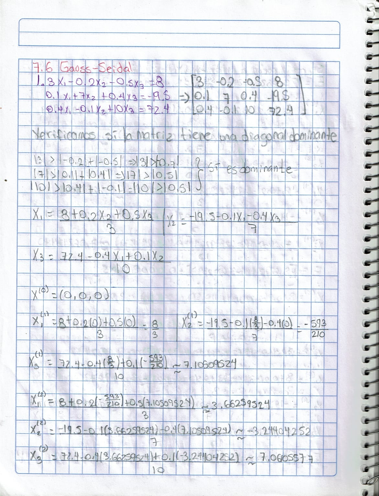{width=600}

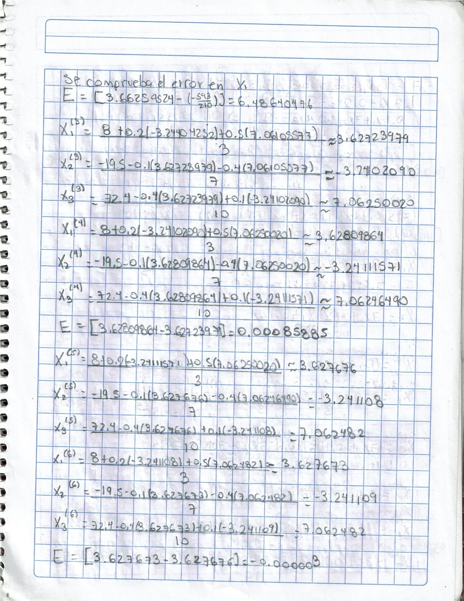{width=600}

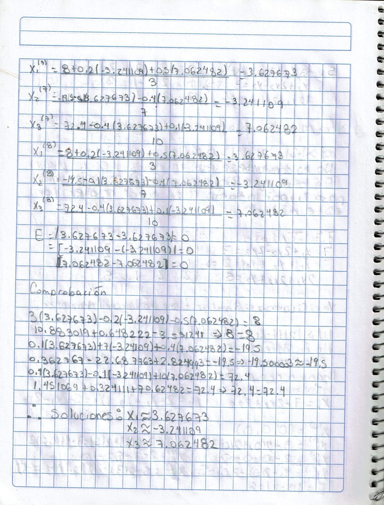{width=600}


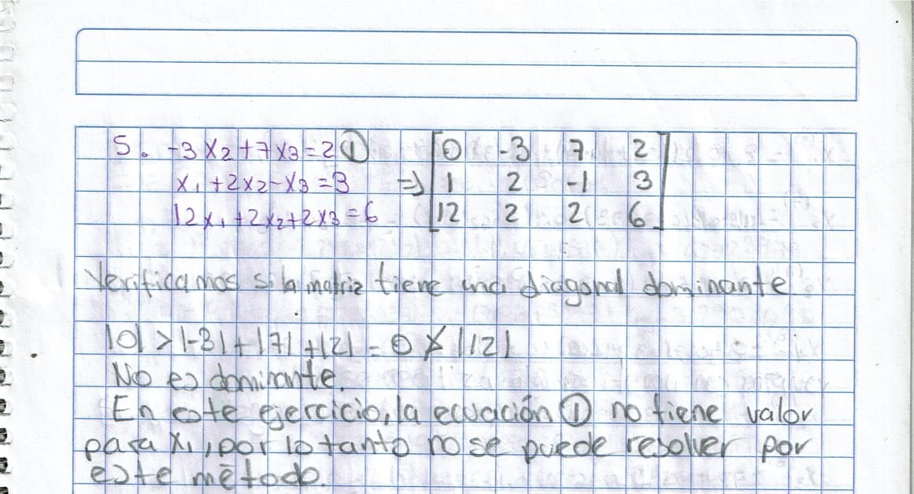{width=600}


#### Sistema $1$

$3x_1 − 0.2x_2 − 0.5x_3 = 8$

$0.1x_1 + 7x_2 + 0.4x_3 = −19.5$

$0.4x_1 − 0.1x_2 + 10x_3 = 72.4$

##### Procedimiento

```{r}

A <- matrix(c(3, -0.2, -0.5,
              0.1, 7, 0.4,
              0.4, -0.1, 10),
      nrow = 3, byrow = TRUE)
b <- c(8, -19.5, 72.4)

Ab <- cbind(A, b); (Ab)

```

```{r}
# Checar si converge o no con la diagonal dominante

F1 <- abs(A[1,1]) > (abs(A[1,2]) + abs(A[1,3]))
F2 <- abs(A[2,2]) > (abs(A[2,1]) + abs(A[2,3]))
F3 <- abs(A[3,3]) > (abs(A[3,1]) + abs(A[3,2]))

if(F1 == TRUE & F2 == TRUE & F3 == TRUE) {
  cat("Sí es dominante")
} else {
  cat("No es dominante")
}
```

```{r}
# Asignar valores iniciales

x <- rep(0, 3) # x^(0)=(0,0,0)
cat("x^(0)=",paste(sprintf("%.8f",x), collapse=", "), "\n")
```

###### Iteración 1

```{r}
x_old <- x
x[1] <- (b[1] - A[1,2]*x_old[2] - A[1,3]*x_old[3]) / A[1,1]
cat(sprintf("x1^(1) = (%.1f - (%.1f)*%.8f - (%.1f)*%.8f)/%.1f = %.8f\n", b[1], A[1,2], x_old[2], A[1,3], x_old[3], A[1,1], x[1]))


x[2] <- (b[2] - A[2,1]*x[1] - A[2,3]*x_old[3]) / A[2,2]
cat(sprintf("x2^(1) = (%.1f - (%.1f)*%.8f - (%.1f)*%.8f)/%.1f = %.8f\n", b[2], A[2,1], x[1], A[2,3], x_old[3], A[2,2], x[2]))


x[3] <- (b[3] - A[3,1]*x[1] - A[3,2]*x[2]) / A[3,3]
cat(sprintf("x3^(1) = (%.1f - (%.1f)*%.8f - (%.1f)*%.8f)/%.1f = %.8f\n", b[3], A[3,1], x[1], A[3,2], x[2], A[3,3], x[3]))
```

```{r}
#Error o tolerancia

r <- b - A %*% x
dx_inf <- max(abs(x - x_old))
cat(sprintf("x^(1) = %s\n", paste(sprintf("%.8f", x), collapse=", ")))
cat(sprintf("||dx||_inf = %.8e | ||r||_inf = %.8e\n", dx_inf, max(abs(r))))
```
###### Iteración 2

```{r}
x_old <- x
x[1] <- (b[1] - A[1,2]*x_old[2] - A[1,3]*x_old[3]) / A[1,1]
cat(sprintf("x1^(2) = (%.1f - (%.1f)*%.8f - (%.1f)*%.8f)/%.1f = %.8f\n", b[1], A[1,2], x_old[2], A[1,3], x_old[3], A[1,1], x[1]))


x[2] <- (b[2] - A[2,1]*x[1] - A[2,3]*x_old[3]) / A[2,2]
cat(sprintf("x2^(2) = (%.1f - (%.1f)*%.8f - (%.1f)*%.8f)/%.1f = %.8f\n", b[2], A[2,1], x[1], A[2,3], x_old[3], A[2,2], x[2]))


x[3] <- (b[3] - A[3,1]*x[1] - A[3,2]*x[2]) / A[3,3]
cat(sprintf("x3^(2) = (%.1f - (%.1f)*%.8f - (%.1f)*%.8f)/%.1f = %.8f\n", b[3], A[3,1], x[1], A[3,2], x[2], A[3,3], x[3]))
```

```{r}
#Error o tolerancia

r <- b - A %*% x
dx_inf <- max(abs(x - x_old))
cat(sprintf("x^(2) = %s\n", paste(sprintf("%.8f", x), collapse=", ")))
cat(sprintf("||dx||_inf = %.8e | ||r||_inf = %.8e\n", dx_inf, max(abs(r))))
```

###### Iteración 3

```{r}
x_old <- x
x[1] <- (b[1] - A[1,2]*x_old[2] - A[1,3]*x_old[3]) / A[1,1]
cat(sprintf("x1^(3) = (%.1f - (%.1f)*%.8f - (%.1f)*%.8f)/%.1f = %.8f\n", b[1], A[1,2], x_old[2], A[1,3], x_old[3], A[1,1], x[1]))


x[2] <- (b[2] - A[2,1]*x[1] - A[2,3]*x_old[3]) / A[2,2]
cat(sprintf("x2^(3) = (%.1f - (%.1f)*%.8f - (%.1f)*%.8f)/%.1f = %.8f\n", b[2], A[2,1], x[1], A[2,3], x_old[3], A[2,2], x[2]))


x[3] <- (b[3] - A[3,1]*x[1] - A[3,2]*x[2]) / A[3,3]
cat(sprintf("x3^(3) = (%.1f - (%.1f)*%.8f - (%.1f)*%.8f)/%.1f = %.8f\n", b[3], A[3,1], x[1], A[3,2], x[2], A[3,3], x[3]))
```

```{r}
#Error o tolerancia

r <- b - A %*% x
dx_inf <- max(abs(x - x_old))
cat(sprintf("x^(3) = %s\n", paste(sprintf("%.8f", x), collapse=", ")))
cat(sprintf("||dx||_inf = %.8e | ||r||_inf = %.8e\n", dx_inf, max(abs(r))))
```

###### Iteración 4

```{r}
x_old <- x
x[1] <- (b[1] - A[1,2]*x_old[2] - A[1,3]*x_old[3]) / A[1,1]
cat(sprintf("x1^(4) = (%.1f - (%.1f)*%.8f - (%.1f)*%.8f)/%.1f = %.8f\n", b[1], A[1,2], x_old[2], A[1,3], x_old[3], A[1,1], x[1]))


x[2] <- (b[2] - A[2,1]*x[1] - A[2,3]*x_old[3]) / A[2,2]
cat(sprintf("x2^(4) = (%.1f - (%.1f)*%.8f - (%.1f)*%.8f)/%.1f = %.8f\n", b[2], A[2,1], x[1], A[2,3], x_old[3], A[2,2], x[2]))


x[3] <- (b[3] - A[3,1]*x[1] - A[3,2]*x[2]) / A[3,3]
cat(sprintf("x3^(4) = (%.1f - (%.1f)*%.8f - (%.1f)*%.8f)/%.1f = %.8f\n", b[3], A[3,1], x[1], A[3,2], x[2], A[3,3], x[3]))
```

```{r}
#Error o tolerancia

r <- b - A %*% x
dx_inf <- max(abs(x - x_old))
cat(sprintf("x^(4) = %s\n", paste(sprintf("%.8f", x), collapse=", ")))
cat(sprintf("||dx||_inf = %.8e | ||r||_inf = %.8e\n", dx_inf, max(abs(r))))
```

###### Iteración 5

```{r}
x_old <- x
x[1] <- (b[1] - A[1,2]*x_old[2] - A[1,3]*x_old[3]) / A[1,1]
cat(sprintf("x1^(5) = (%.1f - (%.1f)*%.8f - (%.1f)*%.8f)/%.1f = %.8f\n", b[1], A[1,2], x_old[2], A[1,3], x_old[3], A[1,1], x[1]))


x[2] <- (b[2] - A[2,1]*x[1] - A[2,3]*x_old[3]) / A[2,2]
cat(sprintf("x2^(5) = (%.1f - (%.1f)*%.8f - (%.1f)*%.8f)/%.1f = %.8f\n", b[2], A[2,1], x[1], A[2,3], x_old[3], A[2,2], x[2]))


x[3] <- (b[3] - A[3,1]*x[1] - A[3,2]*x[2]) / A[3,3]
cat(sprintf("x3^(5) = (%.1f - (%.1f)*%.8f - (%.1f)*%.8f)/%.1f = %.8f\n", b[3], A[3,1], x[1], A[3,2], x[2], A[3,3], x[3]))
```

```{r}
#Error o tolerancia

r <- b - A %*% x
dx_inf <- max(abs(x - x_old))
cat(sprintf("x^(5) = %s\n", paste(sprintf("%.8f", x), collapse=", ")))
cat(sprintf("||dx||_inf = %.8e | ||r||_inf = %.8e\n", dx_inf, max(abs(r))))
```

###### Iteración 6

```{r}
x_old <- x
x[1] <- (b[1] - A[1,2]*x_old[2] - A[1,3]*x_old[3]) / A[1,1]
cat(sprintf("x1^(6) = (%.1f - (%.1f)*%.8f - (%.1f)*%.8f)/%.1f = %.8f\n", b[1], A[1,2], x_old[2], A[1,3], x_old[3], A[1,1], x[1]))


x[2] <- (b[2] - A[2,1]*x[1] - A[2,3]*x_old[3]) / A[2,2]
cat(sprintf("x2^(6) = (%.1f - (%.1f)*%.8f - (%.1f)*%.8f)/%.1f = %.8f\n", b[2], A[2,1], x[1], A[2,3], x_old[3], A[2,2], x[2]))


x[3] <- (b[3] - A[3,1]*x[1] - A[3,2]*x[2]) / A[3,3]
cat(sprintf("x3^(6) = (%.1f - (%.1f)*%.8f - (%.1f)*%.8f)/%.1f = %.8f\n", b[3], A[3,1], x[1], A[3,2], x[2], A[3,3], x[3]))
```

```{r}
#Error o tolerancia

r <- b - A %*% x
dx_inf <- max(abs(x - x_old))
cat(sprintf("x^(6) = %s\n", paste(sprintf("%.8f", x), collapse=", ")))
cat(sprintf("||dx||_inf = %.8e | ||r||_inf = %.8e\n", dx_inf, max(abs(r))))
```

###### Iteración 7

```{r}
x_old <- x
x[1] <- (b[1] - A[1,2]*x_old[2] - A[1,3]*x_old[3]) / A[1,1]
cat(sprintf("x1^(7) = (%.1f - (%.1f)*%.8f - (%.1f)*%.8f)/%.1f = %.8f\n", b[1], A[1,2], x_old[2], A[1,3], x_old[3], A[1,1], x[1]))


x[2] <- (b[2] - A[2,1]*x[1] - A[2,3]*x_old[3]) / A[2,2]
cat(sprintf("x2^(7) = (%.1f - (%.1f)*%.8f - (%.1f)*%.8f)/%.1f = %.8f\n", b[2], A[2,1], x[1], A[2,3], x_old[3], A[2,2], x[2]))


x[3] <- (b[3] - A[3,1]*x[1] - A[3,2]*x[2]) / A[3,3]
cat(sprintf("x3^(7) = (%.1f - (%.1f)*%.8f - (%.1f)*%.8f)/%.1f = %.8f\n", b[3], A[3,1], x[1], A[3,2], x[2], A[3,3], x[3]))
```

```{r}
#Error o tolerancia

r <- b - A %*% x
dx_inf <- max(abs(x - x_old))
cat(sprintf("x^(7) = %s\n", paste(sprintf("%.8f", x), collapse=", ")))
cat(sprintf("||dx||_inf = %.8e | ||r||_inf = %.8e\n", dx_inf, max(abs(r))))
```

###### Iteración 8

```{r}
x_old <- x
x[1] <- (b[1] - A[1,2]*x_old[2] - A[1,3]*x_old[3]) / A[1,1]
cat(sprintf("x1^(8) = (%.1f - (%.1f)*%.8f - (%.1f)*%.8f)/%.1f = %.8f\n", b[1], A[1,2], x_old[2], A[1,3], x_old[3], A[1,1], x[1]))


x[2] <- (b[2] - A[2,1]*x[1] - A[2,3]*x_old[3]) / A[2,2]
cat(sprintf("x2^(8) = (%.1f - (%.1f)*%.8f - (%.1f)*%.8f)/%.1f = %.8f\n", b[2], A[2,1], x[1], A[2,3], x_old[3], A[2,2], x[2]))


x[3] <- (b[3] - A[3,1]*x[1] - A[3,2]*x[2]) / A[3,3]
cat(sprintf("x3^(8) = (%.1f - (%.1f)*%.8f - (%.1f)*%.8f)/%.1f = %.8f\n", b[3], A[3,1], x[1], A[3,2], x[2], A[3,3], x[3]))
```

```{r}
#Error o tolerancia

r <- b - A %*% x
dx_inf <- max(abs(x - x_old))
cat(sprintf("x^(8) = %s\n", paste(sprintf("%.8f", x), collapse=", ")))
cat(sprintf("||dx||_inf = %.8e | ||r||_inf = %.8e\n", dx_inf, max(abs(r))))
```

###### Iteración 9

```{r}
x_old <- x
x[1] <- (b[1] - A[1,2]*x_old[2] - A[1,3]*x_old[3]) / A[1,1]
cat(sprintf("x1^(9) = (%.1f - (%.1f)*%.8f - (%.1f)*%.8f)/%.1f = %.8f\n", b[1], A[1,2], x_old[2], A[1,3], x_old[3], A[1,1], x[1]))


x[2] <- (b[2] - A[2,1]*x[1] - A[2,3]*x_old[3]) / A[2,2]
cat(sprintf("x2^(9) = (%.1f - (%.1f)*%.8f - (%.1f)*%.8f)/%.1f = %.8f\n", b[2], A[2,1], x[1], A[2,3], x_old[3], A[2,2], x[2]))


x[3] <- (b[3] - A[3,1]*x[1] - A[3,2]*x[2]) / A[3,3]
cat(sprintf("x3^(9) = (%.1f - (%.1f)*%.8f - (%.1f)*%.8f)/%.1f = %.8f\n", b[3], A[3,1], x[1], A[3,2], x[2], A[3,3], x[3]))
```

```{r}
#Error o tolerancia

r <- b - A %*% x
dx_inf <- max(abs(x - x_old))
cat(sprintf("x^(9) = %s\n", paste(sprintf("%.8f", x), collapse=", ")))
cat(sprintf("||dx||_inf = %.8e | ||r||_inf = %.8e\n", dx_inf, max(abs(r))))
```

###### Iteración 10

```{r}
x_old <- x
x[1] <- (b[1] - A[1,2]*x_old[2] - A[1,3]*x_old[3]) / A[1,1]
cat(sprintf("x1^(10) = (%.1f - (%.1f)*%.8f - (%.1f)*%.8f)/%.1f = %.8f\n", b[1], A[1,2], x_old[2], A[1,3], x_old[3], A[1,1], x[1]))


x[2] <- (b[2] - A[2,1]*x[1] - A[2,3]*x_old[3]) / A[2,2]
cat(sprintf("x2^(10) = (%.1f - (%.1f)*%.8f - (%.1f)*%.8f)/%.1f = %.8f\n", b[2], A[2,1], x[1], A[2,3], x_old[3], A[2,2], x[2]))


x[3] <- (b[3] - A[3,1]*x[1] - A[3,2]*x[2]) / A[3,3]
cat(sprintf("x3^(10) = (%.1f - (%.1f)*%.8f - (%.1f)*%.8f)/%.1f = %.8f\n", b[3], A[3,1], x[1], A[3,2], x[2], A[3,3], x[3]))
```

```{r}
#Error o tolerancia

r <- b - A %*% x
dx_inf <- max(abs(x - x_old))
cat(sprintf("x^(10) = %s\n", paste(sprintf("%.8f", x), collapse=", ")))
cat(sprintf("||dx||_inf = %.8e | ||r||_inf = %.8e\n", dx_inf, max(abs(r))))
```

```{r}
# Soluciones
x_old <- x
x1 <- x_old[1]
x2 <- x_old[2]
x3 <- x_old[3]
```

```{r}
# Comprobación

I <- b[1]; (I)
II <- b[2]; (II)
III <- b[3]; (III)
c1 <- (A[1,1] * x1) + (A[1,2] * x2) + (A[1,3] * x3); paste0("El resultado es: ",c1)
c2 <- (A[2,1] * x1) + (A[2,2] * x2) + (A[2,3] * x3); paste0("El resultado es: ",c2)
c3 <- (A[3,1] * x1) + (A[3,2] * x2) + (A[3,3] * x3); paste0("El resultado es: ",c3)

paste0("En la ecuación 1: ", c1, " tecnicamente es: ", I)
paste0("En la ecuación 2: ", c2, " tecnicamente es: ", II)
paste0("En la ecuación 3: ", c3, " tecnicamente es: ", III)
```

##### Resultados

```{r}
cat("Soluciones del sistema:")
cat("x1 =", x1)
cat("x2 =", x2) 
cat("x3 =", x3)
```

#### Sistema $2$

$−5x_1 + 1.4x_2 − 2.7x_3 = 94.2$

$0.7x_1 − 2.5x_2 + 15x_3 = −6$

$3.3x_1 − 11x_2 + 4.4x_3 = −27.5$

##### Procedimiento

```{r}

A <- matrix(c(-5, 1.4, -2.7,
              0.7, -2.5, 15,
              3.3, -11, 4.4),
      nrow = 3, byrow = TRUE)
b <- c(94.2, -6, -27.5)

Ab <- cbind(A, b); (Ab)

```

```{r}
# Checar si converge o no con la diagonal dominante

F1 <- abs(A[1,1]) > (abs(A[1,2]) + abs(A[1,3]))
F2 <- abs(A[2,2]) > (abs(A[2,1]) + abs(A[2,3]))
F3 <- abs(A[3,3]) > (abs(A[3,1]) + abs(A[3,2]))

if(F1 == TRUE & F2 == TRUE & F3 == TRUE) {
  cat("Sí es dominante")
} else {
  cat("No es dominante")
}
```

Aunque no es una matriz con diagonal dominante, se intenta resolverlo con 10 iteraciones para ver si puede o no llegar a converger.

```{r}
# Asignar valores iniciales

x <- rep(0, 3) # x^(0)=(0,0,0)
cat("x^(0)=",paste(sprintf("%.8f",x), collapse=", "), "\n")
```

###### Iteración 1

```{r}
x_old <- x
x[1] <- (b[1] - A[1,2]*x_old[2] - A[1,3]*x_old[3]) / A[1,1]
cat(sprintf("x1^(1) = (%.1f - (%.1f)*%.8f - (%.1f)*%.8f)/%.1f = %.8f\n", b[1], A[1,2], x_old[2], A[1,3], x_old[3], A[1,1], x[1]))


x[2] <- (b[2] - A[2,1]*x[1] - A[2,3]*x_old[3]) / A[2,2]
cat(sprintf("x2^(1) = (%.1f - (%.1f)*%.8f - (%.1f)*%.8f)/%.1f = %.8f\n", b[2], A[2,1], x[1], A[2,3], x_old[3], A[2,2], x[2]))


x[3] <- (b[3] - A[3,1]*x[1] - A[3,2]*x[2]) / A[3,3]
cat(sprintf("x3^(1) = (%.1f - (%.1f)*%.8f - (%.1f)*%.8f)/%.1f = %.8f\n", b[3], A[3,1], x[1], A[3,2], x[2], A[3,3], x[3]))
```

```{r}
#Error o tolerancia

r <- b - A %*% x
dx_inf <- max(abs(x - x_old))
cat(sprintf("x^(1) = %s\n", paste(sprintf("%.8f", x), collapse=", ")))
cat(sprintf("||dx||_inf = %.8e | ||r||_inf = %.8e\n", dx_inf, max(abs(r))))
```
###### Iteración 2

```{r}
x_old <- x
x[1] <- (b[1] - A[1,2]*x_old[2] - A[1,3]*x_old[3]) / A[1,1]
cat(sprintf("x1^(2) = (%.1f - (%.1f)*%.8f - (%.1f)*%.8f)/%.1f = %.8f\n", b[1], A[1,2], x_old[2], A[1,3], x_old[3], A[1,1], x[1]))


x[2] <- (b[2] - A[2,1]*x[1] - A[2,3]*x_old[3]) / A[2,2]
cat(sprintf("x2^(2) = (%.1f - (%.1f)*%.8f - (%.1f)*%.8f)/%.1f = %.8f\n", b[2], A[2,1], x[1], A[2,3], x_old[3], A[2,2], x[2]))


x[3] <- (b[3] - A[3,1]*x[1] - A[3,2]*x[2]) / A[3,3]
cat(sprintf("x3^(2) = (%.1f - (%.1f)*%.8f - (%.1f)*%.8f)/%.1f = %.8f\n", b[3], A[3,1], x[1], A[3,2], x[2], A[3,3], x[3]))
```

```{r}
#Error o tolerancia

r <- b - A %*% x
dx_inf <- max(abs(x - x_old))
cat(sprintf("x^(2) = %s\n", paste(sprintf("%.8f", x), collapse=", ")))
cat(sprintf("||dx||_inf = %.8e | ||r||_inf = %.8e\n", dx_inf, max(abs(r))))
```

###### Iteración 3

```{r}
x_old <- x
x[1] <- (b[1] - A[1,2]*x_old[2] - A[1,3]*x_old[3]) / A[1,1]
cat(sprintf("x1^(3) = (%.1f - (%.1f)*%.8f - (%.1f)*%.8f)/%.1f = %.8f\n", b[1], A[1,2], x_old[2], A[1,3], x_old[3], A[1,1], x[1]))


x[2] <- (b[2] - A[2,1]*x[1] - A[2,3]*x_old[3]) / A[2,2]
cat(sprintf("x2^(3) = (%.1f - (%.1f)*%.8f - (%.1f)*%.8f)/%.1f = %.8f\n", b[2], A[2,1], x[1], A[2,3], x_old[3], A[2,2], x[2]))


x[3] <- (b[3] - A[3,1]*x[1] - A[3,2]*x[2]) / A[3,3]
cat(sprintf("x3^(3) = (%.1f - (%.1f)*%.8f - (%.1f)*%.8f)/%.1f = %.8f\n", b[3], A[3,1], x[1], A[3,2], x[2], A[3,3], x[3]))
```

```{r}
#Error o tolerancia

r <- b - A %*% x
dx_inf <- max(abs(x - x_old))
cat(sprintf("x^(3) = %s\n", paste(sprintf("%.8f", x), collapse=", ")))
cat(sprintf("||dx||_inf = %.8e | ||r||_inf = %.8e\n", dx_inf, max(abs(r))))
```

###### Iteración 4

```{r}
x_old <- x
x[1] <- (b[1] - A[1,2]*x_old[2] - A[1,3]*x_old[3]) / A[1,1]
cat(sprintf("x1^(4) = (%.1f - (%.1f)*%.8f - (%.1f)*%.8f)/%.1f = %.8f\n", b[1], A[1,2], x_old[2], A[1,3], x_old[3], A[1,1], x[1]))


x[2] <- (b[2] - A[2,1]*x[1] - A[2,3]*x_old[3]) / A[2,2]
cat(sprintf("x2^(4) = (%.1f - (%.1f)*%.8f - (%.1f)*%.8f)/%.1f = %.8f\n", b[2], A[2,1], x[1], A[2,3], x_old[3], A[2,2], x[2]))


x[3] <- (b[3] - A[3,1]*x[1] - A[3,2]*x[2]) / A[3,3]
cat(sprintf("x3^(4) = (%.1f - (%.1f)*%.8f - (%.1f)*%.8f)/%.1f = %.8f\n", b[3], A[3,1], x[1], A[3,2], x[2], A[3,3], x[3]))
```

```{r}
#Error o tolerancia

r <- b - A %*% x
dx_inf <- max(abs(x - x_old))
cat(sprintf("x^(4) = %s\n", paste(sprintf("%.8f", x), collapse=", ")))
cat(sprintf("||dx||_inf = %.8e | ||r||_inf = %.8e\n", dx_inf, max(abs(r))))
```

###### Iteración 5

```{r}
x_old <- x
x[1] <- (b[1] - A[1,2]*x_old[2] - A[1,3]*x_old[3]) / A[1,1]
cat(sprintf("x1^(5) = (%.1f - (%.1f)*%.8f - (%.1f)*%.8f)/%.1f = %.8f\n", b[1], A[1,2], x_old[2], A[1,3], x_old[3], A[1,1], x[1]))


x[2] <- (b[2] - A[2,1]*x[1] - A[2,3]*x_old[3]) / A[2,2]
cat(sprintf("x2^(5) = (%.1f - (%.1f)*%.8f - (%.1f)*%.8f)/%.1f = %.8f\n", b[2], A[2,1], x[1], A[2,3], x_old[3], A[2,2], x[2]))


x[3] <- (b[3] - A[3,1]*x[1] - A[3,2]*x[2]) / A[3,3]
cat(sprintf("x3^(5) = (%.1f - (%.1f)*%.8f - (%.1f)*%.8f)/%.1f = %.8f\n", b[3], A[3,1], x[1], A[3,2], x[2], A[3,3], x[3]))
```

```{r}
#Error o tolerancia

r <- b - A %*% x
dx_inf <- max(abs(x - x_old))
cat(sprintf("x^(5) = %s\n", paste(sprintf("%.8f", x), collapse=", ")))
cat(sprintf("||dx||_inf = %.8e | ||r||_inf = %.8e\n", dx_inf, max(abs(r))))
```

###### Iteración 6

```{r}
x_old <- x
x[1] <- (b[1] - A[1,2]*x_old[2] - A[1,3]*x_old[3]) / A[1,1]
cat(sprintf("x1^(6) = (%.1f - (%.1f)*%.8f - (%.1f)*%.8f)/%.1f = %.8f\n", b[1], A[1,2], x_old[2], A[1,3], x_old[3], A[1,1], x[1]))


x[2] <- (b[2] - A[2,1]*x[1] - A[2,3]*x_old[3]) / A[2,2]
cat(sprintf("x2^(6) = (%.1f - (%.1f)*%.8f - (%.1f)*%.8f)/%.1f = %.8f\n", b[2], A[2,1], x[1], A[2,3], x_old[3], A[2,2], x[2]))


x[3] <- (b[3] - A[3,1]*x[1] - A[3,2]*x[2]) / A[3,3]
cat(sprintf("x3^(6) = (%.1f - (%.1f)*%.8f - (%.1f)*%.8f)/%.1f = %.8f\n", b[3], A[3,1], x[1], A[3,2], x[2], A[3,3], x[3]))
```

```{r}
#Error o tolerancia

r <- b - A %*% x
dx_inf <- max(abs(x - x_old))
cat(sprintf("x^(6) = %s\n", paste(sprintf("%.8f", x), collapse=", ")))
cat(sprintf("||dx||_inf = %.8e | ||r||_inf = %.8e\n", dx_inf, max(abs(r))))
```

###### Iteración 7

```{r}
x_old <- x
x[1] <- (b[1] - A[1,2]*x_old[2] - A[1,3]*x_old[3]) / A[1,1]
cat(sprintf("x1^(7) = (%.1f - (%.1f)*%.8f - (%.1f)*%.8f)/%.1f = %.8f\n", b[1], A[1,2], x_old[2], A[1,3], x_old[3], A[1,1], x[1]))


x[2] <- (b[2] - A[2,1]*x[1] - A[2,3]*x_old[3]) / A[2,2]
cat(sprintf("x2^(7) = (%.1f - (%.1f)*%.8f - (%.1f)*%.8f)/%.1f = %.8f\n", b[2], A[2,1], x[1], A[2,3], x_old[3], A[2,2], x[2]))


x[3] <- (b[3] - A[3,1]*x[1] - A[3,2]*x[2]) / A[3,3]
cat(sprintf("x3^(7) = (%.1f - (%.1f)*%.8f - (%.1f)*%.8f)/%.1f = %.8f\n", b[3], A[3,1], x[1], A[3,2], x[2], A[3,3], x[3]))
```

```{r}
#Error o tolerancia

r <- b - A %*% x
dx_inf <- max(abs(x - x_old))
cat(sprintf("x^(7) = %s\n", paste(sprintf("%.8f", x), collapse=", ")))
cat(sprintf("||dx||_inf = %.8e | ||r||_inf = %.8e\n", dx_inf, max(abs(r))))
```

###### Iteración 8

```{r}
x_old <- x
x[1] <- (b[1] - A[1,2]*x_old[2] - A[1,3]*x_old[3]) / A[1,1]
cat(sprintf("x1^(8) = (%.1f - (%.1f)*%.8f - (%.1f)*%.8f)/%.1f = %.8f\n", b[1], A[1,2], x_old[2], A[1,3], x_old[3], A[1,1], x[1]))


x[2] <- (b[2] - A[2,1]*x[1] - A[2,3]*x_old[3]) / A[2,2]
cat(sprintf("x2^(8) = (%.1f - (%.1f)*%.8f - (%.1f)*%.8f)/%.1f = %.8f\n", b[2], A[2,1], x[1], A[2,3], x_old[3], A[2,2], x[2]))


x[3] <- (b[3] - A[3,1]*x[1] - A[3,2]*x[2]) / A[3,3]
cat(sprintf("x3^(8) = (%.1f - (%.1f)*%.8f - (%.1f)*%.8f)/%.1f = %.8f\n", b[3], A[3,1], x[1], A[3,2], x[2], A[3,3], x[3]))
```

```{r}
#Error o tolerancia

r <- b - A %*% x
dx_inf <- max(abs(x - x_old))
cat(sprintf("x^(8) = %s\n", paste(sprintf("%.8f", x), collapse=", ")))
cat(sprintf("||dx||_inf = %.8e | ||r||_inf = %.8e\n", dx_inf, max(abs(r))))
```

###### Iteración 9

```{r}
x_old <- x
x[1] <- (b[1] - A[1,2]*x_old[2] - A[1,3]*x_old[3]) / A[1,1]
cat(sprintf("x1^(9) = (%.1f - (%.1f)*%.8f - (%.1f)*%.8f)/%.1f = %.8f\n", b[1], A[1,2], x_old[2], A[1,3], x_old[3], A[1,1], x[1]))


x[2] <- (b[2] - A[2,1]*x[1] - A[2,3]*x_old[3]) / A[2,2]
cat(sprintf("x2^(9) = (%.1f - (%.1f)*%.8f - (%.1f)*%.8f)/%.1f = %.8f\n", b[2], A[2,1], x[1], A[2,3], x_old[3], A[2,2], x[2]))


x[3] <- (b[3] - A[3,1]*x[1] - A[3,2]*x[2]) / A[3,3]
cat(sprintf("x3^(9) = (%.1f - (%.1f)*%.8f - (%.1f)*%.8f)/%.1f = %.8f\n", b[3], A[3,1], x[1], A[3,2], x[2], A[3,3], x[3]))
```

```{r}
#Error o tolerancia

r <- b - A %*% x
dx_inf <- max(abs(x - x_old))
cat(sprintf("x^(9) = %s\n", paste(sprintf("%.8f", x), collapse=", ")))
cat(sprintf("||dx||_inf = %.8e | ||r||_inf = %.8e\n", dx_inf, max(abs(r))))
```

###### Iteración 10

```{r}
x_old <- x
x[1] <- (b[1] - A[1,2]*x_old[2] - A[1,3]*x_old[3]) / A[1,1]
cat(sprintf("x1^(10) = (%.1f - (%.1f)*%.8f - (%.1f)*%.8f)/%.1f = %.8f\n", b[1], A[1,2], x_old[2], A[1,3], x_old[3], A[1,1], x[1]))


x[2] <- (b[2] - A[2,1]*x[1] - A[2,3]*x_old[3]) / A[2,2]
cat(sprintf("x2^(10) = (%.1f - (%.1f)*%.8f - (%.1f)*%.8f)/%.1f = %.8f\n", b[2], A[2,1], x[1], A[2,3], x_old[3], A[2,2], x[2]))


x[3] <- (b[3] - A[3,1]*x[1] - A[3,2]*x[2]) / A[3,3]
cat(sprintf("x3^(10) = (%.1f - (%.1f)*%.8f - (%.1f)*%.8f)/%.1f = %.8f\n", b[3], A[3,1], x[1], A[3,2], x[2], A[3,3], x[3]))
```

```{r}
#Error o tolerancia

r <- b - A %*% x
dx_inf <- max(abs(x - x_old))
cat(sprintf("x^(10) = %s\n", paste(sprintf("%.8f", x), collapse=", ")))
cat(sprintf("||dx||_inf = %.8e | ||r||_inf = %.8e\n", dx_inf, max(abs(r))))
```

##### Resultados

Después de 10 iteraciones, se observa que el sistema no converge, al contrario, hay divergencia.

#### Sistema $3$

$3x_1 − 0.5x_2 + 0.6x_3 = 5.24$

$0.3x_1 − 4x_2 − x_3 = −0.387$

$−0.7x_1 + 2x_2 + 7x_3 = 14.803$

##### Procedimiento

```{r}

A <- matrix(c(3, -0.5, 0.6,
              0.3, -4, -1,
              -0.7, 2, 7),
      nrow = 3, byrow = TRUE)
b <- c(5.24, -0.387, 14.803)

Ab <- cbind(A, b); (Ab)

```

```{r}
# Checar si converge o no con la diagonal dominante

F1 <- abs(A[1,1]) > (abs(A[1,2]) + abs(A[1,3]))
F2 <- abs(A[2,2]) > (abs(A[2,1]) + abs(A[2,3]))
F3 <- abs(A[3,3]) > (abs(A[3,1]) + abs(A[3,2]))

if(F1 == TRUE & F2 == TRUE & F3 == TRUE) {
  cat("Sí es dominante")
} else {
  cat("No es dominante")
}
```

```{r}
# Asignar valores iniciales

x <- rep(0, 3) # x^(0)=(0,0,0)
cat("x^(0)=",paste(sprintf("%.8f",x), collapse=", "), "\n")
```

###### Iteración 1

```{r}
x_old <- x
x[1] <- (b[1] - A[1,2]*x_old[2] - A[1,3]*x_old[3]) / A[1,1]
cat(sprintf("x1^(1) = (%.1f - (%.1f)*%.8f - (%.1f)*%.8f)/%.1f = %.8f\n", b[1], A[1,2], x_old[2], A[1,3], x_old[3], A[1,1], x[1]))


x[2] <- (b[2] - A[2,1]*x[1] - A[2,3]*x_old[3]) / A[2,2]
cat(sprintf("x2^(1) = (%.1f - (%.1f)*%.8f - (%.1f)*%.8f)/%.1f = %.8f\n", b[2], A[2,1], x[1], A[2,3], x_old[3], A[2,2], x[2]))


x[3] <- (b[3] - A[3,1]*x[1] - A[3,2]*x[2]) / A[3,3]
cat(sprintf("x3^(1) = (%.1f - (%.1f)*%.8f - (%.1f)*%.8f)/%.1f = %.8f\n", b[3], A[3,1], x[1], A[3,2], x[2], A[3,3], x[3]))
```

```{r}
#Error o tolerancia

r <- b - A %*% x
dx_inf <- max(abs(x - x_old))
cat(sprintf("x^(1) = %s\n", paste(sprintf("%.8f", x), collapse=", ")))
cat(sprintf("||dx||_inf = %.8e | ||r||_inf = %.8e\n", dx_inf, max(abs(r))))
```
###### Iteración 2

```{r}
x_old <- x
x[1] <- (b[1] - A[1,2]*x_old[2] - A[1,3]*x_old[3]) / A[1,1]
cat(sprintf("x1^(2) = (%.1f - (%.1f)*%.8f - (%.1f)*%.8f)/%.1f = %.8f\n", b[1], A[1,2], x_old[2], A[1,3], x_old[3], A[1,1], x[1]))


x[2] <- (b[2] - A[2,1]*x[1] - A[2,3]*x_old[3]) / A[2,2]
cat(sprintf("x2^(2) = (%.1f - (%.1f)*%.8f - (%.1f)*%.8f)/%.1f = %.8f\n", b[2], A[2,1], x[1], A[2,3], x_old[3], A[2,2], x[2]))


x[3] <- (b[3] - A[3,1]*x[1] - A[3,2]*x[2]) / A[3,3]
cat(sprintf("x3^(2) = (%.1f - (%.1f)*%.8f - (%.1f)*%.8f)/%.1f = %.8f\n", b[3], A[3,1], x[1], A[3,2], x[2], A[3,3], x[3]))
```

```{r}
#Error o tolerancia

r <- b - A %*% x
dx_inf <- max(abs(x - x_old))
cat(sprintf("x^(2) = %s\n", paste(sprintf("%.8f", x), collapse=", ")))
cat(sprintf("||dx||_inf = %.8e | ||r||_inf = %.8e\n", dx_inf, max(abs(r))))
```

###### Iteración 3

```{r}
x_old <- x
x[1] <- (b[1] - A[1,2]*x_old[2] - A[1,3]*x_old[3]) / A[1,1]
cat(sprintf("x1^(3) = (%.1f - (%.1f)*%.8f - (%.1f)*%.8f)/%.1f = %.8f\n", b[1], A[1,2], x_old[2], A[1,3], x_old[3], A[1,1], x[1]))


x[2] <- (b[2] - A[2,1]*x[1] - A[2,3]*x_old[3]) / A[2,2]
cat(sprintf("x2^(3) = (%.1f - (%.1f)*%.8f - (%.1f)*%.8f)/%.1f = %.8f\n", b[2], A[2,1], x[1], A[2,3], x_old[3], A[2,2], x[2]))


x[3] <- (b[3] - A[3,1]*x[1] - A[3,2]*x[2]) / A[3,3]
cat(sprintf("x3^(3) = (%.1f - (%.1f)*%.8f - (%.1f)*%.8f)/%.1f = %.8f\n", b[3], A[3,1], x[1], A[3,2], x[2], A[3,3], x[3]))
```

```{r}
#Error o tolerancia

r <- b - A %*% x
dx_inf <- max(abs(x - x_old))
cat(sprintf("x^(3) = %s\n", paste(sprintf("%.8f", x), collapse=", ")))
cat(sprintf("||dx||_inf = %.8e | ||r||_inf = %.8e\n", dx_inf, max(abs(r))))
```

###### Iteración 4

```{r}
x_old <- x
x[1] <- (b[1] - A[1,2]*x_old[2] - A[1,3]*x_old[3]) / A[1,1]
cat(sprintf("x1^(4) = (%.1f - (%.1f)*%.8f - (%.1f)*%.8f)/%.1f = %.8f\n", b[1], A[1,2], x_old[2], A[1,3], x_old[3], A[1,1], x[1]))


x[2] <- (b[2] - A[2,1]*x[1] - A[2,3]*x_old[3]) / A[2,2]
cat(sprintf("x2^(4) = (%.1f - (%.1f)*%.8f - (%.1f)*%.8f)/%.1f = %.8f\n", b[2], A[2,1], x[1], A[2,3], x_old[3], A[2,2], x[2]))


x[3] <- (b[3] - A[3,1]*x[1] - A[3,2]*x[2]) / A[3,3]
cat(sprintf("x3^(4) = (%.1f - (%.1f)*%.8f - (%.1f)*%.8f)/%.1f = %.8f\n", b[3], A[3,1], x[1], A[3,2], x[2], A[3,3], x[3]))
```

```{r}
#Error o tolerancia

r <- b - A %*% x
dx_inf <- max(abs(x - x_old))
cat(sprintf("x^(4) = %s\n", paste(sprintf("%.8f", x), collapse=", ")))
cat(sprintf("||dx||_inf = %.8e | ||r||_inf = %.8e\n", dx_inf, max(abs(r))))
```

###### Iteración 5

```{r}
x_old <- x
x[1] <- (b[1] - A[1,2]*x_old[2] - A[1,3]*x_old[3]) / A[1,1]
cat(sprintf("x1^(5) = (%.1f - (%.1f)*%.8f - (%.1f)*%.8f)/%.1f = %.8f\n", b[1], A[1,2], x_old[2], A[1,3], x_old[3], A[1,1], x[1]))


x[2] <- (b[2] - A[2,1]*x[1] - A[2,3]*x_old[3]) / A[2,2]
cat(sprintf("x2^(5) = (%.1f - (%.1f)*%.8f - (%.1f)*%.8f)/%.1f = %.8f\n", b[2], A[2,1], x[1], A[2,3], x_old[3], A[2,2], x[2]))


x[3] <- (b[3] - A[3,1]*x[1] - A[3,2]*x[2]) / A[3,3]
cat(sprintf("x3^(5) = (%.1f - (%.1f)*%.8f - (%.1f)*%.8f)/%.1f = %.8f\n", b[3], A[3,1], x[1], A[3,2], x[2], A[3,3], x[3]))
```

```{r}
#Error o tolerancia

r <- b - A %*% x
dx_inf <- max(abs(x - x_old))
cat(sprintf("x^(5) = %s\n", paste(sprintf("%.8f", x), collapse=", ")))
cat(sprintf("||dx||_inf = %.8e | ||r||_inf = %.8e\n", dx_inf, max(abs(r))))
```

###### Iteración 6

```{r}
x_old <- x
x[1] <- (b[1] - A[1,2]*x_old[2] - A[1,3]*x_old[3]) / A[1,1]
cat(sprintf("x1^(6) = (%.1f - (%.1f)*%.8f - (%.1f)*%.8f)/%.1f = %.8f\n", b[1], A[1,2], x_old[2], A[1,3], x_old[3], A[1,1], x[1]))


x[2] <- (b[2] - A[2,1]*x[1] - A[2,3]*x_old[3]) / A[2,2]
cat(sprintf("x2^(6) = (%.1f - (%.1f)*%.8f - (%.1f)*%.8f)/%.1f = %.8f\n", b[2], A[2,1], x[1], A[2,3], x_old[3], A[2,2], x[2]))


x[3] <- (b[3] - A[3,1]*x[1] - A[3,2]*x[2]) / A[3,3]
cat(sprintf("x3^(6) = (%.1f - (%.1f)*%.8f - (%.1f)*%.8f)/%.1f = %.8f\n", b[3], A[3,1], x[1], A[3,2], x[2], A[3,3], x[3]))
```

```{r}
#Error o tolerancia

r <- b - A %*% x
dx_inf <- max(abs(x - x_old))
cat(sprintf("x^(6) = %s\n", paste(sprintf("%.8f", x), collapse=", ")))
cat(sprintf("||dx||_inf = %.8e | ||r||_inf = %.8e\n", dx_inf, max(abs(r))))
```

###### Iteración 7

```{r}
x_old <- x
x[1] <- (b[1] - A[1,2]*x_old[2] - A[1,3]*x_old[3]) / A[1,1]
cat(sprintf("x1^(7) = (%.1f - (%.1f)*%.8f - (%.1f)*%.8f)/%.1f = %.8f\n", b[1], A[1,2], x_old[2], A[1,3], x_old[3], A[1,1], x[1]))


x[2] <- (b[2] - A[2,1]*x[1] - A[2,3]*x_old[3]) / A[2,2]
cat(sprintf("x2^(7) = (%.1f - (%.1f)*%.8f - (%.1f)*%.8f)/%.1f = %.8f\n", b[2], A[2,1], x[1], A[2,3], x_old[3], A[2,2], x[2]))


x[3] <- (b[3] - A[3,1]*x[1] - A[3,2]*x[2]) / A[3,3]
cat(sprintf("x3^(7) = (%.1f - (%.1f)*%.8f - (%.1f)*%.8f)/%.1f = %.8f\n", b[3], A[3,1], x[1], A[3,2], x[2], A[3,3], x[3]))
```

```{r}
#Error o tolerancia

r <- b - A %*% x
dx_inf <- max(abs(x - x_old))
cat(sprintf("x^(7) = %s\n", paste(sprintf("%.8f", x), collapse=", ")))
cat(sprintf("||dx||_inf = %.8e | ||r||_inf = %.8e\n", dx_inf, max(abs(r))))
```

###### Iteración 8

```{r}
x_old <- x
x[1] <- (b[1] - A[1,2]*x_old[2] - A[1,3]*x_old[3]) / A[1,1]
cat(sprintf("x1^(8) = (%.1f - (%.1f)*%.8f - (%.1f)*%.8f)/%.1f = %.8f\n", b[1], A[1,2], x_old[2], A[1,3], x_old[3], A[1,1], x[1]))


x[2] <- (b[2] - A[2,1]*x[1] - A[2,3]*x_old[3]) / A[2,2]
cat(sprintf("x2^(8) = (%.1f - (%.1f)*%.8f - (%.1f)*%.8f)/%.1f = %.8f\n", b[2], A[2,1], x[1], A[2,3], x_old[3], A[2,2], x[2]))


x[3] <- (b[3] - A[3,1]*x[1] - A[3,2]*x[2]) / A[3,3]
cat(sprintf("x3^(8) = (%.1f - (%.1f)*%.8f - (%.1f)*%.8f)/%.1f = %.8f\n", b[3], A[3,1], x[1], A[3,2], x[2], A[3,3], x[3]))
```

```{r}
#Error o tolerancia

r <- b - A %*% x
dx_inf <- max(abs(x - x_old))
cat(sprintf("x^(8) = %s\n", paste(sprintf("%.8f", x), collapse=", ")))
cat(sprintf("||dx||_inf = %.8e | ||r||_inf = %.8e\n", dx_inf, max(abs(r))))
```

###### Iteración 9

```{r}
x_old <- x
x[1] <- (b[1] - A[1,2]*x_old[2] - A[1,3]*x_old[3]) / A[1,1]
cat(sprintf("x1^(9) = (%.1f - (%.1f)*%.8f - (%.1f)*%.8f)/%.1f = %.8f\n", b[1], A[1,2], x_old[2], A[1,3], x_old[3], A[1,1], x[1]))


x[2] <- (b[2] - A[2,1]*x[1] - A[2,3]*x_old[3]) / A[2,2]
cat(sprintf("x2^(9) = (%.1f - (%.1f)*%.8f - (%.1f)*%.8f)/%.1f = %.8f\n", b[2], A[2,1], x[1], A[2,3], x_old[3], A[2,2], x[2]))


x[3] <- (b[3] - A[3,1]*x[1] - A[3,2]*x[2]) / A[3,3]
cat(sprintf("x3^(9) = (%.1f - (%.1f)*%.8f - (%.1f)*%.8f)/%.1f = %.8f\n", b[3], A[3,1], x[1], A[3,2], x[2], A[3,3], x[3]))
```

```{r}
#Error o tolerancia

r <- b - A %*% x
dx_inf <- max(abs(x - x_old))
cat(sprintf("x^(9) = %s\n", paste(sprintf("%.8f", x), collapse=", ")))
cat(sprintf("||dx||_inf = %.8e | ||r||_inf = %.8e\n", dx_inf, max(abs(r))))
```

###### Iteración 10

```{r}
x_old <- x
x[1] <- (b[1] - A[1,2]*x_old[2] - A[1,3]*x_old[3]) / A[1,1]
cat(sprintf("x1^(10) = (%.1f - (%.1f)*%.8f - (%.1f)*%.8f)/%.1f = %.8f\n", b[1], A[1,2], x_old[2], A[1,3], x_old[3], A[1,1], x[1]))


x[2] <- (b[2] - A[2,1]*x[1] - A[2,3]*x_old[3]) / A[2,2]
cat(sprintf("x2^(10) = (%.1f - (%.1f)*%.8f - (%.1f)*%.8f)/%.1f = %.8f\n", b[2], A[2,1], x[1], A[2,3], x_old[3], A[2,2], x[2]))


x[3] <- (b[3] - A[3,1]*x[1] - A[3,2]*x[2]) / A[3,3]
cat(sprintf("x3^(10) = (%.1f - (%.1f)*%.8f - (%.1f)*%.8f)/%.1f = %.8f\n", b[3], A[3,1], x[1], A[3,2], x[2], A[3,3], x[3]))
```

```{r}
#Error o tolerancia

r <- b - A %*% x
dx_inf <- max(abs(x - x_old))
cat(sprintf("x^(10) = %s\n", paste(sprintf("%.8f", x), collapse=", ")))
cat(sprintf("||dx||_inf = %.8e | ||r||_inf = %.8e\n", dx_inf, max(abs(r))))
```

```{r}
# Soluciones
x_old <- x
x1 <- x_old[1]
x2 <- x_old[2]
x3 <- x_old[3]
```

```{r}
# Comprobación

I <- b[1]; (I)
II <- b[2]; (II)
III <- b[3]; (III)
c1 <- (A[1,1] * x1) + (A[1,2] * x2) + (A[1,3] * x3); paste0("El resultado es: ",c1)
c2 <- (A[2,1] * x1) + (A[2,2] * x2) + (A[2,3] * x3); paste0("El resultado es: ",c2)
c3 <- (A[3,1] * x1) + (A[3,2] * x2) + (A[3,3] * x3); paste0("El resultado es: ",c3)

paste0("En la ecuación 1: ", c1, " tecnicamente es: ", I)
paste0("En la ecuación 2: ", c2, " tecnicamente es: ", II)
paste0("En la ecuación 3: ", c3, " tecnicamente es: ", III)
```

##### Resultados

```{r}
cat("Soluciones del sistema:")
cat("x1 =", x1)
cat("x2 =", x2) 
cat("x3 =", x3)
```

#### Sistema $4$

$5x_1 − 0.2x_2 + x_3 = 1.5$

$0.1x_1 + 3x_2 − 0.5x_3 = −2.7$

$−0.3x_1 + x_2 − 7x_3 = 9.5$

##### Procedimiento

```{r}

A <- matrix(c(5, -0.2, 1,
              0.1, 3, -0.5,
              -0.3, 1, -7),
      nrow = 3, byrow = TRUE)
b <- c(1.5, -2.7, 9.5)

Ab <- cbind(A, b); (Ab)

```

```{r}
# Checar si converge o no con la diagonal dominante

F1 <- abs(A[1,1]) > (abs(A[1,2]) + abs(A[1,3]))
F2 <- abs(A[2,2]) > (abs(A[2,1]) + abs(A[2,3]))
F3 <- abs(A[3,3]) > (abs(A[3,1]) + abs(A[3,2]))

if(F1 == TRUE & F2 == TRUE & F3 == TRUE) {
  cat("Sí es dominante")
} else {
  cat("No es dominante")
}
```

```{r}
# Asignar valores iniciales

x <- rep(0, 3) # x^(0)=(0,0,0)
cat("x^(0)=",paste(sprintf("%.8f",x), collapse=", "), "\n")
```

###### Iteración 1

```{r}
x_old <- x
x[1] <- (b[1] - A[1,2]*x_old[2] - A[1,3]*x_old[3]) / A[1,1]
cat(sprintf("x1^(1) = (%.1f - (%.1f)*%.8f - (%.1f)*%.8f)/%.1f = %.8f\n", b[1], A[1,2], x_old[2], A[1,3], x_old[3], A[1,1], x[1]))


x[2] <- (b[2] - A[2,1]*x[1] - A[2,3]*x_old[3]) / A[2,2]
cat(sprintf("x2^(1) = (%.1f - (%.1f)*%.8f - (%.1f)*%.8f)/%.1f = %.8f\n", b[2], A[2,1], x[1], A[2,3], x_old[3], A[2,2], x[2]))


x[3] <- (b[3] - A[3,1]*x[1] - A[3,2]*x[2]) / A[3,3]
cat(sprintf("x3^(1) = (%.1f - (%.1f)*%.8f - (%.1f)*%.8f)/%.1f = %.8f\n", b[3], A[3,1], x[1], A[3,2], x[2], A[3,3], x[3]))
```

```{r}
#Error o tolerancia

r <- b - A %*% x
dx_inf <- max(abs(x - x_old))
cat(sprintf("x^(1) = %s\n", paste(sprintf("%.8f", x), collapse=", ")))
cat(sprintf("||dx||_inf = %.8e | ||r||_inf = %.8e\n", dx_inf, max(abs(r))))
```
###### Iteración 2

```{r}
x_old <- x
x[1] <- (b[1] - A[1,2]*x_old[2] - A[1,3]*x_old[3]) / A[1,1]
cat(sprintf("x1^(2) = (%.1f - (%.1f)*%.8f - (%.1f)*%.8f)/%.1f = %.8f\n", b[1], A[1,2], x_old[2], A[1,3], x_old[3], A[1,1], x[1]))


x[2] <- (b[2] - A[2,1]*x[1] - A[2,3]*x_old[3]) / A[2,2]
cat(sprintf("x2^(2) = (%.1f - (%.1f)*%.8f - (%.1f)*%.8f)/%.1f = %.8f\n", b[2], A[2,1], x[1], A[2,3], x_old[3], A[2,2], x[2]))


x[3] <- (b[3] - A[3,1]*x[1] - A[3,2]*x[2]) / A[3,3]
cat(sprintf("x3^(2) = (%.1f - (%.1f)*%.8f - (%.1f)*%.8f)/%.1f = %.8f\n", b[3], A[3,1], x[1], A[3,2], x[2], A[3,3], x[3]))
```

```{r}
#Error o tolerancia

r <- b - A %*% x
dx_inf <- max(abs(x - x_old))
cat(sprintf("x^(2) = %s\n", paste(sprintf("%.8f", x), collapse=", ")))
cat(sprintf("||dx||_inf = %.8e | ||r||_inf = %.8e\n", dx_inf, max(abs(r))))
```

###### Iteración 3

```{r}
x_old <- x
x[1] <- (b[1] - A[1,2]*x_old[2] - A[1,3]*x_old[3]) / A[1,1]
cat(sprintf("x1^(3) = (%.1f - (%.1f)*%.8f - (%.1f)*%.8f)/%.1f = %.8f\n", b[1], A[1,2], x_old[2], A[1,3], x_old[3], A[1,1], x[1]))


x[2] <- (b[2] - A[2,1]*x[1] - A[2,3]*x_old[3]) / A[2,2]
cat(sprintf("x2^(3) = (%.1f - (%.1f)*%.8f - (%.1f)*%.8f)/%.1f = %.8f\n", b[2], A[2,1], x[1], A[2,3], x_old[3], A[2,2], x[2]))


x[3] <- (b[3] - A[3,1]*x[1] - A[3,2]*x[2]) / A[3,3]
cat(sprintf("x3^(3) = (%.1f - (%.1f)*%.8f - (%.1f)*%.8f)/%.1f = %.8f\n", b[3], A[3,1], x[1], A[3,2], x[2], A[3,3], x[3]))
```

```{r}
#Error o tolerancia

r <- b - A %*% x
dx_inf <- max(abs(x - x_old))
cat(sprintf("x^(3) = %s\n", paste(sprintf("%.8f", x), collapse=", ")))
cat(sprintf("||dx||_inf = %.8e | ||r||_inf = %.8e\n", dx_inf, max(abs(r))))
```

###### Iteración 4

```{r}
x_old <- x
x[1] <- (b[1] - A[1,2]*x_old[2] - A[1,3]*x_old[3]) / A[1,1]
cat(sprintf("x1^(4) = (%.1f - (%.1f)*%.8f - (%.1f)*%.8f)/%.1f = %.8f\n", b[1], A[1,2], x_old[2], A[1,3], x_old[3], A[1,1], x[1]))


x[2] <- (b[2] - A[2,1]*x[1] - A[2,3]*x_old[3]) / A[2,2]
cat(sprintf("x2^(4) = (%.1f - (%.1f)*%.8f - (%.1f)*%.8f)/%.1f = %.8f\n", b[2], A[2,1], x[1], A[2,3], x_old[3], A[2,2], x[2]))


x[3] <- (b[3] - A[3,1]*x[1] - A[3,2]*x[2]) / A[3,3]
cat(sprintf("x3^(4) = (%.1f - (%.1f)*%.8f - (%.1f)*%.8f)/%.1f = %.8f\n", b[3], A[3,1], x[1], A[3,2], x[2], A[3,3], x[3]))
```

```{r}
#Error o tolerancia

r <- b - A %*% x
dx_inf <- max(abs(x - x_old))
cat(sprintf("x^(4) = %s\n", paste(sprintf("%.8f", x), collapse=", ")))
cat(sprintf("||dx||_inf = %.8e | ||r||_inf = %.8e\n", dx_inf, max(abs(r))))
```

###### Iteración 5

```{r}
x_old <- x
x[1] <- (b[1] - A[1,2]*x_old[2] - A[1,3]*x_old[3]) / A[1,1]
cat(sprintf("x1^(5) = (%.1f - (%.1f)*%.8f - (%.1f)*%.8f)/%.1f = %.8f\n", b[1], A[1,2], x_old[2], A[1,3], x_old[3], A[1,1], x[1]))


x[2] <- (b[2] - A[2,1]*x[1] - A[2,3]*x_old[3]) / A[2,2]
cat(sprintf("x2^(5) = (%.1f - (%.1f)*%.8f - (%.1f)*%.8f)/%.1f = %.8f\n", b[2], A[2,1], x[1], A[2,3], x_old[3], A[2,2], x[2]))


x[3] <- (b[3] - A[3,1]*x[1] - A[3,2]*x[2]) / A[3,3]
cat(sprintf("x3^(5) = (%.1f - (%.1f)*%.8f - (%.1f)*%.8f)/%.1f = %.8f\n", b[3], A[3,1], x[1], A[3,2], x[2], A[3,3], x[3]))
```

```{r}
#Error o tolerancia

r <- b - A %*% x
dx_inf <- max(abs(x - x_old))
cat(sprintf("x^(5) = %s\n", paste(sprintf("%.8f", x), collapse=", ")))
cat(sprintf("||dx||_inf = %.8e | ||r||_inf = %.8e\n", dx_inf, max(abs(r))))
```

###### Iteración 6

```{r}
x_old <- x
x[1] <- (b[1] - A[1,2]*x_old[2] - A[1,3]*x_old[3]) / A[1,1]
cat(sprintf("x1^(6) = (%.1f - (%.1f)*%.8f - (%.1f)*%.8f)/%.1f = %.8f\n", b[1], A[1,2], x_old[2], A[1,3], x_old[3], A[1,1], x[1]))


x[2] <- (b[2] - A[2,1]*x[1] - A[2,3]*x_old[3]) / A[2,2]
cat(sprintf("x2^(6) = (%.1f - (%.1f)*%.8f - (%.1f)*%.8f)/%.1f = %.8f\n", b[2], A[2,1], x[1], A[2,3], x_old[3], A[2,2], x[2]))


x[3] <- (b[3] - A[3,1]*x[1] - A[3,2]*x[2]) / A[3,3]
cat(sprintf("x3^(6) = (%.1f - (%.1f)*%.8f - (%.1f)*%.8f)/%.1f = %.8f\n", b[3], A[3,1], x[1], A[3,2], x[2], A[3,3], x[3]))
```

```{r}
#Error o tolerancia

r <- b - A %*% x
dx_inf <- max(abs(x - x_old))
cat(sprintf("x^(6) = %s\n", paste(sprintf("%.8f", x), collapse=", ")))
cat(sprintf("||dx||_inf = %.8e | ||r||_inf = %.8e\n", dx_inf, max(abs(r))))
```

###### Iteración 7

```{r}
x_old <- x
x[1] <- (b[1] - A[1,2]*x_old[2] - A[1,3]*x_old[3]) / A[1,1]
cat(sprintf("x1^(7) = (%.1f - (%.1f)*%.8f - (%.1f)*%.8f)/%.1f = %.8f\n", b[1], A[1,2], x_old[2], A[1,3], x_old[3], A[1,1], x[1]))


x[2] <- (b[2] - A[2,1]*x[1] - A[2,3]*x_old[3]) / A[2,2]
cat(sprintf("x2^(7) = (%.1f - (%.1f)*%.8f - (%.1f)*%.8f)/%.1f = %.8f\n", b[2], A[2,1], x[1], A[2,3], x_old[3], A[2,2], x[2]))


x[3] <- (b[3] - A[3,1]*x[1] - A[3,2]*x[2]) / A[3,3]
cat(sprintf("x3^(7) = (%.1f - (%.1f)*%.8f - (%.1f)*%.8f)/%.1f = %.8f\n", b[3], A[3,1], x[1], A[3,2], x[2], A[3,3], x[3]))
```

```{r}
#Error o tolerancia

r <- b - A %*% x
dx_inf <- max(abs(x - x_old))
cat(sprintf("x^(7) = %s\n", paste(sprintf("%.8f", x), collapse=", ")))
cat(sprintf("||dx||_inf = %.8e | ||r||_inf = %.8e\n", dx_inf, max(abs(r))))
```

###### Iteración 8

```{r}
x_old <- x
x[1] <- (b[1] - A[1,2]*x_old[2] - A[1,3]*x_old[3]) / A[1,1]
cat(sprintf("x1^(8) = (%.1f - (%.1f)*%.8f - (%.1f)*%.8f)/%.1f = %.8f\n", b[1], A[1,2], x_old[2], A[1,3], x_old[3], A[1,1], x[1]))


x[2] <- (b[2] - A[2,1]*x[1] - A[2,3]*x_old[3]) / A[2,2]
cat(sprintf("x2^(8) = (%.1f - (%.1f)*%.8f - (%.1f)*%.8f)/%.1f = %.8f\n", b[2], A[2,1], x[1], A[2,3], x_old[3], A[2,2], x[2]))


x[3] <- (b[3] - A[3,1]*x[1] - A[3,2]*x[2]) / A[3,3]
cat(sprintf("x3^(8) = (%.1f - (%.1f)*%.8f - (%.1f)*%.8f)/%.1f = %.8f\n", b[3], A[3,1], x[1], A[3,2], x[2], A[3,3], x[3]))
```

```{r}
#Error o tolerancia

r <- b - A %*% x
dx_inf <- max(abs(x - x_old))
cat(sprintf("x^(8) = %s\n", paste(sprintf("%.8f", x), collapse=", ")))
cat(sprintf("||dx||_inf = %.8e | ||r||_inf = %.8e\n", dx_inf, max(abs(r))))
```

###### Iteración 9

```{r}
x_old <- x
x[1] <- (b[1] - A[1,2]*x_old[2] - A[1,3]*x_old[3]) / A[1,1]
cat(sprintf("x1^(9) = (%.1f - (%.1f)*%.8f - (%.1f)*%.8f)/%.1f = %.8f\n", b[1], A[1,2], x_old[2], A[1,3], x_old[3], A[1,1], x[1]))


x[2] <- (b[2] - A[2,1]*x[1] - A[2,3]*x_old[3]) / A[2,2]
cat(sprintf("x2^(9) = (%.1f - (%.1f)*%.8f - (%.1f)*%.8f)/%.1f = %.8f\n", b[2], A[2,1], x[1], A[2,3], x_old[3], A[2,2], x[2]))


x[3] <- (b[3] - A[3,1]*x[1] - A[3,2]*x[2]) / A[3,3]
cat(sprintf("x3^(9) = (%.1f - (%.1f)*%.8f - (%.1f)*%.8f)/%.1f = %.8f\n", b[3], A[3,1], x[1], A[3,2], x[2], A[3,3], x[3]))
```

```{r}
#Error o tolerancia

r <- b - A %*% x
dx_inf <- max(abs(x - x_old))
cat(sprintf("x^(9) = %s\n", paste(sprintf("%.8f", x), collapse=", ")))
cat(sprintf("||dx||_inf = %.8e | ||r||_inf = %.8e\n", dx_inf, max(abs(r))))
```

###### Iteración 10

```{r}
x_old <- x
x[1] <- (b[1] - A[1,2]*x_old[2] - A[1,3]*x_old[3]) / A[1,1]
cat(sprintf("x1^(10) = (%.1f - (%.1f)*%.8f - (%.1f)*%.8f)/%.1f = %.8f\n", b[1], A[1,2], x_old[2], A[1,3], x_old[3], A[1,1], x[1]))


x[2] <- (b[2] - A[2,1]*x[1] - A[2,3]*x_old[3]) / A[2,2]
cat(sprintf("x2^(10) = (%.1f - (%.1f)*%.8f - (%.1f)*%.8f)/%.1f = %.8f\n", b[2], A[2,1], x[1], A[2,3], x_old[3], A[2,2], x[2]))


x[3] <- (b[3] - A[3,1]*x[1] - A[3,2]*x[2]) / A[3,3]
cat(sprintf("x3^(10) = (%.1f - (%.1f)*%.8f - (%.1f)*%.8f)/%.1f = %.8f\n", b[3], A[3,1], x[1], A[3,2], x[2], A[3,3], x[3]))
```

```{r}
#Error o tolerancia

r <- b - A %*% x
dx_inf <- max(abs(x - x_old))
cat(sprintf("x^(10) = %s\n", paste(sprintf("%.8f", x), collapse=", ")))
cat(sprintf("||dx||_inf = %.8e | ||r||_inf = %.8e\n", dx_inf, max(abs(r))))
```

```{r}
# Soluciones
x_old <- x
x1 <- x_old[1]
x2 <- x_old[2]
x3 <- x_old[3]
```

```{r}
# Comprobación

I <- b[1]; (I)
II <- b[2]; (II)
III <- b[3]; (III)
c1 <- (A[1,1] * x1) + (A[1,2] * x2) + (A[1,3] * x3); paste0("El resultado es: ",c1)
c2 <- (A[2,1] * x1) + (A[2,2] * x2) + (A[2,3] * x3); paste0("El resultado es: ",c2)
c3 <- (A[3,1] * x1) + (A[3,2] * x2) + (A[3,3] * x3); paste0("El resultado es: ",c3)

paste0("En la ecuación 1: ", c1, " tecnicamente es: ", I)
paste0("En la ecuación 2: ", c2, " tecnicamente es: ", II)
paste0("En la ecuación 3: ", c3, " tecnicamente es: ", III)
```

##### Resultados

```{r}
cat("Soluciones del sistema:")
cat("x1 =", x1)
cat("x2 =", x2) 
cat("x3 =", x3)
```

#### Sistema $5$

$−3x_2 + 7x_3 = 2$

$x_1 + 2x_2 − x_3 = 3$

$12x_1 + 2x_2 + 2x_3 = 6$

##### Procedimiento

```{r}

A <- matrix(c(0, -3, 7,
              1, 2, -1,
              12, 2, 2),
      nrow = 3, byrow = TRUE)
b <- c(2, 3, 6)

Ab <- cbind(A, b); (Ab)

```

```{r}
# Checar si converge o no con la diagonal dominante

F1 <- abs(A[1,1]) > (abs(A[1,2]) + abs(A[1,3]))
F2 <- abs(A[2,2]) > (abs(A[2,1]) + abs(A[2,3]))
F3 <- abs(A[3,3]) > (abs(A[3,1]) + abs(A[3,2]))

if(F1 == TRUE & F2 == TRUE & F3 == TRUE) {
  cat("Sí es dominante")
} else {
  cat("No es dominante")
}
```

Aunque no es una matriz con diagonal dominante, se intenta resolverlo con 10 iteraciones para ver si puede o no llegar a converger.

```{r}
# Asignar valores iniciales

x <- rep(0, 3) # x^(0)=(0,0,0)
cat("x^(0)=",paste(sprintf("%.8f",x), collapse=", "), "\n")
```

###### Iteración 1

```{r}
x_old <- x
x[1] <- (b[1] - A[1,2]*x_old[2] - A[1,3]*x_old[3]) / A[1,1]
cat(sprintf("x1^(1) = (%.1f - (%.1f)*%.8f - (%.1f)*%.8f)/%.1f = %.8f\n", b[1], A[1,2], x_old[2], A[1,3], x_old[3], A[1,1], x[1]))


x[2] <- (b[2] - A[2,1]*x[1] - A[2,3]*x_old[3]) / A[2,2]
cat(sprintf("x2^(1) = (%.1f - (%.1f)*%.8f - (%.1f)*%.8f)/%.1f = %.8f\n", b[2], A[2,1], x[1], A[2,3], x_old[3], A[2,2], x[2]))


x[3] <- (b[3] - A[3,1]*x[1] - A[3,2]*x[2]) / A[3,3]
cat(sprintf("x3^(1) = (%.1f - (%.1f)*%.8f - (%.1f)*%.8f)/%.1f = %.8f\n", b[3], A[3,1], x[1], A[3,2], x[2], A[3,3], x[3]))
```

```{r}
#Error o tolerancia

r <- b - A %*% x
dx_inf <- max(abs(x - x_old))
cat(sprintf("x^(1) = %s\n", paste(sprintf("%.8f", x), collapse=", ")))
cat(sprintf("||dx||_inf = %.8e | ||r||_inf = %.8e\n", dx_inf, max(abs(r))))
```
###### Iteración 2

```{r}
x_old <- x
x[1] <- (b[1] - A[1,2]*x_old[2] - A[1,3]*x_old[3]) / A[1,1]
cat(sprintf("x1^(2) = (%.1f - (%.1f)*%.8f - (%.1f)*%.8f)/%.1f = %.8f\n", b[1], A[1,2], x_old[2], A[1,3], x_old[3], A[1,1], x[1]))


x[2] <- (b[2] - A[2,1]*x[1] - A[2,3]*x_old[3]) / A[2,2]
cat(sprintf("x2^(2) = (%.1f - (%.1f)*%.8f - (%.1f)*%.8f)/%.1f = %.8f\n", b[2], A[2,1], x[1], A[2,3], x_old[3], A[2,2], x[2]))


x[3] <- (b[3] - A[3,1]*x[1] - A[3,2]*x[2]) / A[3,3]
cat(sprintf("x3^(2) = (%.1f - (%.1f)*%.8f - (%.1f)*%.8f)/%.1f = %.8f\n", b[3], A[3,1], x[1], A[3,2], x[2], A[3,3], x[3]))
```

```{r}
#Error o tolerancia

r <- b - A %*% x
dx_inf <- max(abs(x - x_old))
cat(sprintf("x^(2) = %s\n", paste(sprintf("%.8f", x), collapse=", ")))
cat(sprintf("||dx||_inf = %.8e | ||r||_inf = %.8e\n", dx_inf, max(abs(r))))
```

###### Iteración 3

```{r}
x_old <- x
x[1] <- (b[1] - A[1,2]*x_old[2] - A[1,3]*x_old[3]) / A[1,1]
cat(sprintf("x1^(3) = (%.1f - (%.1f)*%.8f - (%.1f)*%.8f)/%.1f = %.8f\n", b[1], A[1,2], x_old[2], A[1,3], x_old[3], A[1,1], x[1]))


x[2] <- (b[2] - A[2,1]*x[1] - A[2,3]*x_old[3]) / A[2,2]
cat(sprintf("x2^(3) = (%.1f - (%.1f)*%.8f - (%.1f)*%.8f)/%.1f = %.8f\n", b[2], A[2,1], x[1], A[2,3], x_old[3], A[2,2], x[2]))


x[3] <- (b[3] - A[3,1]*x[1] - A[3,2]*x[2]) / A[3,3]
cat(sprintf("x3^(3) = (%.1f - (%.1f)*%.8f - (%.1f)*%.8f)/%.1f = %.8f\n", b[3], A[3,1], x[1], A[3,2], x[2], A[3,3], x[3]))
```

```{r}
#Error o tolerancia

r <- b - A %*% x
dx_inf <- max(abs(x - x_old))
cat(sprintf("x^(3) = %s\n", paste(sprintf("%.8f", x), collapse=", ")))
cat(sprintf("||dx||_inf = %.8e | ||r||_inf = %.8e\n", dx_inf, max(abs(r))))
```

###### Iteración 4

```{r}
x_old <- x
x[1] <- (b[1] - A[1,2]*x_old[2] - A[1,3]*x_old[3]) / A[1,1]
cat(sprintf("x1^(4) = (%.1f - (%.1f)*%.8f - (%.1f)*%.8f)/%.1f = %.8f\n", b[1], A[1,2], x_old[2], A[1,3], x_old[3], A[1,1], x[1]))


x[2] <- (b[2] - A[2,1]*x[1] - A[2,3]*x_old[3]) / A[2,2]
cat(sprintf("x2^(4) = (%.1f - (%.1f)*%.8f - (%.1f)*%.8f)/%.1f = %.8f\n", b[2], A[2,1], x[1], A[2,3], x_old[3], A[2,2], x[2]))


x[3] <- (b[3] - A[3,1]*x[1] - A[3,2]*x[2]) / A[3,3]
cat(sprintf("x3^(4) = (%.1f - (%.1f)*%.8f - (%.1f)*%.8f)/%.1f = %.8f\n", b[3], A[3,1], x[1], A[3,2], x[2], A[3,3], x[3]))
```

```{r}
#Error o tolerancia

r <- b - A %*% x
dx_inf <- max(abs(x - x_old))
cat(sprintf("x^(4) = %s\n", paste(sprintf("%.8f", x), collapse=", ")))
cat(sprintf("||dx||_inf = %.8e | ||r||_inf = %.8e\n", dx_inf, max(abs(r))))
```

###### Iteración 5

```{r}
x_old <- x
x[1] <- (b[1] - A[1,2]*x_old[2] - A[1,3]*x_old[3]) / A[1,1]
cat(sprintf("x1^(5) = (%.1f - (%.1f)*%.8f - (%.1f)*%.8f)/%.1f = %.8f\n", b[1], A[1,2], x_old[2], A[1,3], x_old[3], A[1,1], x[1]))


x[2] <- (b[2] - A[2,1]*x[1] - A[2,3]*x_old[3]) / A[2,2]
cat(sprintf("x2^(5) = (%.1f - (%.1f)*%.8f - (%.1f)*%.8f)/%.1f = %.8f\n", b[2], A[2,1], x[1], A[2,3], x_old[3], A[2,2], x[2]))


x[3] <- (b[3] - A[3,1]*x[1] - A[3,2]*x[2]) / A[3,3]
cat(sprintf("x3^(5) = (%.1f - (%.1f)*%.8f - (%.1f)*%.8f)/%.1f = %.8f\n", b[3], A[3,1], x[1], A[3,2], x[2], A[3,3], x[3]))
```

```{r}
#Error o tolerancia

r <- b - A %*% x
dx_inf <- max(abs(x - x_old))
cat(sprintf("x^(5) = %s\n", paste(sprintf("%.8f", x), collapse=", ")))
cat(sprintf("||dx||_inf = %.8e | ||r||_inf = %.8e\n", dx_inf, max(abs(r))))
```

###### Iteración 6

```{r}
x_old <- x
x[1] <- (b[1] - A[1,2]*x_old[2] - A[1,3]*x_old[3]) / A[1,1]
cat(sprintf("x1^(6) = (%.1f - (%.1f)*%.8f - (%.1f)*%.8f)/%.1f = %.8f\n", b[1], A[1,2], x_old[2], A[1,3], x_old[3], A[1,1], x[1]))


x[2] <- (b[2] - A[2,1]*x[1] - A[2,3]*x_old[3]) / A[2,2]
cat(sprintf("x2^(6) = (%.1f - (%.1f)*%.8f - (%.1f)*%.8f)/%.1f = %.8f\n", b[2], A[2,1], x[1], A[2,3], x_old[3], A[2,2], x[2]))


x[3] <- (b[3] - A[3,1]*x[1] - A[3,2]*x[2]) / A[3,3]
cat(sprintf("x3^(6) = (%.1f - (%.1f)*%.8f - (%.1f)*%.8f)/%.1f = %.8f\n", b[3], A[3,1], x[1], A[3,2], x[2], A[3,3], x[3]))
```

```{r}
#Error o tolerancia

r <- b - A %*% x
dx_inf <- max(abs(x - x_old))
cat(sprintf("x^(6) = %s\n", paste(sprintf("%.8f", x), collapse=", ")))
cat(sprintf("||dx||_inf = %.8e | ||r||_inf = %.8e\n", dx_inf, max(abs(r))))
```

###### Iteración 7

```{r}
x_old <- x
x[1] <- (b[1] - A[1,2]*x_old[2] - A[1,3]*x_old[3]) / A[1,1]
cat(sprintf("x1^(7) = (%.1f - (%.1f)*%.8f - (%.1f)*%.8f)/%.1f = %.8f\n", b[1], A[1,2], x_old[2], A[1,3], x_old[3], A[1,1], x[1]))


x[2] <- (b[2] - A[2,1]*x[1] - A[2,3]*x_old[3]) / A[2,2]
cat(sprintf("x2^(7) = (%.1f - (%.1f)*%.8f - (%.1f)*%.8f)/%.1f = %.8f\n", b[2], A[2,1], x[1], A[2,3], x_old[3], A[2,2], x[2]))


x[3] <- (b[3] - A[3,1]*x[1] - A[3,2]*x[2]) / A[3,3]
cat(sprintf("x3^(7) = (%.1f - (%.1f)*%.8f - (%.1f)*%.8f)/%.1f = %.8f\n", b[3], A[3,1], x[1], A[3,2], x[2], A[3,3], x[3]))
```

```{r}
#Error o tolerancia

r <- b - A %*% x
dx_inf <- max(abs(x - x_old))
cat(sprintf("x^(7) = %s\n", paste(sprintf("%.8f", x), collapse=", ")))
cat(sprintf("||dx||_inf = %.8e | ||r||_inf = %.8e\n", dx_inf, max(abs(r))))
```

###### Iteración 8

```{r}
x_old <- x
x[1] <- (b[1] - A[1,2]*x_old[2] - A[1,3]*x_old[3]) / A[1,1]
cat(sprintf("x1^(8) = (%.1f - (%.1f)*%.8f - (%.1f)*%.8f)/%.1f = %.8f\n", b[1], A[1,2], x_old[2], A[1,3], x_old[3], A[1,1], x[1]))


x[2] <- (b[2] - A[2,1]*x[1] - A[2,3]*x_old[3]) / A[2,2]
cat(sprintf("x2^(8) = (%.1f - (%.1f)*%.8f - (%.1f)*%.8f)/%.1f = %.8f\n", b[2], A[2,1], x[1], A[2,3], x_old[3], A[2,2], x[2]))


x[3] <- (b[3] - A[3,1]*x[1] - A[3,2]*x[2]) / A[3,3]
cat(sprintf("x3^(8) = (%.1f - (%.1f)*%.8f - (%.1f)*%.8f)/%.1f = %.8f\n", b[3], A[3,1], x[1], A[3,2], x[2], A[3,3], x[3]))
```

```{r}
#Error o tolerancia

r <- b - A %*% x
dx_inf <- max(abs(x - x_old))
cat(sprintf("x^(8) = %s\n", paste(sprintf("%.8f", x), collapse=", ")))
cat(sprintf("||dx||_inf = %.8e | ||r||_inf = %.8e\n", dx_inf, max(abs(r))))
```

###### Iteración 9

```{r}
x_old <- x
x[1] <- (b[1] - A[1,2]*x_old[2] - A[1,3]*x_old[3]) / A[1,1]
cat(sprintf("x1^(9) = (%.1f - (%.1f)*%.8f - (%.1f)*%.8f)/%.1f = %.8f\n", b[1], A[1,2], x_old[2], A[1,3], x_old[3], A[1,1], x[1]))


x[2] <- (b[2] - A[2,1]*x[1] - A[2,3]*x_old[3]) / A[2,2]
cat(sprintf("x2^(9) = (%.1f - (%.1f)*%.8f - (%.1f)*%.8f)/%.1f = %.8f\n", b[2], A[2,1], x[1], A[2,3], x_old[3], A[2,2], x[2]))


x[3] <- (b[3] - A[3,1]*x[1] - A[3,2]*x[2]) / A[3,3]
cat(sprintf("x3^(9) = (%.1f - (%.1f)*%.8f - (%.1f)*%.8f)/%.1f = %.8f\n", b[3], A[3,1], x[1], A[3,2], x[2], A[3,3], x[3]))
```

```{r}
#Error o tolerancia

r <- b - A %*% x
dx_inf <- max(abs(x - x_old))
cat(sprintf("x^(9) = %s\n", paste(sprintf("%.8f", x), collapse=", ")))
cat(sprintf("||dx||_inf = %.8e | ||r||_inf = %.8e\n", dx_inf, max(abs(r))))
```

###### Iteración 10

```{r}
x_old <- x
x[1] <- (b[1] - A[1,2]*x_old[2] - A[1,3]*x_old[3]) / A[1,1]
cat(sprintf("x1^(10) = (%.1f - (%.1f)*%.8f - (%.1f)*%.8f)/%.1f = %.8f\n", b[1], A[1,2], x_old[2], A[1,3], x_old[3], A[1,1], x[1]))


x[2] <- (b[2] - A[2,1]*x[1] - A[2,3]*x_old[3]) / A[2,2]
cat(sprintf("x2^(10) = (%.1f - (%.1f)*%.8f - (%.1f)*%.8f)/%.1f = %.8f\n", b[2], A[2,1], x[1], A[2,3], x_old[3], A[2,2], x[2]))


x[3] <- (b[3] - A[3,1]*x[1] - A[3,2]*x[2]) / A[3,3]
cat(sprintf("x3^(10) = (%.1f - (%.1f)*%.8f - (%.1f)*%.8f)/%.1f = %.8f\n", b[3], A[3,1], x[1], A[3,2], x[2], A[3,3], x[3]))
```

```{r}
#Error o tolerancia

r <- b - A %*% x
dx_inf <- max(abs(x - x_old))
cat(sprintf("x^(10) = %s\n", paste(sprintf("%.8f", x), collapse=", ")))
cat(sprintf("||dx||_inf = %.8e | ||r||_inf = %.8e\n", dx_inf, max(abs(r))))
```

##### Resultados

Después de 10 iteraciones, se observa que el sistema no converge, y se puede notar desde el principio porque en la ecuación 1 se indefine al dividirse entre 0.

#### Sistema $6$

$0.15x_1 + 2.11x_2 + 30.75x_3 = −26.38$

$0.64x_1 + 1.21x_2 + 2.05x_3 = 1.01$

$3.21x_1 + 1.53x_2 + 1.04x_3 = 5.23$

##### Procedimiento

```{r}

A <- matrix(c(0.15, 2.11, 30.75,
              0.64, 1.21, 2.05,
              3.21, 1.53, 1.04),
      nrow = 3, byrow = TRUE)
b <- c(-26.38, 1.01, 5.23)

Ab <- cbind(A, b); (Ab)

```

```{r}
# Checar si converge o no con la diagonal dominante

F1 <- abs(A[1,1]) > (abs(A[1,2]) + abs(A[1,3]))
F2 <- abs(A[2,2]) > (abs(A[2,1]) + abs(A[2,3]))
F3 <- abs(A[3,3]) > (abs(A[3,1]) + abs(A[3,2]))

if(F1 == TRUE & F2 == TRUE & F3 == TRUE) {
  cat("Sí es dominante")
} else {
  cat("No es dominante")
}
```

Aunque no es una matriz con diagonal dominante, se intenta resolverlo con 10 iteraciones para ver si puede o no llegar a converger.

```{r}
# Asignar valores iniciales

x <- rep(0, 3) # x^(0)=(0,0,0)
cat("x^(0)=",paste(sprintf("%.8f",x), collapse=", "), "\n")
```

###### Iteración 1

```{r}
x_old <- x
x[1] <- (b[1] - A[1,2]*x_old[2] - A[1,3]*x_old[3]) / A[1,1]
cat(sprintf("x1^(1) = (%.1f - (%.1f)*%.8f - (%.1f)*%.8f)/%.1f = %.8f\n", b[1], A[1,2], x_old[2], A[1,3], x_old[3], A[1,1], x[1]))


x[2] <- (b[2] - A[2,1]*x[1] - A[2,3]*x_old[3]) / A[2,2]
cat(sprintf("x2^(1) = (%.1f - (%.1f)*%.8f - (%.1f)*%.8f)/%.1f = %.8f\n", b[2], A[2,1], x[1], A[2,3], x_old[3], A[2,2], x[2]))


x[3] <- (b[3] - A[3,1]*x[1] - A[3,2]*x[2]) / A[3,3]
cat(sprintf("x3^(1) = (%.1f - (%.1f)*%.8f - (%.1f)*%.8f)/%.1f = %.8f\n", b[3], A[3,1], x[1], A[3,2], x[2], A[3,3], x[3]))
```

```{r}
#Error o tolerancia

r <- b - A %*% x
dx_inf <- max(abs(x - x_old))
cat(sprintf("x^(1) = %s\n", paste(sprintf("%.8f", x), collapse=", ")))
cat(sprintf("||dx||_inf = %.8e | ||r||_inf = %.8e\n", dx_inf, max(abs(r))))
```
###### Iteración 2

```{r}
x_old <- x
x[1] <- (b[1] - A[1,2]*x_old[2] - A[1,3]*x_old[3]) / A[1,1]
cat(sprintf("x1^(2) = (%.1f - (%.1f)*%.8f - (%.1f)*%.8f)/%.1f = %.8f\n", b[1], A[1,2], x_old[2], A[1,3], x_old[3], A[1,1], x[1]))


x[2] <- (b[2] - A[2,1]*x[1] - A[2,3]*x_old[3]) / A[2,2]
cat(sprintf("x2^(2) = (%.1f - (%.1f)*%.8f - (%.1f)*%.8f)/%.1f = %.8f\n", b[2], A[2,1], x[1], A[2,3], x_old[3], A[2,2], x[2]))


x[3] <- (b[3] - A[3,1]*x[1] - A[3,2]*x[2]) / A[3,3]
cat(sprintf("x3^(2) = (%.1f - (%.1f)*%.8f - (%.1f)*%.8f)/%.1f = %.8f\n", b[3], A[3,1], x[1], A[3,2], x[2], A[3,3], x[3]))
```

```{r}
#Error o tolerancia

r <- b - A %*% x
dx_inf <- max(abs(x - x_old))
cat(sprintf("x^(2) = %s\n", paste(sprintf("%.8f", x), collapse=", ")))
cat(sprintf("||dx||_inf = %.8e | ||r||_inf = %.8e\n", dx_inf, max(abs(r))))
```

###### Iteración 3

```{r}
x_old <- x
x[1] <- (b[1] - A[1,2]*x_old[2] - A[1,3]*x_old[3]) / A[1,1]
cat(sprintf("x1^(3) = (%.1f - (%.1f)*%.8f - (%.1f)*%.8f)/%.1f = %.8f\n", b[1], A[1,2], x_old[2], A[1,3], x_old[3], A[1,1], x[1]))


x[2] <- (b[2] - A[2,1]*x[1] - A[2,3]*x_old[3]) / A[2,2]
cat(sprintf("x2^(3) = (%.1f - (%.1f)*%.8f - (%.1f)*%.8f)/%.1f = %.8f\n", b[2], A[2,1], x[1], A[2,3], x_old[3], A[2,2], x[2]))


x[3] <- (b[3] - A[3,1]*x[1] - A[3,2]*x[2]) / A[3,3]
cat(sprintf("x3^(3) = (%.1f - (%.1f)*%.8f - (%.1f)*%.8f)/%.1f = %.8f\n", b[3], A[3,1], x[1], A[3,2], x[2], A[3,3], x[3]))
```

```{r}
#Error o tolerancia

r <- b - A %*% x
dx_inf <- max(abs(x - x_old))
cat(sprintf("x^(3) = %s\n", paste(sprintf("%.8f", x), collapse=", ")))
cat(sprintf("||dx||_inf = %.8e | ||r||_inf = %.8e\n", dx_inf, max(abs(r))))
```

###### Iteración 4

```{r}
x_old <- x
x[1] <- (b[1] - A[1,2]*x_old[2] - A[1,3]*x_old[3]) / A[1,1]
cat(sprintf("x1^(4) = (%.1f - (%.1f)*%.8f - (%.1f)*%.8f)/%.1f = %.8f\n", b[1], A[1,2], x_old[2], A[1,3], x_old[3], A[1,1], x[1]))


x[2] <- (b[2] - A[2,1]*x[1] - A[2,3]*x_old[3]) / A[2,2]
cat(sprintf("x2^(4) = (%.1f - (%.1f)*%.8f - (%.1f)*%.8f)/%.1f = %.8f\n", b[2], A[2,1], x[1], A[2,3], x_old[3], A[2,2], x[2]))


x[3] <- (b[3] - A[3,1]*x[1] - A[3,2]*x[2]) / A[3,3]
cat(sprintf("x3^(4) = (%.1f - (%.1f)*%.8f - (%.1f)*%.8f)/%.1f = %.8f\n", b[3], A[3,1], x[1], A[3,2], x[2], A[3,3], x[3]))
```

```{r}
#Error o tolerancia

r <- b - A %*% x
dx_inf <- max(abs(x - x_old))
cat(sprintf("x^(4) = %s\n", paste(sprintf("%.8f", x), collapse=", ")))
cat(sprintf("||dx||_inf = %.8e | ||r||_inf = %.8e\n", dx_inf, max(abs(r))))
```

###### Iteración 5

```{r}
x_old <- x
x[1] <- (b[1] - A[1,2]*x_old[2] - A[1,3]*x_old[3]) / A[1,1]
cat(sprintf("x1^(5) = (%.1f - (%.1f)*%.8f - (%.1f)*%.8f)/%.1f = %.8f\n", b[1], A[1,2], x_old[2], A[1,3], x_old[3], A[1,1], x[1]))


x[2] <- (b[2] - A[2,1]*x[1] - A[2,3]*x_old[3]) / A[2,2]
cat(sprintf("x2^(5) = (%.1f - (%.1f)*%.8f - (%.1f)*%.8f)/%.1f = %.8f\n", b[2], A[2,1], x[1], A[2,3], x_old[3], A[2,2], x[2]))


x[3] <- (b[3] - A[3,1]*x[1] - A[3,2]*x[2]) / A[3,3]
cat(sprintf("x3^(5) = (%.1f - (%.1f)*%.8f - (%.1f)*%.8f)/%.1f = %.8f\n", b[3], A[3,1], x[1], A[3,2], x[2], A[3,3], x[3]))
```

```{r}
#Error o tolerancia

r <- b - A %*% x
dx_inf <- max(abs(x - x_old))
cat(sprintf("x^(5) = %s\n", paste(sprintf("%.8f", x), collapse=", ")))
cat(sprintf("||dx||_inf = %.8e | ||r||_inf = %.8e\n", dx_inf, max(abs(r))))
```

###### Iteración 6

```{r}
x_old <- x
x[1] <- (b[1] - A[1,2]*x_old[2] - A[1,3]*x_old[3]) / A[1,1]
cat(sprintf("x1^(6) = (%.1f - (%.1f)*%.8f - (%.1f)*%.8f)/%.1f = %.8f\n", b[1], A[1,2], x_old[2], A[1,3], x_old[3], A[1,1], x[1]))


x[2] <- (b[2] - A[2,1]*x[1] - A[2,3]*x_old[3]) / A[2,2]
cat(sprintf("x2^(6) = (%.1f - (%.1f)*%.8f - (%.1f)*%.8f)/%.1f = %.8f\n", b[2], A[2,1], x[1], A[2,3], x_old[3], A[2,2], x[2]))


x[3] <- (b[3] - A[3,1]*x[1] - A[3,2]*x[2]) / A[3,3]
cat(sprintf("x3^(6) = (%.1f - (%.1f)*%.8f - (%.1f)*%.8f)/%.1f = %.8f\n", b[3], A[3,1], x[1], A[3,2], x[2], A[3,3], x[3]))
```

```{r}
#Error o tolerancia

r <- b - A %*% x
dx_inf <- max(abs(x - x_old))
cat(sprintf("x^(6) = %s\n", paste(sprintf("%.8f", x), collapse=", ")))
cat(sprintf("||dx||_inf = %.8e | ||r||_inf = %.8e\n", dx_inf, max(abs(r))))
```

###### Iteración 7

```{r}
x_old <- x
x[1] <- (b[1] - A[1,2]*x_old[2] - A[1,3]*x_old[3]) / A[1,1]
cat(sprintf("x1^(7) = (%.1f - (%.1f)*%.8f - (%.1f)*%.8f)/%.1f = %.8f\n", b[1], A[1,2], x_old[2], A[1,3], x_old[3], A[1,1], x[1]))


x[2] <- (b[2] - A[2,1]*x[1] - A[2,3]*x_old[3]) / A[2,2]
cat(sprintf("x2^(7) = (%.1f - (%.1f)*%.8f - (%.1f)*%.8f)/%.1f = %.8f\n", b[2], A[2,1], x[1], A[2,3], x_old[3], A[2,2], x[2]))


x[3] <- (b[3] - A[3,1]*x[1] - A[3,2]*x[2]) / A[3,3]
cat(sprintf("x3^(7) = (%.1f - (%.1f)*%.8f - (%.1f)*%.8f)/%.1f = %.8f\n", b[3], A[3,1], x[1], A[3,2], x[2], A[3,3], x[3]))
```

```{r}
#Error o tolerancia

r <- b - A %*% x
dx_inf <- max(abs(x - x_old))
cat(sprintf("x^(7) = %s\n", paste(sprintf("%.8f", x), collapse=", ")))
cat(sprintf("||dx||_inf = %.8e | ||r||_inf = %.8e\n", dx_inf, max(abs(r))))
```

###### Iteración 8

```{r}
x_old <- x
x[1] <- (b[1] - A[1,2]*x_old[2] - A[1,3]*x_old[3]) / A[1,1]
cat(sprintf("x1^(8) = (%.1f - (%.1f)*%.8f - (%.1f)*%.8f)/%.1f = %.8f\n", b[1], A[1,2], x_old[2], A[1,3], x_old[3], A[1,1], x[1]))


x[2] <- (b[2] - A[2,1]*x[1] - A[2,3]*x_old[3]) / A[2,2]
cat(sprintf("x2^(8) = (%.1f - (%.1f)*%.8f - (%.1f)*%.8f)/%.1f = %.8f\n", b[2], A[2,1], x[1], A[2,3], x_old[3], A[2,2], x[2]))


x[3] <- (b[3] - A[3,1]*x[1] - A[3,2]*x[2]) / A[3,3]
cat(sprintf("x3^(8) = (%.1f - (%.1f)*%.8f - (%.1f)*%.8f)/%.1f = %.8f\n", b[3], A[3,1], x[1], A[3,2], x[2], A[3,3], x[3]))
```

```{r}
#Error o tolerancia

r <- b - A %*% x
dx_inf <- max(abs(x - x_old))
cat(sprintf("x^(8) = %s\n", paste(sprintf("%.8f", x), collapse=", ")))
cat(sprintf("||dx||_inf = %.8e | ||r||_inf = %.8e\n", dx_inf, max(abs(r))))
```

###### Iteración 9

```{r}
x_old <- x
x[1] <- (b[1] - A[1,2]*x_old[2] - A[1,3]*x_old[3]) / A[1,1]
cat(sprintf("x1^(9) = (%.1f - (%.1f)*%.8f - (%.1f)*%.8f)/%.1f = %.8f\n", b[1], A[1,2], x_old[2], A[1,3], x_old[3], A[1,1], x[1]))


x[2] <- (b[2] - A[2,1]*x[1] - A[2,3]*x_old[3]) / A[2,2]
cat(sprintf("x2^(9) = (%.1f - (%.1f)*%.8f - (%.1f)*%.8f)/%.1f = %.8f\n", b[2], A[2,1], x[1], A[2,3], x_old[3], A[2,2], x[2]))


x[3] <- (b[3] - A[3,1]*x[1] - A[3,2]*x[2]) / A[3,3]
cat(sprintf("x3^(9) = (%.1f - (%.1f)*%.8f - (%.1f)*%.8f)/%.1f = %.8f\n", b[3], A[3,1], x[1], A[3,2], x[2], A[3,3], x[3]))
```

```{r}
#Error o tolerancia

r <- b - A %*% x
dx_inf <- max(abs(x - x_old))
cat(sprintf("x^(9) = %s\n", paste(sprintf("%.8f", x), collapse=", ")))
cat(sprintf("||dx||_inf = %.8e | ||r||_inf = %.8e\n", dx_inf, max(abs(r))))
```

###### Iteración 10

```{r}
x_old <- x
x[1] <- (b[1] - A[1,2]*x_old[2] - A[1,3]*x_old[3]) / A[1,1]
cat(sprintf("x1^(10) = (%.1f - (%.1f)*%.8f - (%.1f)*%.8f)/%.1f = %.8f\n", b[1], A[1,2], x_old[2], A[1,3], x_old[3], A[1,1], x[1]))


x[2] <- (b[2] - A[2,1]*x[1] - A[2,3]*x_old[3]) / A[2,2]
cat(sprintf("x2^(10) = (%.1f - (%.1f)*%.8f - (%.1f)*%.8f)/%.1f = %.8f\n", b[2], A[2,1], x[1], A[2,3], x_old[3], A[2,2], x[2]))


x[3] <- (b[3] - A[3,1]*x[1] - A[3,2]*x[2]) / A[3,3]
cat(sprintf("x3^(10) = (%.1f - (%.1f)*%.8f - (%.1f)*%.8f)/%.1f = %.8f\n", b[3], A[3,1], x[1], A[3,2], x[2], A[3,3], x[3]))
```

```{r}
#Error o tolerancia

r <- b - A %*% x
dx_inf <- max(abs(x - x_old))
cat(sprintf("x^(10) = %s\n", paste(sprintf("%.8f", x), collapse=", ")))
cat(sprintf("||dx||_inf = %.8e | ||r||_inf = %.8e\n", dx_inf, max(abs(r))))
```

##### Resultados

Después de 10 iteraciones, se observa que el sistema no converge, al contrario, diverge.

#### Sistema $7$

$x_1 + x_2 − x_3 = −3$

$6x_1 + 2x_2 + 2x_3 = 2$

$−3x_1 + 4x_2 + x_3 = 1$

##### Procedimiento

```{r}

A <- matrix(c(1, 1, -1,
              6, 2, 2,
              -3, 4, 1),
      nrow = 3, byrow = TRUE)
b <- c(-3, 2, 1)

Ab <- cbind(A, b); (Ab)

```

```{r}
# Checar si converge o no con la diagonal dominante

F1 <- abs(A[1,1]) > (abs(A[1,2]) + abs(A[1,3]))
F2 <- abs(A[2,2]) > (abs(A[2,1]) + abs(A[2,3]))
F3 <- abs(A[3,3]) > (abs(A[3,1]) + abs(A[3,2]))

if(F1 == TRUE & F2 == TRUE & F3 == TRUE) {
  cat("Sí es dominante")
} else {
  cat("No es dominante")
}
```

La diagonal de la matriz no es dominante, de igual forma se realizan 10 iteraciones para ver si puede llegar a converger.

```{r}
# Asignar valores iniciales

x <- rep(0, 3) # x^(0)=(0,0,0)
cat("x^(0)=",paste(sprintf("%.8f",x), collapse=", "), "\n")
```

###### Iteración 1

```{r}
x_old <- x
x[1] <- (b[1] - A[1,2]*x_old[2] - A[1,3]*x_old[3]) / A[1,1]
cat(sprintf("x1^(1) = (%.1f - (%.1f)*%.8f - (%.1f)*%.8f)/%.1f = %.8f\n", b[1], A[1,2], x_old[2], A[1,3], x_old[3], A[1,1], x[1]))


x[2] <- (b[2] - A[2,1]*x[1] - A[2,3]*x_old[3]) / A[2,2]
cat(sprintf("x2^(1) = (%.1f - (%.1f)*%.8f - (%.1f)*%.8f)/%.1f = %.8f\n", b[2], A[2,1], x[1], A[2,3], x_old[3], A[2,2], x[2]))


x[3] <- (b[3] - A[3,1]*x[1] - A[3,2]*x[2]) / A[3,3]
cat(sprintf("x3^(1) = (%.1f - (%.1f)*%.8f - (%.1f)*%.8f)/%.1f = %.8f\n", b[3], A[3,1], x[1], A[3,2], x[2], A[3,3], x[3]))
```

```{r}
#Error o tolerancia

r <- b - A %*% x
dx_inf <- max(abs(x - x_old))
cat(sprintf("x^(1) = %s\n", paste(sprintf("%.8f", x), collapse=", ")))
cat(sprintf("||dx||_inf = %.8e | ||r||_inf = %.8e\n", dx_inf, max(abs(r))))
```
###### Iteración 2

```{r}
x_old <- x
x[1] <- (b[1] - A[1,2]*x_old[2] - A[1,3]*x_old[3]) / A[1,1]
cat(sprintf("x1^(2) = (%.1f - (%.1f)*%.8f - (%.1f)*%.8f)/%.1f = %.8f\n", b[1], A[1,2], x_old[2], A[1,3], x_old[3], A[1,1], x[1]))


x[2] <- (b[2] - A[2,1]*x[1] - A[2,3]*x_old[3]) / A[2,2]
cat(sprintf("x2^(2) = (%.1f - (%.1f)*%.8f - (%.1f)*%.8f)/%.1f = %.8f\n", b[2], A[2,1], x[1], A[2,3], x_old[3], A[2,2], x[2]))


x[3] <- (b[3] - A[3,1]*x[1] - A[3,2]*x[2]) / A[3,3]
cat(sprintf("x3^(2) = (%.1f - (%.1f)*%.8f - (%.1f)*%.8f)/%.1f = %.8f\n", b[3], A[3,1], x[1], A[3,2], x[2], A[3,3], x[3]))
```

```{r}
#Error o tolerancia

r <- b - A %*% x
dx_inf <- max(abs(x - x_old))
cat(sprintf("x^(2) = %s\n", paste(sprintf("%.8f", x), collapse=", ")))
cat(sprintf("||dx||_inf = %.8e | ||r||_inf = %.8e\n", dx_inf, max(abs(r))))
```

###### Iteración 3

```{r}
x_old <- x
x[1] <- (b[1] - A[1,2]*x_old[2] - A[1,3]*x_old[3]) / A[1,1]
cat(sprintf("x1^(3) = (%.1f - (%.1f)*%.8f - (%.1f)*%.8f)/%.1f = %.8f\n", b[1], A[1,2], x_old[2], A[1,3], x_old[3], A[1,1], x[1]))


x[2] <- (b[2] - A[2,1]*x[1] - A[2,3]*x_old[3]) / A[2,2]
cat(sprintf("x2^(3) = (%.1f - (%.1f)*%.8f - (%.1f)*%.8f)/%.1f = %.8f\n", b[2], A[2,1], x[1], A[2,3], x_old[3], A[2,2], x[2]))


x[3] <- (b[3] - A[3,1]*x[1] - A[3,2]*x[2]) / A[3,3]
cat(sprintf("x3^(3) = (%.1f - (%.1f)*%.8f - (%.1f)*%.8f)/%.1f = %.8f\n", b[3], A[3,1], x[1], A[3,2], x[2], A[3,3], x[3]))
```

```{r}
#Error o tolerancia

r <- b - A %*% x
dx_inf <- max(abs(x - x_old))
cat(sprintf("x^(3) = %s\n", paste(sprintf("%.8f", x), collapse=", ")))
cat(sprintf("||dx||_inf = %.8e | ||r||_inf = %.8e\n", dx_inf, max(abs(r))))
```

###### Iteración 4

```{r}
x_old <- x
x[1] <- (b[1] - A[1,2]*x_old[2] - A[1,3]*x_old[3]) / A[1,1]
cat(sprintf("x1^(4) = (%.1f - (%.1f)*%.8f - (%.1f)*%.8f)/%.1f = %.8f\n", b[1], A[1,2], x_old[2], A[1,3], x_old[3], A[1,1], x[1]))


x[2] <- (b[2] - A[2,1]*x[1] - A[2,3]*x_old[3]) / A[2,2]
cat(sprintf("x2^(4) = (%.1f - (%.1f)*%.8f - (%.1f)*%.8f)/%.1f = %.8f\n", b[2], A[2,1], x[1], A[2,3], x_old[3], A[2,2], x[2]))


x[3] <- (b[3] - A[3,1]*x[1] - A[3,2]*x[2]) / A[3,3]
cat(sprintf("x3^(4) = (%.1f - (%.1f)*%.8f - (%.1f)*%.8f)/%.1f = %.8f\n", b[3], A[3,1], x[1], A[3,2], x[2], A[3,3], x[3]))
```

```{r}
#Error o tolerancia

r <- b - A %*% x
dx_inf <- max(abs(x - x_old))
cat(sprintf("x^(4) = %s\n", paste(sprintf("%.8f", x), collapse=", ")))
cat(sprintf("||dx||_inf = %.8e | ||r||_inf = %.8e\n", dx_inf, max(abs(r))))
```

###### Iteración 5

```{r}
x_old <- x
x[1] <- (b[1] - A[1,2]*x_old[2] - A[1,3]*x_old[3]) / A[1,1]
cat(sprintf("x1^(5) = (%.1f - (%.1f)*%.8f - (%.1f)*%.8f)/%.1f = %.8f\n", b[1], A[1,2], x_old[2], A[1,3], x_old[3], A[1,1], x[1]))


x[2] <- (b[2] - A[2,1]*x[1] - A[2,3]*x_old[3]) / A[2,2]
cat(sprintf("x2^(5) = (%.1f - (%.1f)*%.8f - (%.1f)*%.8f)/%.1f = %.8f\n", b[2], A[2,1], x[1], A[2,3], x_old[3], A[2,2], x[2]))


x[3] <- (b[3] - A[3,1]*x[1] - A[3,2]*x[2]) / A[3,3]
cat(sprintf("x3^(5) = (%.1f - (%.1f)*%.8f - (%.1f)*%.8f)/%.1f = %.8f\n", b[3], A[3,1], x[1], A[3,2], x[2], A[3,3], x[3]))
```

```{r}
#Error o tolerancia

r <- b - A %*% x
dx_inf <- max(abs(x - x_old))
cat(sprintf("x^(5) = %s\n", paste(sprintf("%.8f", x), collapse=", ")))
cat(sprintf("||dx||_inf = %.8e | ||r||_inf = %.8e\n", dx_inf, max(abs(r))))
```

###### Iteración 6

```{r}
x_old <- x
x[1] <- (b[1] - A[1,2]*x_old[2] - A[1,3]*x_old[3]) / A[1,1]
cat(sprintf("x1^(6) = (%.1f - (%.1f)*%.8f - (%.1f)*%.8f)/%.1f = %.8f\n", b[1], A[1,2], x_old[2], A[1,3], x_old[3], A[1,1], x[1]))


x[2] <- (b[2] - A[2,1]*x[1] - A[2,3]*x_old[3]) / A[2,2]
cat(sprintf("x2^(6) = (%.1f - (%.1f)*%.8f - (%.1f)*%.8f)/%.1f = %.8f\n", b[2], A[2,1], x[1], A[2,3], x_old[3], A[2,2], x[2]))


x[3] <- (b[3] - A[3,1]*x[1] - A[3,2]*x[2]) / A[3,3]
cat(sprintf("x3^(6) = (%.1f - (%.1f)*%.8f - (%.1f)*%.8f)/%.1f = %.8f\n", b[3], A[3,1], x[1], A[3,2], x[2], A[3,3], x[3]))
```

```{r}
#Error o tolerancia

r <- b - A %*% x
dx_inf <- max(abs(x - x_old))
cat(sprintf("x^(6) = %s\n", paste(sprintf("%.8f", x), collapse=", ")))
cat(sprintf("||dx||_inf = %.8e | ||r||_inf = %.8e\n", dx_inf, max(abs(r))))
```

###### Iteración 7

```{r}
x_old <- x
x[1] <- (b[1] - A[1,2]*x_old[2] - A[1,3]*x_old[3]) / A[1,1]
cat(sprintf("x1^(7) = (%.1f - (%.1f)*%.8f - (%.1f)*%.8f)/%.1f = %.8f\n", b[1], A[1,2], x_old[2], A[1,3], x_old[3], A[1,1], x[1]))


x[2] <- (b[2] - A[2,1]*x[1] - A[2,3]*x_old[3]) / A[2,2]
cat(sprintf("x2^(7) = (%.1f - (%.1f)*%.8f - (%.1f)*%.8f)/%.1f = %.8f\n", b[2], A[2,1], x[1], A[2,3], x_old[3], A[2,2], x[2]))


x[3] <- (b[3] - A[3,1]*x[1] - A[3,2]*x[2]) / A[3,3]
cat(sprintf("x3^(7) = (%.1f - (%.1f)*%.8f - (%.1f)*%.8f)/%.1f = %.8f\n", b[3], A[3,1], x[1], A[3,2], x[2], A[3,3], x[3]))
```

```{r}
#Error o tolerancia

r <- b - A %*% x
dx_inf <- max(abs(x - x_old))
cat(sprintf("x^(7) = %s\n", paste(sprintf("%.8f", x), collapse=", ")))
cat(sprintf("||dx||_inf = %.8e | ||r||_inf = %.8e\n", dx_inf, max(abs(r))))
```

###### Iteración 8

```{r}
x_old <- x
x[1] <- (b[1] - A[1,2]*x_old[2] - A[1,3]*x_old[3]) / A[1,1]
cat(sprintf("x1^(8) = (%.1f - (%.1f)*%.8f - (%.1f)*%.8f)/%.1f = %.8f\n", b[1], A[1,2], x_old[2], A[1,3], x_old[3], A[1,1], x[1]))


x[2] <- (b[2] - A[2,1]*x[1] - A[2,3]*x_old[3]) / A[2,2]
cat(sprintf("x2^(8) = (%.1f - (%.1f)*%.8f - (%.1f)*%.8f)/%.1f = %.8f\n", b[2], A[2,1], x[1], A[2,3], x_old[3], A[2,2], x[2]))


x[3] <- (b[3] - A[3,1]*x[1] - A[3,2]*x[2]) / A[3,3]
cat(sprintf("x3^(8) = (%.1f - (%.1f)*%.8f - (%.1f)*%.8f)/%.1f = %.8f\n", b[3], A[3,1], x[1], A[3,2], x[2], A[3,3], x[3]))
```

```{r}
#Error o tolerancia

r <- b - A %*% x
dx_inf <- max(abs(x - x_old))
cat(sprintf("x^(8) = %s\n", paste(sprintf("%.8f", x), collapse=", ")))
cat(sprintf("||dx||_inf = %.8e | ||r||_inf = %.8e\n", dx_inf, max(abs(r))))
```

###### Iteración 9

```{r}
x_old <- x
x[1] <- (b[1] - A[1,2]*x_old[2] - A[1,3]*x_old[3]) / A[1,1]
cat(sprintf("x1^(9) = (%.1f - (%.1f)*%.8f - (%.1f)*%.8f)/%.1f = %.8f\n", b[1], A[1,2], x_old[2], A[1,3], x_old[3], A[1,1], x[1]))


x[2] <- (b[2] - A[2,1]*x[1] - A[2,3]*x_old[3]) / A[2,2]
cat(sprintf("x2^(9) = (%.1f - (%.1f)*%.8f - (%.1f)*%.8f)/%.1f = %.8f\n", b[2], A[2,1], x[1], A[2,3], x_old[3], A[2,2], x[2]))


x[3] <- (b[3] - A[3,1]*x[1] - A[3,2]*x[2]) / A[3,3]
cat(sprintf("x3^(9) = (%.1f - (%.1f)*%.8f - (%.1f)*%.8f)/%.1f = %.8f\n", b[3], A[3,1], x[1], A[3,2], x[2], A[3,3], x[3]))
```

```{r}
#Error o tolerancia

r <- b - A %*% x
dx_inf <- max(abs(x - x_old))
cat(sprintf("x^(9) = %s\n", paste(sprintf("%.8f", x), collapse=", ")))
cat(sprintf("||dx||_inf = %.8e | ||r||_inf = %.8e\n", dx_inf, max(abs(r))))
```

###### Iteración 10

```{r}
x_old <- x
x[1] <- (b[1] - A[1,2]*x_old[2] - A[1,3]*x_old[3]) / A[1,1]
cat(sprintf("x1^(10) = (%.1f - (%.1f)*%.8f - (%.1f)*%.8f)/%.1f = %.8f\n", b[1], A[1,2], x_old[2], A[1,3], x_old[3], A[1,1], x[1]))


x[2] <- (b[2] - A[2,1]*x[1] - A[2,3]*x_old[3]) / A[2,2]
cat(sprintf("x2^(10) = (%.1f - (%.1f)*%.8f - (%.1f)*%.8f)/%.1f = %.8f\n", b[2], A[2,1], x[1], A[2,3], x_old[3], A[2,2], x[2]))


x[3] <- (b[3] - A[3,1]*x[1] - A[3,2]*x[2]) / A[3,3]
cat(sprintf("x3^(10) = (%.1f - (%.1f)*%.8f - (%.1f)*%.8f)/%.1f = %.8f\n", b[3], A[3,1], x[1], A[3,2], x[2], A[3,3], x[3]))
```

```{r}
#Error o tolerancia

r <- b - A %*% x
dx_inf <- max(abs(x - x_old))
cat(sprintf("x^(10) = %s\n", paste(sprintf("%.8f", x), collapse=", ")))
cat(sprintf("||dx||_inf = %.8e | ||r||_inf = %.8e\n", dx_inf, max(abs(r))))
```

##### Resultados

Después de 10 iteraciones, se observa que el sistema no converge, al contrario, diverge.

#### Sistema $8$

$2x_1 + x_2 − x_3 = 1$

$5x_1 + 2x_2 + 2x_3 = −4$

$3x_1 + x_2 + x_3 = 5$

##### Procedimiento

```{r}

A <- matrix(c(2, 1, -1,
              5, 2, 2,
              3, 1, 1),
      nrow = 3, byrow = TRUE)
b <- c(1, -4, 5)

Ab <- cbind(A, b); (Ab)

```

```{r}
# Checar si converge o no con la diagonal dominante

F1 <- abs(A[1,1]) > (abs(A[1,2]) + abs(A[1,3]))
F2 <- abs(A[2,2]) > (abs(A[2,1]) + abs(A[2,3]))
F3 <- abs(A[3,3]) > (abs(A[3,1]) + abs(A[3,2]))

if(F1 == TRUE & F2 == TRUE & F3 == TRUE) {
  cat("Sí es dominante")
} else {
  cat("No es dominante")
}
```

La matriz no tiene una diagonal dominante, aún así se intentan 10 iteraciones para ver si puede llegar a converger.

```{r}
# Asignar valores iniciales

x <- rep(0, 3) # x^(0)=(0,0,0)
cat("x^(0)=",paste(sprintf("%.8f",x), collapse=", "), "\n")
```

###### Iteración 1

```{r}
x_old <- x
x[1] <- (b[1] - A[1,2]*x_old[2] - A[1,3]*x_old[3]) / A[1,1]
cat(sprintf("x1^(1) = (%.1f - (%.1f)*%.8f - (%.1f)*%.8f)/%.1f = %.8f\n", b[1], A[1,2], x_old[2], A[1,3], x_old[3], A[1,1], x[1]))


x[2] <- (b[2] - A[2,1]*x[1] - A[2,3]*x_old[3]) / A[2,2]
cat(sprintf("x2^(1) = (%.1f - (%.1f)*%.8f - (%.1f)*%.8f)/%.1f = %.8f\n", b[2], A[2,1], x[1], A[2,3], x_old[3], A[2,2], x[2]))


x[3] <- (b[3] - A[3,1]*x[1] - A[3,2]*x[2]) / A[3,3]
cat(sprintf("x3^(1) = (%.1f - (%.1f)*%.8f - (%.1f)*%.8f)/%.1f = %.8f\n", b[3], A[3,1], x[1], A[3,2], x[2], A[3,3], x[3]))
```

```{r}
#Error o tolerancia

r <- b - A %*% x
dx_inf <- max(abs(x - x_old))
cat(sprintf("x^(1) = %s\n", paste(sprintf("%.8f", x), collapse=", ")))
cat(sprintf("||dx||_inf = %.8e | ||r||_inf = %.8e\n", dx_inf, max(abs(r))))
```
###### Iteración 2

```{r}
x_old <- x
x[1] <- (b[1] - A[1,2]*x_old[2] - A[1,3]*x_old[3]) / A[1,1]
cat(sprintf("x1^(2) = (%.1f - (%.1f)*%.8f - (%.1f)*%.8f)/%.1f = %.8f\n", b[1], A[1,2], x_old[2], A[1,3], x_old[3], A[1,1], x[1]))


x[2] <- (b[2] - A[2,1]*x[1] - A[2,3]*x_old[3]) / A[2,2]
cat(sprintf("x2^(2) = (%.1f - (%.1f)*%.8f - (%.1f)*%.8f)/%.1f = %.8f\n", b[2], A[2,1], x[1], A[2,3], x_old[3], A[2,2], x[2]))


x[3] <- (b[3] - A[3,1]*x[1] - A[3,2]*x[2]) / A[3,3]
cat(sprintf("x3^(2) = (%.1f - (%.1f)*%.8f - (%.1f)*%.8f)/%.1f = %.8f\n", b[3], A[3,1], x[1], A[3,2], x[2], A[3,3], x[3]))
```

```{r}
#Error o tolerancia

r <- b - A %*% x
dx_inf <- max(abs(x - x_old))
cat(sprintf("x^(2) = %s\n", paste(sprintf("%.8f", x), collapse=", ")))
cat(sprintf("||dx||_inf = %.8e | ||r||_inf = %.8e\n", dx_inf, max(abs(r))))
```

###### Iteración 3

```{r}
x_old <- x
x[1] <- (b[1] - A[1,2]*x_old[2] - A[1,3]*x_old[3]) / A[1,1]
cat(sprintf("x1^(3) = (%.1f - (%.1f)*%.8f - (%.1f)*%.8f)/%.1f = %.8f\n", b[1], A[1,2], x_old[2], A[1,3], x_old[3], A[1,1], x[1]))


x[2] <- (b[2] - A[2,1]*x[1] - A[2,3]*x_old[3]) / A[2,2]
cat(sprintf("x2^(3) = (%.1f - (%.1f)*%.8f - (%.1f)*%.8f)/%.1f = %.8f\n", b[2], A[2,1], x[1], A[2,3], x_old[3], A[2,2], x[2]))


x[3] <- (b[3] - A[3,1]*x[1] - A[3,2]*x[2]) / A[3,3]
cat(sprintf("x3^(3) = (%.1f - (%.1f)*%.8f - (%.1f)*%.8f)/%.1f = %.8f\n", b[3], A[3,1], x[1], A[3,2], x[2], A[3,3], x[3]))
```

```{r}
#Error o tolerancia

r <- b - A %*% x
dx_inf <- max(abs(x - x_old))
cat(sprintf("x^(3) = %s\n", paste(sprintf("%.8f", x), collapse=", ")))
cat(sprintf("||dx||_inf = %.8e | ||r||_inf = %.8e\n", dx_inf, max(abs(r))))
```

###### Iteración 4

```{r}
x_old <- x
x[1] <- (b[1] - A[1,2]*x_old[2] - A[1,3]*x_old[3]) / A[1,1]
cat(sprintf("x1^(4) = (%.1f - (%.1f)*%.8f - (%.1f)*%.8f)/%.1f = %.8f\n", b[1], A[1,2], x_old[2], A[1,3], x_old[3], A[1,1], x[1]))


x[2] <- (b[2] - A[2,1]*x[1] - A[2,3]*x_old[3]) / A[2,2]
cat(sprintf("x2^(4) = (%.1f - (%.1f)*%.8f - (%.1f)*%.8f)/%.1f = %.8f\n", b[2], A[2,1], x[1], A[2,3], x_old[3], A[2,2], x[2]))


x[3] <- (b[3] - A[3,1]*x[1] - A[3,2]*x[2]) / A[3,3]
cat(sprintf("x3^(4) = (%.1f - (%.1f)*%.8f - (%.1f)*%.8f)/%.1f = %.8f\n", b[3], A[3,1], x[1], A[3,2], x[2], A[3,3], x[3]))
```

```{r}
#Error o tolerancia

r <- b - A %*% x
dx_inf <- max(abs(x - x_old))
cat(sprintf("x^(4) = %s\n", paste(sprintf("%.8f", x), collapse=", ")))
cat(sprintf("||dx||_inf = %.8e | ||r||_inf = %.8e\n", dx_inf, max(abs(r))))
```

###### Iteración 5

```{r}
x_old <- x
x[1] <- (b[1] - A[1,2]*x_old[2] - A[1,3]*x_old[3]) / A[1,1]
cat(sprintf("x1^(5) = (%.1f - (%.1f)*%.8f - (%.1f)*%.8f)/%.1f = %.8f\n", b[1], A[1,2], x_old[2], A[1,3], x_old[3], A[1,1], x[1]))


x[2] <- (b[2] - A[2,1]*x[1] - A[2,3]*x_old[3]) / A[2,2]
cat(sprintf("x2^(5) = (%.1f - (%.1f)*%.8f - (%.1f)*%.8f)/%.1f = %.8f\n", b[2], A[2,1], x[1], A[2,3], x_old[3], A[2,2], x[2]))


x[3] <- (b[3] - A[3,1]*x[1] - A[3,2]*x[2]) / A[3,3]
cat(sprintf("x3^(5) = (%.1f - (%.1f)*%.8f - (%.1f)*%.8f)/%.1f = %.8f\n", b[3], A[3,1], x[1], A[3,2], x[2], A[3,3], x[3]))
```

```{r}
#Error o tolerancia

r <- b - A %*% x
dx_inf <- max(abs(x - x_old))
cat(sprintf("x^(5) = %s\n", paste(sprintf("%.8f", x), collapse=", ")))
cat(sprintf("||dx||_inf = %.8e | ||r||_inf = %.8e\n", dx_inf, max(abs(r))))
```

###### Iteración 6

```{r}
x_old <- x
x[1] <- (b[1] - A[1,2]*x_old[2] - A[1,3]*x_old[3]) / A[1,1]
cat(sprintf("x1^(6) = (%.1f - (%.1f)*%.8f - (%.1f)*%.8f)/%.1f = %.8f\n", b[1], A[1,2], x_old[2], A[1,3], x_old[3], A[1,1], x[1]))


x[2] <- (b[2] - A[2,1]*x[1] - A[2,3]*x_old[3]) / A[2,2]
cat(sprintf("x2^(6) = (%.1f - (%.1f)*%.8f - (%.1f)*%.8f)/%.1f = %.8f\n", b[2], A[2,1], x[1], A[2,3], x_old[3], A[2,2], x[2]))


x[3] <- (b[3] - A[3,1]*x[1] - A[3,2]*x[2]) / A[3,3]
cat(sprintf("x3^(6) = (%.1f - (%.1f)*%.8f - (%.1f)*%.8f)/%.1f = %.8f\n", b[3], A[3,1], x[1], A[3,2], x[2], A[3,3], x[3]))
```

```{r}
#Error o tolerancia

r <- b - A %*% x
dx_inf <- max(abs(x - x_old))
cat(sprintf("x^(6) = %s\n", paste(sprintf("%.8f", x), collapse=", ")))
cat(sprintf("||dx||_inf = %.8e | ||r||_inf = %.8e\n", dx_inf, max(abs(r))))
```

###### Iteración 7

```{r}
x_old <- x
x[1] <- (b[1] - A[1,2]*x_old[2] - A[1,3]*x_old[3]) / A[1,1]
cat(sprintf("x1^(7) = (%.1f - (%.1f)*%.8f - (%.1f)*%.8f)/%.1f = %.8f\n", b[1], A[1,2], x_old[2], A[1,3], x_old[3], A[1,1], x[1]))


x[2] <- (b[2] - A[2,1]*x[1] - A[2,3]*x_old[3]) / A[2,2]
cat(sprintf("x2^(7) = (%.1f - (%.1f)*%.8f - (%.1f)*%.8f)/%.1f = %.8f\n", b[2], A[2,1], x[1], A[2,3], x_old[3], A[2,2], x[2]))


x[3] <- (b[3] - A[3,1]*x[1] - A[3,2]*x[2]) / A[3,3]
cat(sprintf("x3^(7) = (%.1f - (%.1f)*%.8f - (%.1f)*%.8f)/%.1f = %.8f\n", b[3], A[3,1], x[1], A[3,2], x[2], A[3,3], x[3]))
```

```{r}
#Error o tolerancia

r <- b - A %*% x
dx_inf <- max(abs(x - x_old))
cat(sprintf("x^(7) = %s\n", paste(sprintf("%.8f", x), collapse=", ")))
cat(sprintf("||dx||_inf = %.8e | ||r||_inf = %.8e\n", dx_inf, max(abs(r))))
```

###### Iteración 8

```{r}
x_old <- x
x[1] <- (b[1] - A[1,2]*x_old[2] - A[1,3]*x_old[3]) / A[1,1]
cat(sprintf("x1^(8) = (%.1f - (%.1f)*%.8f - (%.1f)*%.8f)/%.1f = %.8f\n", b[1], A[1,2], x_old[2], A[1,3], x_old[3], A[1,1], x[1]))


x[2] <- (b[2] - A[2,1]*x[1] - A[2,3]*x_old[3]) / A[2,2]
cat(sprintf("x2^(8) = (%.1f - (%.1f)*%.8f - (%.1f)*%.8f)/%.1f = %.8f\n", b[2], A[2,1], x[1], A[2,3], x_old[3], A[2,2], x[2]))


x[3] <- (b[3] - A[3,1]*x[1] - A[3,2]*x[2]) / A[3,3]
cat(sprintf("x3^(8) = (%.1f - (%.1f)*%.8f - (%.1f)*%.8f)/%.1f = %.8f\n", b[3], A[3,1], x[1], A[3,2], x[2], A[3,3], x[3]))
```

```{r}
#Error o tolerancia

r <- b - A %*% x
dx_inf <- max(abs(x - x_old))
cat(sprintf("x^(8) = %s\n", paste(sprintf("%.8f", x), collapse=", ")))
cat(sprintf("||dx||_inf = %.8e | ||r||_inf = %.8e\n", dx_inf, max(abs(r))))
```

###### Iteración 9

```{r}
x_old <- x
x[1] <- (b[1] - A[1,2]*x_old[2] - A[1,3]*x_old[3]) / A[1,1]
cat(sprintf("x1^(9) = (%.1f - (%.1f)*%.8f - (%.1f)*%.8f)/%.1f = %.8f\n", b[1], A[1,2], x_old[2], A[1,3], x_old[3], A[1,1], x[1]))


x[2] <- (b[2] - A[2,1]*x[1] - A[2,3]*x_old[3]) / A[2,2]
cat(sprintf("x2^(9) = (%.1f - (%.1f)*%.8f - (%.1f)*%.8f)/%.1f = %.8f\n", b[2], A[2,1], x[1], A[2,3], x_old[3], A[2,2], x[2]))


x[3] <- (b[3] - A[3,1]*x[1] - A[3,2]*x[2]) / A[3,3]
cat(sprintf("x3^(9) = (%.1f - (%.1f)*%.8f - (%.1f)*%.8f)/%.1f = %.8f\n", b[3], A[3,1], x[1], A[3,2], x[2], A[3,3], x[3]))
```

```{r}
#Error o tolerancia

r <- b - A %*% x
dx_inf <- max(abs(x - x_old))
cat(sprintf("x^(9) = %s\n", paste(sprintf("%.8f", x), collapse=", ")))
cat(sprintf("||dx||_inf = %.8e | ||r||_inf = %.8e\n", dx_inf, max(abs(r))))
```

###### Iteración 10

```{r}
x_old <- x
x[1] <- (b[1] - A[1,2]*x_old[2] - A[1,3]*x_old[3]) / A[1,1]
cat(sprintf("x1^(10) = (%.1f - (%.1f)*%.8f - (%.1f)*%.8f)/%.1f = %.8f\n", b[1], A[1,2], x_old[2], A[1,3], x_old[3], A[1,1], x[1]))


x[2] <- (b[2] - A[2,1]*x[1] - A[2,3]*x_old[3]) / A[2,2]
cat(sprintf("x2^(10) = (%.1f - (%.1f)*%.8f - (%.1f)*%.8f)/%.1f = %.8f\n", b[2], A[2,1], x[1], A[2,3], x_old[3], A[2,2], x[2]))


x[3] <- (b[3] - A[3,1]*x[1] - A[3,2]*x[2]) / A[3,3]
cat(sprintf("x3^(10) = (%.1f - (%.1f)*%.8f - (%.1f)*%.8f)/%.1f = %.8f\n", b[3], A[3,1], x[1], A[3,2], x[2], A[3,3], x[3]))
```

```{r}
#Error o tolerancia

r <- b - A %*% x
dx_inf <- max(abs(x - x_old))
cat(sprintf("x^(10) = %s\n", paste(sprintf("%.8f", x), collapse=", ")))
cat(sprintf("||dx||_inf = %.8e | ||r||_inf = %.8e\n", dx_inf, max(abs(r))))
```

```{r}
# Soluciones
x_old <- x
x1 <- x_old[1]
x2 <- x_old[2]
x3 <- x_old[3]
```

```{r}
# Comprobación

I <- b[1]; (I)
II <- b[2]; (II)
III <- b[3]; (III)
c1 <- (A[1,1] * x1) + (A[1,2] * x2) + (A[1,3] * x3); paste0("El resultado es: ",c1)
c2 <- (A[2,1] * x1) + (A[2,2] * x2) + (A[2,3] * x3); paste0("El resultado es: ",c2)
c3 <- (A[3,1] * x1) + (A[3,2] * x2) + (A[3,3] * x3); paste0("El resultado es: ",c3)

paste0("En la ecuación 1: ", c1, " tecnicamente es: ", I)
paste0("En la ecuación 2: ", c2, " tecnicamente es: ", II)
paste0("En la ecuación 3: ", c3, " tecnicamente es: ", III)
```

##### Resultados

Después de 10 iteraciones se aprecia que la matriz en vez de converger, diverge.

```{r}
cat("Soluciones del sistema:")
cat("x1 =", x1)
cat("x2 =", x2) 
cat("x3 =", x3)
```

#### Sistema $9$

$3x − 0.1y − 0.2z = 7.85$

$0.1x + 7y − 0.3z = −19.3$

$0.3x − 0.2y + 10z = 71.4$

##### Procedimiento

```{r}

A <- matrix(c(3, -0.1, -0.2,
              0.1, 7, -0.3,
              0.3, -0.2, 10),
      nrow = 3, byrow = TRUE)
b <- c(7.85, -19.3, 71.4)

Ab <- cbind(A, b); (Ab)

```

```{r}
# Checar si converge o no con la diagonal dominante

F1 <- abs(A[1,1]) > (abs(A[1,2]) + abs(A[1,3]))
F2 <- abs(A[2,2]) > (abs(A[2,1]) + abs(A[2,3]))
F3 <- abs(A[3,3]) > (abs(A[3,1]) + abs(A[3,2]))

if(F1 == TRUE & F2 == TRUE & F3 == TRUE) {
  cat("Sí es dominante")
} else {
  cat("No es dominante")
}
```

```{r}
# Asignar valores iniciales

x <- rep(0, 3) # x^(0)=(0,0,0)
cat("x^(0)=",paste(sprintf("%.8f",x), collapse=", "), "\n")
```

###### Iteración 1

```{r}
x_old <- x
x[1] <- (b[1] - A[1,2]*x_old[2] - A[1,3]*x_old[3]) / A[1,1]
cat(sprintf("x1^(1) = (%.1f - (%.1f)*%.8f - (%.1f)*%.8f)/%.1f = %.8f\n", b[1], A[1,2], x_old[2], A[1,3], x_old[3], A[1,1], x[1]))


x[2] <- (b[2] - A[2,1]*x[1] - A[2,3]*x_old[3]) / A[2,2]
cat(sprintf("x2^(1) = (%.1f - (%.1f)*%.8f - (%.1f)*%.8f)/%.1f = %.8f\n", b[2], A[2,1], x[1], A[2,3], x_old[3], A[2,2], x[2]))


x[3] <- (b[3] - A[3,1]*x[1] - A[3,2]*x[2]) / A[3,3]
cat(sprintf("x3^(1) = (%.1f - (%.1f)*%.8f - (%.1f)*%.8f)/%.1f = %.8f\n", b[3], A[3,1], x[1], A[3,2], x[2], A[3,3], x[3]))
```

```{r}
#Error o tolerancia

r <- b - A %*% x
dx_inf <- max(abs(x - x_old))
cat(sprintf("x^(1) = %s\n", paste(sprintf("%.8f", x), collapse=", ")))
cat(sprintf("||dx||_inf = %.8e | ||r||_inf = %.8e\n", dx_inf, max(abs(r))))
```
###### Iteración 2

```{r}
x_old <- x
x[1] <- (b[1] - A[1,2]*x_old[2] - A[1,3]*x_old[3]) / A[1,1]
cat(sprintf("x1^(2) = (%.1f - (%.1f)*%.8f - (%.1f)*%.8f)/%.1f = %.8f\n", b[1], A[1,2], x_old[2], A[1,3], x_old[3], A[1,1], x[1]))


x[2] <- (b[2] - A[2,1]*x[1] - A[2,3]*x_old[3]) / A[2,2]
cat(sprintf("x2^(2) = (%.1f - (%.1f)*%.8f - (%.1f)*%.8f)/%.1f = %.8f\n", b[2], A[2,1], x[1], A[2,3], x_old[3], A[2,2], x[2]))


x[3] <- (b[3] - A[3,1]*x[1] - A[3,2]*x[2]) / A[3,3]
cat(sprintf("x3^(2) = (%.1f - (%.1f)*%.8f - (%.1f)*%.8f)/%.1f = %.8f\n", b[3], A[3,1], x[1], A[3,2], x[2], A[3,3], x[3]))
```

```{r}
#Error o tolerancia

r <- b - A %*% x
dx_inf <- max(abs(x - x_old))
cat(sprintf("x^(2) = %s\n", paste(sprintf("%.8f", x), collapse=", ")))
cat(sprintf("||dx||_inf = %.8e | ||r||_inf = %.8e\n", dx_inf, max(abs(r))))
```

###### Iteración 3

```{r}
x_old <- x
x[1] <- (b[1] - A[1,2]*x_old[2] - A[1,3]*x_old[3]) / A[1,1]
cat(sprintf("x1^(3) = (%.1f - (%.1f)*%.8f - (%.1f)*%.8f)/%.1f = %.8f\n", b[1], A[1,2], x_old[2], A[1,3], x_old[3], A[1,1], x[1]))


x[2] <- (b[2] - A[2,1]*x[1] - A[2,3]*x_old[3]) / A[2,2]
cat(sprintf("x2^(3) = (%.1f - (%.1f)*%.8f - (%.1f)*%.8f)/%.1f = %.8f\n", b[2], A[2,1], x[1], A[2,3], x_old[3], A[2,2], x[2]))


x[3] <- (b[3] - A[3,1]*x[1] - A[3,2]*x[2]) / A[3,3]
cat(sprintf("x3^(3) = (%.1f - (%.1f)*%.8f - (%.1f)*%.8f)/%.1f = %.8f\n", b[3], A[3,1], x[1], A[3,2], x[2], A[3,3], x[3]))
```

```{r}
#Error o tolerancia

r <- b - A %*% x
dx_inf <- max(abs(x - x_old))
cat(sprintf("x^(3) = %s\n", paste(sprintf("%.8f", x), collapse=", ")))
cat(sprintf("||dx||_inf = %.8e | ||r||_inf = %.8e\n", dx_inf, max(abs(r))))
```

###### Iteración 4

```{r}
x_old <- x
x[1] <- (b[1] - A[1,2]*x_old[2] - A[1,3]*x_old[3]) / A[1,1]
cat(sprintf("x1^(4) = (%.1f - (%.1f)*%.8f - (%.1f)*%.8f)/%.1f = %.8f\n", b[1], A[1,2], x_old[2], A[1,3], x_old[3], A[1,1], x[1]))


x[2] <- (b[2] - A[2,1]*x[1] - A[2,3]*x_old[3]) / A[2,2]
cat(sprintf("x2^(4) = (%.1f - (%.1f)*%.8f - (%.1f)*%.8f)/%.1f = %.8f\n", b[2], A[2,1], x[1], A[2,3], x_old[3], A[2,2], x[2]))


x[3] <- (b[3] - A[3,1]*x[1] - A[3,2]*x[2]) / A[3,3]
cat(sprintf("x3^(4) = (%.1f - (%.1f)*%.8f - (%.1f)*%.8f)/%.1f = %.8f\n", b[3], A[3,1], x[1], A[3,2], x[2], A[3,3], x[3]))
```

```{r}
#Error o tolerancia

r <- b - A %*% x
dx_inf <- max(abs(x - x_old))
cat(sprintf("x^(4) = %s\n", paste(sprintf("%.8f", x), collapse=", ")))
cat(sprintf("||dx||_inf = %.8e | ||r||_inf = %.8e\n", dx_inf, max(abs(r))))
```

###### Iteración 5

```{r}
x_old <- x
x[1] <- (b[1] - A[1,2]*x_old[2] - A[1,3]*x_old[3]) / A[1,1]
cat(sprintf("x1^(5) = (%.1f - (%.1f)*%.8f - (%.1f)*%.8f)/%.1f = %.8f\n", b[1], A[1,2], x_old[2], A[1,3], x_old[3], A[1,1], x[1]))


x[2] <- (b[2] - A[2,1]*x[1] - A[2,3]*x_old[3]) / A[2,2]
cat(sprintf("x2^(5) = (%.1f - (%.1f)*%.8f - (%.1f)*%.8f)/%.1f = %.8f\n", b[2], A[2,1], x[1], A[2,3], x_old[3], A[2,2], x[2]))


x[3] <- (b[3] - A[3,1]*x[1] - A[3,2]*x[2]) / A[3,3]
cat(sprintf("x3^(5) = (%.1f - (%.1f)*%.8f - (%.1f)*%.8f)/%.1f = %.8f\n", b[3], A[3,1], x[1], A[3,2], x[2], A[3,3], x[3]))
```

```{r}
#Error o tolerancia

r <- b - A %*% x
dx_inf <- max(abs(x - x_old))
cat(sprintf("x^(5) = %s\n", paste(sprintf("%.8f", x), collapse=", ")))
cat(sprintf("||dx||_inf = %.8e | ||r||_inf = %.8e\n", dx_inf, max(abs(r))))
```

###### Iteración 6

```{r}
x_old <- x
x[1] <- (b[1] - A[1,2]*x_old[2] - A[1,3]*x_old[3]) / A[1,1]
cat(sprintf("x1^(6) = (%.1f - (%.1f)*%.8f - (%.1f)*%.8f)/%.1f = %.8f\n", b[1], A[1,2], x_old[2], A[1,3], x_old[3], A[1,1], x[1]))


x[2] <- (b[2] - A[2,1]*x[1] - A[2,3]*x_old[3]) / A[2,2]
cat(sprintf("x2^(6) = (%.1f - (%.1f)*%.8f - (%.1f)*%.8f)/%.1f = %.8f\n", b[2], A[2,1], x[1], A[2,3], x_old[3], A[2,2], x[2]))


x[3] <- (b[3] - A[3,1]*x[1] - A[3,2]*x[2]) / A[3,3]
cat(sprintf("x3^(6) = (%.1f - (%.1f)*%.8f - (%.1f)*%.8f)/%.1f = %.8f\n", b[3], A[3,1], x[1], A[3,2], x[2], A[3,3], x[3]))
```

```{r}
#Error o tolerancia

r <- b - A %*% x
dx_inf <- max(abs(x - x_old))
cat(sprintf("x^(6) = %s\n", paste(sprintf("%.8f", x), collapse=", ")))
cat(sprintf("||dx||_inf = %.8e | ||r||_inf = %.8e\n", dx_inf, max(abs(r))))
```

###### Iteración 7

```{r}
x_old <- x
x[1] <- (b[1] - A[1,2]*x_old[2] - A[1,3]*x_old[3]) / A[1,1]
cat(sprintf("x1^(7) = (%.1f - (%.1f)*%.8f - (%.1f)*%.8f)/%.1f = %.8f\n", b[1], A[1,2], x_old[2], A[1,3], x_old[3], A[1,1], x[1]))


x[2] <- (b[2] - A[2,1]*x[1] - A[2,3]*x_old[3]) / A[2,2]
cat(sprintf("x2^(7) = (%.1f - (%.1f)*%.8f - (%.1f)*%.8f)/%.1f = %.8f\n", b[2], A[2,1], x[1], A[2,3], x_old[3], A[2,2], x[2]))


x[3] <- (b[3] - A[3,1]*x[1] - A[3,2]*x[2]) / A[3,3]
cat(sprintf("x3^(7) = (%.1f - (%.1f)*%.8f - (%.1f)*%.8f)/%.1f = %.8f\n", b[3], A[3,1], x[1], A[3,2], x[2], A[3,3], x[3]))
```

```{r}
#Error o tolerancia

r <- b - A %*% x
dx_inf <- max(abs(x - x_old))
cat(sprintf("x^(7) = %s\n", paste(sprintf("%.8f", x), collapse=", ")))
cat(sprintf("||dx||_inf = %.8e | ||r||_inf = %.8e\n", dx_inf, max(abs(r))))
```

###### Iteración 8

```{r}
x_old <- x
x[1] <- (b[1] - A[1,2]*x_old[2] - A[1,3]*x_old[3]) / A[1,1]
cat(sprintf("x1^(8) = (%.1f - (%.1f)*%.8f - (%.1f)*%.8f)/%.1f = %.8f\n", b[1], A[1,2], x_old[2], A[1,3], x_old[3], A[1,1], x[1]))


x[2] <- (b[2] - A[2,1]*x[1] - A[2,3]*x_old[3]) / A[2,2]
cat(sprintf("x2^(8) = (%.1f - (%.1f)*%.8f - (%.1f)*%.8f)/%.1f = %.8f\n", b[2], A[2,1], x[1], A[2,3], x_old[3], A[2,2], x[2]))


x[3] <- (b[3] - A[3,1]*x[1] - A[3,2]*x[2]) / A[3,3]
cat(sprintf("x3^(8) = (%.1f - (%.1f)*%.8f - (%.1f)*%.8f)/%.1f = %.8f\n", b[3], A[3,1], x[1], A[3,2], x[2], A[3,3], x[3]))
```

```{r}
#Error o tolerancia

r <- b - A %*% x
dx_inf <- max(abs(x - x_old))
cat(sprintf("x^(8) = %s\n", paste(sprintf("%.8f", x), collapse=", ")))
cat(sprintf("||dx||_inf = %.8e | ||r||_inf = %.8e\n", dx_inf, max(abs(r))))
```

###### Iteración 9

```{r}
x_old <- x
x[1] <- (b[1] - A[1,2]*x_old[2] - A[1,3]*x_old[3]) / A[1,1]
cat(sprintf("x1^(9) = (%.1f - (%.1f)*%.8f - (%.1f)*%.8f)/%.1f = %.8f\n", b[1], A[1,2], x_old[2], A[1,3], x_old[3], A[1,1], x[1]))


x[2] <- (b[2] - A[2,1]*x[1] - A[2,3]*x_old[3]) / A[2,2]
cat(sprintf("x2^(9) = (%.1f - (%.1f)*%.8f - (%.1f)*%.8f)/%.1f = %.8f\n", b[2], A[2,1], x[1], A[2,3], x_old[3], A[2,2], x[2]))


x[3] <- (b[3] - A[3,1]*x[1] - A[3,2]*x[2]) / A[3,3]
cat(sprintf("x3^(9) = (%.1f - (%.1f)*%.8f - (%.1f)*%.8f)/%.1f = %.8f\n", b[3], A[3,1], x[1], A[3,2], x[2], A[3,3], x[3]))
```

```{r}
#Error o tolerancia

r <- b - A %*% x
dx_inf <- max(abs(x - x_old))
cat(sprintf("x^(9) = %s\n", paste(sprintf("%.8f", x), collapse=", ")))
cat(sprintf("||dx||_inf = %.8e | ||r||_inf = %.8e\n", dx_inf, max(abs(r))))
```

###### Iteración 10

```{r}
x_old <- x
x[1] <- (b[1] - A[1,2]*x_old[2] - A[1,3]*x_old[3]) / A[1,1]
cat(sprintf("x1^(10) = (%.1f - (%.1f)*%.8f - (%.1f)*%.8f)/%.1f = %.8f\n", b[1], A[1,2], x_old[2], A[1,3], x_old[3], A[1,1], x[1]))


x[2] <- (b[2] - A[2,1]*x[1] - A[2,3]*x_old[3]) / A[2,2]
cat(sprintf("x2^(10) = (%.1f - (%.1f)*%.8f - (%.1f)*%.8f)/%.1f = %.8f\n", b[2], A[2,1], x[1], A[2,3], x_old[3], A[2,2], x[2]))


x[3] <- (b[3] - A[3,1]*x[1] - A[3,2]*x[2]) / A[3,3]
cat(sprintf("x3^(10) = (%.1f - (%.1f)*%.8f - (%.1f)*%.8f)/%.1f = %.8f\n", b[3], A[3,1], x[1], A[3,2], x[2], A[3,3], x[3]))
```

```{r}
#Error o tolerancia

r <- b - A %*% x
dx_inf <- max(abs(x - x_old))
cat(sprintf("x^(10) = %s\n", paste(sprintf("%.8f", x), collapse=", ")))
cat(sprintf("||dx||_inf = %.8e | ||r||_inf = %.8e\n", dx_inf, max(abs(r))))
```

```{r}
# Soluciones
x_old <- x
x1 <- x_old[1]
x2 <- x_old[2]
x3 <- x_old[3]
```

```{r}
# Comprobación

I <- b[1]; (I)
II <- b[2]; (II)
III <- b[3]; (III)
c1 <- (A[1,1] * x1) + (A[1,2] * x2) + (A[1,3] * x3); paste0("El resultado es: ",c1)
c2 <- (A[2,1] * x1) + (A[2,2] * x2) + (A[2,3] * x3); paste0("El resultado es: ",c2)
c3 <- (A[3,1] * x1) + (A[3,2] * x2) + (A[3,3] * x3); paste0("El resultado es: ",c3)

paste0("En la ecuación 1: ", c1, " tecnicamente es: ", I)
paste0("En la ecuación 2: ", c2, " tecnicamente es: ", II)
paste0("En la ecuación 3: ", c3, " tecnicamente es: ", III)
```

##### Resultados

```{r}
cat("Soluciones del sistema:")
cat("x =", x1)
cat("y =", x2) 
cat("z =", x3)
```

#### Sistema $10$

$17x_1 − 2x_2 − 3x_3 = 500$

$−5x_1 + 21x_2 − 2x_3 = 200$

$−5x_1 − 5x_2 + 22x_3 = 30$

##### Procedimiento

```{r}

A <- matrix(c(17, -2, -3,
              -5, 21, -2,
              -5, -5, 22),
      nrow = 3, byrow = TRUE)
b <- c(500, 200, 30)

Ab <- cbind(A, b); (Ab)

```

```{r}
# Checar si converge o no con la diagonal dominante

F1 <- abs(A[1,1]) > (abs(A[1,2]) + abs(A[1,3]))
F2 <- abs(A[2,2]) > (abs(A[2,1]) + abs(A[2,3]))
F3 <- abs(A[3,3]) > (abs(A[3,1]) + abs(A[3,2]))

if(F1 == TRUE & F2 == TRUE & F3 == TRUE) {
  cat("Sí es dominante")
} else {
  cat("No es dominante")
}
```

```{r}
# Asignar valores iniciales

x <- rep(0, 3) # x^(0)=(0,0,0)
cat("x^(0)=",paste(sprintf("%.8f",x), collapse=", "), "\n")
```

###### Iteración 1

```{r}
x_old <- x
x[1] <- (b[1] - A[1,2]*x_old[2] - A[1,3]*x_old[3]) / A[1,1]
cat(sprintf("x1^(1) = (%.1f - (%.1f)*%.8f - (%.1f)*%.8f)/%.1f = %.8f\n", b[1], A[1,2], x_old[2], A[1,3], x_old[3], A[1,1], x[1]))


x[2] <- (b[2] - A[2,1]*x[1] - A[2,3]*x_old[3]) / A[2,2]
cat(sprintf("x2^(1) = (%.1f - (%.1f)*%.8f - (%.1f)*%.8f)/%.1f = %.8f\n", b[2], A[2,1], x[1], A[2,3], x_old[3], A[2,2], x[2]))


x[3] <- (b[3] - A[3,1]*x[1] - A[3,2]*x[2]) / A[3,3]
cat(sprintf("x3^(1) = (%.1f - (%.1f)*%.8f - (%.1f)*%.8f)/%.1f = %.8f\n", b[3], A[3,1], x[1], A[3,2], x[2], A[3,3], x[3]))
```

```{r}
#Error o tolerancia

r <- b - A %*% x
dx_inf <- max(abs(x - x_old))
cat(sprintf("x^(1) = %s\n", paste(sprintf("%.8f", x), collapse=", ")))
cat(sprintf("||dx||_inf = %.8e | ||r||_inf = %.8e\n", dx_inf, max(abs(r))))
```
###### Iteración 2

```{r}
x_old <- x
x[1] <- (b[1] - A[1,2]*x_old[2] - A[1,3]*x_old[3]) / A[1,1]
cat(sprintf("x1^(2) = (%.1f - (%.1f)*%.8f - (%.1f)*%.8f)/%.1f = %.8f\n", b[1], A[1,2], x_old[2], A[1,3], x_old[3], A[1,1], x[1]))


x[2] <- (b[2] - A[2,1]*x[1] - A[2,3]*x_old[3]) / A[2,2]
cat(sprintf("x2^(2) = (%.1f - (%.1f)*%.8f - (%.1f)*%.8f)/%.1f = %.8f\n", b[2], A[2,1], x[1], A[2,3], x_old[3], A[2,2], x[2]))


x[3] <- (b[3] - A[3,1]*x[1] - A[3,2]*x[2]) / A[3,3]
cat(sprintf("x3^(2) = (%.1f - (%.1f)*%.8f - (%.1f)*%.8f)/%.1f = %.8f\n", b[3], A[3,1], x[1], A[3,2], x[2], A[3,3], x[3]))
```

```{r}
#Error o tolerancia

r <- b - A %*% x
dx_inf <- max(abs(x - x_old))
cat(sprintf("x^(2) = %s\n", paste(sprintf("%.8f", x), collapse=", ")))
cat(sprintf("||dx||_inf = %.8e | ||r||_inf = %.8e\n", dx_inf, max(abs(r))))
```

###### Iteración 3

```{r}
x_old <- x
x[1] <- (b[1] - A[1,2]*x_old[2] - A[1,3]*x_old[3]) / A[1,1]
cat(sprintf("x1^(3) = (%.1f - (%.1f)*%.8f - (%.1f)*%.8f)/%.1f = %.8f\n", b[1], A[1,2], x_old[2], A[1,3], x_old[3], A[1,1], x[1]))


x[2] <- (b[2] - A[2,1]*x[1] - A[2,3]*x_old[3]) / A[2,2]
cat(sprintf("x2^(3) = (%.1f - (%.1f)*%.8f - (%.1f)*%.8f)/%.1f = %.8f\n", b[2], A[2,1], x[1], A[2,3], x_old[3], A[2,2], x[2]))


x[3] <- (b[3] - A[3,1]*x[1] - A[3,2]*x[2]) / A[3,3]
cat(sprintf("x3^(3) = (%.1f - (%.1f)*%.8f - (%.1f)*%.8f)/%.1f = %.8f\n", b[3], A[3,1], x[1], A[3,2], x[2], A[3,3], x[3]))
```

```{r}
#Error o tolerancia

r <- b - A %*% x
dx_inf <- max(abs(x - x_old))
cat(sprintf("x^(3) = %s\n", paste(sprintf("%.8f", x), collapse=", ")))
cat(sprintf("||dx||_inf = %.8e | ||r||_inf = %.8e\n", dx_inf, max(abs(r))))
```

###### Iteración 4

```{r}
x_old <- x
x[1] <- (b[1] - A[1,2]*x_old[2] - A[1,3]*x_old[3]) / A[1,1]
cat(sprintf("x1^(4) = (%.1f - (%.1f)*%.8f - (%.1f)*%.8f)/%.1f = %.8f\n", b[1], A[1,2], x_old[2], A[1,3], x_old[3], A[1,1], x[1]))


x[2] <- (b[2] - A[2,1]*x[1] - A[2,3]*x_old[3]) / A[2,2]
cat(sprintf("x2^(4) = (%.1f - (%.1f)*%.8f - (%.1f)*%.8f)/%.1f = %.8f\n", b[2], A[2,1], x[1], A[2,3], x_old[3], A[2,2], x[2]))


x[3] <- (b[3] - A[3,1]*x[1] - A[3,2]*x[2]) / A[3,3]
cat(sprintf("x3^(4) = (%.1f - (%.1f)*%.8f - (%.1f)*%.8f)/%.1f = %.8f\n", b[3], A[3,1], x[1], A[3,2], x[2], A[3,3], x[3]))
```

```{r}
#Error o tolerancia

r <- b - A %*% x
dx_inf <- max(abs(x - x_old))
cat(sprintf("x^(4) = %s\n", paste(sprintf("%.8f", x), collapse=", ")))
cat(sprintf("||dx||_inf = %.8e | ||r||_inf = %.8e\n", dx_inf, max(abs(r))))
```

###### Iteración 5

```{r}
x_old <- x
x[1] <- (b[1] - A[1,2]*x_old[2] - A[1,3]*x_old[3]) / A[1,1]
cat(sprintf("x1^(5) = (%.1f - (%.1f)*%.8f - (%.1f)*%.8f)/%.1f = %.8f\n", b[1], A[1,2], x_old[2], A[1,3], x_old[3], A[1,1], x[1]))


x[2] <- (b[2] - A[2,1]*x[1] - A[2,3]*x_old[3]) / A[2,2]
cat(sprintf("x2^(5) = (%.1f - (%.1f)*%.8f - (%.1f)*%.8f)/%.1f = %.8f\n", b[2], A[2,1], x[1], A[2,3], x_old[3], A[2,2], x[2]))


x[3] <- (b[3] - A[3,1]*x[1] - A[3,2]*x[2]) / A[3,3]
cat(sprintf("x3^(5) = (%.1f - (%.1f)*%.8f - (%.1f)*%.8f)/%.1f = %.8f\n", b[3], A[3,1], x[1], A[3,2], x[2], A[3,3], x[3]))
```

```{r}
#Error o tolerancia

r <- b - A %*% x
dx_inf <- max(abs(x - x_old))
cat(sprintf("x^(5) = %s\n", paste(sprintf("%.8f", x), collapse=", ")))
cat(sprintf("||dx||_inf = %.8e | ||r||_inf = %.8e\n", dx_inf, max(abs(r))))
```

###### Iteración 6

```{r}
x_old <- x
x[1] <- (b[1] - A[1,2]*x_old[2] - A[1,3]*x_old[3]) / A[1,1]
cat(sprintf("x1^(6) = (%.1f - (%.1f)*%.8f - (%.1f)*%.8f)/%.1f = %.8f\n", b[1], A[1,2], x_old[2], A[1,3], x_old[3], A[1,1], x[1]))


x[2] <- (b[2] - A[2,1]*x[1] - A[2,3]*x_old[3]) / A[2,2]
cat(sprintf("x2^(6) = (%.1f - (%.1f)*%.8f - (%.1f)*%.8f)/%.1f = %.8f\n", b[2], A[2,1], x[1], A[2,3], x_old[3], A[2,2], x[2]))


x[3] <- (b[3] - A[3,1]*x[1] - A[3,2]*x[2]) / A[3,3]
cat(sprintf("x3^(6) = (%.1f - (%.1f)*%.8f - (%.1f)*%.8f)/%.1f = %.8f\n", b[3], A[3,1], x[1], A[3,2], x[2], A[3,3], x[3]))
```

```{r}
#Error o tolerancia

r <- b - A %*% x
dx_inf <- max(abs(x - x_old))
cat(sprintf("x^(6) = %s\n", paste(sprintf("%.8f", x), collapse=", ")))
cat(sprintf("||dx||_inf = %.8e | ||r||_inf = %.8e\n", dx_inf, max(abs(r))))
```

###### Iteración 7

```{r}
x_old <- x
x[1] <- (b[1] - A[1,2]*x_old[2] - A[1,3]*x_old[3]) / A[1,1]
cat(sprintf("x1^(7) = (%.1f - (%.1f)*%.8f - (%.1f)*%.8f)/%.1f = %.8f\n", b[1], A[1,2], x_old[2], A[1,3], x_old[3], A[1,1], x[1]))


x[2] <- (b[2] - A[2,1]*x[1] - A[2,3]*x_old[3]) / A[2,2]
cat(sprintf("x2^(7) = (%.1f - (%.1f)*%.8f - (%.1f)*%.8f)/%.1f = %.8f\n", b[2], A[2,1], x[1], A[2,3], x_old[3], A[2,2], x[2]))


x[3] <- (b[3] - A[3,1]*x[1] - A[3,2]*x[2]) / A[3,3]
cat(sprintf("x3^(7) = (%.1f - (%.1f)*%.8f - (%.1f)*%.8f)/%.1f = %.8f\n", b[3], A[3,1], x[1], A[3,2], x[2], A[3,3], x[3]))
```

```{r}
#Error o tolerancia

r <- b - A %*% x
dx_inf <- max(abs(x - x_old))
cat(sprintf("x^(7) = %s\n", paste(sprintf("%.8f", x), collapse=", ")))
cat(sprintf("||dx||_inf = %.8e | ||r||_inf = %.8e\n", dx_inf, max(abs(r))))
```

###### Iteración 8

```{r}
x_old <- x
x[1] <- (b[1] - A[1,2]*x_old[2] - A[1,3]*x_old[3]) / A[1,1]
cat(sprintf("x1^(8) = (%.1f - (%.1f)*%.8f - (%.1f)*%.8f)/%.1f = %.8f\n", b[1], A[1,2], x_old[2], A[1,3], x_old[3], A[1,1], x[1]))


x[2] <- (b[2] - A[2,1]*x[1] - A[2,3]*x_old[3]) / A[2,2]
cat(sprintf("x2^(8) = (%.1f - (%.1f)*%.8f - (%.1f)*%.8f)/%.1f = %.8f\n", b[2], A[2,1], x[1], A[2,3], x_old[3], A[2,2], x[2]))


x[3] <- (b[3] - A[3,1]*x[1] - A[3,2]*x[2]) / A[3,3]
cat(sprintf("x3^(8) = (%.1f - (%.1f)*%.8f - (%.1f)*%.8f)/%.1f = %.8f\n", b[3], A[3,1], x[1], A[3,2], x[2], A[3,3], x[3]))
```

```{r}
#Error o tolerancia

r <- b - A %*% x
dx_inf <- max(abs(x - x_old))
cat(sprintf("x^(8) = %s\n", paste(sprintf("%.8f", x), collapse=", ")))
cat(sprintf("||dx||_inf = %.8e | ||r||_inf = %.8e\n", dx_inf, max(abs(r))))
```

###### Iteración 9

```{r}
x_old <- x
x[1] <- (b[1] - A[1,2]*x_old[2] - A[1,3]*x_old[3]) / A[1,1]
cat(sprintf("x1^(9) = (%.1f - (%.1f)*%.8f - (%.1f)*%.8f)/%.1f = %.8f\n", b[1], A[1,2], x_old[2], A[1,3], x_old[3], A[1,1], x[1]))


x[2] <- (b[2] - A[2,1]*x[1] - A[2,3]*x_old[3]) / A[2,2]
cat(sprintf("x2^(9) = (%.1f - (%.1f)*%.8f - (%.1f)*%.8f)/%.1f = %.8f\n", b[2], A[2,1], x[1], A[2,3], x_old[3], A[2,2], x[2]))


x[3] <- (b[3] - A[3,1]*x[1] - A[3,2]*x[2]) / A[3,3]
cat(sprintf("x3^(9) = (%.1f - (%.1f)*%.8f - (%.1f)*%.8f)/%.1f = %.8f\n", b[3], A[3,1], x[1], A[3,2], x[2], A[3,3], x[3]))
```

```{r}
#Error o tolerancia

r <- b - A %*% x
dx_inf <- max(abs(x - x_old))
cat(sprintf("x^(9) = %s\n", paste(sprintf("%.8f", x), collapse=", ")))
cat(sprintf("||dx||_inf = %.8e | ||r||_inf = %.8e\n", dx_inf, max(abs(r))))
```

###### Iteración 10

```{r}
x_old <- x
x[1] <- (b[1] - A[1,2]*x_old[2] - A[1,3]*x_old[3]) / A[1,1]
cat(sprintf("x1^(10) = (%.1f - (%.1f)*%.8f - (%.1f)*%.8f)/%.1f = %.8f\n", b[1], A[1,2], x_old[2], A[1,3], x_old[3], A[1,1], x[1]))


x[2] <- (b[2] - A[2,1]*x[1] - A[2,3]*x_old[3]) / A[2,2]
cat(sprintf("x2^(10) = (%.1f - (%.1f)*%.8f - (%.1f)*%.8f)/%.1f = %.8f\n", b[2], A[2,1], x[1], A[2,3], x_old[3], A[2,2], x[2]))


x[3] <- (b[3] - A[3,1]*x[1] - A[3,2]*x[2]) / A[3,3]
cat(sprintf("x3^(10) = (%.1f - (%.1f)*%.8f - (%.1f)*%.8f)/%.1f = %.8f\n", b[3], A[3,1], x[1], A[3,2], x[2], A[3,3], x[3]))
```

```{r}
#Error o tolerancia

r <- b - A %*% x
dx_inf <- max(abs(x - x_old))
cat(sprintf("x^(10) = %s\n", paste(sprintf("%.8f", x), collapse=", ")))
cat(sprintf("||dx||_inf = %.8e | ||r||_inf = %.8e\n", dx_inf, max(abs(r))))
```

###### Iteración 11

```{r}
x_old <- x
x[1] <- (b[1] - A[1,2]*x_old[2] - A[1,3]*x_old[3]) / A[1,1]
cat(sprintf("x1^(11) = (%.1f - (%.1f)*%.8f - (%.1f)*%.8f)/%.1f = %.8f\n", b[1], A[1,2], x_old[2], A[1,3], x_old[3], A[1,1], x[1]))


x[2] <- (b[2] - A[2,1]*x[1] - A[2,3]*x_old[3]) / A[2,2]
cat(sprintf("x2^(11) = (%.1f - (%.1f)*%.8f - (%.1f)*%.8f)/%.1f = %.8f\n", b[2], A[2,1], x[1], A[2,3], x_old[3], A[2,2], x[2]))


x[3] <- (b[3] - A[3,1]*x[1] - A[3,2]*x[2]) / A[3,3]
cat(sprintf("x3^(11) = (%.1f - (%.1f)*%.8f - (%.1f)*%.8f)/%.1f = %.8f\n", b[3], A[3,1], x[1], A[3,2], x[2], A[3,3], x[3]))
```

```{r}
#Error o tolerancia

r <- b - A %*% x
dx_inf <- max(abs(x - x_old))
cat(sprintf("x^(11) = %s\n", paste(sprintf("%.8f", x), collapse=", ")))
cat(sprintf("||dx||_inf = %.8e | ||r||_inf = %.8e\n", dx_inf, max(abs(r))))
```
###### Iteración 12

```{r}
x_old <- x
x[1] <- (b[1] - A[1,2]*x_old[2] - A[1,3]*x_old[3]) / A[1,1]
cat(sprintf("x1^(12) = (%.1f - (%.1f)*%.8f - (%.1f)*%.8f)/%.1f = %.8f\n", b[1], A[1,2], x_old[2], A[1,3], x_old[3], A[1,1], x[1]))


x[2] <- (b[2] - A[2,1]*x[1] - A[2,3]*x_old[3]) / A[2,2]
cat(sprintf("x2^(12) = (%.1f - (%.1f)*%.8f - (%.1f)*%.8f)/%.1f = %.8f\n", b[2], A[2,1], x[1], A[2,3], x_old[3], A[2,2], x[2]))


x[3] <- (b[3] - A[3,1]*x[1] - A[3,2]*x[2]) / A[3,3]
cat(sprintf("x3^(12) = (%.1f - (%.1f)*%.8f - (%.1f)*%.8f)/%.1f = %.8f\n", b[3], A[3,1], x[1], A[3,2], x[2], A[3,3], x[3]))
```

```{r}
#Error o tolerancia

r <- b - A %*% x
dx_inf <- max(abs(x - x_old))
cat(sprintf("x^(12) = %s\n", paste(sprintf("%.8f", x), collapse=", ")))
cat(sprintf("||dx||_inf = %.8e | ||r||_inf = %.8e\n", dx_inf, max(abs(r))))
```

###### Iteración 13

```{r}
x_old <- x
x[1] <- (b[1] - A[1,2]*x_old[2] - A[1,3]*x_old[3]) / A[1,1]
cat(sprintf("x1^(13) = (%.1f - (%.1f)*%.8f - (%.1f)*%.8f)/%.1f = %.8f\n", b[1], A[1,2], x_old[2], A[1,3], x_old[3], A[1,1], x[1]))


x[2] <- (b[2] - A[2,1]*x[1] - A[2,3]*x_old[3]) / A[2,2]
cat(sprintf("x2^(13) = (%.1f - (%.1f)*%.8f - (%.1f)*%.8f)/%.1f = %.8f\n", b[2], A[2,1], x[1], A[2,3], x_old[3], A[2,2], x[2]))


x[3] <- (b[3] - A[3,1]*x[1] - A[3,2]*x[2]) / A[3,3]
cat(sprintf("x3^(3) = (%.1f - (%.1f)*%.8f - (%.1f)*%.8f)/%.1f = %.8f\n", b[3], A[3,1], x[1], A[3,2], x[2], A[3,3], x[3]))
```

```{r}
#Error o tolerancia

r <- b - A %*% x
dx_inf <- max(abs(x - x_old))
cat(sprintf("x^(13) = %s\n", paste(sprintf("%.8f", x), collapse=", ")))
cat(sprintf("||dx||_inf = %.8e | ||r||_inf = %.8e\n", dx_inf, max(abs(r))))
```

###### Iteración 14

```{r}
x_old <- x
x[1] <- (b[1] - A[1,2]*x_old[2] - A[1,3]*x_old[3]) / A[1,1]
cat(sprintf("x1^(14) = (%.1f - (%.1f)*%.8f - (%.1f)*%.8f)/%.1f = %.8f\n", b[1], A[1,2], x_old[2], A[1,3], x_old[3], A[1,1], x[1]))


x[2] <- (b[2] - A[2,1]*x[1] - A[2,3]*x_old[3]) / A[2,2]
cat(sprintf("x2^(14) = (%.1f - (%.1f)*%.8f - (%.1f)*%.8f)/%.1f = %.8f\n", b[2], A[2,1], x[1], A[2,3], x_old[3], A[2,2], x[2]))


x[3] <- (b[3] - A[3,1]*x[1] - A[3,2]*x[2]) / A[3,3]
cat(sprintf("x3^(14) = (%.1f - (%.1f)*%.8f - (%.1f)*%.8f)/%.1f = %.8f\n", b[3], A[3,1], x[1], A[3,2], x[2], A[3,3], x[3]))
```

```{r}
#Error o tolerancia

r <- b - A %*% x
dx_inf <- max(abs(x - x_old))
cat(sprintf("x^(14) = %s\n", paste(sprintf("%.8f", x), collapse=", ")))
cat(sprintf("||dx||_inf = %.8e | ||r||_inf = %.8e\n", dx_inf, max(abs(r))))
```

###### Iteración 15

```{r}
x_old <- x
x[1] <- (b[1] - A[1,2]*x_old[2] - A[1,3]*x_old[3]) / A[1,1]
cat(sprintf("x1^(15) = (%.1f - (%.1f)*%.8f - (%.1f)*%.8f)/%.1f = %.8f\n", b[1], A[1,2], x_old[2], A[1,3], x_old[3], A[1,1], x[1]))


x[2] <- (b[2] - A[2,1]*x[1] - A[2,3]*x_old[3]) / A[2,2]
cat(sprintf("x2^(15) = (%.1f - (%.1f)*%.8f - (%.1f)*%.8f)/%.1f = %.8f\n", b[2], A[2,1], x[1], A[2,3], x_old[3], A[2,2], x[2]))


x[3] <- (b[3] - A[3,1]*x[1] - A[3,2]*x[2]) / A[3,3]
cat(sprintf("x3^(15) = (%.1f - (%.1f)*%.8f - (%.1f)*%.8f)/%.1f = %.8f\n", b[3], A[3,1], x[1], A[3,2], x[2], A[3,3], x[3]))
```

```{r}
#Error o tolerancia

r <- b - A %*% x
dx_inf <- max(abs(x - x_old))
cat(sprintf("x^(15) = %s\n", paste(sprintf("%.8f", x), collapse=", ")))
cat(sprintf("||dx||_inf = %.8e | ||r||_inf = %.8e\n", dx_inf, max(abs(r))))
```

###### Iteración 16

```{r}
x_old <- x
x[1] <- (b[1] - A[1,2]*x_old[2] - A[1,3]*x_old[3]) / A[1,1]
cat(sprintf("x1^(16) = (%.1f - (%.1f)*%.8f - (%.1f)*%.8f)/%.1f = %.8f\n", b[1], A[1,2], x_old[2], A[1,3], x_old[3], A[1,1], x[1]))


x[2] <- (b[2] - A[2,1]*x[1] - A[2,3]*x_old[3]) / A[2,2]
cat(sprintf("x2^(16) = (%.1f - (%.1f)*%.8f - (%.1f)*%.8f)/%.1f = %.8f\n", b[2], A[2,1], x[1], A[2,3], x_old[3], A[2,2], x[2]))


x[3] <- (b[3] - A[3,1]*x[1] - A[3,2]*x[2]) / A[3,3]
cat(sprintf("x3^(16) = (%.1f - (%.1f)*%.8f - (%.1f)*%.8f)/%.1f = %.8f\n", b[3], A[3,1], x[1], A[3,2], x[2], A[3,3], x[3]))
```

```{r}
#Error o tolerancia

r <- b - A %*% x
dx_inf <- max(abs(x - x_old))
cat(sprintf("x^(1) = %s\n", paste(sprintf("%.8f", x), collapse=", ")))
cat(sprintf("||dx||_inf = %.8e | ||r||_inf = %.8e\n", dx_inf, max(abs(r))))
```
###### Iteración 17

```{r}
x_old <- x
x[1] <- (b[1] - A[1,2]*x_old[2] - A[1,3]*x_old[3]) / A[1,1]
cat(sprintf("x1^(17) = (%.1f - (%.1f)*%.8f - (%.1f)*%.8f)/%.1f = %.8f\n", b[1], A[1,2], x_old[2], A[1,3], x_old[3], A[1,1], x[1]))


x[2] <- (b[2] - A[2,1]*x[1] - A[2,3]*x_old[3]) / A[2,2]
cat(sprintf("x2^(17) = (%.1f - (%.1f)*%.8f - (%.1f)*%.8f)/%.1f = %.8f\n", b[2], A[2,1], x[1], A[2,3], x_old[3], A[2,2], x[2]))


x[3] <- (b[3] - A[3,1]*x[1] - A[3,2]*x[2]) / A[3,3]
cat(sprintf("x3^(17) = (%.1f - (%.1f)*%.8f - (%.1f)*%.8f)/%.1f = %.8f\n", b[3], A[3,1], x[1], A[3,2], x[2], A[3,3], x[3]))
```

```{r}
#Error o tolerancia

r <- b - A %*% x
dx_inf <- max(abs(x - x_old))
cat(sprintf("x^(17) = %s\n", paste(sprintf("%.8f", x), collapse=", ")))
cat(sprintf("||dx||_inf = %.8e | ||r||_inf = %.8e\n", dx_inf, max(abs(r))))
```

###### Iteración 18

```{r}
x_old <- x
x[1] <- (b[1] - A[1,2]*x_old[2] - A[1,3]*x_old[3]) / A[1,1]
cat(sprintf("x1^(18) = (%.1f - (%.1f)*%.8f - (%.1f)*%.8f)/%.1f = %.8f\n", b[1], A[1,2], x_old[2], A[1,3], x_old[3], A[1,1], x[1]))


x[2] <- (b[2] - A[2,1]*x[1] - A[2,3]*x_old[3]) / A[2,2]
cat(sprintf("x2^(18) = (%.1f - (%.1f)*%.8f - (%.1f)*%.8f)/%.1f = %.8f\n", b[2], A[2,1], x[1], A[2,3], x_old[3], A[2,2], x[2]))


x[3] <- (b[3] - A[3,1]*x[1] - A[3,2]*x[2]) / A[3,3]
cat(sprintf("x3^(18) = (%.1f - (%.1f)*%.8f - (%.1f)*%.8f)/%.1f = %.8f\n", b[3], A[3,1], x[1], A[3,2], x[2], A[3,3], x[3]))
```

```{r}
#Error o tolerancia

r <- b - A %*% x
dx_inf <- max(abs(x - x_old))
cat(sprintf("x^(18) = %s\n", paste(sprintf("%.8f", x), collapse=", ")))
cat(sprintf("||dx||_inf = %.8e | ||r||_inf = %.8e\n", dx_inf, max(abs(r))))
```

###### Iteración 19

```{r}
x_old <- x
x[1] <- (b[1] - A[1,2]*x_old[2] - A[1,3]*x_old[3]) / A[1,1]
cat(sprintf("x1^(19) = (%.1f - (%.1f)*%.8f - (%.1f)*%.8f)/%.1f = %.8f\n", b[1], A[1,2], x_old[2], A[1,3], x_old[3], A[1,1], x[1]))


x[2] <- (b[2] - A[2,1]*x[1] - A[2,3]*x_old[3]) / A[2,2]
cat(sprintf("x2^(19) = (%.1f - (%.1f)*%.8f - (%.1f)*%.8f)/%.1f = %.8f\n", b[2], A[2,1], x[1], A[2,3], x_old[3], A[2,2], x[2]))


x[3] <- (b[3] - A[3,1]*x[1] - A[3,2]*x[2]) / A[3,3]
cat(sprintf("x3^(19) = (%.1f - (%.1f)*%.8f - (%.1f)*%.8f)/%.1f = %.8f\n", b[3], A[3,1], x[1], A[3,2], x[2], A[3,3], x[3]))
```

```{r}
#Error o tolerancia

r <- b - A %*% x
dx_inf <- max(abs(x - x_old))
cat(sprintf("x^(19) = %s\n", paste(sprintf("%.8f", x), collapse=", ")))
cat(sprintf("||dx||_inf = %.8e | ||r||_inf = %.8e\n", dx_inf, max(abs(r))))
```

###### Iteración 20

```{r}
x_old <- x
x[1] <- (b[1] - A[1,2]*x_old[2] - A[1,3]*x_old[3]) / A[1,1]
cat(sprintf("x1^(20) = (%.1f - (%.1f)*%.8f - (%.1f)*%.8f)/%.1f = %.8f\n", b[1], A[1,2], x_old[2], A[1,3], x_old[3], A[1,1], x[1]))


x[2] <- (b[2] - A[2,1]*x[1] - A[2,3]*x_old[3]) / A[2,2]
cat(sprintf("x2^(20) = (%.1f - (%.1f)*%.8f - (%.1f)*%.8f)/%.1f = %.8f\n", b[2], A[2,1], x[1], A[2,3], x_old[3], A[2,2], x[2]))


x[3] <- (b[3] - A[3,1]*x[1] - A[3,2]*x[2]) / A[3,3]
cat(sprintf("x3^(20) = (%.1f - (%.1f)*%.8f - (%.1f)*%.8f)/%.1f = %.8f\n", b[3], A[3,1], x[1], A[3,2], x[2], A[3,3], x[3]))
```

```{r}
#Error o tolerancia

r <- b - A %*% x
dx_inf <- max(abs(x - x_old))
cat(sprintf("x^(20) = %s\n", paste(sprintf("%.8f", x), collapse=", ")))
cat(sprintf("||dx||_inf = %.8e | ||r||_inf = %.8e\n", dx_inf, max(abs(r))))
```

```{r}
# Soluciones
x_old <- x
x1 <- x_old[1]
x2 <- x_old[2]
x3 <- x_old[3]
```

```{r}
# Comprobación

I <- b[1]; (I)
II <- b[2]; (II)
III <- b[3]; (III)
c1 <- (A[1,1] * x1) + (A[1,2] * x2) + (A[1,3] * x3); paste0("El resultado es: ",c1)
c2 <- (A[2,1] * x1) + (A[2,2] * x2) + (A[2,3] * x3); paste0("El resultado es: ",c2)
c3 <- (A[3,1] * x1) + (A[3,2] * x2) + (A[3,3] * x3); paste0("El resultado es: ",c3)

paste0("En la ecuación 1: ", c1, " tecnicamente es: ", I)
paste0("En la ecuación 2: ", c2, " tecnicamente es: ", II)
paste0("En la ecuación 3: ", c3, " tecnicamente es: ", III)
```

##### Resultados

```{r}
cat("Soluciones del sistema:")
cat("x1 =", x1)
cat("x2 =", x2) 
cat("x3 =", x3)
```

### $7.7.$ Eliminación por Jacobi (Método iterativo)

#### Ejercicios a mano

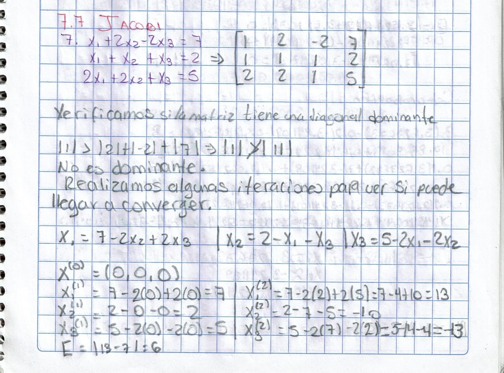{width=600}

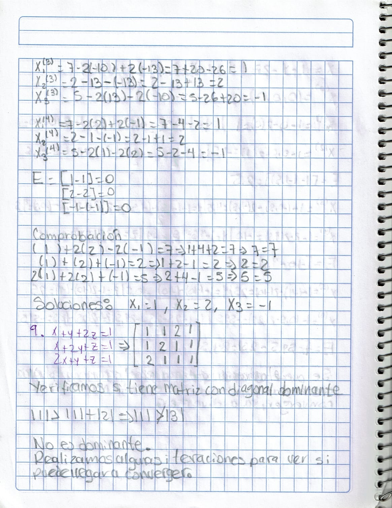{width=600}


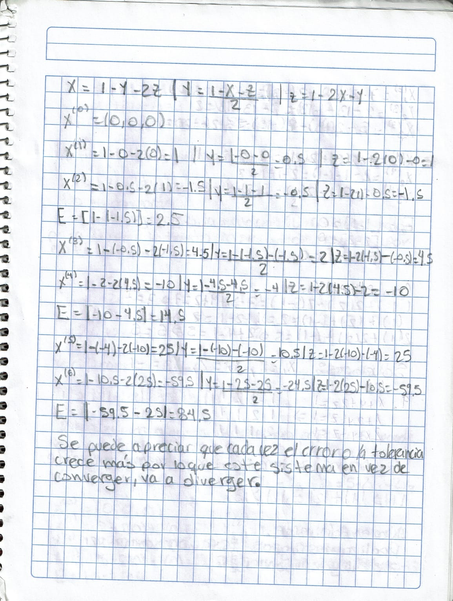{width=600}


#### Sistema $1$

$A = \left[\begin{array}{cccc|c}
10 & 2 & -1 & 0 & 26 \\
1 & 20 & -2 & 3 & -15 \\
-2 & 1 & 30 & 0 & 53 \\
1 & 2 & 3 & 20 & 47
\end{array}\right]$


##### Procedimiento

```{r}

A <- matrix(c(10, 2, -1, 0,
              1, 20, -2, 3,
              -2, 1, 30, 0,
              1, 2, 3, 20),
      nrow = 4, byrow = TRUE)
b <- matrix(c(26, -15, 53, 47), nrow = 4)

Ab <- cbind(A, b); (Ab)

```

```{r}
# Checar si converge o no con la diagonal dominante

F1 <- abs(A[1,1]) > (abs(A[1,2]) + abs(A[1,3]) + abs(A[1,4]))
F2 <- abs(A[2,2]) > (abs(A[2,1]) + abs(A[2,3])+ abs(A[2,4]))
F3 <- abs(A[3,3]) > (abs(A[3,1]) + abs(A[3,2])+ abs(A[3,4]))
F4 <- abs(A[4,4]) > (abs(A[4,1]) + abs(A[4,2])+ abs(A[4,3]))

if(F1 == TRUE & F2 == TRUE & F3 == TRUE) {
  cat("Sí es dominante")
} else {
  cat("No es dominante")
}
```

```{r}
# Asignar valores iniciales

x <- rep(0, 4) # x^(0)=(0,0,0)
cat("x^(0)=",paste(sprintf("%.8f",x), collapse=", "), "\n")
```

###### Iteración 1

```{r}
x_old <- x
x[1] <- (b[1] - A[1,2] * x_old[2] - A[1,3] * x_old[3] - A[1,4] * x_old[4]) / A[1,1]
cat(sprintf("x1^(1) = (%.1f - (%.1f)*%.8f - (%.1f)*%.8f - (%.1f)*%.8f)/%.1f = %.8f\n", b[1], A[1,2], x_old[2], A[1,3], x_old[3],A[1,4], x_old[4], A[1,1], x[1]))


x[2] <- (b[2] - A[2,1]*x_old[1] - A[2,3]*x_old[3] - A[2,4]*x_old[4]) / A[2,2]
cat(sprintf("x2^(1) = (%.1f - (%.1f)*%.8f - (%.1f)*%.8f - (%.1f)*%.8f)/%.1f = %.8f\n", b[2], A[2,1], x_old[1], A[2,3], x_old[3],A[2,4], x_old[4], A[2,2], x[2]))


x[3] <- (b[3] - A[3,1]*x_old[1] - A[3,2]*x_old[2] - A[3,4]*x_old[4]) / A[3,3]
cat(sprintf("x3^(1) = (%.1f - (%.1f)*%.8f - (%.1f)*%.8f - (%.1f)*%.8f)/%.1f = %.8f\n", b[3], A[3,1], x_old[1], A[3,2], x_old[2], A[3,4], x_old[4], A[3,3], x[3]))

x[4] <- (b[4] - A[4,1]*x_old[1] - A[4,2]*x_old[2] - A[4,3]*x_old[3]) / A[4,4]
cat(sprintf("x4^(1) = (%.1f - (%.1f)*%.8f - (%.1f)*%.8f - (%.1f)*%.8f)/%.1f = %.8f\n", b[4], A[4,1], x_old[1], A[4,2], x_old[2], A[4,3], x_old[4], A[4,4], x[4]))
```

```{r}
# Imprime los valores de la iteración
x_old <- x
x1 <- x_old[1]; (x1)
x2 <- x_old[2]; (x2)
x3 <- x_old[3]; (x3)
x4 <- x_old[4]; (x4)
```

```{r}
#Error o tolerancia

r <- b - A %*% x
dx_inf <- max(abs(x - x_old))
cat(sprintf("x^(1) = %s\n", paste(sprintf("%.8f", x), collapse=", ")))
cat(sprintf("||dx||_inf = %.8e | ||r||_inf = %.8e\n", dx_inf, max(abs(r))))
```

###### Iteración 2

```{r}
x_old <- x
x[1] <- (b[1] - A[1,2] * x_old[2] - A[1,3] * x_old[3] - A[1,4] * x_old[4]) / A[1,1]
cat(sprintf("x1^(2) = (%.1f - (%.1f)*%.8f - (%.1f)*%.8f - (%.1f)*%.8f)/%.1f = %.8f\n", b[1], A[1,2], x_old[2], A[1,3], x_old[3],A[1,4], x_old[4], A[1,1], x[1]))


x[2] <- (b[2] - A[2,1]*x_old[1] - A[2,3]*x_old[3] - A[2,4]*x_old[4]) / A[2,2]
cat(sprintf("x2^(2) = (%.1f - (%.1f)*%.8f - (%.1f)*%.8f - (%.1f)*%.8f)/%.1f = %.8f\n", b[2], A[2,1], x_old[1], A[2,3], x_old[3],A[2,4], x_old[4], A[2,2], x[2]))


x[3] <- (b[3] - A[3,1]*x_old[1] - A[3,2]*x_old[2] - A[3,4]*x_old[4]) / A[3,3]
cat(sprintf("x3^(2) = (%.1f - (%.1f)*%.8f - (%.1f)*%.8f - (%.1f)*%.8f)/%.1f = %.8f\n", b[3], A[3,1], x_old[1], A[3,2], x_old[2], A[3,4], x_old[4], A[3,3], x[3]))

x[4] <- (b[4] - A[4,1]*x_old[1] - A[4,2]*x_old[2] - A[4,3]*x_old[3]) / A[4,4]
cat(sprintf("x4^(2) = (%.1f - (%.1f)*%.8f - (%.1f)*%.8f - (%.1f)*%.8f)/%.1f = %.8f\n", b[4], A[4,1], x_old[1], A[4,2], x_old[2], A[4,3], x_old[4], A[4,4], x[4]))
```

```{r}
# Imprime los valores de la iteración
x_old <- x
x1 <- x_old[1]; (x1)
x2 <- x_old[2]; (x2)
x3 <- x_old[3]; (x3)
x4 <- x_old[4]; (x4)
```

```{r}
#Error o tolerancia

r <- b - A %*% x
dx_inf <- max(abs(x - x_old))
cat(sprintf("x^(2) = %s\n", paste(sprintf("%.8f", x), collapse=", ")))
cat(sprintf("||dx||_inf = %.8e | ||r||_inf = %.8e\n", dx_inf, max(abs(r))))
```

###### Iteración 3

```{r}
x_old <- x
x[1] <- (b[1] - A[1,2] * x_old[2] - A[1,3] * x_old[3] - A[1,4] * x_old[4]) / A[1,1]
cat(sprintf("x1^(3) = (%.1f - (%.1f)*%.8f - (%.1f)*%.8f - (%.1f)*%.8f)/%.1f = %.8f\n", b[1], A[1,2], x_old[2], A[1,3], x_old[3],A[1,4], x_old[4], A[1,1], x[1]))


x[2] <- (b[2] - A[2,1]*x_old[1] - A[2,3]*x_old[3] - A[2,4]*x_old[4]) / A[2,2]
cat(sprintf("x2^(3) = (%.1f - (%.1f)*%.8f - (%.1f)*%.8f - (%.1f)*%.8f)/%.1f = %.8f\n", b[2], A[2,1], x_old[1], A[2,3], x_old[3],A[2,4], x_old[4], A[2,2], x[2]))


x[3] <- (b[3] - A[3,1]*x_old[1] - A[3,2]*x_old[2] - A[3,4]*x_old[4]) / A[3,3]
cat(sprintf("x3^(3) = (%.1f - (%.1f)*%.8f - (%.1f)*%.8f - (%.1f)*%.8f)/%.1f = %.8f\n", b[3], A[3,1], x_old[1], A[3,2], x_old[2], A[3,4], x_old[4], A[3,3], x[3]))

x[4] <- (b[4] - A[4,1]*x_old[1] - A[4,2]*x_old[2] - A[4,3]*x_old[3]) / A[4,4]
cat(sprintf("x4^(3) = (%.1f - (%.1f)*%.8f - (%.1f)*%.8f - (%.1f)*%.8f)/%.1f = %.8f\n", b[4], A[4,1], x_old[1], A[4,2], x_old[2], A[4,3], x_old[4], A[4,4], x[4]))
```

```{r}
# Imprime los valores de la iteración
x_old <- x
x1 <- x_old[1]; (x1)
x2 <- x_old[2]; (x2)
x3 <- x_old[3]; (x3)
x4 <- x_old[4]; (x4)
```

```{r}
#Error o tolerancia

r <- b - A %*% x
dx_inf <- max(abs(x - x_old))
cat(sprintf("x^(3) = %s\n", paste(sprintf("%.8f", x), collapse=", ")))
cat(sprintf("||dx||_inf = %.8e | ||r||_inf = %.8e\n", dx_inf, max(abs(r))))
```

###### Iteración 4

```{r}
x_old <- x
x[1] <- (b[1] - A[1,2] * x_old[2] - A[1,3] * x_old[3] - A[1,4] * x_old[4]) / A[1,1]
cat(sprintf("x1^(4) = (%.1f - (%.1f)*%.8f - (%.1f)*%.8f - (%.1f)*%.8f)/%.1f = %.8f\n", b[1], A[1,2], x_old[2], A[1,3], x_old[3],A[1,4], x_old[4], A[1,1], x[1]))


x[2] <- (b[2] - A[2,1]*x_old[1] - A[2,3]*x_old[3] - A[2,4]*x_old[4]) / A[2,2]
cat(sprintf("x2^(4) = (%.1f - (%.1f)*%.8f - (%.1f)*%.8f - (%.1f)*%.8f)/%.1f = %.8f\n", b[2], A[2,1], x_old[1], A[2,3], x_old[3],A[2,4], x_old[4], A[2,2], x[2]))


x[3] <- (b[3] - A[3,1]*x_old[1] - A[3,2]*x_old[2] - A[3,4]*x_old[4]) / A[3,3]
cat(sprintf("x3^(4) = (%.1f - (%.1f)*%.8f - (%.1f)*%.8f - (%.1f)*%.8f)/%.1f = %.8f\n", b[3], A[3,1], x_old[1], A[3,2], x_old[2], A[3,4], x_old[4], A[3,3], x[3]))

x[4] <- (b[4] - A[4,1]*x_old[1] - A[4,2]*x_old[2] - A[4,3]*x_old[3]) / A[4,4]
cat(sprintf("x4^(4) = (%.1f - (%.1f)*%.8f - (%.1f)*%.8f - (%.1f)*%.8f)/%.1f = %.8f\n", b[4], A[4,1], x_old[1], A[4,2], x_old[2], A[4,3], x_old[4], A[4,4], x[4]))
```

```{r}
# Imprime los valores de la iteración
x_old <- x
x1 <- x_old[1]; (x1)
x2 <- x_old[2]; (x2)
x3 <- x_old[3]; (x3)
x4 <- x_old[4]; (x4)
```

```{r}
#Error o tolerancia

r <- b - A %*% x
dx_inf <- max(abs(x - x_old))
cat(sprintf("x^(4) = %s\n", paste(sprintf("%.8f", x), collapse=", ")))
cat(sprintf("||dx||_inf = %.8e | ||r||_inf = %.8e\n", dx_inf, max(abs(r))))
```

###### Iteración 5

```{r}
x_old <- x
x[1] <- (b[1] - A[1,2] * x_old[2] - A[1,3] * x_old[3] - A[1,4] * x_old[4]) / A[1,1]
cat(sprintf("x1^(5) = (%.1f - (%.1f)*%.8f - (%.1f)*%.8f - (%.1f)*%.8f)/%.1f = %.8f\n", b[1], A[1,2], x_old[2], A[1,3], x_old[3],A[1,4], x_old[4], A[1,1], x[1]))


x[2] <- (b[2] - A[2,1]*x_old[1] - A[2,3]*x_old[3] - A[2,4]*x_old[4]) / A[2,2]
cat(sprintf("x2^(5) = (%.1f - (%.1f)*%.8f - (%.1f)*%.8f - (%.1f)*%.8f)/%.1f = %.8f\n", b[2], A[2,1], x_old[1], A[2,3], x_old[3],A[2,4], x_old[4], A[2,2], x[2]))


x[3] <- (b[3] - A[3,1]*x_old[1] - A[3,2]*x_old[2] - A[3,4]*x_old[4]) / A[3,3]
cat(sprintf("x3^(5) = (%.1f - (%.1f)*%.8f - (%.1f)*%.8f - (%.1f)*%.8f)/%.1f = %.8f\n", b[3], A[3,1], x_old[1], A[3,2], x_old[2], A[3,4], x_old[4], A[3,3], x[3]))

x[4] <- (b[4] - A[4,1]*x_old[1] - A[4,2]*x_old[2] - A[4,3]*x_old[3]) / A[4,4]
cat(sprintf("x4^(5) = (%.1f - (%.1f)*%.8f - (%.1f)*%.8f - (%.1f)*%.8f)/%.1f = %.8f\n", b[4], A[4,1], x_old[1], A[4,2], x_old[2], A[4,3], x_old[4], A[4,4], x[4]))
```

```{r}
# Imprime los valores de la iteración
x_old <- x
x1 <- x_old[1]; (x1)
x2 <- x_old[2]; (x2)
x3 <- x_old[3]; (x3)
x4 <- x_old[4]; (x4)
```

```{r}
#Error o tolerancia

r <- b - A %*% x
dx_inf <- max(abs(x - x_old))
cat(sprintf("x^(5) = %s\n", paste(sprintf("%.8f", x), collapse=", ")))
cat(sprintf("||dx||_inf = %.8e | ||r||_inf = %.8e\n", dx_inf, max(abs(r))))
```

###### Iteración 6

```{r}
x_old <- x
x[1] <- (b[1] - A[1,2] * x_old[2] - A[1,3] * x_old[3] - A[1,4] * x_old[4]) / A[1,1]
cat(sprintf("x1^(6) = (%.1f - (%.1f)*%.8f - (%.1f)*%.8f - (%.1f)*%.8f)/%.1f = %.8f\n", b[1], A[1,2], x_old[2], A[1,3], x_old[3],A[1,4], x_old[4], A[1,1], x[1]))


x[2] <- (b[2] - A[2,1]*x_old[1] - A[2,3]*x_old[3] - A[2,4]*x_old[4]) / A[2,2]
cat(sprintf("x2^(6) = (%.1f - (%.1f)*%.8f - (%.1f)*%.8f - (%.1f)*%.8f)/%.1f = %.8f\n", b[2], A[2,1], x_old[1], A[2,3], x_old[3],A[2,4], x_old[4], A[2,2], x[2]))


x[3] <- (b[3] - A[3,1]*x_old[1] - A[3,2]*x_old[2] - A[3,4]*x_old[4]) / A[3,3]
cat(sprintf("x3^(6) = (%.1f - (%.1f)*%.8f - (%.1f)*%.8f - (%.1f)*%.8f)/%.1f = %.8f\n", b[3], A[3,1], x_old[1], A[3,2], x_old[2], A[3,4], x_old[4], A[3,3], x[3]))

x[4] <- (b[4] - A[4,1]*x_old[1] - A[4,2]*x_old[2] - A[4,3]*x_old[3]) / A[4,4]
cat(sprintf("x4^(6) = (%.1f - (%.1f)*%.8f - (%.1f)*%.8f - (%.1f)*%.8f)/%.1f = %.8f\n", b[4], A[4,1], x_old[1], A[4,2], x_old[2], A[4,3], x_old[4], A[4,4], x[4]))
```

```{r}
# Imprime los valores de la iteración
x_old <- x
x1 <- x_old[1]; (x1)
x2 <- x_old[2]; (x2)
x3 <- x_old[3]; (x3)
x4 <- x_old[4]; (x4)
```

```{r}
#Error o tolerancia

r <- b - A %*% x
dx_inf <- max(abs(x - x_old))
cat(sprintf("x^(6) = %s\n", paste(sprintf("%.8f", x), collapse=", ")))
cat(sprintf("||dx||_inf = %.8e | ||r||_inf = %.8e\n", dx_inf, max(abs(r))))
```

###### Iteración 7

```{r}
x_old <- x
x[1] <- (b[1] - A[1,2] * x_old[2] - A[1,3] * x_old[3] - A[1,4] * x_old[4]) / A[1,1]
cat(sprintf("x1^(7) = (%.1f - (%.1f)*%.8f - (%.1f)*%.8f - (%.1f)*%.8f)/%.1f = %.8f\n", b[1], A[1,2], x_old[2], A[1,3], x_old[3],A[1,4], x_old[4], A[1,1], x[1]))


x[2] <- (b[2] - A[2,1]*x_old[1] - A[2,3]*x_old[3] - A[2,4]*x_old[4]) / A[2,2]
cat(sprintf("x2^(7) = (%.1f - (%.1f)*%.8f - (%.1f)*%.8f - (%.1f)*%.8f)/%.1f = %.8f\n", b[2], A[2,1], x_old[1], A[2,3], x_old[3],A[2,4], x_old[4], A[2,2], x[2]))


x[3] <- (b[3] - A[3,1]*x_old[1] - A[3,2]*x_old[2] - A[3,4]*x_old[4]) / A[3,3]
cat(sprintf("x3^(7) = (%.1f - (%.1f)*%.8f - (%.1f)*%.8f - (%.1f)*%.8f)/%.1f = %.8f\n", b[3], A[3,1], x_old[1], A[3,2], x_old[2], A[3,4], x_old[4], A[3,3], x[3]))

x[4] <- (b[4] - A[4,1]*x_old[1] - A[4,2]*x_old[2] - A[4,3]*x_old[3]) / A[4,4]
cat(sprintf("x4^(7) = (%.1f - (%.1f)*%.8f - (%.1f)*%.8f - (%.1f)*%.8f)/%.1f = %.8f\n", b[4], A[4,1], x_old[1], A[4,2], x_old[2], A[4,3], x_old[4], A[4,4], x[4]))
```

```{r}
# Imprime los valores de la iteración
x_old <- x
x1 <- x_old[1]; (x1)
x2 <- x_old[2]; (x2)
x3 <- x_old[3]; (x3)
x4 <- x_old[4]; (x4)
```

```{r}
#Error o tolerancia

r <- b - A %*% x
dx_inf <- max(abs(x - x_old))
cat(sprintf("x^(7) = %s\n", paste(sprintf("%.8f", x), collapse=", ")))
cat(sprintf("||dx||_inf = %.8e | ||r||_inf = %.8e\n", dx_inf, max(abs(r))))
```

###### Iteración 8

```{r}
x_old <- x
x[1] <- (b[1] - A[1,2] * x_old[2] - A[1,3] * x_old[3] - A[1,4] * x_old[4]) / A[1,1]
cat(sprintf("x1^(8) = (%.1f - (%.1f)*%.8f - (%.1f)*%.8f - (%.1f)*%.8f)/%.1f = %.8f\n", b[1], A[1,2], x_old[2], A[1,3], x_old[3],A[1,4], x_old[4], A[1,1], x[1]))


x[2] <- (b[2] - A[2,1]*x_old[1] - A[2,3]*x_old[3] - A[2,4]*x_old[4]) / A[2,2]
cat(sprintf("x2^(8) = (%.1f - (%.1f)*%.8f - (%.1f)*%.8f - (%.1f)*%.8f)/%.1f = %.8f\n", b[2], A[2,1], x_old[1], A[2,3], x_old[3],A[2,4], x_old[4], A[2,2], x[2]))


x[3] <- (b[3] - A[3,1]*x_old[1] - A[3,2]*x_old[2] - A[3,4]*x_old[4]) / A[3,3]
cat(sprintf("x3^(8) = (%.1f - (%.1f)*%.8f - (%.1f)*%.8f - (%.1f)*%.8f)/%.1f = %.8f\n", b[3], A[3,1], x_old[1], A[3,2], x_old[2], A[3,4], x_old[4], A[3,3], x[3]))

x[4] <- (b[4] - A[4,1]*x_old[1] - A[4,2]*x_old[2] - A[4,3]*x_old[3]) / A[4,4]
cat(sprintf("x4^(8) = (%.1f - (%.1f)*%.8f - (%.1f)*%.8f - (%.1f)*%.8f)/%.1f = %.8f\n", b[4], A[4,1], x_old[1], A[4,2], x_old[2], A[4,3], x_old[4], A[4,4], x[4]))
```

```{r}
# Imprime los valores de la iteración
x_old <- x
x1 <- x_old[1]; (x1)
x2 <- x_old[2]; (x2)
x3 <- x_old[3]; (x3)
x4 <- x_old[4]; (x4)
```

```{r}
#Error o tolerancia

r <- b - A %*% x
dx_inf <- max(abs(x - x_old))
cat(sprintf("x^(8) = %s\n", paste(sprintf("%.8f", x), collapse=", ")))
cat(sprintf("||dx||_inf = %.8e | ||r||_inf = %.8e\n", dx_inf, max(abs(r))))
```

###### Iteración 9

```{r}
x_old <- x
x[1] <- (b[1] - A[1,2] * x_old[2] - A[1,3] * x_old[3] - A[1,4] * x_old[4]) / A[1,1]
cat(sprintf("x1^(9) = (%.1f - (%.1f)*%.8f - (%.1f)*%.8f - (%.1f)*%.8f)/%.1f = %.8f\n", b[1], A[1,2], x_old[2], A[1,3], x_old[3],A[1,4], x_old[4], A[1,1], x[1]))


x[2] <- (b[2] - A[2,1]*x_old[1] - A[2,3]*x_old[3] - A[2,4]*x_old[4]) / A[2,2]
cat(sprintf("x2^(9) = (%.1f - (%.1f)*%.8f - (%.1f)*%.8f - (%.1f)*%.8f)/%.1f = %.8f\n", b[2], A[2,1], x_old[1], A[2,3], x_old[3],A[2,4], x_old[4], A[2,2], x[2]))


x[3] <- (b[3] - A[3,1]*x_old[1] - A[3,2]*x_old[2] - A[3,4]*x_old[4]) / A[3,3]
cat(sprintf("x3^(9) = (%.1f - (%.1f)*%.8f - (%.1f)*%.8f - (%.1f)*%.8f)/%.1f = %.8f\n", b[3], A[3,1], x_old[1], A[3,2], x_old[2], A[3,4], x_old[4], A[3,3], x[3]))

x[4] <- (b[4] - A[4,1]*x_old[1] - A[4,2]*x_old[2] - A[4,3]*x_old[3]) / A[4,4]
cat(sprintf("x4^(9) = (%.1f - (%.1f)*%.8f - (%.1f)*%.8f - (%.1f)*%.8f)/%.1f = %.8f\n", b[4], A[4,1], x_old[1], A[4,2], x_old[2], A[4,3], x_old[4], A[4,4], x[4]))
```

```{r}
# Imprime los valores de la iteración
x_old <- x
x1 <- x_old[1]; (x1)
x2 <- x_old[2]; (x2)
x3 <- x_old[3]; (x3)
x4 <- x_old[4]; (x4)
```

```{r}
#Error o tolerancia

r <- b - A %*% x
dx_inf <- max(abs(x - x_old))
cat(sprintf("x^(9) = %s\n", paste(sprintf("%.8f", x), collapse=", ")))
cat(sprintf("||dx||_inf = %.8e | ||r||_inf = %.8e\n", dx_inf, max(abs(r))))
```

###### Iteración 10

```{r}
x_old <- x
x[1] <- (b[1] - A[1,2] * x_old[2] - A[1,3] * x_old[3] - A[1,4] * x_old[4]) / A[1,1]
cat(sprintf("x1^(10) = (%.1f - (%.1f)*%.8f - (%.1f)*%.8f - (%.1f)*%.8f)/%.1f = %.8f\n", b[1], A[1,2], x_old[2], A[1,3], x_old[3],A[1,4], x_old[4], A[1,1], x[1]))


x[2] <- (b[2] - A[2,1]*x_old[1] - A[2,3]*x_old[3] - A[2,4]*x_old[4]) / A[2,2]
cat(sprintf("x2^(10) = (%.1f - (%.1f)*%.8f - (%.1f)*%.8f - (%.1f)*%.8f)/%.1f = %.8f\n", b[2], A[2,1], x_old[1], A[2,3], x_old[3],A[2,4], x_old[4], A[2,2], x[2]))


x[3] <- (b[3] - A[3,1]*x_old[1] - A[3,2]*x_old[2] - A[3,4]*x_old[4]) / A[3,3]
cat(sprintf("x3^(10) = (%.1f - (%.1f)*%.8f - (%.1f)*%.8f - (%.1f)*%.8f)/%.1f = %.8f\n", b[3], A[3,1], x_old[1], A[3,2], x_old[2], A[3,4], x_old[4], A[3,3], x[3]))

x[4] <- (b[4] - A[4,1]*x_old[1] - A[4,2]*x_old[2] - A[4,3]*x_old[3]) / A[4,4]
cat(sprintf("x4^(10) = (%.1f - (%.1f)*%.8f - (%.1f)*%.8f - (%.1f)*%.8f)/%.1f = %.8f\n", b[4], A[4,1], x_old[1], A[4,2], x_old[2], A[4,3], x_old[4], A[4,4], x[4]))
```

```{r}
# Imprime los valores de la iteración
x_old <- x
x1 <- x_old[1]; (x1)
x2 <- x_old[2]; (x2)
x3 <- x_old[3]; (x3)
x4 <- x_old[4]; (x4)
```

```{r}
#Error o tolerancia

r <- b - A %*% x
dx_inf <- max(abs(x - x_old))
cat(sprintf("x^(10) = %s\n", paste(sprintf("%.8f", x), collapse=", ")))
cat(sprintf("||dx||_inf = %.8e | ||r||_inf = %.8e\n", dx_inf, max(abs(r))))
```

###### Iteración 11

```{r}
x_old <- x
x[1] <- (b[1] - A[1,2] * x_old[2] - A[1,3] * x_old[3] - A[1,4] * x_old[4]) / A[1,1]
cat(sprintf("x1^(11) = (%.1f - (%.1f)*%.8f - (%.1f)*%.8f - (%.1f)*%.8f)/%.1f = %.8f\n", b[1], A[1,2], x_old[2], A[1,3], x_old[3],A[1,4], x_old[4], A[1,1], x[1]))


x[2] <- (b[2] - A[2,1]*x_old[1] - A[2,3]*x_old[3] - A[2,4]*x_old[4]) / A[2,2]
cat(sprintf("x2^(11) = (%.1f - (%.1f)*%.8f - (%.1f)*%.8f - (%.1f)*%.8f)/%.1f = %.8f\n", b[2], A[2,1], x_old[1], A[2,3], x_old[3],A[2,4], x_old[4], A[2,2], x[2]))


x[3] <- (b[3] - A[3,1]*x_old[1] - A[3,2]*x_old[2] - A[3,4]*x_old[4]) / A[3,3]
cat(sprintf("x3^(11) = (%.1f - (%.1f)*%.8f - (%.1f)*%.8f - (%.1f)*%.8f)/%.1f = %.8f\n", b[3], A[3,1], x_old[1], A[3,2], x_old[2], A[3,4], x_old[4], A[3,3], x[3]))

x[4] <- (b[4] - A[4,1]*x_old[1] - A[4,2]*x_old[2] - A[4,3]*x_old[3]) / A[4,4]
cat(sprintf("x4^(11) = (%.1f - (%.1f)*%.8f - (%.1f)*%.8f - (%.1f)*%.8f)/%.1f = %.8f\n", b[4], A[4,1], x_old[1], A[4,2], x_old[2], A[4,3], x_old[4], A[4,4], x[4]))
```

```{r}
# Imprime los valores de la iteración
x_old <- x
x1 <- x_old[1]; (x1)
x2 <- x_old[2]; (x2)
x3 <- x_old[3]; (x3)
x4 <- x_old[4]; (x4)
```

```{r}
#Error o tolerancia

r <- b - A %*% x
dx_inf <- max(abs(x - x_old))
cat(sprintf("x^(11) = %s\n", paste(sprintf("%.8f", x), collapse=", ")))
cat(sprintf("||dx||_inf = %.8e | ||r||_inf = %.8e\n", dx_inf, max(abs(r))))
```

###### Iteración 12

```{r}
x_old <- x
x[1] <- (b[1] - A[1,2] * x_old[2] - A[1,3] * x_old[3] - A[1,4] * x_old[4]) / A[1,1]
cat(sprintf("x1^(12) = (%.1f - (%.1f)*%.8f - (%.1f)*%.8f - (%.1f)*%.8f)/%.1f = %.8f\n", b[1], A[1,2], x_old[2], A[1,3], x_old[3],A[1,4], x_old[4], A[1,1], x[1]))


x[2] <- (b[2] - A[2,1]*x_old[1] - A[2,3]*x_old[3] - A[2,4]*x_old[4]) / A[2,2]
cat(sprintf("x2^(12) = (%.1f - (%.1f)*%.8f - (%.1f)*%.8f - (%.1f)*%.8f)/%.1f = %.8f\n", b[2], A[2,1], x_old[1], A[2,3], x_old[3],A[2,4], x_old[4], A[2,2], x[2]))


x[3] <- (b[3] - A[3,1]*x_old[1] - A[3,2]*x_old[2] - A[3,4]*x_old[4]) / A[3,3]
cat(sprintf("x3^(12) = (%.1f - (%.1f)*%.8f - (%.1f)*%.8f - (%.1f)*%.8f)/%.1f = %.8f\n", b[3], A[3,1], x_old[1], A[3,2], x_old[2], A[3,4], x_old[4], A[3,3], x[3]))

x[4] <- (b[4] - A[4,1]*x_old[1] - A[4,2]*x_old[2] - A[4,3]*x_old[3]) / A[4,4]
cat(sprintf("x4^(12) = (%.1f - (%.1f)*%.8f - (%.1f)*%.8f - (%.1f)*%.8f)/%.1f = %.8f\n", b[4], A[4,1], x_old[1], A[4,2], x_old[2], A[4,3], x_old[4], A[4,4], x[4]))
```

```{r}
# Imprime los valores de la iteración
x_old <- x
x1 <- x_old[1]; (x1)
x2 <- x_old[2]; (x2)
x3 <- x_old[3]; (x3)
x4 <- x_old[4]; (x4)
```

```{r}
#Error o tolerancia

r <- b - A %*% x
dx_inf <- max(abs(x - x_old))
cat(sprintf("x^(12) = %s\n", paste(sprintf("%.8f", x), collapse=", ")))
cat(sprintf("||dx||_inf = %.8e | ||r||_inf = %.8e\n", dx_inf, max(abs(r))))
```

###### Iteración 13

```{r}
x_old <- x
x[1] <- (b[1] - A[1,2] * x_old[2] - A[1,3] * x_old[3] - A[1,4] * x_old[4]) / A[1,1]
cat(sprintf("x1^(13) = (%.1f - (%.1f)*%.8f - (%.1f)*%.8f - (%.1f)*%.8f)/%.1f = %.8f\n", b[1], A[1,2], x_old[2], A[1,3], x_old[3],A[1,4], x_old[4], A[1,1], x[1]))


x[2] <- (b[2] - A[2,1]*x_old[1] - A[2,3]*x_old[3] - A[2,4]*x_old[4]) / A[2,2]
cat(sprintf("x2^(13) = (%.1f - (%.1f)*%.8f - (%.1f)*%.8f - (%.1f)*%.8f)/%.1f = %.8f\n", b[2], A[2,1], x_old[1], A[2,3], x_old[3],A[2,4], x_old[4], A[2,2], x[2]))


x[3] <- (b[3] - A[3,1]*x_old[1] - A[3,2]*x_old[2] - A[3,4]*x_old[4]) / A[3,3]
cat(sprintf("x3^(13) = (%.1f - (%.1f)*%.8f - (%.1f)*%.8f - (%.1f)*%.8f)/%.1f = %.8f\n", b[3], A[3,1], x_old[1], A[3,2], x_old[2], A[3,4], x_old[4], A[3,3], x[3]))

x[4] <- (b[4] - A[4,1]*x_old[1] - A[4,2]*x_old[2] - A[4,3]*x_old[3]) / A[4,4]
cat(sprintf("x4^(13) = (%.1f - (%.1f)*%.8f - (%.1f)*%.8f - (%.1f)*%.8f)/%.1f = %.8f\n", b[4], A[4,1], x_old[1], A[4,2], x_old[2], A[4,3], x_old[4], A[4,4], x[4]))
```

```{r}
# Imprime los valores de la iteración
x_old <- x
x1 <- x_old[1]; (x1)
x2 <- x_old[2]; (x2)
x3 <- x_old[3]; (x3)
x4 <- x_old[4]; (x4)
```

```{r}
#Error o tolerancia

r <- b - A %*% x
dx_inf <- max(abs(x - x_old))
cat(sprintf("x^(13) = %s\n", paste(sprintf("%.8f", x), collapse=", ")))
cat(sprintf("||dx||_inf = %.8e | ||r||_inf = %.8e\n", dx_inf, max(abs(r))))
```

###### Iteración 14

```{r}
x_old <- x
x[1] <- (b[1] - A[1,2] * x_old[2] - A[1,3] * x_old[3] - A[1,4] * x_old[4]) / A[1,1]
cat(sprintf("x1^(14) = (%.1f - (%.1f)*%.8f - (%.1f)*%.8f - (%.1f)*%.8f)/%.1f = %.8f\n", b[1], A[1,2], x_old[2], A[1,3], x_old[3],A[1,4], x_old[4], A[1,1], x[1]))


x[2] <- (b[2] - A[2,1]*x_old[1] - A[2,3]*x_old[3] - A[2,4]*x_old[4]) / A[2,2]
cat(sprintf("x2^(14) = (%.1f - (%.1f)*%.8f - (%.1f)*%.8f - (%.1f)*%.8f)/%.1f = %.8f\n", b[2], A[2,1], x_old[1], A[2,3], x_old[3],A[2,4], x_old[4], A[2,2], x[2]))


x[3] <- (b[3] - A[3,1]*x_old[1] - A[3,2]*x_old[2] - A[3,4]*x_old[4]) / A[3,3]
cat(sprintf("x3^(14) = (%.1f - (%.1f)*%.8f - (%.1f)*%.8f - (%.1f)*%.8f)/%.1f = %.8f\n", b[3], A[3,1], x_old[1], A[3,2], x_old[2], A[3,4], x_old[4], A[3,3], x[3]))

x[4] <- (b[4] - A[4,1]*x_old[1] - A[4,2]*x_old[2] - A[4,3]*x_old[3]) / A[4,4]
cat(sprintf("x4^(14) = (%.1f - (%.1f)*%.8f - (%.1f)*%.8f - (%.1f)*%.8f)/%.1f = %.8f\n", b[4], A[4,1], x_old[1], A[4,2], x_old[2], A[4,3], x_old[4], A[4,4], x[4]))
```

```{r}
# Imprime los valores de la iteración
x_old <- x
x1 <- x_old[1]; (x1)
x2 <- x_old[2]; (x2)
x3 <- x_old[3]; (x3)
x4 <- x_old[4]; (x4)
```

```{r}
#Error o tolerancia

r <- b - A %*% x
dx_inf <- max(abs(x - x_old))
cat(sprintf("x^(14) = %s\n", paste(sprintf("%.8f", x), collapse=", ")))
cat(sprintf("||dx||_inf = %.8e | ||r||_inf = %.8e\n", dx_inf, max(abs(r))))
```

###### Iteración 15

```{r}
x_old <- x
x[1] <- (b[1] - A[1,2] * x_old[2] - A[1,3] * x_old[3] - A[1,4] * x_old[4]) / A[1,1]
cat(sprintf("x1^(15) = (%.1f - (%.1f)*%.8f - (%.1f)*%.8f - (%.1f)*%.8f)/%.1f = %.8f\n", b[1], A[1,2], x_old[2], A[1,3], x_old[3],A[1,4], x_old[4], A[1,1], x[1]))


x[2] <- (b[2] - A[2,1]*x_old[1] - A[2,3]*x_old[3] - A[2,4]*x_old[4]) / A[2,2]
cat(sprintf("x2^(15) = (%.1f - (%.1f)*%.8f - (%.1f)*%.8f - (%.1f)*%.8f)/%.1f = %.8f\n", b[2], A[2,1], x_old[1], A[2,3], x_old[3],A[2,4], x_old[4], A[2,2], x[2]))


x[3] <- (b[3] - A[3,1]*x_old[1] - A[3,2]*x_old[2] - A[3,4]*x_old[4]) / A[3,3]
cat(sprintf("x3^(15) = (%.1f - (%.1f)*%.8f - (%.1f)*%.8f - (%.1f)*%.8f)/%.1f = %.8f\n", b[3], A[3,1], x_old[1], A[3,2], x_old[2], A[3,4], x_old[4], A[3,3], x[3]))

x[4] <- (b[4] - A[4,1]*x_old[1] - A[4,2]*x_old[2] - A[4,3]*x_old[3]) / A[4,4]
cat(sprintf("x4^(15) = (%.1f - (%.1f)*%.8f - (%.1f)*%.8f - (%.1f)*%.8f)/%.1f = %.8f\n", b[4], A[4,1], x_old[1], A[4,2], x_old[2], A[4,3], x_old[4], A[4,4], x[4]))
```

```{r}
# Imprime los valores de la iteración
x_old <- x
x1 <- x_old[1]; (x1)
x2 <- x_old[2]; (x2)
x3 <- x_old[3]; (x3)
x4 <- x_old[4]; (x4)
```

```{r}
#Error o tolerancia

r <- b - A %*% x
dx_inf <- max(abs(x - x_old))
cat(sprintf("x^(15) = %s\n", paste(sprintf("%.8f", x), collapse=", ")))
cat(sprintf("||dx||_inf = %.8e | ||r||_inf = %.8e\n", dx_inf, max(abs(r))))
```

###### Iteración 16

```{r}
x_old <- x
x[1] <- (b[1] - A[1,2] * x_old[2] - A[1,3] * x_old[3] - A[1,4] * x_old[4]) / A[1,1]
cat(sprintf("x1^(16) = (%.1f - (%.1f)*%.8f - (%.1f)*%.8f - (%.1f)*%.8f)/%.1f = %.8f\n", b[1], A[1,2], x_old[2], A[1,3], x_old[3],A[1,4], x_old[4], A[1,1], x[1]))


x[2] <- (b[2] - A[2,1]*x_old[1] - A[2,3]*x_old[3] - A[2,4]*x_old[4]) / A[2,2]
cat(sprintf("x2^(16) = (%.1f - (%.1f)*%.8f - (%.1f)*%.8f - (%.1f)*%.8f)/%.1f = %.8f\n", b[2], A[2,1], x_old[1], A[2,3], x_old[3],A[2,4], x_old[4], A[2,2], x[2]))


x[3] <- (b[3] - A[3,1]*x_old[1] - A[3,2]*x_old[2] - A[3,4]*x_old[4]) / A[3,3]
cat(sprintf("x3^(16) = (%.1f - (%.1f)*%.8f - (%.1f)*%.8f - (%.1f)*%.8f)/%.1f = %.8f\n", b[3], A[3,1], x_old[1], A[3,2], x_old[2], A[3,4], x_old[4], A[3,3], x[3]))

x[4] <- (b[4] - A[4,1]*x_old[1] - A[4,2]*x_old[2] - A[4,3]*x_old[3]) / A[4,4]
cat(sprintf("x4^(16) = (%.1f - (%.1f)*%.8f - (%.1f)*%.8f - (%.1f)*%.8f)/%.1f = %.8f\n", b[4], A[4,1], x_old[1], A[4,2], x_old[2], A[4,3], x_old[4], A[4,4], x[4]))
```

```{r}
# Imprime los valores de la iteración
x_old <- x
x1 <- x_old[1]; (x1)
x2 <- x_old[2]; (x2)
x3 <- x_old[3]; (x3)
x4 <- x_old[4]; (x4)
```

```{r}
#Error o tolerancia

r <- b - A %*% x
dx_inf <- max(abs(x - x_old))
cat(sprintf("x^(16) = %s\n", paste(sprintf("%.8f", x), collapse=", ")))
cat(sprintf("||dx||_inf = %.8e | ||r||_inf = %.8e\n", dx_inf, max(abs(r))))
```

###### Iteración 17

```{r}
x_old <- x
x[1] <- (b[1] - A[1,2] * x_old[2] - A[1,3] * x_old[3] - A[1,4] * x_old[4]) / A[1,1]
cat(sprintf("x1^(17) = (%.1f - (%.1f)*%.8f - (%.1f)*%.8f - (%.1f)*%.8f)/%.1f = %.8f\n", b[1], A[1,2], x_old[2], A[1,3], x_old[3],A[1,4], x_old[4], A[1,1], x[1]))


x[2] <- (b[2] - A[2,1]*x_old[1] - A[2,3]*x_old[3] - A[2,4]*x_old[4]) / A[2,2]
cat(sprintf("x2^(17) = (%.1f - (%.1f)*%.8f - (%.1f)*%.8f - (%.1f)*%.8f)/%.1f = %.8f\n", b[2], A[2,1], x_old[1], A[2,3], x_old[3],A[2,4], x_old[4], A[2,2], x[2]))


x[3] <- (b[3] - A[3,1]*x_old[1] - A[3,2]*x_old[2] - A[3,4]*x_old[4]) / A[3,3]
cat(sprintf("x3^(17) = (%.1f - (%.1f)*%.8f - (%.1f)*%.8f - (%.1f)*%.8f)/%.1f = %.8f\n", b[3], A[3,1], x_old[1], A[3,2], x_old[2], A[3,4], x_old[4], A[3,3], x[3]))

x[4] <- (b[4] - A[4,1]*x_old[1] - A[4,2]*x_old[2] - A[4,3]*x_old[3]) / A[4,4]
cat(sprintf("x4^(17) = (%.1f - (%.1f)*%.8f - (%.1f)*%.8f - (%.1f)*%.8f)/%.1f = %.8f\n", b[4], A[4,1], x_old[1], A[4,2], x_old[2], A[4,3], x_old[4], A[4,4], x[4]))
```

```{r}
# Imprime los valores de la iteración
x_old <- x
x1 <- x_old[1]; (x1)
x2 <- x_old[2]; (x2)
x3 <- x_old[3]; (x3)
x4 <- x_old[4]; (x4)
```

```{r}
#Error o tolerancia

r <- b - A %*% x
dx_inf <- max(abs(x - x_old))
cat(sprintf("x^(17) = %s\n", paste(sprintf("%.8f", x), collapse=", ")))
cat(sprintf("||dx||_inf = %.8e | ||r||_inf = %.8e\n", dx_inf, max(abs(r))))
```

###### Iteración 18

```{r}
x_old <- x
x[1] <- (b[1] - A[1,2] * x_old[2] - A[1,3] * x_old[3] - A[1,4] * x_old[4]) / A[1,1]
cat(sprintf("x1^(18) = (%.1f - (%.1f)*%.8f - (%.1f)*%.8f - (%.1f)*%.8f)/%.1f = %.8f\n", b[1], A[1,2], x_old[2], A[1,3], x_old[3],A[1,4], x_old[4], A[1,1], x[1]))


x[2] <- (b[2] - A[2,1]*x_old[1] - A[2,3]*x_old[3] - A[2,4]*x_old[4]) / A[2,2]
cat(sprintf("x2^(18) = (%.1f - (%.1f)*%.8f - (%.1f)*%.8f - (%.1f)*%.8f)/%.1f = %.8f\n", b[2], A[2,1], x_old[1], A[2,3], x_old[3],A[2,4], x_old[4], A[2,2], x[2]))


x[3] <- (b[3] - A[3,1]*x_old[1] - A[3,2]*x_old[2] - A[3,4]*x_old[4]) / A[3,3]
cat(sprintf("x3^(18) = (%.1f - (%.1f)*%.8f - (%.1f)*%.8f - (%.1f)*%.8f)/%.1f = %.8f\n", b[3], A[3,1], x_old[1], A[3,2], x_old[2], A[3,4], x_old[4], A[3,3], x[3]))

x[4] <- (b[4] - A[4,1]*x_old[1] - A[4,2]*x_old[2] - A[4,3]*x_old[3]) / A[4,4]
cat(sprintf("x4^(18) = (%.1f - (%.1f)*%.8f - (%.1f)*%.8f - (%.1f)*%.8f)/%.1f = %.8f\n", b[4], A[4,1], x_old[1], A[4,2], x_old[2], A[4,3], x_old[4], A[4,4], x[4]))
```

```{r}
# Imprime los valores de la iteración
x_old <- x
x1 <- x_old[1]; (x1)
x2 <- x_old[2]; (x2)
x3 <- x_old[3]; (x3)
x4 <- x_old[4]; (x4)
```

```{r}
#Error o tolerancia

r <- b - A %*% x
dx_inf <- max(abs(x - x_old))
cat(sprintf("x^(18) = %s\n", paste(sprintf("%.8f", x), collapse=", ")))
cat(sprintf("||dx||_inf = %.8e | ||r||_inf = %.8e\n", dx_inf, max(abs(r))))
```

###### Iteración 19

```{r}
x_old <- x
x[1] <- (b[1] - A[1,2] * x_old[2] - A[1,3] * x_old[3] - A[1,4] * x_old[4]) / A[1,1]
cat(sprintf("x1^(19) = (%.1f - (%.1f)*%.8f - (%.1f)*%.8f - (%.1f)*%.8f)/%.1f = %.8f\n", b[1], A[1,2], x_old[2], A[1,3], x_old[3],A[1,4], x_old[4], A[1,1], x[1]))


x[2] <- (b[2] - A[2,1]*x_old[1] - A[2,3]*x_old[3] - A[2,4]*x_old[4]) / A[2,2]
cat(sprintf("x2^(19) = (%.1f - (%.1f)*%.8f - (%.1f)*%.8f - (%.1f)*%.8f)/%.1f = %.8f\n", b[2], A[2,1], x_old[1], A[2,3], x_old[3],A[2,4], x_old[4], A[2,2], x[2]))


x[3] <- (b[3] - A[3,1]*x_old[1] - A[3,2]*x_old[2] - A[3,4]*x_old[4]) / A[3,3]
cat(sprintf("x3^(19) = (%.1f - (%.1f)*%.8f - (%.1f)*%.8f - (%.1f)*%.8f)/%.1f = %.8f\n", b[3], A[3,1], x_old[1], A[3,2], x_old[2], A[3,4], x_old[4], A[3,3], x[3]))

x[4] <- (b[4] - A[4,1]*x_old[1] - A[4,2]*x_old[2] - A[4,3]*x_old[3]) / A[4,4]
cat(sprintf("x4^(19) = (%.1f - (%.1f)*%.8f - (%.1f)*%.8f - (%.1f)*%.8f)/%.1f = %.8f\n", b[4], A[4,1], x_old[1], A[4,2], x_old[2], A[4,3], x_old[4], A[4,4], x[4]))
```

```{r}
# Imprime los valores de la iteración
x_old <- x
x1 <- x_old[1]; (x1)
x2 <- x_old[2]; (x2)
x3 <- x_old[3]; (x3)
x4 <- x_old[4]; (x4)
```

```{r}
#Error o tolerancia

r <- b - A %*% x
dx_inf <- max(abs(x - x_old))
cat(sprintf("x^(19) = %s\n", paste(sprintf("%.8f", x), collapse=", ")))
cat(sprintf("||dx||_inf = %.8e | ||r||_inf = %.8e\n", dx_inf, max(abs(r))))
```

###### Iteración 20

```{r}
x_old <- x
x[1] <- (b[1] - A[1,2] * x_old[2] - A[1,3] * x_old[3] - A[1,4] * x_old[4]) / A[1,1]
cat(sprintf("x1^(20) = (%.1f - (%.1f)*%.8f - (%.1f)*%.8f - (%.1f)*%.8f)/%.1f = %.8f\n", b[1], A[1,2], x_old[2], A[1,3], x_old[3],A[1,4], x_old[4], A[1,1], x[1]))


x[2] <- (b[2] - A[2,1]*x_old[1] - A[2,3]*x_old[3] - A[2,4]*x_old[4]) / A[2,2]
cat(sprintf("x2^(20) = (%.1f - (%.1f)*%.8f - (%.1f)*%.8f - (%.1f)*%.8f)/%.1f = %.8f\n", b[2], A[2,1], x_old[1], A[2,3], x_old[3],A[2,4], x_old[4], A[2,2], x[2]))


x[3] <- (b[3] - A[3,1]*x_old[1] - A[3,2]*x_old[2] - A[3,4]*x_old[4]) / A[3,3]
cat(sprintf("x3^(20) = (%.1f - (%.1f)*%.8f - (%.1f)*%.8f - (%.1f)*%.8f)/%.1f = %.8f\n", b[3], A[3,1], x_old[1], A[3,2], x_old[2], A[3,4], x_old[4], A[3,3], x[3]))

x[4] <- (b[4] - A[4,1]*x_old[1] - A[4,2]*x_old[2] - A[4,3]*x_old[3]) / A[4,4]
cat(sprintf("x4^(20) = (%.1f - (%.1f)*%.8f - (%.1f)*%.8f - (%.1f)*%.8f)/%.1f = %.8f\n", b[4], A[4,1], x_old[1], A[4,2], x_old[2], A[4,3], x_old[4], A[4,4], x[4]))
```

```{r}
# Imprime los valores de la iteración
x_old <- x
x1 <- x_old[1]; (x1)
x2 <- x_old[2]; (x2)
x3 <- x_old[3]; (x3)
x4 <- x_old[4]; (x4)
```

```{r}
#Error o tolerancia

r <- b - A %*% x
dx_inf <- max(abs(x - x_old))
cat(sprintf("x^(20) = %s\n", paste(sprintf("%.8f", x), collapse=", ")))
cat(sprintf("||dx||_inf = %.8e | ||r||_inf = %.8e\n", dx_inf, max(abs(r))))
```

```{r}
# Comprobación

I <- b[1]; (I)
II <- b[2]; (II)
III <- b[3]; (III)
IV <- b[4]; (IV)
c1 <- (A[1,1] * x1) + (A[1,2] * x2) + (A[1,3] * x3) + (A[1,4] * x4); paste0("El resultado es: ",c1)
c2 <- (A[2,1] * x1) + (A[2,2] * x2) + (A[2,3] * x3) + (A[2,4] * x4); paste0("El resultado es: ",c2)
c3 <- (A[3,1] * x1) + (A[3,2] * x2) + (A[3,3] * x3) + (A[3,4] * x4); paste0("El resultado es: ",c3)
c4<- (A[4,1] * x1) + (A[4,2] * x2) + (A[4,3] * x3) + (A[4,4] * x4); paste0("El resultado es: ",c4)

paste0("En la ecuación 1: ", c1, " tecnicamente es: ", I)
paste0("En la ecuación 2: ", c2, " tecnicamente es: ", II)
paste0("En la ecuación 3: ", c3, " tecnicamente es: ", III)
paste0("En la ecuación 3: ", c4, " tecnicamente es: ", IV)
```

##### Resultados

```{r}
cat("Soluciones del sistema:")
cat("x1 =", x1)
cat("x2 =", x2) 
cat("x3 =", x3)
cat("x4 =", x4)
```

#### Sistema $2$

$A = \left[\begin{array}{ccc|c}
-1 & 2 & 10 & 26 \\
11 & -1 & 2 & 12 \\
1 & 5 & 2 & 8 \\
\end{array}\right]$

##### Procedimiento

```{r}

A <- matrix(c(-1, 2, 10,
              11, -1, 2,
              1, 5, 2),
      nrow = 3, byrow = TRUE)
b <- matrix(c(11, 2, 8), nrow = 3)

Ab <- cbind(A, b); (Ab)

```

```{r}
# Checar si converge o no con la diagonal dominante

F1 <- abs(A[1,1]) > (abs(A[1,2]) + abs(A[1,3]))
F2 <- abs(A[2,2]) > (abs(A[2,1]) + abs(A[2,3]))
F3 <- abs(A[3,3]) > (abs(A[3,1]) + abs(A[3,2]))


if(F1 == TRUE & F2 == TRUE & F3 == TRUE) {
  cat("Sí es dominante")
} else {
  cat("No es dominante")
}
```

La matriz no tiene diagonal dominante pero se hacen 10 iteraciones para ver si puede llegar a converger.

```{r}
# Asignar valores iniciales

x <- rep(0, 3) # x^(0)=(0,0,0)
cat("x^(0)=",paste(sprintf("%.8f",x), collapse=", "), "\n")
```

###### Iteración 1

```{r}
x_old <- x
x[1] <- (b[1] - A[1,2] * x_old[2] - A[1,3] * x_old[3]) / A[1,1]
cat(sprintf("x1^(1) = (%.1f - (%.1f)*%.8f - (%.1f)*%.8f /%.1f = %.8f\n", b[1], A[1,2], x_old[2], A[1,3], x_old[3], A[1,1], x[1]))


x[2] <- (b[2] - A[2,1]*x_old[1] - A[2,3]*x_old[3]) / A[2,2]
cat(sprintf("x2^(1) = (%.1f - (%.1f)*%.8f - (%.1f)*%.8f /%.1f = %.8f\n", b[2], A[2,1], x_old[1], A[2,3], x_old[3], A[2,2], x[2]))


x[3] <- (b[3] - A[3,1]*x_old[1] - A[3,2]*x_old[2]) / A[3,3]
cat(sprintf("x3^(1) = (%.1f - (%.1f)*%.8f - (%.1f)*%.8f /%.1f = %.8f\n", b[3], A[3,1], x_old[1], A[3,2], x_old[2], A[3,3], x[3]))
```

```{r}
# Imprime los valores de la iteración
x_old <- x
x1 <- x_old[1]; (x1)
x2 <- x_old[2]; (x2)
x3 <- x_old[3]; (x3)
```

```{r}
#Error o tolerancia

r <- b - A %*% x
dx_inf <- max(abs(x - x_old))
cat(sprintf("x^(1) = %s\n", paste(sprintf("%.8f", x), collapse=", ")))
cat(sprintf("||dx||_inf = %.8e | ||r||_inf = %.8e\n", dx_inf, max(abs(r))))
```

###### Iteración 2

```{r}
x_old <- x
x[1] <- (b[1] - A[1,2] * x_old[2] - A[1,3] * x_old[3]) / A[1,1]
cat(sprintf("x1^(2) = (%.1f - (%.1f)*%.8f - (%.1f)*%.8f /%.1f = %.8f\n", b[1], A[1,2], x_old[2], A[1,3], x_old[3], A[1,1], x[1]))


x[2] <- (b[2] - A[2,1]*x_old[1] - A[2,3]*x_old[3]) / A[2,2]
cat(sprintf("x2^(2) = (%.1f - (%.1f)*%.8f - (%.1f)*%.8f /%.1f = %.8f\n", b[2], A[2,1], x_old[1], A[2,3], x_old[3], A[2,2], x[2]))


x[3] <- (b[3] - A[3,1]*x_old[1] - A[3,2]*x_old[2]) / A[3,3]
cat(sprintf("x3^(2) = (%.1f - (%.1f)*%.8f - (%.1f)*%.8f /%.1f = %.8f\n", b[3], A[3,1], x_old[1], A[3,2], x_old[2], A[3,3], x[3]))
```

```{r}
# Imprime los valores de la iteración
x_old <- x
x1 <- x_old[1]; (x1)
x2 <- x_old[2]; (x2)
x3 <- x_old[3]; (x3)
```

```{r}
#Error o tolerancia

r <- b - A %*% x
dx_inf <- max(abs(x - x_old))
cat(sprintf("x^(2) = %s\n", paste(sprintf("%.8f", x), collapse=", ")))
cat(sprintf("||dx||_inf = %.8e | ||r||_inf = %.8e\n", dx_inf, max(abs(r))))
```

###### Iteración 3

```{r}
x_old <- x
x[1] <- (b[1] - A[1,2] * x_old[2] - A[1,3] * x_old[3]) / A[1,1]
cat(sprintf("x1^(3) = (%.1f - (%.1f)*%.8f - (%.1f)*%.8f /%.1f = %.8f\n", b[1], A[1,2], x_old[2], A[1,3], x_old[3], A[1,1], x[1]))


x[2] <- (b[2] - A[2,1]*x_old[1] - A[2,3]*x_old[3]) / A[2,2]
cat(sprintf("x2^(3) = (%.1f - (%.1f)*%.8f - (%.1f)*%.8f /%.1f = %.8f\n", b[2], A[2,1], x_old[1], A[2,3], x_old[3], A[2,2], x[2]))


x[3] <- (b[3] - A[3,1]*x_old[1] - A[3,2]*x_old[2]) / A[3,3]
cat(sprintf("x3^(3) = (%.1f - (%.1f)*%.8f - (%.1f)*%.8f /%.1f = %.8f\n", b[3], A[3,1], x_old[1], A[3,2], x_old[2], A[3,3], x[3]))
```

```{r}
# Imprime los valores de la iteración
x_old <- x
x1 <- x_old[1]; (x1)
x2 <- x_old[2]; (x2)
x3 <- x_old[3]; (x3)
```

```{r}
#Error o tolerancia

r <- b - A %*% x
dx_inf <- max(abs(x - x_old))
cat(sprintf("x^(3) = %s\n", paste(sprintf("%.8f", x), collapse=", ")))
cat(sprintf("||dx||_inf = %.8e | ||r||_inf = %.8e\n", dx_inf, max(abs(r))))
```

###### Iteración 4

```{r}
x_old <- x
x[1] <- (b[1] - A[1,2] * x_old[2] - A[1,3] * x_old[3]) / A[1,1]
cat(sprintf("x1^(4) = (%.1f - (%.1f)*%.8f - (%.1f)*%.8f /%.1f = %.8f\n", b[1], A[1,2], x_old[2], A[1,3], x_old[3], A[1,1], x[1]))


x[2] <- (b[2] - A[2,1]*x_old[1] - A[2,3]*x_old[3]) / A[2,2]
cat(sprintf("x2^(4) = (%.1f - (%.1f)*%.8f - (%.1f)*%.8f /%.1f = %.8f\n", b[2], A[2,1], x_old[1], A[2,3], x_old[3], A[2,2], x[2]))


x[3] <- (b[3] - A[3,1]*x_old[1] - A[3,2]*x_old[2]) / A[3,3]
cat(sprintf("x3^(4) = (%.1f - (%.1f)*%.8f - (%.1f)*%.8f /%.1f = %.8f\n", b[3], A[3,1], x_old[1], A[3,2], x_old[2], A[3,3], x[3]))
```

```{r}
# Imprime los valores de la iteración
x_old <- x
x1 <- x_old[1]; (x1)
x2 <- x_old[2]; (x2)
x3 <- x_old[3]; (x3)
```

```{r}
#Error o tolerancia

r <- b - A %*% x
dx_inf <- max(abs(x - x_old))
cat(sprintf("x^(4) = %s\n", paste(sprintf("%.8f", x), collapse=", ")))
cat(sprintf("||dx||_inf = %.8e | ||r||_inf = %.8e\n", dx_inf, max(abs(r))))
```

###### Iteración 5

```{r}
x_old <- x
x[1] <- (b[1] - A[1,2] * x_old[2] - A[1,3] * x_old[3]) / A[1,1]
cat(sprintf("x1^(5) = (%.1f - (%.1f)*%.8f - (%.1f)*%.8f /%.1f = %.8f\n", b[1], A[1,2], x_old[2], A[1,3], x_old[3], A[1,1], x[1]))


x[2] <- (b[2] - A[2,1]*x_old[1] - A[2,3]*x_old[3]) / A[2,2]
cat(sprintf("x2^(5) = (%.1f - (%.1f)*%.8f - (%.1f)*%.8f /%.1f = %.8f\n", b[2], A[2,1], x_old[1], A[2,3], x_old[3], A[2,2], x[2]))


x[3] <- (b[3] - A[3,1]*x_old[1] - A[3,2]*x_old[2]) / A[3,3]
cat(sprintf("x3^(5) = (%.1f - (%.1f)*%.8f - (%.1f)*%.8f /%.1f = %.8f\n", b[3], A[3,1], x_old[1], A[3,2], x_old[2], A[3,3], x[3]))
```

```{r}
# Imprime los valores de la iteración
x_old <- x
x1 <- x_old[1]; (x1)
x2 <- x_old[2]; (x2)
x3 <- x_old[3]; (x3)
```

```{r}
#Error o tolerancia

r <- b - A %*% x
dx_inf <- max(abs(x - x_old))
cat(sprintf("x^(5) = %s\n", paste(sprintf("%.8f", x), collapse=", ")))
cat(sprintf("||dx||_inf = %.8e | ||r||_inf = %.8e\n", dx_inf, max(abs(r))))
```

###### Iteración 6

```{r}
x_old <- x
x[1] <- (b[1] - A[1,2] * x_old[2] - A[1,3] * x_old[3]) / A[1,1]
cat(sprintf("x1^(6) = (%.1f - (%.1f)*%.8f - (%.1f)*%.8f /%.1f = %.8f\n", b[1], A[1,2], x_old[2], A[1,3], x_old[3], A[1,1], x[1]))


x[2] <- (b[2] - A[2,1]*x_old[1] - A[2,3]*x_old[3]) / A[2,2]
cat(sprintf("x2^(6) = (%.1f - (%.1f)*%.8f - (%.1f)*%.8f /%.1f = %.8f\n", b[2], A[2,1], x_old[1], A[2,3], x_old[3], A[2,2], x[2]))


x[3] <- (b[3] - A[3,1]*x_old[1] - A[3,2]*x_old[2]) / A[3,3]
cat(sprintf("x3^(6) = (%.1f - (%.1f)*%.8f - (%.1f)*%.8f /%.1f = %.8f\n", b[3], A[3,1], x_old[1], A[3,2], x_old[2], A[3,3], x[3]))
```

```{r}
# Imprime los valores de la iteración
x_old <- x
x1 <- x_old[1]; (x1)
x2 <- x_old[2]; (x2)
x3 <- x_old[3]; (x3)
```

```{r}
#Error o tolerancia

r <- b - A %*% x
dx_inf <- max(abs(x - x_old))
cat(sprintf("x^(6) = %s\n", paste(sprintf("%.8f", x), collapse=", ")))
cat(sprintf("||dx||_inf = %.8e | ||r||_inf = %.8e\n", dx_inf, max(abs(r))))
```

###### Iteración 7

```{r}
x_old <- x
x[1] <- (b[1] - A[1,2] * x_old[2] - A[1,3] * x_old[3]) / A[1,1]
cat(sprintf("x1^(7) = (%.1f - (%.1f)*%.8f - (%.1f)*%.8f /%.1f = %.8f\n", b[1], A[1,2], x_old[2], A[1,3], x_old[3], A[1,1], x[1]))


x[2] <- (b[2] - A[2,1]*x_old[1] - A[2,3]*x_old[3]) / A[2,2]
cat(sprintf("x2^(7) = (%.1f - (%.1f)*%.8f - (%.1f)*%.8f /%.1f = %.8f\n", b[2], A[2,1], x_old[1], A[2,3], x_old[3], A[2,2], x[2]))


x[3] <- (b[3] - A[3,1]*x_old[1] - A[3,2]*x_old[2]) / A[3,3]
cat(sprintf("x3^(7) = (%.1f - (%.1f)*%.8f - (%.1f)*%.8f /%.1f = %.8f\n", b[3], A[3,1], x_old[1], A[3,2], x_old[2], A[3,3], x[3]))
```

```{r}
# Imprime los valores de la iteración
x_old <- x
x1 <- x_old[1]; (x1)
x2 <- x_old[2]; (x2)
x3 <- x_old[3]; (x3)
```

```{r}
#Error o tolerancia

r <- b - A %*% x
dx_inf <- max(abs(x - x_old))
cat(sprintf("x^(7) = %s\n", paste(sprintf("%.8f", x), collapse=", ")))
cat(sprintf("||dx||_inf = %.8e | ||r||_inf = %.8e\n", dx_inf, max(abs(r))))
```

###### Iteración 8

```{r}
x_old <- x
x[1] <- (b[1] - A[1,2] * x_old[2] - A[1,3] * x_old[3]) / A[1,1]
cat(sprintf("x1^(8) = (%.1f - (%.1f)*%.8f - (%.1f)*%.8f /%.1f = %.8f\n", b[1], A[1,2], x_old[2], A[1,3], x_old[3], A[1,1], x[1]))


x[2] <- (b[2] - A[2,1]*x_old[1] - A[2,3]*x_old[3]) / A[2,2]
cat(sprintf("x2^(8) = (%.1f - (%.1f)*%.8f - (%.1f)*%.8f /%.1f = %.8f\n", b[2], A[2,1], x_old[1], A[2,3], x_old[3], A[2,2], x[2]))


x[3] <- (b[3] - A[3,1]*x_old[1] - A[3,2]*x_old[2]) / A[3,3]
cat(sprintf("x3^(8) = (%.1f - (%.1f)*%.8f - (%.1f)*%.8f /%.1f = %.8f\n", b[3], A[3,1], x_old[1], A[3,2], x_old[2], A[3,3], x[3]))
```

```{r}
# Imprime los valores de la iteración
x_old <- x
x1 <- x_old[1]; (x1)
x2 <- x_old[2]; (x2)
x3 <- x_old[3]; (x3)
```

```{r}
#Error o tolerancia

r <- b - A %*% x
dx_inf <- max(abs(x - x_old))
cat(sprintf("x^(8) = %s\n", paste(sprintf("%.8f", x), collapse=", ")))
cat(sprintf("||dx||_inf = %.8e | ||r||_inf = %.8e\n", dx_inf, max(abs(r))))
```

###### Iteración 9

```{r}
x_old <- x
x[1] <- (b[1] - A[1,2] * x_old[2] - A[1,3] * x_old[3]) / A[1,1]
cat(sprintf("x1^(9) = (%.1f - (%.1f)*%.8f - (%.1f)*%.8f /%.1f = %.8f\n", b[1], A[1,2], x_old[2], A[1,3], x_old[3], A[1,1], x[1]))


x[2] <- (b[2] - A[2,1]*x_old[1] - A[2,3]*x_old[3]) / A[2,2]
cat(sprintf("x2^(9) = (%.1f - (%.1f)*%.8f - (%.1f)*%.8f /%.1f = %.8f\n", b[2], A[2,1], x_old[1], A[2,3], x_old[3], A[2,2], x[2]))


x[3] <- (b[3] - A[3,1]*x_old[1] - A[3,2]*x_old[2]) / A[3,3]
cat(sprintf("x3^(9) = (%.1f - (%.1f)*%.8f - (%.1f)*%.8f /%.1f = %.8f\n", b[3], A[3,1], x_old[1], A[3,2], x_old[2], A[3,3], x[3]))
```

```{r}
# Imprime los valores de la iteración
x_old <- x
x1 <- x_old[1]; (x1)
x2 <- x_old[2]; (x2)
x3 <- x_old[3]; (x3)
```

```{r}
#Error o tolerancia

r <- b - A %*% x
dx_inf <- max(abs(x - x_old))
cat(sprintf("x^(9) = %s\n", paste(sprintf("%.8f", x), collapse=", ")))
cat(sprintf("||dx||_inf = %.8e | ||r||_inf = %.8e\n", dx_inf, max(abs(r))))
```

###### Iteración 10

```{r}
x_old <- x
x[1] <- (b[1] - A[1,2] * x_old[2] - A[1,3] * x_old[3]) / A[1,1]
cat(sprintf("x1^(10) = (%.1f - (%.1f)*%.8f - (%.1f)*%.8f /%.1f = %.8f\n", b[1], A[1,2], x_old[2], A[1,3], x_old[3], A[1,1], x[1]))


x[2] <- (b[2] - A[2,1]*x_old[1] - A[2,3]*x_old[3]) / A[2,2]
cat(sprintf("x2^(10) = (%.1f - (%.1f)*%.8f - (%.1f)*%.8f /%.1f = %.8f\n", b[2], A[2,1], x_old[1], A[2,3], x_old[3], A[2,2], x[2]))


x[3] <- (b[3] - A[3,1]*x_old[1] - A[3,2]*x_old[2]) / A[3,3]
cat(sprintf("x3^(10) = (%.1f - (%.1f)*%.8f - (%.1f)*%.8f /%.1f = %.8f\n", b[3], A[3,1], x_old[1], A[3,2], x_old[2], A[3,3], x[3]))
```

```{r}
# Imprime los valores de la iteración
x_old <- x
x1 <- x_old[1]; (x1)
x2 <- x_old[2]; (x2)
x3 <- x_old[3]; (x3)
```

```{r}
#Error o tolerancia

r <- b - A %*% x
dx_inf <- max(abs(x - x_old))
cat(sprintf("x^(10) = %s\n", paste(sprintf("%.8f", x), collapse=", ")))
cat(sprintf("||dx||_inf = %.8e | ||r||_inf = %.8e\n", dx_inf, max(abs(r))))
```

##### Resultados

La matriz no converge, de hecho, diverge de forma rápida.

#### Sistema $3$

$A = \left[\begin{array}{ccc|c}
8 & 2 & 3 & 51 \\
2 & 5 & 1 & 23 \\
-3 & 1 & 6 & 20 \\
\end{array}\right]$

##### Procedimiento

```{r}

A <- matrix(c(8, 2, 3,
              2, 5, 1,
              -3, 1, 6),
      nrow = 3, byrow = TRUE)
b <- matrix(c(51, 23, 20), nrow = 3)

Ab <- cbind(A, b); (Ab)

```

```{r}
# Checar si converge o no con la diagonal dominante

F1 <- abs(A[1,1]) > (abs(A[1,2]) + abs(A[1,3]))
F2 <- abs(A[2,2]) > (abs(A[2,1]) + abs(A[2,3]))
F3 <- abs(A[3,3]) > (abs(A[3,1]) + abs(A[3,2]))


if(F1 == TRUE & F2 == TRUE & F3 == TRUE) {
  cat("Sí es dominante")
} else {
  cat("No es dominante")
}
```

```{r}
# Asignar valores iniciales

x <- rep(0, 3) # x^(0)=(0,0,0)
cat("x^(0)=",paste(sprintf("%.8f",x), collapse=", "), "\n")
```

###### Iteración 1

```{r}
x_old <- x
x[1] <- (b[1] - A[1,2] * x_old[2] - A[1,3] * x_old[3]) / A[1,1]
cat(sprintf("x1^(1) = (%.1f - (%.1f)*%.8f - (%.1f)*%.8f /%.1f = %.8f\n", b[1], A[1,2], x_old[2], A[1,3], x_old[3], A[1,1], x[1]))


x[2] <- (b[2] - A[2,1]*x_old[1] - A[2,3]*x_old[3]) / A[2,2]
cat(sprintf("x2^(1) = (%.1f - (%.1f)*%.8f - (%.1f)*%.8f /%.1f = %.8f\n", b[2], A[2,1], x_old[1], A[2,3], x_old[3], A[2,2], x[2]))


x[3] <- (b[3] - A[3,1]*x_old[1] - A[3,2]*x_old[2]) / A[3,3]
cat(sprintf("x3^(1) = (%.1f - (%.1f)*%.8f - (%.1f)*%.8f /%.1f = %.8f\n", b[3], A[3,1], x_old[1], A[3,2], x_old[2], A[3,3], x[3]))
```

```{r}
# Imprime los valores de la iteración
x_old <- x
x1 <- x_old[1]; (x1)
x2 <- x_old[2]; (x2)
x3 <- x_old[3]; (x3)
```

```{r}
#Error o tolerancia

r <- b - A %*% x
dx_inf <- max(abs(x - x_old))
cat(sprintf("x^(1) = %s\n", paste(sprintf("%.8f", x), collapse=", ")))
cat(sprintf("||dx||_inf = %.8e | ||r||_inf = %.8e\n", dx_inf, max(abs(r))))
```

###### Iteración 2

```{r}
x_old <- x
x[1] <- (b[1] - A[1,2] * x_old[2] - A[1,3] * x_old[3]) / A[1,1]
cat(sprintf("x1^(2) = (%.1f - (%.1f)*%.8f - (%.1f)*%.8f /%.1f = %.8f\n", b[1], A[1,2], x_old[2], A[1,3], x_old[3], A[1,1], x[1]))


x[2] <- (b[2] - A[2,1]*x_old[1] - A[2,3]*x_old[3]) / A[2,2]
cat(sprintf("x2^(2) = (%.1f - (%.1f)*%.8f - (%.1f)*%.8f /%.1f = %.8f\n", b[2], A[2,1], x_old[1], A[2,3], x_old[3], A[2,2], x[2]))


x[3] <- (b[3] - A[3,1]*x_old[1] - A[3,2]*x_old[2]) / A[3,3]
cat(sprintf("x3^(2) = (%.1f - (%.1f)*%.8f - (%.1f)*%.8f /%.1f = %.8f\n", b[3], A[3,1], x_old[1], A[3,2], x_old[2], A[3,3], x[3]))
```

```{r}
# Imprime los valores de la iteración
x_old <- x
x1 <- x_old[1]; (x1)
x2 <- x_old[2]; (x2)
x3 <- x_old[3]; (x3)
```

```{r}
#Error o tolerancia

r <- b - A %*% x
dx_inf <- max(abs(x - x_old))
cat(sprintf("x^(2) = %s\n", paste(sprintf("%.8f", x), collapse=", ")))
cat(sprintf("||dx||_inf = %.8e | ||r||_inf = %.8e\n", dx_inf, max(abs(r))))
```

###### Iteración 3

```{r}
x_old <- x
x[1] <- (b[1] - A[1,2] * x_old[2] - A[1,3] * x_old[3]) / A[1,1]
cat(sprintf("x1^(3) = (%.1f - (%.1f)*%.8f - (%.1f)*%.8f /%.1f = %.8f\n", b[1], A[1,2], x_old[2], A[1,3], x_old[3], A[1,1], x[1]))


x[2] <- (b[2] - A[2,1]*x_old[1] - A[2,3]*x_old[3]) / A[2,2]
cat(sprintf("x2^(3) = (%.1f - (%.1f)*%.8f - (%.1f)*%.8f /%.1f = %.8f\n", b[2], A[2,1], x_old[1], A[2,3], x_old[3], A[2,2], x[2]))


x[3] <- (b[3] - A[3,1]*x_old[1] - A[3,2]*x_old[2]) / A[3,3]
cat(sprintf("x3^(3) = (%.1f - (%.1f)*%.8f - (%.1f)*%.8f /%.1f = %.8f\n", b[3], A[3,1], x_old[1], A[3,2], x_old[2], A[3,3], x[3]))
```

```{r}
# Imprime los valores de la iteración
x_old <- x
x1 <- x_old[1]; (x1)
x2 <- x_old[2]; (x2)
x3 <- x_old[3]; (x3)
```

```{r}
#Error o tolerancia

r <- b - A %*% x
dx_inf <- max(abs(x - x_old))
cat(sprintf("x^(3) = %s\n", paste(sprintf("%.8f", x), collapse=", ")))
cat(sprintf("||dx||_inf = %.8e | ||r||_inf = %.8e\n", dx_inf, max(abs(r))))
```

###### Iteración 4

```{r}
x_old <- x
x[1] <- (b[1] - A[1,2] * x_old[2] - A[1,3] * x_old[3]) / A[1,1]
cat(sprintf("x1^(4) = (%.1f - (%.1f)*%.8f - (%.1f)*%.8f /%.1f = %.8f\n", b[1], A[1,2], x_old[2], A[1,3], x_old[3], A[1,1], x[1]))


x[2] <- (b[2] - A[2,1]*x_old[1] - A[2,3]*x_old[3]) / A[2,2]
cat(sprintf("x2^(4) = (%.1f - (%.1f)*%.8f - (%.1f)*%.8f /%.1f = %.8f\n", b[2], A[2,1], x_old[1], A[2,3], x_old[3], A[2,2], x[2]))


x[3] <- (b[3] - A[3,1]*x_old[1] - A[3,2]*x_old[2]) / A[3,3]
cat(sprintf("x3^(4) = (%.1f - (%.1f)*%.8f - (%.1f)*%.8f /%.1f = %.8f\n", b[3], A[3,1], x_old[1], A[3,2], x_old[2], A[3,3], x[3]))
```

```{r}
# Imprime los valores de la iteración
x_old <- x
x1 <- x_old[1]; (x1)
x2 <- x_old[2]; (x2)
x3 <- x_old[3]; (x3)
```

```{r}
#Error o tolerancia

r <- b - A %*% x
dx_inf <- max(abs(x - x_old))
cat(sprintf("x^(4) = %s\n", paste(sprintf("%.8f", x), collapse=", ")))
cat(sprintf("||dx||_inf = %.8e | ||r||_inf = %.8e\n", dx_inf, max(abs(r))))
```

###### Iteración 5

```{r}
x_old <- x
x[1] <- (b[1] - A[1,2] * x_old[2] - A[1,3] * x_old[3]) / A[1,1]
cat(sprintf("x1^(5) = (%.1f - (%.1f)*%.8f - (%.1f)*%.8f /%.1f = %.8f\n", b[1], A[1,2], x_old[2], A[1,3], x_old[3], A[1,1], x[1]))


x[2] <- (b[2] - A[2,1]*x_old[1] - A[2,3]*x_old[3]) / A[2,2]
cat(sprintf("x2^(5) = (%.1f - (%.1f)*%.8f - (%.1f)*%.8f /%.1f = %.8f\n", b[2], A[2,1], x_old[1], A[2,3], x_old[3], A[2,2], x[2]))


x[3] <- (b[3] - A[3,1]*x_old[1] - A[3,2]*x_old[2]) / A[3,3]
cat(sprintf("x3^(5) = (%.1f - (%.1f)*%.8f - (%.1f)*%.8f /%.1f = %.8f\n", b[3], A[3,1], x_old[1], A[3,2], x_old[2], A[3,3], x[3]))
```

```{r}
# Imprime los valores de la iteración
x_old <- x
x1 <- x_old[1]; (x1)
x2 <- x_old[2]; (x2)
x3 <- x_old[3]; (x3)
```

```{r}
#Error o tolerancia

r <- b - A %*% x
dx_inf <- max(abs(x - x_old))
cat(sprintf("x^(5) = %s\n", paste(sprintf("%.8f", x), collapse=", ")))
cat(sprintf("||dx||_inf = %.8e | ||r||_inf = %.8e\n", dx_inf, max(abs(r))))
```

###### Iteración 6

```{r}
x_old <- x
x[1] <- (b[1] - A[1,2] * x_old[2] - A[1,3] * x_old[3]) / A[1,1]
cat(sprintf("x1^(6) = (%.1f - (%.1f)*%.8f - (%.1f)*%.8f /%.1f = %.8f\n", b[1], A[1,2], x_old[2], A[1,3], x_old[3], A[1,1], x[1]))


x[2] <- (b[2] - A[2,1]*x_old[1] - A[2,3]*x_old[3]) / A[2,2]
cat(sprintf("x2^(6) = (%.1f - (%.1f)*%.8f - (%.1f)*%.8f /%.1f = %.8f\n", b[2], A[2,1], x_old[1], A[2,3], x_old[3], A[2,2], x[2]))


x[3] <- (b[3] - A[3,1]*x_old[1] - A[3,2]*x_old[2]) / A[3,3]
cat(sprintf("x3^(6) = (%.1f - (%.1f)*%.8f - (%.1f)*%.8f /%.1f = %.8f\n", b[3], A[3,1], x_old[1], A[3,2], x_old[2], A[3,3], x[3]))
```

```{r}
# Imprime los valores de la iteración
x_old <- x
x1 <- x_old[1]; (x1)
x2 <- x_old[2]; (x2)
x3 <- x_old[3]; (x3)
```

```{r}
#Error o tolerancia

r <- b - A %*% x
dx_inf <- max(abs(x - x_old))
cat(sprintf("x^(6) = %s\n", paste(sprintf("%.8f", x), collapse=", ")))
cat(sprintf("||dx||_inf = %.8e | ||r||_inf = %.8e\n", dx_inf, max(abs(r))))
```

###### Iteración 7

```{r}
x_old <- x
x[1] <- (b[1] - A[1,2] * x_old[2] - A[1,3] * x_old[3]) / A[1,1]
cat(sprintf("x1^(7) = (%.1f - (%.1f)*%.8f - (%.1f)*%.8f /%.1f = %.8f\n", b[1], A[1,2], x_old[2], A[1,3], x_old[3], A[1,1], x[1]))


x[2] <- (b[2] - A[2,1]*x_old[1] - A[2,3]*x_old[3]) / A[2,2]
cat(sprintf("x2^(7) = (%.1f - (%.1f)*%.8f - (%.1f)*%.8f /%.1f = %.8f\n", b[2], A[2,1], x_old[1], A[2,3], x_old[3], A[2,2], x[2]))


x[3] <- (b[3] - A[3,1]*x_old[1] - A[3,2]*x_old[2]) / A[3,3]
cat(sprintf("x3^(7) = (%.1f - (%.1f)*%.8f - (%.1f)*%.8f /%.1f = %.8f\n", b[3], A[3,1], x_old[1], A[3,2], x_old[2], A[3,3], x[3]))
```

```{r}
# Imprime los valores de la iteración
x_old <- x
x1 <- x_old[1]; (x1)
x2 <- x_old[2]; (x2)
x3 <- x_old[3]; (x3)
```

```{r}
#Error o tolerancia

r <- b - A %*% x
dx_inf <- max(abs(x - x_old))
cat(sprintf("x^(7) = %s\n", paste(sprintf("%.8f", x), collapse=", ")))
cat(sprintf("||dx||_inf = %.8e | ||r||_inf = %.8e\n", dx_inf, max(abs(r))))
```

###### Iteración 8

```{r}
x_old <- x
x[1] <- (b[1] - A[1,2] * x_old[2] - A[1,3] * x_old[3]) / A[1,1]
cat(sprintf("x1^(8) = (%.1f - (%.1f)*%.8f - (%.1f)*%.8f /%.1f = %.8f\n", b[1], A[1,2], x_old[2], A[1,3], x_old[3], A[1,1], x[1]))


x[2] <- (b[2] - A[2,1]*x_old[1] - A[2,3]*x_old[3]) / A[2,2]
cat(sprintf("x2^(8) = (%.1f - (%.1f)*%.8f - (%.1f)*%.8f /%.1f = %.8f\n", b[2], A[2,1], x_old[1], A[2,3], x_old[3], A[2,2], x[2]))


x[3] <- (b[3] - A[3,1]*x_old[1] - A[3,2]*x_old[2]) / A[3,3]
cat(sprintf("x3^(8) = (%.1f - (%.1f)*%.8f - (%.1f)*%.8f /%.1f = %.8f\n", b[3], A[3,1], x_old[1], A[3,2], x_old[2], A[3,3], x[3]))
```

```{r}
# Imprime los valores de la iteración
x_old <- x
x1 <- x_old[1]; (x1)
x2 <- x_old[2]; (x2)
x3 <- x_old[3]; (x3)
```

```{r}
#Error o tolerancia

r <- b - A %*% x
dx_inf <- max(abs(x - x_old))
cat(sprintf("x^(8) = %s\n", paste(sprintf("%.8f", x), collapse=", ")))
cat(sprintf("||dx||_inf = %.8e | ||r||_inf = %.8e\n", dx_inf, max(abs(r))))
```

###### Iteración 9

```{r}
x_old <- x
x[1] <- (b[1] - A[1,2] * x_old[2] - A[1,3] * x_old[3]) / A[1,1]
cat(sprintf("x1^(9) = (%.1f - (%.1f)*%.8f - (%.1f)*%.8f /%.1f = %.8f\n", b[1], A[1,2], x_old[2], A[1,3], x_old[3], A[1,1], x[1]))


x[2] <- (b[2] - A[2,1]*x_old[1] - A[2,3]*x_old[3]) / A[2,2]
cat(sprintf("x2^(9) = (%.1f - (%.1f)*%.8f - (%.1f)*%.8f /%.1f = %.8f\n", b[2], A[2,1], x_old[1], A[2,3], x_old[3], A[2,2], x[2]))


x[3] <- (b[3] - A[3,1]*x_old[1] - A[3,2]*x_old[2]) / A[3,3]
cat(sprintf("x3^(9) = (%.1f - (%.1f)*%.8f - (%.1f)*%.8f /%.1f = %.8f\n", b[3], A[3,1], x_old[1], A[3,2], x_old[2], A[3,3], x[3]))
```

```{r}
# Imprime los valores de la iteración
x_old <- x
x1 <- x_old[1]; (x1)
x2 <- x_old[2]; (x2)
x3 <- x_old[3]; (x3)
```

```{r}
#Error o tolerancia

r <- b - A %*% x
dx_inf <- max(abs(x - x_old))
cat(sprintf("x^(9) = %s\n", paste(sprintf("%.8f", x), collapse=", ")))
cat(sprintf("||dx||_inf = %.8e | ||r||_inf = %.8e\n", dx_inf, max(abs(r))))
```

###### Iteración 10

```{r}
x_old <- x
x[1] <- (b[1] - A[1,2] * x_old[2] - A[1,3] * x_old[3]) / A[1,1]
cat(sprintf("x1^(10) = (%.1f - (%.1f)*%.8f - (%.1f)*%.8f /%.1f = %.8f\n", b[1], A[1,2], x_old[2], A[1,3], x_old[3], A[1,1], x[1]))


x[2] <- (b[2] - A[2,1]*x_old[1] - A[2,3]*x_old[3]) / A[2,2]
cat(sprintf("x2^(10) = (%.1f - (%.1f)*%.8f - (%.1f)*%.8f /%.1f = %.8f\n", b[2], A[2,1], x_old[1], A[2,3], x_old[3], A[2,2], x[2]))


x[3] <- (b[3] - A[3,1]*x_old[1] - A[3,2]*x_old[2]) / A[3,3]
cat(sprintf("x3^(10) = (%.1f - (%.1f)*%.8f - (%.1f)*%.8f /%.1f = %.8f\n", b[3], A[3,1], x_old[1], A[3,2], x_old[2], A[3,3], x[3]))
```

```{r}
# Imprime los valores de la iteración
x_old <- x
x1 <- x_old[1]; (x1)
x2 <- x_old[2]; (x2)
x3 <- x_old[3]; (x3)
```

```{r}
#Error o tolerancia

r <- b - A %*% x
dx_inf <- max(abs(x - x_old))
cat(sprintf("x^(10) = %s\n", paste(sprintf("%.8f", x), collapse=", ")))
cat(sprintf("||dx||_inf = %.8e | ||r||_inf = %.8e\n", dx_inf, max(abs(r))))
```

###### Iteración 11

```{r}
x_old <- x
x[1] <- (b[1] - A[1,2] * x_old[2] - A[1,3] * x_old[3]) / A[1,1]
cat(sprintf("x1^(11) = (%.1f - (%.1f)*%.8f - (%.1f)*%.8f /%.1f = %.8f\n", b[1], A[1,2], x_old[2], A[1,3], x_old[3], A[1,1], x[1]))


x[2] <- (b[2] - A[2,1]*x_old[1] - A[2,3]*x_old[3]) / A[2,2]
cat(sprintf("x2^(11) = (%.1f - (%.1f)*%.8f - (%.1f)*%.8f /%.1f = %.8f\n", b[2], A[2,1], x_old[1], A[2,3], x_old[3], A[2,2], x[2]))


x[3] <- (b[3] - A[3,1]*x_old[1] - A[3,2]*x_old[2]) / A[3,3]
cat(sprintf("x3^(11) = (%.1f - (%.1f)*%.8f - (%.1f)*%.8f /%.1f = %.8f\n", b[3], A[3,1], x_old[1], A[3,2], x_old[2], A[3,3], x[3]))
```

```{r}
# Imprime los valores de la iteración
x_old <- x
x1 <- x_old[1]; (x1)
x2 <- x_old[2]; (x2)
x3 <- x_old[3]; (x3)
```

```{r}
#Error o tolerancia

r <- b - A %*% x
dx_inf <- max(abs(x - x_old))
cat(sprintf("x^(11) = %s\n", paste(sprintf("%.8f", x), collapse=", ")))
cat(sprintf("||dx||_inf = %.8e | ||r||_inf = %.8e\n", dx_inf, max(abs(r))))
```

###### Iteración 12

```{r}
x_old <- x
x[1] <- (b[1] - A[1,2] * x_old[2] - A[1,3] * x_old[3]) / A[1,1]
cat(sprintf("x1^(12) = (%.1f - (%.1f)*%.8f - (%.1f)*%.8f /%.1f = %.8f\n", b[1], A[1,2], x_old[2], A[1,3], x_old[3], A[1,1], x[1]))


x[2] <- (b[2] - A[2,1]*x_old[1] - A[2,3]*x_old[3]) / A[2,2]
cat(sprintf("x2^(12) = (%.1f - (%.1f)*%.8f - (%.1f)*%.8f /%.1f = %.8f\n", b[2], A[2,1], x_old[1], A[2,3], x_old[3], A[2,2], x[2]))


x[3] <- (b[3] - A[3,1]*x_old[1] - A[3,2]*x_old[2]) / A[3,3]
cat(sprintf("x3^(12) = (%.1f - (%.1f)*%.8f - (%.1f)*%.8f /%.1f = %.8f\n", b[3], A[3,1], x_old[1], A[3,2], x_old[2], A[3,3], x[3]))
```

```{r}
# Imprime los valores de la iteración
x_old <- x
x1 <- x_old[1]; (x1)
x2 <- x_old[2]; (x2)
x3 <- x_old[3]; (x3)
```

```{r}
#Error o tolerancia

r <- b - A %*% x
dx_inf <- max(abs(x - x_old))
cat(sprintf("x^(12) = %s\n", paste(sprintf("%.8f", x), collapse=", ")))
cat(sprintf("||dx||_inf = %.8e | ||r||_inf = %.8e\n", dx_inf, max(abs(r))))
```

###### Iteración 13

```{r}
x_old <- x
x[1] <- (b[1] - A[1,2] * x_old[2] - A[1,3] * x_old[3]) / A[1,1]
cat(sprintf("x1^(13) = (%.1f - (%.1f)*%.8f - (%.1f)*%.8f /%.1f = %.8f\n", b[1], A[1,2], x_old[2], A[1,3], x_old[3], A[1,1], x[1]))


x[2] <- (b[2] - A[2,1]*x_old[1] - A[2,3]*x_old[3]) / A[2,2]
cat(sprintf("x2^(13) = (%.1f - (%.1f)*%.8f - (%.1f)*%.8f /%.1f = %.8f\n", b[2], A[2,1], x_old[1], A[2,3], x_old[3], A[2,2], x[2]))


x[3] <- (b[3] - A[3,1]*x_old[1] - A[3,2]*x_old[2]) / A[3,3]
cat(sprintf("x3^(13) = (%.1f - (%.1f)*%.8f - (%.1f)*%.8f /%.1f = %.8f\n", b[3], A[3,1], x_old[1], A[3,2], x_old[2], A[3,3], x[3]))
```

```{r}
# Imprime los valores de la iteración
x_old <- x
x1 <- x_old[1]; (x1)
x2 <- x_old[2]; (x2)
x3 <- x_old[3]; (x3)
```

```{r}
#Error o tolerancia

r <- b - A %*% x
dx_inf <- max(abs(x - x_old))
cat(sprintf("x^(13) = %s\n", paste(sprintf("%.8f", x), collapse=", ")))
cat(sprintf("||dx||_inf = %.8e | ||r||_inf = %.8e\n", dx_inf, max(abs(r))))
```

###### Iteración 14

```{r}
x_old <- x
x[1] <- (b[1] - A[1,2] * x_old[2] - A[1,3] * x_old[3]) / A[1,1]
cat(sprintf("x1^(14) = (%.1f - (%.1f)*%.8f - (%.1f)*%.8f /%.1f = %.8f\n", b[1], A[1,2], x_old[2], A[1,3], x_old[3], A[1,1], x[1]))


x[2] <- (b[2] - A[2,1]*x_old[1] - A[2,3]*x_old[3]) / A[2,2]
cat(sprintf("x2^(14) = (%.1f - (%.1f)*%.8f - (%.1f)*%.8f /%.1f = %.8f\n", b[2], A[2,1], x_old[1], A[2,3], x_old[3], A[2,2], x[2]))


x[3] <- (b[3] - A[3,1]*x_old[1] - A[3,2]*x_old[2]) / A[3,3]
cat(sprintf("x3^(14) = (%.1f - (%.1f)*%.8f - (%.1f)*%.8f /%.1f = %.8f\n", b[3], A[3,1], x_old[1], A[3,2], x_old[2], A[3,3], x[3]))
```

```{r}
# Imprime los valores de la iteración
x_old <- x
x1 <- x_old[1]; (x1)
x2 <- x_old[2]; (x2)
x3 <- x_old[3]; (x3)
```

```{r}
#Error o tolerancia

r <- b - A %*% x
dx_inf <- max(abs(x - x_old))
cat(sprintf("x^(14) = %s\n", paste(sprintf("%.8f", x), collapse=", ")))
cat(sprintf("||dx||_inf = %.8e | ||r||_inf = %.8e\n", dx_inf, max(abs(r))))
```

###### Iteración 15

```{r}
x_old <- x
x[1] <- (b[1] - A[1,2] * x_old[2] - A[1,3] * x_old[3]) / A[1,1]
cat(sprintf("x1^(15) = (%.1f - (%.1f)*%.8f - (%.1f)*%.8f /%.1f = %.8f\n", b[1], A[1,2], x_old[2], A[1,3], x_old[3], A[1,1], x[1]))


x[2] <- (b[2] - A[2,1]*x_old[1] - A[2,3]*x_old[3]) / A[2,2]
cat(sprintf("x2^(15) = (%.1f - (%.1f)*%.8f - (%.1f)*%.8f /%.1f = %.8f\n", b[2], A[2,1], x_old[1], A[2,3], x_old[3], A[2,2], x[2]))


x[3] <- (b[3] - A[3,1]*x_old[1] - A[3,2]*x_old[2]) / A[3,3]
cat(sprintf("x3^(15) = (%.1f - (%.1f)*%.8f - (%.1f)*%.8f /%.1f = %.8f\n", b[3], A[3,1], x_old[1], A[3,2], x_old[2], A[3,3], x[3]))
```

```{r}
# Imprime los valores de la iteración
x_old <- x
x1 <- x_old[1]; (x1)
x2 <- x_old[2]; (x2)
x3 <- x_old[3]; (x3)
```

```{r}
#Error o tolerancia

r <- b - A %*% x
dx_inf <- max(abs(x - x_old))
cat(sprintf("x^(15) = %s\n", paste(sprintf("%.8f", x), collapse=", ")))
cat(sprintf("||dx||_inf = %.8e | ||r||_inf = %.8e\n", dx_inf, max(abs(r))))
```

###### Iteración 16

```{r}
x_old <- x
x[1] <- (b[1] - A[1,2] * x_old[2] - A[1,3] * x_old[3]) / A[1,1]
cat(sprintf("x1^(16) = (%.1f - (%.1f)*%.8f - (%.1f)*%.8f /%.1f = %.8f\n", b[1], A[1,2], x_old[2], A[1,3], x_old[3], A[1,1], x[1]))


x[2] <- (b[2] - A[2,1]*x_old[1] - A[2,3]*x_old[3]) / A[2,2]
cat(sprintf("x2^(16) = (%.1f - (%.1f)*%.8f - (%.1f)*%.8f /%.1f = %.8f\n", b[2], A[2,1], x_old[1], A[2,3], x_old[3], A[2,2], x[2]))


x[3] <- (b[3] - A[3,1]*x_old[1] - A[3,2]*x_old[2]) / A[3,3]
cat(sprintf("x3^(16) = (%.1f - (%.1f)*%.8f - (%.1f)*%.8f /%.1f = %.8f\n", b[3], A[3,1], x_old[1], A[3,2], x_old[2], A[3,3], x[3]))
```

```{r}
# Imprime los valores de la iteración
x_old <- x
x1 <- x_old[1]; (x1)
x2 <- x_old[2]; (x2)
x3 <- x_old[3]; (x3)
```

```{r}
#Error o tolerancia

r <- b - A %*% x
dx_inf <- max(abs(x - x_old))
cat(sprintf("x^(16) = %s\n", paste(sprintf("%.8f", x), collapse=", ")))
cat(sprintf("||dx||_inf = %.8e | ||r||_inf = %.8e\n", dx_inf, max(abs(r))))
```

###### Iteración 17

```{r}
x_old <- x
x[1] <- (b[1] - A[1,2] * x_old[2] - A[1,3] * x_old[3]) / A[1,1]
cat(sprintf("x1^(17) = (%.1f - (%.1f)*%.8f - (%.1f)*%.8f /%.1f = %.8f\n", b[1], A[1,2], x_old[2], A[1,3], x_old[3], A[1,1], x[1]))


x[2] <- (b[2] - A[2,1]*x_old[1] - A[2,3]*x_old[3]) / A[2,2]
cat(sprintf("x2^(17) = (%.1f - (%.1f)*%.8f - (%.1f)*%.8f /%.1f = %.8f\n", b[2], A[2,1], x_old[1], A[2,3], x_old[3], A[2,2], x[2]))


x[3] <- (b[3] - A[3,1]*x_old[1] - A[3,2]*x_old[2]) / A[3,3]
cat(sprintf("x3^(17) = (%.1f - (%.1f)*%.8f - (%.1f)*%.8f /%.1f = %.8f\n", b[3], A[3,1], x_old[1], A[3,2], x_old[2], A[3,3], x[3]))
```

```{r}
# Imprime los valores de la iteración
x_old <- x
x1 <- x_old[1]; (x1)
x2 <- x_old[2]; (x2)
x3 <- x_old[3]; (x3)
```

```{r}
#Error o tolerancia

r <- b - A %*% x
dx_inf <- max(abs(x - x_old))
cat(sprintf("x^(17) = %s\n", paste(sprintf("%.8f", x), collapse=", ")))
cat(sprintf("||dx||_inf = %.8e | ||r||_inf = %.8e\n", dx_inf, max(abs(r))))
```

###### Iteración 18

```{r}
x_old <- x
x[1] <- (b[1] - A[1,2] * x_old[2] - A[1,3] * x_old[3]) / A[1,1]
cat(sprintf("x1^(18) = (%.1f - (%.1f)*%.8f - (%.1f)*%.8f /%.1f = %.8f\n", b[1], A[1,2], x_old[2], A[1,3], x_old[3], A[1,1], x[1]))


x[2] <- (b[2] - A[2,1]*x_old[1] - A[2,3]*x_old[3]) / A[2,2]
cat(sprintf("x2^(18) = (%.1f - (%.1f)*%.8f - (%.1f)*%.8f /%.1f = %.8f\n", b[2], A[2,1], x_old[1], A[2,3], x_old[3], A[2,2], x[2]))


x[3] <- (b[3] - A[3,1]*x_old[1] - A[3,2]*x_old[2]) / A[3,3]
cat(sprintf("x3^(18) = (%.1f - (%.1f)*%.8f - (%.1f)*%.8f /%.1f = %.8f\n", b[3], A[3,1], x_old[1], A[3,2], x_old[2], A[3,3], x[3]))
```

```{r}
# Imprime los valores de la iteración
x_old <- x
x1 <- x_old[1]; (x1)
x2 <- x_old[2]; (x2)
x3 <- x_old[3]; (x3)
```

```{r}
#Error o tolerancia

r <- b - A %*% x
dx_inf <- max(abs(x - x_old))
cat(sprintf("x^(18) = %s\n", paste(sprintf("%.8f", x), collapse=", ")))
cat(sprintf("||dx||_inf = %.8e | ||r||_inf = %.8e\n", dx_inf, max(abs(r))))
```

###### Iteración 19

```{r}
x_old <- x
x[1] <- (b[1] - A[1,2] * x_old[2] - A[1,3] * x_old[3]) / A[1,1]
cat(sprintf("x1^(19) = (%.1f - (%.1f)*%.8f - (%.1f)*%.8f /%.1f = %.8f\n", b[1], A[1,2], x_old[2], A[1,3], x_old[3], A[1,1], x[1]))


x[2] <- (b[2] - A[2,1]*x_old[1] - A[2,3]*x_old[3]) / A[2,2]
cat(sprintf("x2^(19) = (%.1f - (%.1f)*%.8f - (%.1f)*%.8f /%.1f = %.8f\n", b[2], A[2,1], x_old[1], A[2,3], x_old[3], A[2,2], x[2]))


x[3] <- (b[3] - A[3,1]*x_old[1] - A[3,2]*x_old[2]) / A[3,3]
cat(sprintf("x3^(19) = (%.1f - (%.1f)*%.8f - (%.1f)*%.8f /%.1f = %.8f\n", b[3], A[3,1], x_old[1], A[3,2], x_old[2], A[3,3], x[3]))
```

```{r}
# Imprime los valores de la iteración
x_old <- x
x1 <- x_old[1]; (x1)
x2 <- x_old[2]; (x2)
x3 <- x_old[3]; (x3)
```

```{r}
#Error o tolerancia

r <- b - A %*% x
dx_inf <- max(abs(x - x_old))
cat(sprintf("x^(19) = %s\n", paste(sprintf("%.8f", x), collapse=", ")))
cat(sprintf("||dx||_inf = %.8e | ||r||_inf = %.8e\n", dx_inf, max(abs(r))))
```

###### Iteración 20

```{r}
x_old <- x
x[1] <- (b[1] - A[1,2] * x_old[2] - A[1,3] * x_old[3]) / A[1,1]
cat(sprintf("x1^(20) = (%.1f - (%.1f)*%.8f - (%.1f)*%.8f /%.1f = %.8f\n", b[1], A[1,2], x_old[2], A[1,3], x_old[3], A[1,1], x[1]))


x[2] <- (b[2] - A[2,1]*x_old[1] - A[2,3]*x_old[3]) / A[2,2]
cat(sprintf("x2^(20) = (%.1f - (%.1f)*%.8f - (%.1f)*%.8f /%.1f = %.8f\n", b[2], A[2,1], x_old[1], A[2,3], x_old[3], A[2,2], x[2]))


x[3] <- (b[3] - A[3,1]*x_old[1] - A[3,2]*x_old[2]) / A[3,3]
cat(sprintf("x3^(20) = (%.1f - (%.1f)*%.8f - (%.1f)*%.8f /%.1f = %.8f\n", b[3], A[3,1], x_old[1], A[3,2], x_old[2], A[3,3], x[3]))
```

```{r}
# Imprime los valores de la iteración
x_old <- x
x1 <- x_old[1]; (x1)
x2 <- x_old[2]; (x2)
x3 <- x_old[3]; (x3)
```

```{r}
#Error o tolerancia

r <- b - A %*% x
dx_inf <- max(abs(x - x_old))
cat(sprintf("x^(20) = %s\n", paste(sprintf("%.8f", x), collapse=", ")))
cat(sprintf("||dx||_inf = %.8e | ||r||_inf = %.8e\n", dx_inf, max(abs(r))))
```

###### Iteración 21

```{r}
x_old <- x
x[1] <- (b[1] - A[1,2] * x_old[2] - A[1,3] * x_old[3]) / A[1,1]
cat(sprintf("x1^(21) = (%.1f - (%.1f)*%.8f - (%.1f)*%.8f /%.1f = %.8f\n", b[1], A[1,2], x_old[2], A[1,3], x_old[3], A[1,1], x[1]))


x[2] <- (b[2] - A[2,1]*x_old[1] - A[2,3]*x_old[3]) / A[2,2]
cat(sprintf("x2^(21) = (%.1f - (%.1f)*%.8f - (%.1f)*%.8f /%.1f = %.8f\n", b[2], A[2,1], x_old[1], A[2,3], x_old[3], A[2,2], x[2]))


x[3] <- (b[3] - A[3,1]*x_old[1] - A[3,2]*x_old[2]) / A[3,3]
cat(sprintf("x3^(21) = (%.1f - (%.1f)*%.8f - (%.1f)*%.8f /%.1f = %.8f\n", b[3], A[3,1], x_old[1], A[3,2], x_old[2], A[3,3], x[3]))
```

```{r}
# Imprime los valores de la iteración
x_old <- x
x1 <- x_old[1]; (x1)
x2 <- x_old[2]; (x2)
x3 <- x_old[3]; (x3)
```

```{r}
#Error o tolerancia

r <- b - A %*% x
dx_inf <- max(abs(x - x_old))
cat(sprintf("x^(21) = %s\n", paste(sprintf("%.8f", x), collapse=", ")))
cat(sprintf("||dx||_inf = %.8e | ||r||_inf = %.8e\n", dx_inf, max(abs(r))))
```

###### Iteración 22

```{r}
x_old <- x
x[1] <- (b[1] - A[1,2] * x_old[2] - A[1,3] * x_old[3]) / A[1,1]
cat(sprintf("x1^(22) = (%.1f - (%.1f)*%.8f - (%.1f)*%.8f /%.1f = %.8f\n", b[1], A[1,2], x_old[2], A[1,3], x_old[3], A[1,1], x[1]))


x[2] <- (b[2] - A[2,1]*x_old[1] - A[2,3]*x_old[3]) / A[2,2]
cat(sprintf("x2^(22) = (%.1f - (%.1f)*%.8f - (%.1f)*%.8f /%.1f = %.8f\n", b[2], A[2,1], x_old[1], A[2,3], x_old[3], A[2,2], x[2]))


x[3] <- (b[3] - A[3,1]*x_old[1] - A[3,2]*x_old[2]) / A[3,3]
cat(sprintf("x3^(22) = (%.1f - (%.1f)*%.8f - (%.1f)*%.8f /%.1f = %.8f\n", b[3], A[3,1], x_old[1], A[3,2], x_old[2], A[3,3], x[3]))
```

```{r}
#Error o tolerancia

r <- b - A %*% x
dx_inf <- max(abs(x - x_old))
cat(sprintf("x^(22) = %s\n", paste(sprintf("%.8f", x), collapse=", ")))
cat(sprintf("||dx||_inf = %.8e | ||r||_inf = %.8e\n", dx_inf, max(abs(r))))
```

###### Iteración 23

```{r}
x_old <- x
x[1] <- (b[1] - A[1,2] * x_old[2] - A[1,3] * x_old[3]) / A[1,1]
cat(sprintf("x1^(23) = (%.1f - (%.1f)*%.8f - (%.1f)*%.8f /%.1f = %.8f\n", b[1], A[1,2], x_old[2], A[1,3], x_old[3], A[1,1], x[1]))


x[2] <- (b[2] - A[2,1]*x_old[1] - A[2,3]*x_old[3]) / A[2,2]
cat(sprintf("x2^(23) = (%.1f - (%.1f)*%.8f - (%.1f)*%.8f /%.1f = %.8f\n", b[2], A[2,1], x_old[1], A[2,3], x_old[3], A[2,2], x[2]))


x[3] <- (b[3] - A[3,1]*x_old[1] - A[3,2]*x_old[2]) / A[3,3]
cat(sprintf("x3^(23) = (%.1f - (%.1f)*%.8f - (%.1f)*%.8f /%.1f = %.8f\n", b[3], A[3,1], x_old[1], A[3,2], x_old[2], A[3,3], x[3]))
```

```{r}
# Imprime los valores de la iteración
x_old <- x
x1 <- x_old[1]; (x1)
x2 <- x_old[2]; (x2)
x3 <- x_old[3]; (x3)
```

```{r}
#Error o tolerancia

r <- b - A %*% x
dx_inf <- max(abs(x - x_old))
cat(sprintf("x^(23) = %s\n", paste(sprintf("%.8f", x), collapse=", ")))
cat(sprintf("||dx||_inf = %.8e | ||r||_inf = %.8e\n", dx_inf, max(abs(r))))
```

```{r}
# Imprime los valores de la iteración
x_old <- x
x1 <- x_old[1]; (x1)
x2 <- x_old[2]; (x2)
x3 <- x_old[3]; (x3)
```

###### Iteración 24

```{r}
x_old <- x
x[1] <- (b[1] - A[1,2] * x_old[2] - A[1,3] * x_old[3]) / A[1,1]
cat(sprintf("x1^(24) = (%.1f - (%.1f)*%.8f - (%.1f)*%.8f /%.1f = %.8f\n", b[1], A[1,2], x_old[2], A[1,3], x_old[3], A[1,1], x[1]))


x[2] <- (b[2] - A[2,1]*x_old[1] - A[2,3]*x_old[3]) / A[2,2]
cat(sprintf("x2^(24) = (%.1f - (%.1f)*%.8f - (%.1f)*%.8f /%.1f = %.8f\n", b[2], A[2,1], x_old[1], A[2,3], x_old[3], A[2,2], x[2]))


x[3] <- (b[3] - A[3,1]*x_old[1] - A[3,2]*x_old[2]) / A[3,3]
cat(sprintf("x3^(24) = (%.1f - (%.1f)*%.8f - (%.1f)*%.8f /%.1f = %.8f\n", b[3], A[3,1], x_old[1], A[3,2], x_old[2], A[3,3], x[3]))
```

```{r}
# Imprime los valores de la iteración
x_old <- x
x1 <- x_old[1]; (x1)
x2 <- x_old[2]; (x2)
x3 <- x_old[3]; (x3)
```

```{r}
#Error o tolerancia

r <- b - A %*% x
dx_inf <- max(abs(x - x_old))
cat(sprintf("x^(24) = %s\n", paste(sprintf("%.8f", x), collapse=", ")))
cat(sprintf("||dx||_inf = %.8e | ||r||_inf = %.8e\n", dx_inf, max(abs(r))))
```

```{r}
# Imprime los valores de la iteración
x_old <- x
x1 <- x_old[1]; (x1)
x2 <- x_old[2]; (x2)
x3 <- x_old[3]; (x3)
```

###### Iteración 25

```{r}
x_old <- x
x[1] <- (b[1] - A[1,2] * x_old[2] - A[1,3] * x_old[3]) / A[1,1]
cat(sprintf("x1^(25) = (%.1f - (%.1f)*%.8f - (%.1f)*%.8f /%.1f = %.8f\n", b[1], A[1,2], x_old[2], A[1,3], x_old[3], A[1,1], x[1]))


x[2] <- (b[2] - A[2,1]*x_old[1] - A[2,3]*x_old[3]) / A[2,2]
cat(sprintf("x2^(25) = (%.1f - (%.1f)*%.8f - (%.1f)*%.8f /%.1f = %.8f\n", b[2], A[2,1], x_old[1], A[2,3], x_old[3], A[2,2], x[2]))


x[3] <- (b[3] - A[3,1]*x_old[1] - A[3,2]*x_old[2]) / A[3,3]
cat(sprintf("x3^(25) = (%.1f - (%.1f)*%.8f - (%.1f)*%.8f /%.1f = %.8f\n", b[3], A[3,1], x_old[1], A[3,2], x_old[2], A[3,3], x[3]))
```

```{r}
# Imprime los valores de la iteración
x_old <- x
x1 <- x_old[1]; (x1)
x2 <- x_old[2]; (x2)
x3 <- x_old[3]; (x3)
```

```{r}
#Error o tolerancia

r <- b - A %*% x
dx_inf <- max(abs(x - x_old))
cat(sprintf("x^(25) = %s\n", paste(sprintf("%.8f", x), collapse=", ")))
cat(sprintf("||dx||_inf = %.8e | ||r||_inf = %.8e\n", dx_inf, max(abs(r))))
```

```{r}
# Imprime los valores de la iteración
x_old <- x
x1 <- x_old[1]; (x1)
x2 <- x_old[2]; (x2)
x3 <- x_old[3]; (x3)
```

```{r}
# Comprobación

I <- b[1]; (I)
II <- b[2]; (II)
III <- b[3]; (III)

c1 <- (A[1,1] * x1) + (A[1,2] * x2) + (A[1,3] * x3); paste0("El resultado es: ",c1)
c2 <- (A[2,1] * x1) + (A[2,2] * x2) + (A[2,3] * x3); paste0("El resultado es: ",c2)
c3 <- (A[3,1] * x1) + (A[3,2] * x2) + (A[3,3] * x3); paste0("El resultado es: ",c3)

paste0("En la ecuación 1: ", c1, " tecnicamente es: ", I)
paste0("En la ecuación 2: ", c2, " tecnicamente es: ", II)
paste0("En la ecuación 3: ", c3, " tecnicamente es: ", III)
```

```{r}
# Comprobación

I <- b[1]; (I)
II <- b[2]; (II)
III <- b[3]; (III)

c1 <- (A[1,1] * x1) + (A[1,2] * x2) + (A[1,3] * x3); paste0("El resultado es: ",c1)
c2 <- (A[2,1] * x1) + (A[2,2] * x2) + (A[2,3] * x3); paste0("El resultado es: ",c2)
c3 <- (A[3,1] * x1) + (A[3,2] * x2) + (A[3,3] * x3); paste0("El resultado es: ",c3)

paste0("En la ecuación 1: ", c1, " tecnicamente es: ", I)
paste0("En la ecuación 2: ", c2, " tecnicamente es: ", II)
paste0("En la ecuación 3: ", c3, " tecnicamente es: ", III)
```

##### Resultados

```{r}
cat("Soluciones del sistema:")
cat("x1 =", x1)
cat("x2 =", x2) 
cat("x3 =", x3)
```

#### Sistema $4$

$A = \left[\begin{array}{cccc|c}
2 & -1 & 1 & 3 & 10 \\
2 & 2 & 2 & 2 & 1 \\
-1 & -1 & 2 & 2 & -5 \\
3 & 1 & -1 & 4 & 6
\end{array}\right]$


##### Procedimiento

```{r}

A <- matrix(c(2, -1, 1, 3,
              2, 2, 2, 2,
              -1, -1, 2, 2,
              3, 1, -1, 4),
      nrow = 4, byrow = TRUE)
b <- matrix(c(10, 1, -5, 6), nrow = 4)

Ab <- cbind(A, b); (Ab)

```

```{r}
# Checar si converge o no con la diagonal dominante

F1 <- abs(A[1,1]) > (abs(A[1,2]) + abs(A[1,3]) + abs(A[1,4]))
F2 <- abs(A[2,2]) > (abs(A[2,1]) + abs(A[2,3])+ abs(A[2,4]))
F3 <- abs(A[3,3]) > (abs(A[3,1]) + abs(A[3,2])+ abs(A[3,4]))
F4 <- abs(A[4,4]) > (abs(A[4,1]) + abs(A[4,2])+ abs(A[4,3]))

if(F1 == TRUE & F2 == TRUE & F3 == TRUE) {
  cat("Sí es dominante")
} else {
  cat("No es dominante")
}
```

La matriz no tiene diagonal dominante pero se hacen 20 iteraciones para ver si es que puede llegar a converger.

```{r}
# Asignar valores iniciales

x <- rep(0, 4) # x^(0)=(0,0,0)
cat("x^(0)=",paste(sprintf("%.8f",x), collapse=", "), "\n")
```

###### Iteración 1

```{r}
x_old <- x
x[1] <- (b[1] - A[1,2] * x_old[2] - A[1,3] * x_old[3] - A[1,4] * x_old[4]) / A[1,1]
cat(sprintf("x1^(1) = (%.1f - (%.1f)*%.8f - (%.1f)*%.8f - (%.1f)*%.8f)/%.1f = %.8f\n", b[1], A[1,2], x_old[2], A[1,3], x_old[3],A[1,4], x_old[4], A[1,1], x[1]))


x[2] <- (b[2] - A[2,1]*x_old[1] - A[2,3]*x_old[3] - A[2,4]*x_old[4]) / A[2,2]
cat(sprintf("x2^(1) = (%.1f - (%.1f)*%.8f - (%.1f)*%.8f - (%.1f)*%.8f)/%.1f = %.8f\n", b[2], A[2,1], x_old[1], A[2,3], x_old[3],A[2,4], x_old[4], A[2,2], x[2]))


x[3] <- (b[3] - A[3,1]*x_old[1] - A[3,2]*x_old[2] - A[3,4]*x_old[4]) / A[3,3]
cat(sprintf("x3^(1) = (%.1f - (%.1f)*%.8f - (%.1f)*%.8f - (%.1f)*%.8f)/%.1f = %.8f\n", b[3], A[3,1], x_old[1], A[3,2], x_old[2], A[3,4], x_old[4], A[3,3], x[3]))

x[4] <- (b[4] - A[4,1]*x_old[1] - A[4,2]*x_old[2] - A[4,3]*x_old[3]) / A[4,4]
cat(sprintf("x4^(1) = (%.1f - (%.1f)*%.8f - (%.1f)*%.8f - (%.1f)*%.8f)/%.1f = %.8f\n", b[4], A[4,1], x_old[1], A[4,2], x_old[2], A[4,3], x_old[4], A[4,4], x[4]))
```

```{r}
# Imprime los valores de la iteración
x_old <- x
x1 <- x_old[1]; (x1)
x2 <- x_old[2]; (x2)
x3 <- x_old[3]; (x3)
x4 <- x_old[4]; (x4)
```

```{r}
#Error o tolerancia

r <- b - A %*% x
dx_inf <- max(abs(x - x_old))
cat(sprintf("x^(1) = %s\n", paste(sprintf("%.8f", x), collapse=", ")))
cat(sprintf("||dx||_inf = %.8e | ||r||_inf = %.8e\n", dx_inf, max(abs(r))))
```

###### Iteración 2

```{r}
x_old <- x
x[1] <- (b[1] - A[1,2] * x_old[2] - A[1,3] * x_old[3] - A[1,4] * x_old[4]) / A[1,1]
cat(sprintf("x1^(2) = (%.1f - (%.1f)*%.8f - (%.1f)*%.8f - (%.1f)*%.8f)/%.1f = %.8f\n", b[1], A[1,2], x_old[2], A[1,3], x_old[3],A[1,4], x_old[4], A[1,1], x[1]))


x[2] <- (b[2] - A[2,1]*x_old[1] - A[2,3]*x_old[3] - A[2,4]*x_old[4]) / A[2,2]
cat(sprintf("x2^(2) = (%.1f - (%.1f)*%.8f - (%.1f)*%.8f - (%.1f)*%.8f)/%.1f = %.8f\n", b[2], A[2,1], x_old[1], A[2,3], x_old[3],A[2,4], x_old[4], A[2,2], x[2]))


x[3] <- (b[3] - A[3,1]*x_old[1] - A[3,2]*x_old[2] - A[3,4]*x_old[4]) / A[3,3]
cat(sprintf("x3^(2) = (%.1f - (%.1f)*%.8f - (%.1f)*%.8f - (%.1f)*%.8f)/%.1f = %.8f\n", b[3], A[3,1], x_old[1], A[3,2], x_old[2], A[3,4], x_old[4], A[3,3], x[3]))

x[4] <- (b[4] - A[4,1]*x_old[1] - A[4,2]*x_old[2] - A[4,3]*x_old[3]) / A[4,4]
cat(sprintf("x4^(2) = (%.1f - (%.1f)*%.8f - (%.1f)*%.8f - (%.1f)*%.8f)/%.1f = %.8f\n", b[4], A[4,1], x_old[1], A[4,2], x_old[2], A[4,3], x_old[4], A[4,4], x[4]))
```

```{r}
# Imprime los valores de la iteración
x_old <- x
x1 <- x_old[1]; (x1)
x2 <- x_old[2]; (x2)
x3 <- x_old[3]; (x3)
x4 <- x_old[4]; (x4)
```

```{r}
#Error o tolerancia

r <- b - A %*% x
dx_inf <- max(abs(x - x_old))
cat(sprintf("x^(2) = %s\n", paste(sprintf("%.8f", x), collapse=", ")))
cat(sprintf("||dx||_inf = %.8e | ||r||_inf = %.8e\n", dx_inf, max(abs(r))))
```

###### Iteración 3

```{r}
x_old <- x
x[1] <- (b[1] - A[1,2] * x_old[2] - A[1,3] * x_old[3] - A[1,4] * x_old[4]) / A[1,1]
cat(sprintf("x1^(3) = (%.1f - (%.1f)*%.8f - (%.1f)*%.8f - (%.1f)*%.8f)/%.1f = %.8f\n", b[1], A[1,2], x_old[2], A[1,3], x_old[3],A[1,4], x_old[4], A[1,1], x[1]))


x[2] <- (b[2] - A[2,1]*x_old[1] - A[2,3]*x_old[3] - A[2,4]*x_old[4]) / A[2,2]
cat(sprintf("x2^(3) = (%.1f - (%.1f)*%.8f - (%.1f)*%.8f - (%.1f)*%.8f)/%.1f = %.8f\n", b[2], A[2,1], x_old[1], A[2,3], x_old[3],A[2,4], x_old[4], A[2,2], x[2]))


x[3] <- (b[3] - A[3,1]*x_old[1] - A[3,2]*x_old[2] - A[3,4]*x_old[4]) / A[3,3]
cat(sprintf("x3^(3) = (%.1f - (%.1f)*%.8f - (%.1f)*%.8f - (%.1f)*%.8f)/%.1f = %.8f\n", b[3], A[3,1], x_old[1], A[3,2], x_old[2], A[3,4], x_old[4], A[3,3], x[3]))

x[4] <- (b[4] - A[4,1]*x_old[1] - A[4,2]*x_old[2] - A[4,3]*x_old[3]) / A[4,4]
cat(sprintf("x4^(3) = (%.1f - (%.1f)*%.8f - (%.1f)*%.8f - (%.1f)*%.8f)/%.1f = %.8f\n", b[4], A[4,1], x_old[1], A[4,2], x_old[2], A[4,3], x_old[4], A[4,4], x[4]))
```

```{r}
# Imprime los valores de la iteración
x_old <- x
x1 <- x_old[1]; (x1)
x2 <- x_old[2]; (x2)
x3 <- x_old[3]; (x3)
x4 <- x_old[4]; (x4)
```

```{r}
#Error o tolerancia

r <- b - A %*% x
dx_inf <- max(abs(x - x_old))
cat(sprintf("x^(3) = %s\n", paste(sprintf("%.8f", x), collapse=", ")))
cat(sprintf("||dx||_inf = %.8e | ||r||_inf = %.8e\n", dx_inf, max(abs(r))))
```

###### Iteración 4

```{r}
x_old <- x
x[1] <- (b[1] - A[1,2] * x_old[2] - A[1,3] * x_old[3] - A[1,4] * x_old[4]) / A[1,1]
cat(sprintf("x1^(4) = (%.1f - (%.1f)*%.8f - (%.1f)*%.8f - (%.1f)*%.8f)/%.1f = %.8f\n", b[1], A[1,2], x_old[2], A[1,3], x_old[3],A[1,4], x_old[4], A[1,1], x[1]))


x[2] <- (b[2] - A[2,1]*x_old[1] - A[2,3]*x_old[3] - A[2,4]*x_old[4]) / A[2,2]
cat(sprintf("x2^(4) = (%.1f - (%.1f)*%.8f - (%.1f)*%.8f - (%.1f)*%.8f)/%.1f = %.8f\n", b[2], A[2,1], x_old[1], A[2,3], x_old[3],A[2,4], x_old[4], A[2,2], x[2]))


x[3] <- (b[3] - A[3,1]*x_old[1] - A[3,2]*x_old[2] - A[3,4]*x_old[4]) / A[3,3]
cat(sprintf("x3^(4) = (%.1f - (%.1f)*%.8f - (%.1f)*%.8f - (%.1f)*%.8f)/%.1f = %.8f\n", b[3], A[3,1], x_old[1], A[3,2], x_old[2], A[3,4], x_old[4], A[3,3], x[3]))

x[4] <- (b[4] - A[4,1]*x_old[1] - A[4,2]*x_old[2] - A[4,3]*x_old[3]) / A[4,4]
cat(sprintf("x4^(4) = (%.1f - (%.1f)*%.8f - (%.1f)*%.8f - (%.1f)*%.8f)/%.1f = %.8f\n", b[4], A[4,1], x_old[1], A[4,2], x_old[2], A[4,3], x_old[4], A[4,4], x[4]))
```

```{r}
# Imprime los valores de la iteración
x_old <- x
x1 <- x_old[1]; (x1)
x2 <- x_old[2]; (x2)
x3 <- x_old[3]; (x3)
x4 <- x_old[4]; (x4)
```

```{r}
#Error o tolerancia

r <- b - A %*% x
dx_inf <- max(abs(x - x_old))
cat(sprintf("x^(4) = %s\n", paste(sprintf("%.8f", x), collapse=", ")))
cat(sprintf("||dx||_inf = %.8e | ||r||_inf = %.8e\n", dx_inf, max(abs(r))))
```

###### Iteración 5

```{r}
x_old <- x
x[1] <- (b[1] - A[1,2] * x_old[2] - A[1,3] * x_old[3] - A[1,4] * x_old[4]) / A[1,1]
cat(sprintf("x1^(5) = (%.1f - (%.1f)*%.8f - (%.1f)*%.8f - (%.1f)*%.8f)/%.1f = %.8f\n", b[1], A[1,2], x_old[2], A[1,3], x_old[3],A[1,4], x_old[4], A[1,1], x[1]))


x[2] <- (b[2] - A[2,1]*x_old[1] - A[2,3]*x_old[3] - A[2,4]*x_old[4]) / A[2,2]
cat(sprintf("x2^(5) = (%.1f - (%.1f)*%.8f - (%.1f)*%.8f - (%.1f)*%.8f)/%.1f = %.8f\n", b[2], A[2,1], x_old[1], A[2,3], x_old[3],A[2,4], x_old[4], A[2,2], x[2]))


x[3] <- (b[3] - A[3,1]*x_old[1] - A[3,2]*x_old[2] - A[3,4]*x_old[4]) / A[3,3]
cat(sprintf("x3^(5) = (%.1f - (%.1f)*%.8f - (%.1f)*%.8f - (%.1f)*%.8f)/%.1f = %.8f\n", b[3], A[3,1], x_old[1], A[3,2], x_old[2], A[3,4], x_old[4], A[3,3], x[3]))

x[4] <- (b[4] - A[4,1]*x_old[1] - A[4,2]*x_old[2] - A[4,3]*x_old[3]) / A[4,4]
cat(sprintf("x4^(5) = (%.1f - (%.1f)*%.8f - (%.1f)*%.8f - (%.1f)*%.8f)/%.1f = %.8f\n", b[4], A[4,1], x_old[1], A[4,2], x_old[2], A[4,3], x_old[4], A[4,4], x[4]))
```

```{r}
# Imprime los valores de la iteración
x_old <- x
x1 <- x_old[1]; (x1)
x2 <- x_old[2]; (x2)
x3 <- x_old[3]; (x3)
x4 <- x_old[4]; (x4)
```

```{r}
#Error o tolerancia

r <- b - A %*% x
dx_inf <- max(abs(x - x_old))
cat(sprintf("x^(5) = %s\n", paste(sprintf("%.8f", x), collapse=", ")))
cat(sprintf("||dx||_inf = %.8e | ||r||_inf = %.8e\n", dx_inf, max(abs(r))))
```

###### Iteración 6

```{r}
x_old <- x
x[1] <- (b[1] - A[1,2] * x_old[2] - A[1,3] * x_old[3] - A[1,4] * x_old[4]) / A[1,1]
cat(sprintf("x1^(6) = (%.1f - (%.1f)*%.8f - (%.1f)*%.8f - (%.1f)*%.8f)/%.1f = %.8f\n", b[1], A[1,2], x_old[2], A[1,3], x_old[3],A[1,4], x_old[4], A[1,1], x[1]))


x[2] <- (b[2] - A[2,1]*x_old[1] - A[2,3]*x_old[3] - A[2,4]*x_old[4]) / A[2,2]
cat(sprintf("x2^(6) = (%.1f - (%.1f)*%.8f - (%.1f)*%.8f - (%.1f)*%.8f)/%.1f = %.8f\n", b[2], A[2,1], x_old[1], A[2,3], x_old[3],A[2,4], x_old[4], A[2,2], x[2]))


x[3] <- (b[3] - A[3,1]*x_old[1] - A[3,2]*x_old[2] - A[3,4]*x_old[4]) / A[3,3]
cat(sprintf("x3^(6) = (%.1f - (%.1f)*%.8f - (%.1f)*%.8f - (%.1f)*%.8f)/%.1f = %.8f\n", b[3], A[3,1], x_old[1], A[3,2], x_old[2], A[3,4], x_old[4], A[3,3], x[3]))

x[4] <- (b[4] - A[4,1]*x_old[1] - A[4,2]*x_old[2] - A[4,3]*x_old[3]) / A[4,4]
cat(sprintf("x4^(6) = (%.1f - (%.1f)*%.8f - (%.1f)*%.8f - (%.1f)*%.8f)/%.1f = %.8f\n", b[4], A[4,1], x_old[1], A[4,2], x_old[2], A[4,3], x_old[4], A[4,4], x[4]))
```

```{r}
# Imprime los valores de la iteración
x_old <- x
x1 <- x_old[1]; (x1)
x2 <- x_old[2]; (x2)
x3 <- x_old[3]; (x3)
x4 <- x_old[4]; (x4)
```

```{r}
#Error o tolerancia

r <- b - A %*% x
dx_inf <- max(abs(x - x_old))
cat(sprintf("x^(6) = %s\n", paste(sprintf("%.8f", x), collapse=", ")))
cat(sprintf("||dx||_inf = %.8e | ||r||_inf = %.8e\n", dx_inf, max(abs(r))))
```

###### Iteración 7

```{r}
x_old <- x
x[1] <- (b[1] - A[1,2] * x_old[2] - A[1,3] * x_old[3] - A[1,4] * x_old[4]) / A[1,1]
cat(sprintf("x1^(7) = (%.1f - (%.1f)*%.8f - (%.1f)*%.8f - (%.1f)*%.8f)/%.1f = %.8f\n", b[1], A[1,2], x_old[2], A[1,3], x_old[3],A[1,4], x_old[4], A[1,1], x[1]))


x[2] <- (b[2] - A[2,1]*x_old[1] - A[2,3]*x_old[3] - A[2,4]*x_old[4]) / A[2,2]
cat(sprintf("x2^(7) = (%.1f - (%.1f)*%.8f - (%.1f)*%.8f - (%.1f)*%.8f)/%.1f = %.8f\n", b[2], A[2,1], x_old[1], A[2,3], x_old[3],A[2,4], x_old[4], A[2,2], x[2]))


x[3] <- (b[3] - A[3,1]*x_old[1] - A[3,2]*x_old[2] - A[3,4]*x_old[4]) / A[3,3]
cat(sprintf("x3^(7) = (%.1f - (%.1f)*%.8f - (%.1f)*%.8f - (%.1f)*%.8f)/%.1f = %.8f\n", b[3], A[3,1], x_old[1], A[3,2], x_old[2], A[3,4], x_old[4], A[3,3], x[3]))

x[4] <- (b[4] - A[4,1]*x_old[1] - A[4,2]*x_old[2] - A[4,3]*x_old[3]) / A[4,4]
cat(sprintf("x4^(7) = (%.1f - (%.1f)*%.8f - (%.1f)*%.8f - (%.1f)*%.8f)/%.1f = %.8f\n", b[4], A[4,1], x_old[1], A[4,2], x_old[2], A[4,3], x_old[4], A[4,4], x[4]))
```

```{r}
# Imprime los valores de la iteración
x_old <- x
x1 <- x_old[1]; (x1)
x2 <- x_old[2]; (x2)
x3 <- x_old[3]; (x3)
x4 <- x_old[4]; (x4)
```

```{r}
#Error o tolerancia

r <- b - A %*% x
dx_inf <- max(abs(x - x_old))
cat(sprintf("x^(7) = %s\n", paste(sprintf("%.8f", x), collapse=", ")))
cat(sprintf("||dx||_inf = %.8e | ||r||_inf = %.8e\n", dx_inf, max(abs(r))))
```

###### Iteración 8

```{r}
x_old <- x
x[1] <- (b[1] - A[1,2] * x_old[2] - A[1,3] * x_old[3] - A[1,4] * x_old[4]) / A[1,1]
cat(sprintf("x1^(8) = (%.1f - (%.1f)*%.8f - (%.1f)*%.8f - (%.1f)*%.8f)/%.1f = %.8f\n", b[1], A[1,2], x_old[2], A[1,3], x_old[3],A[1,4], x_old[4], A[1,1], x[1]))


x[2] <- (b[2] - A[2,1]*x_old[1] - A[2,3]*x_old[3] - A[2,4]*x_old[4]) / A[2,2]
cat(sprintf("x2^(8) = (%.1f - (%.1f)*%.8f - (%.1f)*%.8f - (%.1f)*%.8f)/%.1f = %.8f\n", b[2], A[2,1], x_old[1], A[2,3], x_old[3],A[2,4], x_old[4], A[2,2], x[2]))


x[3] <- (b[3] - A[3,1]*x_old[1] - A[3,2]*x_old[2] - A[3,4]*x_old[4]) / A[3,3]
cat(sprintf("x3^(8) = (%.1f - (%.1f)*%.8f - (%.1f)*%.8f - (%.1f)*%.8f)/%.1f = %.8f\n", b[3], A[3,1], x_old[1], A[3,2], x_old[2], A[3,4], x_old[4], A[3,3], x[3]))

x[4] <- (b[4] - A[4,1]*x_old[1] - A[4,2]*x_old[2] - A[4,3]*x_old[3]) / A[4,4]
cat(sprintf("x4^(8) = (%.1f - (%.1f)*%.8f - (%.1f)*%.8f - (%.1f)*%.8f)/%.1f = %.8f\n", b[4], A[4,1], x_old[1], A[4,2], x_old[2], A[4,3], x_old[4], A[4,4], x[4]))
```

```{r}
# Imprime los valores de la iteración
x_old <- x
x1 <- x_old[1]; (x1)
x2 <- x_old[2]; (x2)
x3 <- x_old[3]; (x3)
x4 <- x_old[4]; (x4)
```

```{r}
#Error o tolerancia

r <- b - A %*% x
dx_inf <- max(abs(x - x_old))
cat(sprintf("x^(8) = %s\n", paste(sprintf("%.8f", x), collapse=", ")))
cat(sprintf("||dx||_inf = %.8e | ||r||_inf = %.8e\n", dx_inf, max(abs(r))))
```

###### Iteración 9

```{r}
x_old <- x
x[1] <- (b[1] - A[1,2] * x_old[2] - A[1,3] * x_old[3] - A[1,4] * x_old[4]) / A[1,1]
cat(sprintf("x1^(9) = (%.1f - (%.1f)*%.8f - (%.1f)*%.8f - (%.1f)*%.8f)/%.1f = %.8f\n", b[1], A[1,2], x_old[2], A[1,3], x_old[3],A[1,4], x_old[4], A[1,1], x[1]))


x[2] <- (b[2] - A[2,1]*x_old[1] - A[2,3]*x_old[3] - A[2,4]*x_old[4]) / A[2,2]
cat(sprintf("x2^(9) = (%.1f - (%.1f)*%.8f - (%.1f)*%.8f - (%.1f)*%.8f)/%.1f = %.8f\n", b[2], A[2,1], x_old[1], A[2,3], x_old[3],A[2,4], x_old[4], A[2,2], x[2]))


x[3] <- (b[3] - A[3,1]*x_old[1] - A[3,2]*x_old[2] - A[3,4]*x_old[4]) / A[3,3]
cat(sprintf("x3^(9) = (%.1f - (%.1f)*%.8f - (%.1f)*%.8f - (%.1f)*%.8f)/%.1f = %.8f\n", b[3], A[3,1], x_old[1], A[3,2], x_old[2], A[3,4], x_old[4], A[3,3], x[3]))

x[4] <- (b[4] - A[4,1]*x_old[1] - A[4,2]*x_old[2] - A[4,3]*x_old[3]) / A[4,4]
cat(sprintf("x4^(9) = (%.1f - (%.1f)*%.8f - (%.1f)*%.8f - (%.1f)*%.8f)/%.1f = %.8f\n", b[4], A[4,1], x_old[1], A[4,2], x_old[2], A[4,3], x_old[4], A[4,4], x[4]))
```

```{r}
# Imprime los valores de la iteración
x_old <- x
x1 <- x_old[1]; (x1)
x2 <- x_old[2]; (x2)
x3 <- x_old[3]; (x3)
x4 <- x_old[4]; (x4)
```

```{r}
#Error o tolerancia

r <- b - A %*% x
dx_inf <- max(abs(x - x_old))
cat(sprintf("x^(9) = %s\n", paste(sprintf("%.8f", x), collapse=", ")))
cat(sprintf("||dx||_inf = %.8e | ||r||_inf = %.8e\n", dx_inf, max(abs(r))))
```

###### Iteración 10

```{r}
x_old <- x
x[1] <- (b[1] - A[1,2] * x_old[2] - A[1,3] * x_old[3] - A[1,4] * x_old[4]) / A[1,1]
cat(sprintf("x1^(10) = (%.1f - (%.1f)*%.8f - (%.1f)*%.8f - (%.1f)*%.8f)/%.1f = %.8f\n", b[1], A[1,2], x_old[2], A[1,3], x_old[3],A[1,4], x_old[4], A[1,1], x[1]))


x[2] <- (b[2] - A[2,1]*x_old[1] - A[2,3]*x_old[3] - A[2,4]*x_old[4]) / A[2,2]
cat(sprintf("x2^(10) = (%.1f - (%.1f)*%.8f - (%.1f)*%.8f - (%.1f)*%.8f)/%.1f = %.8f\n", b[2], A[2,1], x_old[1], A[2,3], x_old[3],A[2,4], x_old[4], A[2,2], x[2]))


x[3] <- (b[3] - A[3,1]*x_old[1] - A[3,2]*x_old[2] - A[3,4]*x_old[4]) / A[3,3]
cat(sprintf("x3^(10) = (%.1f - (%.1f)*%.8f - (%.1f)*%.8f - (%.1f)*%.8f)/%.1f = %.8f\n", b[3], A[3,1], x_old[1], A[3,2], x_old[2], A[3,4], x_old[4], A[3,3], x[3]))

x[4] <- (b[4] - A[4,1]*x_old[1] - A[4,2]*x_old[2] - A[4,3]*x_old[3]) / A[4,4]
cat(sprintf("x4^(10) = (%.1f - (%.1f)*%.8f - (%.1f)*%.8f - (%.1f)*%.8f)/%.1f = %.8f\n", b[4], A[4,1], x_old[1], A[4,2], x_old[2], A[4,3], x_old[4], A[4,4], x[4]))
```

```{r}
# Imprime los valores de la iteración
x_old <- x
x1 <- x_old[1]; (x1)
x2 <- x_old[2]; (x2)
x3 <- x_old[3]; (x3)
x4 <- x_old[4]; (x4)
```

```{r}
#Error o tolerancia

r <- b - A %*% x
dx_inf <- max(abs(x - x_old))
cat(sprintf("x^(10) = %s\n", paste(sprintf("%.8f", x), collapse=", ")))
cat(sprintf("||dx||_inf = %.8e | ||r||_inf = %.8e\n", dx_inf, max(abs(r))))
```

###### Iteración 11

```{r}
x_old <- x
x[1] <- (b[1] - A[1,2] * x_old[2] - A[1,3] * x_old[3] - A[1,4] * x_old[4]) / A[1,1]
cat(sprintf("x1^(11) = (%.1f - (%.1f)*%.8f - (%.1f)*%.8f - (%.1f)*%.8f)/%.1f = %.8f\n", b[1], A[1,2], x_old[2], A[1,3], x_old[3],A[1,4], x_old[4], A[1,1], x[1]))


x[2] <- (b[2] - A[2,1]*x_old[1] - A[2,3]*x_old[3] - A[2,4]*x_old[4]) / A[2,2]
cat(sprintf("x2^(11) = (%.1f - (%.1f)*%.8f - (%.1f)*%.8f - (%.1f)*%.8f)/%.1f = %.8f\n", b[2], A[2,1], x_old[1], A[2,3], x_old[3],A[2,4], x_old[4], A[2,2], x[2]))


x[3] <- (b[3] - A[3,1]*x_old[1] - A[3,2]*x_old[2] - A[3,4]*x_old[4]) / A[3,3]
cat(sprintf("x3^(11) = (%.1f - (%.1f)*%.8f - (%.1f)*%.8f - (%.1f)*%.8f)/%.1f = %.8f\n", b[3], A[3,1], x_old[1], A[3,2], x_old[2], A[3,4], x_old[4], A[3,3], x[3]))

x[4] <- (b[4] - A[4,1]*x_old[1] - A[4,2]*x_old[2] - A[4,3]*x_old[3]) / A[4,4]
cat(sprintf("x4^(11) = (%.1f - (%.1f)*%.8f - (%.1f)*%.8f - (%.1f)*%.8f)/%.1f = %.8f\n", b[4], A[4,1], x_old[1], A[4,2], x_old[2], A[4,3], x_old[4], A[4,4], x[4]))
```

```{r}
# Imprime los valores de la iteración
x_old <- x
x1 <- x_old[1]; (x1)
x2 <- x_old[2]; (x2)
x3 <- x_old[3]; (x3)
x4 <- x_old[4]; (x4)
```

```{r}
#Error o tolerancia

r <- b - A %*% x
dx_inf <- max(abs(x - x_old))
cat(sprintf("x^(11) = %s\n", paste(sprintf("%.8f", x), collapse=", ")))
cat(sprintf("||dx||_inf = %.8e | ||r||_inf = %.8e\n", dx_inf, max(abs(r))))
```

###### Iteración 12

```{r}
x_old <- x
x[1] <- (b[1] - A[1,2] * x_old[2] - A[1,3] * x_old[3] - A[1,4] * x_old[4]) / A[1,1]
cat(sprintf("x1^(12) = (%.1f - (%.1f)*%.8f - (%.1f)*%.8f - (%.1f)*%.8f)/%.1f = %.8f\n", b[1], A[1,2], x_old[2], A[1,3], x_old[3],A[1,4], x_old[4], A[1,1], x[1]))


x[2] <- (b[2] - A[2,1]*x_old[1] - A[2,3]*x_old[3] - A[2,4]*x_old[4]) / A[2,2]
cat(sprintf("x2^(12) = (%.1f - (%.1f)*%.8f - (%.1f)*%.8f - (%.1f)*%.8f)/%.1f = %.8f\n", b[2], A[2,1], x_old[1], A[2,3], x_old[3],A[2,4], x_old[4], A[2,2], x[2]))


x[3] <- (b[3] - A[3,1]*x_old[1] - A[3,2]*x_old[2] - A[3,4]*x_old[4]) / A[3,3]
cat(sprintf("x3^(12) = (%.1f - (%.1f)*%.8f - (%.1f)*%.8f - (%.1f)*%.8f)/%.1f = %.8f\n", b[3], A[3,1], x_old[1], A[3,2], x_old[2], A[3,4], x_old[4], A[3,3], x[3]))

x[4] <- (b[4] - A[4,1]*x_old[1] - A[4,2]*x_old[2] - A[4,3]*x_old[3]) / A[4,4]
cat(sprintf("x4^(12) = (%.1f - (%.1f)*%.8f - (%.1f)*%.8f - (%.1f)*%.8f)/%.1f = %.8f\n", b[4], A[4,1], x_old[1], A[4,2], x_old[2], A[4,3], x_old[4], A[4,4], x[4]))
```

```{r}
# Imprime los valores de la iteración
x_old <- x
x1 <- x_old[1]; (x1)
x2 <- x_old[2]; (x2)
x3 <- x_old[3]; (x3)
x4 <- x_old[4]; (x4)
```

```{r}
#Error o tolerancia

r <- b - A %*% x
dx_inf <- max(abs(x - x_old))
cat(sprintf("x^(12) = %s\n", paste(sprintf("%.8f", x), collapse=", ")))
cat(sprintf("||dx||_inf = %.8e | ||r||_inf = %.8e\n", dx_inf, max(abs(r))))
```

###### Iteración 13

```{r}
x_old <- x
x[1] <- (b[1] - A[1,2] * x_old[2] - A[1,3] * x_old[3] - A[1,4] * x_old[4]) / A[1,1]
cat(sprintf("x1^(13) = (%.1f - (%.1f)*%.8f - (%.1f)*%.8f - (%.1f)*%.8f)/%.1f = %.8f\n", b[1], A[1,2], x_old[2], A[1,3], x_old[3],A[1,4], x_old[4], A[1,1], x[1]))


x[2] <- (b[2] - A[2,1]*x_old[1] - A[2,3]*x_old[3] - A[2,4]*x_old[4]) / A[2,2]
cat(sprintf("x2^(13) = (%.1f - (%.1f)*%.8f - (%.1f)*%.8f - (%.1f)*%.8f)/%.1f = %.8f\n", b[2], A[2,1], x_old[1], A[2,3], x_old[3],A[2,4], x_old[4], A[2,2], x[2]))


x[3] <- (b[3] - A[3,1]*x_old[1] - A[3,2]*x_old[2] - A[3,4]*x_old[4]) / A[3,3]
cat(sprintf("x3^(13) = (%.1f - (%.1f)*%.8f - (%.1f)*%.8f - (%.1f)*%.8f)/%.1f = %.8f\n", b[3], A[3,1], x_old[1], A[3,2], x_old[2], A[3,4], x_old[4], A[3,3], x[3]))

x[4] <- (b[4] - A[4,1]*x_old[1] - A[4,2]*x_old[2] - A[4,3]*x_old[3]) / A[4,4]
cat(sprintf("x4^(13) = (%.1f - (%.1f)*%.8f - (%.1f)*%.8f - (%.1f)*%.8f)/%.1f = %.8f\n", b[4], A[4,1], x_old[1], A[4,2], x_old[2], A[4,3], x_old[4], A[4,4], x[4]))
```

```{r}
# Imprime los valores de la iteración
x_old <- x
x1 <- x_old[1]; (x1)
x2 <- x_old[2]; (x2)
x3 <- x_old[3]; (x3)
x4 <- x_old[4]; (x4)
```

```{r}
#Error o tolerancia

r <- b - A %*% x
dx_inf <- max(abs(x - x_old))
cat(sprintf("x^(13) = %s\n", paste(sprintf("%.8f", x), collapse=", ")))
cat(sprintf("||dx||_inf = %.8e | ||r||_inf = %.8e\n", dx_inf, max(abs(r))))
```

###### Iteración 14

```{r}
x_old <- x
x[1] <- (b[1] - A[1,2] * x_old[2] - A[1,3] * x_old[3] - A[1,4] * x_old[4]) / A[1,1]
cat(sprintf("x1^(14) = (%.1f - (%.1f)*%.8f - (%.1f)*%.8f - (%.1f)*%.8f)/%.1f = %.8f\n", b[1], A[1,2], x_old[2], A[1,3], x_old[3],A[1,4], x_old[4], A[1,1], x[1]))


x[2] <- (b[2] - A[2,1]*x_old[1] - A[2,3]*x_old[3] - A[2,4]*x_old[4]) / A[2,2]
cat(sprintf("x2^(14) = (%.1f - (%.1f)*%.8f - (%.1f)*%.8f - (%.1f)*%.8f)/%.1f = %.8f\n", b[2], A[2,1], x_old[1], A[2,3], x_old[3],A[2,4], x_old[4], A[2,2], x[2]))


x[3] <- (b[3] - A[3,1]*x_old[1] - A[3,2]*x_old[2] - A[3,4]*x_old[4]) / A[3,3]
cat(sprintf("x3^(14) = (%.1f - (%.1f)*%.8f - (%.1f)*%.8f - (%.1f)*%.8f)/%.1f = %.8f\n", b[3], A[3,1], x_old[1], A[3,2], x_old[2], A[3,4], x_old[4], A[3,3], x[3]))

x[4] <- (b[4] - A[4,1]*x_old[1] - A[4,2]*x_old[2] - A[4,3]*x_old[3]) / A[4,4]
cat(sprintf("x4^(14) = (%.1f - (%.1f)*%.8f - (%.1f)*%.8f - (%.1f)*%.8f)/%.1f = %.8f\n", b[4], A[4,1], x_old[1], A[4,2], x_old[2], A[4,3], x_old[4], A[4,4], x[4]))
```

```{r}
# Imprime los valores de la iteración
x_old <- x
x1 <- x_old[1]; (x1)
x2 <- x_old[2]; (x2)
x3 <- x_old[3]; (x3)
x4 <- x_old[4]; (x4)
```

```{r}
#Error o tolerancia

r <- b - A %*% x
dx_inf <- max(abs(x - x_old))
cat(sprintf("x^(14) = %s\n", paste(sprintf("%.8f", x), collapse=", ")))
cat(sprintf("||dx||_inf = %.8e | ||r||_inf = %.8e\n", dx_inf, max(abs(r))))
```

###### Iteración 15

```{r}
x_old <- x
x[1] <- (b[1] - A[1,2] * x_old[2] - A[1,3] * x_old[3] - A[1,4] * x_old[4]) / A[1,1]
cat(sprintf("x1^(15) = (%.1f - (%.1f)*%.8f - (%.1f)*%.8f - (%.1f)*%.8f)/%.1f = %.8f\n", b[1], A[1,2], x_old[2], A[1,3], x_old[3],A[1,4], x_old[4], A[1,1], x[1]))


x[2] <- (b[2] - A[2,1]*x_old[1] - A[2,3]*x_old[3] - A[2,4]*x_old[4]) / A[2,2]
cat(sprintf("x2^(15) = (%.1f - (%.1f)*%.8f - (%.1f)*%.8f - (%.1f)*%.8f)/%.1f = %.8f\n", b[2], A[2,1], x_old[1], A[2,3], x_old[3],A[2,4], x_old[4], A[2,2], x[2]))


x[3] <- (b[3] - A[3,1]*x_old[1] - A[3,2]*x_old[2] - A[3,4]*x_old[4]) / A[3,3]
cat(sprintf("x3^(15) = (%.1f - (%.1f)*%.8f - (%.1f)*%.8f - (%.1f)*%.8f)/%.1f = %.8f\n", b[3], A[3,1], x_old[1], A[3,2], x_old[2], A[3,4], x_old[4], A[3,3], x[3]))

x[4] <- (b[4] - A[4,1]*x_old[1] - A[4,2]*x_old[2] - A[4,3]*x_old[3]) / A[4,4]
cat(sprintf("x4^(15) = (%.1f - (%.1f)*%.8f - (%.1f)*%.8f - (%.1f)*%.8f)/%.1f = %.8f\n", b[4], A[4,1], x_old[1], A[4,2], x_old[2], A[4,3], x_old[4], A[4,4], x[4]))
```

```{r}
# Imprime los valores de la iteración
x_old <- x
x1 <- x_old[1]; (x1)
x2 <- x_old[2]; (x2)
x3 <- x_old[3]; (x3)
x4 <- x_old[4]; (x4)
```

```{r}
#Error o tolerancia

r <- b - A %*% x
dx_inf <- max(abs(x - x_old))
cat(sprintf("x^(15) = %s\n", paste(sprintf("%.8f", x), collapse=", ")))
cat(sprintf("||dx||_inf = %.8e | ||r||_inf = %.8e\n", dx_inf, max(abs(r))))
```

###### Iteración 16

```{r}
x_old <- x
x[1] <- (b[1] - A[1,2] * x_old[2] - A[1,3] * x_old[3] - A[1,4] * x_old[4]) / A[1,1]
cat(sprintf("x1^(16) = (%.1f - (%.1f)*%.8f - (%.1f)*%.8f - (%.1f)*%.8f)/%.1f = %.8f\n", b[1], A[1,2], x_old[2], A[1,3], x_old[3],A[1,4], x_old[4], A[1,1], x[1]))


x[2] <- (b[2] - A[2,1]*x_old[1] - A[2,3]*x_old[3] - A[2,4]*x_old[4]) / A[2,2]
cat(sprintf("x2^(16) = (%.1f - (%.1f)*%.8f - (%.1f)*%.8f - (%.1f)*%.8f)/%.1f = %.8f\n", b[2], A[2,1], x_old[1], A[2,3], x_old[3],A[2,4], x_old[4], A[2,2], x[2]))


x[3] <- (b[3] - A[3,1]*x_old[1] - A[3,2]*x_old[2] - A[3,4]*x_old[4]) / A[3,3]
cat(sprintf("x3^(16) = (%.1f - (%.1f)*%.8f - (%.1f)*%.8f - (%.1f)*%.8f)/%.1f = %.8f\n", b[3], A[3,1], x_old[1], A[3,2], x_old[2], A[3,4], x_old[4], A[3,3], x[3]))

x[4] <- (b[4] - A[4,1]*x_old[1] - A[4,2]*x_old[2] - A[4,3]*x_old[3]) / A[4,4]
cat(sprintf("x4^(16) = (%.1f - (%.1f)*%.8f - (%.1f)*%.8f - (%.1f)*%.8f)/%.1f = %.8f\n", b[4], A[4,1], x_old[1], A[4,2], x_old[2], A[4,3], x_old[4], A[4,4], x[4]))
```

```{r}
# Imprime los valores de la iteración
x_old <- x
x1 <- x_old[1]; (x1)
x2 <- x_old[2]; (x2)
x3 <- x_old[3]; (x3)
x4 <- x_old[4]; (x4)
```

```{r}
#Error o tolerancia

r <- b - A %*% x
dx_inf <- max(abs(x - x_old))
cat(sprintf("x^(16) = %s\n", paste(sprintf("%.8f", x), collapse=", ")))
cat(sprintf("||dx||_inf = %.8e | ||r||_inf = %.8e\n", dx_inf, max(abs(r))))
```

###### Iteración 17

```{r}
x_old <- x
x[1] <- (b[1] - A[1,2] * x_old[2] - A[1,3] * x_old[3] - A[1,4] * x_old[4]) / A[1,1]
cat(sprintf("x1^(17) = (%.1f - (%.1f)*%.8f - (%.1f)*%.8f - (%.1f)*%.8f)/%.1f = %.8f\n", b[1], A[1,2], x_old[2], A[1,3], x_old[3],A[1,4], x_old[4], A[1,1], x[1]))


x[2] <- (b[2] - A[2,1]*x_old[1] - A[2,3]*x_old[3] - A[2,4]*x_old[4]) / A[2,2]
cat(sprintf("x2^(17) = (%.1f - (%.1f)*%.8f - (%.1f)*%.8f - (%.1f)*%.8f)/%.1f = %.8f\n", b[2], A[2,1], x_old[1], A[2,3], x_old[3],A[2,4], x_old[4], A[2,2], x[2]))


x[3] <- (b[3] - A[3,1]*x_old[1] - A[3,2]*x_old[2] - A[3,4]*x_old[4]) / A[3,3]
cat(sprintf("x3^(17) = (%.1f - (%.1f)*%.8f - (%.1f)*%.8f - (%.1f)*%.8f)/%.1f = %.8f\n", b[3], A[3,1], x_old[1], A[3,2], x_old[2], A[3,4], x_old[4], A[3,3], x[3]))

x[4] <- (b[4] - A[4,1]*x_old[1] - A[4,2]*x_old[2] - A[4,3]*x_old[3]) / A[4,4]
cat(sprintf("x4^(17) = (%.1f - (%.1f)*%.8f - (%.1f)*%.8f - (%.1f)*%.8f)/%.1f = %.8f\n", b[4], A[4,1], x_old[1], A[4,2], x_old[2], A[4,3], x_old[4], A[4,4], x[4]))
```

```{r}
# Imprime los valores de la iteración
x_old <- x
x1 <- x_old[1]; (x1)
x2 <- x_old[2]; (x2)
x3 <- x_old[3]; (x3)
x4 <- x_old[4]; (x4)
```

```{r}
#Error o tolerancia

r <- b - A %*% x
dx_inf <- max(abs(x - x_old))
cat(sprintf("x^(17) = %s\n", paste(sprintf("%.8f", x), collapse=", ")))
cat(sprintf("||dx||_inf = %.8e | ||r||_inf = %.8e\n", dx_inf, max(abs(r))))
```

###### Iteración 18

```{r}
x_old <- x
x[1] <- (b[1] - A[1,2] * x_old[2] - A[1,3] * x_old[3] - A[1,4] * x_old[4]) / A[1,1]
cat(sprintf("x1^(18) = (%.1f - (%.1f)*%.8f - (%.1f)*%.8f - (%.1f)*%.8f)/%.1f = %.8f\n", b[1], A[1,2], x_old[2], A[1,3], x_old[3],A[1,4], x_old[4], A[1,1], x[1]))


x[2] <- (b[2] - A[2,1]*x_old[1] - A[2,3]*x_old[3] - A[2,4]*x_old[4]) / A[2,2]
cat(sprintf("x2^(18) = (%.1f - (%.1f)*%.8f - (%.1f)*%.8f - (%.1f)*%.8f)/%.1f = %.8f\n", b[2], A[2,1], x_old[1], A[2,3], x_old[3],A[2,4], x_old[4], A[2,2], x[2]))


x[3] <- (b[3] - A[3,1]*x_old[1] - A[3,2]*x_old[2] - A[3,4]*x_old[4]) / A[3,3]
cat(sprintf("x3^(18) = (%.1f - (%.1f)*%.8f - (%.1f)*%.8f - (%.1f)*%.8f)/%.1f = %.8f\n", b[3], A[3,1], x_old[1], A[3,2], x_old[2], A[3,4], x_old[4], A[3,3], x[3]))

x[4] <- (b[4] - A[4,1]*x_old[1] - A[4,2]*x_old[2] - A[4,3]*x_old[3]) / A[4,4]
cat(sprintf("x4^(18) = (%.1f - (%.1f)*%.8f - (%.1f)*%.8f - (%.1f)*%.8f)/%.1f = %.8f\n", b[4], A[4,1], x_old[1], A[4,2], x_old[2], A[4,3], x_old[4], A[4,4], x[4]))
```

```{r}
# Imprime los valores de la iteración
x_old <- x
x1 <- x_old[1]; (x1)
x2 <- x_old[2]; (x2)
x3 <- x_old[3]; (x3)
x4 <- x_old[4]; (x4)
```

```{r}
#Error o tolerancia

r <- b - A %*% x
dx_inf <- max(abs(x - x_old))
cat(sprintf("x^(18) = %s\n", paste(sprintf("%.8f", x), collapse=", ")))
cat(sprintf("||dx||_inf = %.8e | ||r||_inf = %.8e\n", dx_inf, max(abs(r))))
```

###### Iteración 19

```{r}
x_old <- x
x[1] <- (b[1] - A[1,2] * x_old[2] - A[1,3] * x_old[3] - A[1,4] * x_old[4]) / A[1,1]
cat(sprintf("x1^(19) = (%.1f - (%.1f)*%.8f - (%.1f)*%.8f - (%.1f)*%.8f)/%.1f = %.8f\n", b[1], A[1,2], x_old[2], A[1,3], x_old[3],A[1,4], x_old[4], A[1,1], x[1]))


x[2] <- (b[2] - A[2,1]*x_old[1] - A[2,3]*x_old[3] - A[2,4]*x_old[4]) / A[2,2]
cat(sprintf("x2^(19) = (%.1f - (%.1f)*%.8f - (%.1f)*%.8f - (%.1f)*%.8f)/%.1f = %.8f\n", b[2], A[2,1], x_old[1], A[2,3], x_old[3],A[2,4], x_old[4], A[2,2], x[2]))


x[3] <- (b[3] - A[3,1]*x_old[1] - A[3,2]*x_old[2] - A[3,4]*x_old[4]) / A[3,3]
cat(sprintf("x3^(19) = (%.1f - (%.1f)*%.8f - (%.1f)*%.8f - (%.1f)*%.8f)/%.1f = %.8f\n", b[3], A[3,1], x_old[1], A[3,2], x_old[2], A[3,4], x_old[4], A[3,3], x[3]))

x[4] <- (b[4] - A[4,1]*x_old[1] - A[4,2]*x_old[2] - A[4,3]*x_old[3]) / A[4,4]
cat(sprintf("x4^(19) = (%.1f - (%.1f)*%.8f - (%.1f)*%.8f - (%.1f)*%.8f)/%.1f = %.8f\n", b[4], A[4,1], x_old[1], A[4,2], x_old[2], A[4,3], x_old[4], A[4,4], x[4]))
```

```{r}
# Imprime los valores de la iteración
x_old <- x
x1 <- x_old[1]; (x1)
x2 <- x_old[2]; (x2)
x3 <- x_old[3]; (x3)
x4 <- x_old[4]; (x4)
```

```{r}
#Error o tolerancia

r <- b - A %*% x
dx_inf <- max(abs(x - x_old))
cat(sprintf("x^(19) = %s\n", paste(sprintf("%.8f", x), collapse=", ")))
cat(sprintf("||dx||_inf = %.8e | ||r||_inf = %.8e\n", dx_inf, max(abs(r))))
```

###### Iteración 20

```{r}
x_old <- x
x[1] <- (b[1] - A[1,2] * x_old[2] - A[1,3] * x_old[3] - A[1,4] * x_old[4]) / A[1,1]
cat(sprintf("x1^(20) = (%.1f - (%.1f)*%.8f - (%.1f)*%.8f - (%.1f)*%.8f)/%.1f = %.8f\n", b[1], A[1,2], x_old[2], A[1,3], x_old[3],A[1,4], x_old[4], A[1,1], x[1]))


x[2] <- (b[2] - A[2,1]*x_old[1] - A[2,3]*x_old[3] - A[2,4]*x_old[4]) / A[2,2]
cat(sprintf("x2^(20) = (%.1f - (%.1f)*%.8f - (%.1f)*%.8f - (%.1f)*%.8f)/%.1f = %.8f\n", b[2], A[2,1], x_old[1], A[2,3], x_old[3],A[2,4], x_old[4], A[2,2], x[2]))


x[3] <- (b[3] - A[3,1]*x_old[1] - A[3,2]*x_old[2] - A[3,4]*x_old[4]) / A[3,3]
cat(sprintf("x3^(20) = (%.1f - (%.1f)*%.8f - (%.1f)*%.8f - (%.1f)*%.8f)/%.1f = %.8f\n", b[3], A[3,1], x_old[1], A[3,2], x_old[2], A[3,4], x_old[4], A[3,3], x[3]))

x[4] <- (b[4] - A[4,1]*x_old[1] - A[4,2]*x_old[2] - A[4,3]*x_old[3]) / A[4,4]
cat(sprintf("x4^(20) = (%.1f - (%.1f)*%.8f - (%.1f)*%.8f - (%.1f)*%.8f)/%.1f = %.8f\n", b[4], A[4,1], x_old[1], A[4,2], x_old[2], A[4,3], x_old[4], A[4,4], x[4]))
```

```{r}
# Imprime los valores de la iteración
x_old <- x
x1 <- x_old[1]; (x1)
x2 <- x_old[2]; (x2)
x3 <- x_old[3]; (x3)
x4 <- x_old[4]; (x4)
```

```{r}
#Error o tolerancia

r <- b - A %*% x
dx_inf <- max(abs(x - x_old))
cat(sprintf("x^(20) = %s\n", paste(sprintf("%.8f", x), collapse=", ")))
cat(sprintf("||dx||_inf = %.8e | ||r||_inf = %.8e\n", dx_inf, max(abs(r))))
```

##### Resultados

A pesar de que la matriz no es dominante, esta si convergió, sin embargo, no lo hizo en el lugar correct. Por lo tanto, por medio de Jacobi, no se puede resolver este sistema.

#### Sistema $5$

$A = \left[\begin{array}{cccc|c}
3 & 1 & 1 & -1 & 5 \\
0 & 2 & 1 & 4 & 0 \\
1 & 1 & -1 & 9 & 1 \\
2 & 4 & 6 & 3 & 0
\end{array}\right]$


##### Procedimiento

```{r}

A <- matrix(c(3, 1, 1, -1,
              0, 2, 1, 4,
              1, 1, -1, 9,
              2, 4, 6, 3),
      nrow = 4, byrow = TRUE)
b <- matrix(c(5, 0, 1, 0), nrow = 4)

Ab <- cbind(A, b); (Ab)

```

```{r}
# Checar si converge o no con la diagonal dominante

F1 <- abs(A[1,1]) > (abs(A[1,2]) + abs(A[1,3]) + abs(A[1,4]))
F2 <- abs(A[2,2]) > (abs(A[2,1]) + abs(A[2,3])+ abs(A[2,4]))
F3 <- abs(A[3,3]) > (abs(A[3,1]) + abs(A[3,2])+ abs(A[3,4]))
F4 <- abs(A[4,4]) > (abs(A[4,1]) + abs(A[4,2])+ abs(A[4,3]))

if(F1 == TRUE & F2 == TRUE & F3 == TRUE) {
  cat("Sí es dominante")
} else {
  cat("No es dominante")
}
```

La matriz no tiene diagonal dominante pero se hacen 10 iteraciones para ver si es que puede llegar a converger.

```{r}
# Asignar valores iniciales

x <- rep(0, 4) # x^(0)=(0,0,0)
cat("x^(0)=",paste(sprintf("%.8f",x), collapse=", "), "\n")
```

###### Iteración 1

```{r}
x_old <- x
x[1] <- (b[1] - A[1,2] * x_old[2] - A[1,3] * x_old[3] - A[1,4] * x_old[4]) / A[1,1]
cat(sprintf("x1^(1) = (%.1f - (%.1f)*%.8f - (%.1f)*%.8f - (%.1f)*%.8f)/%.1f = %.8f\n", b[1], A[1,2], x_old[2], A[1,3], x_old[3],A[1,4], x_old[4], A[1,1], x[1]))


x[2] <- (b[2] - A[2,1]*x_old[1] - A[2,3]*x_old[3] - A[2,4]*x_old[4]) / A[2,2]
cat(sprintf("x2^(1) = (%.1f - (%.1f)*%.8f - (%.1f)*%.8f - (%.1f)*%.8f)/%.1f = %.8f\n", b[2], A[2,1], x_old[1], A[2,3], x_old[3],A[2,4], x_old[4], A[2,2], x[2]))


x[3] <- (b[3] - A[3,1]*x_old[1] - A[3,2]*x_old[2] - A[3,4]*x_old[4]) / A[3,3]
cat(sprintf("x3^(1) = (%.1f - (%.1f)*%.8f - (%.1f)*%.8f - (%.1f)*%.8f)/%.1f = %.8f\n", b[3], A[3,1], x_old[1], A[3,2], x_old[2], A[3,4], x_old[4], A[3,3], x[3]))

x[4] <- (b[4] - A[4,1]*x_old[1] - A[4,2]*x_old[2] - A[4,3]*x_old[3]) / A[4,4]
cat(sprintf("x4^(1) = (%.1f - (%.1f)*%.8f - (%.1f)*%.8f - (%.1f)*%.8f)/%.1f = %.8f\n", b[4], A[4,1], x_old[1], A[4,2], x_old[2], A[4,3], x_old[4], A[4,4], x[4]))
```

```{r}
# Imprime los valores de la iteración
x_old <- x
x1 <- x_old[1]; (x1)
x2 <- x_old[2]; (x2)
x3 <- x_old[3]; (x3)
x4 <- x_old[4]; (x4)
```

```{r}
#Error o tolerancia

r <- b - A %*% x
dx_inf <- max(abs(x - x_old))
cat(sprintf("x^(1) = %s\n", paste(sprintf("%.8f", x), collapse=", ")))
cat(sprintf("||dx||_inf = %.8e | ||r||_inf = %.8e\n", dx_inf, max(abs(r))))
```

###### Iteración 2

```{r}
x_old <- x
x[1] <- (b[1] - A[1,2] * x_old[2] - A[1,3] * x_old[3] - A[1,4] * x_old[4]) / A[1,1]
cat(sprintf("x1^(2) = (%.1f - (%.1f)*%.8f - (%.1f)*%.8f - (%.1f)*%.8f)/%.1f = %.8f\n", b[1], A[1,2], x_old[2], A[1,3], x_old[3],A[1,4], x_old[4], A[1,1], x[1]))


x[2] <- (b[2] - A[2,1]*x_old[1] - A[2,3]*x_old[3] - A[2,4]*x_old[4]) / A[2,2]
cat(sprintf("x2^(2) = (%.1f - (%.1f)*%.8f - (%.1f)*%.8f - (%.1f)*%.8f)/%.1f = %.8f\n", b[2], A[2,1], x_old[1], A[2,3], x_old[3],A[2,4], x_old[4], A[2,2], x[2]))


x[3] <- (b[3] - A[3,1]*x_old[1] - A[3,2]*x_old[2] - A[3,4]*x_old[4]) / A[3,3]
cat(sprintf("x3^(2) = (%.1f - (%.1f)*%.8f - (%.1f)*%.8f - (%.1f)*%.8f)/%.1f = %.8f\n", b[3], A[3,1], x_old[1], A[3,2], x_old[2], A[3,4], x_old[4], A[3,3], x[3]))

x[4] <- (b[4] - A[4,1]*x_old[1] - A[4,2]*x_old[2] - A[4,3]*x_old[3]) / A[4,4]
cat(sprintf("x4^(2) = (%.1f - (%.1f)*%.8f - (%.1f)*%.8f - (%.1f)*%.8f)/%.1f = %.8f\n", b[4], A[4,1], x_old[1], A[4,2], x_old[2], A[4,3], x_old[4], A[4,4], x[4]))
```

```{r}
# Imprime los valores de la iteración
x_old <- x
x1 <- x_old[1]; (x1)
x2 <- x_old[2]; (x2)
x3 <- x_old[3]; (x3)
x4 <- x_old[4]; (x4)
```

```{r}
#Error o tolerancia

r <- b - A %*% x
dx_inf <- max(abs(x - x_old))
cat(sprintf("x^(2) = %s\n", paste(sprintf("%.8f", x), collapse=", ")))
cat(sprintf("||dx||_inf = %.8e | ||r||_inf = %.8e\n", dx_inf, max(abs(r))))
```

###### Iteración 3

```{r}
x_old <- x
x[1] <- (b[1] - A[1,2] * x_old[2] - A[1,3] * x_old[3] - A[1,4] * x_old[4]) / A[1,1]
cat(sprintf("x1^(3) = (%.1f - (%.1f)*%.8f - (%.1f)*%.8f - (%.1f)*%.8f)/%.1f = %.8f\n", b[1], A[1,2], x_old[2], A[1,3], x_old[3],A[1,4], x_old[4], A[1,1], x[1]))


x[2] <- (b[2] - A[2,1]*x_old[1] - A[2,3]*x_old[3] - A[2,4]*x_old[4]) / A[2,2]
cat(sprintf("x2^(3) = (%.1f - (%.1f)*%.8f - (%.1f)*%.8f - (%.1f)*%.8f)/%.1f = %.8f\n", b[2], A[2,1], x_old[1], A[2,3], x_old[3],A[2,4], x_old[4], A[2,2], x[2]))


x[3] <- (b[3] - A[3,1]*x_old[1] - A[3,2]*x_old[2] - A[3,4]*x_old[4]) / A[3,3]
cat(sprintf("x3^(3) = (%.1f - (%.1f)*%.8f - (%.1f)*%.8f - (%.1f)*%.8f)/%.1f = %.8f\n", b[3], A[3,1], x_old[1], A[3,2], x_old[2], A[3,4], x_old[4], A[3,3], x[3]))

x[4] <- (b[4] - A[4,1]*x_old[1] - A[4,2]*x_old[2] - A[4,3]*x_old[3]) / A[4,4]
cat(sprintf("x4^(3) = (%.1f - (%.1f)*%.8f - (%.1f)*%.8f - (%.1f)*%.8f)/%.1f = %.8f\n", b[4], A[4,1], x_old[1], A[4,2], x_old[2], A[4,3], x_old[4], A[4,4], x[4]))
```

```{r}
# Imprime los valores de la iteración
x_old <- x
x1 <- x_old[1]; (x1)
x2 <- x_old[2]; (x2)
x3 <- x_old[3]; (x3)
x4 <- x_old[4]; (x4)
```

```{r}
#Error o tolerancia

r <- b - A %*% x
dx_inf <- max(abs(x - x_old))
cat(sprintf("x^(3) = %s\n", paste(sprintf("%.8f", x), collapse=", ")))
cat(sprintf("||dx||_inf = %.8e | ||r||_inf = %.8e\n", dx_inf, max(abs(r))))
```

###### Iteración 4

```{r}
x_old <- x
x[1] <- (b[1] - A[1,2] * x_old[2] - A[1,3] * x_old[3] - A[1,4] * x_old[4]) / A[1,1]
cat(sprintf("x1^(4) = (%.1f - (%.1f)*%.8f - (%.1f)*%.8f - (%.1f)*%.8f)/%.1f = %.8f\n", b[1], A[1,2], x_old[2], A[1,3], x_old[3],A[1,4], x_old[4], A[1,1], x[1]))


x[2] <- (b[2] - A[2,1]*x_old[1] - A[2,3]*x_old[3] - A[2,4]*x_old[4]) / A[2,2]
cat(sprintf("x2^(4) = (%.1f - (%.1f)*%.8f - (%.1f)*%.8f - (%.1f)*%.8f)/%.1f = %.8f\n", b[2], A[2,1], x_old[1], A[2,3], x_old[3],A[2,4], x_old[4], A[2,2], x[2]))


x[3] <- (b[3] - A[3,1]*x_old[1] - A[3,2]*x_old[2] - A[3,4]*x_old[4]) / A[3,3]
cat(sprintf("x3^(4) = (%.1f - (%.1f)*%.8f - (%.1f)*%.8f - (%.1f)*%.8f)/%.1f = %.8f\n", b[3], A[3,1], x_old[1], A[3,2], x_old[2], A[3,4], x_old[4], A[3,3], x[3]))

x[4] <- (b[4] - A[4,1]*x_old[1] - A[4,2]*x_old[2] - A[4,3]*x_old[3]) / A[4,4]
cat(sprintf("x4^(4) = (%.1f - (%.1f)*%.8f - (%.1f)*%.8f - (%.1f)*%.8f)/%.1f = %.8f\n", b[4], A[4,1], x_old[1], A[4,2], x_old[2], A[4,3], x_old[4], A[4,4], x[4]))
```

```{r}
# Imprime los valores de la iteración
x_old <- x
x1 <- x_old[1]; (x1)
x2 <- x_old[2]; (x2)
x3 <- x_old[3]; (x3)
x4 <- x_old[4]; (x4)
```

```{r}
#Error o tolerancia

r <- b - A %*% x
dx_inf <- max(abs(x - x_old))
cat(sprintf("x^(4) = %s\n", paste(sprintf("%.8f", x), collapse=", ")))
cat(sprintf("||dx||_inf = %.8e | ||r||_inf = %.8e\n", dx_inf, max(abs(r))))
```

###### Iteración 5

```{r}
x_old <- x
x[1] <- (b[1] - A[1,2] * x_old[2] - A[1,3] * x_old[3] - A[1,4] * x_old[4]) / A[1,1]
cat(sprintf("x1^(5) = (%.1f - (%.1f)*%.8f - (%.1f)*%.8f - (%.1f)*%.8f)/%.1f = %.8f\n", b[1], A[1,2], x_old[2], A[1,3], x_old[3],A[1,4], x_old[4], A[1,1], x[1]))


x[2] <- (b[2] - A[2,1]*x_old[1] - A[2,3]*x_old[3] - A[2,4]*x_old[4]) / A[2,2]
cat(sprintf("x2^(5) = (%.1f - (%.1f)*%.8f - (%.1f)*%.8f - (%.1f)*%.8f)/%.1f = %.8f\n", b[2], A[2,1], x_old[1], A[2,3], x_old[3],A[2,4], x_old[4], A[2,2], x[2]))


x[3] <- (b[3] - A[3,1]*x_old[1] - A[3,2]*x_old[2] - A[3,4]*x_old[4]) / A[3,3]
cat(sprintf("x3^(5) = (%.1f - (%.1f)*%.8f - (%.1f)*%.8f - (%.1f)*%.8f)/%.1f = %.8f\n", b[3], A[3,1], x_old[1], A[3,2], x_old[2], A[3,4], x_old[4], A[3,3], x[3]))

x[4] <- (b[4] - A[4,1]*x_old[1] - A[4,2]*x_old[2] - A[4,3]*x_old[3]) / A[4,4]
cat(sprintf("x4^(5) = (%.1f - (%.1f)*%.8f - (%.1f)*%.8f - (%.1f)*%.8f)/%.1f = %.8f\n", b[4], A[4,1], x_old[1], A[4,2], x_old[2], A[4,3], x_old[4], A[4,4], x[4]))
```

```{r}
# Imprime los valores de la iteración
x_old <- x
x1 <- x_old[1]; (x1)
x2 <- x_old[2]; (x2)
x3 <- x_old[3]; (x3)
x4 <- x_old[4]; (x4)
```

```{r}
#Error o tolerancia

r <- b - A %*% x
dx_inf <- max(abs(x - x_old))
cat(sprintf("x^(5) = %s\n", paste(sprintf("%.8f", x), collapse=", ")))
cat(sprintf("||dx||_inf = %.8e | ||r||_inf = %.8e\n", dx_inf, max(abs(r))))
```

###### Iteración 6

```{r}
x_old <- x
x[1] <- (b[1] - A[1,2] * x_old[2] - A[1,3] * x_old[3] - A[1,4] * x_old[4]) / A[1,1]
cat(sprintf("x1^(6) = (%.1f - (%.1f)*%.8f - (%.1f)*%.8f - (%.1f)*%.8f)/%.1f = %.8f\n", b[1], A[1,2], x_old[2], A[1,3], x_old[3],A[1,4], x_old[4], A[1,1], x[1]))


x[2] <- (b[2] - A[2,1]*x_old[1] - A[2,3]*x_old[3] - A[2,4]*x_old[4]) / A[2,2]
cat(sprintf("x2^(6) = (%.1f - (%.1f)*%.8f - (%.1f)*%.8f - (%.1f)*%.8f)/%.1f = %.8f\n", b[2], A[2,1], x_old[1], A[2,3], x_old[3],A[2,4], x_old[4], A[2,2], x[2]))


x[3] <- (b[3] - A[3,1]*x_old[1] - A[3,2]*x_old[2] - A[3,4]*x_old[4]) / A[3,3]
cat(sprintf("x3^(6) = (%.1f - (%.1f)*%.8f - (%.1f)*%.8f - (%.1f)*%.8f)/%.1f = %.8f\n", b[3], A[3,1], x_old[1], A[3,2], x_old[2], A[3,4], x_old[4], A[3,3], x[3]))

x[4] <- (b[4] - A[4,1]*x_old[1] - A[4,2]*x_old[2] - A[4,3]*x_old[3]) / A[4,4]
cat(sprintf("x4^(6) = (%.1f - (%.1f)*%.8f - (%.1f)*%.8f - (%.1f)*%.8f)/%.1f = %.8f\n", b[4], A[4,1], x_old[1], A[4,2], x_old[2], A[4,3], x_old[4], A[4,4], x[4]))
```

```{r}
# Imprime los valores de la iteración
x_old <- x
x1 <- x_old[1]; (x1)
x2 <- x_old[2]; (x2)
x3 <- x_old[3]; (x3)
x4 <- x_old[4]; (x4)
```

```{r}
#Error o tolerancia

r <- b - A %*% x
dx_inf <- max(abs(x - x_old))
cat(sprintf("x^(6) = %s\n", paste(sprintf("%.8f", x), collapse=", ")))
cat(sprintf("||dx||_inf = %.8e | ||r||_inf = %.8e\n", dx_inf, max(abs(r))))
```

###### Iteración 7

```{r}
x_old <- x
x[1] <- (b[1] - A[1,2] * x_old[2] - A[1,3] * x_old[3] - A[1,4] * x_old[4]) / A[1,1]
cat(sprintf("x1^(7) = (%.1f - (%.1f)*%.8f - (%.1f)*%.8f - (%.1f)*%.8f)/%.1f = %.8f\n", b[1], A[1,2], x_old[2], A[1,3], x_old[3],A[1,4], x_old[4], A[1,1], x[1]))


x[2] <- (b[2] - A[2,1]*x_old[1] - A[2,3]*x_old[3] - A[2,4]*x_old[4]) / A[2,2]
cat(sprintf("x2^(7) = (%.1f - (%.1f)*%.8f - (%.1f)*%.8f - (%.1f)*%.8f)/%.1f = %.8f\n", b[2], A[2,1], x_old[1], A[2,3], x_old[3],A[2,4], x_old[4], A[2,2], x[2]))


x[3] <- (b[3] - A[3,1]*x_old[1] - A[3,2]*x_old[2] - A[3,4]*x_old[4]) / A[3,3]
cat(sprintf("x3^(7) = (%.1f - (%.1f)*%.8f - (%.1f)*%.8f - (%.1f)*%.8f)/%.1f = %.8f\n", b[3], A[3,1], x_old[1], A[3,2], x_old[2], A[3,4], x_old[4], A[3,3], x[3]))

x[4] <- (b[4] - A[4,1]*x_old[1] - A[4,2]*x_old[2] - A[4,3]*x_old[3]) / A[4,4]
cat(sprintf("x4^(7) = (%.1f - (%.1f)*%.8f - (%.1f)*%.8f - (%.1f)*%.8f)/%.1f = %.8f\n", b[4], A[4,1], x_old[1], A[4,2], x_old[2], A[4,3], x_old[4], A[4,4], x[4]))
```

```{r}
# Imprime los valores de la iteración
x_old <- x
x1 <- x_old[1]; (x1)
x2 <- x_old[2]; (x2)
x3 <- x_old[3]; (x3)
x4 <- x_old[4]; (x4)
```

```{r}
#Error o tolerancia

r <- b - A %*% x
dx_inf <- max(abs(x - x_old))
cat(sprintf("x^(7) = %s\n", paste(sprintf("%.8f", x), collapse=", ")))
cat(sprintf("||dx||_inf = %.8e | ||r||_inf = %.8e\n", dx_inf, max(abs(r))))
```

###### Iteración 8

```{r}
x_old <- x
x[1] <- (b[1] - A[1,2] * x_old[2] - A[1,3] * x_old[3] - A[1,4] * x_old[4]) / A[1,1]
cat(sprintf("x1^(8) = (%.1f - (%.1f)*%.8f - (%.1f)*%.8f - (%.1f)*%.8f)/%.1f = %.8f\n", b[1], A[1,2], x_old[2], A[1,3], x_old[3],A[1,4], x_old[4], A[1,1], x[1]))


x[2] <- (b[2] - A[2,1]*x_old[1] - A[2,3]*x_old[3] - A[2,4]*x_old[4]) / A[2,2]
cat(sprintf("x2^(8) = (%.1f - (%.1f)*%.8f - (%.1f)*%.8f - (%.1f)*%.8f)/%.1f = %.8f\n", b[2], A[2,1], x_old[1], A[2,3], x_old[3],A[2,4], x_old[4], A[2,2], x[2]))


x[3] <- (b[3] - A[3,1]*x_old[1] - A[3,2]*x_old[2] - A[3,4]*x_old[4]) / A[3,3]
cat(sprintf("x3^(8) = (%.1f - (%.1f)*%.8f - (%.1f)*%.8f - (%.1f)*%.8f)/%.1f = %.8f\n", b[3], A[3,1], x_old[1], A[3,2], x_old[2], A[3,4], x_old[4], A[3,3], x[3]))

x[4] <- (b[4] - A[4,1]*x_old[1] - A[4,2]*x_old[2] - A[4,3]*x_old[3]) / A[4,4]
cat(sprintf("x4^(8) = (%.1f - (%.1f)*%.8f - (%.1f)*%.8f - (%.1f)*%.8f)/%.1f = %.8f\n", b[4], A[4,1], x_old[1], A[4,2], x_old[2], A[4,3], x_old[4], A[4,4], x[4]))
```

```{r}
# Imprime los valores de la iteración
x_old <- x
x1 <- x_old[1]; (x1)
x2 <- x_old[2]; (x2)
x3 <- x_old[3]; (x3)
x4 <- x_old[4]; (x4)
```

```{r}
#Error o tolerancia

r <- b - A %*% x
dx_inf <- max(abs(x - x_old))
cat(sprintf("x^(8) = %s\n", paste(sprintf("%.8f", x), collapse=", ")))
cat(sprintf("||dx||_inf = %.8e | ||r||_inf = %.8e\n", dx_inf, max(abs(r))))
```

###### Iteración 9

```{r}
x_old <- x
x[1] <- (b[1] - A[1,2] * x_old[2] - A[1,3] * x_old[3] - A[1,4] * x_old[4]) / A[1,1]
cat(sprintf("x1^(9) = (%.1f - (%.1f)*%.8f - (%.1f)*%.8f - (%.1f)*%.8f)/%.1f = %.8f\n", b[1], A[1,2], x_old[2], A[1,3], x_old[3],A[1,4], x_old[4], A[1,1], x[1]))


x[2] <- (b[2] - A[2,1]*x_old[1] - A[2,3]*x_old[3] - A[2,4]*x_old[4]) / A[2,2]
cat(sprintf("x2^(9) = (%.1f - (%.1f)*%.8f - (%.1f)*%.8f - (%.1f)*%.8f)/%.1f = %.8f\n", b[2], A[2,1], x_old[1], A[2,3], x_old[3],A[2,4], x_old[4], A[2,2], x[2]))


x[3] <- (b[3] - A[3,1]*x_old[1] - A[3,2]*x_old[2] - A[3,4]*x_old[4]) / A[3,3]
cat(sprintf("x3^(9) = (%.1f - (%.1f)*%.8f - (%.1f)*%.8f - (%.1f)*%.8f)/%.1f = %.8f\n", b[3], A[3,1], x_old[1], A[3,2], x_old[2], A[3,4], x_old[4], A[3,3], x[3]))

x[4] <- (b[4] - A[4,1]*x_old[1] - A[4,2]*x_old[2] - A[4,3]*x_old[3]) / A[4,4]
cat(sprintf("x4^(9) = (%.1f - (%.1f)*%.8f - (%.1f)*%.8f - (%.1f)*%.8f)/%.1f = %.8f\n", b[4], A[4,1], x_old[1], A[4,2], x_old[2], A[4,3], x_old[4], A[4,4], x[4]))
```

```{r}
# Imprime los valores de la iteración
x_old <- x
x1 <- x_old[1]; (x1)
x2 <- x_old[2]; (x2)
x3 <- x_old[3]; (x3)
x4 <- x_old[4]; (x4)
```

```{r}
#Error o tolerancia

r <- b - A %*% x
dx_inf <- max(abs(x - x_old))
cat(sprintf("x^(9) = %s\n", paste(sprintf("%.8f", x), collapse=", ")))
cat(sprintf("||dx||_inf = %.8e | ||r||_inf = %.8e\n", dx_inf, max(abs(r))))
```

###### Iteración 10

```{r}
x_old <- x
x[1] <- (b[1] - A[1,2] * x_old[2] - A[1,3] * x_old[3] - A[1,4] * x_old[4]) / A[1,1]
cat(sprintf("x1^(10) = (%.1f - (%.1f)*%.8f - (%.1f)*%.8f - (%.1f)*%.8f)/%.1f = %.8f\n", b[1], A[1,2], x_old[2], A[1,3], x_old[3],A[1,4], x_old[4], A[1,1], x[1]))


x[2] <- (b[2] - A[2,1]*x_old[1] - A[2,3]*x_old[3] - A[2,4]*x_old[4]) / A[2,2]
cat(sprintf("x2^(10) = (%.1f - (%.1f)*%.8f - (%.1f)*%.8f - (%.1f)*%.8f)/%.1f = %.8f\n", b[2], A[2,1], x_old[1], A[2,3], x_old[3],A[2,4], x_old[4], A[2,2], x[2]))


x[3] <- (b[3] - A[3,1]*x_old[1] - A[3,2]*x_old[2] - A[3,4]*x_old[4]) / A[3,3]
cat(sprintf("x3^(10) = (%.1f - (%.1f)*%.8f - (%.1f)*%.8f - (%.1f)*%.8f)/%.1f = %.8f\n", b[3], A[3,1], x_old[1], A[3,2], x_old[2], A[3,4], x_old[4], A[3,3], x[3]))

x[4] <- (b[4] - A[4,1]*x_old[1] - A[4,2]*x_old[2] - A[4,3]*x_old[3]) / A[4,4]
cat(sprintf("x4^(10) = (%.1f - (%.1f)*%.8f - (%.1f)*%.8f - (%.1f)*%.8f)/%.1f = %.8f\n", b[4], A[4,1], x_old[1], A[4,2], x_old[2], A[4,3], x_old[4], A[4,4], x[4]))
```

```{r}
# Imprime los valores de la iteración
x_old <- x
x1 <- x_old[1]; (x1)
x2 <- x_old[2]; (x2)
x3 <- x_old[3]; (x3)
x4 <- x_old[4]; (x4)
```

```{r}
#Error o tolerancia

r <- b - A %*% x
dx_inf <- max(abs(x - x_old))
cat(sprintf("x^(10) = %s\n", paste(sprintf("%.8f", x), collapse=", ")))
cat(sprintf("||dx||_inf = %.8e | ||r||_inf = %.8e\n", dx_inf, max(abs(r))))
```

##### Resultados

La matriz no se puede resolver por este método, ya que diverge.

#### Sistema $6$

$A = \left[\begin{array}{cccc|c}
10 & -1 & 2 & 0 & 6 \\
-1 & 11 & -1 & 3 & 25 \\
2 & -1 & 10 & -1 & -11 \\
0 & 2 & -1 & 8 & 15
\end{array}\right]$


##### Procedimiento

```{r}

A <- matrix(c(10, -1, 2, 0,
              -1, 11, -1, 3,
              2, -1, 10, -1,
              0, 2, -1, 8),
      nrow = 4, byrow = TRUE)
b <- matrix(c(6, 25, -11, 15), nrow = 4)

Ab <- cbind(A, b); (Ab)

```

```{r}
# Checar si converge o no con la diagonal dominante

F1 <- abs(A[1,1]) > (abs(A[1,2]) + abs(A[1,3]) + abs(A[1,4]))
F2 <- abs(A[2,2]) > (abs(A[2,1]) + abs(A[2,3])+ abs(A[2,4]))
F3 <- abs(A[3,3]) > (abs(A[3,1]) + abs(A[3,2])+ abs(A[3,4]))
F4 <- abs(A[4,4]) > (abs(A[4,1]) + abs(A[4,2])+ abs(A[4,3]))

if(F1 == TRUE & F2 == TRUE & F3 == TRUE) {
  cat("Sí es dominante")
} else {
  cat("No es dominante")
}
```

```{r}
# Asignar valores iniciales

x <- rep(0, 4) # x^(0)=(0,0,0)
cat("x^(0)=",paste(sprintf("%.8f",x), collapse=", "), "\n")
```

###### Iteración 1

```{r}
x_old <- x
x[1] <- (b[1] - A[1,2] * x_old[2] - A[1,3] * x_old[3] - A[1,4] * x_old[4]) / A[1,1]
cat(sprintf("x1^(1) = (%.1f - (%.1f)*%.8f - (%.1f)*%.8f - (%.1f)*%.8f)/%.1f = %.8f\n", b[1], A[1,2], x_old[2], A[1,3], x_old[3],A[1,4], x_old[4], A[1,1], x[1]))


x[2] <- (b[2] - A[2,1]*x_old[1] - A[2,3]*x_old[3] - A[2,4]*x_old[4]) / A[2,2]
cat(sprintf("x2^(1) = (%.1f - (%.1f)*%.8f - (%.1f)*%.8f - (%.1f)*%.8f)/%.1f = %.8f\n", b[2], A[2,1], x_old[1], A[2,3], x_old[3],A[2,4], x_old[4], A[2,2], x[2]))


x[3] <- (b[3] - A[3,1]*x_old[1] - A[3,2]*x_old[2] - A[3,4]*x_old[4]) / A[3,3]
cat(sprintf("x3^(1) = (%.1f - (%.1f)*%.8f - (%.1f)*%.8f - (%.1f)*%.8f)/%.1f = %.8f\n", b[3], A[3,1], x_old[1], A[3,2], x_old[2], A[3,4], x_old[4], A[3,3], x[3]))

x[4] <- (b[4] - A[4,1]*x_old[1] - A[4,2]*x_old[2] - A[4,3]*x_old[3]) / A[4,4]
cat(sprintf("x4^(1) = (%.1f - (%.1f)*%.8f - (%.1f)*%.8f - (%.1f)*%.8f)/%.1f = %.8f\n", b[4], A[4,1], x_old[1], A[4,2], x_old[2], A[4,3], x_old[4], A[4,4], x[4]))
```

```{r}
# Imprime los valores de la iteración
x_old <- x
x1 <- x_old[1]; (x1)
x2 <- x_old[2]; (x2)
x3 <- x_old[3]; (x3)
x4 <- x_old[4]; (x4)
```

```{r}
#Error o tolerancia

r <- b - A %*% x
dx_inf <- max(abs(x - x_old))
cat(sprintf("x^(1) = %s\n", paste(sprintf("%.8f", x), collapse=", ")))
cat(sprintf("||dx||_inf = %.8e | ||r||_inf = %.8e\n", dx_inf, max(abs(r))))
```

###### Iteración 2

```{r}
x_old <- x
x[1] <- (b[1] - A[1,2] * x_old[2] - A[1,3] * x_old[3] - A[1,4] * x_old[4]) / A[1,1]
cat(sprintf("x1^(2) = (%.1f - (%.1f)*%.8f - (%.1f)*%.8f - (%.1f)*%.8f)/%.1f = %.8f\n", b[1], A[1,2], x_old[2], A[1,3], x_old[3],A[1,4], x_old[4], A[1,1], x[1]))


x[2] <- (b[2] - A[2,1]*x_old[1] - A[2,3]*x_old[3] - A[2,4]*x_old[4]) / A[2,2]
cat(sprintf("x2^(2) = (%.1f - (%.1f)*%.8f - (%.1f)*%.8f - (%.1f)*%.8f)/%.1f = %.8f\n", b[2], A[2,1], x_old[1], A[2,3], x_old[3],A[2,4], x_old[4], A[2,2], x[2]))


x[3] <- (b[3] - A[3,1]*x_old[1] - A[3,2]*x_old[2] - A[3,4]*x_old[4]) / A[3,3]
cat(sprintf("x3^(2) = (%.1f - (%.1f)*%.8f - (%.1f)*%.8f - (%.1f)*%.8f)/%.1f = %.8f\n", b[3], A[3,1], x_old[1], A[3,2], x_old[2], A[3,4], x_old[4], A[3,3], x[3]))

x[4] <- (b[4] - A[4,1]*x_old[1] - A[4,2]*x_old[2] - A[4,3]*x_old[3]) / A[4,4]
cat(sprintf("x4^(2) = (%.1f - (%.1f)*%.8f - (%.1f)*%.8f - (%.1f)*%.8f)/%.1f = %.8f\n", b[4], A[4,1], x_old[1], A[4,2], x_old[2], A[4,3], x_old[4], A[4,4], x[4]))
```

```{r}
# Imprime los valores de la iteración
x_old <- x
x1 <- x_old[1]; (x1)
x2 <- x_old[2]; (x2)
x3 <- x_old[3]; (x3)
x4 <- x_old[4]; (x4)
```

```{r}
#Error o tolerancia

r <- b - A %*% x
dx_inf <- max(abs(x - x_old))
cat(sprintf("x^(2) = %s\n", paste(sprintf("%.8f", x), collapse=", ")))
cat(sprintf("||dx||_inf = %.8e | ||r||_inf = %.8e\n", dx_inf, max(abs(r))))
```

###### Iteración 3

```{r}
x_old <- x
x[1] <- (b[1] - A[1,2] * x_old[2] - A[1,3] * x_old[3] - A[1,4] * x_old[4]) / A[1,1]
cat(sprintf("x1^(3) = (%.1f - (%.1f)*%.8f - (%.1f)*%.8f - (%.1f)*%.8f)/%.1f = %.8f\n", b[1], A[1,2], x_old[2], A[1,3], x_old[3],A[1,4], x_old[4], A[1,1], x[1]))


x[2] <- (b[2] - A[2,1]*x_old[1] - A[2,3]*x_old[3] - A[2,4]*x_old[4]) / A[2,2]
cat(sprintf("x2^(3) = (%.1f - (%.1f)*%.8f - (%.1f)*%.8f - (%.1f)*%.8f)/%.1f = %.8f\n", b[2], A[2,1], x_old[1], A[2,3], x_old[3],A[2,4], x_old[4], A[2,2], x[2]))


x[3] <- (b[3] - A[3,1]*x_old[1] - A[3,2]*x_old[2] - A[3,4]*x_old[4]) / A[3,3]
cat(sprintf("x3^(3) = (%.1f - (%.1f)*%.8f - (%.1f)*%.8f - (%.1f)*%.8f)/%.1f = %.8f\n", b[3], A[3,1], x_old[1], A[3,2], x_old[2], A[3,4], x_old[4], A[3,3], x[3]))

x[4] <- (b[4] - A[4,1]*x_old[1] - A[4,2]*x_old[2] - A[4,3]*x_old[3]) / A[4,4]
cat(sprintf("x4^(3) = (%.1f - (%.1f)*%.8f - (%.1f)*%.8f - (%.1f)*%.8f)/%.1f = %.8f\n", b[4], A[4,1], x_old[1], A[4,2], x_old[2], A[4,3], x_old[4], A[4,4], x[4]))
```

```{r}
# Imprime los valores de la iteración
x_old <- x
x1 <- x_old[1]; (x1)
x2 <- x_old[2]; (x2)
x3 <- x_old[3]; (x3)
x4 <- x_old[4]; (x4)
```

```{r}
#Error o tolerancia

r <- b - A %*% x
dx_inf <- max(abs(x - x_old))
cat(sprintf("x^(3) = %s\n", paste(sprintf("%.8f", x), collapse=", ")))
cat(sprintf("||dx||_inf = %.8e | ||r||_inf = %.8e\n", dx_inf, max(abs(r))))
```

###### Iteración 4

```{r}
x_old <- x
x[1] <- (b[1] - A[1,2] * x_old[2] - A[1,3] * x_old[3] - A[1,4] * x_old[4]) / A[1,1]
cat(sprintf("x1^(4) = (%.1f - (%.1f)*%.8f - (%.1f)*%.8f - (%.1f)*%.8f)/%.1f = %.8f\n", b[1], A[1,2], x_old[2], A[1,3], x_old[3],A[1,4], x_old[4], A[1,1], x[1]))


x[2] <- (b[2] - A[2,1]*x_old[1] - A[2,3]*x_old[3] - A[2,4]*x_old[4]) / A[2,2]
cat(sprintf("x2^(4) = (%.1f - (%.1f)*%.8f - (%.1f)*%.8f - (%.1f)*%.8f)/%.1f = %.8f\n", b[2], A[2,1], x_old[1], A[2,3], x_old[3],A[2,4], x_old[4], A[2,2], x[2]))


x[3] <- (b[3] - A[3,1]*x_old[1] - A[3,2]*x_old[2] - A[3,4]*x_old[4]) / A[3,3]
cat(sprintf("x3^(4) = (%.1f - (%.1f)*%.8f - (%.1f)*%.8f - (%.1f)*%.8f)/%.1f = %.8f\n", b[3], A[3,1], x_old[1], A[3,2], x_old[2], A[3,4], x_old[4], A[3,3], x[3]))

x[4] <- (b[4] - A[4,1]*x_old[1] - A[4,2]*x_old[2] - A[4,3]*x_old[3]) / A[4,4]
cat(sprintf("x4^(4) = (%.1f - (%.1f)*%.8f - (%.1f)*%.8f - (%.1f)*%.8f)/%.1f = %.8f\n", b[4], A[4,1], x_old[1], A[4,2], x_old[2], A[4,3], x_old[4], A[4,4], x[4]))
```

```{r}
# Imprime los valores de la iteración
x_old <- x
x1 <- x_old[1]; (x1)
x2 <- x_old[2]; (x2)
x3 <- x_old[3]; (x3)
x4 <- x_old[4]; (x4)
```

```{r}
#Error o tolerancia

r <- b - A %*% x
dx_inf <- max(abs(x - x_old))
cat(sprintf("x^(4) = %s\n", paste(sprintf("%.8f", x), collapse=", ")))
cat(sprintf("||dx||_inf = %.8e | ||r||_inf = %.8e\n", dx_inf, max(abs(r))))
```

###### Iteración 5

```{r}
x_old <- x
x[1] <- (b[1] - A[1,2] * x_old[2] - A[1,3] * x_old[3] - A[1,4] * x_old[4]) / A[1,1]
cat(sprintf("x1^(5) = (%.1f - (%.1f)*%.8f - (%.1f)*%.8f - (%.1f)*%.8f)/%.1f = %.8f\n", b[1], A[1,2], x_old[2], A[1,3], x_old[3],A[1,4], x_old[4], A[1,1], x[1]))


x[2] <- (b[2] - A[2,1]*x_old[1] - A[2,3]*x_old[3] - A[2,4]*x_old[4]) / A[2,2]
cat(sprintf("x2^(5) = (%.1f - (%.1f)*%.8f - (%.1f)*%.8f - (%.1f)*%.8f)/%.1f = %.8f\n", b[2], A[2,1], x_old[1], A[2,3], x_old[3],A[2,4], x_old[4], A[2,2], x[2]))


x[3] <- (b[3] - A[3,1]*x_old[1] - A[3,2]*x_old[2] - A[3,4]*x_old[4]) / A[3,3]
cat(sprintf("x3^(5) = (%.1f - (%.1f)*%.8f - (%.1f)*%.8f - (%.1f)*%.8f)/%.1f = %.8f\n", b[3], A[3,1], x_old[1], A[3,2], x_old[2], A[3,4], x_old[4], A[3,3], x[3]))

x[4] <- (b[4] - A[4,1]*x_old[1] - A[4,2]*x_old[2] - A[4,3]*x_old[3]) / A[4,4]
cat(sprintf("x4^(5) = (%.1f - (%.1f)*%.8f - (%.1f)*%.8f - (%.1f)*%.8f)/%.1f = %.8f\n", b[4], A[4,1], x_old[1], A[4,2], x_old[2], A[4,3], x_old[4], A[4,4], x[4]))
```

```{r}
# Imprime los valores de la iteración
x_old <- x
x1 <- x_old[1]; (x1)
x2 <- x_old[2]; (x2)
x3 <- x_old[3]; (x3)
x4 <- x_old[4]; (x4)
```

```{r}
#Error o tolerancia

r <- b - A %*% x
dx_inf <- max(abs(x - x_old))
cat(sprintf("x^(5) = %s\n", paste(sprintf("%.8f", x), collapse=", ")))
cat(sprintf("||dx||_inf = %.8e | ||r||_inf = %.8e\n", dx_inf, max(abs(r))))
```

###### Iteración 6

```{r}
x_old <- x
x[1] <- (b[1] - A[1,2] * x_old[2] - A[1,3] * x_old[3] - A[1,4] * x_old[4]) / A[1,1]
cat(sprintf("x1^(6) = (%.1f - (%.1f)*%.8f - (%.1f)*%.8f - (%.1f)*%.8f)/%.1f = %.8f\n", b[1], A[1,2], x_old[2], A[1,3], x_old[3],A[1,4], x_old[4], A[1,1], x[1]))


x[2] <- (b[2] - A[2,1]*x_old[1] - A[2,3]*x_old[3] - A[2,4]*x_old[4]) / A[2,2]
cat(sprintf("x2^(6) = (%.1f - (%.1f)*%.8f - (%.1f)*%.8f - (%.1f)*%.8f)/%.1f = %.8f\n", b[2], A[2,1], x_old[1], A[2,3], x_old[3],A[2,4], x_old[4], A[2,2], x[2]))


x[3] <- (b[3] - A[3,1]*x_old[1] - A[3,2]*x_old[2] - A[3,4]*x_old[4]) / A[3,3]
cat(sprintf("x3^(6) = (%.1f - (%.1f)*%.8f - (%.1f)*%.8f - (%.1f)*%.8f)/%.1f = %.8f\n", b[3], A[3,1], x_old[1], A[3,2], x_old[2], A[3,4], x_old[4], A[3,3], x[3]))

x[4] <- (b[4] - A[4,1]*x_old[1] - A[4,2]*x_old[2] - A[4,3]*x_old[3]) / A[4,4]
cat(sprintf("x4^(6) = (%.1f - (%.1f)*%.8f - (%.1f)*%.8f - (%.1f)*%.8f)/%.1f = %.8f\n", b[4], A[4,1], x_old[1], A[4,2], x_old[2], A[4,3], x_old[4], A[4,4], x[4]))
```

```{r}
# Imprime los valores de la iteración
x_old <- x
x1 <- x_old[1]; (x1)
x2 <- x_old[2]; (x2)
x3 <- x_old[3]; (x3)
x4 <- x_old[4]; (x4)
```

```{r}
#Error o tolerancia

r <- b - A %*% x
dx_inf <- max(abs(x - x_old))
cat(sprintf("x^(6) = %s\n", paste(sprintf("%.8f", x), collapse=", ")))
cat(sprintf("||dx||_inf = %.8e | ||r||_inf = %.8e\n", dx_inf, max(abs(r))))
```

###### Iteración 7

```{r}
x_old <- x
x[1] <- (b[1] - A[1,2] * x_old[2] - A[1,3] * x_old[3] - A[1,4] * x_old[4]) / A[1,1]
cat(sprintf("x1^(7) = (%.1f - (%.1f)*%.8f - (%.1f)*%.8f - (%.1f)*%.8f)/%.1f = %.8f\n", b[1], A[1,2], x_old[2], A[1,3], x_old[3],A[1,4], x_old[4], A[1,1], x[1]))


x[2] <- (b[2] - A[2,1]*x_old[1] - A[2,3]*x_old[3] - A[2,4]*x_old[4]) / A[2,2]
cat(sprintf("x2^(7) = (%.1f - (%.1f)*%.8f - (%.1f)*%.8f - (%.1f)*%.8f)/%.1f = %.8f\n", b[2], A[2,1], x_old[1], A[2,3], x_old[3],A[2,4], x_old[4], A[2,2], x[2]))


x[3] <- (b[3] - A[3,1]*x_old[1] - A[3,2]*x_old[2] - A[3,4]*x_old[4]) / A[3,3]
cat(sprintf("x3^(7) = (%.1f - (%.1f)*%.8f - (%.1f)*%.8f - (%.1f)*%.8f)/%.1f = %.8f\n", b[3], A[3,1], x_old[1], A[3,2], x_old[2], A[3,4], x_old[4], A[3,3], x[3]))

x[4] <- (b[4] - A[4,1]*x_old[1] - A[4,2]*x_old[2] - A[4,3]*x_old[3]) / A[4,4]
cat(sprintf("x4^(7) = (%.1f - (%.1f)*%.8f - (%.1f)*%.8f - (%.1f)*%.8f)/%.1f = %.8f\n", b[4], A[4,1], x_old[1], A[4,2], x_old[2], A[4,3], x_old[4], A[4,4], x[4]))
```

```{r}
# Imprime los valores de la iteración
x_old <- x
x1 <- x_old[1]; (x1)
x2 <- x_old[2]; (x2)
x3 <- x_old[3]; (x3)
x4 <- x_old[4]; (x4)
```

```{r}
#Error o tolerancia

r <- b - A %*% x
dx_inf <- max(abs(x - x_old))
cat(sprintf("x^(7) = %s\n", paste(sprintf("%.8f", x), collapse=", ")))
cat(sprintf("||dx||_inf = %.8e | ||r||_inf = %.8e\n", dx_inf, max(abs(r))))
```

###### Iteración 8

```{r}
x_old <- x
x[1] <- (b[1] - A[1,2] * x_old[2] - A[1,3] * x_old[3] - A[1,4] * x_old[4]) / A[1,1]
cat(sprintf("x1^(8) = (%.1f - (%.1f)*%.8f - (%.1f)*%.8f - (%.1f)*%.8f)/%.1f = %.8f\n", b[1], A[1,2], x_old[2], A[1,3], x_old[3],A[1,4], x_old[4], A[1,1], x[1]))


x[2] <- (b[2] - A[2,1]*x_old[1] - A[2,3]*x_old[3] - A[2,4]*x_old[4]) / A[2,2]
cat(sprintf("x2^(8) = (%.1f - (%.1f)*%.8f - (%.1f)*%.8f - (%.1f)*%.8f)/%.1f = %.8f\n", b[2], A[2,1], x_old[1], A[2,3], x_old[3],A[2,4], x_old[4], A[2,2], x[2]))


x[3] <- (b[3] - A[3,1]*x_old[1] - A[3,2]*x_old[2] - A[3,4]*x_old[4]) / A[3,3]
cat(sprintf("x3^(8) = (%.1f - (%.1f)*%.8f - (%.1f)*%.8f - (%.1f)*%.8f)/%.1f = %.8f\n", b[3], A[3,1], x_old[1], A[3,2], x_old[2], A[3,4], x_old[4], A[3,3], x[3]))

x[4] <- (b[4] - A[4,1]*x_old[1] - A[4,2]*x_old[2] - A[4,3]*x_old[3]) / A[4,4]
cat(sprintf("x4^(8) = (%.1f - (%.1f)*%.8f - (%.1f)*%.8f - (%.1f)*%.8f)/%.1f = %.8f\n", b[4], A[4,1], x_old[1], A[4,2], x_old[2], A[4,3], x_old[4], A[4,4], x[4]))
```

```{r}
# Imprime los valores de la iteración
x_old <- x
x1 <- x_old[1]; (x1)
x2 <- x_old[2]; (x2)
x3 <- x_old[3]; (x3)
x4 <- x_old[4]; (x4)
```

```{r}
#Error o tolerancia

r <- b - A %*% x
dx_inf <- max(abs(x - x_old))
cat(sprintf("x^(8) = %s\n", paste(sprintf("%.8f", x), collapse=", ")))
cat(sprintf("||dx||_inf = %.8e | ||r||_inf = %.8e\n", dx_inf, max(abs(r))))
```

###### Iteración 9

```{r}
x_old <- x
x[1] <- (b[1] - A[1,2] * x_old[2] - A[1,3] * x_old[3] - A[1,4] * x_old[4]) / A[1,1]
cat(sprintf("x1^(9) = (%.1f - (%.1f)*%.8f - (%.1f)*%.8f - (%.1f)*%.8f)/%.1f = %.8f\n", b[1], A[1,2], x_old[2], A[1,3], x_old[3],A[1,4], x_old[4], A[1,1], x[1]))


x[2] <- (b[2] - A[2,1]*x_old[1] - A[2,3]*x_old[3] - A[2,4]*x_old[4]) / A[2,2]
cat(sprintf("x2^(9) = (%.1f - (%.1f)*%.8f - (%.1f)*%.8f - (%.1f)*%.8f)/%.1f = %.8f\n", b[2], A[2,1], x_old[1], A[2,3], x_old[3],A[2,4], x_old[4], A[2,2], x[2]))


x[3] <- (b[3] - A[3,1]*x_old[1] - A[3,2]*x_old[2] - A[3,4]*x_old[4]) / A[3,3]
cat(sprintf("x3^(9) = (%.1f - (%.1f)*%.8f - (%.1f)*%.8f - (%.1f)*%.8f)/%.1f = %.8f\n", b[3], A[3,1], x_old[1], A[3,2], x_old[2], A[3,4], x_old[4], A[3,3], x[3]))

x[4] <- (b[4] - A[4,1]*x_old[1] - A[4,2]*x_old[2] - A[4,3]*x_old[3]) / A[4,4]
cat(sprintf("x4^(9) = (%.1f - (%.1f)*%.8f - (%.1f)*%.8f - (%.1f)*%.8f)/%.1f = %.8f\n", b[4], A[4,1], x_old[1], A[4,2], x_old[2], A[4,3], x_old[4], A[4,4], x[4]))
```

```{r}
# Imprime los valores de la iteración
x_old <- x
x1 <- x_old[1]; (x1)
x2 <- x_old[2]; (x2)
x3 <- x_old[3]; (x3)
x4 <- x_old[4]; (x4)
```

```{r}
#Error o tolerancia

r <- b - A %*% x
dx_inf <- max(abs(x - x_old))
cat(sprintf("x^(9) = %s\n", paste(sprintf("%.8f", x), collapse=", ")))
cat(sprintf("||dx||_inf = %.8e | ||r||_inf = %.8e\n", dx_inf, max(abs(r))))
```

###### Iteración 10

```{r}
x_old <- x
x[1] <- (b[1] - A[1,2] * x_old[2] - A[1,3] * x_old[3] - A[1,4] * x_old[4]) / A[1,1]
cat(sprintf("x1^(10) = (%.1f - (%.1f)*%.8f - (%.1f)*%.8f - (%.1f)*%.8f)/%.1f = %.8f\n", b[1], A[1,2], x_old[2], A[1,3], x_old[3],A[1,4], x_old[4], A[1,1], x[1]))


x[2] <- (b[2] - A[2,1]*x_old[1] - A[2,3]*x_old[3] - A[2,4]*x_old[4]) / A[2,2]
cat(sprintf("x2^(10) = (%.1f - (%.1f)*%.8f - (%.1f)*%.8f - (%.1f)*%.8f)/%.1f = %.8f\n", b[2], A[2,1], x_old[1], A[2,3], x_old[3],A[2,4], x_old[4], A[2,2], x[2]))


x[3] <- (b[3] - A[3,1]*x_old[1] - A[3,2]*x_old[2] - A[3,4]*x_old[4]) / A[3,3]
cat(sprintf("x3^(10) = (%.1f - (%.1f)*%.8f - (%.1f)*%.8f - (%.1f)*%.8f)/%.1f = %.8f\n", b[3], A[3,1], x_old[1], A[3,2], x_old[2], A[3,4], x_old[4], A[3,3], x[3]))

x[4] <- (b[4] - A[4,1]*x_old[1] - A[4,2]*x_old[2] - A[4,3]*x_old[3]) / A[4,4]
cat(sprintf("x4^(10) = (%.1f - (%.1f)*%.8f - (%.1f)*%.8f - (%.1f)*%.8f)/%.1f = %.8f\n", b[4], A[4,1], x_old[1], A[4,2], x_old[2], A[4,3], x_old[4], A[4,4], x[4]))
```

```{r}
# Imprime los valores de la iteración
x_old <- x
x1 <- x_old[1]; (x1)
x2 <- x_old[2]; (x2)
x3 <- x_old[3]; (x3)
x4 <- x_old[4]; (x4)
```

```{r}
#Error o tolerancia

r <- b - A %*% x
dx_inf <- max(abs(x - x_old))
cat(sprintf("x^(10) = %s\n", paste(sprintf("%.8f", x), collapse=", ")))
cat(sprintf("||dx||_inf = %.8e | ||r||_inf = %.8e\n", dx_inf, max(abs(r))))
```

###### Iteración 11

```{r}
x_old <- x
x[1] <- (b[1] - A[1,2] * x_old[2] - A[1,3] * x_old[3] - A[1,4] * x_old[4]) / A[1,1]
cat(sprintf("x1^(11) = (%.1f - (%.1f)*%.8f - (%.1f)*%.8f - (%.1f)*%.8f)/%.1f = %.8f\n", b[1], A[1,2], x_old[2], A[1,3], x_old[3],A[1,4], x_old[4], A[1,1], x[1]))


x[2] <- (b[2] - A[2,1]*x_old[1] - A[2,3]*x_old[3] - A[2,4]*x_old[4]) / A[2,2]
cat(sprintf("x2^(11) = (%.1f - (%.1f)*%.8f - (%.1f)*%.8f - (%.1f)*%.8f)/%.1f = %.8f\n", b[2], A[2,1], x_old[1], A[2,3], x_old[3],A[2,4], x_old[4], A[2,2], x[2]))


x[3] <- (b[3] - A[3,1]*x_old[1] - A[3,2]*x_old[2] - A[3,4]*x_old[4]) / A[3,3]
cat(sprintf("x3^(11) = (%.1f - (%.1f)*%.8f - (%.1f)*%.8f - (%.1f)*%.8f)/%.1f = %.8f\n", b[3], A[3,1], x_old[1], A[3,2], x_old[2], A[3,4], x_old[4], A[3,3], x[3]))

x[4] <- (b[4] - A[4,1]*x_old[1] - A[4,2]*x_old[2] - A[4,3]*x_old[3]) / A[4,4]
cat(sprintf("x4^(11) = (%.1f - (%.1f)*%.8f - (%.1f)*%.8f - (%.1f)*%.8f)/%.1f = %.8f\n", b[4], A[4,1], x_old[1], A[4,2], x_old[2], A[4,3], x_old[4], A[4,4], x[4]))
```

```{r}
# Imprime los valores de la iteración
x_old <- x
x1 <- x_old[1]; (x1)
x2 <- x_old[2]; (x2)
x3 <- x_old[3]; (x3)
x4 <- x_old[4]; (x4)
```

```{r}
#Error o tolerancia

r <- b - A %*% x
dx_inf <- max(abs(x - x_old))
cat(sprintf("x^(11) = %s\n", paste(sprintf("%.8f", x), collapse=", ")))
cat(sprintf("||dx||_inf = %.8e | ||r||_inf = %.8e\n", dx_inf, max(abs(r))))
```

###### Iteración 12

```{r}
x_old <- x
x[1] <- (b[1] - A[1,2] * x_old[2] - A[1,3] * x_old[3] - A[1,4] * x_old[4]) / A[1,1]
cat(sprintf("x1^(12) = (%.1f - (%.1f)*%.8f - (%.1f)*%.8f - (%.1f)*%.8f)/%.1f = %.8f\n", b[1], A[1,2], x_old[2], A[1,3], x_old[3],A[1,4], x_old[4], A[1,1], x[1]))


x[2] <- (b[2] - A[2,1]*x_old[1] - A[2,3]*x_old[3] - A[2,4]*x_old[4]) / A[2,2]
cat(sprintf("x2^(12) = (%.1f - (%.1f)*%.8f - (%.1f)*%.8f - (%.1f)*%.8f)/%.1f = %.8f\n", b[2], A[2,1], x_old[1], A[2,3], x_old[3],A[2,4], x_old[4], A[2,2], x[2]))


x[3] <- (b[3] - A[3,1]*x_old[1] - A[3,2]*x_old[2] - A[3,4]*x_old[4]) / A[3,3]
cat(sprintf("x3^(12) = (%.1f - (%.1f)*%.8f - (%.1f)*%.8f - (%.1f)*%.8f)/%.1f = %.8f\n", b[3], A[3,1], x_old[1], A[3,2], x_old[2], A[3,4], x_old[4], A[3,3], x[3]))

x[4] <- (b[4] - A[4,1]*x_old[1] - A[4,2]*x_old[2] - A[4,3]*x_old[3]) / A[4,4]
cat(sprintf("x4^(12) = (%.1f - (%.1f)*%.8f - (%.1f)*%.8f - (%.1f)*%.8f)/%.1f = %.8f\n", b[4], A[4,1], x_old[1], A[4,2], x_old[2], A[4,3], x_old[4], A[4,4], x[4]))
```

```{r}
# Imprime los valores de la iteración
x_old <- x
x1 <- x_old[1]; (x1)
x2 <- x_old[2]; (x2)
x3 <- x_old[3]; (x3)
x4 <- x_old[4]; (x4)
```

```{r}
#Error o tolerancia

r <- b - A %*% x
dx_inf <- max(abs(x - x_old))
cat(sprintf("x^(12) = %s\n", paste(sprintf("%.8f", x), collapse=", ")))
cat(sprintf("||dx||_inf = %.8e | ||r||_inf = %.8e\n", dx_inf, max(abs(r))))
```

###### Iteración 13

```{r}
x_old <- x
x[1] <- (b[1] - A[1,2] * x_old[2] - A[1,3] * x_old[3] - A[1,4] * x_old[4]) / A[1,1]
cat(sprintf("x1^(13) = (%.1f - (%.1f)*%.8f - (%.1f)*%.8f - (%.1f)*%.8f)/%.1f = %.8f\n", b[1], A[1,2], x_old[2], A[1,3], x_old[3],A[1,4], x_old[4], A[1,1], x[1]))


x[2] <- (b[2] - A[2,1]*x_old[1] - A[2,3]*x_old[3] - A[2,4]*x_old[4]) / A[2,2]
cat(sprintf("x2^(13) = (%.1f - (%.1f)*%.8f - (%.1f)*%.8f - (%.1f)*%.8f)/%.1f = %.8f\n", b[2], A[2,1], x_old[1], A[2,3], x_old[3],A[2,4], x_old[4], A[2,2], x[2]))


x[3] <- (b[3] - A[3,1]*x_old[1] - A[3,2]*x_old[2] - A[3,4]*x_old[4]) / A[3,3]
cat(sprintf("x3^(13) = (%.1f - (%.1f)*%.8f - (%.1f)*%.8f - (%.1f)*%.8f)/%.1f = %.8f\n", b[3], A[3,1], x_old[1], A[3,2], x_old[2], A[3,4], x_old[4], A[3,3], x[3]))

x[4] <- (b[4] - A[4,1]*x_old[1] - A[4,2]*x_old[2] - A[4,3]*x_old[3]) / A[4,4]
cat(sprintf("x4^(13) = (%.1f - (%.1f)*%.8f - (%.1f)*%.8f - (%.1f)*%.8f)/%.1f = %.8f\n", b[4], A[4,1], x_old[1], A[4,2], x_old[2], A[4,3], x_old[4], A[4,4], x[4]))
```

```{r}
# Imprime los valores de la iteración
x_old <- x
x1 <- x_old[1]; (x1)
x2 <- x_old[2]; (x2)
x3 <- x_old[3]; (x3)
x4 <- x_old[4]; (x4)
```

```{r}
#Error o tolerancia

r <- b - A %*% x
dx_inf <- max(abs(x - x_old))
cat(sprintf("x^(13) = %s\n", paste(sprintf("%.8f", x), collapse=", ")))
cat(sprintf("||dx||_inf = %.8e | ||r||_inf = %.8e\n", dx_inf, max(abs(r))))
```

###### Iteración 14

```{r}
x_old <- x
x[1] <- (b[1] - A[1,2] * x_old[2] - A[1,3] * x_old[3] - A[1,4] * x_old[4]) / A[1,1]
cat(sprintf("x1^(14) = (%.1f - (%.1f)*%.8f - (%.1f)*%.8f - (%.1f)*%.8f)/%.1f = %.8f\n", b[1], A[1,2], x_old[2], A[1,3], x_old[3],A[1,4], x_old[4], A[1,1], x[1]))


x[2] <- (b[2] - A[2,1]*x_old[1] - A[2,3]*x_old[3] - A[2,4]*x_old[4]) / A[2,2]
cat(sprintf("x2^(14) = (%.1f - (%.1f)*%.8f - (%.1f)*%.8f - (%.1f)*%.8f)/%.1f = %.8f\n", b[2], A[2,1], x_old[1], A[2,3], x_old[3],A[2,4], x_old[4], A[2,2], x[2]))


x[3] <- (b[3] - A[3,1]*x_old[1] - A[3,2]*x_old[2] - A[3,4]*x_old[4]) / A[3,3]
cat(sprintf("x3^(14) = (%.1f - (%.1f)*%.8f - (%.1f)*%.8f - (%.1f)*%.8f)/%.1f = %.8f\n", b[3], A[3,1], x_old[1], A[3,2], x_old[2], A[3,4], x_old[4], A[3,3], x[3]))

x[4] <- (b[4] - A[4,1]*x_old[1] - A[4,2]*x_old[2] - A[4,3]*x_old[3]) / A[4,4]
cat(sprintf("x4^(14) = (%.1f - (%.1f)*%.8f - (%.1f)*%.8f - (%.1f)*%.8f)/%.1f = %.8f\n", b[4], A[4,1], x_old[1], A[4,2], x_old[2], A[4,3], x_old[4], A[4,4], x[4]))
```

```{r}
# Imprime los valores de la iteración
x_old <- x
x1 <- x_old[1]; (x1)
x2 <- x_old[2]; (x2)
x3 <- x_old[3]; (x3)
x4 <- x_old[4]; (x4)
```

```{r}
#Error o tolerancia

r <- b - A %*% x
dx_inf <- max(abs(x - x_old))
cat(sprintf("x^(14) = %s\n", paste(sprintf("%.8f", x), collapse=", ")))
cat(sprintf("||dx||_inf = %.8e | ||r||_inf = %.8e\n", dx_inf, max(abs(r))))
```

###### Iteración 15

```{r}
x_old <- x
x[1] <- (b[1] - A[1,2] * x_old[2] - A[1,3] * x_old[3] - A[1,4] * x_old[4]) / A[1,1]
cat(sprintf("x1^(15) = (%.1f - (%.1f)*%.8f - (%.1f)*%.8f - (%.1f)*%.8f)/%.1f = %.8f\n", b[1], A[1,2], x_old[2], A[1,3], x_old[3],A[1,4], x_old[4], A[1,1], x[1]))


x[2] <- (b[2] - A[2,1]*x_old[1] - A[2,3]*x_old[3] - A[2,4]*x_old[4]) / A[2,2]
cat(sprintf("x2^(15) = (%.1f - (%.1f)*%.8f - (%.1f)*%.8f - (%.1f)*%.8f)/%.1f = %.8f\n", b[2], A[2,1], x_old[1], A[2,3], x_old[3],A[2,4], x_old[4], A[2,2], x[2]))


x[3] <- (b[3] - A[3,1]*x_old[1] - A[3,2]*x_old[2] - A[3,4]*x_old[4]) / A[3,3]
cat(sprintf("x3^(15) = (%.1f - (%.1f)*%.8f - (%.1f)*%.8f - (%.1f)*%.8f)/%.1f = %.8f\n", b[3], A[3,1], x_old[1], A[3,2], x_old[2], A[3,4], x_old[4], A[3,3], x[3]))

x[4] <- (b[4] - A[4,1]*x_old[1] - A[4,2]*x_old[2] - A[4,3]*x_old[3]) / A[4,4]
cat(sprintf("x4^(15) = (%.1f - (%.1f)*%.8f - (%.1f)*%.8f - (%.1f)*%.8f)/%.1f = %.8f\n", b[4], A[4,1], x_old[1], A[4,2], x_old[2], A[4,3], x_old[4], A[4,4], x[4]))
```

```{r}
# Imprime los valores de la iteración
x_old <- x
x1 <- x_old[1]; (x1)
x2 <- x_old[2]; (x2)
x3 <- x_old[3]; (x3)
x4 <- x_old[4]; (x4)
```

```{r}
#Error o tolerancia

r <- b - A %*% x
dx_inf <- max(abs(x - x_old))
cat(sprintf("x^(15) = %s\n", paste(sprintf("%.8f", x), collapse=", ")))
cat(sprintf("||dx||_inf = %.8e | ||r||_inf = %.8e\n", dx_inf, max(abs(r))))
```

###### Iteración 16

```{r}
x_old <- x
x[1] <- (b[1] - A[1,2] * x_old[2] - A[1,3] * x_old[3] - A[1,4] * x_old[4]) / A[1,1]
cat(sprintf("x1^(16) = (%.1f - (%.1f)*%.8f - (%.1f)*%.8f - (%.1f)*%.8f)/%.1f = %.8f\n", b[1], A[1,2], x_old[2], A[1,3], x_old[3],A[1,4], x_old[4], A[1,1], x[1]))


x[2] <- (b[2] - A[2,1]*x_old[1] - A[2,3]*x_old[3] - A[2,4]*x_old[4]) / A[2,2]
cat(sprintf("x2^(16) = (%.1f - (%.1f)*%.8f - (%.1f)*%.8f - (%.1f)*%.8f)/%.1f = %.8f\n", b[2], A[2,1], x_old[1], A[2,3], x_old[3],A[2,4], x_old[4], A[2,2], x[2]))


x[3] <- (b[3] - A[3,1]*x_old[1] - A[3,2]*x_old[2] - A[3,4]*x_old[4]) / A[3,3]
cat(sprintf("x3^(16) = (%.1f - (%.1f)*%.8f - (%.1f)*%.8f - (%.1f)*%.8f)/%.1f = %.8f\n", b[3], A[3,1], x_old[1], A[3,2], x_old[2], A[3,4], x_old[4], A[3,3], x[3]))

x[4] <- (b[4] - A[4,1]*x_old[1] - A[4,2]*x_old[2] - A[4,3]*x_old[3]) / A[4,4]
cat(sprintf("x4^(16) = (%.1f - (%.1f)*%.8f - (%.1f)*%.8f - (%.1f)*%.8f)/%.1f = %.8f\n", b[4], A[4,1], x_old[1], A[4,2], x_old[2], A[4,3], x_old[4], A[4,4], x[4]))
```

```{r}
# Imprime los valores de la iteración
x_old <- x
x1 <- x_old[1]; (x1)
x2 <- x_old[2]; (x2)
x3 <- x_old[3]; (x3)
x4 <- x_old[4]; (x4)
```

```{r}
#Error o tolerancia

r <- b - A %*% x
dx_inf <- max(abs(x - x_old))
cat(sprintf("x^(16) = %s\n", paste(sprintf("%.8f", x), collapse=", ")))
cat(sprintf("||dx||_inf = %.8e | ||r||_inf = %.8e\n", dx_inf, max(abs(r))))
```

###### Iteración 17

```{r}
x_old <- x
x[1] <- (b[1] - A[1,2] * x_old[2] - A[1,3] * x_old[3] - A[1,4] * x_old[4]) / A[1,1]
cat(sprintf("x1^(17) = (%.1f - (%.1f)*%.8f - (%.1f)*%.8f - (%.1f)*%.8f)/%.1f = %.8f\n", b[1], A[1,2], x_old[2], A[1,3], x_old[3],A[1,4], x_old[4], A[1,1], x[1]))


x[2] <- (b[2] - A[2,1]*x_old[1] - A[2,3]*x_old[3] - A[2,4]*x_old[4]) / A[2,2]
cat(sprintf("x2^(17) = (%.1f - (%.1f)*%.8f - (%.1f)*%.8f - (%.1f)*%.8f)/%.1f = %.8f\n", b[2], A[2,1], x_old[1], A[2,3], x_old[3],A[2,4], x_old[4], A[2,2], x[2]))


x[3] <- (b[3] - A[3,1]*x_old[1] - A[3,2]*x_old[2] - A[3,4]*x_old[4]) / A[3,3]
cat(sprintf("x3^(17) = (%.1f - (%.1f)*%.8f - (%.1f)*%.8f - (%.1f)*%.8f)/%.1f = %.8f\n", b[3], A[3,1], x_old[1], A[3,2], x_old[2], A[3,4], x_old[4], A[3,3], x[3]))

x[4] <- (b[4] - A[4,1]*x_old[1] - A[4,2]*x_old[2] - A[4,3]*x_old[3]) / A[4,4]
cat(sprintf("x4^(17) = (%.1f - (%.1f)*%.8f - (%.1f)*%.8f - (%.1f)*%.8f)/%.1f = %.8f\n", b[4], A[4,1], x_old[1], A[4,2], x_old[2], A[4,3], x_old[4], A[4,4], x[4]))
```

```{r}
# Imprime los valores de la iteración
x_old <- x
x1 <- x_old[1]; (x1)
x2 <- x_old[2]; (x2)
x3 <- x_old[3]; (x3)
x4 <- x_old[4]; (x4)
```

```{r}
#Error o tolerancia

r <- b - A %*% x
dx_inf <- max(abs(x - x_old))
cat(sprintf("x^(17) = %s\n", paste(sprintf("%.8f", x), collapse=", ")))
cat(sprintf("||dx||_inf = %.8e | ||r||_inf = %.8e\n", dx_inf, max(abs(r))))
```

###### Iteración 18

```{r}
x_old <- x
x[1] <- (b[1] - A[1,2] * x_old[2] - A[1,3] * x_old[3] - A[1,4] * x_old[4]) / A[1,1]
cat(sprintf("x1^(18) = (%.1f - (%.1f)*%.8f - (%.1f)*%.8f - (%.1f)*%.8f)/%.1f = %.8f\n", b[1], A[1,2], x_old[2], A[1,3], x_old[3],A[1,4], x_old[4], A[1,1], x[1]))


x[2] <- (b[2] - A[2,1]*x_old[1] - A[2,3]*x_old[3] - A[2,4]*x_old[4]) / A[2,2]
cat(sprintf("x2^(18) = (%.1f - (%.1f)*%.8f - (%.1f)*%.8f - (%.1f)*%.8f)/%.1f = %.8f\n", b[2], A[2,1], x_old[1], A[2,3], x_old[3],A[2,4], x_old[4], A[2,2], x[2]))


x[3] <- (b[3] - A[3,1]*x_old[1] - A[3,2]*x_old[2] - A[3,4]*x_old[4]) / A[3,3]
cat(sprintf("x3^(18) = (%.1f - (%.1f)*%.8f - (%.1f)*%.8f - (%.1f)*%.8f)/%.1f = %.8f\n", b[3], A[3,1], x_old[1], A[3,2], x_old[2], A[3,4], x_old[4], A[3,3], x[3]))

x[4] <- (b[4] - A[4,1]*x_old[1] - A[4,2]*x_old[2] - A[4,3]*x_old[3]) / A[4,4]
cat(sprintf("x4^(18) = (%.1f - (%.1f)*%.8f - (%.1f)*%.8f - (%.1f)*%.8f)/%.1f = %.8f\n", b[4], A[4,1], x_old[1], A[4,2], x_old[2], A[4,3], x_old[4], A[4,4], x[4]))
```

```{r}
# Imprime los valores de la iteración
x_old <- x
x1 <- x_old[1]; (x1)
x2 <- x_old[2]; (x2)
x3 <- x_old[3]; (x3)
x4 <- x_old[4]; (x4)
```

```{r}
#Error o tolerancia

r <- b - A %*% x
dx_inf <- max(abs(x - x_old))
cat(sprintf("x^(18) = %s\n", paste(sprintf("%.8f", x), collapse=", ")))
cat(sprintf("||dx||_inf = %.8e | ||r||_inf = %.8e\n", dx_inf, max(abs(r))))
```

###### Iteración 19

```{r}
x_old <- x
x[1] <- (b[1] - A[1,2] * x_old[2] - A[1,3] * x_old[3] - A[1,4] * x_old[4]) / A[1,1]
cat(sprintf("x1^(19) = (%.1f - (%.1f)*%.8f - (%.1f)*%.8f - (%.1f)*%.8f)/%.1f = %.8f\n", b[1], A[1,2], x_old[2], A[1,3], x_old[3],A[1,4], x_old[4], A[1,1], x[1]))


x[2] <- (b[2] - A[2,1]*x_old[1] - A[2,3]*x_old[3] - A[2,4]*x_old[4]) / A[2,2]
cat(sprintf("x2^(19) = (%.1f - (%.1f)*%.8f - (%.1f)*%.8f - (%.1f)*%.8f)/%.1f = %.8f\n", b[2], A[2,1], x_old[1], A[2,3], x_old[3],A[2,4], x_old[4], A[2,2], x[2]))


x[3] <- (b[3] - A[3,1]*x_old[1] - A[3,2]*x_old[2] - A[3,4]*x_old[4]) / A[3,3]
cat(sprintf("x3^(19) = (%.1f - (%.1f)*%.8f - (%.1f)*%.8f - (%.1f)*%.8f)/%.1f = %.8f\n", b[3], A[3,1], x_old[1], A[3,2], x_old[2], A[3,4], x_old[4], A[3,3], x[3]))

x[4] <- (b[4] - A[4,1]*x_old[1] - A[4,2]*x_old[2] - A[4,3]*x_old[3]) / A[4,4]
cat(sprintf("x4^(19) = (%.1f - (%.1f)*%.8f - (%.1f)*%.8f - (%.1f)*%.8f)/%.1f = %.8f\n", b[4], A[4,1], x_old[1], A[4,2], x_old[2], A[4,3], x_old[4], A[4,4], x[4]))
```

```{r}
# Imprime los valores de la iteración
x_old <- x
x1 <- x_old[1]; (x1)
x2 <- x_old[2]; (x2)
x3 <- x_old[3]; (x3)
x4 <- x_old[4]; (x4)
```

```{r}
#Error o tolerancia

r <- b - A %*% x
dx_inf <- max(abs(x - x_old))
cat(sprintf("x^(19) = %s\n", paste(sprintf("%.8f", x), collapse=", ")))
cat(sprintf("||dx||_inf = %.8e | ||r||_inf = %.8e\n", dx_inf, max(abs(r))))
```

###### Iteración 20

```{r}
x_old <- x
x[1] <- (b[1] - A[1,2] * x_old[2] - A[1,3] * x_old[3] - A[1,4] * x_old[4]) / A[1,1]
cat(sprintf("x1^(20) = (%.1f - (%.1f)*%.8f - (%.1f)*%.8f - (%.1f)*%.8f)/%.1f = %.8f\n", b[1], A[1,2], x_old[2], A[1,3], x_old[3],A[1,4], x_old[4], A[1,1], x[1]))


x[2] <- (b[2] - A[2,1]*x_old[1] - A[2,3]*x_old[3] - A[2,4]*x_old[4]) / A[2,2]
cat(sprintf("x2^(20) = (%.1f - (%.1f)*%.8f - (%.1f)*%.8f - (%.1f)*%.8f)/%.1f = %.8f\n", b[2], A[2,1], x_old[1], A[2,3], x_old[3],A[2,4], x_old[4], A[2,2], x[2]))


x[3] <- (b[3] - A[3,1]*x_old[1] - A[3,2]*x_old[2] - A[3,4]*x_old[4]) / A[3,3]
cat(sprintf("x3^(20) = (%.1f - (%.1f)*%.8f - (%.1f)*%.8f - (%.1f)*%.8f)/%.1f = %.8f\n", b[3], A[3,1], x_old[1], A[3,2], x_old[2], A[3,4], x_old[4], A[3,3], x[3]))

x[4] <- (b[4] - A[4,1]*x_old[1] - A[4,2]*x_old[2] - A[4,3]*x_old[3]) / A[4,4]
cat(sprintf("x4^(20) = (%.1f - (%.1f)*%.8f - (%.1f)*%.8f - (%.1f)*%.8f)/%.1f = %.8f\n", b[4], A[4,1], x_old[1], A[4,2], x_old[2], A[4,3], x_old[4], A[4,4], x[4]))
```

```{r}
# Imprime los valores de la iteración
x_old <- x
x1 <- x_old[1]; (x1)
x2 <- x_old[2]; (x2)
x3 <- x_old[3]; (x3)
x4 <- x_old[4]; (x4)
```

```{r}
#Error o tolerancia

r <- b - A %*% x
dx_inf <- max(abs(x - x_old))
cat(sprintf("x^(20) = %s\n", paste(sprintf("%.8f", x), collapse=", ")))
cat(sprintf("||dx||_inf = %.8e | ||r||_inf = %.8e\n", dx_inf, max(abs(r))))
```

###### Iteración 21

```{r}
x_old <- x
x[1] <- (b[1] - A[1,2] * x_old[2] - A[1,3] * x_old[3] - A[1,4] * x_old[4]) / A[1,1]
cat(sprintf("x1^(21) = (%.1f - (%.1f)*%.8f - (%.1f)*%.8f - (%.1f)*%.8f)/%.1f = %.8f\n", b[1], A[1,2], x_old[2], A[1,3], x_old[3],A[1,4], x_old[4], A[1,1], x[1]))


x[2] <- (b[2] - A[2,1]*x_old[1] - A[2,3]*x_old[3] - A[2,4]*x_old[4]) / A[2,2]
cat(sprintf("x2^(21) = (%.1f - (%.1f)*%.8f - (%.1f)*%.8f - (%.1f)*%.8f)/%.1f = %.8f\n", b[2], A[2,1], x_old[1], A[2,3], x_old[3],A[2,4], x_old[4], A[2,2], x[2]))


x[3] <- (b[3] - A[3,1]*x_old[1] - A[3,2]*x_old[2] - A[3,4]*x_old[4]) / A[3,3]
cat(sprintf("x3^(21) = (%.1f - (%.1f)*%.8f - (%.1f)*%.8f - (%.1f)*%.8f)/%.1f = %.8f\n", b[3], A[3,1], x_old[1], A[3,2], x_old[2], A[3,4], x_old[4], A[3,3], x[3]))

x[4] <- (b[4] - A[4,1]*x_old[1] - A[4,2]*x_old[2] - A[4,3]*x_old[3]) / A[4,4]
cat(sprintf("x4^(21) = (%.1f - (%.1f)*%.8f - (%.1f)*%.8f - (%.1f)*%.8f)/%.1f = %.8f\n", b[4], A[4,1], x_old[1], A[4,2], x_old[2], A[4,3], x_old[4], A[4,4], x[4]))
```

```{r}
# Imprime los valores de la iteración
x_old <- x
x1 <- x_old[1]; (x1)
x2 <- x_old[2]; (x2)
x3 <- x_old[3]; (x3)
x4 <- x_old[4]; (x4)
```

```{r}
#Error o tolerancia

r <- b - A %*% x
dx_inf <- max(abs(x - x_old))
cat(sprintf("x^(21) = %s\n", paste(sprintf("%.8f", x), collapse=", ")))
cat(sprintf("||dx||_inf = %.8e | ||r||_inf = %.8e\n", dx_inf, max(abs(r))))
```

###### Iteración 22

```{r}
x_old <- x
x[1] <- (b[1] - A[1,2] * x_old[2] - A[1,3] * x_old[3] - A[1,4] * x_old[4]) / A[1,1]
cat(sprintf("x1^(22) = (%.1f - (%.1f)*%.8f - (%.1f)*%.8f - (%.1f)*%.8f)/%.1f = %.8f\n", b[1], A[1,2], x_old[2], A[1,3], x_old[3],A[1,4], x_old[4], A[1,1], x[1]))


x[2] <- (b[2] - A[2,1]*x_old[1] - A[2,3]*x_old[3] - A[2,4]*x_old[4]) / A[2,2]
cat(sprintf("x2^(22) = (%.1f - (%.1f)*%.8f - (%.1f)*%.8f - (%.1f)*%.8f)/%.1f = %.8f\n", b[2], A[2,1], x_old[1], A[2,3], x_old[3],A[2,4], x_old[4], A[2,2], x[2]))


x[3] <- (b[3] - A[3,1]*x_old[1] - A[3,2]*x_old[2] - A[3,4]*x_old[4]) / A[3,3]
cat(sprintf("x3^(22) = (%.1f - (%.1f)*%.8f - (%.1f)*%.8f - (%.1f)*%.8f)/%.1f = %.8f\n", b[3], A[3,1], x_old[1], A[3,2], x_old[2], A[3,4], x_old[4], A[3,3], x[3]))

x[4] <- (b[4] - A[4,1]*x_old[1] - A[4,2]*x_old[2] - A[4,3]*x_old[3]) / A[4,4]
cat(sprintf("x4^(22) = (%.1f - (%.1f)*%.8f - (%.1f)*%.8f - (%.1f)*%.8f)/%.1f = %.8f\n", b[4], A[4,1], x_old[1], A[4,2], x_old[2], A[4,3], x_old[4], A[4,4], x[4]))
```

```{r}
# Imprime los valores de la iteración
x_old <- x
x1 <- x_old[1]; (x1)
x2 <- x_old[2]; (x2)
x3 <- x_old[3]; (x3)
x4 <- x_old[4]; (x4)
```

```{r}
#Error o tolerancia

r <- b - A %*% x
dx_inf <- max(abs(x - x_old))
cat(sprintf("x^(22) = %s\n", paste(sprintf("%.8f", x), collapse=", ")))
cat(sprintf("||dx||_inf = %.8e | ||r||_inf = %.8e\n", dx_inf, max(abs(r))))
```

###### Iteración 23

```{r}
x_old <- x
x[1] <- (b[1] - A[1,2] * x_old[2] - A[1,3] * x_old[3] - A[1,4] * x_old[4]) / A[1,1]
cat(sprintf("x1^(23) = (%.1f - (%.1f)*%.8f - (%.1f)*%.8f - (%.1f)*%.8f)/%.1f = %.8f\n", b[1], A[1,2], x_old[2], A[1,3], x_old[3],A[1,4], x_old[4], A[1,1], x[1]))


x[2] <- (b[2] - A[2,1]*x_old[1] - A[2,3]*x_old[3] - A[2,4]*x_old[4]) / A[2,2]
cat(sprintf("x2^(23) = (%.1f - (%.1f)*%.8f - (%.1f)*%.8f - (%.1f)*%.8f)/%.1f = %.8f\n", b[2], A[2,1], x_old[1], A[2,3], x_old[3],A[2,4], x_old[4], A[2,2], x[2]))


x[3] <- (b[3] - A[3,1]*x_old[1] - A[3,2]*x_old[2] - A[3,4]*x_old[4]) / A[3,3]
cat(sprintf("x3^(23) = (%.1f - (%.1f)*%.8f - (%.1f)*%.8f - (%.1f)*%.8f)/%.1f = %.8f\n", b[3], A[3,1], x_old[1], A[3,2], x_old[2], A[3,4], x_old[4], A[3,3], x[3]))

x[4] <- (b[4] - A[4,1]*x_old[1] - A[4,2]*x_old[2] - A[4,3]*x_old[3]) / A[4,4]
cat(sprintf("x4^(23) = (%.1f - (%.1f)*%.8f - (%.1f)*%.8f - (%.1f)*%.8f)/%.1f = %.8f\n", b[4], A[4,1], x_old[1], A[4,2], x_old[2], A[4,3], x_old[4], A[4,4], x[4]))
```

```{r}
# Imprime los valores de la iteración
x_old <- x
x1 <- x_old[1]; (x1)
x2 <- x_old[2]; (x2)
x3 <- x_old[3]; (x3)
x4 <- x_old[4]; (x4)
```

```{r}
#Error o tolerancia

r <- b - A %*% x
dx_inf <- max(abs(x - x_old))
cat(sprintf("x^(23) = %s\n", paste(sprintf("%.8f", x), collapse=", ")))
cat(sprintf("||dx||_inf = %.8e | ||r||_inf = %.8e\n", dx_inf, max(abs(r))))
```

###### Iteración 24

```{r}
x_old <- x
x[1] <- (b[1] - A[1,2] * x_old[2] - A[1,3] * x_old[3] - A[1,4] * x_old[4]) / A[1,1]
cat(sprintf("x1^(24) = (%.1f - (%.1f)*%.8f - (%.1f)*%.8f - (%.1f)*%.8f)/%.1f = %.8f\n", b[1], A[1,2], x_old[2], A[1,3], x_old[3],A[1,4], x_old[4], A[1,1], x[1]))


x[2] <- (b[2] - A[2,1]*x_old[1] - A[2,3]*x_old[3] - A[2,4]*x_old[4]) / A[2,2]
cat(sprintf("x2^(24) = (%.1f - (%.1f)*%.8f - (%.1f)*%.8f - (%.1f)*%.8f)/%.1f = %.8f\n", b[2], A[2,1], x_old[1], A[2,3], x_old[3],A[2,4], x_old[4], A[2,2], x[2]))


x[3] <- (b[3] - A[3,1]*x_old[1] - A[3,2]*x_old[2] - A[3,4]*x_old[4]) / A[3,3]
cat(sprintf("x3^(24) = (%.1f - (%.1f)*%.8f - (%.1f)*%.8f - (%.1f)*%.8f)/%.1f = %.8f\n", b[3], A[3,1], x_old[1], A[3,2], x_old[2], A[3,4], x_old[4], A[3,3], x[3]))

x[4] <- (b[4] - A[4,1]*x_old[1] - A[4,2]*x_old[2] - A[4,3]*x_old[3]) / A[4,4]
cat(sprintf("x4^(24) = (%.1f - (%.1f)*%.8f - (%.1f)*%.8f - (%.1f)*%.8f)/%.1f = %.8f\n", b[4], A[4,1], x_old[1], A[4,2], x_old[2], A[4,3], x_old[4], A[4,4], x[4]))
```

```{r}
# Imprime los valores de la iteración
x_old <- x
x1 <- x_old[1]; (x1)
x2 <- x_old[2]; (x2)
x3 <- x_old[3]; (x3)
x4 <- x_old[4]; (x4)
```

```{r}
#Error o tolerancia

r <- b - A %*% x
dx_inf <- max(abs(x - x_old))
cat(sprintf("x^(24) = %s\n", paste(sprintf("%.8f", x), collapse=", ")))
cat(sprintf("||dx||_inf = %.8e | ||r||_inf = %.8e\n", dx_inf, max(abs(r))))
```

###### Iteración 25

```{r}
x_old <- x
x[1] <- (b[1] - A[1,2] * x_old[2] - A[1,3] * x_old[3] - A[1,4] * x_old[4]) / A[1,1]
cat(sprintf("x1^(25) = (%.1f - (%.1f)*%.8f - (%.1f)*%.8f - (%.1f)*%.8f)/%.1f = %.8f\n", b[1], A[1,2], x_old[2], A[1,3], x_old[3],A[1,4], x_old[4], A[1,1], x[1]))


x[2] <- (b[2] - A[2,1]*x_old[1] - A[2,3]*x_old[3] - A[2,4]*x_old[4]) / A[2,2]
cat(sprintf("x2^(25) = (%.1f - (%.1f)*%.8f - (%.1f)*%.8f - (%.1f)*%.8f)/%.1f = %.8f\n", b[2], A[2,1], x_old[1], A[2,3], x_old[3],A[2,4], x_old[4], A[2,2], x[2]))


x[3] <- (b[3] - A[3,1]*x_old[1] - A[3,2]*x_old[2] - A[3,4]*x_old[4]) / A[3,3]
cat(sprintf("x3^(25) = (%.1f - (%.1f)*%.8f - (%.1f)*%.8f - (%.1f)*%.8f)/%.1f = %.8f\n", b[3], A[3,1], x_old[1], A[3,2], x_old[2], A[3,4], x_old[4], A[3,3], x[3]))

x[4] <- (b[4] - A[4,1]*x_old[1] - A[4,2]*x_old[2] - A[4,3]*x_old[3]) / A[4,4]
cat(sprintf("x4^(25) = (%.1f - (%.1f)*%.8f - (%.1f)*%.8f - (%.1f)*%.8f)/%.1f = %.8f\n", b[4], A[4,1], x_old[1], A[4,2], x_old[2], A[4,3], x_old[4], A[4,4], x[4]))
```

```{r}
# Imprime los valores de la iteración
x_old <- x
x1 <- x_old[1]; (x1)
x2 <- x_old[2]; (x2)
x3 <- x_old[3]; (x3)
x4 <- x_old[4]; (x4)
```

```{r}
#Error o tolerancia

r <- b - A %*% x
dx_inf <- max(abs(x - x_old))
cat(sprintf("x^(25) = %s\n", paste(sprintf("%.8f", x), collapse=", ")))
cat(sprintf("||dx||_inf = %.8e | ||r||_inf = %.8e\n", dx_inf, max(abs(r))))
```

###### Iteración 26

```{r}
x_old <- x
x[1] <- (b[1] - A[1,2] * x_old[2] - A[1,3] * x_old[3] - A[1,4] * x_old[4]) / A[1,1]
cat(sprintf("x1^(26) = (%.1f - (%.1f)*%.8f - (%.1f)*%.8f - (%.1f)*%.8f)/%.1f = %.8f\n", b[1], A[1,2], x_old[2], A[1,3], x_old[3],A[1,4], x_old[4], A[1,1], x[1]))


x[2] <- (b[2] - A[2,1]*x_old[1] - A[2,3]*x_old[3] - A[2,4]*x_old[4]) / A[2,2]
cat(sprintf("x2^(26) = (%.1f - (%.1f)*%.8f - (%.1f)*%.8f - (%.1f)*%.8f)/%.1f = %.8f\n", b[2], A[2,1], x_old[1], A[2,3], x_old[3],A[2,4], x_old[4], A[2,2], x[2]))


x[3] <- (b[3] - A[3,1]*x_old[1] - A[3,2]*x_old[2] - A[3,4]*x_old[4]) / A[3,3]
cat(sprintf("x3^(26) = (%.1f - (%.1f)*%.8f - (%.1f)*%.8f - (%.1f)*%.8f)/%.1f = %.8f\n", b[3], A[3,1], x_old[1], A[3,2], x_old[2], A[3,4], x_old[4], A[3,3], x[3]))

x[4] <- (b[4] - A[4,1]*x_old[1] - A[4,2]*x_old[2] - A[4,3]*x_old[3]) / A[4,4]
cat(sprintf("x4^(26) = (%.1f - (%.1f)*%.8f - (%.1f)*%.8f - (%.1f)*%.8f)/%.1f = %.8f\n", b[4], A[4,1], x_old[1], A[4,2], x_old[2], A[4,3], x_old[4], A[4,4], x[4]))
```

```{r}
# Imprime los valores de la iteración
x_old <- x
x1 <- x_old[1]; (x1)
x2 <- x_old[2]; (x2)
x3 <- x_old[3]; (x3)
x4 <- x_old[4]; (x4)
```

```{r}
#Error o tolerancia

r <- b - A %*% x
dx_inf <- max(abs(x - x_old))
cat(sprintf("x^(26) = %s\n", paste(sprintf("%.8f", x), collapse=", ")))
cat(sprintf("||dx||_inf = %.8e | ||r||_inf = %.8e\n", dx_inf, max(abs(r))))
```

###### Iteración 27

```{r}
x_old <- x
x[1] <- (b[1] - A[1,2] * x_old[2] - A[1,3] * x_old[3] - A[1,4] * x_old[4]) / A[1,1]
cat(sprintf("x1^(27) = (%.1f - (%.1f)*%.8f - (%.1f)*%.8f - (%.1f)*%.8f)/%.1f = %.8f\n", b[1], A[1,2], x_old[2], A[1,3], x_old[3],A[1,4], x_old[4], A[1,1], x[1]))


x[2] <- (b[2] - A[2,1]*x_old[1] - A[2,3]*x_old[3] - A[2,4]*x_old[4]) / A[2,2]
cat(sprintf("x2^(27) = (%.1f - (%.1f)*%.8f - (%.1f)*%.8f - (%.1f)*%.8f)/%.1f = %.8f\n", b[2], A[2,1], x_old[1], A[2,3], x_old[3],A[2,4], x_old[4], A[2,2], x[2]))


x[3] <- (b[3] - A[3,1]*x_old[1] - A[3,2]*x_old[2] - A[3,4]*x_old[4]) / A[3,3]
cat(sprintf("x3^(27) = (%.1f - (%.1f)*%.8f - (%.1f)*%.8f - (%.1f)*%.8f)/%.1f = %.8f\n", b[3], A[3,1], x_old[1], A[3,2], x_old[2], A[3,4], x_old[4], A[3,3], x[3]))

x[4] <- (b[4] - A[4,1]*x_old[1] - A[4,2]*x_old[2] - A[4,3]*x_old[3]) / A[4,4]
cat(sprintf("x4^(27) = (%.1f - (%.1f)*%.8f - (%.1f)*%.8f - (%.1f)*%.8f)/%.1f = %.8f\n", b[4], A[4,1], x_old[1], A[4,2], x_old[2], A[4,3], x_old[4], A[4,4], x[4]))
```

```{r}
# Imprime los valores de la iteración
x_old <- x
x1 <- x_old[1]; (x1)
x2 <- x_old[2]; (x2)
x3 <- x_old[3]; (x3)
x4 <- x_old[4]; (x4)
```

```{r}
#Error o tolerancia

r <- b - A %*% x
dx_inf <- max(abs(x - x_old))
cat(sprintf("x^(27) = %s\n", paste(sprintf("%.8f", x), collapse=", ")))
cat(sprintf("||dx||_inf = %.8e | ||r||_inf = %.8e\n", dx_inf, max(abs(r))))
```

###### Iteración 28

```{r}
x_old <- x
x[1] <- (b[1] - A[1,2] * x_old[2] - A[1,3] * x_old[3] - A[1,4] * x_old[4]) / A[1,1]
cat(sprintf("x1^(28) = (%.1f - (%.1f)*%.8f - (%.1f)*%.8f - (%.1f)*%.8f)/%.1f = %.8f\n", b[1], A[1,2], x_old[2], A[1,3], x_old[3],A[1,4], x_old[4], A[1,1], x[1]))


x[2] <- (b[2] - A[2,1]*x_old[1] - A[2,3]*x_old[3] - A[2,4]*x_old[4]) / A[2,2]
cat(sprintf("x2^(28) = (%.1f - (%.1f)*%.8f - (%.1f)*%.8f - (%.1f)*%.8f)/%.1f = %.8f\n", b[2], A[2,1], x_old[1], A[2,3], x_old[3],A[2,4], x_old[4], A[2,2], x[2]))


x[3] <- (b[3] - A[3,1]*x_old[1] - A[3,2]*x_old[2] - A[3,4]*x_old[4]) / A[3,3]
cat(sprintf("x3^(28) = (%.1f - (%.1f)*%.8f - (%.1f)*%.8f - (%.1f)*%.8f)/%.1f = %.8f\n", b[3], A[3,1], x_old[1], A[3,2], x_old[2], A[3,4], x_old[4], A[3,3], x[3]))

x[4] <- (b[4] - A[4,1]*x_old[1] - A[4,2]*x_old[2] - A[4,3]*x_old[3]) / A[4,4]
cat(sprintf("x4^(28) = (%.1f - (%.1f)*%.8f - (%.1f)*%.8f - (%.1f)*%.8f)/%.1f = %.8f\n", b[4], A[4,1], x_old[1], A[4,2], x_old[2], A[4,3], x_old[4], A[4,4], x[4]))
```

```{r}
# Imprime los valores de la iteración
x_old <- x
x1 <- x_old[1]; (x1)
x2 <- x_old[2]; (x2)
x3 <- x_old[3]; (x3)
x4 <- x_old[4]; (x4)
```

```{r}
#Error o tolerancia

r <- b - A %*% x
dx_inf <- max(abs(x - x_old))
cat(sprintf("x^(28) = %s\n", paste(sprintf("%.8f", x), collapse=", ")))
cat(sprintf("||dx||_inf = %.8e | ||r||_inf = %.8e\n", dx_inf, max(abs(r))))
```

###### Iteración 29

```{r}
x_old <- x
x[1] <- (b[1] - A[1,2] * x_old[2] - A[1,3] * x_old[3] - A[1,4] * x_old[4]) / A[1,1]
cat(sprintf("x1^(29) = (%.1f - (%.1f)*%.8f - (%.1f)*%.8f - (%.1f)*%.8f)/%.1f = %.8f\n", b[1], A[1,2], x_old[2], A[1,3], x_old[3],A[1,4], x_old[4], A[1,1], x[1]))


x[2] <- (b[2] - A[2,1]*x_old[1] - A[2,3]*x_old[3] - A[2,4]*x_old[4]) / A[2,2]
cat(sprintf("x2^(29) = (%.1f - (%.1f)*%.8f - (%.1f)*%.8f - (%.1f)*%.8f)/%.1f = %.8f\n", b[2], A[2,1], x_old[1], A[2,3], x_old[3],A[2,4], x_old[4], A[2,2], x[2]))


x[3] <- (b[3] - A[3,1]*x_old[1] - A[3,2]*x_old[2] - A[3,4]*x_old[4]) / A[3,3]
cat(sprintf("x3^(29) = (%.1f - (%.1f)*%.8f - (%.1f)*%.8f - (%.1f)*%.8f)/%.1f = %.8f\n", b[3], A[3,1], x_old[1], A[3,2], x_old[2], A[3,4], x_old[4], A[3,3], x[3]))

x[4] <- (b[4] - A[4,1]*x_old[1] - A[4,2]*x_old[2] - A[4,3]*x_old[3]) / A[4,4]
cat(sprintf("x4^(29) = (%.1f - (%.1f)*%.8f - (%.1f)*%.8f - (%.1f)*%.8f)/%.1f = %.8f\n", b[4], A[4,1], x_old[1], A[4,2], x_old[2], A[4,3], x_old[4], A[4,4], x[4]))
```

```{r}
# Imprime los valores de la iteración
x_old <- x
x1 <- x_old[1]; (x1)
x2 <- x_old[2]; (x2)
x3 <- x_old[3]; (x3)
x4 <- x_old[4]; (x4)
```

```{r}
#Error o tolerancia

r <- b - A %*% x
dx_inf <- max(abs(x - x_old))
cat(sprintf("x^(29) = %s\n", paste(sprintf("%.8f", x), collapse=", ")))
cat(sprintf("||dx||_inf = %.8e | ||r||_inf = %.8e\n", dx_inf, max(abs(r))))
```

###### Iteración 30

```{r}
x_old <- x
x[1] <- (b[1] - A[1,2] * x_old[2] - A[1,3] * x_old[3] - A[1,4] * x_old[4]) / A[1,1]
cat(sprintf("x1^(30) = (%.1f - (%.1f)*%.8f - (%.1f)*%.8f - (%.1f)*%.8f)/%.1f = %.8f\n", b[1], A[1,2], x_old[2], A[1,3], x_old[3],A[1,4], x_old[4], A[1,1], x[1]))


x[2] <- (b[2] - A[2,1]*x_old[1] - A[2,3]*x_old[3] - A[2,4]*x_old[4]) / A[2,2]
cat(sprintf("x2^(30) = (%.1f - (%.1f)*%.8f - (%.1f)*%.8f - (%.1f)*%.8f)/%.1f = %.8f\n", b[2], A[2,1], x_old[1], A[2,3], x_old[3],A[2,4], x_old[4], A[2,2], x[2]))


x[3] <- (b[3] - A[3,1]*x_old[1] - A[3,2]*x_old[2] - A[3,4]*x_old[4]) / A[3,3]
cat(sprintf("x3^(30) = (%.1f - (%.1f)*%.8f - (%.1f)*%.8f - (%.1f)*%.8f)/%.1f = %.8f\n", b[3], A[3,1], x_old[1], A[3,2], x_old[2], A[3,4], x_old[4], A[3,3], x[3]))

x[4] <- (b[4] - A[4,1]*x_old[1] - A[4,2]*x_old[2] - A[4,3]*x_old[3]) / A[4,4]
cat(sprintf("x4^(30) = (%.1f - (%.1f)*%.8f - (%.1f)*%.8f - (%.1f)*%.8f)/%.1f = %.8f\n", b[4], A[4,1], x_old[1], A[4,2], x_old[2], A[4,3], x_old[4], A[4,4], x[4]))
```

```{r}
# Imprime los valores de la iteración
x_old <- x
x1 <- x_old[1]; (x1)
x2 <- x_old[2]; (x2)
x3 <- x_old[3]; (x3)
x4 <- x_old[4]; (x4)
```

```{r}
#Error o tolerancia

r <- b - A %*% x
dx_inf <- max(abs(x - x_old))
cat(sprintf("x^(30) = %s\n", paste(sprintf("%.8f", x), collapse=", ")))
cat(sprintf("||dx||_inf = %.8e | ||r||_inf = %.8e\n", dx_inf, max(abs(r))))
```

###### Iteración 31

```{r}
x_old <- x
x[1] <- (b[1] - A[1,2] * x_old[2] - A[1,3] * x_old[3] - A[1,4] * x_old[4]) / A[1,1]
cat(sprintf("x1^(31) = (%.1f - (%.1f)*%.8f - (%.1f)*%.8f - (%.1f)*%.8f)/%.1f = %.8f\n", b[1], A[1,2], x_old[2], A[1,3], x_old[3],A[1,4], x_old[4], A[1,1], x[1]))


x[2] <- (b[2] - A[2,1]*x_old[1] - A[2,3]*x_old[3] - A[2,4]*x_old[4]) / A[2,2]
cat(sprintf("x2^(31) = (%.1f - (%.1f)*%.8f - (%.1f)*%.8f - (%.1f)*%.8f)/%.1f = %.8f\n", b[2], A[2,1], x_old[1], A[2,3], x_old[3],A[2,4], x_old[4], A[2,2], x[2]))


x[3] <- (b[3] - A[3,1]*x_old[1] - A[3,2]*x_old[2] - A[3,4]*x_old[4]) / A[3,3]
cat(sprintf("x3^(31) = (%.1f - (%.1f)*%.8f - (%.1f)*%.8f - (%.1f)*%.8f)/%.1f = %.8f\n", b[3], A[3,1], x_old[1], A[3,2], x_old[2], A[3,4], x_old[4], A[3,3], x[3]))

x[4] <- (b[4] - A[4,1]*x_old[1] - A[4,2]*x_old[2] - A[4,3]*x_old[3]) / A[4,4]
cat(sprintf("x4^(31) = (%.1f - (%.1f)*%.8f - (%.1f)*%.8f - (%.1f)*%.8f)/%.1f = %.8f\n", b[4], A[4,1], x_old[1], A[4,2], x_old[2], A[4,3], x_old[4], A[4,4], x[4]))
```

```{r}
# Imprime los valores de la iteración
x_old <- x
x1 <- x_old[1]; (x1)
x2 <- x_old[2]; (x2)
x3 <- x_old[3]; (x3)
x4 <- x_old[4]; (x4)
```

```{r}
#Error o tolerancia

r <- b - A %*% x
dx_inf <- max(abs(x - x_old))
cat(sprintf("x^(31) = %s\n", paste(sprintf("%.8f", x), collapse=", ")))
cat(sprintf("||dx||_inf = %.8e | ||r||_inf = %.8e\n", dx_inf, max(abs(r))))
```

###### Iteración 32

```{r}
x_old <- x
x[1] <- (b[1] - A[1,2] * x_old[2] - A[1,3] * x_old[3] - A[1,4] * x_old[4]) / A[1,1]
cat(sprintf("x1^(32) = (%.1f - (%.1f)*%.8f - (%.1f)*%.8f - (%.1f)*%.8f)/%.1f = %.8f\n", b[1], A[1,2], x_old[2], A[1,3], x_old[3],A[1,4], x_old[4], A[1,1], x[1]))


x[2] <- (b[2] - A[2,1]*x_old[1] - A[2,3]*x_old[3] - A[2,4]*x_old[4]) / A[2,2]
cat(sprintf("x2^(32) = (%.1f - (%.1f)*%.8f - (%.1f)*%.8f - (%.1f)*%.8f)/%.1f = %.8f\n", b[2], A[2,1], x_old[1], A[2,3], x_old[3],A[2,4], x_old[4], A[2,2], x[2]))


x[3] <- (b[3] - A[3,1]*x_old[1] - A[3,2]*x_old[2] - A[3,4]*x_old[4]) / A[3,3]
cat(sprintf("x3^(32) = (%.1f - (%.1f)*%.8f - (%.1f)*%.8f - (%.1f)*%.8f)/%.1f = %.8f\n", b[3], A[3,1], x_old[1], A[3,2], x_old[2], A[3,4], x_old[4], A[3,3], x[3]))

x[4] <- (b[4] - A[4,1]*x_old[1] - A[4,2]*x_old[2] - A[4,3]*x_old[3]) / A[4,4]
cat(sprintf("x4^(32) = (%.1f - (%.1f)*%.8f - (%.1f)*%.8f - (%.1f)*%.8f)/%.1f = %.8f\n", b[4], A[4,1], x_old[1], A[4,2], x_old[2], A[4,3], x_old[4], A[4,4], x[4]))
```

```{r}
# Imprime los valores de la iteración
x_old <- x
x1 <- x_old[1]; (x1)
x2 <- x_old[2]; (x2)
x3 <- x_old[3]; (x3)
x4 <- x_old[4]; (x4)
```

```{r}
#Error o tolerancia

r <- b - A %*% x
dx_inf <- max(abs(x - x_old))
cat(sprintf("x^(32) = %s\n", paste(sprintf("%.8f", x), collapse=", ")))
cat(sprintf("||dx||_inf = %.8e | ||r||_inf = %.8e\n", dx_inf, max(abs(r))))
```

###### Iteración 33

```{r}
x_old <- x
x[1] <- (b[1] - A[1,2] * x_old[2] - A[1,3] * x_old[3] - A[1,4] * x_old[4]) / A[1,1]
cat(sprintf("x1^(33) = (%.1f - (%.1f)*%.8f - (%.1f)*%.8f - (%.1f)*%.8f)/%.1f = %.8f\n", b[1], A[1,2], x_old[2], A[1,3], x_old[3],A[1,4], x_old[4], A[1,1], x[1]))


x[2] <- (b[2] - A[2,1]*x_old[1] - A[2,3]*x_old[3] - A[2,4]*x_old[4]) / A[2,2]
cat(sprintf("x2^(33) = (%.1f - (%.1f)*%.8f - (%.1f)*%.8f - (%.1f)*%.8f)/%.1f = %.8f\n", b[2], A[2,1], x_old[1], A[2,3], x_old[3],A[2,4], x_old[4], A[2,2], x[2]))


x[3] <- (b[3] - A[3,1]*x_old[1] - A[3,2]*x_old[2] - A[3,4]*x_old[4]) / A[3,3]
cat(sprintf("x3^(33) = (%.1f - (%.1f)*%.8f - (%.1f)*%.8f - (%.1f)*%.8f)/%.1f = %.8f\n", b[3], A[3,1], x_old[1], A[3,2], x_old[2], A[3,4], x_old[4], A[3,3], x[3]))

x[4] <- (b[4] - A[4,1]*x_old[1] - A[4,2]*x_old[2] - A[4,3]*x_old[3]) / A[4,4]
cat(sprintf("x4^(33) = (%.1f - (%.1f)*%.8f - (%.1f)*%.8f - (%.1f)*%.8f)/%.1f = %.8f\n", b[4], A[4,1], x_old[1], A[4,2], x_old[2], A[4,3], x_old[4], A[4,4], x[4]))
```

```{r}
# Imprime los valores de la iteración
x_old <- x
x1 <- x_old[1]; (x1)
x2 <- x_old[2]; (x2)
x3 <- x_old[3]; (x3)
x4 <- x_old[4]; (x4)
```

```{r}
#Error o tolerancia

r <- b - A %*% x
dx_inf <- max(abs(x - x_old))
cat(sprintf("x^(33) = %s\n", paste(sprintf("%.8f", x), collapse=", ")))
cat(sprintf("||dx||_inf = %.8e | ||r||_inf = %.8e\n", dx_inf, max(abs(r))))
```

###### Iteración 34

```{r}
x_old <- x
x[1] <- (b[1] - A[1,2] * x_old[2] - A[1,3] * x_old[3] - A[1,4] * x_old[4]) / A[1,1]
cat(sprintf("x1^(34) = (%.1f - (%.1f)*%.8f - (%.1f)*%.8f - (%.1f)*%.8f)/%.1f = %.8f\n", b[1], A[1,2], x_old[2], A[1,3], x_old[3],A[1,4], x_old[4], A[1,1], x[1]))


x[2] <- (b[2] - A[2,1]*x_old[1] - A[2,3]*x_old[3] - A[2,4]*x_old[4]) / A[2,2]
cat(sprintf("x2^(34) = (%.1f - (%.1f)*%.8f - (%.1f)*%.8f - (%.1f)*%.8f)/%.1f = %.8f\n", b[2], A[2,1], x_old[1], A[2,3], x_old[3],A[2,4], x_old[4], A[2,2], x[2]))


x[3] <- (b[3] - A[3,1]*x_old[1] - A[3,2]*x_old[2] - A[3,4]*x_old[4]) / A[3,3]
cat(sprintf("x3^(34) = (%.1f - (%.1f)*%.8f - (%.1f)*%.8f - (%.1f)*%.8f)/%.1f = %.8f\n", b[3], A[3,1], x_old[1], A[3,2], x_old[2], A[3,4], x_old[4], A[3,3], x[3]))

x[4] <- (b[4] - A[4,1]*x_old[1] - A[4,2]*x_old[2] - A[4,3]*x_old[3]) / A[4,4]
cat(sprintf("x4^(34) = (%.1f - (%.1f)*%.8f - (%.1f)*%.8f - (%.1f)*%.8f)/%.1f = %.8f\n", b[4], A[4,1], x_old[1], A[4,2], x_old[2], A[4,3], x_old[4], A[4,4], x[4]))
```

```{r}
# Imprime los valores de la iteración
x_old <- x
x1 <- x_old[1]; (x1)
x2 <- x_old[2]; (x2)
x3 <- x_old[3]; (x3)
x4 <- x_old[4]; (x4)
```

```{r}
#Error o tolerancia

r <- b - A %*% x
dx_inf <- max(abs(x - x_old))
cat(sprintf("x^(34) = %s\n", paste(sprintf("%.8f", x), collapse=", ")))
cat(sprintf("||dx||_inf = %.8e | ||r||_inf = %.8e\n", dx_inf, max(abs(r))))
```

###### Iteración 35

```{r}
x_old <- x
x[1] <- (b[1] - A[1,2] * x_old[2] - A[1,3] * x_old[3] - A[1,4] * x_old[4]) / A[1,1]
cat(sprintf("x1^(35) = (%.1f - (%.1f)*%.8f - (%.1f)*%.8f - (%.1f)*%.8f)/%.1f = %.8f\n", b[1], A[1,2], x_old[2], A[1,3], x_old[3],A[1,4], x_old[4], A[1,1], x[1]))


x[2] <- (b[2] - A[2,1]*x_old[1] - A[2,3]*x_old[3] - A[2,4]*x_old[4]) / A[2,2]
cat(sprintf("x2^(35) = (%.1f - (%.1f)*%.8f - (%.1f)*%.8f - (%.1f)*%.8f)/%.1f = %.8f\n", b[2], A[2,1], x_old[1], A[2,3], x_old[3],A[2,4], x_old[4], A[2,2], x[2]))


x[3] <- (b[3] - A[3,1]*x_old[1] - A[3,2]*x_old[2] - A[3,4]*x_old[4]) / A[3,3]
cat(sprintf("x3^(35) = (%.1f - (%.1f)*%.8f - (%.1f)*%.8f - (%.1f)*%.8f)/%.1f = %.8f\n", b[3], A[3,1], x_old[1], A[3,2], x_old[2], A[3,4], x_old[4], A[3,3], x[3]))

x[4] <- (b[4] - A[4,1]*x_old[1] - A[4,2]*x_old[2] - A[4,3]*x_old[3]) / A[4,4]
cat(sprintf("x4^(35) = (%.1f - (%.1f)*%.8f - (%.1f)*%.8f - (%.1f)*%.8f)/%.1f = %.8f\n", b[4], A[4,1], x_old[1], A[4,2], x_old[2], A[4,3], x_old[4], A[4,4], x[4]))
```

```{r}
# Imprime los valores de la iteración
x_old <- x
x1 <- x_old[1]; (x1)
x2 <- x_old[2]; (x2)
x3 <- x_old[3]; (x3)
x4 <- x_old[4]; (x4)
```

```{r}
#Error o tolerancia

r <- b - A %*% x
dx_inf <- max(abs(x - x_old))
cat(sprintf("x^(35) = %s\n", paste(sprintf("%.8f", x), collapse=", ")))
cat(sprintf("||dx||_inf = %.8e | ||r||_inf = %.8e\n", dx_inf, max(abs(r))))
```

###### Iteración 36

```{r}
x_old <- x
x[1] <- (b[1] - A[1,2] * x_old[2] - A[1,3] * x_old[3] - A[1,4] * x_old[4]) / A[1,1]
cat(sprintf("x1^(36) = (%.1f - (%.1f)*%.8f - (%.1f)*%.8f - (%.1f)*%.8f)/%.1f = %.8f\n", b[1], A[1,2], x_old[2], A[1,3], x_old[3],A[1,4], x_old[4], A[1,1], x[1]))


x[2] <- (b[2] - A[2,1]*x_old[1] - A[2,3]*x_old[3] - A[2,4]*x_old[4]) / A[2,2]
cat(sprintf("x2^(36) = (%.1f - (%.1f)*%.8f - (%.1f)*%.8f - (%.1f)*%.8f)/%.1f = %.8f\n", b[2], A[2,1], x_old[1], A[2,3], x_old[3],A[2,4], x_old[4], A[2,2], x[2]))


x[3] <- (b[3] - A[3,1]*x_old[1] - A[3,2]*x_old[2] - A[3,4]*x_old[4]) / A[3,3]
cat(sprintf("x3^(36) = (%.1f - (%.1f)*%.8f - (%.1f)*%.8f - (%.1f)*%.8f)/%.1f = %.8f\n", b[3], A[3,1], x_old[1], A[3,2], x_old[2], A[3,4], x_old[4], A[3,3], x[3]))

x[4] <- (b[4] - A[4,1]*x_old[1] - A[4,2]*x_old[2] - A[4,3]*x_old[3]) / A[4,4]
cat(sprintf("x4^(36) = (%.1f - (%.1f)*%.8f - (%.1f)*%.8f - (%.1f)*%.8f)/%.1f = %.8f\n", b[4], A[4,1], x_old[1], A[4,2], x_old[2], A[4,3], x_old[4], A[4,4], x[4]))
```

```{r}
# Imprime los valores de la iteración
x_old <- x
x1 <- x_old[1]; (x1)
x2 <- x_old[2]; (x2)
x3 <- x_old[3]; (x3)
x4 <- x_old[4]; (x4)
```

```{r}
#Error o tolerancia

r <- b - A %*% x
dx_inf <- max(abs(x - x_old))
cat(sprintf("x^(36) = %s\n", paste(sprintf("%.8f", x), collapse=", ")))
cat(sprintf("||dx||_inf = %.8e | ||r||_inf = %.8e\n", dx_inf, max(abs(r))))
```

###### Iteración 37

```{r}
x_old <- x
x[1] <- (b[1] - A[1,2] * x_old[2] - A[1,3] * x_old[3] - A[1,4] * x_old[4]) / A[1,1]
cat(sprintf("x1^(37) = (%.1f - (%.1f)*%.8f - (%.1f)*%.8f - (%.1f)*%.8f)/%.1f = %.8f\n", b[1], A[1,2], x_old[2], A[1,3], x_old[3],A[1,4], x_old[4], A[1,1], x[1]))


x[2] <- (b[2] - A[2,1]*x_old[1] - A[2,3]*x_old[3] - A[2,4]*x_old[4]) / A[2,2]
cat(sprintf("x2^(37) = (%.1f - (%.1f)*%.8f - (%.1f)*%.8f - (%.1f)*%.8f)/%.1f = %.8f\n", b[2], A[2,1], x_old[1], A[2,3], x_old[3],A[2,4], x_old[4], A[2,2], x[2]))


x[3] <- (b[3] - A[3,1]*x_old[1] - A[3,2]*x_old[2] - A[3,4]*x_old[4]) / A[3,3]
cat(sprintf("x3^(37) = (%.1f - (%.1f)*%.8f - (%.1f)*%.8f - (%.1f)*%.8f)/%.1f = %.8f\n", b[3], A[3,1], x_old[1], A[3,2], x_old[2], A[3,4], x_old[4], A[3,3], x[3]))

x[4] <- (b[4] - A[4,1]*x_old[1] - A[4,2]*x_old[2] - A[4,3]*x_old[3]) / A[4,4]
cat(sprintf("x4^(37) = (%.1f - (%.1f)*%.8f - (%.1f)*%.8f - (%.1f)*%.8f)/%.1f = %.8f\n", b[4], A[4,1], x_old[1], A[4,2], x_old[2], A[4,3], x_old[4], A[4,4], x[4]))
```

```{r}
# Imprime los valores de la iteración
x_old <- x
x1 <- x_old[1]; (x1)
x2 <- x_old[2]; (x2)
x3 <- x_old[3]; (x3)
x4 <- x_old[4]; (x4)
```

```{r}
#Error o tolerancia

r <- b - A %*% x
dx_inf <- max(abs(x - x_old))
cat(sprintf("x^(37) = %s\n", paste(sprintf("%.8f", x), collapse=", ")))
cat(sprintf("||dx||_inf = %.8e | ||r||_inf = %.8e\n", dx_inf, max(abs(r))))
```

###### Iteración 38

```{r}
x_old <- x
x[1] <- (b[1] - A[1,2] * x_old[2] - A[1,3] * x_old[3] - A[1,4] * x_old[4]) / A[1,1]
cat(sprintf("x1^(38) = (%.1f - (%.1f)*%.8f - (%.1f)*%.8f - (%.1f)*%.8f)/%.1f = %.8f\n", b[1], A[1,2], x_old[2], A[1,3], x_old[3],A[1,4], x_old[4], A[1,1], x[1]))


x[2] <- (b[2] - A[2,1]*x_old[1] - A[2,3]*x_old[3] - A[2,4]*x_old[4]) / A[2,2]
cat(sprintf("x2^(38) = (%.1f - (%.1f)*%.8f - (%.1f)*%.8f - (%.1f)*%.8f)/%.1f = %.8f\n", b[2], A[2,1], x_old[1], A[2,3], x_old[3],A[2,4], x_old[4], A[2,2], x[2]))


x[3] <- (b[3] - A[3,1]*x_old[1] - A[3,2]*x_old[2] - A[3,4]*x_old[4]) / A[3,3]
cat(sprintf("x3^(38) = (%.1f - (%.1f)*%.8f - (%.1f)*%.8f - (%.1f)*%.8f)/%.1f = %.8f\n", b[3], A[3,1], x_old[1], A[3,2], x_old[2], A[3,4], x_old[4], A[3,3], x[3]))

x[4] <- (b[4] - A[4,1]*x_old[1] - A[4,2]*x_old[2] - A[4,3]*x_old[3]) / A[4,4]
cat(sprintf("x4^(38) = (%.1f - (%.1f)*%.8f - (%.1f)*%.8f - (%.1f)*%.8f)/%.1f = %.8f\n", b[4], A[4,1], x_old[1], A[4,2], x_old[2], A[4,3], x_old[4], A[4,4], x[4]))
```

```{r}
# Imprime los valores de la iteración
x_old <- x
x1 <- x_old[1]; (x1)
x2 <- x_old[2]; (x2)
x3 <- x_old[3]; (x3)
x4 <- x_old[4]; (x4)
```

```{r}
#Error o tolerancia

r <- b - A %*% x
dx_inf <- max(abs(x - x_old))
cat(sprintf("x^(38) = %s\n", paste(sprintf("%.8f", x), collapse=", ")))
cat(sprintf("||dx||_inf = %.8e | ||r||_inf = %.8e\n", dx_inf, max(abs(r))))
```

###### Iteración 39

```{r}
x_old <- x
x[1] <- (b[1] - A[1,2] * x_old[2] - A[1,3] * x_old[3] - A[1,4] * x_old[4]) / A[1,1]
cat(sprintf("x1^(39) = (%.1f - (%.1f)*%.8f - (%.1f)*%.8f - (%.1f)*%.8f)/%.1f = %.8f\n", b[1], A[1,2], x_old[2], A[1,3], x_old[3],A[1,4], x_old[4], A[1,1], x[1]))


x[2] <- (b[2] - A[2,1]*x_old[1] - A[2,3]*x_old[3] - A[2,4]*x_old[4]) / A[2,2]
cat(sprintf("x2^(39) = (%.1f - (%.1f)*%.8f - (%.1f)*%.8f - (%.1f)*%.8f)/%.1f = %.8f\n", b[2], A[2,1], x_old[1], A[2,3], x_old[3],A[2,4], x_old[4], A[2,2], x[2]))


x[3] <- (b[3] - A[3,1]*x_old[1] - A[3,2]*x_old[2] - A[3,4]*x_old[4]) / A[3,3]
cat(sprintf("x3^(39) = (%.1f - (%.1f)*%.8f - (%.1f)*%.8f - (%.1f)*%.8f)/%.1f = %.8f\n", b[3], A[3,1], x_old[1], A[3,2], x_old[2], A[3,4], x_old[4], A[3,3], x[3]))

x[4] <- (b[4] - A[4,1]*x_old[1] - A[4,2]*x_old[2] - A[4,3]*x_old[3]) / A[4,4]
cat(sprintf("x4^(39) = (%.1f - (%.1f)*%.8f - (%.1f)*%.8f - (%.1f)*%.8f)/%.1f = %.8f\n", b[4], A[4,1], x_old[1], A[4,2], x_old[2], A[4,3], x_old[4], A[4,4], x[4]))
```

```{r}
# Imprime los valores de la iteración
x_old <- x
x1 <- x_old[1]; (x1)
x2 <- x_old[2]; (x2)
x3 <- x_old[3]; (x3)
x4 <- x_old[4]; (x4)
```

```{r}
#Error o tolerancia

r <- b - A %*% x
dx_inf <- max(abs(x - x_old))
cat(sprintf("x^(39) = %s\n", paste(sprintf("%.8f", x), collapse=", ")))
cat(sprintf("||dx||_inf = %.8e | ||r||_inf = %.8e\n", dx_inf, max(abs(r))))
```

###### Iteración 40

```{r}
x_old <- x
x[1] <- (b[1] - A[1,2] * x_old[2] - A[1,3] * x_old[3] - A[1,4] * x_old[4]) / A[1,1]
cat(sprintf("x1^(40) = (%.1f - (%.1f)*%.8f - (%.1f)*%.8f - (%.1f)*%.8f)/%.1f = %.8f\n", b[1], A[1,2], x_old[2], A[1,3], x_old[3],A[1,4], x_old[4], A[1,1], x[1]))


x[2] <- (b[2] - A[2,1]*x_old[1] - A[2,3]*x_old[3] - A[2,4]*x_old[4]) / A[2,2]
cat(sprintf("x2^(40) = (%.1f - (%.1f)*%.8f - (%.1f)*%.8f - (%.1f)*%.8f)/%.1f = %.8f\n", b[2], A[2,1], x_old[1], A[2,3], x_old[3],A[2,4], x_old[4], A[2,2], x[2]))


x[3] <- (b[3] - A[3,1]*x_old[1] - A[3,2]*x_old[2] - A[3,4]*x_old[4]) / A[3,3]
cat(sprintf("x3^(40) = (%.1f - (%.1f)*%.8f - (%.1f)*%.8f - (%.1f)*%.8f)/%.1f = %.8f\n", b[3], A[3,1], x_old[1], A[3,2], x_old[2], A[3,4], x_old[4], A[3,3], x[3]))

x[4] <- (b[4] - A[4,1]*x_old[1] - A[4,2]*x_old[2] - A[4,3]*x_old[3]) / A[4,4]
cat(sprintf("x4^(40) = (%.1f - (%.1f)*%.8f - (%.1f)*%.8f - (%.1f)*%.8f)/%.1f = %.8f\n", b[4], A[4,1], x_old[1], A[4,2], x_old[2], A[4,3], x_old[4], A[4,4], x[4]))
```

```{r}
# Imprime los valores de la iteración
x_old <- x
x1 <- x_old[1]; (x1)
x2 <- x_old[2]; (x2)
x3 <- x_old[3]; (x3)
x4 <- x_old[4]; (x4)
```

```{r}
#Error o tolerancia

r <- b - A %*% x
dx_inf <- max(abs(x - x_old))
cat(sprintf("x^(40) = %s\n", paste(sprintf("%.8f", x), collapse=", ")))
cat(sprintf("||dx||_inf = %.8e | ||r||_inf = %.8e\n", dx_inf, max(abs(r))))
```

###### Iteración 41

```{r}
x_old <- x
x[1] <- (b[1] - A[1,2] * x_old[2] - A[1,3] * x_old[3] - A[1,4] * x_old[4]) / A[1,1]
cat(sprintf("x1^(41) = (%.1f - (%.1f)*%.8f - (%.1f)*%.8f - (%.1f)*%.8f)/%.1f = %.8f\n", b[1], A[1,2], x_old[2], A[1,3], x_old[3],A[1,4], x_old[4], A[1,1], x[1]))


x[2] <- (b[2] - A[2,1]*x_old[1] - A[2,3]*x_old[3] - A[2,4]*x_old[4]) / A[2,2]
cat(sprintf("x2^(41) = (%.1f - (%.1f)*%.8f - (%.1f)*%.8f - (%.1f)*%.8f)/%.1f = %.8f\n", b[2], A[2,1], x_old[1], A[2,3], x_old[3],A[2,4], x_old[4], A[2,2], x[2]))


x[3] <- (b[3] - A[3,1]*x_old[1] - A[3,2]*x_old[2] - A[3,4]*x_old[4]) / A[3,3]
cat(sprintf("x3^(41) = (%.1f - (%.1f)*%.8f - (%.1f)*%.8f - (%.1f)*%.8f)/%.1f = %.8f\n", b[3], A[3,1], x_old[1], A[3,2], x_old[2], A[3,4], x_old[4], A[3,3], x[3]))

x[4] <- (b[4] - A[4,1]*x_old[1] - A[4,2]*x_old[2] - A[4,3]*x_old[3]) / A[4,4]
cat(sprintf("x4^(41) = (%.1f - (%.1f)*%.8f - (%.1f)*%.8f - (%.1f)*%.8f)/%.1f = %.8f\n", b[4], A[4,1], x_old[1], A[4,2], x_old[2], A[4,3], x_old[4], A[4,4], x[4]))
```

```{r}
# Imprime los valores de la iteración
x_old <- x
x1 <- x_old[1]; (x1)
x2 <- x_old[2]; (x2)
x3 <- x_old[3]; (x3)
x4 <- x_old[4]; (x4)
```

```{r}
#Error o tolerancia

r <- b - A %*% x
dx_inf <- max(abs(x - x_old))
cat(sprintf("x^(41) = %s\n", paste(sprintf("%.8f", x), collapse=", ")))
cat(sprintf("||dx||_inf = %.8e | ||r||_inf = %.8e\n", dx_inf, max(abs(r))))
```

###### Iteración 42

```{r}
x_old <- x
x[1] <- (b[1] - A[1,2] * x_old[2] - A[1,3] * x_old[3] - A[1,4] * x_old[4]) / A[1,1]
cat(sprintf("x1^(42) = (%.1f - (%.1f)*%.8f - (%.1f)*%.8f - (%.1f)*%.8f)/%.1f = %.8f\n", b[1], A[1,2], x_old[2], A[1,3], x_old[3],A[1,4], x_old[4], A[1,1], x[1]))


x[2] <- (b[2] - A[2,1]*x_old[1] - A[2,3]*x_old[3] - A[2,4]*x_old[4]) / A[2,2]
cat(sprintf("x2^(42) = (%.1f - (%.1f)*%.8f - (%.1f)*%.8f - (%.1f)*%.8f)/%.1f = %.8f\n", b[2], A[2,1], x_old[1], A[2,3], x_old[3],A[2,4], x_old[4], A[2,2], x[2]))


x[3] <- (b[3] - A[3,1]*x_old[1] - A[3,2]*x_old[2] - A[3,4]*x_old[4]) / A[3,3]
cat(sprintf("x3^(42) = (%.1f - (%.1f)*%.8f - (%.1f)*%.8f - (%.1f)*%.8f)/%.1f = %.8f\n", b[3], A[3,1], x_old[1], A[3,2], x_old[2], A[3,4], x_old[4], A[3,3], x[3]))

x[4] <- (b[4] - A[4,1]*x_old[1] - A[4,2]*x_old[2] - A[4,3]*x_old[3]) / A[4,4]
cat(sprintf("x4^(42) = (%.1f - (%.1f)*%.8f - (%.1f)*%.8f - (%.1f)*%.8f)/%.1f = %.8f\n", b[4], A[4,1], x_old[1], A[4,2], x_old[2], A[4,3], x_old[4], A[4,4], x[4]))
```

```{r}
# Imprime los valores de la iteración
x_old <- x
x1 <- x_old[1]; (x1)
x2 <- x_old[2]; (x2)
x3 <- x_old[3]; (x3)
x4 <- x_old[4]; (x4)
```

```{r}
#Error o tolerancia

r <- b - A %*% x
dx_inf <- max(abs(x - x_old))
cat(sprintf("x^(42) = %s\n", paste(sprintf("%.8f", x), collapse=", ")))
cat(sprintf("||dx||_inf = %.8e | ||r||_inf = %.8e\n", dx_inf, max(abs(r))))
```

###### Iteración 43

```{r}
x_old <- x
x[1] <- (b[1] - A[1,2] * x_old[2] - A[1,3] * x_old[3] - A[1,4] * x_old[4]) / A[1,1]
cat(sprintf("x1^(43) = (%.1f - (%.1f)*%.8f - (%.1f)*%.8f - (%.1f)*%.8f)/%.1f = %.8f\n", b[1], A[1,2], x_old[2], A[1,3], x_old[3],A[1,4], x_old[4], A[1,1], x[1]))


x[2] <- (b[2] - A[2,1]*x_old[1] - A[2,3]*x_old[3] - A[2,4]*x_old[4]) / A[2,2]
cat(sprintf("x2^(43) = (%.1f - (%.1f)*%.8f - (%.1f)*%.8f - (%.1f)*%.8f)/%.1f = %.8f\n", b[2], A[2,1], x_old[1], A[2,3], x_old[3],A[2,4], x_old[4], A[2,2], x[2]))


x[3] <- (b[3] - A[3,1]*x_old[1] - A[3,2]*x_old[2] - A[3,4]*x_old[4]) / A[3,3]
cat(sprintf("x3^(43) = (%.1f - (%.1f)*%.8f - (%.1f)*%.8f - (%.1f)*%.8f)/%.1f = %.8f\n", b[3], A[3,1], x_old[1], A[3,2], x_old[2], A[3,4], x_old[4], A[3,3], x[3]))

x[4] <- (b[4] - A[4,1]*x_old[1] - A[4,2]*x_old[2] - A[4,3]*x_old[3]) / A[4,4]
cat(sprintf("x4^(43) = (%.1f - (%.1f)*%.8f - (%.1f)*%.8f - (%.1f)*%.8f)/%.1f = %.8f\n", b[4], A[4,1], x_old[1], A[4,2], x_old[2], A[4,3], x_old[4], A[4,4], x[4]))
```

```{r}
# Imprime los valores de la iteración
x_old <- x
x1 <- x_old[1]; (x1)
x2 <- x_old[2]; (x2)
x3 <- x_old[3]; (x3)
x4 <- x_old[4]; (x4)
```

```{r}
#Error o tolerancia

r <- b - A %*% x
dx_inf <- max(abs(x - x_old))
cat(sprintf("x^(43) = %s\n", paste(sprintf("%.8f", x), collapse=", ")))
cat(sprintf("||dx||_inf = %.8e | ||r||_inf = %.8e\n", dx_inf, max(abs(r))))
```

###### Iteración 44

```{r}
x_old <- x
x[1] <- (b[1] - A[1,2] * x_old[2] - A[1,3] * x_old[3] - A[1,4] * x_old[4]) / A[1,1]
cat(sprintf("x1^(44) = (%.1f - (%.1f)*%.8f - (%.1f)*%.8f - (%.1f)*%.8f)/%.1f = %.8f\n", b[1], A[1,2], x_old[2], A[1,3], x_old[3],A[1,4], x_old[4], A[1,1], x[1]))


x[2] <- (b[2] - A[2,1]*x_old[1] - A[2,3]*x_old[3] - A[2,4]*x_old[4]) / A[2,2]
cat(sprintf("x2^(44) = (%.1f - (%.1f)*%.8f - (%.1f)*%.8f - (%.1f)*%.8f)/%.1f = %.8f\n", b[2], A[2,1], x_old[1], A[2,3], x_old[3],A[2,4], x_old[4], A[2,2], x[2]))


x[3] <- (b[3] - A[3,1]*x_old[1] - A[3,2]*x_old[2] - A[3,4]*x_old[4]) / A[3,3]
cat(sprintf("x3^(44) = (%.1f - (%.1f)*%.8f - (%.1f)*%.8f - (%.1f)*%.8f)/%.1f = %.8f\n", b[3], A[3,1], x_old[1], A[3,2], x_old[2], A[3,4], x_old[4], A[3,3], x[3]))

x[4] <- (b[4] - A[4,1]*x_old[1] - A[4,2]*x_old[2] - A[4,3]*x_old[3]) / A[4,4]
cat(sprintf("x4^(44) = (%.1f - (%.1f)*%.8f - (%.1f)*%.8f - (%.1f)*%.8f)/%.1f = %.8f\n", b[4], A[4,1], x_old[1], A[4,2], x_old[2], A[4,3], x_old[4], A[4,4], x[4]))
```

```{r}
# Imprime los valores de la iteración
x_old <- x
x1 <- x_old[1]; (x1)
x2 <- x_old[2]; (x2)
x3 <- x_old[3]; (x3)
x4 <- x_old[4]; (x4)
```

```{r}
#Error o tolerancia

r <- b - A %*% x
dx_inf <- max(abs(x - x_old))
cat(sprintf("x^(44) = %s\n", paste(sprintf("%.8f", x), collapse=", ")))
cat(sprintf("||dx||_inf = %.8e | ||r||_inf = %.8e\n", dx_inf, max(abs(r))))
```

###### Iteración 45

```{r}
x_old <- x
x[1] <- (b[1] - A[1,2] * x_old[2] - A[1,3] * x_old[3] - A[1,4] * x_old[4]) / A[1,1]
cat(sprintf("x1^(45) = (%.1f - (%.1f)*%.8f - (%.1f)*%.8f - (%.1f)*%.8f)/%.1f = %.8f\n", b[1], A[1,2], x_old[2], A[1,3], x_old[3],A[1,4], x_old[4], A[1,1], x[1]))


x[2] <- (b[2] - A[2,1]*x_old[1] - A[2,3]*x_old[3] - A[2,4]*x_old[4]) / A[2,2]
cat(sprintf("x2^(45) = (%.1f - (%.1f)*%.8f - (%.1f)*%.8f - (%.1f)*%.8f)/%.1f = %.8f\n", b[2], A[2,1], x_old[1], A[2,3], x_old[3],A[2,4], x_old[4], A[2,2], x[2]))


x[3] <- (b[3] - A[3,1]*x_old[1] - A[3,2]*x_old[2] - A[3,4]*x_old[4]) / A[3,3]
cat(sprintf("x3^(45) = (%.1f - (%.1f)*%.8f - (%.1f)*%.8f - (%.1f)*%.8f)/%.1f = %.8f\n", b[3], A[3,1], x_old[1], A[3,2], x_old[2], A[3,4], x_old[4], A[3,3], x[3]))

x[4] <- (b[4] - A[4,1]*x_old[1] - A[4,2]*x_old[2] - A[4,3]*x_old[3]) / A[4,4]
cat(sprintf("x4^(45) = (%.1f - (%.1f)*%.8f - (%.1f)*%.8f - (%.1f)*%.8f)/%.1f = %.8f\n", b[4], A[4,1], x_old[1], A[4,2], x_old[2], A[4,3], x_old[4], A[4,4], x[4]))
```

```{r}
# Imprime los valores de la iteración
x_old <- x
x1 <- x_old[1]; (x1)
x2 <- x_old[2]; (x2)
x3 <- x_old[3]; (x3)
x4 <- x_old[4]; (x4)
```

```{r}
#Error o tolerancia

r <- b - A %*% x
dx_inf <- max(abs(x - x_old))
cat(sprintf("x^(45) = %s\n", paste(sprintf("%.8f", x), collapse=", ")))
cat(sprintf("||dx||_inf = %.8e | ||r||_inf = %.8e\n", dx_inf, max(abs(r))))
```

###### Iteración 46

```{r}
x_old <- x
x[1] <- (b[1] - A[1,2] * x_old[2] - A[1,3] * x_old[3] - A[1,4] * x_old[4]) / A[1,1]
cat(sprintf("x1^(46) = (%.1f - (%.1f)*%.8f - (%.1f)*%.8f - (%.1f)*%.8f)/%.1f = %.8f\n", b[1], A[1,2], x_old[2], A[1,3], x_old[3],A[1,4], x_old[4], A[1,1], x[1]))


x[2] <- (b[2] - A[2,1]*x_old[1] - A[2,3]*x_old[3] - A[2,4]*x_old[4]) / A[2,2]
cat(sprintf("x2^(46) = (%.1f - (%.1f)*%.8f - (%.1f)*%.8f - (%.1f)*%.8f)/%.1f = %.8f\n", b[2], A[2,1], x_old[1], A[2,3], x_old[3],A[2,4], x_old[4], A[2,2], x[2]))


x[3] <- (b[3] - A[3,1]*x_old[1] - A[3,2]*x_old[2] - A[3,4]*x_old[4]) / A[3,3]
cat(sprintf("x3^(46) = (%.1f - (%.1f)*%.8f - (%.1f)*%.8f - (%.1f)*%.8f)/%.1f = %.8f\n", b[3], A[3,1], x_old[1], A[3,2], x_old[2], A[3,4], x_old[4], A[3,3], x[3]))

x[4] <- (b[4] - A[4,1]*x_old[1] - A[4,2]*x_old[2] - A[4,3]*x_old[3]) / A[4,4]
cat(sprintf("x4^(46) = (%.1f - (%.1f)*%.8f - (%.1f)*%.8f - (%.1f)*%.8f)/%.1f = %.8f\n", b[4], A[4,1], x_old[1], A[4,2], x_old[2], A[4,3], x_old[4], A[4,4], x[4]))
```

```{r}
# Imprime los valores de la iteración
x_old <- x
x1 <- x_old[1]; (x1)
x2 <- x_old[2]; (x2)
x3 <- x_old[3]; (x3)
x4 <- x_old[4]; (x4)
```

```{r}
#Error o tolerancia

r <- b - A %*% x
dx_inf <- max(abs(x - x_old))
cat(sprintf("x^(46) = %s\n", paste(sprintf("%.8f", x), collapse=", ")))
cat(sprintf("||dx||_inf = %.8e | ||r||_inf = %.8e\n", dx_inf, max(abs(r))))
```

###### Iteración 47

```{r}
x_old <- x
x[1] <- (b[1] - A[1,2] * x_old[2] - A[1,3] * x_old[3] - A[1,4] * x_old[4]) / A[1,1]
cat(sprintf("x1^(47) = (%.1f - (%.1f)*%.8f - (%.1f)*%.8f - (%.1f)*%.8f)/%.1f = %.8f\n", b[1], A[1,2], x_old[2], A[1,3], x_old[3],A[1,4], x_old[4], A[1,1], x[1]))


x[2] <- (b[2] - A[2,1]*x_old[1] - A[2,3]*x_old[3] - A[2,4]*x_old[4]) / A[2,2]
cat(sprintf("x2^(47) = (%.1f - (%.1f)*%.8f - (%.1f)*%.8f - (%.1f)*%.8f)/%.1f = %.8f\n", b[2], A[2,1], x_old[1], A[2,3], x_old[3],A[2,4], x_old[4], A[2,2], x[2]))


x[3] <- (b[3] - A[3,1]*x_old[1] - A[3,2]*x_old[2] - A[3,4]*x_old[4]) / A[3,3]
cat(sprintf("x3^(47) = (%.1f - (%.1f)*%.8f - (%.1f)*%.8f - (%.1f)*%.8f)/%.1f = %.8f\n", b[3], A[3,1], x_old[1], A[3,2], x_old[2], A[3,4], x_old[4], A[3,3], x[3]))

x[4] <- (b[4] - A[4,1]*x_old[1] - A[4,2]*x_old[2] - A[4,3]*x_old[3]) / A[4,4]
cat(sprintf("x4^(47) = (%.1f - (%.1f)*%.8f - (%.1f)*%.8f - (%.1f)*%.8f)/%.1f = %.8f\n", b[4], A[4,1], x_old[1], A[4,2], x_old[2], A[4,3], x_old[4], A[4,4], x[4]))
```

```{r}
# Imprime los valores de la iteración
x_old <- x
x1 <- x_old[1]; (x1)
x2 <- x_old[2]; (x2)
x3 <- x_old[3]; (x3)
x4 <- x_old[4]; (x4)
```

```{r}
#Error o tolerancia

r <- b - A %*% x
dx_inf <- max(abs(x - x_old))
cat(sprintf("x^(47) = %s\n", paste(sprintf("%.8f", x), collapse=", ")))
cat(sprintf("||dx||_inf = %.8e | ||r||_inf = %.8e\n", dx_inf, max(abs(r))))
```

###### Iteración 48

```{r}
x_old <- x
x[1] <- (b[1] - A[1,2] * x_old[2] - A[1,3] * x_old[3] - A[1,4] * x_old[4]) / A[1,1]
cat(sprintf("x1^(48) = (%.1f - (%.1f)*%.8f - (%.1f)*%.8f - (%.1f)*%.8f)/%.1f = %.8f\n", b[1], A[1,2], x_old[2], A[1,3], x_old[3],A[1,4], x_old[4], A[1,1], x[1]))


x[2] <- (b[2] - A[2,1]*x_old[1] - A[2,3]*x_old[3] - A[2,4]*x_old[4]) / A[2,2]
cat(sprintf("x2^(48) = (%.1f - (%.1f)*%.8f - (%.1f)*%.8f - (%.1f)*%.8f)/%.1f = %.8f\n", b[2], A[2,1], x_old[1], A[2,3], x_old[3],A[2,4], x_old[4], A[2,2], x[2]))


x[3] <- (b[3] - A[3,1]*x_old[1] - A[3,2]*x_old[2] - A[3,4]*x_old[4]) / A[3,3]
cat(sprintf("x3^(48) = (%.1f - (%.1f)*%.8f - (%.1f)*%.8f - (%.1f)*%.8f)/%.1f = %.8f\n", b[3], A[3,1], x_old[1], A[3,2], x_old[2], A[3,4], x_old[4], A[3,3], x[3]))

x[4] <- (b[4] - A[4,1]*x_old[1] - A[4,2]*x_old[2] - A[4,3]*x_old[3]) / A[4,4]
cat(sprintf("x4^(48) = (%.1f - (%.1f)*%.8f - (%.1f)*%.8f - (%.1f)*%.8f)/%.1f = %.8f\n", b[4], A[4,1], x_old[1], A[4,2], x_old[2], A[4,3], x_old[4], A[4,4], x[4]))
```

```{r}
# Imprime los valores de la iteración
x_old <- x
x1 <- x_old[1]; (x1)
x2 <- x_old[2]; (x2)
x3 <- x_old[3]; (x3)
x4 <- x_old[4]; (x4)
```

```{r}
#Error o tolerancia

r <- b - A %*% x
dx_inf <- max(abs(x - x_old))
cat(sprintf("x^(48) = %s\n", paste(sprintf("%.8f", x), collapse=", ")))
cat(sprintf("||dx||_inf = %.8e | ||r||_inf = %.8e\n", dx_inf, max(abs(r))))
```

###### Iteración 49

```{r}
x_old <- x
x[1] <- (b[1] - A[1,2] * x_old[2] - A[1,3] * x_old[3] - A[1,4] * x_old[4]) / A[1,1]
cat(sprintf("x1^(49) = (%.1f - (%.1f)*%.8f - (%.1f)*%.8f - (%.1f)*%.8f)/%.1f = %.8f\n", b[1], A[1,2], x_old[2], A[1,3], x_old[3],A[1,4], x_old[4], A[1,1], x[1]))


x[2] <- (b[2] - A[2,1]*x_old[1] - A[2,3]*x_old[3] - A[2,4]*x_old[4]) / A[2,2]
cat(sprintf("x2^(49) = (%.1f - (%.1f)*%.8f - (%.1f)*%.8f - (%.1f)*%.8f)/%.1f = %.8f\n", b[2], A[2,1], x_old[1], A[2,3], x_old[3],A[2,4], x_old[4], A[2,2], x[2]))


x[3] <- (b[3] - A[3,1]*x_old[1] - A[3,2]*x_old[2] - A[3,4]*x_old[4]) / A[3,3]
cat(sprintf("x3^(49) = (%.1f - (%.1f)*%.8f - (%.1f)*%.8f - (%.1f)*%.8f)/%.1f = %.8f\n", b[3], A[3,1], x_old[1], A[3,2], x_old[2], A[3,4], x_old[4], A[3,3], x[3]))

x[4] <- (b[4] - A[4,1]*x_old[1] - A[4,2]*x_old[2] - A[4,3]*x_old[3]) / A[4,4]
cat(sprintf("x4^(49) = (%.1f - (%.1f)*%.8f - (%.1f)*%.8f - (%.1f)*%.8f)/%.1f = %.8f\n", b[4], A[4,1], x_old[1], A[4,2], x_old[2], A[4,3], x_old[4], A[4,4], x[4]))
```

```{r}
# Imprime los valores de la iteración
x_old <- x
x1 <- x_old[1]; (x1)
x2 <- x_old[2]; (x2)
x3 <- x_old[3]; (x3)
x4 <- x_old[4]; (x4)
```

```{r}
#Error o tolerancia

r <- b - A %*% x
dx_inf <- max(abs(x - x_old))
cat(sprintf("x^(49) = %s\n", paste(sprintf("%.8f", x), collapse=", ")))
cat(sprintf("||dx||_inf = %.8e | ||r||_inf = %.8e\n", dx_inf, max(abs(r))))
```

###### Iteración 50

```{r}
x_old <- x
x[1] <- (b[1] - A[1,2] * x_old[2] - A[1,3] * x_old[3] - A[1,4] * x_old[4]) / A[1,1]
cat(sprintf("x1^(50) = (%.1f - (%.1f)*%.8f - (%.1f)*%.8f - (%.1f)*%.8f)/%.1f = %.8f\n", b[1], A[1,2], x_old[2], A[1,3], x_old[3],A[1,4], x_old[4], A[1,1], x[1]))


x[2] <- (b[2] - A[2,1]*x_old[1] - A[2,3]*x_old[3] - A[2,4]*x_old[4]) / A[2,2]
cat(sprintf("x2^(50) = (%.1f - (%.1f)*%.8f - (%.1f)*%.8f - (%.1f)*%.8f)/%.1f = %.8f\n", b[2], A[2,1], x_old[1], A[2,3], x_old[3],A[2,4], x_old[4], A[2,2], x[2]))


x[3] <- (b[3] - A[3,1]*x_old[1] - A[3,2]*x_old[2] - A[3,4]*x_old[4]) / A[3,3]
cat(sprintf("x3^(50) = (%.1f - (%.1f)*%.8f - (%.1f)*%.8f - (%.1f)*%.8f)/%.1f = %.8f\n", b[3], A[3,1], x_old[1], A[3,2], x_old[2], A[3,4], x_old[4], A[3,3], x[3]))

x[4] <- (b[4] - A[4,1]*x_old[1] - A[4,2]*x_old[2] - A[4,3]*x_old[3]) / A[4,4]
cat(sprintf("x4^(50) = (%.1f - (%.1f)*%.8f - (%.1f)*%.8f - (%.1f)*%.8f)/%.1f = %.8f\n", b[4], A[4,1], x_old[1], A[4,2], x_old[2], A[4,3], x_old[4], A[4,4], x[4]))
```

```{r}
# Imprime los valores de la iteración
x_old <- x
x1 <- x_old[1]; (x1)
x2 <- x_old[2]; (x2)
x3 <- x_old[3]; (x3)
x4 <- x_old[4]; (x4)
```

```{r}
#Error o tolerancia

r <- b - A %*% x
dx_inf <- max(abs(x - x_old))
cat(sprintf("x^(50) = %s\n", paste(sprintf("%.8f", x), collapse=", ")))
cat(sprintf("||dx||_inf = %.8e | ||r||_inf = %.8e\n", dx_inf, max(abs(r))))
```

```{r}
# Comprobación

I <- b[1]; (I)
II <- b[2]; (II)
III <- b[3]; (III)
IV <- b[4]; (IV)
c1 <- (A[1,1] * x1) + (A[1,2] * x2) + (A[1,3] * x3) + (A[1,4] * x4); paste0("El resultado es: ",c1)
c2 <- (A[2,1] * x1) + (A[2,2] * x2) + (A[2,3] * x3) + (A[2,4] * x4); paste0("El resultado es: ",c2)
c3 <- (A[3,1] * x1) + (A[3,2] * x2) + (A[3,3] * x3) + (A[3,4] * x4); paste0("El resultado es: ",c3)
c4<- (A[4,1] * x1) + (A[4,2] * x2) + (A[4,3] * x3) + (A[4,4] * x4); paste0("El resultado es: ",c4)

paste0("En la ecuación 1: ", c1, " tecnicamente es: ", I)
paste0("En la ecuación 2: ", c2, " tecnicamente es: ", II)
paste0("En la ecuación 3: ", c3, " tecnicamente es: ", III)
paste0("En la ecuación 3: ", c4, " tecnicamente es: ", IV)
```

##### Resultados

```{r}
cat("Soluciones del sistema:")
cat("x1 =", x1)
cat("x2 =", x2) 
cat("x3 =", x3)
cat("x4 =", x4)
```

#### Sistema $7$

$x_1 + 2x_2 − 2x_3 = 7$
$x_1 + x_2 + x_3 = 2$
$2x_1 + 2x_2 + x_3 = 5$

##### Procedimiento

```{r}

A <- matrix(c(1, 2, -2,
              1, 1, 1,
              2, 2, 1),
      nrow = 3, byrow = TRUE)
b <- matrix(c(7, 2, 5), nrow = 3)

Ab <- cbind(A, b); (Ab)

```

```{r}
# Checar si converge o no con la diagonal dominante

F1 <- abs(A[1,1]) > (abs(A[1,2]) + abs(A[1,3]))
F2 <- abs(A[2,2]) > (abs(A[2,1]) + abs(A[2,3]))
F3 <- abs(A[3,3]) > (abs(A[3,1]) + abs(A[3,2]))


if(F1 == TRUE & F2 == TRUE & F3 == TRUE) {
  cat("Sí es dominante")
} else {
  cat("No es dominante")
}
```

La matriz no tiene diagonal dominante pero se hacen 10 iteraciones para ver si puede llegar a converger.

```{r}
# Asignar valores iniciales

x <- rep(0, 3) # x^(0)=(0,0,0)
cat("x^(0)=",paste(sprintf("%.8f",x), collapse=", "), "\n")
```

###### Iteración 1

```{r}
x_old <- x
x[1] <- (b[1] - A[1,2] * x_old[2] - A[1,3] * x_old[3]) / A[1,1]
cat(sprintf("x1^(1) = (%.1f - (%.1f)*%.8f - (%.1f)*%.8f /%.1f = %.8f\n", b[1], A[1,2], x_old[2], A[1,3], x_old[3], A[1,1], x[1]))


x[2] <- (b[2] - A[2,1]*x_old[1] - A[2,3]*x_old[3]) / A[2,2]
cat(sprintf("x2^(1) = (%.1f - (%.1f)*%.8f - (%.1f)*%.8f /%.1f = %.8f\n", b[2], A[2,1], x_old[1], A[2,3], x_old[3], A[2,2], x[2]))


x[3] <- (b[3] - A[3,1]*x_old[1] - A[3,2]*x_old[2]) / A[3,3]
cat(sprintf("x3^(1) = (%.1f - (%.1f)*%.8f - (%.1f)*%.8f /%.1f = %.8f\n", b[3], A[3,1], x_old[1], A[3,2], x_old[2], A[3,3], x[3]))
```

```{r}
# Imprime los valores de la iteración
x_old <- x
x1 <- x_old[1]; (x1)
x2 <- x_old[2]; (x2)
x3 <- x_old[3]; (x3)
```

```{r}
#Error o tolerancia

r <- b - A %*% x
dx_inf <- max(abs(x - x_old))
cat(sprintf("x^(1) = %s\n", paste(sprintf("%.8f", x), collapse=", ")))
cat(sprintf("||dx||_inf = %.8e | ||r||_inf = %.8e\n", dx_inf, max(abs(r))))
```

###### Iteración 2

```{r}
x_old <- x
x[1] <- (b[1] - A[1,2] * x_old[2] - A[1,3] * x_old[3]) / A[1,1]
cat(sprintf("x1^(2) = (%.1f - (%.1f)*%.8f - (%.1f)*%.8f /%.1f = %.8f\n", b[1], A[1,2], x_old[2], A[1,3], x_old[3], A[1,1], x[1]))


x[2] <- (b[2] - A[2,1]*x_old[1] - A[2,3]*x_old[3]) / A[2,2]
cat(sprintf("x2^(2) = (%.1f - (%.1f)*%.8f - (%.1f)*%.8f /%.1f = %.8f\n", b[2], A[2,1], x_old[1], A[2,3], x_old[3], A[2,2], x[2]))


x[3] <- (b[3] - A[3,1]*x_old[1] - A[3,2]*x_old[2]) / A[3,3]
cat(sprintf("x3^(2) = (%.1f - (%.1f)*%.8f - (%.1f)*%.8f /%.1f = %.8f\n", b[3], A[3,1], x_old[1], A[3,2], x_old[2], A[3,3], x[3]))
```

```{r}
# Imprime los valores de la iteración
x_old <- x
x1 <- x_old[1]; (x1)
x2 <- x_old[2]; (x2)
x3 <- x_old[3]; (x3)
```

```{r}
#Error o tolerancia

r <- b - A %*% x
dx_inf <- max(abs(x - x_old))
cat(sprintf("x^(2) = %s\n", paste(sprintf("%.8f", x), collapse=", ")))
cat(sprintf("||dx||_inf = %.8e | ||r||_inf = %.8e\n", dx_inf, max(abs(r))))
```

###### Iteración 3

```{r}
x_old <- x
x[1] <- (b[1] - A[1,2] * x_old[2] - A[1,3] * x_old[3]) / A[1,1]
cat(sprintf("x1^(3) = (%.1f - (%.1f)*%.8f - (%.1f)*%.8f /%.1f = %.8f\n", b[1], A[1,2], x_old[2], A[1,3], x_old[3], A[1,1], x[1]))


x[2] <- (b[2] - A[2,1]*x_old[1] - A[2,3]*x_old[3]) / A[2,2]
cat(sprintf("x2^(3) = (%.1f - (%.1f)*%.8f - (%.1f)*%.8f /%.1f = %.8f\n", b[2], A[2,1], x_old[1], A[2,3], x_old[3], A[2,2], x[2]))


x[3] <- (b[3] - A[3,1]*x_old[1] - A[3,2]*x_old[2]) / A[3,3]
cat(sprintf("x3^(3) = (%.1f - (%.1f)*%.8f - (%.1f)*%.8f /%.1f = %.8f\n", b[3], A[3,1], x_old[1], A[3,2], x_old[2], A[3,3], x[3]))
```

```{r}
# Imprime los valores de la iteración
x_old <- x
x1 <- x_old[1]; (x1)
x2 <- x_old[2]; (x2)
x3 <- x_old[3]; (x3)
```

```{r}
#Error o tolerancia

r <- b - A %*% x
dx_inf <- max(abs(x - x_old))
cat(sprintf("x^(3) = %s\n", paste(sprintf("%.8f", x), collapse=", ")))
cat(sprintf("||dx||_inf = %.8e | ||r||_inf = %.8e\n", dx_inf, max(abs(r))))
```

###### Iteración 4

```{r}
x_old <- x
x[1] <- (b[1] - A[1,2] * x_old[2] - A[1,3] * x_old[3]) / A[1,1]
cat(sprintf("x1^(4) = (%.1f - (%.1f)*%.8f - (%.1f)*%.8f /%.1f = %.8f\n", b[1], A[1,2], x_old[2], A[1,3], x_old[3], A[1,1], x[1]))


x[2] <- (b[2] - A[2,1]*x_old[1] - A[2,3]*x_old[3]) / A[2,2]
cat(sprintf("x2^(4) = (%.1f - (%.1f)*%.8f - (%.1f)*%.8f /%.1f = %.8f\n", b[2], A[2,1], x_old[1], A[2,3], x_old[3], A[2,2], x[2]))


x[3] <- (b[3] - A[3,1]*x_old[1] - A[3,2]*x_old[2]) / A[3,3]
cat(sprintf("x3^(4) = (%.1f - (%.1f)*%.8f - (%.1f)*%.8f /%.1f = %.8f\n", b[3], A[3,1], x_old[1], A[3,2], x_old[2], A[3,3], x[3]))
```

```{r}
# Imprime los valores de la iteración
x_old <- x
x1 <- x_old[1]; (x1)
x2 <- x_old[2]; (x2)
x3 <- x_old[3]; (x3)
```

```{r}
#Error o tolerancia

r <- b - A %*% x
dx_inf <- max(abs(x - x_old))
cat(sprintf("x^(4) = %s\n", paste(sprintf("%.8f", x), collapse=", ")))
cat(sprintf("||dx||_inf = %.8e | ||r||_inf = %.8e\n", dx_inf, max(abs(r))))
```

###### Iteración 5

```{r}
x_old <- x
x[1] <- (b[1] - A[1,2] * x_old[2] - A[1,3] * x_old[3]) / A[1,1]
cat(sprintf("x1^(5) = (%.1f - (%.1f)*%.8f - (%.1f)*%.8f /%.1f = %.8f\n", b[1], A[1,2], x_old[2], A[1,3], x_old[3], A[1,1], x[1]))


x[2] <- (b[2] - A[2,1]*x_old[1] - A[2,3]*x_old[3]) / A[2,2]
cat(sprintf("x2^(5) = (%.1f - (%.1f)*%.8f - (%.1f)*%.8f /%.1f = %.8f\n", b[2], A[2,1], x_old[1], A[2,3], x_old[3], A[2,2], x[2]))


x[3] <- (b[3] - A[3,1]*x_old[1] - A[3,2]*x_old[2]) / A[3,3]
cat(sprintf("x3^(5) = (%.1f - (%.1f)*%.8f - (%.1f)*%.8f /%.1f = %.8f\n", b[3], A[3,1], x_old[1], A[3,2], x_old[2], A[3,3], x[3]))
```

```{r}
# Imprime los valores de la iteración
x_old <- x
x1 <- x_old[1]; (x1)
x2 <- x_old[2]; (x2)
x3 <- x_old[3]; (x3)
```

```{r}
#Error o tolerancia

r <- b - A %*% x
dx_inf <- max(abs(x - x_old))
cat(sprintf("x^(5) = %s\n", paste(sprintf("%.8f", x), collapse=", ")))
cat(sprintf("||dx||_inf = %.8e | ||r||_inf = %.8e\n", dx_inf, max(abs(r))))
```

###### Iteración 6

```{r}
x_old <- x
x[1] <- (b[1] - A[1,2] * x_old[2] - A[1,3] * x_old[3]) / A[1,1]
cat(sprintf("x1^(6) = (%.1f - (%.1f)*%.8f - (%.1f)*%.8f /%.1f = %.8f\n", b[1], A[1,2], x_old[2], A[1,3], x_old[3], A[1,1], x[1]))


x[2] <- (b[2] - A[2,1]*x_old[1] - A[2,3]*x_old[3]) / A[2,2]
cat(sprintf("x2^(6) = (%.1f - (%.1f)*%.8f - (%.1f)*%.8f /%.1f = %.8f\n", b[2], A[2,1], x_old[1], A[2,3], x_old[3], A[2,2], x[2]))


x[3] <- (b[3] - A[3,1]*x_old[1] - A[3,2]*x_old[2]) / A[3,3]
cat(sprintf("x3^(6) = (%.1f - (%.1f)*%.8f - (%.1f)*%.8f /%.1f = %.8f\n", b[3], A[3,1], x_old[1], A[3,2], x_old[2], A[3,3], x[3]))
```

```{r}
# Imprime los valores de la iteración
x_old <- x
x1 <- x_old[1]; (x1)
x2 <- x_old[2]; (x2)
x3 <- x_old[3]; (x3)
```

```{r}
#Error o tolerancia

r <- b - A %*% x
dx_inf <- max(abs(x - x_old))
cat(sprintf("x^(6) = %s\n", paste(sprintf("%.8f", x), collapse=", ")))
cat(sprintf("||dx||_inf = %.8e | ||r||_inf = %.8e\n", dx_inf, max(abs(r))))
```

###### Iteración 7

```{r}
x_old <- x
x[1] <- (b[1] - A[1,2] * x_old[2] - A[1,3] * x_old[3]) / A[1,1]
cat(sprintf("x1^(7) = (%.1f - (%.1f)*%.8f - (%.1f)*%.8f /%.1f = %.8f\n", b[1], A[1,2], x_old[2], A[1,3], x_old[3], A[1,1], x[1]))


x[2] <- (b[2] - A[2,1]*x_old[1] - A[2,3]*x_old[3]) / A[2,2]
cat(sprintf("x2^(7) = (%.1f - (%.1f)*%.8f - (%.1f)*%.8f /%.1f = %.8f\n", b[2], A[2,1], x_old[1], A[2,3], x_old[3], A[2,2], x[2]))


x[3] <- (b[3] - A[3,1]*x_old[1] - A[3,2]*x_old[2]) / A[3,3]
cat(sprintf("x3^(7) = (%.1f - (%.1f)*%.8f - (%.1f)*%.8f /%.1f = %.8f\n", b[3], A[3,1], x_old[1], A[3,2], x_old[2], A[3,3], x[3]))
```

```{r}
# Imprime los valores de la iteración
x_old <- x
x1 <- x_old[1]; (x1)
x2 <- x_old[2]; (x2)
x3 <- x_old[3]; (x3)
```

```{r}
#Error o tolerancia

r <- b - A %*% x
dx_inf <- max(abs(x - x_old))
cat(sprintf("x^(7) = %s\n", paste(sprintf("%.8f", x), collapse=", ")))
cat(sprintf("||dx||_inf = %.8e | ||r||_inf = %.8e\n", dx_inf, max(abs(r))))
```

###### Iteración 8

```{r}
x_old <- x
x[1] <- (b[1] - A[1,2] * x_old[2] - A[1,3] * x_old[3]) / A[1,1]
cat(sprintf("x1^(8) = (%.1f - (%.1f)*%.8f - (%.1f)*%.8f /%.1f = %.8f\n", b[1], A[1,2], x_old[2], A[1,3], x_old[3], A[1,1], x[1]))


x[2] <- (b[2] - A[2,1]*x_old[1] - A[2,3]*x_old[3]) / A[2,2]
cat(sprintf("x2^(8) = (%.1f - (%.1f)*%.8f - (%.1f)*%.8f /%.1f = %.8f\n", b[2], A[2,1], x_old[1], A[2,3], x_old[3], A[2,2], x[2]))


x[3] <- (b[3] - A[3,1]*x_old[1] - A[3,2]*x_old[2]) / A[3,3]
cat(sprintf("x3^(8) = (%.1f - (%.1f)*%.8f - (%.1f)*%.8f /%.1f = %.8f\n", b[3], A[3,1], x_old[1], A[3,2], x_old[2], A[3,3], x[3]))
```

```{r}
# Imprime los valores de la iteración
x_old <- x
x1 <- x_old[1]; (x1)
x2 <- x_old[2]; (x2)
x3 <- x_old[3]; (x3)
```

```{r}
#Error o tolerancia

r <- b - A %*% x
dx_inf <- max(abs(x - x_old))
cat(sprintf("x^(8) = %s\n", paste(sprintf("%.8f", x), collapse=", ")))
cat(sprintf("||dx||_inf = %.8e | ||r||_inf = %.8e\n", dx_inf, max(abs(r))))
```

###### Iteración 9

```{r}
x_old <- x
x[1] <- (b[1] - A[1,2] * x_old[2] - A[1,3] * x_old[3]) / A[1,1]
cat(sprintf("x1^(9) = (%.1f - (%.1f)*%.8f - (%.1f)*%.8f /%.1f = %.8f\n", b[1], A[1,2], x_old[2], A[1,3], x_old[3], A[1,1], x[1]))


x[2] <- (b[2] - A[2,1]*x_old[1] - A[2,3]*x_old[3]) / A[2,2]
cat(sprintf("x2^(9) = (%.1f - (%.1f)*%.8f - (%.1f)*%.8f /%.1f = %.8f\n", b[2], A[2,1], x_old[1], A[2,3], x_old[3], A[2,2], x[2]))


x[3] <- (b[3] - A[3,1]*x_old[1] - A[3,2]*x_old[2]) / A[3,3]
cat(sprintf("x3^(9) = (%.1f - (%.1f)*%.8f - (%.1f)*%.8f /%.1f = %.8f\n", b[3], A[3,1], x_old[1], A[3,2], x_old[2], A[3,3], x[3]))
```

```{r}
# Imprime los valores de la iteración
x_old <- x
x1 <- x_old[1]; (x1)
x2 <- x_old[2]; (x2)
x3 <- x_old[3]; (x3)
```

```{r}
#Error o tolerancia

r <- b - A %*% x
dx_inf <- max(abs(x - x_old))
cat(sprintf("x^(9) = %s\n", paste(sprintf("%.8f", x), collapse=", ")))
cat(sprintf("||dx||_inf = %.8e | ||r||_inf = %.8e\n", dx_inf, max(abs(r))))
```

###### Iteración 10

```{r}
x_old <- x
x[1] <- (b[1] - A[1,2] * x_old[2] - A[1,3] * x_old[3]) / A[1,1]
cat(sprintf("x1^(10) = (%.1f - (%.1f)*%.8f - (%.1f)*%.8f /%.1f = %.8f\n", b[1], A[1,2], x_old[2], A[1,3], x_old[3], A[1,1], x[1]))


x[2] <- (b[2] - A[2,1]*x_old[1] - A[2,3]*x_old[3]) / A[2,2]
cat(sprintf("x2^(10) = (%.1f - (%.1f)*%.8f - (%.1f)*%.8f /%.1f = %.8f\n", b[2], A[2,1], x_old[1], A[2,3], x_old[3], A[2,2], x[2]))


x[3] <- (b[3] - A[3,1]*x_old[1] - A[3,2]*x_old[2]) / A[3,3]
cat(sprintf("x3^(10) = (%.1f - (%.1f)*%.8f - (%.1f)*%.8f /%.1f = %.8f\n", b[3], A[3,1], x_old[1], A[3,2], x_old[2], A[3,3], x[3]))
```

```{r}
# Imprime los valores de la iteración
x_old <- x
x1 <- x_old[1]; (x1)
x2 <- x_old[2]; (x2)
x3 <- x_old[3]; (x3)
```

```{r}
#Error o tolerancia

r <- b - A %*% x
dx_inf <- max(abs(x - x_old))
cat(sprintf("x^(10) = %s\n", paste(sprintf("%.8f", x), collapse=", ")))
cat(sprintf("||dx||_inf = %.8e | ||r||_inf = %.8e\n", dx_inf, max(abs(r))))
```

```{r}
# Imprime los valores de la iteración
x_old <- x
x1 <- x_old[1]; (x1)
x2 <- x_old[2]; (x2)
x3 <- x_old[3]; (x3)
```

```{r}
# Comprobación

I <- b[1]; (I)
II <- b[2]; (II)
III <- b[3]; (III)

c1 <- (A[1,1] * x1) + (A[1,2] * x2) + (A[1,3] * x3); paste0("El resultado es: ",c1)
c2 <- (A[2,1] * x1) + (A[2,2] * x2) + (A[2,3] * x3); paste0("El resultado es: ",c2)
c3 <- (A[3,1] * x1) + (A[3,2] * x2) + (A[3,3] * x3); paste0("El resultado es: ",c3)

paste0("En la ecuación 1: ", c1, " tecnicamente es: ", I)
paste0("En la ecuación 2: ", c2, " tecnicamente es: ", II)
paste0("En la ecuación 3: ", c3, " tecnicamente es: ", III)
```

##### Resultados

```{r}
cat("Soluciones del sistema:")
cat("x1 =", x1)
cat("x2 =", x2) 
cat("x3 =", x3)
```

#### Sistema $8$

$−4x_1 + 14x_2 = 10$
$−5x_1 + 13x_2 = 8$
$−x_1 + 2x_3 = 1$

##### Procedimiento

```{r}

A <- matrix(c(-4, 14, 0,
              -5, 13, 0,
              -1, 0, 2),
      nrow = 3, byrow = TRUE)
b <- matrix(c(10, 8, 1), nrow = 3)

Ab <- cbind(A, b); (Ab)

```

```{r}
# Checar si converge o no con la diagonal dominante

F1 <- abs(A[1,1]) > (abs(A[1,2]) + abs(A[1,3]))
F2 <- abs(A[2,2]) > (abs(A[2,1]) + abs(A[2,3]))
F3 <- abs(A[3,3]) > (abs(A[3,1]) + abs(A[3,2]))


if(F1 == TRUE & F2 == TRUE & F3 == TRUE) {
  cat("Sí es dominante")
} else {
  cat("No es dominante")
}
```

La matriz no tiene diagonal dominante pero se hacen 10 iteraciones para ver si puede llegar a converger.

```{r}
# Asignar valores iniciales

x <- rep(0, 3) # x^(0)=(0,0,0)
cat("x^(0)=",paste(sprintf("%.8f",x), collapse=", "), "\n")
```

###### Iteración 1

```{r}
x_old <- x
x[1] <- (b[1] - A[1,2] * x_old[2] - A[1,3] * x_old[3]) / A[1,1]
cat(sprintf("x1^(1) = (%.1f - (%.1f)*%.8f - (%.1f)*%.8f /%.1f = %.8f\n", b[1], A[1,2], x_old[2], A[1,3], x_old[3], A[1,1], x[1]))


x[2] <- (b[2] - A[2,1]*x_old[1] - A[2,3]*x_old[3]) / A[2,2]
cat(sprintf("x2^(1) = (%.1f - (%.1f)*%.8f - (%.1f)*%.8f /%.1f = %.8f\n", b[2], A[2,1], x_old[1], A[2,3], x_old[3], A[2,2], x[2]))


x[3] <- (b[3] - A[3,1]*x_old[1] - A[3,2]*x_old[2]) / A[3,3]
cat(sprintf("x3^(1) = (%.1f - (%.1f)*%.8f - (%.1f)*%.8f /%.1f = %.8f\n", b[3], A[3,1], x_old[1], A[3,2], x_old[2], A[3,3], x[3]))
```

```{r}
# Imprime los valores de la iteración
x_old <- x
x1 <- x_old[1]; (x1)
x2 <- x_old[2]; (x2)
x3 <- x_old[3]; (x3)
```

```{r}
#Error o tolerancia

r <- b - A %*% x
dx_inf <- max(abs(x - x_old))
cat(sprintf("x^(1) = %s\n", paste(sprintf("%.8f", x), collapse=", ")))
cat(sprintf("||dx||_inf = %.8e | ||r||_inf = %.8e\n", dx_inf, max(abs(r))))
```

###### Iteración 2

```{r}
x_old <- x
x[1] <- (b[1] - A[1,2] * x_old[2] - A[1,3] * x_old[3]) / A[1,1]
cat(sprintf("x1^(2) = (%.1f - (%.1f)*%.8f - (%.1f)*%.8f /%.1f = %.8f\n", b[1], A[1,2], x_old[2], A[1,3], x_old[3], A[1,1], x[1]))


x[2] <- (b[2] - A[2,1]*x_old[1] - A[2,3]*x_old[3]) / A[2,2]
cat(sprintf("x2^(2) = (%.1f - (%.1f)*%.8f - (%.1f)*%.8f /%.1f = %.8f\n", b[2], A[2,1], x_old[1], A[2,3], x_old[3], A[2,2], x[2]))


x[3] <- (b[3] - A[3,1]*x_old[1] - A[3,2]*x_old[2]) / A[3,3]
cat(sprintf("x3^(2) = (%.1f - (%.1f)*%.8f - (%.1f)*%.8f /%.1f = %.8f\n", b[3], A[3,1], x_old[1], A[3,2], x_old[2], A[3,3], x[3]))
```

```{r}
# Imprime los valores de la iteración
x_old <- x
x1 <- x_old[1]; (x1)
x2 <- x_old[2]; (x2)
x3 <- x_old[3]; (x3)
```

```{r}
#Error o tolerancia

r <- b - A %*% x
dx_inf <- max(abs(x - x_old))
cat(sprintf("x^(2) = %s\n", paste(sprintf("%.8f", x), collapse=", ")))
cat(sprintf("||dx||_inf = %.8e | ||r||_inf = %.8e\n", dx_inf, max(abs(r))))
```

###### Iteración 3

```{r}
x_old <- x
x[1] <- (b[1] - A[1,2] * x_old[2] - A[1,3] * x_old[3]) / A[1,1]
cat(sprintf("x1^(3) = (%.1f - (%.1f)*%.8f - (%.1f)*%.8f /%.1f = %.8f\n", b[1], A[1,2], x_old[2], A[1,3], x_old[3], A[1,1], x[1]))


x[2] <- (b[2] - A[2,1]*x_old[1] - A[2,3]*x_old[3]) / A[2,2]
cat(sprintf("x2^(3) = (%.1f - (%.1f)*%.8f - (%.1f)*%.8f /%.1f = %.8f\n", b[2], A[2,1], x_old[1], A[2,3], x_old[3], A[2,2], x[2]))


x[3] <- (b[3] - A[3,1]*x_old[1] - A[3,2]*x_old[2]) / A[3,3]
cat(sprintf("x3^(3) = (%.1f - (%.1f)*%.8f - (%.1f)*%.8f /%.1f = %.8f\n", b[3], A[3,1], x_old[1], A[3,2], x_old[2], A[3,3], x[3]))
```

```{r}
# Imprime los valores de la iteración
x_old <- x
x1 <- x_old[1]; (x1)
x2 <- x_old[2]; (x2)
x3 <- x_old[3]; (x3)
```

```{r}
#Error o tolerancia

r <- b - A %*% x
dx_inf <- max(abs(x - x_old))
cat(sprintf("x^(3) = %s\n", paste(sprintf("%.8f", x), collapse=", ")))
cat(sprintf("||dx||_inf = %.8e | ||r||_inf = %.8e\n", dx_inf, max(abs(r))))
```

###### Iteración 4

```{r}
x_old <- x
x[1] <- (b[1] - A[1,2] * x_old[2] - A[1,3] * x_old[3]) / A[1,1]
cat(sprintf("x1^(4) = (%.1f - (%.1f)*%.8f - (%.1f)*%.8f /%.1f = %.8f\n", b[1], A[1,2], x_old[2], A[1,3], x_old[3], A[1,1], x[1]))


x[2] <- (b[2] - A[2,1]*x_old[1] - A[2,3]*x_old[3]) / A[2,2]
cat(sprintf("x2^(4) = (%.1f - (%.1f)*%.8f - (%.1f)*%.8f /%.1f = %.8f\n", b[2], A[2,1], x_old[1], A[2,3], x_old[3], A[2,2], x[2]))


x[3] <- (b[3] - A[3,1]*x_old[1] - A[3,2]*x_old[2]) / A[3,3]
cat(sprintf("x3^(4) = (%.1f - (%.1f)*%.8f - (%.1f)*%.8f /%.1f = %.8f\n", b[3], A[3,1], x_old[1], A[3,2], x_old[2], A[3,3], x[3]))
```

```{r}
# Imprime los valores de la iteración
x_old <- x
x1 <- x_old[1]; (x1)
x2 <- x_old[2]; (x2)
x3 <- x_old[3]; (x3)
```

```{r}
#Error o tolerancia

r <- b - A %*% x
dx_inf <- max(abs(x - x_old))
cat(sprintf("x^(4) = %s\n", paste(sprintf("%.8f", x), collapse=", ")))
cat(sprintf("||dx||_inf = %.8e | ||r||_inf = %.8e\n", dx_inf, max(abs(r))))
```

###### Iteración 5

```{r}
x_old <- x
x[1] <- (b[1] - A[1,2] * x_old[2] - A[1,3] * x_old[3]) / A[1,1]
cat(sprintf("x1^(5) = (%.1f - (%.1f)*%.8f - (%.1f)*%.8f /%.1f = %.8f\n", b[1], A[1,2], x_old[2], A[1,3], x_old[3], A[1,1], x[1]))


x[2] <- (b[2] - A[2,1]*x_old[1] - A[2,3]*x_old[3]) / A[2,2]
cat(sprintf("x2^(5) = (%.1f - (%.1f)*%.8f - (%.1f)*%.8f /%.1f = %.8f\n", b[2], A[2,1], x_old[1], A[2,3], x_old[3], A[2,2], x[2]))


x[3] <- (b[3] - A[3,1]*x_old[1] - A[3,2]*x_old[2]) / A[3,3]
cat(sprintf("x3^(5) = (%.1f - (%.1f)*%.8f - (%.1f)*%.8f /%.1f = %.8f\n", b[3], A[3,1], x_old[1], A[3,2], x_old[2], A[3,3], x[3]))
```

```{r}
# Imprime los valores de la iteración
x_old <- x
x1 <- x_old[1]; (x1)
x2 <- x_old[2]; (x2)
x3 <- x_old[3]; (x3)
```

```{r}
#Error o tolerancia

r <- b - A %*% x
dx_inf <- max(abs(x - x_old))
cat(sprintf("x^(5) = %s\n", paste(sprintf("%.8f", x), collapse=", ")))
cat(sprintf("||dx||_inf = %.8e | ||r||_inf = %.8e\n", dx_inf, max(abs(r))))
```

###### Iteración 6

```{r}
x_old <- x
x[1] <- (b[1] - A[1,2] * x_old[2] - A[1,3] * x_old[3]) / A[1,1]
cat(sprintf("x1^(6) = (%.1f - (%.1f)*%.8f - (%.1f)*%.8f /%.1f = %.8f\n", b[1], A[1,2], x_old[2], A[1,3], x_old[3], A[1,1], x[1]))


x[2] <- (b[2] - A[2,1]*x_old[1] - A[2,3]*x_old[3]) / A[2,2]
cat(sprintf("x2^(6) = (%.1f - (%.1f)*%.8f - (%.1f)*%.8f /%.1f = %.8f\n", b[2], A[2,1], x_old[1], A[2,3], x_old[3], A[2,2], x[2]))


x[3] <- (b[3] - A[3,1]*x_old[1] - A[3,2]*x_old[2]) / A[3,3]
cat(sprintf("x3^(6) = (%.1f - (%.1f)*%.8f - (%.1f)*%.8f /%.1f = %.8f\n", b[3], A[3,1], x_old[1], A[3,2], x_old[2], A[3,3], x[3]))
```

```{r}
# Imprime los valores de la iteración
x_old <- x
x1 <- x_old[1]; (x1)
x2 <- x_old[2]; (x2)
x3 <- x_old[3]; (x3)
```

```{r}
#Error o tolerancia

r <- b - A %*% x
dx_inf <- max(abs(x - x_old))
cat(sprintf("x^(6) = %s\n", paste(sprintf("%.8f", x), collapse=", ")))
cat(sprintf("||dx||_inf = %.8e | ||r||_inf = %.8e\n", dx_inf, max(abs(r))))
```

###### Iteración 7

```{r}
x_old <- x
x[1] <- (b[1] - A[1,2] * x_old[2] - A[1,3] * x_old[3]) / A[1,1]
cat(sprintf("x1^(7) = (%.1f - (%.1f)*%.8f - (%.1f)*%.8f /%.1f = %.8f\n", b[1], A[1,2], x_old[2], A[1,3], x_old[3], A[1,1], x[1]))


x[2] <- (b[2] - A[2,1]*x_old[1] - A[2,3]*x_old[3]) / A[2,2]
cat(sprintf("x2^(7) = (%.1f - (%.1f)*%.8f - (%.1f)*%.8f /%.1f = %.8f\n", b[2], A[2,1], x_old[1], A[2,3], x_old[3], A[2,2], x[2]))


x[3] <- (b[3] - A[3,1]*x_old[1] - A[3,2]*x_old[2]) / A[3,3]
cat(sprintf("x3^(7) = (%.1f - (%.1f)*%.8f - (%.1f)*%.8f /%.1f = %.8f\n", b[3], A[3,1], x_old[1], A[3,2], x_old[2], A[3,3], x[3]))
```

```{r}
# Imprime los valores de la iteración
x_old <- x
x1 <- x_old[1]; (x1)
x2 <- x_old[2]; (x2)
x3 <- x_old[3]; (x3)
```

```{r}
#Error o tolerancia

r <- b - A %*% x
dx_inf <- max(abs(x - x_old))
cat(sprintf("x^(7) = %s\n", paste(sprintf("%.8f", x), collapse=", ")))
cat(sprintf("||dx||_inf = %.8e | ||r||_inf = %.8e\n", dx_inf, max(abs(r))))
```

###### Iteración 8

```{r}
x_old <- x
x[1] <- (b[1] - A[1,2] * x_old[2] - A[1,3] * x_old[3]) / A[1,1]
cat(sprintf("x1^(8) = (%.1f - (%.1f)*%.8f - (%.1f)*%.8f /%.1f = %.8f\n", b[1], A[1,2], x_old[2], A[1,3], x_old[3], A[1,1], x[1]))


x[2] <- (b[2] - A[2,1]*x_old[1] - A[2,3]*x_old[3]) / A[2,2]
cat(sprintf("x2^(8) = (%.1f - (%.1f)*%.8f - (%.1f)*%.8f /%.1f = %.8f\n", b[2], A[2,1], x_old[1], A[2,3], x_old[3], A[2,2], x[2]))


x[3] <- (b[3] - A[3,1]*x_old[1] - A[3,2]*x_old[2]) / A[3,3]
cat(sprintf("x3^(8) = (%.1f - (%.1f)*%.8f - (%.1f)*%.8f /%.1f = %.8f\n", b[3], A[3,1], x_old[1], A[3,2], x_old[2], A[3,3], x[3]))
```

```{r}
# Imprime los valores de la iteración
x_old <- x
x1 <- x_old[1]; (x1)
x2 <- x_old[2]; (x2)
x3 <- x_old[3]; (x3)
```

```{r}
#Error o tolerancia

r <- b - A %*% x
dx_inf <- max(abs(x - x_old))
cat(sprintf("x^(8) = %s\n", paste(sprintf("%.8f", x), collapse=", ")))
cat(sprintf("||dx||_inf = %.8e | ||r||_inf = %.8e\n", dx_inf, max(abs(r))))
```

###### Iteración 9

```{r}
x_old <- x
x[1] <- (b[1] - A[1,2] * x_old[2] - A[1,3] * x_old[3]) / A[1,1]
cat(sprintf("x1^(9) = (%.1f - (%.1f)*%.8f - (%.1f)*%.8f /%.1f = %.8f\n", b[1], A[1,2], x_old[2], A[1,3], x_old[3], A[1,1], x[1]))


x[2] <- (b[2] - A[2,1]*x_old[1] - A[2,3]*x_old[3]) / A[2,2]
cat(sprintf("x2^(9) = (%.1f - (%.1f)*%.8f - (%.1f)*%.8f /%.1f = %.8f\n", b[2], A[2,1], x_old[1], A[2,3], x_old[3], A[2,2], x[2]))


x[3] <- (b[3] - A[3,1]*x_old[1] - A[3,2]*x_old[2]) / A[3,3]
cat(sprintf("x3^(9) = (%.1f - (%.1f)*%.8f - (%.1f)*%.8f /%.1f = %.8f\n", b[3], A[3,1], x_old[1], A[3,2], x_old[2], A[3,3], x[3]))
```

```{r}
# Imprime los valores de la iteración
x_old <- x
x1 <- x_old[1]; (x1)
x2 <- x_old[2]; (x2)
x3 <- x_old[3]; (x3)
```

```{r}
#Error o tolerancia

r <- b - A %*% x
dx_inf <- max(abs(x - x_old))
cat(sprintf("x^(9) = %s\n", paste(sprintf("%.8f", x), collapse=", ")))
cat(sprintf("||dx||_inf = %.8e | ||r||_inf = %.8e\n", dx_inf, max(abs(r))))
```

###### Iteración 10

```{r}
x_old <- x
x[1] <- (b[1] - A[1,2] * x_old[2] - A[1,3] * x_old[3]) / A[1,1]
cat(sprintf("x1^(10) = (%.1f - (%.1f)*%.8f - (%.1f)*%.8f /%.1f = %.8f\n", b[1], A[1,2], x_old[2], A[1,3], x_old[3], A[1,1], x[1]))


x[2] <- (b[2] - A[2,1]*x_old[1] - A[2,3]*x_old[3]) / A[2,2]
cat(sprintf("x2^(10) = (%.1f - (%.1f)*%.8f - (%.1f)*%.8f /%.1f = %.8f\n", b[2], A[2,1], x_old[1], A[2,3], x_old[3], A[2,2], x[2]))


x[3] <- (b[3] - A[3,1]*x_old[1] - A[3,2]*x_old[2]) / A[3,3]
cat(sprintf("x3^(10) = (%.1f - (%.1f)*%.8f - (%.1f)*%.8f /%.1f = %.8f\n", b[3], A[3,1], x_old[1], A[3,2], x_old[2], A[3,3], x[3]))
```

```{r}
# Imprime los valores de la iteración
x_old <- x
x1 <- x_old[1]; (x1)
x2 <- x_old[2]; (x2)
x3 <- x_old[3]; (x3)
```

```{r}
#Error o tolerancia

r <- b - A %*% x
dx_inf <- max(abs(x - x_old))
cat(sprintf("x^(10) = %s\n", paste(sprintf("%.8f", x), collapse=", ")))
cat(sprintf("||dx||_inf = %.8e | ||r||_inf = %.8e\n", dx_inf, max(abs(r))))
```

```{r}
# Imprime los valores de la iteración
x_old <- x
x1 <- x_old[1]; (x1)
x2 <- x_old[2]; (x2)
x3 <- x_old[3]; (x3)
```

##### Resultados

El sistema no llega a converger, diverge.

#### Sistema $9$

$x + y + 2z = 1$
$x + 2y + z = 1$
$2x + y + z = 1$

##### Procedimiento

```{r}

A <- matrix(c(1, 1, 2,
              1, 2, 1,
              2, 1, 1),
      nrow = 3, byrow = TRUE)
b <- matrix(c(1, 1, 1), nrow = 3)

Ab <- cbind(A, b); (Ab)

```

```{r}
# Checar si converge o no con la diagonal dominante

F1 <- abs(A[1,1]) > (abs(A[1,2]) + abs(A[1,3]))
F2 <- abs(A[2,2]) > (abs(A[2,1]) + abs(A[2,3]))
F3 <- abs(A[3,3]) > (abs(A[3,1]) + abs(A[3,2]))


if(F1 == TRUE & F2 == TRUE & F3 == TRUE) {
  cat("Sí es dominante")
} else {
  cat("No es dominante")
}
```

La matriz no tiene diagonal dominante pero se hacen 10 iteraciones para ver si puede llegar a converger.

```{r}
# Asignar valores iniciales

x <- rep(0, 3) # x^(0)=(0,0,0)
cat("x^(0)=",paste(sprintf("%.8f",x), collapse=", "), "\n")
```

###### Iteración 1

```{r}
x_old <- x
x[1] <- (b[1] - A[1,2] * x_old[2] - A[1,3] * x_old[3]) / A[1,1]
cat(sprintf("x1^(1) = (%.1f - (%.1f)*%.8f - (%.1f)*%.8f /%.1f = %.8f\n", b[1], A[1,2], x_old[2], A[1,3], x_old[3], A[1,1], x[1]))


x[2] <- (b[2] - A[2,1]*x_old[1] - A[2,3]*x_old[3]) / A[2,2]
cat(sprintf("x2^(1) = (%.1f - (%.1f)*%.8f - (%.1f)*%.8f /%.1f = %.8f\n", b[2], A[2,1], x_old[1], A[2,3], x_old[3], A[2,2], x[2]))


x[3] <- (b[3] - A[3,1]*x_old[1] - A[3,2]*x_old[2]) / A[3,3]
cat(sprintf("x3^(1) = (%.1f - (%.1f)*%.8f - (%.1f)*%.8f /%.1f = %.8f\n", b[3], A[3,1], x_old[1], A[3,2], x_old[2], A[3,3], x[3]))
```

```{r}
# Imprime los valores de la iteración
x_old <- x
x1 <- x_old[1]; (x1)
x2 <- x_old[2]; (x2)
x3 <- x_old[3]; (x3)
```

```{r}
#Error o tolerancia

r <- b - A %*% x
dx_inf <- max(abs(x - x_old))
cat(sprintf("x^(1) = %s\n", paste(sprintf("%.8f", x), collapse=", ")))
cat(sprintf("||dx||_inf = %.8e | ||r||_inf = %.8e\n", dx_inf, max(abs(r))))
```

###### Iteración 2

```{r}
x_old <- x
x[1] <- (b[1] - A[1,2] * x_old[2] - A[1,3] * x_old[3]) / A[1,1]
cat(sprintf("x1^(2) = (%.1f - (%.1f)*%.8f - (%.1f)*%.8f /%.1f = %.8f\n", b[1], A[1,2], x_old[2], A[1,3], x_old[3], A[1,1], x[1]))


x[2] <- (b[2] - A[2,1]*x_old[1] - A[2,3]*x_old[3]) / A[2,2]
cat(sprintf("x2^(2) = (%.1f - (%.1f)*%.8f - (%.1f)*%.8f /%.1f = %.8f\n", b[2], A[2,1], x_old[1], A[2,3], x_old[3], A[2,2], x[2]))


x[3] <- (b[3] - A[3,1]*x_old[1] - A[3,2]*x_old[2]) / A[3,3]
cat(sprintf("x3^(2) = (%.1f - (%.1f)*%.8f - (%.1f)*%.8f /%.1f = %.8f\n", b[3], A[3,1], x_old[1], A[3,2], x_old[2], A[3,3], x[3]))
```

```{r}
# Imprime los valores de la iteración
x_old <- x
x1 <- x_old[1]; (x1)
x2 <- x_old[2]; (x2)
x3 <- x_old[3]; (x3)
```

```{r}
#Error o tolerancia

r <- b - A %*% x
dx_inf <- max(abs(x - x_old))
cat(sprintf("x^(2) = %s\n", paste(sprintf("%.8f", x), collapse=", ")))
cat(sprintf("||dx||_inf = %.8e | ||r||_inf = %.8e\n", dx_inf, max(abs(r))))
```

###### Iteración 3

```{r}
x_old <- x
x[1] <- (b[1] - A[1,2] * x_old[2] - A[1,3] * x_old[3]) / A[1,1]
cat(sprintf("x1^(3) = (%.1f - (%.1f)*%.8f - (%.1f)*%.8f /%.1f = %.8f\n", b[1], A[1,2], x_old[2], A[1,3], x_old[3], A[1,1], x[1]))


x[2] <- (b[2] - A[2,1]*x_old[1] - A[2,3]*x_old[3]) / A[2,2]
cat(sprintf("x2^(3) = (%.1f - (%.1f)*%.8f - (%.1f)*%.8f /%.1f = %.8f\n", b[2], A[2,1], x_old[1], A[2,3], x_old[3], A[2,2], x[2]))


x[3] <- (b[3] - A[3,1]*x_old[1] - A[3,2]*x_old[2]) / A[3,3]
cat(sprintf("x3^(3) = (%.1f - (%.1f)*%.8f - (%.1f)*%.8f /%.1f = %.8f\n", b[3], A[3,1], x_old[1], A[3,2], x_old[2], A[3,3], x[3]))
```

```{r}
# Imprime los valores de la iteración
x_old <- x
x1 <- x_old[1]; (x1)
x2 <- x_old[2]; (x2)
x3 <- x_old[3]; (x3)
```

```{r}
#Error o tolerancia

r <- b - A %*% x
dx_inf <- max(abs(x - x_old))
cat(sprintf("x^(3) = %s\n", paste(sprintf("%.8f", x), collapse=", ")))
cat(sprintf("||dx||_inf = %.8e | ||r||_inf = %.8e\n", dx_inf, max(abs(r))))
```

###### Iteración 4

```{r}
x_old <- x
x[1] <- (b[1] - A[1,2] * x_old[2] - A[1,3] * x_old[3]) / A[1,1]
cat(sprintf("x1^(4) = (%.1f - (%.1f)*%.8f - (%.1f)*%.8f /%.1f = %.8f\n", b[1], A[1,2], x_old[2], A[1,3], x_old[3], A[1,1], x[1]))


x[2] <- (b[2] - A[2,1]*x_old[1] - A[2,3]*x_old[3]) / A[2,2]
cat(sprintf("x2^(4) = (%.1f - (%.1f)*%.8f - (%.1f)*%.8f /%.1f = %.8f\n", b[2], A[2,1], x_old[1], A[2,3], x_old[3], A[2,2], x[2]))


x[3] <- (b[3] - A[3,1]*x_old[1] - A[3,2]*x_old[2]) / A[3,3]
cat(sprintf("x3^(4) = (%.1f - (%.1f)*%.8f - (%.1f)*%.8f /%.1f = %.8f\n", b[3], A[3,1], x_old[1], A[3,2], x_old[2], A[3,3], x[3]))
```

```{r}
# Imprime los valores de la iteración
x_old <- x
x1 <- x_old[1]; (x1)
x2 <- x_old[2]; (x2)
x3 <- x_old[3]; (x3)
```

```{r}
#Error o tolerancia

r <- b - A %*% x
dx_inf <- max(abs(x - x_old))
cat(sprintf("x^(4) = %s\n", paste(sprintf("%.8f", x), collapse=", ")))
cat(sprintf("||dx||_inf = %.8e | ||r||_inf = %.8e\n", dx_inf, max(abs(r))))
```

###### Iteración 5

```{r}
x_old <- x
x[1] <- (b[1] - A[1,2] * x_old[2] - A[1,3] * x_old[3]) / A[1,1]
cat(sprintf("x1^(5) = (%.1f - (%.1f)*%.8f - (%.1f)*%.8f /%.1f = %.8f\n", b[1], A[1,2], x_old[2], A[1,3], x_old[3], A[1,1], x[1]))


x[2] <- (b[2] - A[2,1]*x_old[1] - A[2,3]*x_old[3]) / A[2,2]
cat(sprintf("x2^(5) = (%.1f - (%.1f)*%.8f - (%.1f)*%.8f /%.1f = %.8f\n", b[2], A[2,1], x_old[1], A[2,3], x_old[3], A[2,2], x[2]))


x[3] <- (b[3] - A[3,1]*x_old[1] - A[3,2]*x_old[2]) / A[3,3]
cat(sprintf("x3^(5) = (%.1f - (%.1f)*%.8f - (%.1f)*%.8f /%.1f = %.8f\n", b[3], A[3,1], x_old[1], A[3,2], x_old[2], A[3,3], x[3]))
```

```{r}
# Imprime los valores de la iteración
x_old <- x
x1 <- x_old[1]; (x1)
x2 <- x_old[2]; (x2)
x3 <- x_old[3]; (x3)
```

```{r}
#Error o tolerancia

r <- b - A %*% x
dx_inf <- max(abs(x - x_old))
cat(sprintf("x^(5) = %s\n", paste(sprintf("%.8f", x), collapse=", ")))
cat(sprintf("||dx||_inf = %.8e | ||r||_inf = %.8e\n", dx_inf, max(abs(r))))
```

###### Iteración 6

```{r}
x_old <- x
x[1] <- (b[1] - A[1,2] * x_old[2] - A[1,3] * x_old[3]) / A[1,1]
cat(sprintf("x1^(6) = (%.1f - (%.1f)*%.8f - (%.1f)*%.8f /%.1f = %.8f\n", b[1], A[1,2], x_old[2], A[1,3], x_old[3], A[1,1], x[1]))


x[2] <- (b[2] - A[2,1]*x_old[1] - A[2,3]*x_old[3]) / A[2,2]
cat(sprintf("x2^(6) = (%.1f - (%.1f)*%.8f - (%.1f)*%.8f /%.1f = %.8f\n", b[2], A[2,1], x_old[1], A[2,3], x_old[3], A[2,2], x[2]))


x[3] <- (b[3] - A[3,1]*x_old[1] - A[3,2]*x_old[2]) / A[3,3]
cat(sprintf("x3^(6) = (%.1f - (%.1f)*%.8f - (%.1f)*%.8f /%.1f = %.8f\n", b[3], A[3,1], x_old[1], A[3,2], x_old[2], A[3,3], x[3]))
```

```{r}
# Imprime los valores de la iteración
x_old <- x
x1 <- x_old[1]; (x1)
x2 <- x_old[2]; (x2)
x3 <- x_old[3]; (x3)
```

```{r}
#Error o tolerancia

r <- b - A %*% x
dx_inf <- max(abs(x - x_old))
cat(sprintf("x^(6) = %s\n", paste(sprintf("%.8f", x), collapse=", ")))
cat(sprintf("||dx||_inf = %.8e | ||r||_inf = %.8e\n", dx_inf, max(abs(r))))
```

###### Iteración 7

```{r}
x_old <- x
x[1] <- (b[1] - A[1,2] * x_old[2] - A[1,3] * x_old[3]) / A[1,1]
cat(sprintf("x1^(7) = (%.1f - (%.1f)*%.8f - (%.1f)*%.8f /%.1f = %.8f\n", b[1], A[1,2], x_old[2], A[1,3], x_old[3], A[1,1], x[1]))


x[2] <- (b[2] - A[2,1]*x_old[1] - A[2,3]*x_old[3]) / A[2,2]
cat(sprintf("x2^(7) = (%.1f - (%.1f)*%.8f - (%.1f)*%.8f /%.1f = %.8f\n", b[2], A[2,1], x_old[1], A[2,3], x_old[3], A[2,2], x[2]))


x[3] <- (b[3] - A[3,1]*x_old[1] - A[3,2]*x_old[2]) / A[3,3]
cat(sprintf("x3^(7) = (%.1f - (%.1f)*%.8f - (%.1f)*%.8f /%.1f = %.8f\n", b[3], A[3,1], x_old[1], A[3,2], x_old[2], A[3,3], x[3]))
```

```{r}
# Imprime los valores de la iteración
x_old <- x
x1 <- x_old[1]; (x1)
x2 <- x_old[2]; (x2)
x3 <- x_old[3]; (x3)
```

```{r}
#Error o tolerancia

r <- b - A %*% x
dx_inf <- max(abs(x - x_old))
cat(sprintf("x^(7) = %s\n", paste(sprintf("%.8f", x), collapse=", ")))
cat(sprintf("||dx||_inf = %.8e | ||r||_inf = %.8e\n", dx_inf, max(abs(r))))
```

###### Iteración 8

```{r}
x_old <- x
x[1] <- (b[1] - A[1,2] * x_old[2] - A[1,3] * x_old[3]) / A[1,1]
cat(sprintf("x1^(8) = (%.1f - (%.1f)*%.8f - (%.1f)*%.8f /%.1f = %.8f\n", b[1], A[1,2], x_old[2], A[1,3], x_old[3], A[1,1], x[1]))


x[2] <- (b[2] - A[2,1]*x_old[1] - A[2,3]*x_old[3]) / A[2,2]
cat(sprintf("x2^(8) = (%.1f - (%.1f)*%.8f - (%.1f)*%.8f /%.1f = %.8f\n", b[2], A[2,1], x_old[1], A[2,3], x_old[3], A[2,2], x[2]))


x[3] <- (b[3] - A[3,1]*x_old[1] - A[3,2]*x_old[2]) / A[3,3]
cat(sprintf("x3^(8) = (%.1f - (%.1f)*%.8f - (%.1f)*%.8f /%.1f = %.8f\n", b[3], A[3,1], x_old[1], A[3,2], x_old[2], A[3,3], x[3]))
```

```{r}
# Imprime los valores de la iteración
x_old <- x
x1 <- x_old[1]; (x1)
x2 <- x_old[2]; (x2)
x3 <- x_old[3]; (x3)
```

```{r}
#Error o tolerancia

r <- b - A %*% x
dx_inf <- max(abs(x - x_old))
cat(sprintf("x^(8) = %s\n", paste(sprintf("%.8f", x), collapse=", ")))
cat(sprintf("||dx||_inf = %.8e | ||r||_inf = %.8e\n", dx_inf, max(abs(r))))
```

###### Iteración 9

```{r}
x_old <- x
x[1] <- (b[1] - A[1,2] * x_old[2] - A[1,3] * x_old[3]) / A[1,1]
cat(sprintf("x1^(9) = (%.1f - (%.1f)*%.8f - (%.1f)*%.8f /%.1f = %.8f\n", b[1], A[1,2], x_old[2], A[1,3], x_old[3], A[1,1], x[1]))


x[2] <- (b[2] - A[2,1]*x_old[1] - A[2,3]*x_old[3]) / A[2,2]
cat(sprintf("x2^(9) = (%.1f - (%.1f)*%.8f - (%.1f)*%.8f /%.1f = %.8f\n", b[2], A[2,1], x_old[1], A[2,3], x_old[3], A[2,2], x[2]))


x[3] <- (b[3] - A[3,1]*x_old[1] - A[3,2]*x_old[2]) / A[3,3]
cat(sprintf("x3^(9) = (%.1f - (%.1f)*%.8f - (%.1f)*%.8f /%.1f = %.8f\n", b[3], A[3,1], x_old[1], A[3,2], x_old[2], A[3,3], x[3]))
```

```{r}
# Imprime los valores de la iteración
x_old <- x
x1 <- x_old[1]; (x1)
x2 <- x_old[2]; (x2)
x3 <- x_old[3]; (x3)
```

```{r}
#Error o tolerancia

r <- b - A %*% x
dx_inf <- max(abs(x - x_old))
cat(sprintf("x^(9) = %s\n", paste(sprintf("%.8f", x), collapse=", ")))
cat(sprintf("||dx||_inf = %.8e | ||r||_inf = %.8e\n", dx_inf, max(abs(r))))
```

###### Iteración 10

```{r}
x_old <- x
x[1] <- (b[1] - A[1,2] * x_old[2] - A[1,3] * x_old[3]) / A[1,1]
cat(sprintf("x1^(10) = (%.1f - (%.1f)*%.8f - (%.1f)*%.8f /%.1f = %.8f\n", b[1], A[1,2], x_old[2], A[1,3], x_old[3], A[1,1], x[1]))


x[2] <- (b[2] - A[2,1]*x_old[1] - A[2,3]*x_old[3]) / A[2,2]
cat(sprintf("x2^(10) = (%.1f - (%.1f)*%.8f - (%.1f)*%.8f /%.1f = %.8f\n", b[2], A[2,1], x_old[1], A[2,3], x_old[3], A[2,2], x[2]))


x[3] <- (b[3] - A[3,1]*x_old[1] - A[3,2]*x_old[2]) / A[3,3]
cat(sprintf("x3^(10) = (%.1f - (%.1f)*%.8f - (%.1f)*%.8f /%.1f = %.8f\n", b[3], A[3,1], x_old[1], A[3,2], x_old[2], A[3,3], x[3]))
```

```{r}
# Imprime los valores de la iteración
x_old <- x
x1 <- x_old[1]; (x1)
x2 <- x_old[2]; (x2)
x3 <- x_old[3]; (x3)
```

```{r}
#Error o tolerancia

r <- b - A %*% x
dx_inf <- max(abs(x - x_old))
cat(sprintf("x^(10) = %s\n", paste(sprintf("%.8f", x), collapse=", ")))
cat(sprintf("||dx||_inf = %.8e | ||r||_inf = %.8e\n", dx_inf, max(abs(r))))
```

```{r}
# Imprime los valores de la iteración
x_old <- x
x1 <- x_old[1]; (x1)
x2 <- x_old[2]; (x2)
x3 <- x_old[3]; (x3)
```

##### Resultados

El sistema no llega a converger, diverge.

#### Sistema $10$

$6x_1 − 2x_2 + 2x_3 + 4x_4 = 10$

$12x_1 − 8x_2 + 6x_3 + 10x_4 = 20$

$3x_1 − 13x_2 + 9x_3 + 3x_4 = 2$

$−6x_1 + 4x_2 + x_3 − 18x_4 = −19$

##### Procedimiento

```{r}

A <- matrix(c(6, -2, 2, 4,
              12, -8, 6, 10,
              3, -13, 9, 3,
              -6, 4, 1, -18),
      nrow = 4, byrow = TRUE)
b <- matrix(c(10, 20, 2, -19), nrow = 4)

Ab <- cbind(A, b); (Ab)

```

```{r}
# Checar si converge o no con la diagonal dominante

F1 <- abs(A[1,1]) > (abs(A[1,2]) + abs(A[1,3]) + abs(A[1,4]))
F2 <- abs(A[2,2]) > (abs(A[2,1]) + abs(A[2,3])+ abs(A[2,4]))
F3 <- abs(A[3,3]) > (abs(A[3,1]) + abs(A[3,2])+ abs(A[3,4]))
F4 <- abs(A[4,4]) > (abs(A[4,1]) + abs(A[4,2])+ abs(A[4,3]))

if(F1 == TRUE & F2 == TRUE & F3 == TRUE) {
  cat("Sí es dominante")
} else {
  cat("No es dominante")
}
```

La matriz no tiene diagonal dominante pero se hacen 10 iteraciones para ver si puede llegar a converger.

```{r}
# Asignar valores iniciales

x <- rep(0, 4) # x^(0)=(0,0,0)
cat("x^(0)=",paste(sprintf("%.8f",x), collapse=", "), "\n")
```

###### Iteración 1

```{r}
x_old <- x
x[1] <- (b[1] - A[1,2] * x_old[2] - A[1,3] * x_old[3] - A[1,4] * x_old[4]) / A[1,1]
cat(sprintf("x1^(1) = (%.1f - (%.1f)*%.8f - (%.1f)*%.8f - (%.1f)*%.8f)/%.1f = %.8f\n", b[1], A[1,2], x_old[2], A[1,3], x_old[3],A[1,4], x_old[4], A[1,1], x[1]))


x[2] <- (b[2] - A[2,1]*x_old[1] - A[2,3]*x_old[3] - A[2,4]*x_old[4]) / A[2,2]
cat(sprintf("x2^(1) = (%.1f - (%.1f)*%.8f - (%.1f)*%.8f - (%.1f)*%.8f)/%.1f = %.8f\n", b[2], A[2,1], x_old[1], A[2,3], x_old[3],A[2,4], x_old[4], A[2,2], x[2]))


x[3] <- (b[3] - A[3,1]*x_old[1] - A[3,2]*x_old[2] - A[3,4]*x_old[4]) / A[3,3]
cat(sprintf("x3^(1) = (%.1f - (%.1f)*%.8f - (%.1f)*%.8f - (%.1f)*%.8f)/%.1f = %.8f\n", b[3], A[3,1], x_old[1], A[3,2], x_old[2], A[3,4], x_old[4], A[3,3], x[3]))

x[4] <- (b[4] - A[4,1]*x_old[1] - A[4,2]*x_old[2] - A[4,3]*x_old[3]) / A[4,4]
cat(sprintf("x4^(1) = (%.1f - (%.1f)*%.8f - (%.1f)*%.8f - (%.1f)*%.8f)/%.1f = %.8f\n", b[4], A[4,1], x_old[1], A[4,2], x_old[2], A[4,3], x_old[4], A[4,4], x[4]))
```

```{r}
# Imprime los valores de la iteración
x_old <- x
x1 <- x_old[1]; (x1)
x2 <- x_old[2]; (x2)
x3 <- x_old[3]; (x3)
x4 <- x_old[4]; (x4)
```

```{r}
#Error o tolerancia

r <- b - A %*% x
dx_inf <- max(abs(x - x_old))
cat(sprintf("x^(1) = %s\n", paste(sprintf("%.8f", x), collapse=", ")))
cat(sprintf("||dx||_inf = %.8e | ||r||_inf = %.8e\n", dx_inf, max(abs(r))))
```

###### Iteración 2

```{r}
x_old <- x
x[1] <- (b[1] - A[1,2] * x_old[2] - A[1,3] * x_old[3] - A[1,4] * x_old[4]) / A[1,1]
cat(sprintf("x1^(2) = (%.1f - (%.1f)*%.8f - (%.1f)*%.8f - (%.1f)*%.8f)/%.1f = %.8f\n", b[1], A[1,2], x_old[2], A[1,3], x_old[3],A[1,4], x_old[4], A[1,1], x[1]))


x[2] <- (b[2] - A[2,1]*x_old[1] - A[2,3]*x_old[3] - A[2,4]*x_old[4]) / A[2,2]
cat(sprintf("x2^(2) = (%.1f - (%.1f)*%.8f - (%.1f)*%.8f - (%.1f)*%.8f)/%.1f = %.8f\n", b[2], A[2,1], x_old[1], A[2,3], x_old[3],A[2,4], x_old[4], A[2,2], x[2]))


x[3] <- (b[3] - A[3,1]*x_old[1] - A[3,2]*x_old[2] - A[3,4]*x_old[4]) / A[3,3]
cat(sprintf("x3^(2) = (%.1f - (%.1f)*%.8f - (%.1f)*%.8f - (%.1f)*%.8f)/%.1f = %.8f\n", b[3], A[3,1], x_old[1], A[3,2], x_old[2], A[3,4], x_old[4], A[3,3], x[3]))

x[4] <- (b[4] - A[4,1]*x_old[1] - A[4,2]*x_old[2] - A[4,3]*x_old[3]) / A[4,4]
cat(sprintf("x4^(2) = (%.1f - (%.1f)*%.8f - (%.1f)*%.8f - (%.1f)*%.8f)/%.1f = %.8f\n", b[4], A[4,1], x_old[1], A[4,2], x_old[2], A[4,3], x_old[4], A[4,4], x[4]))
```

```{r}
# Imprime los valores de la iteración
x_old <- x
x1 <- x_old[1]; (x1)
x2 <- x_old[2]; (x2)
x3 <- x_old[3]; (x3)
x4 <- x_old[4]; (x4)
```

```{r}
#Error o tolerancia

r <- b - A %*% x
dx_inf <- max(abs(x - x_old))
cat(sprintf("x^(2) = %s\n", paste(sprintf("%.8f", x), collapse=", ")))
cat(sprintf("||dx||_inf = %.8e | ||r||_inf = %.8e\n", dx_inf, max(abs(r))))
```

###### Iteración 3

```{r}
x_old <- x
x[1] <- (b[1] - A[1,2] * x_old[2] - A[1,3] * x_old[3] - A[1,4] * x_old[4]) / A[1,1]
cat(sprintf("x1^(3) = (%.1f - (%.1f)*%.8f - (%.1f)*%.8f - (%.1f)*%.8f)/%.1f = %.8f\n", b[1], A[1,2], x_old[2], A[1,3], x_old[3],A[1,4], x_old[4], A[1,1], x[1]))


x[2] <- (b[2] - A[2,1]*x_old[1] - A[2,3]*x_old[3] - A[2,4]*x_old[4]) / A[2,2]
cat(sprintf("x2^(3) = (%.1f - (%.1f)*%.8f - (%.1f)*%.8f - (%.1f)*%.8f)/%.1f = %.8f\n", b[2], A[2,1], x_old[1], A[2,3], x_old[3],A[2,4], x_old[4], A[2,2], x[2]))


x[3] <- (b[3] - A[3,1]*x_old[1] - A[3,2]*x_old[2] - A[3,4]*x_old[4]) / A[3,3]
cat(sprintf("x3^(3) = (%.1f - (%.1f)*%.8f - (%.1f)*%.8f - (%.1f)*%.8f)/%.1f = %.8f\n", b[3], A[3,1], x_old[1], A[3,2], x_old[2], A[3,4], x_old[4], A[3,3], x[3]))

x[4] <- (b[4] - A[4,1]*x_old[1] - A[4,2]*x_old[2] - A[4,3]*x_old[3]) / A[4,4]
cat(sprintf("x4^(3) = (%.1f - (%.1f)*%.8f - (%.1f)*%.8f - (%.1f)*%.8f)/%.1f = %.8f\n", b[4], A[4,1], x_old[1], A[4,2], x_old[2], A[4,3], x_old[4], A[4,4], x[4]))
```

```{r}
# Imprime los valores de la iteración
x_old <- x
x1 <- x_old[1]; (x1)
x2 <- x_old[2]; (x2)
x3 <- x_old[3]; (x3)
x4 <- x_old[4]; (x4)
```

```{r}
#Error o tolerancia

r <- b - A %*% x
dx_inf <- max(abs(x - x_old))
cat(sprintf("x^(3) = %s\n", paste(sprintf("%.8f", x), collapse=", ")))
cat(sprintf("||dx||_inf = %.8e | ||r||_inf = %.8e\n", dx_inf, max(abs(r))))
```

###### Iteración 4

```{r}
x_old <- x
x[1] <- (b[1] - A[1,2] * x_old[2] - A[1,3] * x_old[3] - A[1,4] * x_old[4]) / A[1,1]
cat(sprintf("x1^(4) = (%.1f - (%.1f)*%.8f - (%.1f)*%.8f - (%.1f)*%.8f)/%.1f = %.8f\n", b[1], A[1,2], x_old[2], A[1,3], x_old[3],A[1,4], x_old[4], A[1,1], x[1]))


x[2] <- (b[2] - A[2,1]*x_old[1] - A[2,3]*x_old[3] - A[2,4]*x_old[4]) / A[2,2]
cat(sprintf("x2^(4) = (%.1f - (%.1f)*%.8f - (%.1f)*%.8f - (%.1f)*%.8f)/%.1f = %.8f\n", b[2], A[2,1], x_old[1], A[2,3], x_old[3],A[2,4], x_old[4], A[2,2], x[2]))


x[3] <- (b[3] - A[3,1]*x_old[1] - A[3,2]*x_old[2] - A[3,4]*x_old[4]) / A[3,3]
cat(sprintf("x3^(4) = (%.1f - (%.1f)*%.8f - (%.1f)*%.8f - (%.1f)*%.8f)/%.1f = %.8f\n", b[3], A[3,1], x_old[1], A[3,2], x_old[2], A[3,4], x_old[4], A[3,3], x[3]))

x[4] <- (b[4] - A[4,1]*x_old[1] - A[4,2]*x_old[2] - A[4,3]*x_old[3]) / A[4,4]
cat(sprintf("x4^(4) = (%.1f - (%.1f)*%.8f - (%.1f)*%.8f - (%.1f)*%.8f)/%.1f = %.8f\n", b[4], A[4,1], x_old[1], A[4,2], x_old[2], A[4,3], x_old[4], A[4,4], x[4]))
```

```{r}
# Imprime los valores de la iteración
x_old <- x
x1 <- x_old[1]; (x1)
x2 <- x_old[2]; (x2)
x3 <- x_old[3]; (x3)
x4 <- x_old[4]; (x4)
```

```{r}
#Error o tolerancia

r <- b - A %*% x
dx_inf <- max(abs(x - x_old))
cat(sprintf("x^(4) = %s\n", paste(sprintf("%.8f", x), collapse=", ")))
cat(sprintf("||dx||_inf = %.8e | ||r||_inf = %.8e\n", dx_inf, max(abs(r))))
```

###### Iteración 5

```{r}
x_old <- x
x[1] <- (b[1] - A[1,2] * x_old[2] - A[1,3] * x_old[3] - A[1,4] * x_old[4]) / A[1,1]
cat(sprintf("x1^(5) = (%.1f - (%.1f)*%.8f - (%.1f)*%.8f - (%.1f)*%.8f)/%.1f = %.8f\n", b[1], A[1,2], x_old[2], A[1,3], x_old[3],A[1,4], x_old[4], A[1,1], x[1]))


x[2] <- (b[2] - A[2,1]*x_old[1] - A[2,3]*x_old[3] - A[2,4]*x_old[4]) / A[2,2]
cat(sprintf("x2^(5) = (%.1f - (%.1f)*%.8f - (%.1f)*%.8f - (%.1f)*%.8f)/%.1f = %.8f\n", b[2], A[2,1], x_old[1], A[2,3], x_old[3],A[2,4], x_old[4], A[2,2], x[2]))


x[3] <- (b[3] - A[3,1]*x_old[1] - A[3,2]*x_old[2] - A[3,4]*x_old[4]) / A[3,3]
cat(sprintf("x3^(5) = (%.1f - (%.1f)*%.8f - (%.1f)*%.8f - (%.1f)*%.8f)/%.1f = %.8f\n", b[3], A[3,1], x_old[1], A[3,2], x_old[2], A[3,4], x_old[4], A[3,3], x[3]))

x[4] <- (b[4] - A[4,1]*x_old[1] - A[4,2]*x_old[2] - A[4,3]*x_old[3]) / A[4,4]
cat(sprintf("x4^(5) = (%.1f - (%.1f)*%.8f - (%.1f)*%.8f - (%.1f)*%.8f)/%.1f = %.8f\n", b[4], A[4,1], x_old[1], A[4,2], x_old[2], A[4,3], x_old[4], A[4,4], x[4]))
```

```{r}
# Imprime los valores de la iteración
x_old <- x
x1 <- x_old[1]; (x1)
x2 <- x_old[2]; (x2)
x3 <- x_old[3]; (x3)
x4 <- x_old[4]; (x4)
```

```{r}
#Error o tolerancia

r <- b - A %*% x
dx_inf <- max(abs(x - x_old))
cat(sprintf("x^(5) = %s\n", paste(sprintf("%.8f", x), collapse=", ")))
cat(sprintf("||dx||_inf = %.8e | ||r||_inf = %.8e\n", dx_inf, max(abs(r))))
```

###### Iteración 6

```{r}
x_old <- x
x[1] <- (b[1] - A[1,2] * x_old[2] - A[1,3] * x_old[3] - A[1,4] * x_old[4]) / A[1,1]
cat(sprintf("x1^(6) = (%.1f - (%.1f)*%.8f - (%.1f)*%.8f - (%.1f)*%.8f)/%.1f = %.8f\n", b[1], A[1,2], x_old[2], A[1,3], x_old[3],A[1,4], x_old[4], A[1,1], x[1]))


x[2] <- (b[2] - A[2,1]*x_old[1] - A[2,3]*x_old[3] - A[2,4]*x_old[4]) / A[2,2]
cat(sprintf("x2^(6) = (%.1f - (%.1f)*%.8f - (%.1f)*%.8f - (%.1f)*%.8f)/%.1f = %.8f\n", b[2], A[2,1], x_old[1], A[2,3], x_old[3],A[2,4], x_old[4], A[2,2], x[2]))


x[3] <- (b[3] - A[3,1]*x_old[1] - A[3,2]*x_old[2] - A[3,4]*x_old[4]) / A[3,3]
cat(sprintf("x3^(6) = (%.1f - (%.1f)*%.8f - (%.1f)*%.8f - (%.1f)*%.8f)/%.1f = %.8f\n", b[3], A[3,1], x_old[1], A[3,2], x_old[2], A[3,4], x_old[4], A[3,3], x[3]))

x[4] <- (b[4] - A[4,1]*x_old[1] - A[4,2]*x_old[2] - A[4,3]*x_old[3]) / A[4,4]
cat(sprintf("x4^(6) = (%.1f - (%.1f)*%.8f - (%.1f)*%.8f - (%.1f)*%.8f)/%.1f = %.8f\n", b[4], A[4,1], x_old[1], A[4,2], x_old[2], A[4,3], x_old[4], A[4,4], x[4]))
```

```{r}
# Imprime los valores de la iteración
x_old <- x
x1 <- x_old[1]; (x1)
x2 <- x_old[2]; (x2)
x3 <- x_old[3]; (x3)
x4 <- x_old[4]; (x4)
```

```{r}
#Error o tolerancia

r <- b - A %*% x
dx_inf <- max(abs(x - x_old))
cat(sprintf("x^(6) = %s\n", paste(sprintf("%.8f", x), collapse=", ")))
cat(sprintf("||dx||_inf = %.8e | ||r||_inf = %.8e\n", dx_inf, max(abs(r))))
```

###### Iteración 7

```{r}
x_old <- x
x[1] <- (b[1] - A[1,2] * x_old[2] - A[1,3] * x_old[3] - A[1,4] * x_old[4]) / A[1,1]
cat(sprintf("x1^(7) = (%.1f - (%.1f)*%.8f - (%.1f)*%.8f - (%.1f)*%.8f)/%.1f = %.8f\n", b[1], A[1,2], x_old[2], A[1,3], x_old[3],A[1,4], x_old[4], A[1,1], x[1]))


x[2] <- (b[2] - A[2,1]*x_old[1] - A[2,3]*x_old[3] - A[2,4]*x_old[4]) / A[2,2]
cat(sprintf("x2^(7) = (%.1f - (%.1f)*%.8f - (%.1f)*%.8f - (%.1f)*%.8f)/%.1f = %.8f\n", b[2], A[2,1], x_old[1], A[2,3], x_old[3],A[2,4], x_old[4], A[2,2], x[2]))


x[3] <- (b[3] - A[3,1]*x_old[1] - A[3,2]*x_old[2] - A[3,4]*x_old[4]) / A[3,3]
cat(sprintf("x3^(7) = (%.1f - (%.1f)*%.8f - (%.1f)*%.8f - (%.1f)*%.8f)/%.1f = %.8f\n", b[3], A[3,1], x_old[1], A[3,2], x_old[2], A[3,4], x_old[4], A[3,3], x[3]))

x[4] <- (b[4] - A[4,1]*x_old[1] - A[4,2]*x_old[2] - A[4,3]*x_old[3]) / A[4,4]
cat(sprintf("x4^(7) = (%.1f - (%.1f)*%.8f - (%.1f)*%.8f - (%.1f)*%.8f)/%.1f = %.8f\n", b[4], A[4,1], x_old[1], A[4,2], x_old[2], A[4,3], x_old[4], A[4,4], x[4]))
```

```{r}
# Imprime los valores de la iteración
x_old <- x
x1 <- x_old[1]; (x1)
x2 <- x_old[2]; (x2)
x3 <- x_old[3]; (x3)
x4 <- x_old[4]; (x4)
```

```{r}
#Error o tolerancia

r <- b - A %*% x
dx_inf <- max(abs(x - x_old))
cat(sprintf("x^(7) = %s\n", paste(sprintf("%.8f", x), collapse=", ")))
cat(sprintf("||dx||_inf = %.8e | ||r||_inf = %.8e\n", dx_inf, max(abs(r))))
```

###### Iteración 8

```{r}
x_old <- x
x[1] <- (b[1] - A[1,2] * x_old[2] - A[1,3] * x_old[3] - A[1,4] * x_old[4]) / A[1,1]
cat(sprintf("x1^(8) = (%.1f - (%.1f)*%.8f - (%.1f)*%.8f - (%.1f)*%.8f)/%.1f = %.8f\n", b[1], A[1,2], x_old[2], A[1,3], x_old[3],A[1,4], x_old[4], A[1,1], x[1]))


x[2] <- (b[2] - A[2,1]*x_old[1] - A[2,3]*x_old[3] - A[2,4]*x_old[4]) / A[2,2]
cat(sprintf("x2^(8) = (%.1f - (%.1f)*%.8f - (%.1f)*%.8f - (%.1f)*%.8f)/%.1f = %.8f\n", b[2], A[2,1], x_old[1], A[2,3], x_old[3],A[2,4], x_old[4], A[2,2], x[2]))


x[3] <- (b[3] - A[3,1]*x_old[1] - A[3,2]*x_old[2] - A[3,4]*x_old[4]) / A[3,3]
cat(sprintf("x3^(8) = (%.1f - (%.1f)*%.8f - (%.1f)*%.8f - (%.1f)*%.8f)/%.1f = %.8f\n", b[3], A[3,1], x_old[1], A[3,2], x_old[2], A[3,4], x_old[4], A[3,3], x[3]))

x[4] <- (b[4] - A[4,1]*x_old[1] - A[4,2]*x_old[2] - A[4,3]*x_old[3]) / A[4,4]
cat(sprintf("x4^(8) = (%.1f - (%.1f)*%.8f - (%.1f)*%.8f - (%.1f)*%.8f)/%.1f = %.8f\n", b[4], A[4,1], x_old[1], A[4,2], x_old[2], A[4,3], x_old[4], A[4,4], x[4]))
```

```{r}
# Imprime los valores de la iteración
x_old <- x
x1 <- x_old[1]; (x1)
x2 <- x_old[2]; (x2)
x3 <- x_old[3]; (x3)
x4 <- x_old[4]; (x4)
```

```{r}
#Error o tolerancia

r <- b - A %*% x
dx_inf <- max(abs(x - x_old))
cat(sprintf("x^(8) = %s\n", paste(sprintf("%.8f", x), collapse=", ")))
cat(sprintf("||dx||_inf = %.8e | ||r||_inf = %.8e\n", dx_inf, max(abs(r))))
```

###### Iteración 9

```{r}
x_old <- x
x[1] <- (b[1] - A[1,2] * x_old[2] - A[1,3] * x_old[3] - A[1,4] * x_old[4]) / A[1,1]
cat(sprintf("x1^(9) = (%.1f - (%.1f)*%.8f - (%.1f)*%.8f - (%.1f)*%.8f)/%.1f = %.8f\n", b[1], A[1,2], x_old[2], A[1,3], x_old[3],A[1,4], x_old[4], A[1,1], x[1]))


x[2] <- (b[2] - A[2,1]*x_old[1] - A[2,3]*x_old[3] - A[2,4]*x_old[4]) / A[2,2]
cat(sprintf("x2^(9) = (%.1f - (%.1f)*%.8f - (%.1f)*%.8f - (%.1f)*%.8f)/%.1f = %.8f\n", b[2], A[2,1], x_old[1], A[2,3], x_old[3],A[2,4], x_old[4], A[2,2], x[2]))


x[3] <- (b[3] - A[3,1]*x_old[1] - A[3,2]*x_old[2] - A[3,4]*x_old[4]) / A[3,3]
cat(sprintf("x3^(9) = (%.1f - (%.1f)*%.8f - (%.1f)*%.8f - (%.1f)*%.8f)/%.1f = %.8f\n", b[3], A[3,1], x_old[1], A[3,2], x_old[2], A[3,4], x_old[4], A[3,3], x[3]))

x[4] <- (b[4] - A[4,1]*x_old[1] - A[4,2]*x_old[2] - A[4,3]*x_old[3]) / A[4,4]
cat(sprintf("x4^(9) = (%.1f - (%.1f)*%.8f - (%.1f)*%.8f - (%.1f)*%.8f)/%.1f = %.8f\n", b[4], A[4,1], x_old[1], A[4,2], x_old[2], A[4,3], x_old[4], A[4,4], x[4]))
```

```{r}
# Imprime los valores de la iteración
x_old <- x
x1 <- x_old[1]; (x1)
x2 <- x_old[2]; (x2)
x3 <- x_old[3]; (x3)
x4 <- x_old[4]; (x4)
```

```{r}
#Error o tolerancia

r <- b - A %*% x
dx_inf <- max(abs(x - x_old))
cat(sprintf("x^(9) = %s\n", paste(sprintf("%.8f", x), collapse=", ")))
cat(sprintf("||dx||_inf = %.8e | ||r||_inf = %.8e\n", dx_inf, max(abs(r))))
```

###### Iteración 10

```{r}
x_old <- x
x[1] <- (b[1] - A[1,2] * x_old[2] - A[1,3] * x_old[3] - A[1,4] * x_old[4]) / A[1,1]
cat(sprintf("x1^(10) = (%.1f - (%.1f)*%.8f - (%.1f)*%.8f - (%.1f)*%.8f)/%.1f = %.8f\n", b[1], A[1,2], x_old[2], A[1,3], x_old[3],A[1,4], x_old[4], A[1,1], x[1]))


x[2] <- (b[2] - A[2,1]*x_old[1] - A[2,3]*x_old[3] - A[2,4]*x_old[4]) / A[2,2]
cat(sprintf("x2^(10) = (%.1f - (%.1f)*%.8f - (%.1f)*%.8f - (%.1f)*%.8f)/%.1f = %.8f\n", b[2], A[2,1], x_old[1], A[2,3], x_old[3],A[2,4], x_old[4], A[2,2], x[2]))


x[3] <- (b[3] - A[3,1]*x_old[1] - A[3,2]*x_old[2] - A[3,4]*x_old[4]) / A[3,3]
cat(sprintf("x3^(10) = (%.1f - (%.1f)*%.8f - (%.1f)*%.8f - (%.1f)*%.8f)/%.1f = %.8f\n", b[3], A[3,1], x_old[1], A[3,2], x_old[2], A[3,4], x_old[4], A[3,3], x[3]))

x[4] <- (b[4] - A[4,1]*x_old[1] - A[4,2]*x_old[2] - A[4,3]*x_old[3]) / A[4,4]
cat(sprintf("x4^(10) = (%.1f - (%.1f)*%.8f - (%.1f)*%.8f - (%.1f)*%.8f)/%.1f = %.8f\n", b[4], A[4,1], x_old[1], A[4,2], x_old[2], A[4,3], x_old[4], A[4,4], x[4]))
```

```{r}
# Imprime los valores de la iteración
x_old <- x
x1 <- x_old[1]; (x1)
x2 <- x_old[2]; (x2)
x3 <- x_old[3]; (x3)
x4 <- x_old[4]; (x4)
```

##### Resultados

La matriz no converge. Comienza a diverger.


## Raíces de funciones

### Método de Bisección

#### Ejercicios a mano

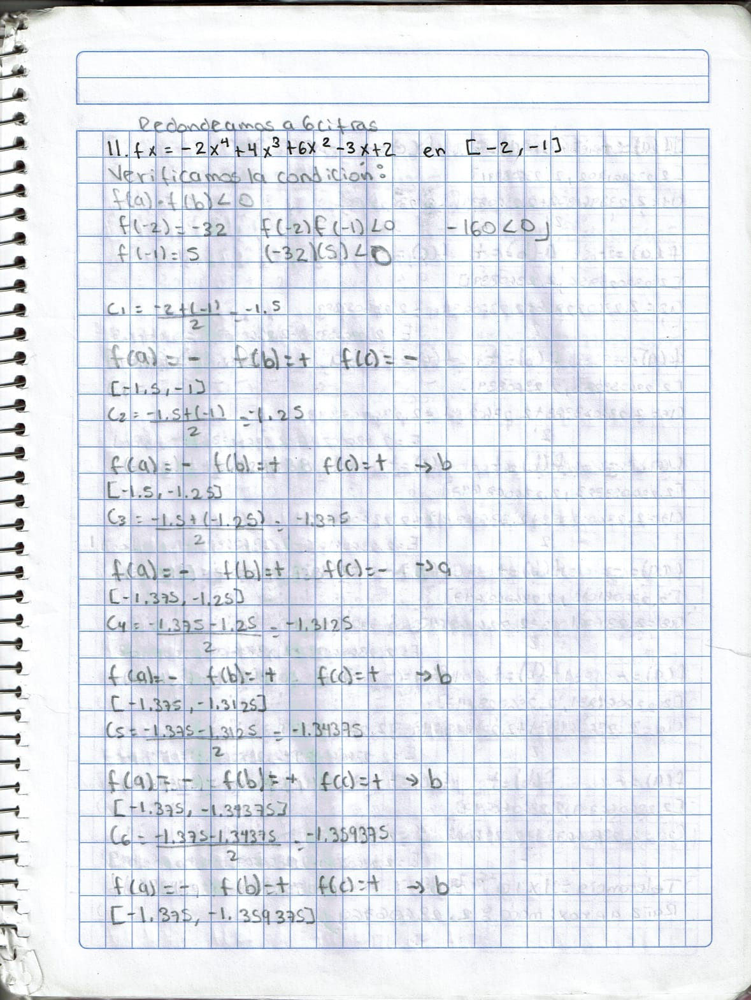{width=600}

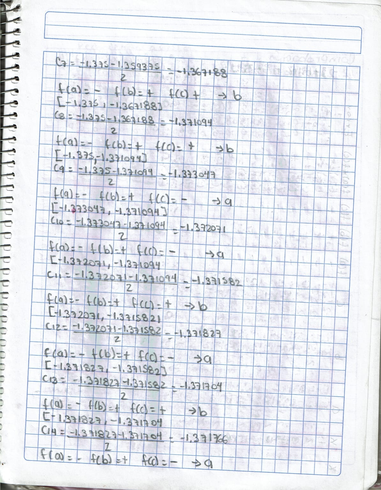{width=600}

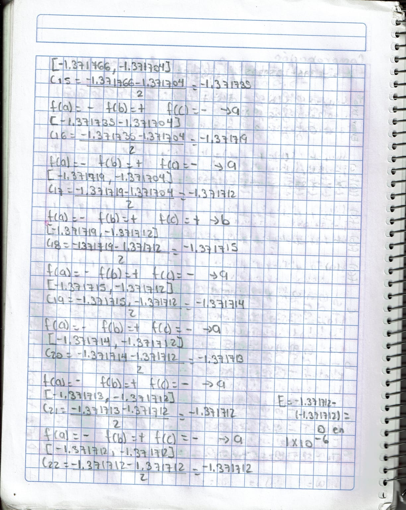{width=600}

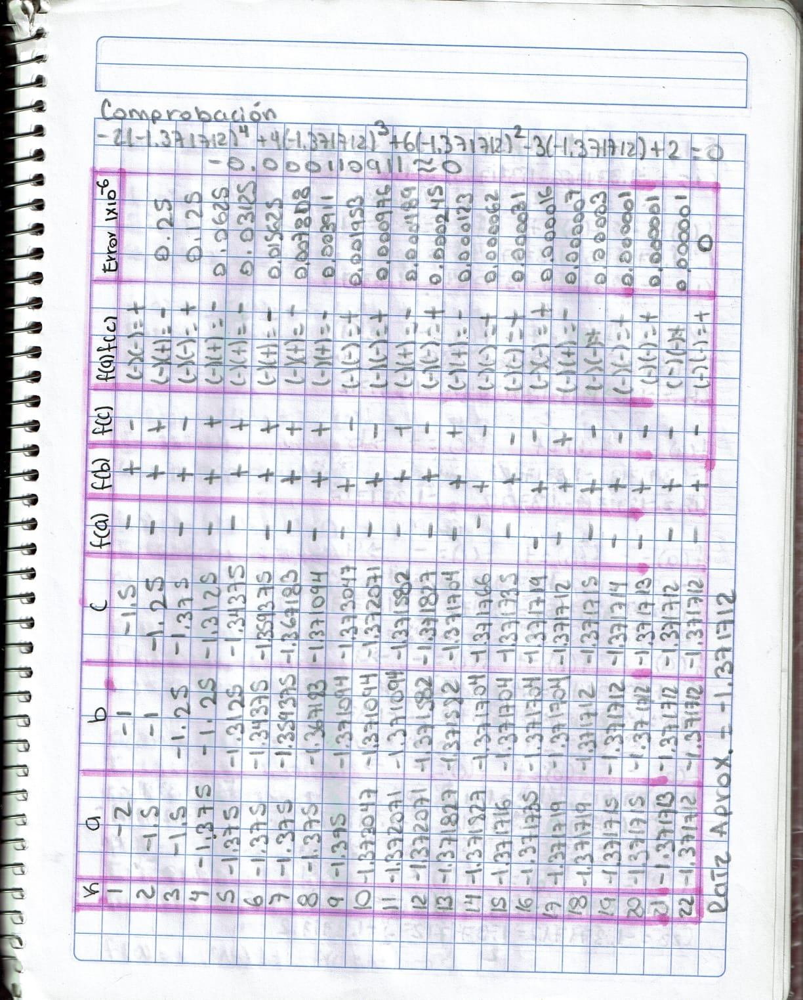{width=600}

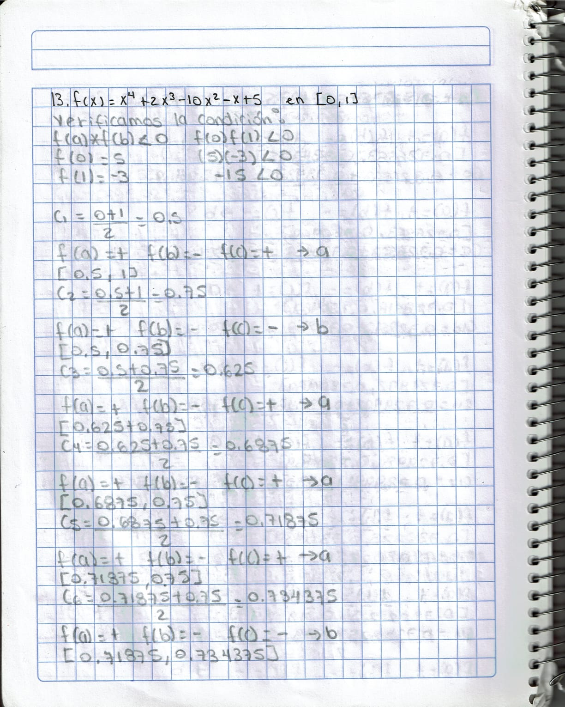{width=600}

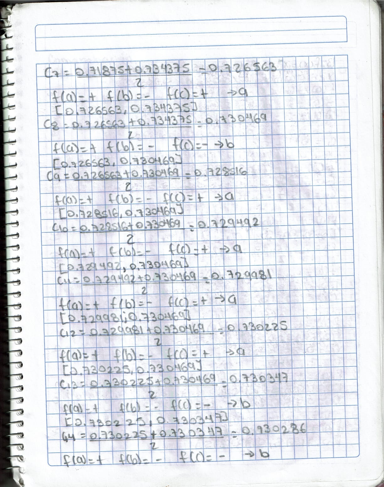{width=600}

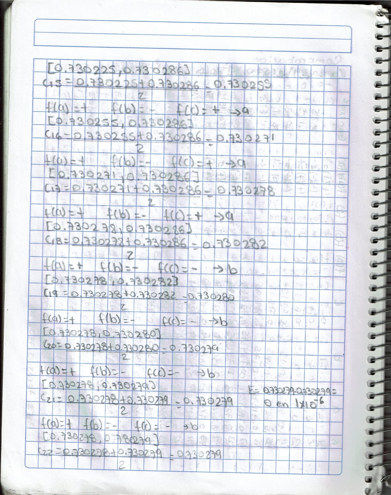{width=600}

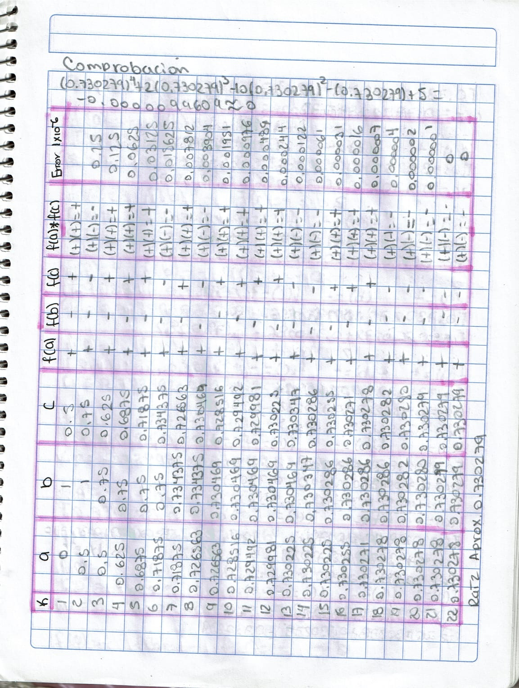{width=600}

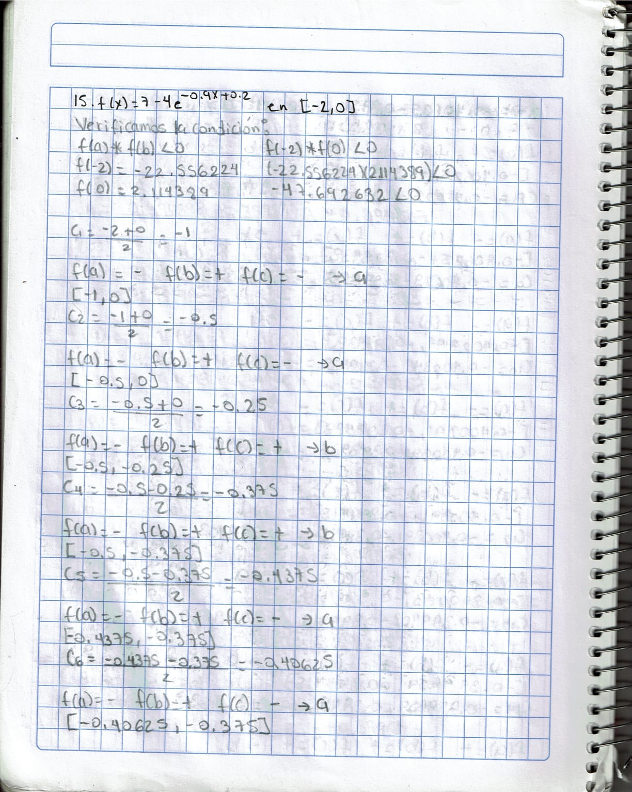{width=600}

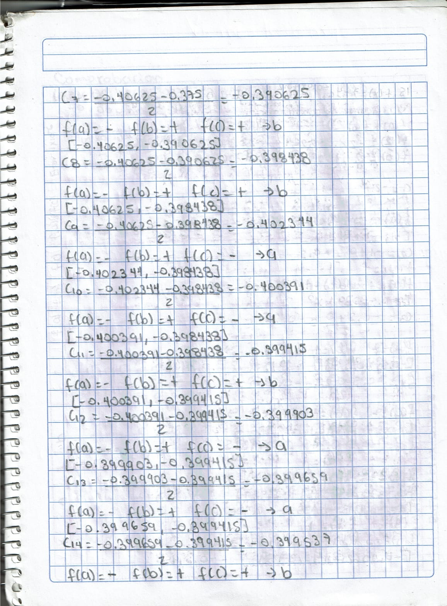{width=600}

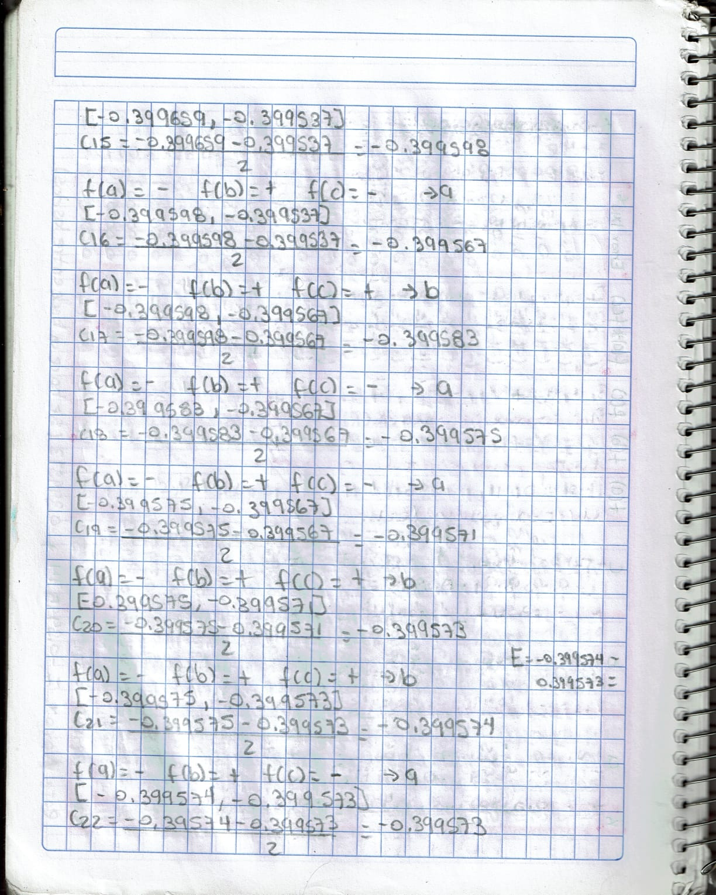{width=600}

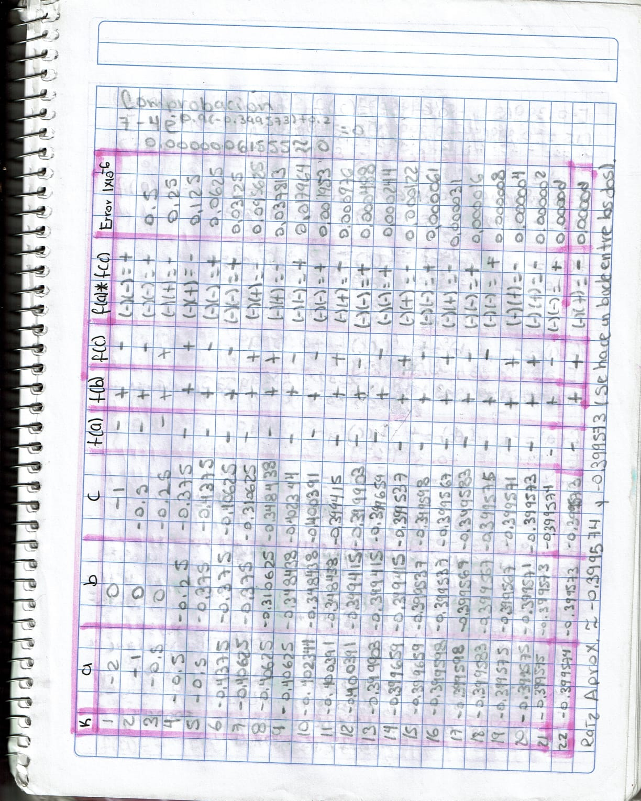{width=600}

#### Código para implementación

```{r}
# Condición para los intervalos

condicion <- function(a, b, f, inicio = 1, fin = 10, paso = 1) {
  fa <- f(a)
  fb <- f(b)
  producto <- fa * fb
  
  # Resultados
  cat("f(a) = f(", a, ") = ", fa, "\n")
  cat("f(b) = f(", b, ") = ", fb, "\n")
  cat("f(a) · f(b) = ", producto, "\n")
  cat(producto, "< 0", "\n\n")
  
  if(producto < 0) {
    cat("SÍ cumple la condición.\n")
    # Asignar globalmente
    a <<- a
    b <<- b
    return(TRUE)
  } else {
    cat("NO cumple la condición.\n") 
    cat("Se buscará un nuevo intervalo.\n\n")
    
    # Buscar automáticamente un intervalo que sí funcione
    x <- seq(inicio, fin, paso)
    for (i in 1:(length(x)-1)) {
      a_nuevo <- x[i]
      b_nuevo <- x[i+1]
      if (f(a_nuevo) * f(b_nuevo) < 0) {
        cat("Nuevo intervalo encontrado: [", a_nuevo, ", ", b_nuevo, "]\n")
        fa <- f(a_nuevo)
        fb <- f(b_nuevo)
        producto <- fa * fb
        cat("f(a) = f(", a_nuevo, ") = ", fa, "\n")
        cat("f(b) = f(", b_nuevo, ") = ", fb, "\n")
        cat("f(a) · f(b) = ", producto, "\n")
        cat(producto, "< 0", "\n\n")
          cat("SÍ cumple la condición.\n")
        # Asignar globalmente
        a <<- a_nuevo
        b <<- b_nuevo
        return(TRUE)
      }
    }
    cat("No se encontró ningún intervalo con cambio de signo\n")
    return(FALSE)
  }
}
```

```{r}
# Método de Bisección que guarda los valores para la tabla

biseccion <- function(f, a, b, tol = 1e-5, iter_max = 100){
  if(f(a)*f(b) > 0){
    cat("Error: no hay cambio de signo en el intervalo [a,b].\n")
    return(NA)
  }
  
  ## Vectores para almacenar los datos de las iteraciones
  
  iter_vec <- numeric(0)
  a_vec <- numeric(0)
  b_vec <- numeric(0)
  c_vec <- numeric(0)
  fa_vec <- numeric(0)
  fb_vec <- numeric(0)
  fc_vec <- numeric(0)
  signFAFC_vec <- numeric(0)
  signFBFC_vec <- numeric(0)
  error_vec <- numeric(0)
  
  iter <- 0
  error <- abs(b - a)
  c <- a
  
  while(error > tol && iter < iter_max){
    iter <- iter + 1
    c <- (a + b)/2
    fc <- f(c)

    if(fc == 0){
      iter_vec <- c(iter_vec, iter)
      a_vec <- c(a_vec, a)
      b_vec <- c(b_vec, b)
      c_vec <- c(c_vec, c)
      fa_vec <- c(fa_vec, f(a))
      fb_vec <- c(fb_vec, f(b))
      fc_vec <- c(fc_vec, fc)
      signFAFC_vec <- c(signFAFC_vec, sign(f(a) * fc))
      signFBFC_vec <- c(signFBFC_vec, sign(f(b) * fc))
      error_vec <- c(error_vec, error)
      break
    }
    
    fa <- f(a)
    fb <- f(b)
    
# Almacena los datos de cada iteración
    iter_vec <- c(iter_vec, iter)
    a_vec <- c(a_vec, a)
    b_vec <- c(b_vec, b)
    c_vec <- c(c_vec, c)
    fa_vec <- c(fa_vec, fa)
    fb_vec <- c(fb_vec, fb)
    fc_vec <- c(fc_vec, fc)
    signFAFC_vec <- c(signFAFC_vec, sign(fa * fc))
    signFBFC_vec <- c(signFBFC_vec, sign(fb * fc))
    error_vec <- c(error_vec, error)
    
    if(fa * fc < 0){
      b <- c
    } else {
      a <- c
    }
    
    error <- abs(b - a)
  }
  
# Crea la tabla de las iteraciones
  TAB <- data.frame(
    k = iter_vec,
    a = a_vec,
    b = b_vec,
    c = c_vec,
    "f(a)" = fa_vec,
    "f(b)" = fb_vec,
    "f(c)" = fc_vec,
    "Signo(f(a)*f(c)" = signFAFC_vec,
    "Signo(f(b)*f(c)" = signFBFC_vec,
    Error = error_vec,
    check.names = FALSE
  )
  
  cat("Raíz aproximada:", c, "\n")
  cat("Iteraciones:", iter, "\n\n")
  
  return(list(raiz = c, iteraciones = iter, tabla = TAB))
}
```

```{r}
# Tabla "bonita"

tabla <- function(resultado) {
  library(DT)
  
  datatable(
    resultado$tabla,
    options = list(
      scrollX = TRUE,
      scrollY = "400px", 
      paging = FALSE,
      dom = 't',
      autoWidth = FALSE,
      columnDefs = list(
        list(className = 'dt-center', targets = 0:5))
    ),
    rownames = FALSE,
    class = 'cell-border stripe',
    width = "100%",
    caption = "Tabla de iteraciones en el método de la secante",
    escape = FALSE
  ) %>%
    formatRound(columns = c(2, 3, 4, 5, 6, 7, 10), digits = 6)
}
```

```{r}
# Gráficas

grafica <- function(a, b, f, resultado) {
  tabla_iteraciones <- resultado$tabla
  total_iteraciones <- nrow(tabla_iteraciones)
  filas <- ceiling(total_iteraciones / 4)
  
  par(mfrow = c(filas, 4), mar = c(2, 2, 1.5, 1))
  
  x_vals <- seq(a - 0.5, b + 0.5, length.out = 1000)
  y_vals <- f(x_vals)
  
  for (i in 1:total_iteraciones) {
    plot(x_vals, y_vals, type = "l", main = paste("Iteración", i),
         xlab = "x", ylab = "f(x)", col = "blue", lwd = 1.2)
    abline(h = 0, col = "gray", lty = 2)

    a_actual <- tabla_iteraciones$a[i]
    b_actual <- tabla_iteraciones$b[i]
    c_actual <- tabla_iteraciones$c[i]
    
    points(c(a_actual, b_actual), c(f(a_actual), f(b_actual)), 
           col = c("red", "green"), pch = 19, cex = 0.8)
    points(c_actual, f(c_actual), col = "orange", pch = 19, cex = 0.6)
    
    abline(v = a_actual, col = "red", lty = 2)
    abline(v = b_actual, col = "green", lty = 2)
    abline(v = c_actual, col = "orange", lty = 3)
    
    legend("topright", legend = paste("Iter", i), bty = "n")
  }
  
  par(mfrow = c(1, 1))
}
```

#### Sistema $1$

$f(x) = x^2 − 5$ en $[2, 3]$

```{r}
# Datos

a <- 2
b <- 3
f <- function(x) x^2 - 5
```

##### Intervalo
Para cada función $f(x)$, encuentre un intervalo $[a, b]$ tal que $f(a) · f(b) < 0$.

Nota: En la información dada ya nos da un intervalo, por lo que solo se revisa si cumple con la condición:

```{r}
condicion(a, b, f)
```

##### Iteraciones
Realice al menos 8 iteraciones del método de bisección.

```{r}
resultado <- biseccion(f, a, b)
```

##### Tabla
Registre los valores $ak$, $bk$, $ck$, $f(ak)$, $f(bk)$, $f(ck)$, $signo(f(ak)f(ck))$ y el error $|bk − ak|$.

```{r}
tabla(resultado)
```

##### Gráficas

Grafique la función y los intervalos de reducción en cada paso.

```{r}
grafica(a, b, f, resultado)
```

#### Sistema $3$

$f(x) = x^4 − 8x + 2$ en $[0, 3]$

```{r}
# Datos

a <- 0
b <- 3
f <- function(x) x^4 - 8*x + 2
```

##### Intervalo
Para cada función $f(x)$, encuentre un intervalo $[a, b]$ tal que $f(a) · f(b) < 0$.

Nota: En la información dada ya nos da un intervalo, por lo que solo se revisa si cumple con la condición:

```{r}
condicion(a, b, f)
```

##### Iteraciones
Realice al menos 8 iteraciones del método de bisección.

```{r}
resultado <- biseccion(f, a, b)
```

##### Tabla
Registre los valores $ak$, $bk$, $ck$, $f(ak)$, $f(bk)$, $f(ck)$, $signo(f(ak)f(ck))$ y el error $|bk − ak|$.

```{r}
tabla(resultado)
```

##### Gráficas

Grafique la función y los intervalos de reducción en cada paso.

```{r}
grafica(a, b, f, resultado)
```

#### Sistema $5$

$f(x) = cos(x) - x^2$ en $[0, 1]$

```{r}
# Datos

a <- 0
b <- 1
f <- function(x) cos(x) - x^2
```

##### Intervalo
Para cada función $f(x)$, encuentre un intervalo $[a, b]$ tal que $f(a) · f(b) < 0$.

Nota: En la información dada ya nos da un intervalo, por lo que solo se revisa si cumple con la condición:

```{r}
condicion(a, b, f)
```

##### Iteraciones
Realice al menos 8 iteraciones del método de bisección.

```{r}
resultado <- biseccion(f, a, b)
```

##### Tabla
Registre los valores $ak$, $bk$, $ck$, $f(ak)$, $f(bk)$, $f(ck)$, $signo(f(ak)f(ck))$ y el error $|bk − ak|$.

```{r}
tabla(resultado)
```

##### Gráficas

Grafique la función y los intervalos de reducción en cada paso.

```{r}
grafica(a, b, f, resultado)
```

#### Sistema $7$

$f(x) = −4x^2 + 5x + 6$ en $[−1, 0].$

```{r}
# Datos

a <- -1
b <- 0
f <- function(x) -4*x^2 + 5*x + 6
```

##### Intervalo
Para cada función $f(x)$, encuentre un intervalo $[a, b]$ tal que $f(a) · f(b) < 0$.

Nota: En la información dada ya nos da un intervalo, por lo que solo se revisa si cumple con la condición:

```{r}
condicion(a, b, f)
```

##### Iteraciones
Realice al menos 8 iteraciones del método de bisección.

```{r}
resultado <- biseccion(f, a, b)
```

##### Tabla
Registre los valores $ak$, $bk$, $ck$, $f(ak)$, $f(bk)$, $f(ck)$, $signo(f(ak)f(ck))$ y el error $|bk − ak|$.

```{r}
tabla(resultado)
```

##### Gráficas

Grafique la función y los intervalos de reducción en cada paso.

```{r}
grafica(a, b, f, resultado)
```

En este caso, se encontró la raíz exacta en la iteración $2$ por lo que graficamente no se puede visualizar pues como tal, no hubo una aproximación.

#### Sistema $9$

$f(x) = x^3 − 5x + 1$ en $[0, 1].$

```{r}
# Datos

a <- 0
b <- 1
f <- function(x) x^3 - 5*x + 1
```

##### Intervalo
Para cada función $f(x)$, encuentre un intervalo $[a, b]$ tal que $f(a) · f(b) < 0$.

Nota: En la información dada ya nos da un intervalo, por lo que solo se revisa si cumple con la condición:

```{r}
condicion(a, b, f)
```

##### Iteraciones
Realice al menos 8 iteraciones del método de bisección.

```{r}
resultado <- biseccion(f, a, b)
```

##### Tabla
Registre los valores $ak$, $bk$, $ck$, $f(ak)$, $f(bk)$, $f(ck)$, $signo(f(ak)f(ck))$ y el error $|bk − ak|$.

```{r}
tabla(resultado)
```

##### Gráficas

Grafique la función y los intervalos de reducción en cada paso.

```{r}
grafica(a, b, f, resultado)
```


### Método de la Secante

#### Ejercicios a mano

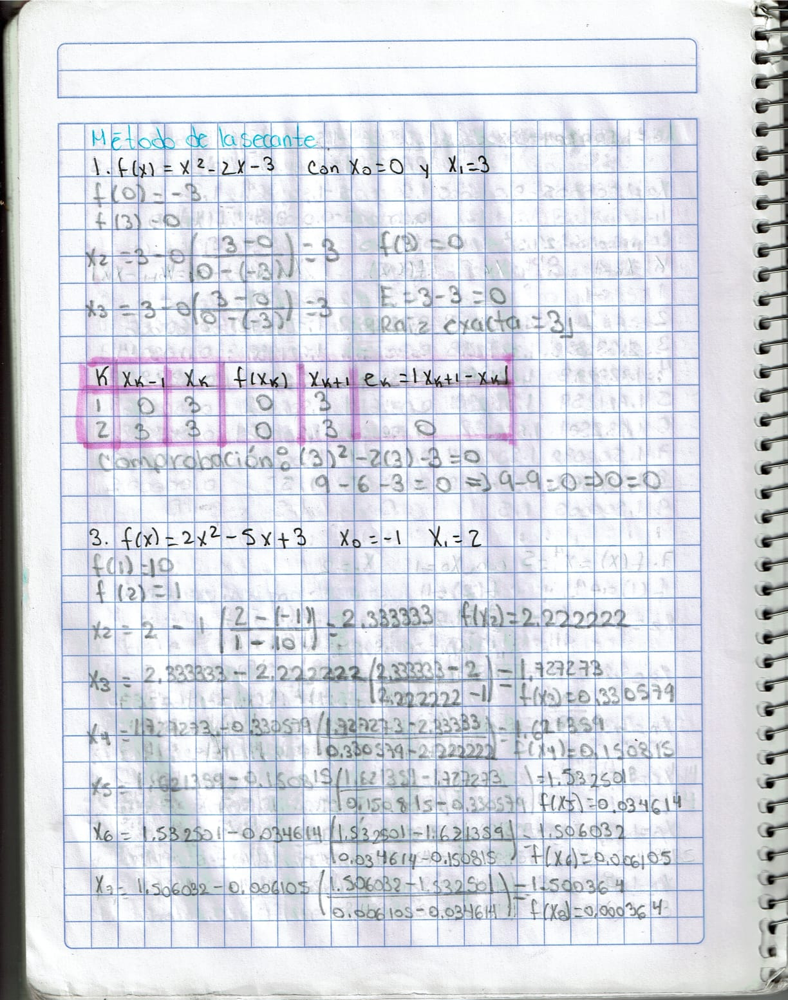{width=600}

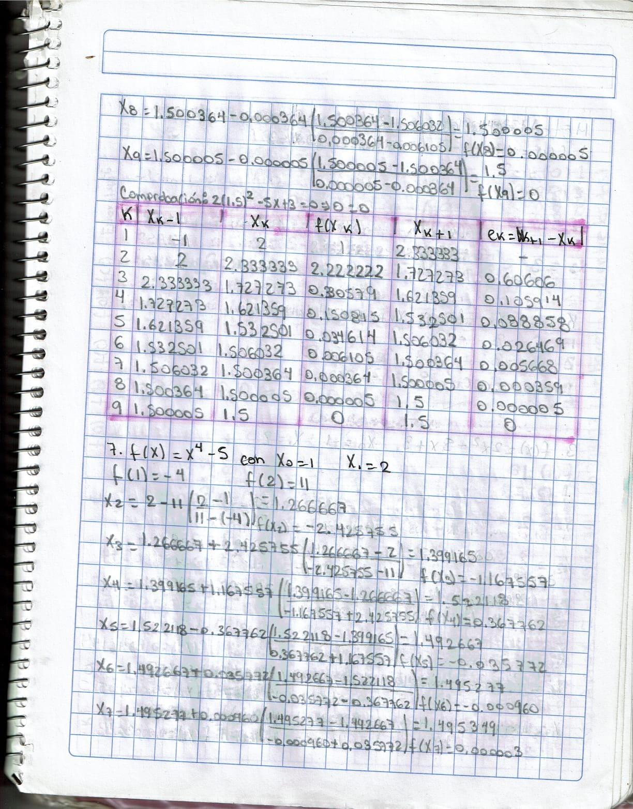{width=600}

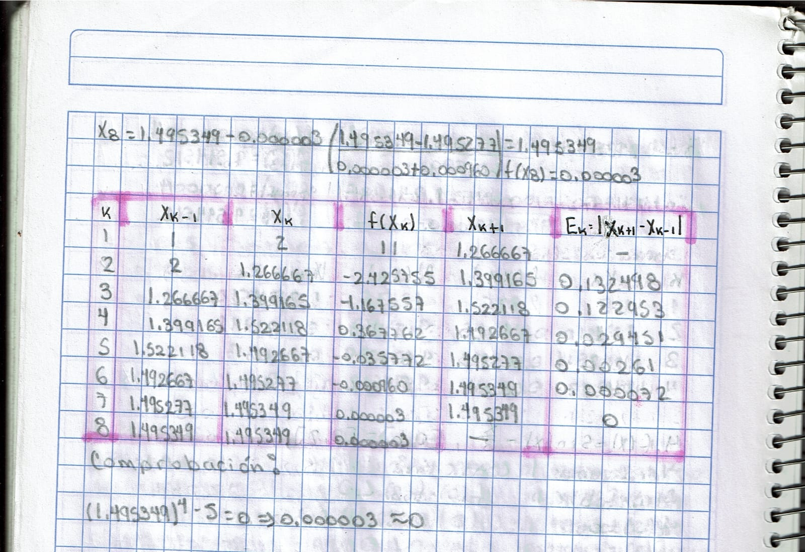{width=600}

#### Código para implementación

```{r}
# Método de la secante que guarda los valores para la tabla

secante <- function(f, x0, x1, tol = 1e-5, iter_max = 100){
  
# Vectores para almacenar los datos de las iteraciones
  
  iter_vec <- numeric(0)
  x0_vec <- numeric(0)
  x1_vec <- numeric(0)
  x2_vec <- numeric(0)
  fx0_vec <- numeric(0)
  fx1_vec <- numeric(0)
  fx2_vec <- numeric(0)
  error_vec <- numeric(0)
  
  iter <- 0
  error <- 1
  
  while(error > tol && iter < iter_max){
    fx0 <- f(x0)
    fx1 <- f(x1)
    
# Evitar división por cero
    
    if(abs(fx1 - fx0) < 1e-12){
      cat("Error: División por cero (f(x1) - f(x0) approx 0)\n")
      return(NA)
    }
    
    x2 <- x1 - fx1 * (x1 - x0) / (fx1 - fx0)
    error <- abs(x2 - x1)
    
# Almacena los datos de cada iteración
    
    iter <- iter + 1
    iter_vec <- c(iter_vec, iter)
    x0_vec <- c(x0_vec, x0)
    x1_vec <- c(x1_vec, x1)
    x2_vec <- c(x2_vec, x2)
    fx0_vec <- c(fx0_vec, fx0)
    fx1_vec <- c(fx1_vec, fx1)
    fx2_vec <- c(fx2_vec, f(x2))
    error_vec <- c(error_vec, error)
    
# Actualizar valores para siguiente iteración
    
    x0 <- x1
    x1 <- x2
  }
  
# Crea la tabla de las iteraciones
  
 TAB <- data.frame(
  "k" = iter_vec,
  "xₖ₋₁" = x0_vec,
  "xₖ" = x1_vec,
  "f(xₖ)" = fx1_vec,
  "xₖ₊₁" = x2_vec,
  "eₖ = |xₖ₊₁ - xₖ|" = error_vec,
  check.names = FALSE
)
  
  cat("Raíz aproximada:", x2, "\n")
  cat("Iteraciones:", iter, "\n\n")
  
  return(list(raiz = x2, iteraciones = iter, tabla = TAB))
}
```

```{r}
# Tabla "bonita"

tabla <- function(resultado) {
  library(DT)
  
  datatable(
    resultado$tabla,
    options = list(
      scrollX = TRUE,
      scrollY = "400px", 
      paging = FALSE,
      dom = 't',
      autoWidth = FALSE,
      columnDefs = list(
        list(className = 'dt-center', targets = 0:5))
    ),
    rownames = FALSE,
    class = 'cell-border stripe',
    width = "100%",
    caption = "Tabla de iteraciones en el método de la secante",
    escape = FALSE
  ) %>%
    formatRound(columns = c(2, 3, 4, 5, 6), digits = 6)
}
```

```{r}
# Iteraciones en el método de bisección

n_biseccion <- function(x0, x1) {
  n <- ceiling(log(abs(x0 - x1) / 1e-5) / log(2))
  return(n)
}

```

```{r}
# Gráficas

grafica <- function(x0, x1, f, resultado) {
  tabla_iteraciones <- resultado$tabla
  total_iteraciones <- nrow(tabla_iteraciones)
  filas <- ceiling(total_iteraciones / 4)
  
  par(mfrow = c(filas, 4), mar = c(2, 2, 1.5, 1))
  
# Calcular rango dinámico
  
  x_min <- min(tabla_iteraciones[,2]) - 0.5
  x_max <- max(tabla_iteraciones[,3]) + 0.5
  x_vals <- seq(x_min, x_max, length.out = 1000)
  y_vals <- f(x_vals)
  
  for (i in 1:total_iteraciones) {
    plot(x_vals, y_vals, type = "l", main = paste("Iteración", i),
         xlab = "x", ylab = "f(x)", col = "blue", lwd = 1.2)
    abline(h = 0, col = "gray", lty = 2)

    x_anterior <- tabla_iteraciones[i, 2]  # x_{k-1}
    x_actual <- tabla_iteraciones[i, 3]    # x_k  
    x_siguiente <- tabla_iteraciones[i, 4] # x_{k+1} 
    
# Calcula la pendiente para la gráfica
    
    f_anterior <- f(x_anterior)
    f_actual <- f(x_actual)
    pendiente <- (f_actual - f_anterior) / (x_actual - x_anterior)
    
# Grafica la línea secante
    
    x_secante <- seq(x_min, x_max, length.out = 100)
    y_secante <- f_anterior + pendiente * (x_secante - x_anterior)
    lines(x_secante, y_secante, col = "purple", lty = 2, lwd = 1.5)
    
# Puntos de la iteración
    
    points(c(x_anterior, x_actual), c(f_anterior, f_actual), 
           col = c("red", "green"), pch = 19, cex = 0.8)
    
# Punto de intersección con eje x (x_{k+1})
    
    points(x_siguiente, 0, col = "orange", pch = 17, cex = 1.2)
    
# Líneas verticales para los puntos importantes
    
    abline(v = x_anterior, col = "red", lty = 3, lwd = 0.8)
    abline(v = x_actual, col = "green", lty = 3, lwd = 0.8)
    abline(v = x_siguiente, col = "orange", lty = 3, lwd = 1.2)
    
# Leyenda explicativa
    
    legend("topright", 
           legend = c("f(x)", "Secante", "x_{k-1}", "x_k", "x_{k+1}"),
           col = c("blue", "purple", "red", "green", "orange"),
           lty = c(1, 2, NA, NA, NA), pch = c(NA, NA, 19, 19, 17),
           cex = 0.7, bty = "n")
  }
  
  par(mfrow = c(1, 1))
}
```

#### Sistema $2$

$f(x) = x^4 − 10x^2 + 9$

$x_0 = 0$

$x_1 = 2$

```{r}
# Datos

x0 <- 0
x1 <- 2
f <- function(x) x^4 - 10*x^2 + 9
```

##### Puntos iniciales

Para cada función $f(x)$, elija dos puntos iniciales $x_0$, $x_1$ cercanos a la raíz.

Nota: En la información dada ya nos da los puntos iniciales:

$x_0 = 0$

$x_1 = 2$

##### Iteraciones

Aplique iterativamente: $x_{k+1} = x_k − f(x_k) \frac{x_k − x_{k−1}}{f(x_k) − f(x_{k−1})}$

```{r}
resultado <- secante(f, x0, x1)
```

##### Comparación

Compare el número de iteraciones con el método de bisección.

```{r}
tabla(resultado)

t_biseccion <- n_biseccion(x0, x1)
cat("En el método de bisección:", t_biseccion, "iteraciones\n")
cat("En el método de la secante:", resultado$iteraciones, "iteraciones\n")
cat("Ventaja:", t_biseccion - resultado$iteraciones, "iteraciones menos\n")
```

##### Gráficas

Grafique la función y los intervalos de reducción en cada paso.

```{r}
grafica(x0, x1, f, resultado)
```

#### Sistema $4$

$f(x) = -3x^2 + 4x + 2$

$x_0 = -1$

$x_1 = 3$

```{r}
# Datos

x0 <- -1
x1 <- 3
f <- function(x) -3*x^2 + 4*x + 2
```

##### Puntos iniciales

Para cada función $f(x)$, elija dos puntos iniciales $x_0$, $x_1$ cercanos a la raíz.

Nota: En la información dada ya nos da los puntos iniciales:

$x_0 = -1$

$x_1 = 3$

##### Iteraciones

Aplique iterativamente: $x_{k+1} = x_k − f(x_k) \frac{x_k − x_{k−1}}{f(x_k) − f(x_{k−1})}$

```{r}
resultado <- secante(f, x0, x1)
```

##### Comparación

Compare el número de iteraciones con el método de bisección.

```{r}
tabla(resultado)

t_biseccion <- n_biseccion(x0, x1)
cat("En el método de bisección:", t_biseccion, "iteraciones\n")
cat("En el método de la secante:", resultado$iteraciones, "iteraciones\n")
cat("Ventaja:", t_biseccion - resultado$iteraciones, "iteraciones menos\n")
```

##### Gráficas

Grafique la función y los intervalos de reducción en cada paso.

```{r}
grafica(x0, x1, f, resultado)
```

#### Sistema $6$

$f(x) = x^4 - 5x^3 + 6x^2 + 4x - 8$

$x_0 = 0$

$x_1 = 3$

```{r}
# Datos

x0 <- 0
x1 <- 3
f <- function(x) x^4 - 5*x^3 + 6*x^2 + 4*x - 8
```

##### Puntos iniciales

Para cada función $f(x)$, elija dos puntos iniciales $x_0$, $x_1$ cercanos a la raíz.

Nota: En la información dada ya nos da los puntos iniciales:

$x_0 = 0$

$x_1 = 3$

##### Iteraciones

Aplique iterativamente: $x_{k+1} = x_k − f(x_k) \frac{x_k − x_{k−1}}{f(x_k) − f(x_{k−1})}$

```{r}
resultado <- secante(f, x0, x1)
```

##### Comparación

Compare el número de iteraciones con el método de bisección.

```{r}
tabla(resultado)

t_biseccion <- n_biseccion(x0, x1)
cat("En el método de bisección:", t_biseccion, "iteraciones\n")
cat("En el método de la secante:", resultado$iteraciones, "iteraciones\n")
cat("Ventaja:", t_biseccion - resultado$iteraciones, "iteraciones menos\n")
```

##### Gráficas

Grafique la función y los intervalos de reducción en cada paso.

```{r}
grafica(x0, x1, f, resultado)
```

#### Sistema $8$

$f(x) = -2x^4 + 3x^3 + 7x^2 - 5x + 1$

$x_0 = -1$

$x_1 = -2$

```{r}
# Datos

x0 <- -1
x1 <- -2
f <- function(x) -2*x^4 + 3*x^3 + 7*x^2 - 5*x + 1
```

##### Puntos iniciales

Para cada función $f(x)$, elija dos puntos iniciales $x_0$, $x_1$ cercanos a la raíz.

Nota: En la información dada ya nos da los puntos iniciales:

$x_0 = -1$

$x_1 = -2$

##### Iteraciones

Aplique iterativamente: $x_{k+1} = x_k − f(x_k) \frac{x_k − x_{k−1}}{f(x_k) − f(x_{k−1})}$

```{r}
resultado <- secante(f, x0, x1)
```

##### Comparación

Compare el número de iteraciones con el método de bisección.

```{r}
tabla(resultado)

t_biseccion <- n_biseccion(x0, x1)
cat("En el método de bisección:", t_biseccion, "iteraciones\n")
cat("En el método de la secante:", resultado$iteraciones, "iteraciones\n")
cat("Ventaja:", t_biseccion - resultado$iteraciones, "iteraciones menos\n")
```
En este caso, este método no es muy conveniente.

##### Gráficas

Grafique la función y los intervalos de reducción en cada paso.

```{r}
grafica(x0, x1, f, resultado)
```

#### Sistema $12$

$f(x) = (3x + 3.1) cos(2x + \frac{π}{6})$

$x_0 = 0.3$

$x_1 = 0.8$

```{r}
# Datos

x0 <- 0.3
x1 <- 0.8
f <- function(x) (3*x + 3.1) * cos(2*x + (pi/6))
```

##### Puntos iniciales

Para cada función $f(x)$, elija dos puntos iniciales $x_0$, $x_1$ cercanos a la raíz.

Nota: En la información dada ya nos da los puntos iniciales:

$x_0 = 0.3$

$x_1 = 0.8$

##### Iteraciones

Aplique iterativamente: $x_{k+1} = x_k − f(x_k) \frac{x_k − x_{k−1}}{f(x_k) − f(x_{k−1})}$

```{r}
resultado <- secante(f, x0, x1)
```

##### Comparación

Compare el número de iteraciones con el método de bisección.

```{r}
tabla(resultado)

t_biseccion <- n_biseccion(x0, x1)
cat("En el método de bisección:", t_biseccion, "iteraciones\n")
cat("En el método de la secante:", resultado$iteraciones, "iteraciones\n")
cat("Ventaja:", t_biseccion - resultado$iteraciones, "iteraciones menos\n")
```

##### Gráficas

Grafique la función y los intervalos de reducción en cada paso.

```{r}
grafica(x0, x1, f, resultado)
```


### Método de Newton-Raphson

#### Ejercicios a mano

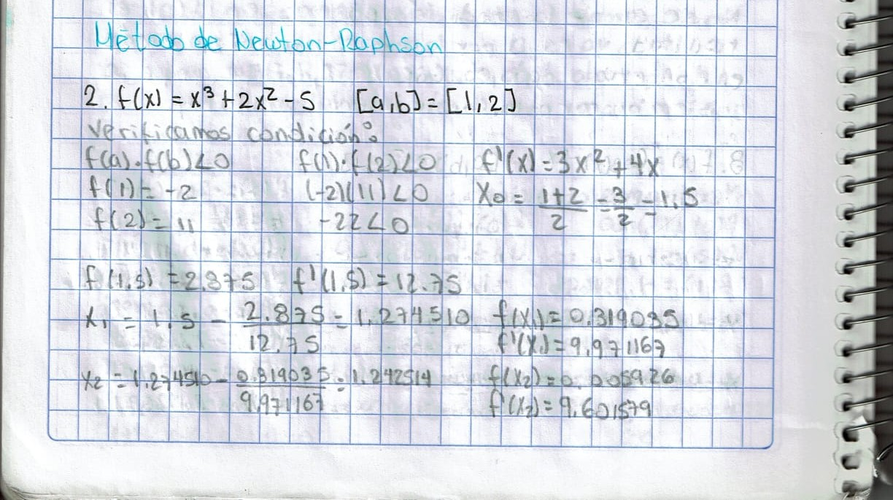{width=600}

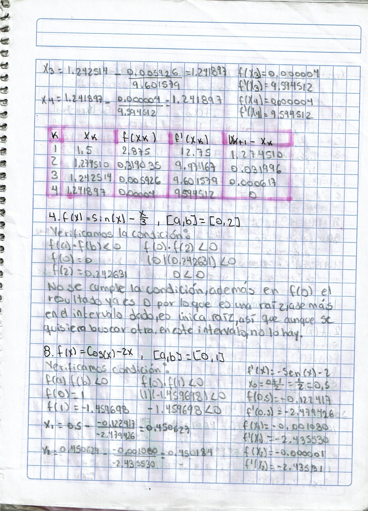{width=600}

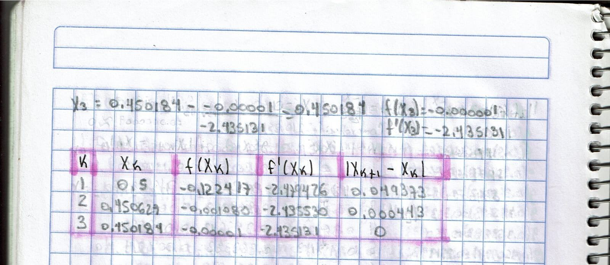{width=600}

#### Código para implementación

```{r}
# Condición para los intervalos

condicion <- function(a, b, f, inicio = 0, fin = 10, paso = 1) {
  fa <- f(a)
  fb <- f(b)
  producto <- fa * fb
  
  # Resultados
  cat("f(a) = f(", a, ") = ", fa, "\n")
  cat("f(b) = f(", b, ") = ", fb, "\n")
  cat("f(a) · f(b) = ", producto, "\n")
  cat(producto, "< 0", "\n\n")
  
  if(producto < 0) {
    cat("SÍ cumple la condición.\n")
    # Asignar globalmente
    a <<- a
    b <<- b
    return(TRUE)
  } else {
    cat("NO cumple la condición.\n") 
    cat("Se buscará un nuevo intervalo.\n\n")
    
    # Buscar automáticamente un intervalo que sí funcione
    x <- seq(inicio, fin, paso)
    for (i in 1:(length(x)-1)) {
      a_nuevo <- x[i]
      b_nuevo <- x[i+1]
      if (f(a_nuevo) * f(b_nuevo) < 0) {
        cat("Nuevo intervalo encontrado: [", a_nuevo, ", ", b_nuevo, "]\n")
        fa <- f(a_nuevo)
        fb <- f(b_nuevo)
        producto <- fa * fb
        cat("f(a) = f(", a_nuevo, ") = ", fa, "\n")
        cat("f(b) = f(", b_nuevo, ") = ", fb, "\n")
        cat("f(a) · f(b) = ", producto, "\n")
        cat(producto, "< 0", "\n\n")
          cat("SÍ cumple la condición.\n")
        # Asignar globalmente
        a <<- a_nuevo
        b <<- b_nuevo
        return(TRUE)
      }
    }
    cat("No se encontró ningún intervalo con cambio de signo\n")
    return(FALSE)
  }
}

```

```{r}
# Método de Newton que guarda los valores para la tabla

newton <- function(f, df, x0, tol = 1e-5, iter_max = 100){
  
# Vectores para almacenar los datos de las iteraciones
  
  iter_vec <- numeric(0)
  x0_vec <- numeric(0)
  x1_vec <- numeric(0)
  fx0_vec <- numeric(0)
  dfx0_vec <- numeric(0)
  error_vec <- numeric(0)
  
  iter <- 0
  error <- 1
  
  while(error > tol && iter < iter_max){
    
    fx0 <- f(x0)
    dfx0 <- df(x0)
    
# Evitar división por cero
    
    if(abs(dfx0) < 1e-12){
      cat("Error: Derivada cercana a cero\n")
      return(NA)
    }
    
# Aplicar fórmula de Newton
    
    x1 <- x0 - fx0 / dfx0
    error <- abs(x1 - x0)
    
# Almacena los datos de cada iteración
    
    iter <- iter + 1
    iter_vec <- c(iter_vec, iter)
    x0_vec <- c(x0_vec, x0)
    fx0_vec <- c(fx0_vec, fx0)
    dfx0_vec <- c(dfx0_vec, dfx0)
    error_vec <- c(error_vec, error)
    
# Actualizar para siguiente iteración
    
    x0 <- x1
  }
  
# Crea la tabla de las iteraciones
  
 TAB <- data.frame(
    "k" = iter_vec,
    "xₖ" =x0_vec,
    "f(xₖ)" = fx0_vec,
    "f´(xₖ)" = dfx0_vec,
    "eₖ = |xₖ₊₁ - xₖ|" = error_vec,
    check.names = FALSE
  )
  
  cat("Raíz aproximada:", x1, "\n")
  cat("Iteraciones:", iter, "\n\n")
  
  return(list(raiz = x1, iteraciones = iter, tabla = TAB))
}
```

```{r}
# Tabla "bonita"

tabla <- function(resultado) {
  library(DT)
  
  datatable(
    resultado$tabla,
    options = list(
      scrollX = TRUE,
      scrollY = "400px", 
      paging = FALSE,
      dom = 't',
      autoWidth = FALSE,
      columnDefs = list(
        list(className = 'dt-center', targets = 0:4))
    ),
    rownames = FALSE,
    class = 'cell-border stripe',
    width = "100%",
    caption = "Tabla de iteraciones en el método de la Newton-Raphson",
    escape = FALSE
  ) %>%
     formatRound(columns = c(2:5), digits = 9)
}
```

```{r}
# Gráficas

grafica <- function(x0, f, df, resultado) {
  tabla_iteraciones <- resultado$tabla
  total_iteraciones <- nrow(tabla_iteraciones)
  filas <- ceiling(total_iteraciones / 4)
  
  par(mfrow = c(filas, 4), mar = c(2, 2, 1.5, 1))
  
# Calcular rango dinámico
  
  x_min <- min(tabla_iteraciones[,2]) - 0.5
  x_max <- max(tabla_iteraciones[,2]) + 0.5
  x_vals <- seq(x_min, x_max, length.out = 1000)
  y_vals <- f(x_vals)
  
  for (i in 1:total_iteraciones) {
    plot(x_vals, y_vals, type = "l", main = paste("Iteración", i),
         xlab = "x", ylab = "f(x)", col = "blue", lwd = 1.2)
    abline(h = 0, col = "gray", lty = 2)

    x_actual <- tabla_iteraciones[i, 2]    # x_k
    f_actual <- tabla_iteraciones[i, 3]    # f(x_k)
    df_actual <- tabla_iteraciones[i, 4]   # f'(x_k)
    
# Calcular recta tangente
    
    pendiente <- df_actual
    intercepto <- f_actual - pendiente * x_actual
    y_tangente <- pendiente * x_vals + intercepto
    
# Graficar recta tangente
    
    lines(x_vals, y_tangente, col = "purple", lty = 2, lwd = 1.5)
    
# Puntos de la iteración
    
    points(x_actual, f_actual, col = "red", pch = 19, cex = 0.8)
    
# Línea vertical
    
    abline(v = x_actual, col = "red", lty = 3, lwd = 0.8)
    
# Leyenda
    
    legend("topright", 
           legend = c("f(x)", "Tangente", "x_k"),
           col = c("blue", "purple", "red"),
           lty = c(1, 2, NA), pch = c(NA, NA, 19),
           cex = 0.7, bty = "n")
  }
  
  par(mfrow = c(1, 1))
}
```

#### Sistema $1$

$f(x) = x^3 - 7x + 6$ en $[a, b] = [0, 1]$

```{r}
# Datos

a <- 0
b <- 1
x0 <- (a + b) / 2
f <- function(x) x^3 - 7*x + 6
df <- function(x) 3*x^2 - 7
```

##### Intervalo

Verifica que exista un intervalo $[a, b]$ donde $f(a) · f(b) < 0$.

Nota: En la información dada ya nos da un intervalo, por lo que solo se revisa si cumple con la condición:

```{r}
condicion(a, b, f)
```

En este caso la raíz está justo en el extremo del intervalo en $x=1$ por lo cual, la condición da exactamente $0$.  

##### Iteraciones

Realice al menos 8 iteraciones del método.

```{r}
resultado <- newton(f, df, x0)
```

##### Tabla
Registre los valores $x_k$, $f(x_k)$, $f´(x_k)$, y el error $|bk − ak|$.

```{r}
tabla(resultado)
```

##### Gráficas

Grafica la función y marca el punto donde converge la raíz.

```{r}
grafica(x0, f, df, resultado)
```

#### Sistema $3$

$f(x) = x^4 - 3x^3 + 2$ en $[a, b] = [0, 1]$

```{r}
# Datos

a <- 0
b <- 1
x0 <- (a + b) / 2
f <- function(x) x^4 - 3*x^3 + 2
df <- function(x) 4*x^3 - 9*x^2
```

##### Intervalo

Verifica que exista un intervalo $[a, b]$ donde $f(a) · f(b) < 0$.

Nota: En la información dada ya nos da un intervalo, por lo que solo se revisa si cumple con la condición:

```{r}
condicion(a, b, f)
```

En este caso la raíz está justo en el extremo del intervalo en $x=1$ por lo cual, la condición da exactamente $0$. Y al buscar el nuevo intervalo, nos da aquel en donde se encuentra otra de las raíces.

##### Iteraciones

Realice al menos 8 iteraciones del método.

```{r}
resultado <- newton(f, df, x0)
```

##### Tabla
Registre los valores $x_k$, $f(x_k)$, $f´(x_k)$, y el error $|bk − ak|$.

```{r}
tabla(resultado)
```

##### Gráficas

Grafica la función y marca el punto donde converge la raíz.

```{r}
grafica(x0, f, df, resultado)
```

#### Sistema $5$

$f(x) = e^{-x} - x$ en $[a, b] = [0, 1]$

```{r}
# Datos

a <- 0
b <- 1
x0 <- (a + b) / 2
f <- function(x) exp(-x) - x
df <- function(x) -exp(-x) - 1 
```

##### Intervalo

Verifica que exista un intervalo $[a, b]$ donde $f(a) · f(b) < 0$.

```{r}
condicion(a, b, f)
```

##### Iteraciones

Realice al menos 8 iteraciones del método.

```{r}
resultado <- newton(f, df, x0)
```

##### Tabla
Registre los valores $x_k$, $f(x_k)$, $f´(x_k)$, y el error $|bk − ak|$.

```{r}
tabla(resultado)
```

##### Gráficas

Grafica la función y marca el punto donde converge la raíz.

```{r}
grafica(x0, f, df, resultado)
```

#### Sistema $7$

$f(x) = x^5 − 3x + 1$ en $[a, b] = [0, 1]$

```{r}
# Datos

a <- 0
b <- 1
x0 <- (a + b) / 2
f <- function(x) x^5 - 3*x + 1
df <- function(x) 5*x^4 - 3 
```

##### Intervalo

Verifica que exista un intervalo $[a, b]$ donde $f(a) · f(b) < 0$.

```{r}
condicion(a, b, f)
```

##### Iteraciones

Realice al menos 8 iteraciones del método.

```{r}
resultado <- newton(f, df, x0)
```

##### Tabla
Registre los valores $x_k$, $f(x_k)$, $f´(x_k)$, y el error $|bk − ak|$.

```{r}
tabla(resultado)
```

##### Gráficas

Grafica la función y marca el punto donde converge la raíz.

```{r}
grafica(x0, f, df, resultado)
```

#### Sistema $9$

$f(x) = ln(x + 2) + x - 1$ en $[a, b] = [-1, 0]$

```{r}
# Datos

a <- -1
b <- 0
x0 <- (a + b) / 2
f <- function(x) log(x + 2) + x - 1
df <- function(x) 1/(x + 2) + 1
```

##### Intervalo

Verifica que exista un intervalo $[a, b]$ donde $f(a) · f(b) < 0$.

```{r}
condicion(a, b, f)
```

##### Iteraciones

Realice al menos 8 iteraciones del método.

```{r}
resultado <- newton(f, df, x0)
```

##### Tabla
Registre los valores $x_k$, $f(x_k)$, $f´(x_k)$, y el error $|bk − ak|$.

```{r}
tabla(resultado)
```

##### Gráficas

Grafica la función y marca el punto donde converge la raíz.

```{r}
grafica(x0, f, df, resultado)
```


### Método del Punto Fijo

#### Ejercicios a mano

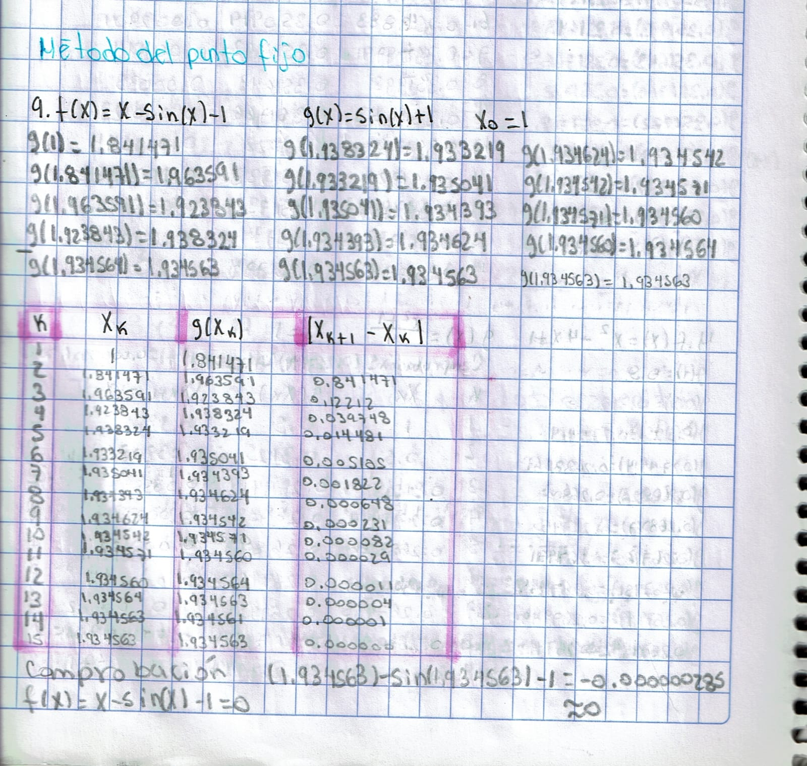{width=600}

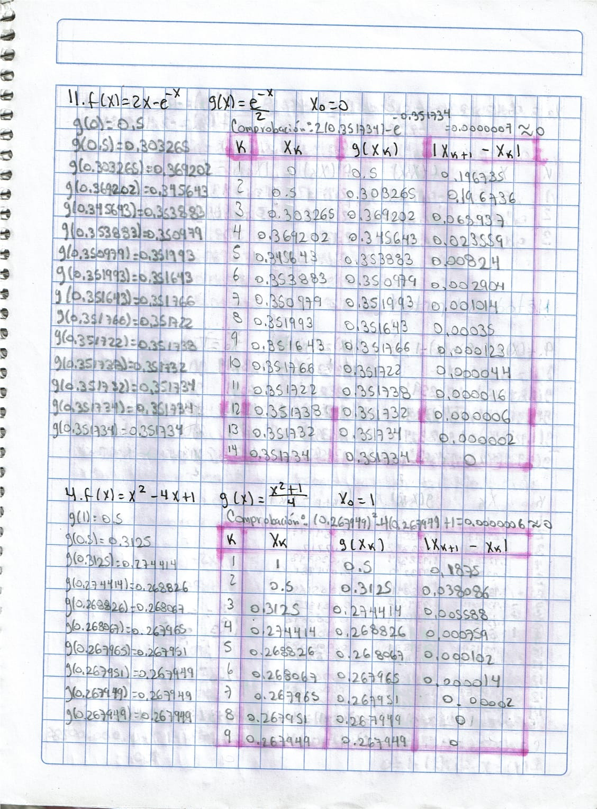{width=600}

#### Código para implementación

```{r}
# Método del Punto Fijo que guarda los valores para la tabla

fijo <- function(g, x0, tol = 1e-5, iter_max = 100){
  
# Vectores para almacenar los datos de las iteraciones
  
  iter_vec <- numeric(0)
  x0_vec <- numeric(0)
  x1_vec <- numeric(0)
  gx0_vec <- numeric(0)
  error_vec <- numeric(0)
  
  iter <- 0
  error <- 1
  
  while(error > tol && iter < iter_max){
    
# Aplicar fórmula de punto fijo
    
    x1 <- g(x0)
    error <- abs(x1 - x0)
    
# Almacena los datos de cada iteración
    
    iter <- iter + 1
    iter_vec <- c(iter_vec, iter)
    x0_vec <- c(x0_vec, x0)
    x1_vec <- c(x1_vec, x1)
    gx0_vec <- c(gx0_vec, g(x0))
    error_vec <- c(error_vec, error)
    
# Actualizar para siguiente iteración
    
    x0 <- x1
  }
  
# Crea la tabla de las iteraciones
  
  TAB <- data.frame(
    "k" = iter_vec,
    "xₖ" = x0_vec,
    "g(xₖ)" = gx0_vec,
    "xₖ₊₁" = x1_vec,
    "eₖ = |xₖ₊₁ - xₖ|" = error_vec,
    check.names = FALSE
  )
  
  cat("Raíz aproximada:", x1, "\n")
  cat("Iteraciones:", iter, "\n\n")
  
  return(list(raiz = x1, iteraciones = iter, tabla = TAB))
}
```

```{r}
# Tabla "bonita" para Punto Fijo

tabla <- function(resultado) {
  library(DT)
  
  datatable(
    resultado$tabla[, -4],
    options = list(
      scrollX = TRUE,
      scrollY = "400px", 
      paging = FALSE,
      dom = 't',
      autoWidth = FALSE,
      columnDefs = list(
        list(className = 'dt-center', targets = 0:3))
    ),
    rownames = FALSE,
    class = 'cell-border stripe',
    width = "100%",
    caption = "Tabla de iteraciones en el método del Punto Fijo",
    escape = FALSE
  ) %>%
    formatRound(columns = c(2:4), digits = 6)
}
```

```{r}
# Gráfica para Punto Fijo

grafica <- function(g, resultado) {

# Obtener la raíz aproximada

    raiz <- resultado$raiz
  
# Calcular rango alrededor de la raíz
  
  x_min <- raiz - 1
  x_max <- raiz + 1
  x_vals <- seq(x_min, x_max, length.out = 1000)
  y_g <- g(x_vals)
  y_x <- x_vals  # y = x
  
# Crear la gráfica
  
  plot(x_vals, y_g, type = "l", main = "Punto de Intersección: y = g(x) y y = x",
       xlab = "x", ylab = "y", col = "blue", lwd = 2, ylim = range(c(y_g, y_x)))
  lines(x_vals, y_x, col = "red", lwd = 2, lty = 2)
  
# Marcar el punto de intersección (raíz)
  
  points(raiz, raiz, col = "green", pch = 19, cex = 1.5)
  
# Líneas para mostrar que es la intersección
  
  abline(v = raiz, col = "green", lty = 3, lwd = 1)
  abline(h = raiz, col = "green", lty = 3, lwd = 1)
  
# Leyenda
  
  legend("topright", 
         legend = c("y = g(x)", "y = x", "Punto fijo"),
         col = c("blue", "red", "green"),
         lty = c(1, 2, NA), pch = c(NA, NA, 19),
         lwd = c(2, 2, NA), cex = 0.8, bty = "n")
}
```

#### Sistema $2$

$f(x) = x^3 + x - 1$

$g(x) = 1 - x^3$

$x_0 = 0.6$

```{r}
# Datos

x0 <- 0.6
f <- function(x) x^3 + x - 1
g <- function(x) 1 - x^3
dg <- function(x) -3*x^2
```

##### Forma $x = g(x)$

Reescriba la ecuación f(x) = 0 en forma x = g(x).

Ya se nos da la sugerencia:

$g(x) = 1 - x^3$

##### Condición

Verifique que la función $g(x)$ cumpla la condición de convergencia local $|g′(x)| < 1$ en el intervalo
considerado.

```{r}

if(abs(dg(x0)) < 1) {
  cat("Condición cumplida\n")
} else {
  cat("Condición no cumplida, es probable que en las primeras 100 iteraciones no converga.\n")
}
```
##### Iteraciones

Realice al menos 8 iteraciones del método.

```{r}
resultado <- fijo(g, x0)
```

##### Tabla
Registre los valores $x_k$, $g(x_k)$, y el error $|x_{k+1} − x_k|$.

```{r}
tabla(resultado)
```

##### Gráficas

Grafica la función y marca el punto donde converge la raíz.

```{r}
grafica(g, resultado)
```

Para este sistema, el método no es el adecuado ya que en las 100 iteraciones que se hicieron, la función no convergió.

#### Sistema $4$

$f(x) = x^2 - 4^x + 1$

$g(x) = \frac{x^2 + 1}{4}$

$x_0 = 1$

```{r}
# Datos

x0 <- 1
f <- function(x) x^2 - 4^x + 1
g <- function(x) (x^2 + 1) / 4
dg <- function(x) (1 / 2) * x
```

##### Forma $x = g(x)$

Reescriba la ecuación f(x) = 0 en forma x = g(x).

Ya se nos da la sugerencia:

$g(x) = \frac{x^2 + 1}{4}$

##### Condición

Verifique que la función $g(x)$ cumpla la condición de convergencia local $|g′(x)| < 1$ en el intervalo
considerado.

```{r}

if(abs(dg(x0)) < 1) {
  cat("Condición cumplida\n")
} else {
  cat("Condición no cumplida, es probable que en las primeras 100 iteraciones no converga.\n")
}
```
##### Iteraciones

Realice al menos 8 iteraciones del método.

```{r}
resultado <- fijo(g, x0)
```

##### Tabla
Registre los valores $x_k$, $g(x_k)$, y el error $|x_{k+1} − x_k|$.

```{r}
tabla(resultado)
```

##### Gráficas

Grafica la función y marca el punto donde converge la raíz.

```{r}
grafica(g, resultado)
```

#### Sistema $8$

$f(x) = x^3 - 3x + 1$

$g(x) = \sqrt[3]{3x - 1}$

$x_0 = 0.8$

```{r}
# Datos

x0 <- 0.8
f <- function(x) x^3 - 3*x + 1
g <- function(x) (3*x - 1)^(1/3)
dg <- function(x) (3*x - 1)^(-2/3)
```

##### Forma $x = g(x)$

Reescriba la ecuación f(x) = 0 en forma x = g(x).

Ya se nos da la sugerencia:

$g(x) = \sqrt[3]{3x - 1}$

##### Condición

Verifique que la función $g(x)$ cumpla la condición de convergencia local $|g′(x)| < 1$ en el intervalo
considerado.

```{r}

if(abs(dg(x0)) < 1) {
  cat("Condición cumplida\n")
} else {
  cat("Condición no cumplida, es probable que en las primeras 100 iteraciones no converga.\n")
}
```
##### Iteraciones

Realice al menos 8 iteraciones del método.

```{r}
resultado <- fijo(g, x0)
```

##### Tabla
Registre los valores $x_k$, $g(x_k)$, y el error $|x_{k+1} − x_k|$.

```{r}
tabla(resultado)
```

##### Gráficas

Grafica la función y marca el punto donde converge la raíz.

```{r}
grafica(g, resultado)
```

#### Sistema $10$

$f(x) = x^2 - 3$

$g(x) = \frac{3}{x}$

$x_0 = 1.5$

```{r}
# Datos

x0 <- 1.5
f <- function(x) x^2 - 3
g <- function(x) 3 / x
dg <- function(x) - 3 / x^2
```

##### Forma $x = g(x)$

Reescriba la ecuación f(x) = 0 en forma x = g(x).

Ya se nos da la sugerencia:

$g(x) = \frac{3}{x}$

##### Condición

Verifique que la función $g(x)$ cumpla la condición de convergencia local $|g′(x)| < 1$ en el intervalo
considerado.

```{r}

if(abs(dg(x0)) < 1) {
  cat("Condición cumplida\n")
} else {
  cat("Condición no cumplida, es probable que en las primeras 100 iteraciones no converga.\n")
}
```
##### Iteraciones

Realice al menos 8 iteraciones del método.

```{r}
resultado <- fijo(g, x0)
```

##### Tabla
Registre los valores $x_k$, $g(x_k)$, y el error $|x_{k+1} − x_k|$.

```{r}
tabla(resultado)
```

##### Gráficas

Grafica la función y marca el punto donde converge la raíz.

```{r}
grafica(g, resultado)
```

Para este sistema, el método no es el adecuado ya que en las 100 iteraciones que se hicieron, la función no convergió.

#### Sistema $14$

$f(x) = x - e^{-x^2}$

$g(x) = e^{-x^2}$

$x_0 = 0.5$

```{r}
# Datos

x0 <- 0.5
f <- function(x) x - exp(-x^2)
g <- function(x) exp(-x^2)
dg <- function(x) - 2 * exp(-x^2)
```

##### Forma $x = g(x)$

Reescriba la ecuación f(x) = 0 en forma x = g(x).

Ya se nos da la sugerencia:

$g(x) = e^{-x^2}$

##### Condición

Verifique que la función $g(x)$ cumpla la condición de convergencia local $|g′(x)| < 1$ en el intervalo
considerado.

```{r}

if(abs(dg(x0)) < 1) {
  cat("Condición cumplida\n")
} else {
  cat("Condición no cumplida, es probable que en las primeras 100 iteraciones no converga.\n")
}
```
##### Iteraciones

Realice al menos 8 iteraciones del método.

```{r}
resultado <- fijo(g, x0)
```

##### Tabla
Registre los valores $x_k$, $g(x_k)$, y el error $|x_{k+1} − x_k|$.

```{r}
tabla(resultado)
```

##### Gráficas

Grafica la función y marca el punto donde converge la raíz.

```{r}
grafica(g, resultado)
```

Para este sistema, el método sí convergió aunque la condición no se haya cumplido, sin embargo, para ello tomo $80$ iteraciones.


## Interpolación y Aproximación

### Ejercicio 1

#### $1.1$

##### $a)$ Polinomio interpolante

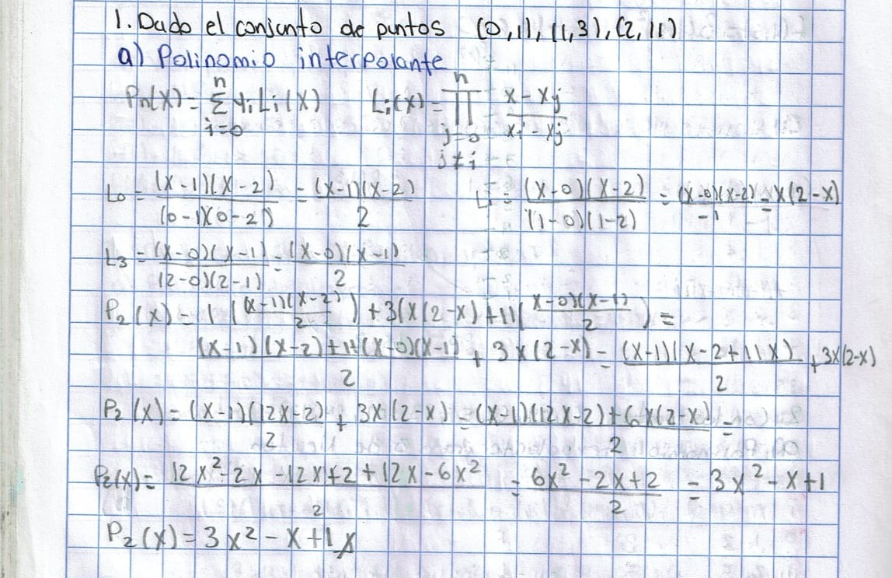{width=600}

##### $b)$ Tabla

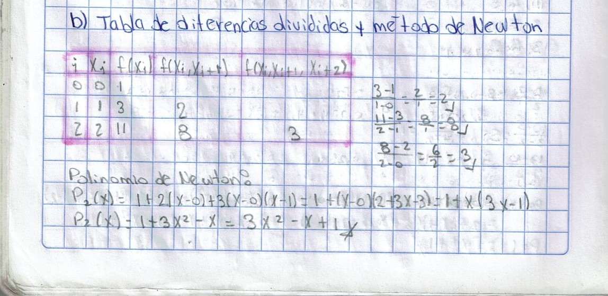{width=600}

##### $c)$ Comparación gráfica

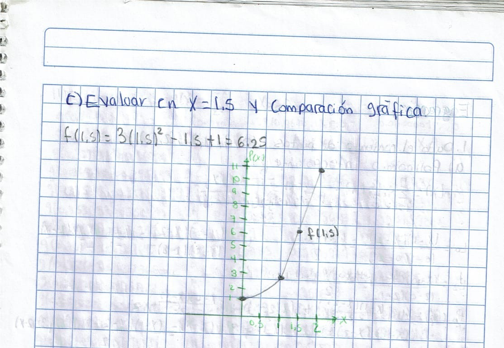{width=600}

#### $1.2$

##### $a)$ Polinomio interpolante grado 3

{width=600}
{width=600}

##### $b)$ Tabla

{width=600}

##### $c)$ Evaluar en $x = 2.5$

{width=600}

##### $d)$ Verificar y comparar

{width=600}

#### $1.3$

##### $a)$ Polinomio de Lagrange

{width=600}

##### $b)$ Expanda y simplifique

{width=600}

##### $c)$ Verifique los valores

{width=600}

### Ejercicio 2

#### $2.1$

##### $a)$ Tabla

{width=600}

##### $b)$ Polinomio

{width=600}

{width=600}

##### $c)$ Calcule $f(2.5)$ y comparación

{width=600}

#### $2.2$

##### $a)$ Tabla

{width=600}

##### $b)$ Newton hacía atrás

{width=600}

##### $c)$ Comparación con $f(x)=x^3$

{width=600}

#### $2.3$

##### $a)$ Nodos equiespaciados

{width=600}

##### $b)$ Tabla

{width=600}

##### $c)$ Estimación $y(25)$

{width=600}

{width=600}

##### $d)$ Mejora o no

{width=600}

### Ejercicio 3

#### $Puntos (0, 1), (1, 3), (2, 11)$

{width=600}

#### $Puntos (1, 2), (2, 5), (3, 10), (4, 17)$

{width=600}

#### $Puntos (-1, 4), (0, 1), (2, 3)$

{width=600}

#### $Puntos (0, 2.0), (1, 2.7), (2, 4.8), (3, 8.9), (4, 16.0)$

{width=600}

### Ejercicio 4

##### $a)$ Datos experimentales equiespaciados

{width=600}

## Prácticas de laboratorio

### Sesión 1

```{r}
#---- SESION 1 ----
##---- OPERADORES LOGICOS ----
17<5
17>5
17<=5
17>=5
17!=5
17==5
##---- OPERADORES ARITMETICOS ----
# SUMA, RESTA, MULTIPLICACION, DIVISION, POTENCIA, MODULO, DIVISION ENTERA
17+5
17*5
17*5
17^5
17%/%5
17%%5
##---- LOGARITMOS Y EXPONENCIALES ----
log(1)
log(12)
log(12,2)
exp(12)
exp(1)
##---- FUNCIONES TRIGONOMETRICAS ----
sin(45)
cos(45)
tan(45)
asin(0.96)
acos(0.97)
atan(0.45)
##---- FUNCIONES VARIAS ----
abs(-34)
sqrt(8)
floor(1.56)
ceiling(1.56)
max(4,7,2,12)
min(4,7,2,12)
sign(-45)
##---- EJERCICIOS DE PRACTICA ----
# calcular la expresion
#cos(pi/6+pi/2)+e^2
# calcular la expresion
#cos(pi/6+pi/2)+e^2*log(5)+a(1/raiz(2))
# introducir las siguientes expresiones: 
1/7
options(digits=3); 1/7
# c) options(digits=6); 1/7
# d) round(67.45)
# e) round(75.324568,2)
# f) options(digits=7);
# g) signif(56.345458234234,2)
# h) signif(56.345458234234)
# i) exp(-30)
# j) options(scipen= 999)
# k) exp(-30)
# l) options(scipen=0)
####---- MIS EJERCICIOS DE PRACTICA SESION 1 ----
##---- OPERADORES LOGICOS ----
20<10
30>5
46<=7
36>=6
26!=5
26==5
##---- OPERADORES ARITMETICOS ----
# SUMA, RESTA, MULTIPLICACION, DIVISION, POTENCIA, MODULO, DIVISION ENTERA
15+1
16*2
17*3
18^4
19%/%5
20%%6
##---- LOGARITMOS Y EXPONENCIALES ----
log(2)
log(6)
log(7,3)
exp(2)
exp(6)
##---- FUNCIONES TRIGONOMETRICAS ----
sin(90)
cos(180)
tan(90)
asin(0.74)
acos(0.79)
atan(0.54)
##---- FUNCIONES VARIAS ----
abs(-15)
sqrt(9)
floor(1.76)
ceiling(1.76)
max(15,215,3,12)
min(1,9,4,2)
sign(-69)
##---- EJERCICIOS DE PRACTICA ----
# calcular la expresion
cos(pi/6+pi/2)+exp(1)^2
# calcular la expresion
cos(pi/6+pi/2)+exp(1)^2*log(5)+acos(1/sqrt(2))
# introducir las siguientes expresiones: 
7/1
options(digits=4); 2/8
options(digits=6); 53/3
round(99.99)
round(99.98765,3)
options(digits=2);
signif(77.77777,4)
signif(pi)
exp(63)
options(scipen= 999)
exp(63)
options(scipen=0)
exp(63)
```

### Sesión 2

```{r}
#---- SESION 2 ----
##---- DEFINICION DE CONSTANTES ----
e = exp(1); 
x = 0.0034
e <- exp(1)
x <- 0.034;
x0 = e^(2*x)
##---- CONCATENAR Y PEGAR EXPRESIONES ----
txt = "El valor de x0 es _"
cat(txt, x0)
paste(txt,x0)
paste0(txt,x0)
##---- ASIGNACION E IMPRESION ----
x0 <- 1
x1 <- x0 - pi*x0 + 1 
(x1 <- x0 - pi*x0 + 1 ) 
print(x1)
##---- LISTADO DE OBJETOS DEFINIDOS ----
ls()
# Eliminar todos los objetos
rm(list= ls())
ls()
##---- IMPRIMIR PEGAR AVANZADO ----
x0 <- 1
x1 <- x0 - pi*x0 + 1
cat("x0 =", x0, "\n","x1 =", x1) 
##---- EJERCICIOS DE PRACTICA ----
##---- TRABAJO EN CLASE ----
a <- 5
b <- 6
c <- 3
raiz <- ((b^2)-(4*a*c))
disc <- abs(raiz)
abs_disc <- abs(disc)
texto <- "El valor del discriminante es:"
cat(texto,disc)
###---- DISTINTAS MANERAS DE ESCRIBIR----
paste (texto,disc)
paste0(texto,disc)
x0 <- 1
x1 <- x0 - pi*x0 + 1
texto <- "El valor de x0 es:"
paste (texto,x0)
texto <- "El valor de x1 es:"
cat(texto,x1)
x1_2 <- x1^2
x1_3 <- x1^3
x1_4 <- x1^4
texto1 <- "El valor de"
texto2 <- ",el cuadrado es:"
paste(texto1,x1,texto2,x1_2)
ls()
rm(list=ls())
x0 <- 1
x1 <- x0 - pi*x0 + 1
cat("x0 es",x0,"\nx1 es",x1)
cat("x0 es",x0,"\n","x1 es",x1)
###---- FUNCIONES TRIGONOMETRICAS----
a <- 1
b <- 2
c <- 3
alfa <- 35
beta <- 55
gama <- 90
seno_alfa <- a/c
coseno_alfa <- b/c
tangente_alfa <- a/b
texto <- "El valor del seno de alfa es:"
paste(texto,seno_alfa)
texto <- "El valor del coseno de alfa es:"
paste(texto,coseno_alfa)
texto <- "El valor de la tangente de alfa es:"
paste(texto,tangente_alfa)
```

### Sesión 3

```{r}
x1 <- c(1.2,1-5,1-9,1-10)
(x1)
```

``` {r}
x2 <- 1:20
(x2)
```
```{r}
x3 <- seq(1,20,by=0.1)
(x3)
```
```{r}
x4 <- seq(20,1,by=-0.1)
(x4)
```
```{r}
x5 <- rep(1,times=10)
(x5)
```
```{r}
n1 <- length(x1); (n1)
n2 <- length(x1); (n2)
n3 <- length(x1); (n3)
n4 <- length(x1); (n4)
n5 <- length(x1); (n5)
```
```{r}
x <- runif(100,-3,3)
(x)
```

Ejemplo de redondeo y truncamiento

```{r}
x <- runif(20,-1,1);(x)
xx <- 100*x;(xx)
```

Fijamos la semilla para generar números aleatorios

```{r}
set.seed(123) #Sirve para que cuando comparta mi archivo con alguien, vea exactamente los mismos números que yo#
x <- runif(20,-1,1)
(x)
xx <- 100*x; (xx)
```

Redondeamos a tres cifras significativas:

```{r}
x_red2 <- round(xx,2); (x_red2)
x_red3 <- round(xx,3); (x_red3)
```
Generamos una nueva variable con 5000 datos, con una distribución uniforme entre -10 y 10, con 3 cifras significativas, posteriormente obtendremos una muestra de tamaño 500 con el comando sample(datos_origen,tamaño_de_la_muestra) y se almacenaran en la variable muestra_1:

```{r}
set.seed(123)
x5000 <- runif(5000,-10,10); (x5000) #sirve para crear una lista de números aleatorios con distribución uniforme entre -10 y 10#
x_redondeo <- round(x5000,3); (x_redondeo) #round sirve para redondear, en este caso a 3 cifras significativas#
```
```{r}
muestra_1 <- sample(x_redondeo,500); (muestra_1) #sample nos proporciona una muestra de nuestros datos, en este caso, de 500 de 5000 datos#
```
```{r}
nx <- runif(5000,-10,10); (nx)
head(nx,10)
tail(nx,10)
nx_red <- round(nx,3)
head(nx,15)
tail(nx,15)
muestra1 <- sample(nx_red,500);
head(muestra1,10)
tail(muestra1,10)
```
Convertimos todos los números a positivos

```{r}
muestra2 <- abs(muestra1)
head(muestra2,15)
tail(muestra2,15)
```
```{r}
nx_red <- round(muestra1,0)
muestra3 <- abs(nx_red)
head(muestra3,15)
tail(muestra3,15)
```

### Sesión 4

```{r}
soluciones <- function(a,b,c){
  d<- (b^2)-(4*a*c)
  if(d<0){
    resp<- "No hay soluciones"
  }
  else{
    resp<-"Sí hay soluciones"
  }
respuesta<- cat(resp,"",d)
return(respuesta)
}
intento1<- soluciones(5,2,3)
```
```{r}
valores<- c(15,3,-2,13,27,10,8,-4,11)
A<- matrix(valores,nrow = 3)
valoresb<- c(-3,2,-1)
b<- matrix(valoresb,nrow=3);(b)
Ab<- cbind(A,b);(Ab)
bA<- cbind(b,A);(bA)
Abt<- rbind(A,t(b))
btA<- rbind(t(b),A)
(Abt)
(btA)
```
```{r}
valores2<- c(15,13,8,3,27,-4,-2,10,4)
tA<- matrix(t(valores),nrow=3)
A2<- matrix(valores2,nrow = 3)
(tA)
(A2)
```

```{r}
r1<- Ab[1,]
r2<- Ab[2,]
r3<- Ab[3,]
c1<- Ab[,1]
c2<- Ab[,2]
c3<- Ab[,3]
a11<-Ab[1,1]
a22<-Ab[2,2]
a32<-Ab[3,2]
a14<-Ab[1,2]
a24<-Ab[2,4]
```
```{r}
m1<- -Ab[2,1]/Ab[1,1]
(m1)
m2<- -Ab[3,1]/Ab[1,1]
(m2)
A1<- Ab[1,]
(A1)
A2<- m1*Ab[1,]+Ab[2,]
(A2)
A3<-m2*Ab[1,]+Ab[3,]
(A3)
NuevaA<- rbind(A1,A2,A3)
(NuevaA)
```

```{r}
Ab<- NuevaA
m3<--Ab[3,2]/Ab[2,2]
(m3)
A3<- m3*Ab[2,]+Ab[3,]
(A3)
NuevaA<- rbind(A1,A2,A3)
(NuevaA)
```

### Sesión 5 y Tareita 1

Eliminación Gaussiana con pivoteo parcial
 
 El sistema a resolver es:
 
 5x+2y-3z+4w=-1
 
 -x+y+z-3w=2
 
 6x+6y-4z+w=0
 
  x-y-z-w=2

```{r}
valores<- c(5,-1,6,1,2,1,6,-1,-3,1,-4,-1,4,-3,1,-1,-1,2,0,2)
A<- matrix(valores,nrow = 4)
(A)
```

Primera eliminación

Cambiar columnas

```{r}
pivoteo<- A[c(3,2,1,4), ]
(pivoteo)
```

Volver ceros 

```{r}
m1<- -A[2,1]/A[1,1]
m2<- -A[3,1]/A[1,1]
m3<- -A[4,1]/A[1,1]
R1<- pivoteo[1,]
R2<- m1*A[1,]+A[2,]
R3<- m2*A[1,]+A[3,]
R4<- m3*A[1,]+A[4,]
NuevaA<- rbind(R1,R2,R3,R4)
(NuevaA)
```

Segunda eliminación

Cambiar columnas Segunda vez

```{r}
pivoteo<- NuevaA[c(1,3,2,4), ]
(pivoteo)
```

Volver ceros 

```{r}
m4<- -pivoteo[3,2]/pivoteo[2,2]
m5<- -pivoteo[4,2]/pivoteo[2,2]
R1<- pivoteo[1,]
R2<- pivoteo[2,]
R3<- m4*pivoteo[2,]+pivoteo[3,]
R4<- m5*pivoteo[2,]+pivoteo[4,]
NuevaA<- rbind(R1,R2,R3,R4)
(NuevaA)
```
Tercera eliminación

Cambiar columnas tercera vez

No es necesario cambiar las columnas porque el máximo valor absoluto de las columnas, ya se encuentra acomodado

Volver ceros 

```{r}
m6<- -NuevaA[4,3]/NuevaA[3,3]
R1<- NuevaA[1,]
R2<- NuevaA[2,]
R3<- NuevaA[3,]
R4<- m6*NuevaA[3,]+NuevaA[4,]
NuevaA<- rbind(R1,R2,R3,R4)
(NuevaA)

```

Cuarta eliminación (Aquí comienza la eliminación hacia atrás)

Volver ceros 

```{r}
m7<- -NuevaA[3,4]/NuevaA[4,4]
m8<- -NuevaA[2,4]/NuevaA[4,4]
m9<- -NuevaA[1,4]/NuevaA[4,4]

R1<- m9 * NuevaA[4,] + NuevaA[1,]
R2<- m8 * NuevaA[4,] + NuevaA[2,]
R3<- m7 * NuevaA[4,] + NuevaA[3,]
R4<- NuevaA[4,]

NuevaA<- rbind(R1, R2, R3, R4)
(NuevaA)
```

Quinta eliminación

```{r}
m10<- -NuevaA[2,3]/NuevaA[3,3]
m11<- -NuevaA[1,3]/NuevaA[3,3]

R4<- NuevaA[4,]
R3<- NuevaA[3,]
R2<- m10 * NuevaA[3,] + NuevaA[2,]
R1<- m11 * NuevaA[3,] + NuevaA[1,]

NuevaA<- rbind(R1, R2, R3, R4)
(NuevaA)
```

Sexta eliminación

```{r}
m12<- -NuevaA[1,2]/NuevaA[2,2]

R4<- NuevaA[4,]
R3<- NuevaA[3,]
R2<- NuevaA[2,]
R1<- m12 * NuevaA[2,] + NuevaA[1,]

NuevaA<- rbind(R1, R2, R3, R4)
(NuevaA)
```

Soluciones

```{r}
x<- NuevaA[1,5] / NuevaA[1,1]
y<- NuevaA[2,5] / NuevaA[2,2]
z<- NuevaA[3,5] / NuevaA[3,3]
w<- NuevaA[4,5] / NuevaA[4,4]

cat("Soluciones del sistema:\n")
cat("x =", x, "\n")
cat("y =", y, "\n") 
cat("z =", z, "\n")
cat("w =", w, "\n")
```

### Sesión 6 y Tareita 2

Inversa de una matriz
```{r}
A=matrix(c(1,3,-2,1,
           1,4,-1,2,
           0,1,-1,4,  
           2,6,1,2),nrow = 4,byrow = TRUE)
(A)
Aorig<- A
```
1)
```{r}
I = diag(4);(I)
```
2)
```{r}
AInv <- cbind(A,I);
(AInv)
```
3)
```{r}
A <- AInv
l21 <- A[2,1]/A[1,1];(l21)
l31 <- A[3,1]/A[1,1];(l31)
l41 <- A[4,1]/A[1,1];(l41)
```
4)
```{r}
A[2,] <- A[2,]-l21*A[1,];
A[3,] <- A[3,]-l31*A[1,];
A[4,] <- A[4,]-l41*A[1,];
(A)
```

6)
```{r}
l32 <- A[3,2]/A[2,2];(l32)
l42 <- A[4,2]/A[2,2];(l42)
```
7)
```{r}
A[3,] <- A[3,]-l32*A[2,];
A[4,] <- A[4,]-l42*A[2,];
(A)
```
8)
```{r}
esc <- 1/A[3,3]
A[3,] <- esc*A[3,]
(A)
```
9)
```{r}
l43 <- A[4,3]/A[3,3];(l43)
```
10)
```{r}
A[4,] <- A[4,]-l43*A[3,];
(A)
```
11)
```{r}
esc <- 1/A[4,4]
A[4,] <- esc*A[4,]
(A)
```
12)
```{r}
l34 <- A[3,4]/A[4,4];(l34); A[3,] <- A[3,]-l34*A[4,]
l24 <- A[2,4]/A[4,4];(l24); A[2,] <- A[2,]-l24*A[4,]
l14 <- A[1,4]/A[4,4];(l14); A[1,] <- A[1,]-l14*A[4,]
(A)
```
13)
```{r}
l23 <- A[2,3]/A[3,3];(l23); A[2,] <- A[2,]-l23*A[3,]
l13 <- A[1,3]/A[3,3];(l13); A[1,] <- A[1,]-l13*A[3,]
(A)
```
14)
```{r}
l12 <- A[1,2]/A[2,2];(l12); A[1,] <- A[1,]-l12*A[2,]
(A)
```
15)
```{r}
AInv <- A[,5:8]; (AInv)
```
16)
```{r}
IdCalc <- Aorig%*%AInv;
(IdCalc)
```
Factorización LU
Ejemplo 1
```{r}
A=matrix(c(1,1,1,1,
           2,3,1,5,
          -1,1,-5,3,
           3,1,7,-2),byrow = TRUE,nrow = 4)
(A)
```
```{r}
b=matrix(c(10,31,-2,18),nrow = 4)
(b)
```
```{r}
Ab <- cbind(A,b); (Ab)
```
Los pivotes se definen como $a_{kk}^{(k)}$, luego construimos los
multiplicadores: $l_{i,k}=a_{ik}^{(k)}/a_{kk}^{(k)}$,
$l_{21}=a_{21}/a_{aa}$ y $l_{31}=a_{31}/a_{11}$ y $l_{41}=a_{41}/a_{11}$
```{r}
A <- Ab;
l21 <- A[2,1]/A[1,1];(l21)
l31 <- A[3,1]/A[1,1];(l31)
l41 <- A[4,1]/A[1,1];(l41)
```
Construimos la matriz $U$, donde las entradas $a_{ij}^{(k+1)}=a_{ik}^{(k)}-
l_{ik}\times a_{kj}^{(k)}$
```{r}
A[2,] <- A[2,]-l21*A[1,]; (A[2,])
A[3,] <- A[3,]-l31*A[1,]; (A[3,])
A[4,] <- A[4,]-l41*A[1,]; (A[4,])
```
Es decir la matriz resultante es:
```{r}
(A)
```
entonces el pivote es $A_{22} = 1$, calculemos los $l_{32}$ y $l_{42}$
```{r}
l32 <- A[3,2]/A[2,2];(l32)
l42 <- A[4,2]/A[2,2];(l42)
```
Haciendo cero debajo del pivote
```{r}
A[3,] <- A[3,]-l32*A[2,];(A[3,])
A[4,] <- A[4,]-l42*A[2,];(A[4,])
```
La matriz $A$ queda de la forma:
```{r}
(A)
```
por tanto el pivote es $A_{33}=-2$, y resta calcylar $l_{43}$
```{r}
l43 <- A[4,3]/A[3,3];(l43)
```
haciendo cero debajo del pivote
```{r}
A[4,] <- A[4,]-l43*A[3,];(A[4,])
```
Por lo tanto la matriz $A$ resultante es
```{r}
(A)
```
entonces podemos construir la matriz $L$ con los valores $l_{ij}$
calculados en los pasos anteriores
```{r}
L=diag(4);(L)
```
```{r}
L[2,1] <- l21
L[3,1] <- l31
L[4,1] <- l41
L[3,2] <- l32
L[4,2] <- l42
L[4,3] <- l43
(L)
```
```{r}
U <- A[,1:4];(U)
```
Verifiquemos que efectivamente $A=LU$
```{r}
Acalculada <- L%*%U; (Acalculada)
```
Ejemplo 2
Apliquemos lo desarrollado para la siguiente matriz $A$
```{r}
A=matrix(c(4,0,1,1,
           3,1,3,1,
           0,1,2,0,
           3,2,4,1),nrow = 4,byrow = TRUE);
(A)
```
```{r}
b=matrix(c(5,6,13,1),nrow = 4);(b)
```
1)
```{r}
Ab <- cbind(A,b)
A <- Ab;
```
2)
```{r}
l21 <- A[2,1]/A[1,1];(l21)
l31 <- A[3,1]/A[1,1];(l31)
l41 <- A[4,1]/A[1,1];(l41)
```
3)
```{r}
A[2,] <- A[2,]-l21*A[1,]; (A[2,])
A[3,] <- A[3,]-l31*A[1,]; (A[3,])
A[4,] <- A[4,]-l41*A[1,]; (A[4,])
```
4)
```{r}
l32 <- A[3,2]/A[2,2];(l32)
l42 <- A[4,2]/A[2,2];(l42)
```
5)
```{r}
A[3,] <- A[3,]-l32*A[2,];(A[3,])
A[4,] <- A[4,]-l42*A[2,];(A[4,])
```
6)
```{r}
l43 <- A[4,3]/A[3,3];(l43)
```
7)
```{r}
A[4,] <- A[4,]-l43*A[3,];(A[4,])
```
8)
```{r}
L=diag(4);(L)
```
9)
```{r}
L[2,1] <- l21
L[3,1] <- l31
L[4,1] <- l41
L[3,2] <- l32
L[4,2] <- l42
L[4,3] <- l43;
(L)
```
10)
```{r}
U <- A[,1:4];(U)
```
11)
```{r}
Acalculada <- L%*%U; (Acalculada)
```
Ejercicio
Aplicar la factorización $LU$ a la matriz A definida por
```{r}
A=matrix(c(2,3,2,4,
           4,10,-4,0,
          -3,-2,-5,-2,
          -2,4,4,-7),nrow = 4,byrow = TRUE)
(A)
Aorig<- A
```
Factorización LU

Ejercicio

```{r}
A=matrix(c(2,3,2,4,
           4,10,-4,0,
          -3,-2,-5,-2,
          -2,4,4,-7),nrow = 4,byrow = TRUE)
(A)
```

```{r}
b<- matrix(c(10,31,-2,18),nrow = 4)
(b)
```
```{r}
Ab <- cbind(A,b); (Ab)
```
Los pivotes se definen como $a_{kk}^{(k)}$, luego construimos los
multiplicadores: $l_{i,k}=a_{ik}^{(k)}/a_{kk}^{(k)}$,
$l_{21}=a_{21}/a_{aa}$ y $l_{31}=a_{31}/a_{11}$ y $l_{41}=a_{41}/a_{11}$
```{r}
A <- Ab;
l21 <- A[2,1]/A[1,1];(l21)
l31 <- A[3,1]/A[1,1];(l31)
l41 <- A[4,1]/A[1,1];(l41)
```
Construimos la matriz $U$, donde las entradas $a_{ij}^{(k+1)}=a_{ik}^{(k)}-
l_{ik}\times a_{kj}^{(k)}$
```{r}
A[2,] <- A[2,]-l21*A[1,]; (A[2,])
A[3,] <- A[3,]-l31*A[1,]; (A[3,])
A[4,] <- A[4,]-l41*A[1,]; (A[4,])
```
Es decir la matriz resultante es:
```{r}
(A)
```
entonces el pivote es $A_{22} = 1$, calculemos los $l_{32}$ y $l_{42}$
```{r}
l32 <- A[3,2]/A[2,2];(l32)
l42 <- A[4,2]/A[2,2];(l42)
```
Haciendo cero debajo del pivote
```{r}
A[3,] <- A[3,]-l32*A[2,];(A[3,])
A[4,] <- A[4,]-l42*A[2,];(A[4,])
```
La matriz $A$ queda de la forma:
```{r}
(A)
```
por tanto el pivote es $A_{33}=-2$, y resta calcylar $l_{43}$
```{r}
l43 <- A[4,3]/A[3,3];(l43)
```
haciendo cero debajo del pivote
```{r}
A[4,] <- A[4,]-l43*A[3,];(A[4,])
```
Por lo tanto la matriz $A$ resultante es
```{r}
(A)
```
entonces podemos construir la matriz $L$ con los valores $l_{ij}$
calculados en los pasos anteriores
```{r}
L=diag(4);(L)
```
```{r}
L[2,1] <- l21
L[3,1] <- l31
L[4,1] <- l41
L[3,2] <- l32
L[4,2] <- l42
L[4,3] <- l43
(L)
```
```{r}
U <- A[,1:4];(U)
```
Verifiquemos que efectivamente $A=LU$
```{r}
Acalculada <- L%*%U; (Acalculada)
```
Notas importantes
**Nota 1** Si se fija $l_{ii}=1$ se le denomina factorizacion *Doolitle*.
**Nota 2** Una matriz $A$ tiene factorización de Doolitle si y sólo sí se
le puede aplicar el metodo de eliminación de Gauss sin pivoteo.
**Nota 3** Si $U=L^{T}$ entonces la factorización se le denomina
*factorización de Cholesky*.
**Nota 4** Si la matriz es simétrica y definida positiva, entonces
$A=LL^{T}$.

### Sesión 7

Gauss-Seidel

```{r}
A <- matrix(c(4, -1, 0, 0, 0,
             -1, 4, -1, 0, 0,
             0, -1, 4, -1, 0,
             0, 0, -1, 4, -1,
             0, 0, 0, -1, 4),
nrow = 5, byrow = TRUE)
b <- c(1, 2, 3, 4, 5)
(A)
(b)
```


```{r}
x <- rep(0, 5) # x^(0)=(0,0,0,0,0)
cat("x^(0)=",paste(sprintf("%.8f",x), collapse=", "), "\n")
```


Iteración 1

```{r}
x_old <- x
cat("\nIteración 1\n")

```


```{r}
x[1] <- (b[1] + x_old[2]) / A[1,1]
cat(sprintf("x1^(1) = (1 + %g)/4 = %.8f\n", x_old[2], x[1]))
```

```{r}
x[2] <- (b[2] + x[1] + x_old[3]) / A[2,2]
cat(sprintf("x2^(1) = (2 + %.8f + %g)/4 = %.8f\n", x[1], x_old[3], x[2]))
```

```{r}
x[3] <- (b[3] + x[2] + x_old[4]) / A[3,3]
cat(sprintf("x3^(1) = (3 + %.8f + %g)/4 = %.8f\n", x[2], x_old[4], x[3]))
```

```{r}
x[4] <- (b[4] + x[3] + x_old[5]) / A[4,4]
cat(sprintf("x4^(1) = (4 + %.8f + %g)/4 = %.8f\n", x[3], x_old[5], x[4]))
```

```{r}
x[5] <- (b[5] + x[4]) / A[5,5]
cat(sprintf("x5^(1) = (5 + %.8f)/4 = %.8f\n", x[4], x[5]))
```

```{r}
r <- b - A %*% x
dx_inf <- max(abs(x - x_old))
cat(sprintf("x^(1) = %s\n", paste(sprintf("%.8f", x), collapse=", ")))
cat(sprintf("||dx||_inf = %.8e | ||r||_inf = %.8e\n", dx_inf, max(abs(r))))
```

Iteración 2

```{r}
x_old <- x
cat("\nIteración 2\n")
x[1] <- (b[1] + x_old[2]) / A[1,1]
cat(sprintf("x1^(2) = (1 + %g)/4 = %.8f\n", x_old[2], x[1]))
x[2] <- (b[2] + x[1] + x_old[3]) / A[2,2]
cat(sprintf("x2^(2) = (2 + %.8f + %g)/4 = %.8f\n", x[1], x_old[3], x[2]))
x[3] <- (b[3] + x[2] + x_old[4]) / A[3,3]
cat(sprintf("x3^(2) = (3 + %.8f + %g)/4 = %.8f\n", x[2], x_old[4], x[3]))
x[4] <- (b[4] + x[3] + x_old[5]) / A[4,4]
cat(sprintf("x4^(2) = (4 + %.8f + %g)/4 = %.8f\n", x[3], x_old[5], x[4]))
x[5] <- (b[5] + x[4]) / A[5,5]
cat(sprintf("x5^(2) = (5 + %.8f)/4 = %.8f\n", x[4], x[5]))
r <- b - A %*% x
dx_inf <- max(abs(x - x_old))
cat(sprintf("x^(2) = %s\n", paste(sprintf("%.8f", x), collapse=", ")))
cat(sprintf("||dx||_inf = %.8e | ||r||_inf = %.8e\n", dx_inf, max(abs(r))))
```

Iteración 3

```{r}
x_old <- x
cat("\nIteración 3\n")
x[1] <- (b[1] + x_old[2]) / A[1,1]
cat(sprintf("x1^(3) = (1 + %g)/4 = %.8f\n", x_old[2], x[1]))
x[2] <- (b[2] + x[1] + x_old[3]) / A[2,2]
cat(sprintf("x2^(3) = (2 + %.8f + %g)/4 = %.8f\n", x[1], x_old[3], x[2]))
x[3] <- (b[3] + x[2] + x_old[4]) / A[3,3]
cat(sprintf("x3^(3) = (3 + %.8f + %g)/4 = %.8f\n", x[2], x_old[4], x[3]))
x[4] <- (b[4] + x[3] + x_old[5]) / A[4,4]
cat(sprintf("x4^(3) = (4 + %.8f + %g)/4 = %.8f\n", x[3], x_old[5], x[4]))
x[5] <- (b[5] + x[4]) / A[5,5]
cat(sprintf("x5^(3) = (5 + %.8f)/4 = %.8f\n", x[4], x[5]))
r <- b - A %*% x
dx_inf <- max(abs(x - x_old))
cat(sprintf("x^(3) = %s\n", paste(sprintf("%.8f", x), collapse=", ")))
cat(sprintf("||dx||_inf = %.8e | ||r||_inf = %.8e\n", dx_inf, max(abs(r))))
```


Iteración 4

```{r}
x_old <- x
cat("\nIteración 4\n")
x[1] <- (b[1] + x_old[2]) / A[1,1]
cat(sprintf("x1^(4) = (1 + %g)/4 = %.8f\n", x_old[2], x[1]))
x[2] <- (b[2] + x[1] + x_old[3]) / A[2,2]
cat(sprintf("x2^(4) = (2 + %.8f + %g)/4 = %.8f\n", x[1], x_old[3], x[2]))
x[3] <- (b[3] + x[2] + x_old[4]) / A[3,3]
cat(sprintf("x3^(4) = (3 + %.8f + %g)/4 = %.8f\n", x[2], x_old[4], x[3]))
x[4] <- (b[4] + x[3] + x_old[5]) / A[4,4]
cat(sprintf("x4^(4) = (4 + %.8f + %g)/4 = %.8f\n", x[3], x_old[5], x[4]))
x[5] <- (b[5] + x[4]) / A[5,5]
cat(sprintf("x5^(4) = (5 + %.8f)/4 = %.8f\n", x[4], x[5]))
r <- b - A %*% x
dx_inf <- max(abs(x - x_old))
cat(sprintf("x^(4) = %s\n", paste(sprintf("%.8f", x), collapse=", ")))
cat(sprintf("||dx||_inf = %.8e | ||r||_inf = %.8e\n", dx_inf, max(abs(r))))
```


Iteración 5

```{r}
x_old <- x
cat("\nIteración 5\n")
x[1] <- (b[1] + x_old[2]) / A[1,1]
cat(sprintf("x1^(5) = (1 + %g)/4 = %.8f\n", x_old[2], x[1]))
x[2] <- (b[2] + x[1] + x_old[3]) / A[2,2]
cat(sprintf("x2^(5) = (2 + %.8f + %g)/4 = %.8f\n", x[1], x_old[3], x[2]))
x[3] <- (b[3] + x[2] + x_old[4]) / A[3,3]
cat(sprintf("x3^(5) = (3 + %.8f + %g)/4 = %.8f\n", x[2], x_old[4], x[3]))
x[4] <- (b[4] + x[3] + x_old[5]) / A[4,4]
cat(sprintf("x4^(5) = (4 + %.8f + %g)/4 = %.8f\n", x[3], x_old[5], x[4]))
x[5] <- (b[5] + x[4]) / A[5,5]
cat(sprintf("x5^(5) = (5 + %.8f)/4 = %.8f\n", x[4], x[5]))
r <- b - A %*% x
dx_inf <- max(abs(x - x_old))
cat(sprintf("x^(5) = %s\n", paste(sprintf("%.8f", x), collapse=", ")))
cat(sprintf("||dx||_inf = %.8e | ||r||_inf = %.8e\n", dx_inf, max(abs(r))))
```


Iteración 6

```{r}
x_old <- x
cat("\nIteración 6\n")
x[1] <- (b[1] + x_old[2]) / A[1,1]
cat(sprintf("x1^(6) = (1 + %g)/4 = %.8f\n", x_old[2], x[1]))
x[2] <- (b[2] + x[1] + x_old[3]) / A[2,2]
cat(sprintf("x2^(6) = (2 + %.8f + %g)/4 = %.8f\n", x[1], x_old[3], x[2]))
x[3] <- (b[3] + x[2] + x_old[4]) / A[3,3]
cat(sprintf("x3^(6) = (3 + %.8f + %g)/4 = %.8f\n", x[2], x_old[4], x[3]))
x[4] <- (b[4] + x[3] + x_old[5]) / A[4,4]
cat(sprintf("x4^(6) = (4 + %.8f + %g)/4 = %.8f\n", x[3], x_old[5], x[4]))
x[5] <- (b[5] + x[4]) / A[5,5]
cat(sprintf("x5^(6) = (5 + %.8f)/4 = %.8f\n", x[4], x[5]))
r <- b - A %*% x
dx_inf <- max(abs(x - x_old))
cat(sprintf("x^(6) = %s\n", paste(sprintf("%.8f", x), collapse=", ")))
cat(sprintf("||dx||_inf = %.8e | ||r||_inf = %.8e\n", dx_inf, max(abs(r))))
```


Iteración 7

```{r}
x_old <- x
cat("\nIteración 7\n")
x[1] <- (b[1] + x_old[2]) / A[1,1]
cat(sprintf("x1^(7) = (1 + %g)/4 = %.8f\n", x_old[2], x[1]))
x[2] <- (b[2] + x[1] + x_old[3]) / A[2,2]
cat(sprintf("x2^(7) = (2 + %.8f + %g)/4 = %.8f\n", x[1], x_old[3], x[2]))
x[3] <- (b[3] + x[2] + x_old[4]) / A[3,3]
cat(sprintf("x3^(7) = (3 + %.8f + %g)/4 = %.8f\n", x[2], x_old[4], x[3]))
x[4] <- (b[4] + x[3] + x_old[5]) / A[4,4]
cat(sprintf("x4^(7) = (4 + %.8f + %g)/4 = %.8f\n", x[3], x_old[5], x[4]))
x[5] <- (b[5] + x[4]) / A[5,5]
cat(sprintf("x5^(7) = (5 + %.8f)/4 = %.8f\n", x[4], x[5]))
r <- b - A %*% x
dx_inf <- max(abs(x - x_old))
cat(sprintf("x^(7) = %s\n", paste(sprintf("%.8f", x), collapse=", ")))
cat(sprintf("||dx||_inf = %.8e | ||r||_inf = %.8e\n", dx_inf, max(abs(r))))
```


Iteración 8

```{r}
x_old <- x
cat("\nIteración 8\n")
x[1] <- (b[1] + x_old[2]) / A[1,1]
cat(sprintf("x1^(8) = (1 + %g)/4 = %.8f\n", x_old[2], x[1]))
x[2] <- (b[2] + x[1] + x_old[3]) / A[2,2]
cat(sprintf("x2^(8) = (2 + %.8f + %g)/4 = %.8f\n", x[1], x_old[3], x[2]))
x[3] <- (b[3] + x[2] + x_old[4]) / A[3,3]
cat(sprintf("x3^(8) = (3 + %.8f + %g)/4 = %.8f\n", x[2], x_old[4], x[3]))
x[4] <- (b[4] + x[3] + x_old[5]) / A[4,4]
cat(sprintf("x4^(8) = (4 + %.8f + %g)/4 = %.8f\n", x[3], x_old[5], x[4]))
x[5] <- (b[5] + x[4]) / A[5,5]
cat(sprintf("x5^(8) = (5 + %.8f)/4 = %.8f\n", x[4], x[5]))
r <- b - A %*% x
dx_inf <- max(abs(x - x_old))
cat(sprintf("x^(8) = %s\n", paste(sprintf("%.8f", x), collapse=", ")))
cat(sprintf("||dx||_inf = %.8e | ||r||_inf = %.8e\n", dx_inf, max(abs(r))))
```


Iteración 9

```{r}
x_old <- x
cat("\nIteración 9\n")
x[1] <- (b[1] + x_old[2]) / A[1,1]
cat(sprintf("x1^(9) = (1 + %g)/4 = %.8f\n", x_old[2], x[1]))
x[2] <- (b[2] + x[1] + x_old[3]) / A[2,2]
cat(sprintf("x2^(9) = (2 + %.8f + %g)/4 = %.8f\n", x[1], x_old[3], x[2]))
x[3] <- (b[3] + x[2] + x_old[4]) / A[3,3]
cat(sprintf("x3^(9) = (3 + %.8f + %g)/4 = %.8f\n", x[2], x_old[4], x[3]))
x[4] <- (b[4] + x[3] + x_old[5]) / A[4,4]
cat(sprintf("x4^(9) = (4 + %.8f + %g)/4 = %.8f\n", x[3], x_old[5], x[4]))
x[5] <- (b[5] + x[4]) / A[5,5]
cat(sprintf("x5^(9) = (5 + %.8f)/4 = %.8f\n", x[4], x[5]))
r <- b - A %*% x
dx_inf <- max(abs(x - x_old))
cat(sprintf("x^(9) = %s\n", paste(sprintf("%.8f", x), collapse=", ")))
cat(sprintf("||dx||_inf = %.8e | ||r||_inf = %.8e\n", dx_inf, max(abs(r))))
```


Iteración 10

```{r}
x_old <- x
cat("\nIteración 10\n")
x[1] <- (b[1] + x_old[2]) / A[1,1]
cat(sprintf("x1^(10) = (1 + %g)/4 = %.8f\n", x_old[2], x[1]))
x[2] <- (b[2] + x[1] + x_old[3]) / A[2,2]
cat(sprintf("x2^(10) = (2 + %.8f + %g)/4 = %.8f\n", x[1], x_old[3], x[2]))
x[3] <- (b[3] + x[2] + x_old[4]) / A[3,3]
cat(sprintf("x3^(10) = (3 + %.8f + %g)/4 = %.8f\n", x[2], x_old[4], x[3]))
x[4] <- (b[4] + x[3] + x_old[5]) / A[4,4]
cat(sprintf("x4^(10) = (4 + %.8f + %g)/4 = %.8f\n", x[3], x_old[5], x[4]))
x[5] <- (b[5] + x[4]) / A[5,5]
cat(sprintf("x5^(10) = (5 + %.8f)/4 = %.8f\n", x[4], x[5]))
r <- b - A %*% x
dx_inf <- max(abs(x - x_old))
cat(sprintf("x^(10) = %s\n", paste(sprintf("%.8f", x), collapse=", ")))
cat(sprintf("||dx||_inf = %.8e | ||r||_inf = %.8e\n", dx_inf, max(abs(r))))
```

Iteración 11

```{r}
x_old <- x
cat("\nIteración 11\n")
x[1] <- (b[1] + x_old[2]) / A[1,1]
cat(sprintf("x1^(11) = (1 + %g)/4 = %.8f\n", x_old[2], x[1]))
x[2] <- (b[2] + x[1] + x_old[3]) / A[2,2]
cat(sprintf("x2^(11) = (2 + %.8f + %g)/4 = %.8f\n", x[1], x_old[3], x[2]))
x[3] <- (b[3] + x[2] + x_old[4]) / A[3,3]
cat(sprintf("x3^(11) = (3 + %.8f + %g)/4 = %.8f\n", x[2], x_old[4], x[3]))
x[4] <- (b[4] + x[3] + x_old[5]) / A[4,4]
cat(sprintf("x4^(11) = (4 + %.8f + %g)/4 = %.8f\n", x[3], x_old[5], x[4]))
x[5] <- (b[5] + x[4]) / A[5,5]
cat(sprintf("x5^(11) = (5 + %.8f)/4 = %.8f\n", x[4], x[5]))
r <- b - A %*% x
dx_inf <- max(abs(x - x_old))
cat(sprintf("x^(11) = %s\n", paste(sprintf("%.8f", x), collapse=", ")))
cat(sprintf("||dx||_inf = %.8e | ||r||_inf = %.8e\n", dx_inf, max(abs(r))))
```


Iteración 12

```{r}
x_old <- x
cat("\nIteración 12\n")
x[1] <- (b[1] + x_old[2]) / A[1,1]
cat(sprintf("x1^(12) = (1 + %g)/4 = %.8f\n", x_old[2], x[1]))
x[2] <- (b[2] + x[1] + x_old[3]) / A[2,2]
cat(sprintf("x2^(12) = (2 + %.8f + %g)/4 = %.8f\n", x[1], x_old[3], x[2]))
x[3] <- (b[3] + x[2] + x_old[4]) / A[3,3]
cat(sprintf("x3^(12) = (3 + %.8f + %g)/4 = %.8f\n", x[2], x_old[4], x[3]))
x[4] <- (b[4] + x[3] + x_old[5]) / A[4,4]
cat(sprintf("x4^(12) = (4 + %.8f + %g)/4 = %.8f\n", x[3], x_old[5], x[4]))
x[5] <- (b[5] + x[4]) / A[5,5]
cat(sprintf("x5^(12) = (5 + %.8f)/4 = %.8f\n", x[4], x[5]))
r <- b - A %*% x
dx_inf <- max(abs(x - x_old))
cat(sprintf("x^(12) = %s\n", paste(sprintf("%.8f", x), collapse=", ")))
cat(sprintf("||dx||_inf = %.8e | ||r||_inf = %.8e\n", dx_inf, max(abs(r))))
```


Iteración 13

```{r}
x_old <- x
cat("\nIteración 13\n")
x[1] <- (b[1] + x_old[2]) / A[1,1]
cat(sprintf("x1^(13) = (1 + %g)/4 = %.8f\n", x_old[2], x[1]))
x[2] <- (b[2] + x[1] + x_old[3]) / A[2,2]
cat(sprintf("x2^(13) = (2 + %.8f + %g)/4 = %.8f\n", x[1], x_old[3], x[2]))
x[3] <- (b[3] + x[2] + x_old[4]) / A[3,3]
cat(sprintf("x3^(13) = (3 + %.8f + %g)/4 = %.8f\n", x[2], x_old[4], x[3]))
x[4] <- (b[4] + x[3] + x_old[5]) / A[4,4]
cat(sprintf("x4^(13) = (4 + %.8f + %g)/4 = %.8f\n", x[3], x_old[5], x[4]))
x[5] <- (b[5] + x[4]) / A[5,5]
cat(sprintf("x5^(13) = (5 + %.8f)/4 = %.8f\n", x[4], x[5]))
r <- b - A %*% x
dx_inf <- max(abs(x - x_old))
cat(sprintf("x^(13) = %s\n", paste(sprintf("%.8f", x), collapse=", ")))
cat(sprintf("||dx||_inf = %.8e | ||r||_inf = %.8e\n", dx_inf, max(abs(r))))
```


Iteración 14

```{r}
x_old <- x
cat("\nIteración 14\n")
x[1] <- (b[1] + x_old[2]) / A[1,1]
cat(sprintf("x1^(14) = (1 + %g)/4 = %.8f\n", x_old[2], x[1]))
x[2] <- (b[2] + x[1] + x_old[3]) / A[2,2]
cat(sprintf("x2^(14) = (2 + %.8f + %g)/4 = %.8f\n", x[1], x_old[3], x[2]))
x[3] <- (b[3] + x[2] + x_old[4]) / A[3,3]
cat(sprintf("x3^(14) = (3 + %.8f + %g)/4 = %.8f\n", x[2], x_old[4], x[3]))
x[4] <- (b[4] + x[3] + x_old[5]) / A[4,4]
cat(sprintf("x4^(14) = (4 + %.8f + %g)/4 = %.8f\n", x[3], x_old[5], x[4]))
x[5] <- (b[5] + x[4]) / A[5,5]
cat(sprintf("x5^(14) = (5 + %.8f)/4 = %.8f\n", x[4], x[5]))
r <- b - A %*% x
dx_inf <- max(abs(x - x_old))
cat(sprintf("x^(14) = %s\n", paste(sprintf("%.8f", x), collapse=", ")))
cat(sprintf("||dx||_inf = %.8e | ||r||_inf = %.8e\n", dx_inf, max(abs(r))))
```


Iteración 15

```{r}
x_old <- x
cat("\nIteración 15\n")
x[1] <- (b[1] + x_old[2]) / A[1,1]
cat(sprintf("x1^(15) = (1 + %g)/4 = %.8f\n", x_old[2], x[1]))
x[2] <- (b[2] + x[1] + x_old[3]) / A[2,2]
cat(sprintf("x2^(15) = (2 + %.8f + %g)/4 = %.8f\n", x[1], x_old[3], x[2]))
x[3] <- (b[3] + x[2] + x_old[4]) / A[3,3]
cat(sprintf("x3^(15) = (3 + %.8f + %g)/4 = %.8f\n", x[2], x_old[4], x[3]))
x[4] <- (b[4] + x[3] + x_old[5]) / A[4,4]
cat(sprintf("x4^(15) = (4 + %.8f + %g)/4 = %.8f\n", x[3], x_old[5], x[4]))
x[5] <- (b[5] + x[4]) / A[5,5]
cat(sprintf("x5^(15) = (5 + %.8f)/4 = %.8f\n", x[4], x[5]))
r <- b - A %*% x
dx_inf <- max(abs(x - x_old))
cat(sprintf("x^(15) = %s\n", paste(sprintf("%.8f", x), collapse=", ")))
cat(sprintf("||dx||_inf = %.8e | ||r||_inf = %.8e\n", dx_inf, max(abs(r))))
```


Iteración 16

```{r}
x_old <- x
cat("\nIteración 16\n")
x[1] <- (b[1] + x_old[2]) / A[1,1]
cat(sprintf("x1^(16) = (1 + %g)/4 = %.8f\n", x_old[2], x[1]))
x[2] <- (b[2] + x[1] + x_old[3]) / A[2,2]
cat(sprintf("x2^(16) = (2 + %.8f + %g)/4 = %.8f\n", x[1], x_old[3], x[2]))
x[3] <- (b[3] + x[2] + x_old[4]) / A[3,3]
cat(sprintf("x3^(16) = (3 + %.8f + %g)/4 = %.8f\n", x[2], x_old[4], x[3]))
x[4] <- (b[4] + x[3] + x_old[5]) / A[4,4]
cat(sprintf("x4^(16) = (4 + %.8f + %g)/4 = %.8f\n", x[3], x_old[5], x[4]))
x[5] <- (b[5] + x[4]) / A[5,5]
cat(sprintf("x5^(16) = (5 + %.8f)/4 = %.8f\n", x[4], x[5]))
r <- b - A %*% x
dx_inf <- max(abs(x - x_old))
cat(sprintf("x^(16) = %s\n", paste(sprintf("%.8f", x), collapse=", ")))
cat(sprintf("||dx||_inf = %.8e | ||r||_inf = %.8e\n", dx_inf, max(abs(r))))
```


Iteración 17

```{r}
x_old <- x
cat("\nIteración 17\n")
x[1] <- (b[1] + x_old[2]) / A[1,1]
cat(sprintf("x1^(17) = (1 + %g)/4 = %.8f\n", x_old[2], x[1]))
x[2] <- (b[2] + x[1] + x_old[3]) / A[2,2]
cat(sprintf("x2^(17) = (2 + %.8f + %g)/4 = %.8f\n", x[1], x_old[3], x[2]))
x[3] <- (b[3] + x[2] + x_old[4]) / A[3,3]
cat(sprintf("x3^(17) = (3 + %.8f + %g)/4 = %.8f\n", x[2], x_old[4], x[3]))
x[4] <- (b[4] + x[3] + x_old[5]) / A[4,4]
cat(sprintf("x4^(17) = (4 + %.8f + %g)/4 = %.8f\n", x[3], x_old[5], x[4]))
x[5] <- (b[5] + x[4]) / A[5,5]
cat(sprintf("x5^(17) = (5 + %.8f)/4 = %.8f\n", x[4], x[5]))
r <- b - A %*% x
dx_inf <- max(abs(x - x_old))
cat(sprintf("x^(17) = %s\n", paste(sprintf("%.8f", x), collapse=", ")))
cat(sprintf("||dx||_inf = %.8e | ||r||_inf = %.8e\n", dx_inf, max(abs(r))))
```


Iteración 18

```{r}
x_old <- x
cat("\nIteración 18\n")
x[1] <- (b[1] + x_old[2]) / A[1,1]
cat(sprintf("x1^(18) = (1 + %g)/4 = %.8f\n", x_old[2], x[1]))
x[2] <- (b[2] + x[1] + x_old[3]) / A[2,2]
cat(sprintf("x2^(18) = (2 + %.8f + %g)/4 = %.8f\n", x[1], x_old[3], x[2]))
x[3] <- (b[3] + x[2] + x_old[4]) / A[3,3]
cat(sprintf("x3^(18) = (3 + %.8f + %g)/4 = %.8f\n", x[2], x_old[4], x[3]))
x[4] <- (b[4] + x[3] + x_old[5]) / A[4,4]
cat(sprintf("x4^(18) = (4 + %.8f + %g)/4 = %.8f\n", x[3], x_old[5], x[4]))
x[5] <- (b[5] + x[4]) / A[5,5]
cat(sprintf("x5^(18) = (5 + %.8f)/4 = %.8f\n", x[4], x[5]))
r <- b - A %*% x
dx_inf <- max(abs(x - x_old))
cat(sprintf("x^(18) = %s\n", paste(sprintf("%.8f", x), collapse=", ")))
cat(sprintf("||dx||_inf = %.8e | ||r||_inf = %.8e\n", dx_inf, max(abs(r))))
```


Iteración 19

```{r}
x_old <- x
cat("\nIteración 19\n")
x[1] <- (b[1] + x_old[2]) / A[1,1]
cat(sprintf("x1^(19) = (1 + %g)/4 = %.8f\n", x_old[2], x[1]))
x[2] <- (b[2] + x[1] + x_old[3]) / A[2,2]
cat(sprintf("x2^(19) = (2 + %.8f + %g)/4 = %.8f\n", x[1], x_old[3], x[2]))
x[3] <- (b[3] + x[2] + x_old[4]) / A[3,3]
cat(sprintf("x3^(19) = (3 + %.8f + %g)/4 = %.8f\n", x[2], x_old[4], x[3]))
x[4] <- (b[4] + x[3] + x_old[5]) / A[4,4]
cat(sprintf("x4^(19) = (4 + %.8f + %g)/4 = %.8f\n", x[3], x_old[5], x[4]))
x[5] <- (b[5] + x[4]) / A[5,5]
cat(sprintf("x5^(19) = (5 + %.8f)/4 = %.8f\n", x[4], x[5]))
r <- b - A %*% x
dx_inf <- max(abs(x - x_old))
cat(sprintf("x^(19) = %s\n", paste(sprintf("%.8f", x), collapse=", ")))
cat(sprintf("||dx||_inf = %.8e | ||r||_inf = %.8e\n", dx_inf, max(abs(r))))
```


Iteración 20

```{r}
x_old <- x
cat("\nIteración 20\n")
x[1] <- (b[1] + x_old[2]) / A[1,1]
cat(sprintf("x1^(20) = (1 + %g)/4 = %.8f\n", x_old[2], x[1]))
x[2] <- (b[2] + x[1] + x_old[3]) / A[2,2]
cat(sprintf("x2^(20) = (2 + %.8f + %g)/4 = %.8f\n", x[1], x_old[3], x[2]))
x[3] <- (b[3] + x[2] + x_old[4]) / A[3,3]
cat(sprintf("x3^(20) = (3 + %.8f + %g)/4 = %.8f\n", x[2], x_old[4], x[3]))
x[4] <- (b[4] + x[3] + x_old[5]) / A[4,4]
cat(sprintf("x4^(20) = (4 + %.8f + %g)/4 = %.8f\n", x[3], x_old[5], x[4]))
x[5] <- (b[5] + x[4]) / A[5,5]
cat(sprintf("x5^(20) = (5 + %.8f)/4 = %.8f\n", x[4], x[5]))
r <- b - A %*% x
dx_inf <- max(abs(x - x_old))
cat(sprintf("x^(20) = %s\n", paste(sprintf("%.8f", x), collapse=", ")))
cat(sprintf("||dx||_inf = %.8e | ||r||_inf = %.8e\n", dx_inf, max(abs(r))))
```


Iteración 21

```{r}
x_old <- x
cat("\nIteración 21\n")
x[1] <- (b[1] + x_old[2]) / A[1,1]
cat(sprintf("x1^(21) = (1 + %g)/4 = %.8f\n", x_old[2], x[1]))
x[2] <- (b[2] + x[1] + x_old[3]) / A[2,2]
cat(sprintf("x2^(21) = (2 + %.8f + %g)/4 = %.8f\n", x[1], x_old[3], x[2]))
x[3] <- (b[3] + x[2] + x_old[4]) / A[3,3]
cat(sprintf("x3^(21) = (3 + %.8f + %g)/4 = %.8f\n", x[2], x_old[4], x[3]))
x[4] <- (b[4] + x[3] + x_old[5]) / A[4,4]
cat(sprintf("x4^(21) = (4 + %.8f + %g)/4 = %.8f\n", x[3], x_old[5], x[4]))
x[5] <- (b[5] + x[4]) / A[5,5]
cat(sprintf("x5^(21) = (5 + %.8f)/4 = %.8f\n", x[4], x[5]))
r <- b - A %*% x
dx_inf <- max(abs(x - x_old))
cat(sprintf("x^(21) = %s\n", paste(sprintf("%.8f", x), collapse=", ")))
cat(sprintf("||dx||_inf = %.8e | ||r||_inf = %.8e\n", dx_inf, max(abs(r))))
```


Iteración 22

```{r}
x_old <- x
cat("\nIteración 22\n")
x[1] <- (b[1] + x_old[2]) / A[1,1]
cat(sprintf("x1^(22) = (1 + %g)/4 = %.8f\n", x_old[2], x[1]))
x[2] <- (b[2] + x[1] + x_old[3]) / A[2,2]
cat(sprintf("x2^(22) = (2 + %.8f + %g)/4 = %.8f\n", x[1], x_old[3], x[2]))
x[3] <- (b[3] + x[2] + x_old[4]) / A[3,3]
cat(sprintf("x3^(22) = (3 + %.8f + %g)/4 = %.8f\n", x[2], x_old[4], x[3]))
x[4] <- (b[4] + x[3] + x_old[5]) / A[4,4]
cat(sprintf("x4^(22) = (4 + %.8f + %g)/4 = %.8f\n", x[3], x_old[5], x[4]))
x[5] <- (b[5] + x[4]) / A[5,5]
cat(sprintf("x5^(22) = (5 + %.8f)/4 = %.8f\n", x[4], x[5]))
r <- b - A %*% x
dx_inf <- max(abs(x - x_old))
cat(sprintf("x^(22) = %s\n", paste(sprintf("%.8f", x), collapse=", ")))
cat(sprintf("||dx||_inf = %.8e | ||r||_inf = %.8e\n", dx_inf, max(abs(r))))
```


Iteración 23

```{r}
x_old <- x
cat("\nIteración 23\n")
x[1] <- (b[1] + x_old[2]) / A[1,1]
cat(sprintf("x1^(23) = (1 + %g)/4 = %.8f\n", x_old[2], x[1]))
x[2] <- (b[2] + x[1] + x_old[3]) / A[2,2]
cat(sprintf("x2^(23) = (2 + %.8f + %g)/4 = %.8f\n", x[1], x_old[3], x[2]))
x[3] <- (b[3] + x[2] + x_old[4]) / A[3,3]
cat(sprintf("x3^(23) = (3 + %.8f + %g)/4 = %.8f\n", x[2], x_old[4], x[3]))
x[4] <- (b[4] + x[3] + x_old[5]) / A[4,4]
cat(sprintf("x4^(23) = (4 + %.8f + %g)/4 = %.8f\n", x[3], x_old[5], x[4]))
x[5] <- (b[5] + x[4]) / A[5,5]
cat(sprintf("x5^(23) = (5 + %.8f)/4 = %.8f\n", x[4], x[5]))
r <- b - A %*% x
dx_inf <- max(abs(x - x_old))
cat(sprintf("x^(23) = %s\n", paste(sprintf("%.8f", x), collapse=", ")))
cat(sprintf("||dx||_inf = %.8e | ||r||_inf = %.8e\n", dx_inf, max(abs(r))))
```


Iteración 24

```{r}
x_old <- x
cat("\nIteración 24\n")
x[1] <- (b[1] + x_old[2]) / A[1,1]
cat(sprintf("x1^(24) = (1 + %g)/4 = %.8f\n", x_old[2], x[1]))
x[2] <- (b[2] + x[1] + x_old[3]) / A[2,2]
cat(sprintf("x2^(24) = (2 + %.8f + %g)/4 = %.8f\n", x[1], x_old[3], x[2]))
x[3] <- (b[3] + x[2] + x_old[4]) / A[3,3]
cat(sprintf("x3^(24) = (3 + %.8f + %g)/4 = %.8f\n", x[2], x_old[4], x[3]))
x[4] <- (b[4] + x[3] + x_old[5]) / A[4,4]
cat(sprintf("x4^(24) = (4 + %.8f + %g)/4 = %.8f\n", x[3], x_old[5], x[4]))
x[5] <- (b[5] + x[4]) / A[5,5]
cat(sprintf("x5^(24) = (5 + %.8f)/4 = %.8f\n", x[4], x[5]))
r <- b - A %*% x
dx_inf <- max(abs(x - x_old))
cat(sprintf("x^(24) = %s\n", paste(sprintf("%.8f", x), collapse=", ")))
cat(sprintf("||dx||_inf = %.8e | ||r||_inf = %.8e\n", dx_inf, max(abs(r))))
```


Iteración 25

```{r}
x_old <- x
cat("\nIteración 25\n")
x[1] <- (b[1] + x_old[2]) / A[1,1]
cat(sprintf("x1^(25) = (1 + %g)/4 = %.8f\n", x_old[2], x[1]))
x[2] <- (b[2] + x[1] + x_old[3]) / A[2,2]
cat(sprintf("x2^(25) = (2 + %.8f + %g)/4 = %.8f\n", x[1], x_old[3], x[2]))
x[3] <- (b[3] + x[2] + x_old[4]) / A[3,3]
cat(sprintf("x3^(25) = (3 + %.8f + %g)/4 = %.8f\n", x[2], x_old[4], x[3]))
x[4] <- (b[4] + x[3] + x_old[5]) / A[4,4]
cat(sprintf("x4^(25) = (4 + %.8f + %g)/4 = %.8f\n", x[3], x_old[5], x[4]))
x[5] <- (b[5] + x[4]) / A[5,5]
cat(sprintf("x5^(25) = (5 + %.8f)/4 = %.8f\n", x[4], x[5]))
r <- b - A %*% x
dx_inf <- max(abs(x - x_old))
cat(sprintf("x^(25) = %s\n", paste(sprintf("%.8f", x), collapse=", ")))
cat(sprintf("||dx||_inf = %.8e | ||r||_inf = %.8e\n", dx_inf, max(abs(r))))
```

### Sesión 8

```{r}
N <- 1000
a <- -10
b <- 10
paso <- 0.01
x <- seq(a,b,paso); (x)
head(x,10)
```


Graficamos la función cúbica de $f(x)=-x^{3}-6x^{2}+11x-6$

```{r}
A <- -1
B <- -6
C <- 11
D <- -6

f_x <- A*(x^3)+B*(x^2)+C*x+D
head(f_x,10)
```

Graficamos la función

```{r}
plot(x,f_x, col = "red",
     main = "Gráfica de una función cúbica",
     type = "l",
     xlab = "x",
     ylab = "f(x)")
abline(v = 0, type = "-", col = "blue")
abline(h = 0, type = "-", col = "gray")
```

Búsqueda de la raíz, después de revisar la gráfica, en el intervalo $[-9,-5]$

```{r}
a <- -9
b <- -5
```

Empezamos con el método de bisección: $c=\frac{a+b}{2}$

```{r}
c <- (a + b) / 2;
print(c)
```

Definimos la función $\textit{f_cubica}$ para evaluar nuestra cúbica en los puntos de interés

```{r}
f_cubica <- function(x){
  A*(x^3)+B*(x^2)+(C*x)+D
}
```

Evaluamos nuestra función, en R, en los puntos $a$ y $b$

```{r}
fa <- f_cubica(a); print(fa)
fb <- f_cubica(b); print(fb)
fc <- f_cubica(c); print(fc)
```

```{r}
signo_fafc <- sign(fa*fc); print(signo_fafc)
signo_fbfc <- sign(fb*fc); print(signo_fbfc)
error <- (a - b) / 2; print(error)
```

Como $fa*fc<0$ y $fb*fc>0$ hacemos la asignación $b\leftarrow c$, y calculamos el nuevo valor de $c$

```{r}
b <- c; print(b)
c <- (a+b) / 2; print(c)
```

Evaluamos nuevamente la cúbica en $a$, $b$ y $c$

```{r}
fa <- f_cubica(a); print(fa)
fb <- f_cubica(b); print(fb)
fc <- f_cubica(c); print(fc)

signo_fafc <- sign(fa*fc); print(signo_fafc)
signo_fbfc <- sign(fb*fc); print(signo_fbfc)
error <- (a - b) / 2; print(error)
```

Como $fb*fc<0$ y $fa*fc>0$ hacemos la asignación $a\leftarrow c$, y calculamos el nuevo valor de $c$

```{r}
a <- c; print(a)
c <- (a+b) / 2; print(c)
```

Evaluamos nuevamente la cúbica en $a$, $b$ y $c$

```{r}
fa <- f_cubica(a); print(fa)
fb <- f_cubica(b); print(fb)
fc <- f_cubica(c); print(fc)

signo_fafc <- sign(fa*fc); print(signo_fafc)
signo_fbfc <- sign(fb*fc); print(signo_fbfc)
error <- (a - b) / 2; print(error)
```

Como $fa*fc<0$ y $fb*fc>0$ hacemos la asignación $b\leftarrow c$, y calculamos el nuevo valor de $c$

```{r}
b <- c; print(b)
c <- (a+b) / 2; print(c)
```

Evaluamos nuevamente la cúbica en $a$, $b$ y $c$

```{r}
fa <- f_cubica(a); print(fa)
fb <- f_cubica(b); print(fb)
fc <- f_cubica(c); print(fc)

signo_fafc <- sign(fa*fc); print(signo_fafc)
signo_fbfc <- sign(fb*fc); print(signo_fbfc)
error <- (a - b) / 2; print(error)
```

Como $fb*fc<0$ y $fa*fc>0$ hacemos la asignación $a\leftarrow c$, y calculamos el nuevo valor de $c$

```{r}
a <- c; print(a)
c <- (a+b) / 2; print(c)
```

Evaluamos nuevamente la cúbica en $a$, $b$ y $c$

```{r}
fa <- f_cubica(a); print(fa)
fb <- f_cubica(b); print(fb)
fc <- f_cubica(c); print(fc)

signo_fafc <- sign(fa*fc); print(signo_fafc)
signo_fbfc <- sign(fb*fc); print(signo_fbfc)
error <- (a - b) / 2; print(error)
```

Como $fb*fc<0$ y $fa*fc>0$ hacemos la asignación $a\leftarrow c$, y calculamos el nuevo valor de $c$

```{r}
a <- c; print(a)
c <- (a+b) / 2; print(c)
```

Evaluamos nuevamente la cúbica en $a$, $b$ y $c$

```{r}
fa <- f_cubica(a); print(fa)
fb <- f_cubica(b); print(fb)
fc <- f_cubica(c); print(fc)

signo_fafc <- sign(fa*fc); print(signo_fafc)
signo_fbfc <- sign(fb*fc); print(signo_fbfc)
error <- (a - b) / 2; print(error)
```


Como $fb*fc<0$ y $fa*fc>0$ hacemos la asignación $a\leftarrow c$, y calculamos el nuevo valor de $c$

```{r}
a <- c; print(a)
c <- (a+b) / 2; print(c)
```

Evaluamos nuevamente la cúbica en $a$, $b$ y $c$

```{r}
fa <- f_cubica(a); print(fa)
fb <- f_cubica(b); print(fb)
fc <- f_cubica(c); print(fc)

signo_fafc <- sign(fa*fc); print(signo_fafc)
signo_fbfc <- sign(fb*fc); print(signo_fbfc)
error <- (a - b) / 2; print(error)
```

Como $fa*fc<0$ y $fb*fc>0$ hacemos la asignación $b\leftarrow c$, y calculamos el nuevo valor de $c$

```{r}
b <- c; print(b)
c <- (a+b) / 2; print(c)
```

Evaluamos nuevamente la cúbica en $a$, $b$ y $c$

```{r}
fa <- f_cubica(a); print(fa)
fb <- f_cubica(b); print(fb)
fc <- f_cubica(c); print(fc)

signo_fafc <- sign(fa*fc); print(signo_fafc)
signo_fbfc <- sign(fb*fc); print(signo_fbfc)
error <- (a - b) / 2; print(error)
```

Como $fa*fc<0$ y $fb*fc>0$ hacemos la asignación $b\leftarrow c$, y calculamos el nuevo valor de $c$

```{r}
b <- c; print(b)
c <- (a+b) / 2; print(c)
```

Evaluamos nuevamente la cúbica en $a$, $b$ y $c$

```{r}
fa <- f_cubica(a); print(fa)
fb <- f_cubica(b); print(fb)
fc <- f_cubica(c); print(fc)

signo_fafc <- sign(fa*fc); print(signo_fafc)
signo_fbfc <- sign(fb*fc); print(signo_fbfc)
error <- (a - b) / 2; print(error)
```

Como $fa*fc<0$ y $fb*fc>0$ hacemos la asignación $b\leftarrow c$, y calculamos el nuevo valor de $c$

```{r}
b <- c; print(b)
c <- (a+b) / 2; print(c)
```

Evaluamos nuevamente la cúbica en $a$, $b$ y $c$

```{r}
fa <- f_cubica(a); print(fa)
fb <- f_cubica(b); print(fb)
fc <- f_cubica(c); print(fc)

signo_fafc <- sign(fa*fc); print(signo_fafc)
signo_fbfc <- sign(fb*fc); print(signo_fbfc)
error <- (a - b) / 2; print(error)
```

Como $fa*fc<0$ y $fb*fc>0$ hacemos la asignación $b\leftarrow c$, y calculamos el nuevo valor de $c$

```{r}
b <- c; print(b)
c <- (a+b) / 2; print(c)
```

Evaluamos nuevamente la cúbica en $a$, $b$ y $c$

```{r}
fa <- f_cubica(a); print(fa)
fb <- f_cubica(b); print(fb)
fc <- f_cubica(c); print(fc)

signo_fafc <- sign(fa*fc); print(signo_fafc)
signo_fbfc <- sign(fb*fc); print(signo_fbfc)
error <- (a - b) / 2; print(error)
```

Como $fb*fc<0$ y $fa*fc>0$ hacemos la asignación $a\leftarrow c$, y calculamos el nuevo valor de $c$

```{r}
a <- c; print(a)
c <- (a+b) / 2; print(c)
```

Evaluamos nuevamente la cúbica en $a$, $b$ y $c$

```{r}
fa <- f_cubica(a); print(fa)
fb <- f_cubica(b); print(fb)
fc <- f_cubica(c); print(fc)

signo_fafc <- sign(fa*fc); print(signo_fafc)
signo_fbfc <- sign(fb*fc); print(signo_fbfc)
error <- (a - b) / 2; print(error)
```

Como $fa*fc<0$ y $fb*fc>0$ hacemos la asignación $b\leftarrow c$, y calculamos el nuevo valor de $c$

```{r}
b <- c; print(b)
c <- (a+b) / 2; print(c)
```

Evaluamos nuevamente la cúbica en $a$, $b$ y $c$

```{r}
fa <- f_cubica(a); print(fa)
fb <- f_cubica(b); print(fb)
fc <- f_cubica(c); print(fc)

signo_fafc <- sign(fa*fc); print(signo_fafc)
signo_fbfc <- sign(fb*fc); print(signo_fbfc)
error <- (a - b) / 2; print(error)
```

Como $fb*fc<0$ y $fa*fc>0$ hacemos la asignación $a\leftarrow c$, y calculamos el nuevo valor de $c$

```{r}
a <- c; print(a)
c <- (a+b) / 2; print(c)
```

Evaluamos nuevamente la cúbica en $a$, $b$ y $c$

```{r}
fa <- f_cubica(a); print(fa)
fb <- f_cubica(b); print(fb)
fc <- f_cubica(c); print(fc)

signo_fafc <- sign(fa*fc); print(signo_fafc)
signo_fbfc <- sign(fb*fc); print(signo_fbfc)
error <- (a - b) / 2; print(error)
```

Como $fa*fc<0$ y $fb*fc>0$ hacemos la asignación $b\leftarrow c$, y calculamos el nuevo valor de $c$

```{r}
b <- c; print(b)
c <- (a+b) / 2; print(c)
```

Evaluamos nuevamente la cúbica en $a$, $b$ y $c$

```{r}
fa <- f_cubica(a); print(fa)
fb <- f_cubica(b); print(fb)
fc <- f_cubica(c); print(fc)

signo_fafc <- sign(fa*fc); print(signo_fafc)
signo_fbfc <- sign(fb*fc); print(signo_fbfc)
error <- (a - b) / 2; print(error)
```

Como $fa*fc<0$ y $fb*fc>0$ hacemos la asignación $b\leftarrow c$, y calculamos el nuevo valor de $c$

```{r}
b <- c; print(b)
c <- (a+b) / 2; print(c)
```

Evaluamos nuevamente la cúbica en $a$, $b$ y $c$

```{r}
fa <- f_cubica(a); print(fa)
fb <- f_cubica(b); print(fb)
fc <- f_cubica(c); print(fc)

signo_fafc <- sign(fa*fc); print(signo_fafc)
signo_fbfc <- sign(fb*fc); print(signo_fbfc)
error <- (a - b) / 2; print(error)
```

Como $fa*fc<0$ y $fb*fc>0$ hacemos la asignación $b\leftarrow c$, y calculamos el nuevo valor de $c$

```{r}
b <- c; print(b)
c <- (a+b) / 2; print(c)
```

Evaluamos nuevamente la cúbica en $a$, $b$ y $c$

```{r}
fa <- f_cubica(a); print(fa)
fb <- f_cubica(b); print(fb)
fc <- f_cubica(c); print(fc)

signo_fafc <- sign(fa*fc); print(signo_fafc)
signo_fbfc <- sign(fb*fc); print(signo_fbfc)
error <- (a - b) / 2; print(error)
```

Como $fb*fc<0$ y $fa*fc>0$ hacemos la asignación $a\leftarrow c$, y calculamos el nuevo valor de $c$

```{r}
a <- c; print(a)
c <- (a+b) / 2; print(c)
```

Evaluamos nuevamente la cúbica en $a$, $b$ y $c$

```{r}
fa <- f_cubica(a); print(fa)
fb <- f_cubica(b); print(fb)
fc <- f_cubica(c); print(fc)

signo_fafc <- sign(fa*fc); print(signo_fafc)
signo_fbfc <- sign(fb*fc); print(signo_fbfc)
error <- (a - b) / 2; print(error)
```

Como $fb*fc<0$ y $fa*fc>0$ hacemos la asignación $a\leftarrow c$, y calculamos el nuevo valor de $c$

```{r}
a <- c; print(a)
c <- (a+b) / 2; print(c)
```

Evaluamos nuevamente la cúbica en $a$, $b$ y $c$

```{r}
fa <- f_cubica(a); print(fa)
fb <- f_cubica(b); print(fb)
fc <- f_cubica(c); print(fc)

signo_fafc <- sign(fa*fc); print(signo_fafc)
signo_fbfc <- sign(fb*fc); print(signo_fbfc)
error <- (a - b) / 2; print(error)
```

Despúes de varias iteraciones y con un error de $−7.629395×10^{-6}$ ó $−0.000007629395$, obtuvimos que el valor de la raíz es: $-7.560005$.

### Sesión 9

Método de la secante

Primer ejemplo

Graficar la función cúbica de $f(x)=2x^{3}-3x^{2}-11x+6$ en el intervalo $\left[-5,5\right]$

```{r}
N <- 0.01
a <- -5
b <- 5
x <- seq(a, b, N); (x)
head(x,10)
```

```{r}
A <- 2
B <- -3
C <- -11
D <- 6

f_x <- A*(x^3)+B*(x^2)+C*x+D
head(f_x,10)
```

Graficamos la función

```{r}
plot(x,f_x, col = "red",
     main = "Gráfica de una función cúbica",
     type = "l",
     xlab = "x",
     ylab = "f(x)")
abline(v = 0, type = "-", col = "blue")
abline(h = 0, type = "-", col = "gray")
```

Asignamos la función

```{r}
f_secante <- function(x0, x1) {
  A <- 2
  B <- -3
  C <- -11
  D <- 6
  fx0 <- A*(x0^{3})+B*(x0^{2})+(C*x0)+D
  fx1 <- A*(x1^{3})+B*(x1^{2})+(C*x1)+D
  x2 <- x1 - (fx1 * (x1 - x0)) / (fx1 - fx0)
  list(next_x = x2, fx0 = fx0, fx1 = fx1)
  
}
```

La llamamos

```{r}
x0 <- 2.5
x1 <- 3.5
r <- f_secante(x0, x1)
x2 <- r$next_x; (x2)
mi_error <- abs(x2 - x1); (mi_error)
```

```{r}
x0 <- x1
x1 <- x2
r <- f_secante(x0, x1)
x3 <- r$next_x; (x3)
mi_error <- abs(x3 - x2); (mi_error)
```

```{r}
x0 <- x2
x1 <- x3
r <- f_secante(x0, x1)
x4 <- r$next_x; (x4)
mi_error <- abs(x4 - x3); (mi_error)
```

```{r}
x0 <- x3
x1 <- x4
r <- f_secante(x0, x1)
x5 <- r$next_x; (x5)
mi_error <- abs(x5 - x4); (mi_error)
```

```{r}
x0 <- x4
x1 <- x5
r <- f_secante(x0, x1)
x6 <- r$next_x; (x6)
mi_error <- abs(x6 - x5); (mi_error)
```

```{r}
x0 <- x5
x1 <- x6
r <- f_secante(x0, x1)
x7 <- r$next_x; (x7)
mi_error <- abs(x7 - x6); (mi_error)
```

Chuleando el código

```{r}
mi_pol <- function(x0){
  A <- 2
  B <- -3
  C <- -11
  D <- 6
  fx0 <- A*(x0^{3})+B*(x0^{2})+(C*x0)+D
}
```

```{r}
x0 <- 2.5
x1 <- 3.5
fx0 <- mi_pol(x0)
paste0("La función evaluada en el punto ", x0, " es ", fx0)

fx1 <- mi_pol(x1)
paste0("La función evaluada en el punto ", x1, " es ", fx1)
```

```{r}
f_secante2 <- function(x0, x1) {
  
  fx0 <- mi_pol(x0)
  fx1 <- mi_pol(x1)
  x2 <- x1 - (fx1 * (x1 - x0)) / (fx1 - fx0)
  list(next_x = x2, fx0 = fx0, fx1 = fx1)
}
```

```{r}
r <- f_secante2(x0, x1)
x2 <- r$next_x; (x2)
mi_error <- abs(x2 - x1)
paste0("El error de aproximaci{on es ", mi_error)
```

### Sesión 10

Método de Newton - Rhapson

f(x) = cos(x) - x
f´(x) = -sen(x) - 1

Primer paso: Graficamos la función

```{r}
x <- seq(-5, 5, 0.1)
y <- cos(x) - x
plot(x, y, main = "Función original", type = "l",
     xlab = "x",
     ylab = "f(x)",
     col = "blue")
abline(v = 0, type= "-", col="gray")
abline(h = 0, type= "-", col = "gray")
```

Segundo paso: definimos las funciones

Primero la función $f(x)=cos(x)-x$

```{r}
fx <- function(x){
  cos(x)-x
}
fx(1)
```

Ahora la derivada de la función $f(x)$

```{r}
dfx <- function(x){
  -sin(x)-1
}
dfx(1)
```

Finalmente la función $g(x)$ que se utilizará en el método del punto fijo
```{r}
gx <- function(x){
  cos(x)
}
gx(1)
```

Iteración de Newton - Raphson

```{r}
x0 <- 1
f <- fx(x0)
df <- dfx(x0)
x1 <- x0 - (f/df); (x1)
Nerror <- x1 - x0; (Nerror)
```

Segunda iteración

```{r}
k <- 1
xk <- c()
Nerror <- 15245
tolerancia <- 0.0000001
Maxiter <- 50
x0 <- 1
f <- fx(x0)
df <- dfx(x0)
xk[1] <- x0 - (f / df); (xk[1])
k <- k + 1
while (k <= Maxiter && Nerror > tolerancia) {
  x0 <- xk[k - 1]; (x0)
  f <- fx(x0); (f)
  df <- dfx(x0); (df)
  xk[k] <- x0 - (f / df); (xk[k])
  Nerror <- abs(xk[k] - xk[k-1]); (Nerror)
  k <- k + 1
}
```

### Sesión 11

$P_1 (1, 2)$

$P_2 (2, 3)$

$P_3 (4, 7)$

$P(x) = a_0 + a_1 x + a_2 x^2$

Si $P_2(x)$ pasa por $P_1$, al evaluar el punto en el polinomio se cumple la igualdad

$P_1 (x_1) = y_1$

$P_2 (x_2) = y_2$

$P_3 (x_3) = y_3$

$Matriz original$

$A=\begin{bmatrix} 1 & 1 & 1\\ 1 & 2 & 4 \\ 1 & 4 & 16\end{bmatrix}$

$b=\begin{bmatrix} 1 \\ 3 \\ 2 \end{bmatrix}$

$Ecuación 1$

$a_0 +a_1 + a_2(1)^2 = 1$

$a_0 + a_1(2) + a_2(2)^2 = 3$

$a_0 + a_1(4) + a_2(4)^2 = 7$

$Ecuación 2$

$a_0 +a_1 + a_2 = 1$

$a_0 + 2a_1 + 4a_2 = 3$

$a_0 + 4a_1 + 16a_2 = 7$

Graficamos la función
```{r}
x <- c(1, 2, 4)
y <- c(2, 4, 7)

# type = "p" indica que se grafiquen solo los puntos.
#pch = 19 usa un circulo sólido para cada punto.

plot(x, y, type = "p", pch = 19, col  = "red",
     main = "Interpolación",
     xlab = "",
     ylab = "",
     xlim = c(0, 8),
     ylim = c(0, 8))
text(x, y, labels = paste("(", x, ", ", y, ")"), pos = 3, cex = 0.8)

x <- seq (-5, 5, 0.1)
y1 <- x + 1
y2 <- (- 1 - 5 * x) / 3
y3 <- 2*x-1
```

```{r}
#Superponer un segundo gráfico
par(new = TRUE)
plot(x, y1,
     type = "l",
     col = "red",
     xlab = "",
     ylab = "",
     axes = FALSE)
```

```{r}
#Superponer un tercer gráfico
par(new = TRUE)
plot(x, y2,
     type = "l",
     col = "red",
     xlab = "",
     ylab = "",
     axes = FALSE)
```

```{r}
#Superponer un cuarto gráfico
par(new = TRUE)
plot(x, y3,
     type = "l",
     col = "red",
     xlab = "",
     ylab = "",
     axes = FALSE)
```

```{r}
A <- matrix(c(1, 1, 1,
              1, 2, 4,
              1, 4, 16),
      nrow = 3, byrow = TRUE)
b <- matrix(c(2, 3, 7), nrow = 3)

Ab <- cbind(A,b); (Ab)
```

Primera eliminación  

```{r}
m1 <- -Ab[2,1] / Ab[1,1]
(m1)
m2 <- -Ab[3,1] / Ab[1,1]
(m2)
A1 <- Ab[1,]
(A1)
A2 <- m1 * Ab[1,] + Ab[2,]
(A2)
A3 <- m2 * Ab[1,] + Ab[3,]
(A3)
NuevaA <- rbind(A1, A2, A3)
(NuevaA)
```

Segunda eliminación

```{r}
Ab <- NuevaA
m3 <- -Ab[3,2] / Ab[2,2]
(m3)
A3 <- m3 * Ab[2,] + Ab[3,]
(A3)
NuevaA <- rbind(A1, A2, A3)
(NuevaA)
```

Sustitución regresiva

Con esto sabemos los valores de $x_n$

```{r}
Ab <- NuevaA
x3 <- Ab[3,4] / Ab[3,3]; (x3)
x2 <- (Ab[2,4] - (Ab[2,3] * x3)) / Ab[2,2]; (x2)
x1 <- (Ab[1,4] - (Ab[1,2] * x2) - (Ab[1,3] * x3)) / Ab[1,1]; (x1)
```

Comprobación

```{r}
I <- 2; (I)
II <- 3; (II)
III <- 7; (III)
c1 <- (1 * x1) + (1 * x2) + (1 * x3); paste0("El resultado es: ",c1)
c2 <- (1* x1) + (2 * x2) + (4 * x3); paste0("El resultado es: ",c2)
c3 <- (1 * x1) + (4 * x2) + (16 * x3); paste0("El resultado es: ",c3)

paste0("En la ecuación 1: ", c1, " debería ser ", I)
paste0("En la ecuación 2: ", c2, " debería ser ", II)
paste0("En la ecuación 3: ", c3, " debería ser ", III)

paste0("Por lo tanto, los valores son: x1 = ", x1, ", x2 = ",x2, ", x3 = ", x3)
```

## Revisión de Programas

### Métodos directos

#### Gaussiana Simple

```{r,echo=FALSE}
gauss_simple <- function(A, b, tolerancia, verbose = FALSE) {
if (!is.matrix(A)) stop("A debe ser una matriz.")
if (!is.numeric(b)) stop("b debe ser num´erico.")
n <- nrow(A)
if (ncol(A) != n) stop("A debe ser cuadrada.")
if (length(b) != n) stop("Longitud de b debe ser igual al n´umero de filas de A.")
Ab <- cbind(A, b);
numcols = ncol(Ab)
for (k in 1:(n - 1)) {
pivote <- Ab[k, k]
if (abs(pivote) < tolerancia) {
stop(sprintf("Pivote casi cero en fila %d (%.3e).
El m´etodo sin pivoteo falla.", k, pivote))
}
if (k + 1 <= n) {
for (i in (k + 1):n) {
m <- Ab[i, k] / pivote;
Ab[i, k:numcols] <- Ab[i, k:numcols] - m * Ab[k, k:numcols]
if (abs(Ab[i, k]) < tolerancia) Ab[i, k] <- 0
if (verbose) {
cat(sprintf("k=%d, i=%d, m=%.6g\n", k, i, m));
print(Ab)}
}
}
}
x <- numeric(n)
for (i in n:1) {
if (i == n) {
suma <- 0
} else {suma <- sum(Ab[i, (i + 1):n] * x[(i + 1):n])}
x[i] <- (Ab[i, n + 1] - suma) / Ab[i, i]
}
list(x=x,U=Ab[, 1:n],Ab=Ab)
}
```
Ejemplo 10.3.
```{r,echo=FALSE}
A <- matrix(c(
2, 1, -1,
-3, -1, 2,
-2, 1, 2
), nrow = 3, byrow = TRUE)
b <- c(8, -11, -3);
tolerancia <- 1e-12;
res <- gauss_simple(A, b,tolerancia);
res <- gauss_simple(A, b,tolerancia, verbose = TRUE)
res$x;res$U;res$Ab;A %*% res$x
```

#### Gaussiana con pivoteo parcial

```{r}
gauss_piv_parcial <- function(A, b, tolerancia, verbose = FALSE) {
if (!is.matrix(A)) stop("A debe ser una matriz.")
n <- nrow(A);
if (ncol(A) != n) stop("A debe ser cuadrada.")
if (length(b) != n) stop("Dimensiones de b incorrectas.")
Ab <- cbind(A, b)
for (k in 1:(n-1)) {
# Selecci´on del pivote (m´aximo en valor absoluto en la
#columna k desde la fila k)
max_row <- which.max(abs(Ab[k:n, k])) + (k - 1)
if (abs(Ab[max_row, k]) < tolerancia){
stop(sprintf("Pivote casi nulo en columna %d", k))}
# Intercambio de filas si es necesario
if (max_row != k) {
Ab[c(k, max_row), ] <- Ab[c(max_row, k), ]
if (verbose) {
cat(sprintf("Intercambio de fila %d con fila %d\n", k, max_row));
print(Ab)}
}
for (i in (k + 1):n) {
m <- Ab[i, k] / Ab[k, k];
Ab[i, k:ncol(Ab)] <- Ab[i, k:ncol(Ab)] - m * Ab[k, k:ncol(Ab)]
if (abs(Ab[i, k]) < tolerancia) Ab[i, k] <- 0
if (verbose) {
cat(sprintf("k=%d, i=%d, m=%.6g\n", k, i, m));print(Ab)}
}
}
x <- numeric(n)
for (i in n:1) {
if (i == n) {
suma <- 0
} else {
suma <- sum(Ab[i, (i + 1):n] * x[(i + 1):n])
}
x[i] <- (Ab[i, n + 1] - suma) / Ab[i, i]
}
list(x = x,U = Ab[, 1:n],Ab = Ab)
}
```
Ejemplo 10.4

```{r,echo=FALSE}
A <- matrix(c(
0, 2, 1,
1, -2, -3,
-1, 1, 2), nrow = 3, byrow = TRUE)
b <- c(3, -3, -1);
tolerancia <- 1e-12
res <- gauss_piv_parcial(A, b, tolerancia, verbose = TRUE);
res$x
```

#### Gauss Jordan

+++```{r}
gauss_jordan <- function(A, b, tolerancia, verbose = FALSE) {
if (!is.matrix(A)) stop("A debe ser una matriz.")
n <- nrow(A);
m <- ncol(A)
if (!is.null(b) && length(b) != n)
stop("Dimensiones incompatibles entre A y b.")
Ab <- cbind(A, as.matrix(b));
ncols <- ncol(Ab); row <- 1
for (col in 1:m) {
if (row > n) break
pivot_row_rel <- which.max(abs(Ab[row:n, col]))
pivot_row <- row + pivot_row_rel - 1
if (abs(Ab[pivot_row, col]) < tolerancia) {
if (verbose) cat(sprintf("Sin pivote usable en col=%d (|piv <tol). Se omite columna.\next")
}
if (pivot_row != row) {
Ab[c(row, pivot_row), ] <- Ab[c(pivot_row, row), ]
if (verbose) {
cat(sprintf("Swap filas %d <-> %d (col=%d)\n", row,
pivot_row, col));
print(Ab)}
}
pivote <- Ab[row, col];
Ab[row, ] <- Ab[row, ] / pivote
if (verbose) {
cat(sprintf("Normaliza fila %d por pivote %.6g (col=%d)\n",
row, pivote, col));
print(Ab)}
for (r in 1:n) {
if (r == row) next
factor <- Ab[r, col]
if (abs(factor) > tolerancia) {
Ab[r, ] <- Ab[r, ] - factor * Ab[row, ]
if (verbose) {
cat(sprintf("R%d := R%d - (%.6g)*R%d (col=%d)\n",
r, r, factor, row, col));print(Ab)}
}
}
row <- row + 1
}
Ab[abs(Ab) < tolerancia] <- 0;
out <- list(RREF = Ab);
X <- Ab[, (m + 1):ncols, drop = FALSE]
out$x <- if (ncol(X) == 1) as.vector(X) else X
return(out)
+++

A <- matrix(c(
2, 1, -1,
-3, -1, 2,
-2, 1, 2), nrow = 3, byrow = TRUE)
b <- c(8, -11, -3);
tolerancia <- 1e-12;
res <- gauss_jordan(A, b, tolerancia, verbose = TRUE);
res$x

No se puede ejecutar ni verificar, el código tiene un error.
Ejemplo 10.5


#### Cálculo de inversa

```{r}
gauss_jordan_inversa <- function(A,tolerancia, verbose = FALSE) {
if (!is.matrix(A)) stop("A debe ser una matriz.")
n <- nrow(A); m <- ncol(A)
if (n != m) stop("Para invertir, A debe ser cuadrada.")
Ab <- cbind(A, diag(n));
ncols <- ncol(Ab);
row <- 1
for (col in 1:m) {
if (row > n) break
pivot_row_rel <- which.max(abs(Ab[row:n, col]))
pivot_row <- row + pivot_row_rel - 1
if (abs(Ab[pivot_row, col]) < tolerancia) {
stop(sprintf("No hay pivote en la columna %d (|piv|<tol).",
col))
}
if (pivot_row != row) {
Ab[c(row, pivot_row), ] <- Ab[c(pivot_row, row), ]
if (verbose) {
cat(sprintf("Intercambia filas %d <-> %d (col=%d)\n",
row, pivot_row, col));
print(Ab)
}
}
pivote <- Ab[row, col];
Ab[row, ] <- Ab[row, ] / pivote
if (verbose) {
cat(sprintf("Normaliza fila %d por pivote %.6g (col=%d)\n",
row, pivote, col));
print(Ab)}
for (r in 1:n) {
if (r == row) next
factor <- Ab[r, col]
if (abs(factor) > tolerancia) {
Ab[r, ] <- Ab[r, ] - factor * Ab[row, ]
if (verbose){
cat(sprintf("R%d := R%d - (%.6g)*R%d (col=%d)\n",
r, r, factor, row, col));
print(Ab)
}
}
}
row <- row + 1
}
Ab[abs(Ab) < tolerancia] <- 0;
LHS <- Ab[, 1:m, drop = FALSE]
if (!all(LHS == diag(n))) {
stop("La matriz es singular o la tolerancia es muy estricta.")
}
Ainv <- Ab[, (m + 1):ncols, drop = FALSE]
list(Ainv = Ainv, RREF = Ab)
}
```
Ejemplo 10.6

```{r,echo=FALSE}
tolerancia <- 1e-12
A <- matrix(c(
1, 2, 3,
0, 1, 4,
5, 6, 0), nrow = 3, byrow = TRUE)
res <- gauss_jordan_inversa(A, tolerancia,
verbose = TRUE);
res$Ainv;
round(A %*% res$Ainv, 6)
```

#### Factorización LU sin pivoteo

```{r}
lu_simple <- function(A, tol = 1e-12, verbose = FALSE) {
if (!is.matrix(A)) stop("A debe ser una matriz.")
n <- nrow(A); m <- ncol(A)
if (n != m) stop("A debe ser cuadrada.")
U <- A;
L <- diag(n)
for (k in 1:(n - 1)) {
piv <- U[k, k]
if (abs(piv) < tol) {
stop(sprintf("Pivote casi cero en k=%d. No se puede continuar.",
k))
}
for (i in (k + 1):n) {
m <- U[i, k] / piv;
L[i, k] <- m;
U[i, k:n] <- U[i, k:n] - m * U[k, k:n]
if (verbose) {
cat(sprintf("k=%d, i=%d, m=%.6g\n", k, i, m));
print(U)
}
}
}
list(L = L, U = U)
}
```
Ejemplo 10.7

```{r,echo=FALSE}
A <- matrix(c(
2, 1, -1,
-3, -1, 2,
-2, 1, 2
), 3, 3, byrow = TRUE)
lu <- lu_simple(A);lu$L; lu$U
```
```{r}
solve_lu_simple <- function(A, b, tol = 1e-12) {
lu <- lu_simple(A, tol = tol);
y <- forward_sub(lu$L, b)
x <- back_sub(lu$U, y, tol = tol)
x
}
```

#### Factorización LU con pivoteo

```{r}
lu_piv_parcial <- function(A, tol = 1e-12, verbose = FALSE) {
if (!is.matrix(A)) stop("A debe ser una matriz.")
n <- nrow(A); m <- ncol(A);
if (n != m) stop("A debe ser cuadrada.")
U <- A;
L <- diag(n);
P <- diag(n)
for (k in 1:(n - 1)) {
max_row <- which.max(abs(U[k:n, k])) + (k - 1)
if (abs(U[max_row, k]) < tol) {
stop(sprintf("Matriz singular (pivote ~ 0).", k))
}
if (max_row != k) {
U[c(k, max_row), ] <- U[c(max_row, k), ];
P[c(k, max_row), ] <- P[c(max_row, k), ]
if (k > 1) {
L[c(k, max_row), 1:(k - 1)] <- L[c(max_row, k), 1:(k - 1)]
}
if (verbose) {
cat(sprintf("Intercambia filas %d <-> %d\n",
k, max_row));
print(U)
}
}
for (i in (k + 1):n) {
m <- U[i, k] / U[k, k];
L[i, k] <- m;
U[i, k:n] <- U[i, k:n] - m * U[k, k:n];
if (verbose) {
cat(sprintf("k=%d, i=%d, m=%.6g\n", k, i, m));
print(U)
}
}
}
list(P = P, L = L, U = U)
}
```
Ejemplo 10.8

```{r,echo=FALSE}
A <- matrix(c(
0, 2, 1,
1, -2, -3,
-1, 1, 2), 3, 3, byrow = TRUE)
lu <- lu_piv_parcial(A, verbose = FALSE);
lu$P;
lu$L;
lu$U
```
Solución vía LU
```{r}
forward_sub <- function(L, b) {
n <- nrow(L);
y <- numeric(n)
for (i in 1:n) {
y[i] <- (b[i] - sum(L[i, 1:(i - 1)] * y[1:(i - 1)]))
}
y
}
```
```{r}
# x en Ux = y
back_sub <- function(U, y, tol = 1e-12) {
n <- nrow(U);
x <- numeric(n)
for (i in n:1) {
s <- if (i == n) 0 else sum(U[i, (i + 1):n] * x[(i + 1):n])
if (abs(U[i, i]) < tol) stop(sprintf("Pivote ~0 en U[%d,%d].",
i, i))
x[i] <- (y - s) / U[i, i]
}
x
}
```

```{r}
solve_lu_piv_parcial <- function(A, b, tol = 1e-12) {
lu <- lu_piv_parcial(A, tol = tol);
Pb <- lu$P %*% b
y <- forward_sub(lu$L, as.vector(Pb))
x <- back_sub(lu$U, y, tol = tol)
x
}

# Ejemplo 10.9
A <- matrix(c(
0, 2, 1,
1, -2, -3,
-1, 1, 2), 3, 3, byrow = TRUE)
b <- c(3, -3, -1);
x <- solve_lu_piv_parcial(A, b);
x
```

#### Factorización de Cholesky

```{r}
tolerancia <- 1e-12
cholesky_fact <- function(A,tolerancia) {
  if (!is.matrix(A)) stop("A debe ser una matriz.")
n <- nrow(A)
if (ncol(A) != n) stop("A debe ser cuadrada.")
if (!all(abs(A - t(A)) < tolerancia)) stop("A debe ser sim´etrica.")
L <- matrix(0, n, n)
for (j in 1:n) {
suma <- sum(L[j, 1:(j-1)]^2)
val <- A[j, j] - suma
if (val <= 0) stop("A no es definida positiva (fall´o Cholesky).")
L[j, j] <- sqrt(val)
if (j < n) {
for (i in (j+1):n) {
suma <- sum(L[i, 1:(j-1)] * L[j, 1:(j-1)])
L[i, j] <- (A[i, j] - suma) / L[j, j]
}
}
cat(sprintf("Paso j=%d\n", j))
print(L)
}
return(L)
}
# Ejemplo 10.10
# Matriz simétrica definida positiva

A <- matrix(c(
4, 12, -16,
12, 37, -43,
-16, -43, 98), nrow = 3, byrow = TRUE)
L <- cholesky_fact(A,tolerancia)
L
```
```{r}
tolerancia <- 1e-12
solve_cholesky <- function(A, b, tolerancia) {
L <- cholesky_fact(A, tolerancia)
y <- forward_sub(L, b)
x <- back_sub(t(L), y, tolerancia)
x
}

# Ejemplo 10.11.

b <- c(1, 2, 3)
90
x <- solve_cholesky(A, b,tolerancia)
x
A %*% x
```

### Métodos iterativos

#### Gauss Jacobi

```{r}
jacobi <- function(A, b, x0 = NULL, tol = 1e-8, maxiter = 1000) {
if (!is.matrix(A)) stop("A debe ser una matriz.")
n <- nrow(A)
if (ncol(A) != n) stop("A debe ser cuadrada.")
if (length(b) != n) stop("Dimensiones de b incompatibles.")
if (is.null(x0)) x0 <- rep(0, n)
x <- x0;
D <- diag(diag(A));
R <- A - D;
for (k in 1:maxiter) {
x_new <- (b - R %*% x) / diag(D)
cat(sprintf("Iter %d: %s\n", k,
paste(round(x_new, 6), collapse = " ")))
if (sqrt(sum((x_new - x)^2)) < tol) {
return(list(x = as.vector(x_new),
iter = k, convergencia = TRUE))}
x <- x_new
}
list(x = as.vector(x),
iter = maxiter,
convergencia = FALSE)
}

# Ejemplo 10.12

A <- matrix(c(
4, -1, 0,
-1, 4, -1,
0, -1, 3), 3, 3, byrow = TRUE)
b <- c(15, 10, 10)
res_jacobi <- jacobi(A, b, x0 = c(0, 0, 0), tol = 1e-8);
res_jacobi$x
```

#### Gauss Seidel

```{r}
gauss_seidel <- function(A, b, x0 = NULL,
tol = 1e-8, maxiter = 1000, verbose = FALSE) {
if (!is.matrix(A)) stop("A debe ser una matriz.")
n <- nrow(A)
if (ncol(A) != n) stop("A debe ser cuadrada.")
if (length(b) != n) stop("Dimensiones de b incompatibles.")
x <- if (is.null(x0)) rep(0, n) else as.numeric(x0)
if (length(x) != n) stop("Dimensi´on de x0 incompatible con A.")
for (k in 1:maxiter) {
x_old <- x
for (i in 1:n) {
aii <- A[i, i]
if (abs(aii) < .Machine$double.eps) {
stop(sprintf("A[%d,%d] = 0: Gauss{Seidel No se puede aplicar",
i, i))}
s1 <- if (i > 1) sum(A[i, 1:(i - 1)] * x[1:(i - 1)]) else 0
s2 <- if (i < n) sum(A[i, (i + 1):n] * x_old[(i + 1):n]) else 0
x[i] <- (b[i] - s1 - s2) / aii
}
dx <- sqrt(sum((x - x_old)^2));
res <- sqrt(sum((b - A %*% x)^2))
cat(sprintf("Iter %4d |dx|=%.3e |res|=%.3e x=%s\n",
k, dx, res, paste(round(x, 6), collapse=" ")))
if (dx < tol && res < tol) {
return(list(x = as.vector(x), iter = k,
convergencia = TRUE,delta = dx, residuo = res))
}
}
list(x = as.vector(x), iter = maxiter, convergencia = FALSE,
delta = sqrt(sum((x - x)^2)),
residuo = sqrt(sum((b - A %*% x)^2)))
}

# Ejemplo 10.13

A <- matrix(c(
4, -1, 0,
-1, 4, -1,
0, -1, 3
), 3, 3, byrow = TRUE)
b <- c(15, 10, 10)
res_gs <- gauss_seidel(A, b, x0 = c(0,0,0), tol = 1e-8);
res_gs$x
```