```{r setup, include=FALSE}
knitr::opts_chunk$set(echo = TRUE)
```

```{r}
rm(list = ls())
```

# Revisión de portafolio

# Sistemas de punto flotante

## Historia de los metodos numericos


La **historia de los métodos numéricos** es la colección de acontecimientos matemáticos en los que se resuelven problemas sin el uso de la matemática analítica.  

Algunos de los métodos más utilizados en la actualidad fueron creados mucho antes de la invención de la computadora; su aplicación era extenuante y complicada porque cada iteración requería de una diversidad de operaciones aritméticas que se realizaban por grupos enteros de calculistas, de forma manual.  

La historia de los métodos numéricos es paralela, al menos desde la mitad del siglo XIX, a la **historia de la computación**.

Las contribuciones más actuales radican en la creación de **software** que minimiza los errores y mejora las aproximaciones de los resultados [1].

---

"Un **método numérico** es un proceso matemático iterativo cuyo objetivo es encontrar la **aproximación a una solución específica** con un cierto error previamente determinado.  

Los métodos numéricos requieren de una aproximación a la solución real del problema, misma que es corregida a través de la repetición de un proceso que debe arrojar soluciones cada vez más cercanas al valor real. Cada corrección de un valor inicial se conoce como **iteración**.  

El proceso es controlado mediante la medición de una cantidad de error predefinido entre dos aproximaciones sucesivas.


---

# Línea del Tiempo de los Métodos Numéricos

- **1650 a.C.** Se crean los *Papiros de Rhind*, en los que se escribe un método para resolver expresiones matemáticas sin álgebra.  
- **250 a.C.** Euclides crea el **Método de Exhaustión**, que consiste en aproximar figuras geométricas (triángulos, cuadrados, pentágonos, etc.) consecutivamente dentro de un círculo para obtener una aproximación a π.  
- **Siglo IX d.C.** Al-Juarismi crea los **algoritmos**.  
- **1623.** John Napier inventa los **huesos de Napier**, que son arreglos prácticos de logaritmos en tablas.  
- **Siglo XVII.** Isaac Newton crea los procesos de **interpolación polinomial**.  
- **Siglo XVIII.** Leibniz crea el **cálculo diferencial**.  
- **1768.** Euler crea soluciones aproximadas a ecuaciones diferenciales con el principio de la **integración numérica**. Jacob Stirling y Brook Taylor presentan el **cálculo de diferencias finitas**.  
- **1822.** Charles Babbage inventa la **máquina diferencial**.  
- **1843.** Ada, condesa de Lovelace, publica sus notas sobre la **máquina analítica** de Charles Babbage.  
- **1890.** IBM tabula el censo estadounidense empleando las **máquinas de tarjetas perforadas** de Herman Hollerith.  
- **1931.** Vannevar Bush diseña el **analizador diferencial**, un computador analógico electromecánico.  
  En 1945 publicará el artículo *Cómo podremos pensar*, en el que describe la **computación personal**.  
- **1937.** Alan Turing publica *Sobre los números computables*, en el que describe un **computador universal**.  
  Ese mismo año, Howard Aiken propone la construcción de un gran computador y descubre partes de la máquina diferencial de Babbage en Harvard; también John Vincent Atanasoff conceptualiza el **computador electrónico** (completado en 1939).  
- **1938.** William Hewlett y David Packard crean su empresa en Palo Alto, California, Estados Unidos.  
- **1939.** Turing comienza a **descifrar los códigos secretos alemanes**.  
- **1944.** John von Neumann redacta el primer informe sobre **EDVAC**.  
  En distintas universidades de Estados Unidos se desarrollan proyectos sobre computadoras cuya aplicación (secreta) será apoyar a la milicia en **cálculos balísticos** (ecuaciones diferenciales).  
- **1950.** Turing crea su famosa **prueba sobre la inteligencia artificial**; se suicidará en 1954.  
  J. H. Wilkinson acudió al Laboratorio Nacional de Física del Reino Unido para construir una versión más simple de la máquina de Turing; construyó la **ACE (Automatic Computing Engine)** para resolver cálculos con matrices.  
- **1953.** John W. Backus, empleado de IBM, desarrolla **FORTRAN (Formulae Translating)** como una alternativa al lenguaje ensamblador; se usó por primera vez en una IBM 704.  
- **1958.** Se anuncia la creación de la **Agencia de Proyectos de Investigación Avanzada (ARPA)**.  
- **1962.** Doug Engelbart publica *Aumentar el intelecto humano*; en 1963, junto con Bill English, inventará el **ratón**.  
- **1968.** Noyce y Moore fundan **INTEL**.  
- **1969.** Misión **Apolo 11**. Katherine Johnson calcula la trayectoria del cohete Mercurio. Dorothy Vaughan se convierte en supervisora de IBM dentro de la NASA.  
  Mary Jackson es la primera ingeniera aeroespacial en Estados Unidos. Margaret Hamilton escribe el código del programa que controló la nave.  
  Todas ellas tuvieron una participación fundamental para que la misión fuera un éxito.  
- **1970.** Investigadores visitantes en el **Argonne National Laboratory** de Estados Unidos traducen códigos de ALGOL para obtener **eigenvalores** planteados por Wilkinson para incluirlos en FORTRAN.  
  De esta labor nace **EISPACK** (1976) y posteriormente **LINPACK** (1976).  
- **1973.** Vint Cerf y Bob Kahn completan los protocolos **TCP/IP**.  
- **1975.** Bill Gates y Paul Allen desarrollan el lenguaje de programación **BASIC** y fundan **Microsoft**.  
  Steve Jobs y Steve Wozniak lanzan el **Apple I**.  
- **1983.** Richard Stallman empieza a desarrollar el **proyecto GNU**.  
- **1986.** Cleve Moler, a partir de EISPACK y LINPACK, crea **MATLAB** y funda la empresa **MathWorks**.  
- **1991.** Linus Torvalds lanza la primera versión de **Linux**.  
  Tim Berners-Lee anuncia la **World Wide Web**.


## Conversion de base 10 a base 2


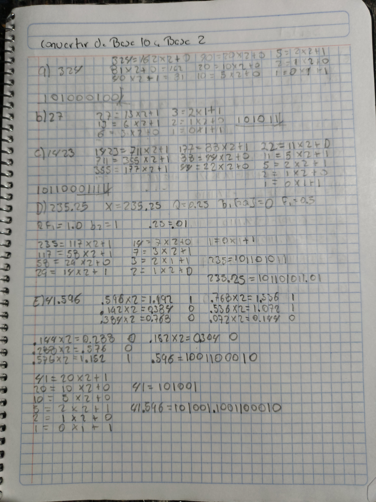{width=600}

```{r}
decimal_a_binario <- function(numero) {
  if (numero == 0) {
    return("0")
  }
  
  binario <- ""
  while (numero > 0) {
    residuo <- numero %% 2      
    binario <- paste0(residuo, binario)  
    numero <- numero %/% 2  
  }
  return(binario)
}

# Número a convertir
numero <- 246

# Conversión
resultado <- decimal_a_binario(numero)

# Mostrar resultado
cat("El número", numero, "en base 2 es:", resultado)
```

```{r}
dec_frac_a_binario <- function(decimal_completo, precision = 10) {
  
  if (!is.numeric(decimal_completo)) {
    return("Error: Ingrese un número válido.")
  }
  
  if (decimal_completo == 0) {
    return("0")
  }
  
  # 1. Separar parte entera y parte fraccionaria
  parte_entera <- floor(abs(decimal_completo))
  parte_fraccionaria <- abs(decimal_completo) - parte_entera
  
  # 2. Convertir la parte entera (similar a la función anterior)
  binario_entero <- ""
  if (parte_entera == 0) {
    binario_entero <- "0"
  } else {
    while (parte_entera > 0) {
      residuo <- parte_entera %% 2
      binario_entero <- paste0(residuo, binario_entero)
      parte_entera <- floor(parte_entera / 2)
    }
  }
  
  # 3. Convertir la parte fraccionaria
  binario_fraccionario <- ""
  # Multiplicamos por 2 hasta alcanzar la precisión deseada o que la fracción sea 0
  i <- 0
  while (parte_fraccionaria > 0 && i < precision) {
    parte_fraccionaria <- parte_fraccionaria * 2
    bit <- floor(parte_fraccionaria)
    binario_fraccionario <- paste0(binario_fraccionario, bit)
    parte_fraccionaria <- parte_fraccionaria - bit
    i <- i + 1
  }
  
  # 4. Combinar los resultados
  if (binario_fraccionario == "") {
    return(binario_entero)
  } else {
    return(paste0(binario_entero, ".", binario_fraccionario))
  }
}

numero_decimal_frac <- 345.68
resultado_binario_frac <- dec_frac_a_binario(numero_decimal_frac, precision = 15) 
print(paste("El número", numero_decimal_frac, "en binario es:", resultado_binario_frac))


```

```{r}
decimal_a_binario <- function(numero) {
  if (numero == 0) {
    return("0")
  }
  
  binario <- ""
  while (numero > 0) {
    residuo <- numero %% 2    
    binario <- paste0(residuo, binario)  
    numero <- numero %/% 2    
  }
  return(binario)
}

# Número a convertir
numero <- 79905523

# Conversión
resultado <- decimal_a_binario(numero)

# Mostrar resultado
cat("El número", numero, "en base 2 es:", resultado)
```

```{r}
dec_frac_a_binario <- function(decimal_completo, precision = 10) {
  # Validar que la entrada sea un número válido
  if (!is.numeric(decimal_completo)) {
    return("Error: Ingrese un número válido.")
  }
  
  if (decimal_completo == 0) {
    return("0")
  }
  
  # 1. Separar parte entera y parte fraccionaria
  parte_entera <- floor(abs(decimal_completo))
  parte_fraccionaria <- abs(decimal_completo) - parte_entera
  
  # 2. Convertir la parte entera (similar a la función anterior)
  binario_entero <- ""
  if (parte_entera == 0) {
    binario_entero <- "0"
  } else {
    while (parte_entera > 0) {
      residuo <- parte_entera %% 2
      binario_entero <- paste0(residuo, binario_entero)
      parte_entera <- floor(parte_entera / 2)
    }
  }
  
  # 3. Convertir la parte fraccionaria
  binario_fraccionario <- ""
  # Multiplicamos por 2 hasta alcanzar la precisión deseada o que la fracción sea 0
  i <- 0
  while (parte_fraccionaria > 0 && i < precision) {
    parte_fraccionaria <- parte_fraccionaria * 2
    bit <- floor(parte_fraccionaria)
    binario_fraccionario <- paste0(binario_fraccionario, bit)
    parte_fraccionaria <- parte_fraccionaria - bit
    i <- i + 1
  }
  
  # 4. Combinar los resultados
  if (binario_fraccionario == "") {
    return(binario_entero)
  } else {
    return(paste0(binario_entero, ".", binario_fraccionario))
  }
}

numero_decimal_frac <- 984365.27463
resultado_binario_frac <- dec_frac_a_binario(numero_decimal_frac, precision = 15) 
print(paste("El número", numero_decimal_frac, "en binario es:", resultado_binario_frac))


```

```{r}
dec_frac_a_binario <- function(decimal_completo, precision = 10) {
  # Validar que la entrada sea un número válido
  if (!is.numeric(decimal_completo)) {
    return("Error: Ingrese un número válido.")
  }
  
  if (decimal_completo == 0) {
    return("0")
  }
  
  # 1. Separar parte entera y parte fraccionaria
  parte_entera <- floor(abs(decimal_completo))
  parte_fraccionaria <- abs(decimal_completo) - parte_entera
  
  # 2. Convertir la parte entera (similar a la función anterior)
  binario_entero <- ""
  if (parte_entera == 0) {
    binario_entero <- "0"
  } else {
    while (parte_entera > 0) {
      residuo <- parte_entera %% 2
      binario_entero <- paste0(residuo, binario_entero)
      parte_entera <- floor(parte_entera / 2)
    }
  }
  
  # 3. Convertir la parte fraccionaria
  binario_fraccionario <- ""
  # Multiplicamos por 2 hasta alcanzar la precisión deseada o que la fracción sea 0
  i <- 0
  while (parte_fraccionaria > 0 && i < precision) {
    parte_fraccionaria <- parte_fraccionaria * 2
    bit <- floor(parte_fraccionaria)
    binario_fraccionario <- paste0(binario_fraccionario, bit)
    parte_fraccionaria <- parte_fraccionaria - bit
    i <- i + 1
  }
  
  # 4. Combinar los resultados
  if (binario_fraccionario == "") {
    return(binario_entero)
  } else {
    return(paste0(binario_entero, ".", binario_fraccionario))
  }
}

numero_decimal_frac <- 4586632.2846
resultado_binario_frac <- dec_frac_a_binario(numero_decimal_frac, precision = 15) 
print(paste("El número", numero_decimal_frac, "en binario es:", resultado_binario_frac))


```

## Tipos de error

**Tipos de error en los métodos numéricos**

En los métodos numéricos, los errores son inevitables debido a la naturaleza aproximada de los cálculos. Estos pueden clasificarse en los siguientes tipos:

1. Error verdadero:  
   Es la diferencia entre el valor verdadero y el valor aproximado.

2. Error absoluto:  
   Se define como el valor absoluto de la diferencia entre el valor verdadero y el valor aproximado.  
   \
   E_a = |x_{verdadero} - x_{aproximado}|
   \

3. Error relativo:  
   Es el cociente entre el error absoluto y el valor verdadero, y representa el error en proporción al tamaño del valor.  
   \
   E_r = \frac{E_a}{|x_{verdadero}|}
   \

4. Error de redondeo:  
   Surge al limitar el número de cifras significativas o decimales en los cálculos.

5. Error de truncamiento: 
   Ocurre cuando se detiene un proceso infinito, como una serie o un método iterativo, después de un número finito de pasos.

6. Error de propagación:  
   Es la acumulación de errores de redondeo y truncamiento a lo largo de varias operaciones consecutivas.
   
   
# Sistemas de Ecuaciones lineales


## Metodos Directos


### Gauss simple


#### Sistema: 1 

$$
A = \begin{bmatrix}
1 & -2 & 0.5 & = & -5 \\
-2 & 5 & -1.5 & = & 0 \\
-0.2 & 1.75& -1 & = & 10
\end{bmatrix}
$$
 

```{r}
# Matriz de coeficientes
A <- matrix(c(1, -2, .5,
              -2, 5, -1.5,
              -0.2, 1.75, -1), nrow = 3, byrow = TRUE)

#  Vector de términos independientes 
b <- matrix(c(-5, 0, 10), nrow = 3)

#  Matriz aumentada 
Ab <- cbind(A, b)
cat("Matriz aumentada inicial:\n")
print(Ab)


# ETAPA 1: Eliminación (columna 1)

m21 <- -Ab[2,1] / Ab[1,1]
m31 <- -Ab[3,1] / Ab[1,1]

Ab[2,] <- Ab[2,] + m21 * Ab[1,]
Ab[3,] <- Ab[3,] + m31 * Ab[1,]

cat("\nDespués de eliminar columna 1:\n")
print(Ab)


# ETAPA 2: Eliminación (columna 2)

m32 <- -Ab[3,2] / Ab[2,2]

Ab[3,] <- Ab[3,] + m32 * Ab[2,]

cat("\nDespués de eliminar columna 2:\n")
print(Ab)


# ETAPA 3: Sustitución hacia atrás


z <- Ab[3,4] / Ab[3,3]
y <- (Ab[2,4] - Ab[2,3] * z) / Ab[2,2]
x <- (Ab[1,4] - Ab[1,2] * y - Ab[1,3] * z) / Ab[1,1]

# --- Resultado ---
cat("\n--- Solución del sistema ---\n")
cat("x =", x, "\n")
cat("y =", y, "\n")
cat("z =", z, "\n")
```


#### Sistema: 2
$$
A = \begin{bmatrix}
3 & -1 & 0 & 6 & = & 2.3 \\
4 & 2 & -1 & -5& = & 6.9 \\
-5 & 1 & 3 & 0 & = & -36\\
0 & 10 & -4 & 7 & = & -36
\end{bmatrix}
$$

```{r}
#  Matriz de coeficientes 
valores <- c(3, -1, 0, 6,
             4, 2, -1, -5,
             -5, 1, 3, 0,
             0, 10, -4, 7)
A <- matrix(valores, nrow = 4, byrow = TRUE)
A

#  Vector de términos independientes 
valoresb <- c(2.3, 6.9, -36, -36)
b <- matrix(valoresb, nrow = 4)
b

#  Matriz aumentada
Ab <- cbind(A, b)
Ab


# ETAPA 1: Eliminación (columna 1)


m1 <- -Ab[2,1]/Ab[1,1]; m1
m2 <- -Ab[3,1]/Ab[1,1]; m2


A1 <- Ab[1,]
A2 <- m1*Ab[1,] + Ab[2,]
A3 <- m2*Ab[1,] + Ab[3,]
A4 <- Ab[4,]

NuevaA <- rbind(A1, A2, A3, A4)
NuevaA


# ETAPA 2: Eliminación (columna 2)


m4 <- -NuevaA[3,2]/NuevaA[2,2]; m4
m5 <- -NuevaA[4,2]/NuevaA[2,2]; m5

R1 <- NuevaA[1,]
R2 <- NuevaA[2,]
R3 <- m4*NuevaA[2,] + NuevaA[3,]
R4 <- m5*NuevaA[2,] + NuevaA[4,]

Nueva <- rbind(R1, R2, R3, R4)
Nueva


# ETAPA 3: Eliminación (columna 3)


m6 <-  -Nueva[4,3]/Nueva[3,3] 
print(m6)

R1 <- Nueva[1,]
R2 <- Nueva[2,]
R3 <- Nueva[3,]
R4 <- m6*Nueva[3,] + Nueva[4,]

Final <- rbind(R1, R2, R3, R4)
Final


# ETAPA 4: Sustitución hacia atrás


R1 <- Final[1,]
R2 <- Final[2,]
R3 <- Final[3,]
R4 <- Final[4,]

# Variables (x, y, z, w)
w <- R4[5] / R4[4]
z <- (R3[5] - R3[4]*w) / R3[3]
y <- (R2[5] - R2[3]*z - R2[4]*w) / R2[2]
x <- (R1[5] - R1[2]*y - R1[3]*z - R1[4]*w) / R1[1]

# Resultado 
cat("\n Solución del sistema \n")
cat("x =", x, "\n")
cat("y =", y, "\n")
cat("z =", z, "\n")
cat("w =", w, "\n")

```

#### Sistema: 3
$$
A = \begin{bmatrix}
0.003000 & 59.14 &  = & 59.17 \\
5.291 & -6.130 &  = &  46.78 
\end{bmatrix}
$$

```{r}
#  Matriz de coeficientes 
A <- matrix(c(0.003000, 59.14,
              5.291, -6.130), nrow = 2, byrow = TRUE)

#  Vector de términos independientes 
b <- matrix(c(59.17, 46.78), nrow = 2)

#  Matriz aumentada 
Ab <- cbind(A, b)
cat("Matriz aumentada inicial:\n")
print(Ab)

# ETAPA 1: Eliminación (columna 1)


m21 <- -Ab[2,1] / Ab[1,1]   
cat("\nMultiplicador m21 =", m21, "\n")

Ab[2,] <-  Ab[2,] + m21 * Ab[1,]

cat("\nDespués de eliminar columna 1:\n")
print(Ab)


# ETAPA 2: Sustitución hacia atrás


y <- Ab[2,3] / Ab[2,2]
x <- (Ab[1,3] - Ab[1,2]*y) / Ab[1,1]

#  Resultado 
cat("\n Solución del sistema \n")
cat("x =", x, "\n")
cat("y =", y, "\n")
```

#### Sistema: 4  
$$
A = \begin{bmatrix}
4 & 2 & 0 & = & 2 \\
2 & 3 & 1 & = & -1 \\
0 & 1 & 2.5 & = & 3
\end{bmatrix}
$$
 
```{r}


#  Matriz de coeficientes 
A <- matrix(c(4, 2, 0,
              2, 3, 1,
              0, 1, 2.5), nrow = 3, byrow = TRUE)

#  Vector de términos independientes 
b <- matrix(c(2, -1, 3), nrow = 3)

#  Matriz aumentada 
Ab <- cbind(A, b)
cat("Matriz aumentada inicial:\n")
print(Ab)


```

```{r}

# ETAPA 1: Eliminación (columna 1)

m21 <- -Ab[2,1] / Ab[1,1]; m21
m31 <- -Ab[3,1] / Ab[1,1]; m31

Ab[2,] <- Ab[2,] + m21 * Ab[1,]
Ab[3,] <- Ab[3,] + m31 * Ab[1,]

cat("\nDespués de eliminar columna 1:\n")
print(Ab)
```

```{r}

# ETAPA 2: Eliminación (columna 2)

m32 <- -Ab[3,2] / Ab[2,2]; m32

Ab[3,] <- Ab[3,] + m32 * Ab[2,]

cat("\nDespués de eliminar columna 2:\n")
print(Ab)

```

```{r}

# ETAPA 3: Sustitución hacia atrás

z <- Ab[3,4] / Ab[3,3]
y <- (Ab[2,4] - Ab[2,3] * z) / Ab[2,2]
x <- (Ab[1,4] - Ab[1,2] * y - Ab[1,3] * z) / Ab[1,1]

# Resultado 
cat("\n Solución del sistema \n")
cat("x =", x, "\n")
cat("y =", y, "\n")
cat("z =", z, "\n")
```

#### Sistema: 5

$$
A = \begin{bmatrix}
3 & -0.1 & -0.2 & = & 7.85 \\
0.1 & 7 & -0.3 &  = & -19.3 \\
0.3 & -2 & 10 &  = & 71.4
\end{bmatrix}
$$

 
```{r}


#  Matriz de coeficientes 
A <- matrix(c(3, -0.1, -0.2,
              0.1, 7, -0.3,
              0.3, -2, 10), nrow = 3, byrow = TRUE)

#  Vector de términos independientes 
b <- matrix(c(7.85, -19.3, 71.4), nrow = 3)

#  Matriz aumentada 
Ab <- cbind(A, b)
cat("Matriz aumentada inicial:\n")
print(Ab)

```

```{r}

# ETAPA 1: Eliminación (columna 1)

m21 <- -Ab[2,1] / Ab[1,1]; print (m21)
m31 <- -Ab[3,1] / Ab[1,1]; print (m31)

Ab[2,] <- Ab[2,] + m21 * Ab[1,]
Ab[3,] <- Ab[3,] + m31 * Ab[1,]

cat("\nDespués de eliminar columna 1:\n")
print(Ab)
```

```{r}
# ETAPA 2: Eliminación (columna 2)
m32 <- -Ab[3,2] / Ab[2,2]; print (m32)

Ab[3,] <- Ab[3,] + m32 * Ab[2,]

cat("\nDespués de eliminar columna 2:\n")
print(Ab)

```

```{r}
# ETAPA 3: Sustitución hacia atrás

z <- Ab[3,4] / Ab[3,3]
y <- (Ab[2,4] - Ab[2,3] * z) / Ab[2,2]
x <- (Ab[1,4] - Ab[1,2] * y - Ab[1,3] * z) / Ab[1,1]

# --- Resultado ---
cat("\n--- Solución del sistema ---\n")
cat("x =", x, "\n")
cat("y =", y, "\n")
cat("z =", z, "\n")
```

#### Sistema:6
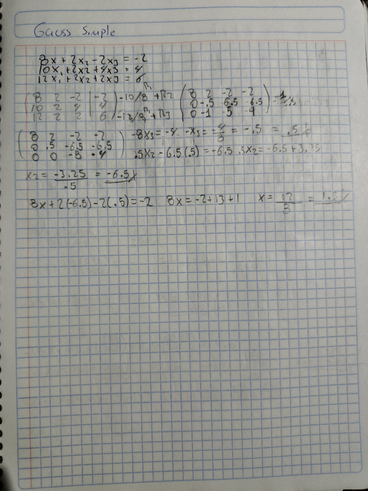{width=600}

#### Sistema:7
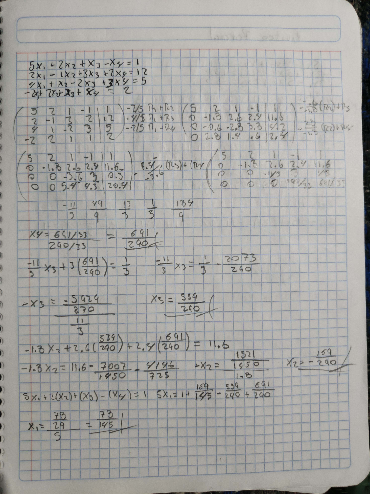{width=600}

#### Sistema:8
$$
A = \begin{bmatrix}
2 & 3 & 2 & 4 & = & 4 \\
4 & 10 & -4 & 0 & = & -8 \\
-3 & -2 & -5 & -2 & = & -4\\
-2 & 4 & 4 & -7 & = & -1
\end{bmatrix}
$$

```{r}
#  Matriz de coeficientes 
valores <- c(2, 3, 2, 4,
             4, 10, -4, 0,
             -3, -2, -5, -2,
             -2, 4, 4, -7)
A <- matrix(valores, nrow = 4, byrow = TRUE)
A

#  Vector de términos independientes 
valoresb <- c(4, -8, -4, -1)
b <- matrix(valoresb, nrow = 4)
b

#  Matriz aumentada 
Ab <- cbind(A, b)
Ab

```

```{r}
# ETAPA 1: Eliminación (columna 1)

m1 <- -Ab[2,1]/Ab[1,1] 
m2 <- -Ab[3,1]/Ab[1,1] 
m3 <- -Ab[4,1]/Ab[1,1] 
print(m1)
print(m2)       
print(m3)        
A1 <- Ab[1,]
A2 <- m1*Ab[1,] + Ab[2,]
A3 <- m2*Ab[1,] + Ab[3,]
A4 <- m3*Ab[1,] + Ab[4,]

NuevaA <- rbind(A1, A2, A3, A4)
NuevaA
```

```{r}
# ETAPA 2: Eliminación (columna 2)

m4 <- -NuevaA[3,2]/NuevaA[2,2]; m4
m5 <- -NuevaA[4,2]/NuevaA[2,2]; m5

R1 <- NuevaA[1,]
R2 <- NuevaA[2,]
R3 <- m4*NuevaA[2,] + NuevaA[3,]
R4 <- m5*NuevaA[2,] + NuevaA[4,]

Nueva <- rbind(R1, R2, R3, R4)
Nueva
```

```{r}
# ETAPA 3: Eliminación (columna 3)

m6 <-  -Nueva[4,3]/Nueva[3,3] 
print(m6)

R1 <- Nueva[1,]
R2 <- Nueva[2,]
R3 <- Nueva[3,]
R4 <- m6*Nueva[3,] + Nueva[4,]

Final <- rbind(R1, R2, R3, R4)
Final
```

```{r}
# ETAPA 4: Sustitución hacia atrás

R1 <- Final[1,]
R2 <- Final[2,]
R3 <- Final[3,]
R4 <- Final[4,]

# Variables (x, y, z, w)
w <- R4[5] / R4[4]
z <- (R3[5] - R3[4]*w) / R3[3]
y <- (R2[5] - R2[3]*z - R2[4]*w) / R2[2]
x <- (R1[5] - R1[2]*y - R1[3]*z - R1[4]*w) / R1[1]

#  Resultado 
cat("\n Solución del sistema \n")
cat("x =", x, "\n")
cat("y =", y, "\n")
cat("z =", z, "\n")
cat("w =", w, "\n")
```

#### Sistema: 9
$$
A = \begin{bmatrix}
1.133 & 5.281 & -2.454 &  = & 6.414 \\
24.14 & -1.21 & 5.281 &  = & 113.8 \\
-10.123 & 6.387 & -1 &  = & 1
\end{bmatrix}
$$
 
```{r}


#  Matriz de coeficientes 
A <- matrix(c(1.133, 5.281, -2.454,
              24.14, -1.21, 5.281,
              -10.123, 6.387, -1), nrow = 3, byrow = TRUE)

#  Vector de términos independientes 
b <- matrix(c(6.414, 113.8, 1), nrow = 3)

#  Matriz aumentada 
Ab <- cbind(A, b)
cat("Matriz aumentada inicial:\n")
print(Ab)

```

```{r}
# ETAPA 1: Eliminación (columna 1)
m21 <- -Ab[2,1] / Ab[1,1]; print(m21) 
m31 <- -Ab[3,1] / Ab[1,1]; print(m31)

Ab[2,] <- Ab[2,] + m21 * Ab[1,]
Ab[3,] <- Ab[3,] + m31 * Ab[1,]

cat("\nDespués de eliminar columna 1:\n")
print(Ab)
```

```{r}
# ETAPA 2: Eliminación (columna 2)
m32 <- -Ab[3,2] / Ab[2,2]

Ab[3,] <- Ab[3,] + m32 * Ab[2,]

cat("\nDespués de eliminar columna 2:\n")
print(round(Ab))

```

```{r}
# ETAPA 3: Sustitución hacia atrás

z <- Ab[3,4] / Ab[3,3]
y <- (Ab[2,4] - Ab[2,3] * z) / Ab[2,2]
x <- (Ab[1,4] - Ab[1,2] * y - Ab[1,3] * z) / Ab[1,1]

# --- Resultado ---
cat("\n Solución del sistema \n")
cat("x =", x, "\n")
cat("y =", y, "\n")
cat("z =", z, "\n")
```

#### Sistema: 10
$$
A = \begin{bmatrix}
2 & 3 & 2 & 4 & = & 9 \\
4 & 01 & -4 & 0& = & -15 \\
-3 & -2 & -5 & -2 & = & 6\\
-2 & 4 & 4 & -7 & = & 2
\end{bmatrix}
$$

```{r}
#  Matriz de coeficientes 
valores <- c(2, 3, 2, 4,
             4, 10, -4, 0,
             -3, -2, -5, -2,
             -2, 4, 4, -7)
A <- matrix(valores, nrow = 4, byrow = TRUE)
A

#  Vector de términos independientes 
valoresb <- c(9, -15, -6, 2)
b <- matrix(valoresb, nrow = 4)
b

#  Matriz aumentada 
Ab <- cbind(A, b)
Ab

```

```{r}
# ETAPA 1: Eliminación (columna 1)

m1 <- -Ab[2,1]/Ab[1,1] 
m2 <- -Ab[3,1]/Ab[1,1] 
m3 <- -Ab[4,1]/Ab[1,1] 
print(m1)
print(m2)       
print(m3)        
A1 <- Ab[1,]
A2 <- m1*Ab[1,] + Ab[2,]
A3 <- m2*Ab[1,] + Ab[3,]
A4 <- m3*Ab[1,] + Ab[4,]

NuevaA <- rbind(A1, A2, A3, A4)
NuevaA
```

```{r}
# ETAPA 2: Eliminación (columna 2)

m4 <- -NuevaA[3,2]/NuevaA[2,2]; m4
m5 <- -NuevaA[4,2]/NuevaA[2,2]; m5

R1 <- NuevaA[1,]
R2 <- NuevaA[2,]
R3 <- m4*NuevaA[2,] + NuevaA[3,]
R4 <- m5*NuevaA[2,] + NuevaA[4,]

Nueva <- rbind(R1, R2, R3, R4)
Nueva
```

```{r}
# ETAPA 3: Eliminación (columna 3)

m6 <-  -Nueva[4,3]/Nueva[3,3] 
print(m6)

R1 <- Nueva[1,]
R2 <- Nueva[2,]
R3 <- Nueva[3,]
R4 <- m6*Nueva[3,] + Nueva[4,]

Final <- rbind(R1, R2, R3, R4)
Final
```

```{r}
# ETAPA 4: Sustitución hacia atrás

R1 <- Final[1,]
R2 <- Final[2,]
R3 <- Final[3,]
R4 <- Final[4,]

# Variables (x, y, z, w)
w <- R4[5] / R4[4]
z <- (R3[5] - R3[4]*w) / R3[3]
y <- (R2[5] - R2[3]*z - R2[4]*w) / R2[2]
x <- (R1[5] - R1[2]*y - R1[3]*z - R1[4]*w) / R1[1]

# Resultado
cat("\n--- Solución del sistema ---\n")
cat("x =", x, "\n")
cat("y =", y, "\n")
cat("z =", z, "\n")
cat("w =", w, "\n")
```

### Gauss con pivoteo parcial

#### Sistema: 1
$$
A = \begin{bmatrix}
0.4 & -1.5 & 0.75 & = & -20 \\
-0.5 & -15 & 10 & = & -10 \\
-10 & -9 & 2.5 & = & 30
\end{bmatrix}
$$
 
```{r}


#  Matriz de coeficientes 
A <- matrix(c(0.4, -1.5, 0.75,
              -0.5, -15, 10,
              -10, -9, 2.5), nrow = 3, byrow = TRUE)

#  Vector de términos independientes 
b <- matrix(c(-20, -10, 30), nrow = 3)

#  Matriz aumentada 
Ab <- cbind(A, b)
cat("Matriz aumentada inicial:\n")
print(Ab)
```

```{r}

#  Reordenamiento de filas 
r1 <- Ab[3,]  
r2 <- Ab[2,]
r3 <- Ab[1,]

nM <- rbind(r1, r2, r3)
nM


```

```{r}
# ETAPA 1: Eliminación (columna 1)
m1 <- -nM[2,1]/nM[1,1]; m1
m2 <- -nM[3,1]/nM[1,1]; m2

A1 <- nM[1,]
A2 <- m1*nM[1,]+nM[2,]
A3 <- m2*nM[1,]+nM[3,]

NuevaA <- rbind(A1, A2, A3)
NuevaA
```

```{r}
# ETAPA 2: Eliminación (columna 2)
m3 <- -NuevaA[3,2]/NuevaA[2,2]; m3


R1 <- NuevaA[1,]
R2 <- NuevaA[2,]
R3 <- m3*NuevaA[2,]+NuevaA[3,]

Nueva <- rbind(R1, R2, R3)
Nueva

```

```{r}
# ETAPA 3: Sustitución hacia atrás

z <- Nueva[3,4] / Nueva[3,3]
y <- (Nueva[2,4] - Nueva[2,3] * z) / Nueva[2,2]
x <- (Nueva[1,4] - Nueva[1,2] * y - Nueva[1,3] * z) / Nueva[1,1]

#  Resultado 
cat("\n Solución del sistema \n")
cat("x =", x, "\n")
cat("y =", y, "\n")
cat("z =", z, "\n")
```

#### Sistema:2
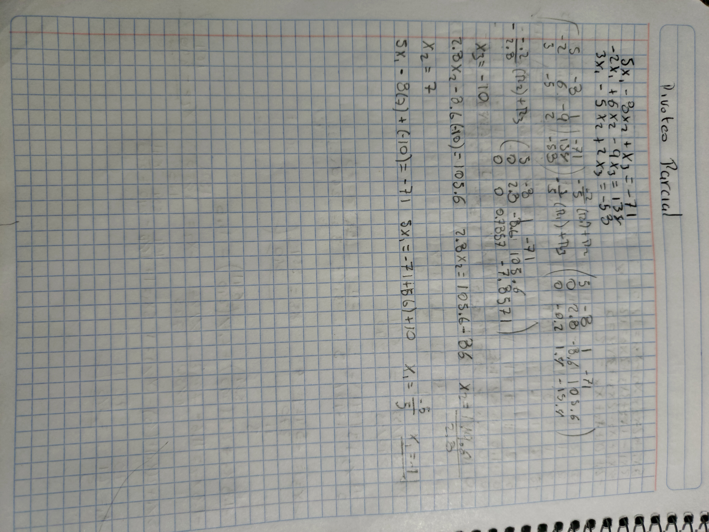{width=600}

#### Sistema: 3
$$
A = \begin{bmatrix}
0.003000 & 59.14 & = & 59.17 \\
5.291 & -6.130 & = & 46.78
\end{bmatrix}
$$

```{r}
#  Matriz de coeficientes 
A <- matrix(c(0.003000, 59.14,
              5.291, -6.130), nrow = 2, byrow = TRUE)

#  Vector de términos independientes 
b <- matrix(c(59.17, 46.78), nrow = 2)

#  Matriz aumentada 
Ab <- cbind(A, b)
cat("Matriz aumentada inicial:\n")
print(Ab)
```

```{r}


r1 <- Ab[2,]   
r2 <- Ab[1,]

nM <- rbind(r1, r2)
nM


```

```{r}
# ETAPA 1: Eliminación (columna 1)
m1 <- -nM[2,1]/nM[1,1]; m1

A1 <- nM[1,]
A2 <- m1*nM[1,]+nM[2,]

NuevaA <- rbind(A1, A2)
NuevaA
```

```{r}
# ETAPA 2: Sustitución hacia atrás

y <- NuevaA[2,3] / NuevaA[2,2]
x <- (NuevaA[1,3] - NuevaA[1,2]*y) / NuevaA[1,1]

#  Resultado 
cat("\n Solución del sistema \n")
cat("x =", x, "\n")
cat("y =", y, "\n")
```

#### Sistema:4

{width=600}

#### Sistema : 5

$$
A = \begin{bmatrix}
0.00031000 & 1.000000 & = & 3.0000 \\
1.00045534 & -1.00034333 & = & 7.000 
\end{bmatrix}
$$

```{r}


#  Matriz de coeficientes 
A <- matrix(c(0.00031000, 1.000000,
              1.00045534, -1.00034333), nrow = 2, byrow = TRUE)

# Vector de términos independientes 
b <- matrix(c(3.0000, 7.000), nrow = 2)

#  Matriz aumentada
Ab <- cbind(A, b)
cat("Matriz aumentada inicial:\n")
print(Ab)


```

```{r}


r1 <- Ab[2,]   
r2 <- Ab[1,]

nM <- rbind(r1,r2)
nM


```

```{r}
# ETAPA 1: Eliminación (columna 1)
m1 <- (-nM[2,1]/nM[1,1]); print(m1)

A1 <- (nM[1,])
A2 <- (m1*nM[1,]+nM[2,])

NuevaA <- rbind(A1, A2)
print(NuevaA,)
```

```{r}
# ETAPA 2: Sustitución hacia atrás

y <- NuevaA[2,3] / NuevaA[2,2]
x <- (NuevaA[1,3] - NuevaA[1,2]*y) / NuevaA[1,1]

#  Resultado 
cat("\n Solución del sistema \n")
cat("x =", (x), "\n")
cat("y =", (y), "\n")
```

#### Sistema: 6
$$
A = \begin{bmatrix}
14 & 14 & -9 & 3 & -5 & = & -15 \\
14 & 52 & -15 & 2 & -32 & = & -100 \\
-9 & -15 & 36 & -5 & 16 & = & 106\\
3 & 2 & -5 & 47 & 49 & = & 329\\
-5 & 32 & 16 & 49 & 79 & = & 463
\end{bmatrix}
$$
 
```{r}
# Matriz de coeficientes (A) 
valores <- c(14,14,-9,3,-5,
             14,52,-15,2,-32,
             -9,-15,36, -5,16,
             3,2,-5,47,49,
             -5, 32 ,16,49,79)
A <- matrix(valores, nrow = 5)
A

#  Vector de términos independientes (b) 
valoresb <- c(-15,-100,106,329,463)
b <- matrix(valoresb, nrow = 5)
b

#  Matriz aumentada 
Ab <- cbind(A, b)
Ab

``` 

```{r}
# ETAPA 1: Eliminación hacia adelante (columna 1)

m1 <- -Ab[2,1]/Ab[1,1]; print(m1)
m2 <- -Ab[3,1]/Ab[1,1]; print(m2)
m3 <- -Ab[4,1]/Ab[1,1]; print(m3)
m4 <- -Ab[5,1]/Ab[1,1]; print(m4)

A1 <- Ab[1,]
A2 <- (m1*Ab[1,]+Ab[2,])
A3 <- (m2*Ab[1,]+Ab[3,])
A4 <- (m3*Ab[1,]+Ab[4,])
A5 <- (m4*Ab[1,]+Ab[5,])

NuevaA <- rbind(A1, A2, A3, A4, A5)
print(round(NuevaA,4))
``` 

```{r}
# ETAPA 2: Eliminación segunda columna

m5 <- -NuevaA[3,2]/NuevaA[2,2]; print(m5)
m6 <- -NuevaA[4,2]/NuevaA[2,2]; print(m6)
m7 <- -NuevaA[5,2]/NuevaA[2,2]; print(m7)

R1 <- (NuevaA[1,])
R2 <- (NuevaA[2,])
R3 <- (m5*NuevaA[2,]+NuevaA[3,])
R4 <- (m6*NuevaA[2,]+NuevaA[4,])
R5 <- (m7*NuevaA[2,]+NuevaA[5,])

Nueva <- rbind(R1, R2, R3, R4, R5)
print(Nueva)
```


```{r}
# ETAPA 3: Eliminación tercera columna

# reorganizamos si es necesario
r1 <- Nueva[1,]
r2 <- Nueva[2,]
r3 <- Nueva[3,]
r4 <- Nueva[5,]
r5 <- Nueva[4,]
nm <- rbind(r1, r2, r3, r4,r5)
nm

m8 <- -nm[4,3]/nm[3,3]; print(m8)
m9 <- -nm[5,3]/nm[3,3]; print(m9)

R1 <- nm[1,]
R2 <- nm[2,]
R3 <- nm[3,]
R4 <- m8*nm[3,] + nm[4,]
R5 <- m9*nm[3,] + nm[5,]

Nm <- rbind(R1, R2, R3, R4, R5)
print(Nm)

```

```{r}
# ETAPA 4: Eliminación cuarta columna

m10 <- -Nm[5,4]/Nm[4,4]; print(m10)

R1 <- Nm[1,]
R2 <- Nm[2,]
R3 <- Nm[3,]
R4 <- Nm[4,] 
R5 <- m10*Nm[4,] + Nm[5,]

final <- rbind(R1, R2, R3, R4, R5)
print(final)

```

```{r}

# ETAPA 5: Sustitución hacia atrás

R1 <- final[1,]
R2 <- final[2,]
R3 <- final[3,]
R4 <- final[4,]
R5 <- final[5,]

# cálculo de variables
x5 <- final[5,6]/final[5,5]
x4 <- (final[4,6] - final[4,5]*x5)/final[4,4]
x3 <- (final[3,6] - final[3,4]*x4 - final[3,5]*x5)/final[3,3]
x2 <- (final[2,6] - final[2,3]*x3 - final[2,4]*x4 - final[2,5]*x5)/final[2,2]
x1 <- (final[1,6] - final[1,2]*x2 - final[1,3]*x3 - final[1,4]*x4 - final[1,5]*x5)/final[1,1]

# Mostrar resultado final
cat("\n Solución del sistema \n")
cat("x1 =", x1, "\n")
cat("x2 =", x2, "\n")
cat("x3 =", x3, "\n")
cat("x4 =", x4, "\n")
cat("x5 =", x5, "\n")
```

#### Sistema: 7
$$
A = \begin{bmatrix}
1/4 & 1/5 & 1/6 &  = & 9 \\
1/3 & 1/4 & 1/5 &  = & 8 \\
1/2 & 1 & 2 &  = & 8
\end{bmatrix}
$$
 
```{r}


#  Matriz de coeficientes 
A <- matrix(c(1/4, 1/5, 1/6,
              1/3, 1/4, 1/5,
              1/2, 1, 2), nrow = 3, byrow = TRUE)

#  Vector de términos independientes 
b <- matrix(c(9, 8, 8), nrow = 3)

#  Matriz aumentada 
Ab <- cbind(A, b)
cat("Matriz aumentada inicial:\n")
print(Ab)

```

```{r}


r1 <- (Ab[3,])  
r2 <- (Ab[2,])
r3 <- (Ab[1,])

nM <- rbind(r1, r2, r3)
print(nM)


```

```{r}
# ETAPA 1: Eliminación (columna 1)
m1 <- -nM[2,1]/nM[1,1]; print(m1)
m2 <- -nM[3,1]/nM[1,1]; print(m2)

A1 <- nM[1,]
A2 <- m1*nM[1,]+nM[2,]
A3 <- m2*nM[1,]+nM[3,]

NuevaA <- rbind(A1, A2, A3)
print(NuevaA)
```

```{r}
# ETAPA 2: Eliminación (columna 2)

m3 <- -NuevaA[3,2]/NuevaA[2,2]; print(m3)


R1 <- NuevaA[1,]
R2 <- NuevaA[2,]
R3 <- m3*NuevaA[2,]+NuevaA[3,]

Nueva <- rbind(R1, R2, R3)
print(Nueva)

```

```{r}
# ETAPA 3: Sustitución hacia atrás


z <- Nueva[3,4] / Nueva[3,3]
y <- (Nueva[2,4] - Nueva[2,3] * z) / Nueva[2,2]
x <- (Nueva[1,4] - Nueva[1,2] * y - Nueva[1,3] * z) / Nueva[1,1]

#  Resultado 
cat("\n Solución del sistema \n")
cat("x =", x, "\n")
cat("y =", y, "\n")
cat("z =", z, "\n")
```

#### Sistema: 8
$$
A = \begin{bmatrix}
1 & 1/2 & 1/3 & 1/4 & = & 1/6 \\
1/2 & 1/3 & 1/4 & 1/5 & = & 1/7 \\
1/3 & 1/4 & 1/5 & 1/6 & = & 1/8\\
1/4 & 1/5 & 1/6 & 1/7 & = & 1/9
\end{bmatrix}
$$

```{r}
#  Matriz A 
A <- matrix(c(1,   1/2, 1/3, 1/4,
              1/2, 1/3, 1/4, 1/5,
              1/3, 1/4, 1/5, 1/6,
              1/4, 1/5, 1/6, 1/7), nrow = 4, byrow = TRUE)

#  Vector b 
b <- matrix(c(1/6, 1/7, 1/8, 1/9), nrow = 4)

#  Matriz aumentada 
Ab <- cbind(A, b)
Ab

```

```{r}
# 1 Eliminación primera columna
m1 <- -Ab[2,1]/Ab[1,1]; print(m1)
m2 <- -Ab[3,1]/Ab[1,1]; print(m2)
m3 <- -Ab[4,1]/Ab[1,1]; print(m3)

A1 <- Ab[1,]
A2 <- m1*Ab[1,]+Ab[2,]
A3 <- m2*Ab[1,]+Ab[3,]
A4 <- m3*Ab[1,]+Ab[4,]
NuevaA <- rbind(A1,A2,A3,A4)
print(NuevaA)
```

```{r}
# 2 Eliminación segunda columna
m4 <- -NuevaA[3,2]/NuevaA[2,2]; print(m4)
m5 <- -NuevaA[4,2]/NuevaA[2,2]; print(m5)
R1 <- NuevaA[1,] 
R2 <- NuevaA[2,]
R3 <- m4*NuevaA[2,]+NuevaA[3,]
R4 <- m5*NuevaA[2,]+NuevaA[4,]
Nueva <- rbind(R1,R2,R3,R4)
print(Nueva)
```

```{r}
# 3 Eliminación tercera columna
m6 <- -Nueva[4,3]/Nueva[3,3]; print(m6)
R1 <- Nueva[1,] 
R2 <- Nueva[2,]
R3 <- Nueva[3,]
R4 <- m6*Nueva[3,]+Nueva[4,]
Final <- rbind(R1,R2,R3,R4)
print(Final)
```

```{r}
# 4 Sustitución hacia atrás

x4 <- Final[4,5] / Final[4,4]
x3 <- (Final[3,5] - Final[3,4]*x4) / Final[3,3]
x2 <- (Final[2,5] - Final[2,3]*x3 - Final[2,4]*x4) / Final[2,2]
x1 <- (Final[1,5] - Final[1,2]*x2 - Final[1,3]*x3 - Final[1,4]*x4) / Final[1,1]

# Resultado final

cat("\n Solución del sistema \n")
cat("x1 =", (x1), "\n")
cat("x2 =", (x2), "\n")
cat("x3 =", (x3), "\n")
cat("x4 =", (x4), "\n")


```

#### Sistema: 9
$$
A = \begin{bmatrix}
2 & 1 & -1 & 1 & -3 & = &  7 \\
1 & 0 & 2 & -1 & 1 & = & 2 \\
0 & -2 & -1 & 1 & -1 & =  & -5\\
3 & 1 & -4 & 0 & 5 & = & 6\\
1 & -1 & -1 & -1 & 1 & = & 3
\end{bmatrix}
$$
 
```{r}
#  Matriz de coeficientes (A) 
valores <- c(2,1,-1,1,-3,
             1,0,2,-1,1,
             0,-2,-1,1,-1,
             3,1,-4,0,5,
             1,-1,-1,-1,1)
A <- matrix(valores, nrow = 5)
A

#  Vector de términos independientes (b) 
valoresb <- c(7,2,-5,6,3)
b <- matrix(valoresb, nrow = 5)
b

#  Matriz aumentada 
Ab <- cbind(A, b)
Ab

``` 

```{r}
# ETAPA 1: Eliminación hacia adelante (columna 1)
r1 <- Ab[5, ]
r2 <- Ab[2, ]
r3 <- Ab[3, ]
r4 <- Ab[4, ]
r5 <- Ab[1, ]
nma <- rbind(r1, r2, r3, r4,r5)
nma

m1 <- -nma[2,1]/nma[1,1]; print(m1,)
m2 <- -nma[3,1]/nma[1,1]; print(m2)
m3 <- -nma[4,1]/nma[1,1]; print(m3)
m4 <- -nma[5,1]/nma[1,1]; print(m4)

A1 <- Ab[1,]
A2 <- m1*nma[1,]+nma[2,]
A3 <- m2*nma[1,]+nma[3,]
A4 <- m3*nma[1,]+nma[4,]
A5 <- m4*nma[1,]+nma[5,]

NuevaA <- rbind(A1, A2, A3, A4, A5)
print(NuevaA)
``` 

```{r}
# ETAPA 2: Eliminación segunda columna

r1 <- NuevaA[1, ]
r2 <- NuevaA[3, ]
r3 <- NuevaA[2, ]
r4 <- NuevaA[4, ]
r5 <- NuevaA[5, ]
nmab <- rbind(r1, r2, r3, r4,r5)
nmab

m5 <- -nmab[3,2]/nmab[2,2]; print(m5)
m6 <- -nmab[4,2]/nmab[2,2]; print(m6)
m7 <- -nmab[5,2]/nmab[2,2]; print(m7)

R1 <- nmab[1,]
R2 <- nmab[2,]
R3 <- m5*nmab[2,]+nmab[3,]
R4 <- m6*nmab[2,]+nmab[4,]
R5 <- m7*nmab[2,]+nmab[5,]

Nueva <- rbind(R1, R2, R3, R4, R5)
print(Nueva)
```


```{r}
# ETAPA 3: Eliminación tercera columna

m8 <- -Nueva[4,3]/Nueva[3,3]; print(m8)


R2 <- Nueva[2,]
R1 <- Nueva[1,]
R3 <- Nueva[3,]
R4 <- m8*Nueva[3,] + Nueva[4,]
R5 <- Nueva[5,]

Nm <- rbind(R1, R2, R3, R4, R5)
print(Nm)

```

```{r}
# ETAPA 4: Eliminación cuarta columna

m10 <- -Nm[5,4]/Nm[4,4]; print(m10)

R1 <- Nm[1,]
R2 <- Nm[2,]
R3 <- Nm[3,]
R4 <- Nm[4,] 
R5 <- m10*Nm[4,] + Nm[5,]

final <- rbind(R1, R2, R3, R4, R5)
print(final)

```

```{r}

# ETAPA 5: Sustitución hacia atrás

R1 <- final[1,]
R2 <- final[2,]
R3 <- final[3,]
R4 <- final[4,]
R5 <- final[5,]

# cálculo de variables
x5 <- final[5,6]/final[5,5]
x4 <- (final[4,6] - final[4,5]*x5)/final[4,4]
x3 <- (final[3,6] - final[3,4]*x4 - final[3,5]*x5)/final[3,3]
x2 <- (final[2,6] - final[2,3]*x3 - final[2,4]*x4 - final[2,5]*x5)/final[2,2]
x1 <- (final[1,6] - final[1,2]*x2 - final[1,3]*x3 - final[1,4]*x4 - final[1,5]*x5)/final[1,1]

# Mostrar resultado final
cat("\n Solución del sistema \n")
cat("x1 =", (x1), "\n")
cat("x2 =", (x2), "\n")
cat("x3 =", (x3), "\n")
cat("x4 =", (x4), "\n")
cat("x5 =", (x5), "\n")
```

#### Sistema: 10
$$
A = \begin{bmatrix}
3.333 & 15920 & -10.333 & = & 15913 \\
2.222 & 16.71 & 9.612 & = & 28.544 \\
1.5611 & 5.1791 & 1.6852 & = & 8.4254
\end{bmatrix}
$$
 
```{r}


#  Matriz de coeficientes 
A <- matrix(c(3.333, 15920, -10.333,
              2.222, 16.71, 9.612,
              1.5611, 5.1791, 1.6852), nrow = 3, byrow = TRUE)

#  Vector de términos independientes 
b <- matrix(c(15913, 28.544, 8.4254), nrow = 3)

#  Matriz aumentada 
Ab <- cbind(A, b)
cat("Matriz aumentada inicial:\n")
print(Ab)

```

```{r}

# ETAPA 1: Eliminación (columna 1)

m1 <- -Ab[2,1]/Ab[1,1]; print(m1)
m2 <- -Ab[3,1]/Ab[1,1]; print(m2)

A1 <- Ab[1,]
A2 <- m1*Ab[1,]+Ab[2,]
A3 <- m2*Ab[1,]+Ab[3,]

NuevaA <- rbind(A1, A2, A3)
print(NuevaA)
```

```{r}

# ETAPA 2: Eliminación (columna 2)

m3 <- -NuevaA[3,2]/NuevaA[2,2]; print(m2)


R1 <- NuevaA[1,]
R2 <- NuevaA[2,]
R3 <- m3*NuevaA[2,]+NuevaA[3,]

Nueva <- rbind(R1, R2, R3)
print(Nueva)

```

```{r}
# ETAPA 3: Sustitución hacia atrás


z <- Nueva[3,4] / Nueva[3,3]
y <- (Nueva[2,4] - Nueva[2,3] * z) / Nueva[2,2]
x <- (Nueva[1,4] - Nueva[1,2] * y - Nueva[1,3] * z) / Nueva[1,1]

# --- Resultado ---
cat("\n Solución del sistema \n")
cat("x =", (x), "\n")
cat("y =", (y), "\n")
cat("z =", (z), "\n")
```

### Gauss jordan

#### sistema: 1
$$
A = \begin{bmatrix}
1 & 2 & 3 &  = & 1 \\
-0.4 & 2 & -1 &  = & 10\\
0.5 & -3 & 1 &  = & 15
\end{bmatrix}
$$

```{r}
#  Matriz de coeficientes (A) 
valores <- c( 1,2,3,
 -0.4,2,-1,
 0.5, -3,1)
A <- matrix(valores, nrow = 3, byrow = TRUE)
A

#  Vector de términos independientes (b) 
valoresb <- c(1,10,15)
b <- matrix(valoresb, nrow = 3)
b

#  Matriz aumentada 
Ab <- cbind(A, b)
cat("Matriz aumentada inicial:\n")
print(Ab)

# ETAPA 1: Eliminación hacia adelante (columna 1)

m1 <- -Ab[2,1]/Ab[1,1]; m1
m2 <- -Ab[3,1]/Ab[1,1]; m2

A1 <- Ab[1,]
A2 <- m1*Ab[1,]+Ab[2,]
A3 <- m2*Ab[1,]+Ab[3,]

NuevaA <- rbind(A1, A2, A3)
cat("\nETAPA 1 - Eliminando columna 1:\n")
print(NuevaA)

# ETAPA 2: Eliminación hacia adelante (columna 2)

m3 <- -NuevaA[3,2]/NuevaA[2,2]; m3

R1 <- NuevaA[1,]
R2 <- NuevaA[2,]
R3 <- m3*NuevaA[2,]+NuevaA[3,]

Nueva <- rbind(R1, R2, R3)
cat("\nETAPA 2 - Eliminando columna 2:\n")
print(Nueva)

# ETAPA 3: Normalización de pivotes (diagonal = 1)

cat("\nNormalizando pivotes a 1:\n")
for (i in 1:3) {
  Nueva[i,] <- Nueva[i,] / Nueva[i,i]
}
print(Nueva)


# ETAPA 4: Eliminación hacia arriba


cat("\nEliminando hacia arriba:\n")
# eliminar columna 3 hacia arriba
m4 <- Nueva[2,3]; m4
m5 <- Nueva[1,3]; m5
Nueva[2,] <- Nueva[2,] - m4 * Nueva[3,]
Nueva[1,] <- Nueva[1,] - m5 * Nueva[3,]
print(Nueva)

# eliminar columna 2 hacia arriba
m6 <- Nueva[1,2]; m6
Nueva[1,] <- Nueva[1,] - m6 * Nueva[2,]
Final <- Nueva

cat("\nMatriz reducida final (identidad):\n")
print(Final)


# RESULTADOS


x3 <- Final[3,4]
x2 <- Final[2,4]
x1 <- Final[1,4]

cat("\nSoluciones del sistema:\n")
cat("x1 =", x1, "\n")
cat("x2 =", x2, "\n")
cat("x3 =", x3, "\n")

```

#### Sistema: 2
$$
A = \begin{bmatrix}
2 & 0.9 & 3 & = & -3.61 \\
-0.5 & 0.1 & -1 &  = & 2.035 \\
1 & -6035 & 0.45 &  = & 15.401
\end{bmatrix}
$$
 
 
```{r}
#  Matriz de coeficientes (A) 
valores <- c(2,0.9,3,
 -0.5,0.1,-1,
 1, -6.35,-0.45)
A <- matrix(valores, nrow = 3, byrow = TRUE)
A

#  Vector de términos independientes (b) 
valoresb <- c(-3.61,2.035,15.401)
b <- matrix(valoresb, nrow = 3)
b

#  Matriz aumentada 
Ab <- cbind(A, b)
cat("Matriz aumentada inicial:\n")
print(Ab)

# ETAPA 1: Eliminación hacia adelante (columna 1)

m1 <- -Ab[2,1]/Ab[1,1]; m1
m2 <- -Ab[3,1]/Ab[1,1]; m2

A1 <- Ab[1,]
A2 <- m1*Ab[1,]+Ab[2,]
A3 <- m2*Ab[1,]+Ab[3,]

NuevaA <- rbind(A1, A2, A3)
cat("\nETAPA 1 - Eliminando columna 1:\n")
print(NuevaA)

# ETAPA 2: Eliminación hacia adelante (columna 2)

m3 <- -NuevaA[3,2]/NuevaA[2,2]; m3

R1 <- NuevaA[1,]
R2 <- NuevaA[2,]
R3 <- m3*NuevaA[2,]+NuevaA[3,]

Nueva <- rbind(R1, R2, R3)
cat("\nETAPA 2 - Eliminando columna 2:\n")
print(Nueva)

# ETAPA 3: Normalización de pivotes (diagonal = 1)

cat("\nNormalizando pivotes a 1:\n")
for (i in 1:3) {
  Nueva[i,] <- Nueva[i,] / Nueva[i,i]
}
print(Nueva)


# ETAPA 4: Eliminación hacia arriba


cat("\nEliminando hacia arriba:\n")
# eliminar columna 3 hacia arriba
m4 <- Nueva[2,3]; m4
m5 <- Nueva[1,3]; m5
Nueva[2,] <- Nueva[2,] - m4 * Nueva[3,]
Nueva[1,] <- Nueva[1,] - m5 * Nueva[3,]
print(Nueva)

# eliminar columna 2 hacia arriba
m6 <- Nueva[1,2]; m6
Nueva[1,] <- Nueva[1,] - m6 * Nueva[2,]
Final <- Nueva

cat("\nMatriz reducida final (identidad):\n")
print(Final)


# RESULTADOS


x3 <- Final[3,4]
x2 <- Final[2,4]
x1 <- Final[1,4]

cat("\nSoluciones del sistema:\n")
cat("x1 =", x1, "\n")
cat("x2 =", x2, "\n")
cat("x3 =", x3, "\n")

```

#### Sistema: 3

$$
A = \begin{bmatrix}
0.7 & 2.7 & -6 & 0.7 & = & 1.6487 \\
2 & -0.8 & 3 & -1 & = & -2.342 \\
-1 & -1.5 & 1.4 & 3 & = & -4.189\\
0 & 7 & -1.56 & 1 & = & 15.792
\end{bmatrix}
$$
 
```{r}


#  Matriz de coeficientes (A) 
valores <- c(0.7,2.7,-6,0.7,
 2,-0.8,3,-1,
 -1,-1.5,1.4,3,
0,7,-1.56,1)
A <- matrix(valores, nrow = 4, byrow = TRUE)
A

#  Vector de términos independientes (b) 
valoresb <- c(1.6487,-2.342,-4.189,15.792)
b <- matrix(valoresb, nrow = 4)
b

#  Matriz aumentada 
Ab <- cbind(A, b)
cat("Matriz aumentada inicial:\n")
print(Ab)

# ETAPA 1: Eliminación hacia adelante (columna 1)


m1 <- -Ab[2,1]/Ab[1,1]; m1
m2 <- -Ab[3,1]/Ab[1,1]; m2
m3 <- -Ab[4,1]/Ab[1,1]; m3

A1 <- Ab[1,]
A2 <- m1*Ab[1,]+Ab[2,]
A3 <- m2*Ab[1,]+Ab[3,]
A4 <- m3*Ab[1,]+Ab[4,]

NuevaA <- rbind(A1, A2, A3, A4)
cat("\nETAPA 1 - Eliminando columna 1:\n")
print(NuevaA)

# ETAPA 2: Eliminación hacia adelante (columna 2)


m4 <- -NuevaA[3,2]/NuevaA[2,2]; m4
m5 <- -NuevaA[4,2]/NuevaA[2,2]; m5

R1 <- NuevaA[1,]
R2 <- NuevaA[2,]
R3 <- m4*NuevaA[2,]+NuevaA[3,]
R4 <- m5*NuevaA[2,]+NuevaA[4,]

Nueva <- rbind(R1, R2, R3, R4)
cat("\nETAPA 2 - Eliminando columna 2:\n")
print(Nueva)


# ETAPA 3: Eliminación hacia adelante (columna 3)


m6 <- -Nueva[4,3]/Nueva[3,3]; m6

R1 <- Nueva[1,]
R2 <- Nueva[2,]
R3 <- Nueva[3,]
R4 <- m6*Nueva[3,]+Nueva[4,]

Nm <- rbind(R1, R2, R3, R4)
cat("\nETAPA 3 - Eliminando columna 3:\n")
print(Nm)


# ETAPA 4: Normalización de pivotes (diagonal = 1)


cat("\nNormalizando pivotes a 1:\n")
for (i in 1:4) {
  Nm[i,] <- Nm[i,] / Nm[i,i]
}
print(Nm)

# ETAPA 5: Eliminación hacia arriba

cat("\nEliminando hacia arriba:\n")

# Columna 4 hacia arriba
m7 <- Nm[3,4]; m7
m8 <- Nm[2,4]; m8
m9 <- Nm[1,4]; m9
Nm[3,] <- Nm[3,] - m7 * Nm[4,]
Nm[2,] <- Nm[2,] - m8 * Nm[4,]
Nm[1,] <- Nm[1,] - m9 * Nm[4,]

# Columna 3 hacia arriba
m10 <- Nm[2,3]; m10
m11 <- Nm[1,3]; m11
Nm[2,] <- Nm[2,] - m10 * Nm[3,]
Nm[1,] <- Nm[1,] - m11 * Nm[3,]

# Columna 2 hacia arriba
m12 <- Nm[1,2]; m12
Nm[1,] <- Nm[1,] - m12 * Nm[2,]

Final <- Nm
cat("\nMatriz reducida final (identidad):\n")
print(Final)


# RESULTADOS


w <- Final[4,5]
z <- Final[3,5]
y <- Final[2,5]
x <- Final[1,5]

cat("\nSoluciones del sistema:\n")
cat("x =", x, "\n")
cat("y =", y, "\n")
cat("z =", z, "\n")
cat("w =", w, "\n")

```


#### Sistema: 4

$$
A = \begin{bmatrix}
3 & -0.1 & -0.2 &  | & 7.85 \\
0.1 & 7 & 0.3 & |  & -19.3 \\
0.3 & -0.2 & 10 & |  & 71.4
\end{bmatrix}
$$

 
```{r}
#  Matriz de coeficientes (A) 
valores <- c( 3,  -0.1, -0.2,
 0.1, 7, -0.3,
 0.3, -0.2,  10)
A <- matrix(valores, nrow = 3, byrow = TRUE)
A

#  Vector de términos independientes (b) 
valoresb <- c(7.85, -19.3, 71.4)
b <- matrix(valoresb, nrow = 3)
b

#  Matriz aumentada 
Ab <- cbind(A, b)
cat("Matriz aumentada inicial:\n")
print(Ab)

# ETAPA 1: Eliminación hacia adelante (columna 1)

m1 <- -Ab[2,1]/Ab[1,1]; m1
m2 <- -Ab[3,1]/Ab[1,1]; m2

A1 <- Ab[1,]
A2 <- m1*Ab[1,]+Ab[2,]
A3 <- m2*Ab[1,]+Ab[3,]

NuevaA <- rbind(A1, A2, A3)
cat("\nETAPA 1 - Eliminando columna 1:\n")
print(NuevaA)

# ETAPA 2: Eliminación hacia adelante (columna 2)

m3 <- -NuevaA[3,2]/NuevaA[2,2]; m3

R1 <- NuevaA[1,]
R2 <- NuevaA[2,]
R3 <- m3*NuevaA[2,]+NuevaA[3,]

Nueva <- rbind(R1, R2, R3)
cat("\nETAPA 2 - Eliminando columna 2:\n")
print(Nueva)

# ETAPA 3: Normalización de pivotes (diagonal = 1)

cat("\nNormalizando pivotes a 1:\n")
for (i in 1:3) {
  Nueva[i,] <- Nueva[i,] / Nueva[i,i]
}
print(Nueva)


# ETAPA 4: Eliminación hacia arriba


cat("\nEliminando hacia arriba:\n")
# eliminar columna 3 hacia arriba
m4 <- Nueva[2,3]; m4
m5 <- Nueva[1,3]; m5
Nueva[2,] <- Nueva[2,] - m4 * Nueva[3,]
Nueva[1,] <- Nueva[1,] - m5 * Nueva[3,]
print(Nueva)

# eliminar columna 2 hacia arriba
m6 <- Nueva[1,2]; m6
Nueva[1,] <- Nueva[1,] - m6 * Nueva[2,]
Final <- Nueva

cat("\nMatriz reducida final (identidad):\n")
print(Final)


# RESULTADOS


x3 <- Final[3,4]
x2 <- Final[2,4]
x1 <- Final[1,4]

cat("\nSoluciones del sistema:\n")
cat("x1 =", x1, "\n")
cat("x2 =", x2, "\n")
cat("x3 =", x3, "\n")

``` 

#### Sistema:5
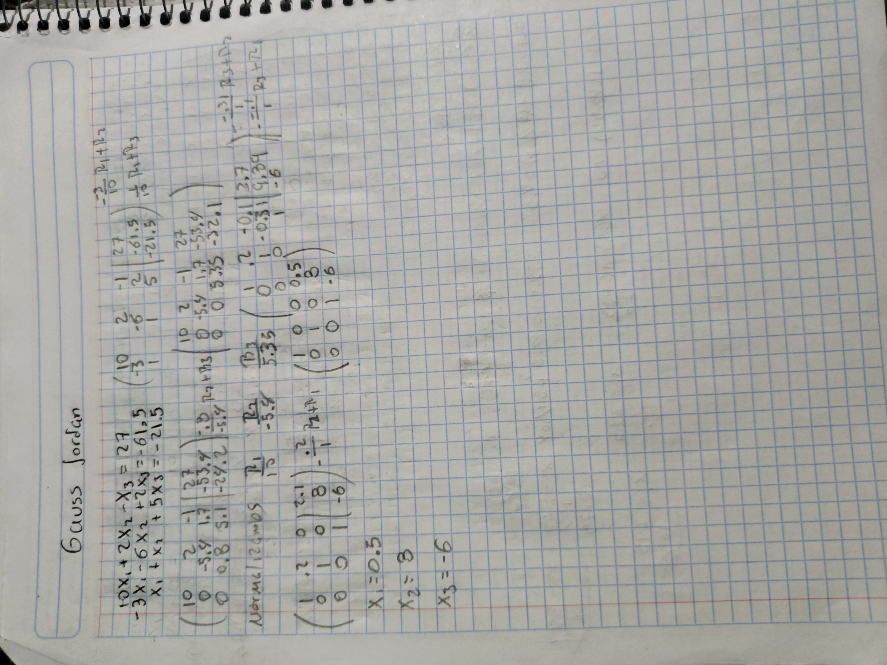{width=600}

#### Sistema: 6

$$
A = \begin{bmatrix}
1 & 3 & -2 & 1 & = & 4 \\
1 & 3 & -1 & 2 & = & 1 \\
0 & 1 & -1 & 4 & = & 5\\
2 & 6 & 1 & 2 & = & 2
\end{bmatrix}
$$

```{r}


#  Matriz de coeficientes (A) 
valores <- c(1,3,-2,1,
 1,3,-1,2,
 0,1,-1,4,
 2,6,1,2)
A <- matrix(valores, nrow = 4, byrow = TRUE)
A

#  Vector de términos independientes (b) 
valoresb <- c(4,1,5,2)
b <- matrix(valoresb, nrow = 4)
b

#  Matriz aumentada 
Ab <- cbind(A, b)
cat("Matriz aumentada inicial:\n")
print(Ab)

max_row <- which.max(abs(Ab[1:4, 1]))  
if (max_row != 1) {                    
  Ab[c(1, max_row), ] <- Ab[c(max_row, 1), ]
  cat("\n[ Pivoteo parcial realizado entre filas 1 y", max_row, "]\n")
}                                     

m1 <- -Ab[2,1]/Ab[1,1]; m1
m2 <- -Ab[3,1]/Ab[1,1]; m2
m3 <- -Ab[4,1]/Ab[1,1]; m3

A1 <- Ab[1,]
A2 <- m1*Ab[1,]+Ab[2,]
A3 <- m2*Ab[1,]+Ab[3,]
A4 <- m3*Ab[1,]+Ab[4,]

NuevaA <- rbind(A1, A2, A3, A4)
cat("\nETAPA 1 - Eliminando columna 1:\n")
print(NuevaA)


max_row <- which.max(abs(NuevaA[2:4, 2])) + 1   
if (max_row != 2) {                             
  NuevaA[c(2, max_row), ] <- NuevaA[c(max_row, 2), ]
  cat("\n[ Pivoteo parcial realizado entre filas 2 y", max_row, "]\n")
}                                              

m4 <- -NuevaA[3,2]/NuevaA[2,2]; m4
m5 <- -NuevaA[4,2]/NuevaA[2,2]; m5

R1 <- NuevaA[1,]
R2 <- NuevaA[2,]
R3 <- m4*NuevaA[2,]+NuevaA[3,]
R4 <- m5*NuevaA[2,]+NuevaA[4,]

Nueva <- rbind(R1, R2, R3, R4)
cat("\nETAPA 2 - Eliminando columna 2:\n")
print(Nueva)


#
max_row <- which.max(abs(Nueva[3:4, 3])) + 2  
if (max_row != 3) {                            
  Nueva[c(3, max_row), ] <- Nueva[c(max_row, 3), ]
  cat("\n[ Pivoteo parcial realizado entre filas 3 y", max_row, "]\n")
}                                              

m6 <- -Nueva[4,3]/Nueva[3,3]; m6

R1 <- Nueva[1,]
R2 <- Nueva[2,]
R3 <- Nueva[3,]
R4 <- m6*Nueva[3,]+Nueva[4,]

Nm <- rbind(R1, R2, R3, R4)
cat("\nETAPA 3 - Eliminando columna 3:\n")
print(Nm)


# ETAPA 4: Normalización de pivotes (diagonal = 1)

cat("\nNormalizando pivotes a 1:\n")
for (i in 1:4) {
  Nm[i,] <- Nm[i,] / Nm[i,i]
}
print(Nm)


# ETAPA 5: Eliminación hacia arriba

cat("\nEliminando hacia arriba:\n")

# Columna 4 hacia arriba
m7 <- Nm[3,4]; m7
m8 <- Nm[2,4]; m8
m9 <- Nm[1,4]; m9
Nm[3,] <- Nm[3,] - m7 * Nm[4,]
Nm[2,] <- Nm[2,] - m8 * Nm[4,]
Nm[1,] <- Nm[1,] - m9 * Nm[4,]

# Columna 3 hacia arriba
m10 <- Nm[2,3]; m10
m11 <- Nm[1,3]; m11
Nm[2,] <- Nm[2,] - m10 * Nm[3,]
Nm[1,] <- Nm[1,] - m11 * Nm[3,]

# Columna 2 hacia arriba
m12 <- Nm[1,2]; m12
Nm[1,] <- Nm[1,] - m12 * Nm[2,]

Final <- Nm
cat("\nMatriz reducida final (identidad):\n")
print(Final)


# RESULTADOS

w <- Final[4,5]
z <- Final[3,5]
y <- Final[2,5]
x <- Final[1,5]

cat("\nSoluciones del sistema:\n")
cat("x =", x, "\n")
cat("y =", y, "\n")
cat("z =", z, "\n")
cat("w =", w, "\n")

```

#### Sistema: 7
$$
A = \begin{bmatrix}
6 & -1 & -1 & 4 & = & 17 \\
1 & -10 & 2 & -1 & = & -17 \\
3 & 2 & 8 & -1 & = & 19\\
1 & 1 & 1 & -5 & = & -14
\end{bmatrix}
$$
 
```{r}


#  Matriz de coeficientes (A) 
valores <- c(6,-1,-1,4,
 1,-10,2,-1,
 3,-2,8,-1,
 1,1,1,-5)
A <- matrix(valores, nrow = 4, byrow = TRUE)
A

#  Vector de términos independientes (b) 
valoresb <- c(17, -17, 19,-14)
b <- matrix(valoresb, nrow = 4)
b

#  Matriz aumentada 
Ab <- cbind(A, b)
cat("Matriz aumentada inicial:\n")
print(Ab)

# ETAPA 1: Eliminación hacia adelante (columna 1)


m1 <- -Ab[2,1]/Ab[1,1]; m1
m2 <- -Ab[3,1]/Ab[1,1]; m2
m3 <- -Ab[4,1]/Ab[1,1]; m3

A1 <- Ab[1,]
A2 <- m1*Ab[1,]+Ab[2,]
A3 <- m2*Ab[1,]+Ab[3,]
A4 <- m3*Ab[1,]+Ab[4,]

NuevaA <- rbind(A1, A2, A3, A4)
cat("\nETAPA 1 - Eliminando columna 1:\n")
print(NuevaA)

# ETAPA 2: Eliminación hacia adelante (columna 2)


m4 <- -NuevaA[3,2]/NuevaA[2,2]; m4
m5 <- -NuevaA[4,2]/NuevaA[2,2]; m5

R1 <- NuevaA[1,]
R2 <- NuevaA[2,]
R3 <- m4*NuevaA[2,]+NuevaA[3,]
R4 <- m5*NuevaA[2,]+NuevaA[4,]

Nueva <- rbind(R1, R2, R3, R4)
cat("\nETAPA 2 - Eliminando columna 2:\n")
print(Nueva)


# ETAPA 3: Eliminación hacia adelante (columna 3)


m6 <- -Nueva[4,3]/Nueva[3,3]; m6

R1 <- Nueva[1,]
R2 <- Nueva[2,]
R3 <- Nueva[3,]
R4 <- m6*Nueva[3,]+Nueva[4,]

Nm <- rbind(R1, R2, R3, R4)
cat("\nETAPA 3 - Eliminando columna 3:\n")
print(Nm)


# ETAPA 4: Normalización de pivotes (diagonal = 1)


cat("\nNormalizando pivotes a 1:\n")
for (i in 1:4) {
  Nm[i,] <- Nm[i,] / Nm[i,i]
}
print(Nm)

# ETAPA 5: Eliminación hacia arriba

cat("\nEliminando hacia arriba:\n")

# Columna 4 hacia arriba
m7 <- Nm[3,4]; m7
m8 <- Nm[2,4]; m8
m9 <- Nm[1,4]; m9
Nm[3,] <- Nm[3,] - m7 * Nm[4,]
Nm[2,] <- Nm[2,] - m8 * Nm[4,]
Nm[1,] <- Nm[1,] - m9 * Nm[4,]

# Columna 3 hacia arriba
m10 <- Nm[2,3]; m10
m11 <- Nm[1,3]; m11
Nm[2,] <- Nm[2,] - m10 * Nm[3,]
Nm[1,] <- Nm[1,] - m11 * Nm[3,]

# Columna 2 hacia arriba
m12 <- Nm[1,2]; m12
Nm[1,] <- Nm[1,] - m12 * Nm[2,]

Final <- Nm
cat("\nMatriz reducida final (identidad):\n")
print(Final)


# RESULTADOS


w <- Final[4,5]
z <- Final[3,5]
y <- Final[2,5]
x <- Final[1,5]

cat("\nSoluciones del sistema:\n")
cat("x =", x, "\n")
cat("y =", y, "\n")
cat("z =", z, "\n")
cat("w =", w, "\n")

```

#### Sistema: 8
$$
A = \begin{bmatrix}
1 & 2 & 3 & 4 & = & 1 \\
1 & -4 & 1 & 11 & = & 2 \\
-1 & 8 & 7 & 6 & = & -2\\
16 & 8 & -5 & 6 & = & 11
\end{bmatrix}
$$

```{r}


#  Matriz de coeficientes (A) 
valores <- c(1,2,3,4,
 1,-4,1,11,
 -1,8,7,6,
 16,8,-5,6)
A <- matrix(valores, nrow = 4, byrow = TRUE)
A

#  Vector de términos independientes (b) 
valoresb <- c(1,2,-2,11)
b <- matrix(valoresb, nrow = 4)
b

#  Matriz aumentada 
Ab <- cbind(A, b)
cat("Matriz aumentada inicial:\n")
print(Ab)

# ETAPA 1: Eliminación hacia adelante (columna 1)


m1 <- -Ab[2,1]/Ab[1,1]; m1
m2 <- -Ab[3,1]/Ab[1,1]; m2
m3 <- -Ab[4,1]/Ab[1,1]; m3

A1 <- Ab[1,]
A2 <- m1*Ab[1,]+Ab[2,]
A3 <- m2*Ab[1,]+Ab[3,]
A4 <- m3*Ab[1,]+Ab[4,]

NuevaA <- rbind(A1, A2, A3, A4)
cat("\nETAPA 1 - Eliminando columna 1:\n")
print(NuevaA)

# ETAPA 2: Eliminación hacia adelante (columna 2)


m4 <- -NuevaA[3,2]/NuevaA[2,2]; m4
m5 <- -NuevaA[4,2]/NuevaA[2,2]; m5

R1 <- NuevaA[1,]
R2 <- NuevaA[2,]
R3 <- m4*NuevaA[2,]+NuevaA[3,]
R4 <- m5*NuevaA[2,]+NuevaA[4,]

Nueva <- rbind(R1, R2, R3, R4)
cat("\nETAPA 2 - Eliminando columna 2:\n")
print(Nueva)


# ETAPA 3: Eliminación hacia adelante (columna 3)


m6 <- -Nueva[4,3]/Nueva[3,3]; m6

R1 <- Nueva[1,]
R2 <- Nueva[2,]
R3 <- Nueva[3,]
R4 <- m6*Nueva[3,]+Nueva[4,]

Nm <- rbind(R1, R2, R3, R4)
cat("\nETAPA 3 - Eliminando columna 3:\n")
print(Nm)


# ETAPA 4: Normalización de pivotes (diagonal = 1)


cat("\nNormalizando pivotes a 1:\n")
for (i in 1:4) {
  Nm[i,] <- Nm[i,] / Nm[i,i]
}
print(Nm)

# ETAPA 5: Eliminación hacia arriba

cat("\nEliminando hacia arriba:\n")

# Columna 4 hacia arriba
m7 <- Nm[3,4]; m7
m8 <- Nm[2,4]; m8
m9 <- Nm[1,4]; m9
Nm[3,] <- Nm[3,] - m7 * Nm[4,]
Nm[2,] <- Nm[2,] - m8 * Nm[4,]
Nm[1,] <- Nm[1,] - m9 * Nm[4,]

# Columna 3 hacia arriba
m10 <- Nm[2,3]; m10
m11 <- Nm[1,3]; m11
Nm[2,] <- Nm[2,] - m10 * Nm[3,]
Nm[1,] <- Nm[1,] - m11 * Nm[3,]

# Columna 2 hacia arriba
m12 <- Nm[1,2]; m12
Nm[1,] <- Nm[1,] - m12 * Nm[2,]

Final <- Nm
cat("\nMatriz reducida final (identidad):\n")
print(Final)


# RESULTADOS


w <- Final[4,5]
z <- Final[3,5]
y <- Final[2,5]
x <- Final[1,5]

cat("\nSoluciones del sistema:\n")
cat("x =", x, "\n")
cat("y =", y, "\n")
cat("z =", z, "\n")
cat("w =", w, "\n")

```

#### Sistema:9
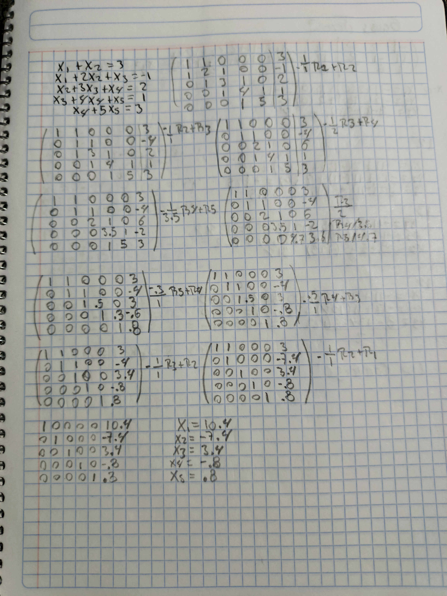{width=600}

#### Sistema: 10

$$
A = \begin{bmatrix}
15 & -18 & 15 & -3 & = & 11 \\
-18 & 24 & -18 & 4 & = & 10 \\
15 & -18 & 18 & -3 & = & 11\\
-3 & 4 & -3 & 1 & = & 13
\end{bmatrix}
$$

```{r}


#  Matriz de coeficientes (A) 
valores <- c(15, -18, 15, -3,
 -18,24,-18,4,
 15,-18,18,-3,
-3,4,-3,1)
A <- matrix(valores, nrow = 4, byrow = TRUE)
A

#  Vector de términos independientes (b) 
valoresb <- c(11, -10, 11,13)
b <- matrix(valoresb, nrow = 4)
b

#  Matriz aumentada 
Ab <- cbind(A, b)
cat("Matriz aumentada inicial:\n")
print(Ab)

# ETAPA 1: Eliminación hacia adelante (columna 1)


m1 <- -Ab[2,1]/Ab[1,1]; m1
m2 <- -Ab[3,1]/Ab[1,1]; m2
m3 <- -Ab[4,1]/Ab[1,1]; m3

A1 <- Ab[1,]
A2 <- m1*Ab[1,]+Ab[2,]
A3 <- m2*Ab[1,]+Ab[3,]
A4 <- m3*Ab[1,]+Ab[4,]

NuevaA <- rbind(A1, A2, A3, A4)
cat("\nETAPA 1 - Eliminando columna 1:\n")
print(NuevaA)

# ETAPA 2: Eliminación hacia adelante (columna 2)


m4 <- -NuevaA[3,2]/NuevaA[2,2]; m4
m5 <- -NuevaA[4,2]/NuevaA[2,2]; m5

R1 <- NuevaA[1,]
R2 <- NuevaA[2,]
R3 <- m4*NuevaA[2,]+NuevaA[3,]
R4 <- m5*NuevaA[2,]+NuevaA[4,]

Nueva <- rbind(R1, R2, R3, R4)
cat("\nETAPA 2 - Eliminando columna 2:\n")
print(Nueva)


# ETAPA 3: Eliminación hacia adelante (columna 3)


m6 <- -Nueva[4,3]/Nueva[3,3]; m6

R1 <- Nueva[1,]
R2 <- Nueva[2,]
R3 <- Nueva[3,]
R4 <- m6*Nueva[3,]+Nueva[4,]

Nm <- rbind(R1, R2, R3, R4)
cat("\nETAPA 3 - Eliminando columna 3:\n")
print(Nm)


# ETAPA 4: Normalización de pivotes (diagonal = 1)


cat("\nNormalizando pivotes a 1:\n")
for (i in 1:4) {
  Nm[i,] <- Nm[i,] / Nm[i,i]
}
print(Nm)

# ETAPA 5: Eliminación hacia arriba

cat("\nEliminando hacia arriba:\n")

# Columna 4 hacia arriba
m7 <- Nm[3,4]; m7
m8 <- Nm[2,4]; m8
m9 <- Nm[1,4]; m9
Nm[3,] <- Nm[3,] - m7 * Nm[4,]
Nm[2,] <- Nm[2,] - m8 * Nm[4,]
Nm[1,] <- Nm[1,] - m9 * Nm[4,]

# Columna 3 hacia arriba
m10 <- Nm[2,3]; m10
m11 <- Nm[1,3]; m11
Nm[2,] <- Nm[2,] - m10 * Nm[3,]
Nm[1,] <- Nm[1,] - m11 * Nm[3,]

# Columna 2 hacia arriba
m12 <- Nm[1,2]; m12
Nm[1,] <- Nm[1,] - m12 * Nm[2,]

Final <- Nm
cat("\nMatriz reducida final (identidad):\n")
print(Final)


# RESULTADOS


w <- Final[4,5]
z <- Final[3,5]
y <- Final[2,5]
x <- Final[1,5]

cat("\nSoluciones del sistema:\n")
cat("x =", x, "\n")
cat("y =", y, "\n")
cat("z =", z, "\n")
cat("w =", w, "\n")

```

## Metodos Iterativos


### Gauss-seidel

#### Sistema: 1

$$
A = \begin{bmatrix}
3 & -0.2 & -0.5 &  = & 8 \\
0.1 & 7 & 0.4 &  = & -19.5 \\
0.4 & -0.1 & 10 & = & 72.4
\end{bmatrix}
$$

```{r}

A <- matrix(c(3, -0.2, -0.5,
              0.1, 7, 0.4,
              0.4, -0.1, 10), nrow = 3, byrow = TRUE)

b <- c(8, -19.5, 72.4)

A
b

# Vector inicial x^(0)
x <- rep(0,3)
cat("x^(0) =", paste(sprintf("%.8f",x), collapse = ", "), "\n")

#### Iteración 1
x_old <- x
cat("\nIteración 1\n")
x[1] <- (b[1] + 0.2*x_old[2] + 0.5*x_old[3]) / A[1,1]
x[2] <- (b[2] - 0.1*x[1] - 0.4*x_old[3]) / A[2,2]
x[3] <- (b[3] - 0.4*x[1] + 0.1*x[2]) / A[3,3]
r <- b - A %*% x
dx_inf <- max(abs(x - x_old))
cat(sprintf("x^(1) = %s\n", paste(sprintf("%.8f",x), collapse=", ")))
cat(sprintf("||dx||_inf = %.8e | ||r||_inf = %.8e\n",dx_inf,max(abs(r))))

#### Iteración 2
x_old <- x
cat("\nIteración 2\n")
x[1] <- (b[1] + 0.2*x_old[2] + 0.5*x_old[3]) / A[1,1]
x[2] <- (b[2] - 0.1*x[1] - 0.4*x_old[3]) / A[2,2]
x[3] <- (b[3] - 0.4*x[1] + 0.1*x[2]) / A[3,3]
r <- b - A %*% x
dx_inf <- max(abs(x - x_old))
cat(sprintf("x^(2) = %s\n", paste(sprintf("%.8f",x), collapse=", ")))
cat(sprintf("||dx||_inf = %.8e | ||r||_inf = %.8e\n",dx_inf,max(abs(r))))

#### Iteración 3
x_old <- x
cat("\nIteración 3\n")
x[1] <- (b[1] + 0.2*x_old[2] + 0.5*x_old[3]) / A[1,1]
x[2] <- (b[2] - 0.1*x[1] - 0.4*x_old[3]) / A[2,2]
x[3] <- (b[3] - 0.4*x[1] + 0.1*x[2]) / A[3,3]
r <- b - A %*% x
dx_inf <- max(abs(x - x_old))
cat(sprintf("x^(3) = %s\n", paste(sprintf("%.8f",x), collapse=", ")))
cat(sprintf("||dx||_inf = %.8e | ||r||_inf = %.8e\n",dx_inf,max(abs(r))))

#### Iteración 4
x_old <- x
cat("\nIteración 4\n")
x[1] <- (b[1] + 0.2*x_old[2] + 0.5*x_old[3]) / A[1,1]
x[2] <- (b[2] - 0.1*x[1] - 0.4*x_old[3]) / A[2,2]
x[3] <- (b[3] - 0.4*x[1] + 0.1*x[2]) / A[3,3]
r <- b - A %*% x
dx_inf <- max(abs(x - x_old))
cat(sprintf("x^(4) = %s\n", paste(sprintf("%.8f",x), collapse=", ")))
cat(sprintf("||dx||_inf = %.8e | ||r||_inf = %.8e\n",dx_inf,max(abs(r))))

#### Iteración 5
x_old <- x
cat("\nIteración 5\n")
x[1] <- (b[1] + 0.2*x_old[2] + 0.5*x_old[3]) / A[1,1]
x[2] <- (b[2] - 0.1*x[1] - 0.4*x_old[3]) / A[2,2]
x[3] <- (b[3] - 0.4*x[1] + 0.1*x[2]) / A[3,3]
r <- b - A %*% x
dx_inf <- max(abs(x - x_old))
cat(sprintf("x^(5) = %s\n", paste(sprintf("%.8f",x), collapse=", ")))
cat(sprintf("||dx||_inf = %.8e | ||r||_inf = %.8e\n",dx_inf,max(abs(r))))

#### Iteración 6
x_old <- x
cat("\nIteración 6\n")
x[1] <- (b[1] + 0.2*x_old[2] + 0.5*x_old[3]) / A[1,1]
x[2] <- (b[2] - 0.1*x[1] - 0.4*x_old[3]) / A[2,2]
x[3] <- (b[3] - 0.4*x[1] + 0.1*x[2]) / A[3,3]
r <- b - A %*% x
dx_inf <- max(abs(x - x_old))
cat(sprintf("x^(6) = %s\n", paste(sprintf("%.8f",x), collapse=", ")))
cat(sprintf("||dx||_inf = %.8e | ||r||_inf = %.8e\n",dx_inf,max(abs(r))))

#### Iteración 7
x_old <- x
cat("\nIteración 7\n")
x[1] <- (b[1] + 0.2*x_old[2] + 0.5*x_old[3]) / A[1,1]
x[2] <- (b[2] - 0.1*x[1] - 0.4*x_old[3]) / A[2,2]
x[3] <- (b[3] - 0.4*x[1] + 0.1*x[2]) / A[3,3]
r <- b - A %*% x
dx_inf <- max(abs(x - x_old))
cat(sprintf("x^(7) = %s\n", paste(sprintf("%.8f",x), collapse=", ")))
cat(sprintf("||dx||_inf = %.8e | ||r||_inf = %.8e\n",dx_inf,max(abs(r))))

#### Iteración 8
x_old <- x
cat("\nIteración 8\n")
x[1] <- (b[1] + 0.2*x_old[2] + 0.5*x_old[3]) / A[1,1]
x[2] <- (b[2] - 0.1*x[1] - 0.4*x_old[3]) / A[2,2]
x[3] <- (b[3] - 0.4*x[1] + 0.1*x[2]) / A[3,3]
r <- b - A %*% x
dx_inf <- max(abs(x - x_old))
cat(sprintf("x^(8) = %s\n", paste(sprintf("%.8f",x), collapse=", ")))
cat(sprintf("||dx||_inf = %.8e | ||r||_inf = %.8e\n",dx_inf,max(abs(r))))

#### Iteración 9
x_old <- x
cat("\nIteración 9\n")
x[1] <- (b[1] + 0.2*x_old[2] + 0.5*x_old[3]) / A[1,1]
x[2] <- (b[2] - 0.1*x[1] - 0.4*x_old[3]) / A[2,2]
x[3] <- (b[3] - 0.4*x[1] + 0.1*x[2]) / A[3,3]
r <- b - A %*% x
dx_inf <- max(abs(x - x_old))
cat(sprintf("x^(9) = %s\n", paste(sprintf("%.8f",x), collapse=", ")))
cat(sprintf("||dx||_inf = %.8e | ||r||_inf = %.8e\n",dx_inf,max(abs(r))))

#### Iteración 10
x_old <- x
cat("\nIteración 10\n")
x[1] <- (b[1] + 0.2*x_old[2] + 0.5*x_old[3]) / A[1,1]
x[2] <- (b[2] - 0.1*x[1] - 0.4*x_old[3]) / A[2,2]
x[3] <- (b[3] - 0.4*x[1] + 0.1*x[2]) / A[3,3]
r <- b - A %*% x
dx_inf <- max(abs(x - x_old))
cat(sprintf("x^(10) = %s\n", paste(sprintf("%.8f",x), collapse=", ")))
cat(sprintf("||dx||_inf = %.8e | ||r||_inf = %.8e\n",dx_inf,max(abs(r))))

cat("\nSolución aproximada después de 10 iteraciones:\n")
print(round(x,8))

```

#### Sistema:2
$$
A = \begin{bmatrix}
-5 & 1.4 & -2.7 & = & 94.2 \\
0.7 & -2.5 & 15 & = & -6 \\
3.3 & -11 & 4.4 & = & -27.5
\end{bmatrix}
$$

```{r}

A <- matrix(c(-5,1.4,-2.7,
              0.7,-2.5,15,
              3.3,-11,4.4), nrow = 3, byrow = TRUE)

b <- c(94.2,-6,-27.5)

# Vector inicial x^(0)
x <- rep(0, 3)
cat("x^(0) =", paste(sprintf("%.8f", x), collapse = ", "), "\n")

#### Iteración 1
x_old <- x
cat("\nIteración 1\n")
# x1 = (b1 - a12*x2_old - a13*x3_old) / a11
x[1] <- (b[1] - A[1, 2] * x_old[2] - A[1, 3] * x_old[3]) / A[1, 1]
# x2 = (b2 - a21*x1_new - a23*x3_old) / a22
x[2] <- (b[2] - A[2, 1] * x[1] - A[2, 3] * x_old[3]) / A[2, 2]
# x3 = (b3 - a31*x1_new - a32*x2_new) / a33
x[3] <- (b[3] - A[3, 1] * x[1] - A[3, 2] * x[2]) / A[3, 3]

r <- b - A %*% x
dx_inf <- max(abs(x - x_old))
cat(sprintf("x^(1) = %s\n", paste(sprintf("%.8f", x), collapse = ", ")))
cat(sprintf("||dx||_inf = %.8e | ||r||_inf = %.8e\n", dx_inf, max(abs(r))))

#### Iteración 2
x_old <- x
cat("\nIteración 2\n")
# x1 = (b1 - a12*x2_old - a13*x3_old) / a11
x[1] <- (b[1] - A[1, 2] * x_old[2] - A[1, 3] * x_old[3]) / A[1, 1]
# x2 = (b2 - a21*x1_new - a23*x3_old) / a22
x[2] <- (b[2] - A[2, 1] * x[1] - A[2, 3] * x_old[3]) / A[2, 2]
# x3 = (b3 - a31*x1_new - a32*x2_new) / a33
x[3] <- (b[3] - A[3, 1] * x[1] - A[3, 2] * x[2]) / A[3, 3]

r <- b - A %*% x
dx_inf <- max(abs(x - x_old))
cat(sprintf("x^(2) = %s\n", paste(sprintf("%.8f", x), collapse = ", ")))
cat(sprintf("||dx||_inf = %.8e | ||r||_inf = %.8e\n", dx_inf, max(abs(r))))

#### Iteración 3
x_old <- x
cat("\nIteración 3\n")
# x1 = (b1 - a12*x2_old - a13*x3_old) / a11
x[1] <- (b[1] - A[1, 2] * x_old[2] - A[1, 3] * x_old[3]) / A[1, 1]
# x2 = (b2 - a21*x1_new - a23*x3_old) / a22
x[2] <- (b[2] - A[2, 1] * x[1] - A[2, 3] * x_old[3]) / A[2, 2]
# x3 = (b3 - a31*x1_new - a32*x2_new) / a33
x[3] <- (b[3] - A[3, 1] * x[1] - A[3, 2] * x[2]) / A[3, 3]

r <- b - A %*% x
dx_inf <- max(abs(x - x_old))
cat(sprintf("x^(3) = %s\n", paste(sprintf("%.8f", x), collapse = ", ")))
cat(sprintf("||dx||_inf = %.8e | ||r||_inf = %.8e\n", dx_inf, max(abs(r))))

#### Iteración 4
x_old <- x
cat("\nIteración 4\n")
# x1 = (b1 - a12*x2_old - a13*x3_old) / a11
x[1] <- (b[1] - A[1, 2] * x_old[2] - A[1, 3] * x_old[3]) / A[1, 1]
# x2 = (b2 - a21*x1_new - a23*x3_old) / a22
x[2] <- (b[2] - A[2, 1] * x[1] - A[2, 3] * x_old[3]) / A[2, 2]
# x3 = (b3 - a31*x1_new - a32*x2_new) / a33
x[3] <- (b[3] - A[3, 1] * x[1] - A[3, 2] * x[2]) / A[3, 3]

r <- b - A %*% x
dx_inf <- max(abs(x - x_old))
cat(sprintf("x^(4) = %s\n", paste(sprintf("%.8f", x), collapse = ", ")))
cat(sprintf("||dx||_inf = %.8e | ||r||_inf = %.8e\n", dx_inf, max(abs(r))))

#### Iteración 5
x_old <- x
cat("\nIteración 5\n")
# x1 = (b1 - a12*x2_old - a13*x3_old) / a11
x[1] <- (b[1] - A[1, 2] * x_old[2] - A[1, 3] * x_old[3]) / A[1, 1]
# x2 = (b2 - a21*x1_new - a23*x3_old) / a22
x[2] <- (b[2] - A[2, 1] * x[1] - A[2, 3] * x_old[3]) / A[2, 2]
# x3 = (b3 - a31*x1_new - a32*x2_new) / a33
x[3] <- (b[3] - A[3, 1] * x[1] - A[3, 2] * x[2]) / A[3, 3]

r <- b - A %*% x
dx_inf <- max(abs(x - x_old))
cat(sprintf("x^(5) = %s\n", paste(sprintf("%.8f", x), collapse = ", ")))
cat(sprintf("||dx||_inf = %.8e | ||r||_inf = %.8e\n", dx_inf, max(abs(r))))

#### Iteración 6
x_old <- x
cat("\nIteración 6\n")
# x1 = (b1 - a12*x2_old - a13*x3_old) / a11
x[1] <- (b[1] - A[1, 2] * x_old[2] - A[1, 3] * x_old[3]) / A[1, 1]
# x2 = (b2 - a21*x1_new - a23*x3_old) / a22
x[2] <- (b[2] - A[2, 1] * x[1] - A[2, 3] * x_old[3]) / A[2, 2]
# x3 = (b3 - a31*x1_new - a32*x2_new) / a33
x[3] <- (b[3] - A[3, 1] * x[1] - A[3, 2] * x[2]) / A[3, 3]

r <- b - A %*% x
dx_inf <- max(abs(x - x_old))
cat(sprintf("x^(6) = %s\n", paste(sprintf("%.8f", x), collapse = ", ")))
cat(sprintf("||dx||_inf = %.8e | ||r||_inf = %.8e\n", dx_inf, max(abs(r))))

#### Iteración 7
x_old <- x
cat("\nIteración 7\n")
# x1 = (b1 - a12*x2_old - a13*x3_old) / a11
x[1] <- (b[1] - A[1, 2] * x_old[2] - A[1, 3] * x_old[3]) / A[1, 1]
# x2 = (b2 - a21*x1_new - a23*x3_old) / a22
x[2] <- (b[2] - A[2, 1] * x[1] - A[2, 3] * x_old[3]) / A[2, 2]
# x3 = (b3 - a31*x1_new - a32*x2_new) / a33
x[3] <- (b[3] - A[3, 1] * x[1] - A[3, 2] * x[2]) / A[3, 3]

r <- b - A %*% x
dx_inf <- max(abs(x - x_old))
cat(sprintf("x^(7) = %s\n", paste(sprintf("%.8f", x), collapse = ", ")))
cat(sprintf("||dx||_inf = %.8e | ||r||_inf = %.8e\n", dx_inf, max(abs(r))))

#### Iteración 8
x_old <- x
cat("\nIteración 8\n")
# x1 = (b1 - a12*x2_old - a13*x3_old) / a11
x[1] <- (b[1] - A[1, 2] * x_old[2] - A[1, 3] * x_old[3]) / A[1, 1]
# x2 = (b2 - a21*x1_new - a23*x3_old) / a22
x[2] <- (b[2] - A[2, 1] * x[1] - A[2, 3] * x_old[3]) / A[2, 2]
# x3 = (b3 - a31*x1_new - a32*x2_new) / a33
x[3] <- (b[3] - A[3, 1] * x[1] - A[3, 2] * x[2]) / A[3, 3]

r <- b - A %*% x
dx_inf <- max(abs(x - x_old))
cat(sprintf("x^(8) = %s\n", paste(sprintf("%.8f", x), collapse = ", ")))
cat(sprintf("||dx||_inf = %.8e | ||r||_inf = %.8e\n", dx_inf, max(abs(r))))

#### Iteración 9
x_old <- x
cat("\nIteración 9\n")
# x1 = (b1 - a12*x2_old - a13*x3_old) / a11
x[1] <- (b[1] - A[1, 2] * x_old[2] - A[1, 3] * x_old[3]) / A[1, 1]
# x2 = (b2 - a21*x1_new - a23*x3_old) / a22
x[2] <- (b[2] - A[2, 1] * x[1] - A[2, 3] * x_old[3]) / A[2, 2]
# x3 = (b3 - a31*x1_new - a32*x2_new) / a33
x[3] <- (b[3] - A[3, 1] * x[1] - A[3, 2] * x[2]) / A[3, 3]

r <- b - A %*% x
dx_inf <- max(abs(x - x_old))
cat(sprintf("x^(9) = %s\n", paste(sprintf("%.8f", x), collapse = ", ")))
cat(sprintf("||dx||_inf = %.8e | ||r||_inf = %.8e\n", dx_inf, max(abs(r))))

#### Iteración 10
x_old <- x
cat("\nIteración 10\n")
# x1 = (b1 - a12*x2_old - a13*x3_old) / a11
x[1] <- (b[1] - A[1, 2] * x_old[2] - A[1, 3] * x_old[3]) / A[1, 1]
# x2 = (b2 - a21*x1_new - a23*x3_old) / a22
x[2] <- (b[2] - A[2, 1] * x[1] - A[2, 3] * x_old[3]) / A[2, 2]
# x3 = (b3 - a31*x1_new - a32*x2_new) / a33
x[3] <- (b[3] - A[3, 1] * x[1] - A[3, 2] * x[2]) / A[3, 3]

r <- b - A %*% x
dx_inf <- max(abs(x - x_old))
cat(sprintf("x^(10) = %s\n", paste(sprintf("%.8f", x), collapse = ", ")))
cat(sprintf("||dx||_inf = %.8e | ||r||_inf = %.8e\n", dx_inf, max(abs(r))))

#### Iteración 11
x_old <- x
cat("\nIteración 11\n")
# x1 = (b1 - a12*x2_old - a13*x3_old) / a11
x[1] <- (b[1] - A[1, 2] * x_old[2] - A[1, 3] * x_old[3]) / A[1, 1]
# x2 = (b2 - a21*x1_new - a23*x3_old) / a22
x[2] <- (b[2] - A[2, 1] * x[1] - A[2, 3] * x_old[3]) / A[2, 2]
# x3 = (b3 - a31*x1_new - a32*x2_new) / a33
x[3] <- (b[3] - A[3, 1] * x[1] - A[3, 2] * x[2]) / A[3, 3]

r <- b - A %*% x
dx_inf <- max(abs(x - x_old))
cat(sprintf("x^(11) = %s\n", paste(sprintf("%.8f", x), collapse = ", ")))
cat(sprintf("||dx||_inf = %.8e | ||r||_inf = %.8e\n", dx_inf, max(abs(r))))

#### Iteración 12
x_old <- x
cat("\nIteración 12\n")
# x1 = (b1 - a12*x2_old - a13*x3_old) / a11
x[1] <- (b[1] - A[1, 2] * x_old[2] - A[1, 3] * x_old[3]) / A[1, 1]
# x2 = (b2 - a21*x1_new - a23*x3_old) / a22
x[2] <- (b[2] - A[2, 1] * x[1] - A[2, 3] * x_old[3]) / A[2, 2]
# x3 = (b3 - a31*x1_new - a32*x2_new) / a33
x[3] <- (b[3] - A[3, 1] * x[1] - A[3, 2] * x[2]) / A[3, 3]

r <- b - A %*% x
dx_inf <- max(abs(x - x_old))
cat(sprintf("x^(12) = %s\n", paste(sprintf("%.8f", x), collapse = ", ")))
cat(sprintf("||dx||_inf = %.8e | ||r||_inf = %.8e\n", dx_inf, max(abs(r))))

#### Iteración 13
x_old <- x
cat("\nIteración 13\n")
# x1 = (b1 - a12*x2_old - a13*x3_old) / a11
x[1] <- (b[1] - A[1, 2] * x_old[2] - A[1, 3] * x_old[3]) / A[1, 1]
# x2 = (b2 - a21*x1_new - a23*x3_old) / a22
x[2] <- (b[2] - A[2, 1] * x[1] - A[2, 3] * x_old[3]) / A[2, 2]
# x3 = (b3 - a31*x1_new - a32*x2_new) / a33
x[3] <- (b[3] - A[3, 1] * x[1] - A[3, 2] * x[2]) / A[3, 3]

r <- b - A %*% x
dx_inf <- max(abs(x - x_old))
cat(sprintf("x^(13) = %s\n", paste(sprintf("%.8f", x), collapse = ", ")))
cat(sprintf("||dx||_inf = %.8e | ||r||_inf = %.8e\n", dx_inf, max(abs(r))))

#### Iteración 14
x_old <- x
cat("\nIteración 14\n")
# x1 = (b1 - a12*x2_old - a13*x3_old) / a11
x[1] <- (b[1] - A[1, 2] * x_old[2] - A[1, 3] * x_old[3]) / A[1, 1]
# x2 = (b2 - a21*x1_new - a23*x3_old) / a22
x[2] <- (b[2] - A[2, 1] * x[1] - A[2, 3] * x_old[3]) / A[2, 2]
# x3 = (b3 - a31*x1_new - a32*x2_new) / a33
x[3] <- (b[3] - A[3, 1] * x[1] - A[3, 2] * x[2]) / A[3, 3]

r <- b - A %*% x
dx_inf <- max(abs(x - x_old))
cat(sprintf("x^(14) = %s\n", paste(sprintf("%.8f", x), collapse = ", ")))
cat(sprintf("||dx||_inf = %.8e | ||r||_inf = %.8e\n", dx_inf, max(abs(r))))

#### Iteración 15
x_old <- x
cat("\nIteración 15\n")
# x1 = (b1 - a12*x2_old - a13*x3_old) / a11
x[1] <- (b[1] - A[1, 2] * x_old[2] - A[1, 3] * x_old[3]) / A[1, 1]
# x2 = (b2 - a21*x1_new - a23*x3_old) / a22
x[2] <- (b[2] - A[2, 1] * x[1] - A[2, 3] * x_old[3]) / A[2, 2]
# x3 = (b3 - a31*x1_new - a32*x2_new) / a33
x[3] <- (b[3] - A[3, 1] * x[1] - A[3, 2] * x[2]) / A[3, 3]

r <- b - A %*% x
dx_inf <- max(abs(x - x_old))
cat(sprintf("x^(15) = %s\n", paste(sprintf("%.8f", x), collapse = ", ")))
cat(sprintf("||dx||_inf = %.8e | ||r||_inf = %.8e\n", dx_inf, max(abs(r))))

#### Iteración 16
x_old <- x
cat("\nIteración 16\n")
# x1 = (b1 - a12*x2_old - a13*x3_old) / a11
x[1] <- (b[1] - A[1, 2] * x_old[2] - A[1, 3] * x_old[3]) / A[1, 1]
# x2 = (b2 - a21*x1_new - a23*x3_old) / a22
x[2] <- (b[2] - A[2, 1] * x[1] - A[2, 3] * x_old[3]) / A[2, 2]
# x3 = (b3 - a31*x1_new - a32*x2_new) / a33
x[3] <- (b[3] - A[3, 1] * x[1] - A[3, 2] * x[2]) / A[3, 3]

r <- b - A %*% x
dx_inf <- max(abs(x - x_old))
cat(sprintf("x^(16) = %s\n", paste(sprintf("%.8f", x), collapse = ", ")))
cat(sprintf("||dx||_inf = %.8e | ||r||_inf = %.8e\n", dx_inf, max(abs(r))))

#### Iteración 17
x_old <- x
cat("\nIteración 17\n")
# x1 = (b1 - a12*x2_old - a13*x3_old) / a11
x[1] <- (b[1] - A[1, 2] * x_old[2] - A[1, 3] * x_old[3]) / A[1, 1]
# x2 = (b2 - a21*x1_new - a23*x3_old) / a22
x[2] <- (b[2] - A[2, 1] * x[1] - A[2, 3] * x_old[3]) / A[2, 2]
# x3 = (b3 - a31*x1_new - a32*x2_new) / a33
x[3] <- (b[3] - A[3, 1] * x[1] - A[3, 2] * x[2]) / A[3, 3]

r <- b - A %*% x
dx_inf <- max(abs(x - x_old))
cat(sprintf("x^(17) = %s\n", paste(sprintf("%.8f", x), collapse = ", ")))
cat(sprintf("||dx||_inf = %.8e | ||r||_inf = %.8e\n", dx_inf, max(abs(r))))

#### Iteración 18
x_old <- x
cat("\nIteración 18\n")
# x1 = (b1 - a12*x2_old - a13*x3_old) / a11
x[1] <- (b[1] - A[1, 2] * x_old[2] - A[1, 3] * x_old[3]) / A[1, 1]
# x2 = (b2 - a21*x1_new - a23*x3_old) / a22
x[2] <- (b[2] - A[2, 1] * x[1] - A[2, 3] * x_old[3]) / A[2, 2]
# x3 = (b3 - a31*x1_new - a32*x2_new) / a33
x[3] <- (b[3] - A[3, 1] * x[1] - A[3, 2] * x[2]) / A[3, 3]

r <- b - A %*% x
dx_inf <- max(abs(x - x_old))
cat(sprintf("x^(18) = %s\n", paste(sprintf("%.8f", x), collapse = ", ")))
cat(sprintf("||dx||_inf = %.8e | ||r||_inf = %.8e\n", dx_inf, max(abs(r))))

#### Iteración 19
x_old <- x
cat("\nIteración 19\n")
# x1 = (b1 - a12*x2_old - a13*x3_old) / a11
x[1] <- (b[1] - A[1, 2] * x_old[2] - A[1, 3] * x_old[3]) / A[1, 1]
# x2 = (b2 - a21*x1_new - a23*x3_old) / a22
x[2] <- (b[2] - A[2, 1] * x[1] - A[2, 3] * x_old[3]) / A[2, 2]
# x3 = (b3 - a31*x1_new - a32*x2_new) / a33
x[3] <- (b[3] - A[3, 1] * x[1] - A[3, 2] * x[2]) / A[3, 3]

r <- b - A %*% x
dx_inf <- max(abs(x - x_old))
cat(sprintf("x^(19) = %s\n", paste(sprintf("%.8f", x), collapse = ", ")))
cat(sprintf("||dx||_inf = %.8e | ||r||_inf = %.8e\n", dx_inf, max(abs(r))))

#### Iteración 20
x_old <- x
cat("\nIteración 20\n")
# x1 = (b1 - a12*x2_old - a13*x3_old) / a11
x[1] <- (b[1] - A[1, 2] * x_old[2] - A[1, 3] * x_old[3]) / A[1, 1]
# x2 = (b2 - a21*x1_new - a23*x3_old) / a22
x[2] <- (b[2] - A[2, 1] * x[1] - A[2, 3] * x_old[3]) / A[2, 2]
# x3 = (b3 - a31*x1_new - a32*x2_new) / a33
x[3] <- (b[3] - A[3, 1] * x[1] - A[3, 2] * x[2]) / A[3, 3]

r <- b - A %*% x
dx_inf <- max(abs(x - x_old))
cat(sprintf("x^(20) = %s\n", paste(sprintf("%.8f", x), collapse = ", ")))
cat(sprintf("||dx||_inf = %.8e | ||r||_inf = %.8e\n", dx_inf, max(abs(r))))

cat("Solución aproximada después de 20 iteraciones:\n")
print(round(x, 8))
#### no converge
```

#### Sistema: 3
$$
A = \begin{bmatrix}
3 & -0.5 & 0.6 &  = & 5.24 \\
0.3 & -4 & -1 & = & -0.387 \\
-0.7 & 2 & 7 & = & 14.803
\end{bmatrix}
$$

```{r}

A <- matrix(c(3,-0.5,0.6,
              0.3,-4,-1,
              -0.7,2,7), nrow = 3, byrow = TRUE)

b <- c(5.24,-0.387,14.803)

# Vector inicial x^(0)
x <- rep(0, 3)
cat("x^(0) =", paste(sprintf("%.8f", x), collapse = ", "), "\n")

#### Iteración 1
x_old <- x
cat("\nIteración 1\n")
# x1 = (b1 - a12*x2_old - a13*x3_old) / a11
x[1] <- (b[1] - A[1, 2] * x_old[2] - A[1, 3] * x_old[3]) / A[1, 1]
# x2 = (b2 - a21*x1_new - a23*x3_old) / a22
x[2] <- (b[2] - A[2, 1] * x[1] - A[2, 3] * x_old[3]) / A[2, 2]
# x3 = (b3 - a31*x1_new - a32*x2_new) / a33
x[3] <- (b[3] - A[3, 1] * x[1] - A[3, 2] * x[2]) / A[3, 3]

r <- b - A %*% x
dx_inf <- max(abs(x - x_old))
cat(sprintf("x^(1) = %s\n", paste(sprintf("%.8f", x), collapse = ", ")))
cat(sprintf("||dx||_inf = %.8e | ||r||_inf = %.8e\n", dx_inf, max(abs(r))))

#### Iteración 2
x_old <- x
cat("\nIteración 2\n")
# x1 = (b1 - a12*x2_old - a13*x3_old) / a11
x[1] <- (b[1] - A[1, 2] * x_old[2] - A[1, 3] * x_old[3]) / A[1, 1]
# x2 = (b2 - a21*x1_new - a23*x3_old) / a22
x[2] <- (b[2] - A[2, 1] * x[1] - A[2, 3] * x_old[3]) / A[2, 2]
# x3 = (b3 - a31*x1_new - a32*x2_new) / a33
x[3] <- (b[3] - A[3, 1] * x[1] - A[3, 2] * x[2]) / A[3, 3]

r <- b - A %*% x
dx_inf <- max(abs(x - x_old))
cat(sprintf("x^(2) = %s\n", paste(sprintf("%.8f", x), collapse = ", ")))
cat(sprintf("||dx||_inf = %.8e | ||r||_inf = %.8e\n", dx_inf, max(abs(r))))

#### Iteración 3
x_old <- x
cat("\nIteración 3\n")
# x1 = (b1 - a12*x2_old - a13*x3_old) / a11
x[1] <- (b[1] - A[1, 2] * x_old[2] - A[1, 3] * x_old[3]) / A[1, 1]
# x2 = (b2 - a21*x1_new - a23*x3_old) / a22
x[2] <- (b[2] - A[2, 1] * x[1] - A[2, 3] * x_old[3]) / A[2, 2]
# x3 = (b3 - a31*x1_new - a32*x2_new) / a33
x[3] <- (b[3] - A[3, 1] * x[1] - A[3, 2] * x[2]) / A[3, 3]

r <- b - A %*% x
dx_inf <- max(abs(x - x_old))
cat(sprintf("x^(3) = %s\n", paste(sprintf("%.8f", x), collapse = ", ")))
cat(sprintf("||dx||_inf = %.8e | ||r||_inf = %.8e\n", dx_inf, max(abs(r))))

#### Iteración 4
x_old <- x
cat("\nIteración 4\n")
# x1 = (b1 - a12*x2_old - a13*x3_old) / a11
x[1] <- (b[1] - A[1, 2] * x_old[2] - A[1, 3] * x_old[3]) / A[1, 1]
# x2 = (b2 - a21*x1_new - a23*x3_old) / a22
x[2] <- (b[2] - A[2, 1] * x[1] - A[2, 3] * x_old[3]) / A[2, 2]
# x3 = (b3 - a31*x1_new - a32*x2_new) / a33
x[3] <- (b[3] - A[3, 1] * x[1] - A[3, 2] * x[2]) / A[3, 3]

r <- b - A %*% x
dx_inf <- max(abs(x - x_old))
cat(sprintf("x^(4) = %s\n", paste(sprintf("%.8f", x), collapse = ", ")))
cat(sprintf("||dx||_inf = %.8e | ||r||_inf = %.8e\n", dx_inf, max(abs(r))))

#### Iteración 5
x_old <- x
cat("\nIteración 5\n")
# x1 = (b1 - a12*x2_old - a13*x3_old) / a11
x[1] <- (b[1] - A[1, 2] * x_old[2] - A[1, 3] * x_old[3]) / A[1, 1]
# x2 = (b2 - a21*x1_new - a23*x3_old) / a22
x[2] <- (b[2] - A[2, 1] * x[1] - A[2, 3] * x_old[3]) / A[2, 2]
# x3 = (b3 - a31*x1_new - a32*x2_new) / a33
x[3] <- (b[3] - A[3, 1] * x[1] - A[3, 2] * x[2]) / A[3, 3]

r <- b - A %*% x
dx_inf <- max(abs(x - x_old))
cat(sprintf("x^(5) = %s\n", paste(sprintf("%.8f", x), collapse = ", ")))
cat(sprintf("||dx||_inf = %.8e | ||r||_inf = %.8e\n", dx_inf, max(abs(r))))

#### Iteración 6
x_old <- x
cat("\nIteración 6\n")
# x1 = (b1 - a12*x2_old - a13*x3_old) / a11
x[1] <- (b[1] - A[1, 2] * x_old[2] - A[1, 3] * x_old[3]) / A[1, 1]
# x2 = (b2 - a21*x1_new - a23*x3_old) / a22
x[2] <- (b[2] - A[2, 1] * x[1] - A[2, 3] * x_old[3]) / A[2, 2]
# x3 = (b3 - a31*x1_new - a32*x2_new) / a33
x[3] <- (b[3] - A[3, 1] * x[1] - A[3, 2] * x[2]) / A[3, 3]

r <- b - A %*% x
dx_inf <- max(abs(x - x_old))
cat(sprintf("x^(6) = %s\n", paste(sprintf("%.8f", x), collapse = ", ")))
cat(sprintf("||dx||_inf = %.8e | ||r||_inf = %.8e\n", dx_inf, max(abs(r))))

#### Iteración 7
x_old <- x
cat("\nIteración 7\n")
# x1 = (b1 - a12*x2_old - a13*x3_old) / a11
x[1] <- (b[1] - A[1, 2] * x_old[2] - A[1, 3] * x_old[3]) / A[1, 1]
# x2 = (b2 - a21*x1_new - a23*x3_old) / a22
x[2] <- (b[2] - A[2, 1] * x[1] - A[2, 3] * x_old[3]) / A[2, 2]
# x3 = (b3 - a31*x1_new - a32*x2_new) / a33
x[3] <- (b[3] - A[3, 1] * x[1] - A[3, 2] * x[2]) / A[3, 3]

r <- b - A %*% x
dx_inf <- max(abs(x - x_old))
cat(sprintf("x^(7) = %s\n", paste(sprintf("%.8f", x), collapse = ", ")))
cat(sprintf("||dx||_inf = %.8e | ||r||_inf = %.8e\n", dx_inf, max(abs(r))))

#### Iteración 8
x_old <- x
cat("\nIteración 8\n")
# x1 = (b1 - a12*x2_old - a13*x3_old) / a11
x[1] <- (b[1] - A[1, 2] * x_old[2] - A[1, 3] * x_old[3]) / A[1, 1]
# x2 = (b2 - a21*x1_new - a23*x3_old) / a22
x[2] <- (b[2] - A[2, 1] * x[1] - A[2, 3] * x_old[3]) / A[2, 2]
# x3 = (b3 - a31*x1_new - a32*x2_new) / a33
x[3] <- (b[3] - A[3, 1] * x[1] - A[3, 2] * x[2]) / A[3, 3]

r <- b - A %*% x
dx_inf <- max(abs(x - x_old))
cat(sprintf("x^(8) = %s\n", paste(sprintf("%.8f", x), collapse = ", ")))
cat(sprintf("||dx||_inf = %.8e | ||r||_inf = %.8e\n", dx_inf, max(abs(r))))

#### Iteración 9
x_old <- x
cat("\nIteración 9\n")
# x1 = (b1 - a12*x2_old - a13*x3_old) / a11
x[1] <- (b[1] - A[1, 2] * x_old[2] - A[1, 3] * x_old[3]) / A[1, 1]
# x2 = (b2 - a21*x1_new - a23*x3_old) / a22
x[2] <- (b[2] - A[2, 1] * x[1] - A[2, 3] * x_old[3]) / A[2, 2]
# x3 = (b3 - a31*x1_new - a32*x2_new) / a33
x[3] <- (b[3] - A[3, 1] * x[1] - A[3, 2] * x[2]) / A[3, 3]

r <- b - A %*% x
dx_inf <- max(abs(x - x_old))
cat(sprintf("x^(9) = %s\n", paste(sprintf("%.8f", x), collapse = ", ")))
cat(sprintf("||dx||_inf = %.8e | ||r||_inf = %.8e\n", dx_inf, max(abs(r))))

#### Iteración 10
x_old <- x
cat("\nIteración 10\n")
# x1 = (b1 - a12*x2_old - a13*x3_old) / a11
x[1] <- (b[1] - A[1, 2] * x_old[2] - A[1, 3] * x_old[3]) / A[1, 1]
# x2 = (b2 - a21*x1_new - a23*x3_old) / a22
x[2] <- (b[2] - A[2, 1] * x[1] - A[2, 3] * x_old[3]) / A[2, 2]
# x3 = (b3 - a31*x1_new - a32*x2_new) / a33
x[3] <- (b[3] - A[3, 1] * x[1] - A[3, 2] * x[2]) / A[3, 3]

r <- b - A %*% x
dx_inf <- max(abs(x - x_old))
cat(sprintf("x^(10) = %s\n", paste(sprintf("%.8f", x), collapse = ", ")))
cat(sprintf("||dx||_inf = %.8e | ||r||_inf = %.8e\n", dx_inf, max(abs(r))))

#### Iteración 11
x_old <- x
cat("\nIteración 11\n")
# x1 = (b1 - a12*x2_old - a13*x3_old) / a11
x[1] <- (b[1] - A[1, 2] * x_old[2] - A[1, 3] * x_old[3]) / A[1, 1]
# x2 = (b2 - a21*x1_new - a23*x3_old) / a22
x[2] <- (b[2] - A[2, 1] * x[1] - A[2, 3] * x_old[3]) / A[2, 2]
# x3 = (b3 - a31*x1_new - a32*x2_new) / a33
x[3] <- (b[3] - A[3, 1] * x[1] - A[3, 2] * x[2]) / A[3, 3]

r <- b - A %*% x
dx_inf <- max(abs(x - x_old))
cat(sprintf("x^(11) = %s\n", paste(sprintf("%.8f", x), collapse = ", ")))
cat(sprintf("||dx||_inf = %.8e | ||r||_inf = %.8e\n", dx_inf, max(abs(r))))

#### Iteración 12
x_old <- x
cat("\nIteración 12\n")
# x1 = (b1 - a12*x2_old - a13*x3_old) / a11
x[1] <- (b[1] - A[1, 2] * x_old[2] - A[1, 3] * x_old[3]) / A[1, 1]
# x2 = (b2 - a21*x1_new - a23*x3_old) / a22
x[2] <- (b[2] - A[2, 1] * x[1] - A[2, 3] * x_old[3]) / A[2, 2]
# x3 = (b3 - a31*x1_new - a32*x2_new) / a33
x[3] <- (b[3] - A[3, 1] * x[1] - A[3, 2] * x[2]) / A[3, 3]

r <- b - A %*% x
dx_inf <- max(abs(x - x_old))
cat(sprintf("x^(12) = %s\n", paste(sprintf("%.8f", x), collapse = ", ")))
cat(sprintf("||dx||_inf = %.8e | ||r||_inf = %.8e\n", dx_inf, max(abs(r))))

#### Iteración 13
x_old <- x
cat("\nIteración 13\n")
# x1 = (b1 - a12*x2_old - a13*x3_old) / a11
x[1] <- (b[1] - A[1, 2] * x_old[2] - A[1, 3] * x_old[3]) / A[1, 1]
# x2 = (b2 - a21*x1_new - a23*x3_old) / a22
x[2] <- (b[2] - A[2, 1] * x[1] - A[2, 3] * x_old[3]) / A[2, 2]
# x3 = (b3 - a31*x1_new - a32*x2_new) / a33
x[3] <- (b[3] - A[3, 1] * x[1] - A[3, 2] * x[2]) / A[3, 3]

r <- b - A %*% x
dx_inf <- max(abs(x - x_old))
cat(sprintf("x^(13) = %s\n", paste(sprintf("%.8f", x), collapse = ", ")))
cat(sprintf("||dx||_inf = %.8e | ||r||_inf = %.8e\n", dx_inf, max(abs(r))))

#### Iteración 14
x_old <- x
cat("\nIteración 14\n")
# x1 = (b1 - a12*x2_old - a13*x3_old) / a11
x[1] <- (b[1] - A[1, 2] * x_old[2] - A[1, 3] * x_old[3]) / A[1, 1]
# x2 = (b2 - a21*x1_new - a23*x3_old) / a22
x[2] <- (b[2] - A[2, 1] * x[1] - A[2, 3] * x_old[3]) / A[2, 2]
# x3 = (b3 - a31*x1_new - a32*x2_new) / a33
x[3] <- (b[3] - A[3, 1] * x[1] - A[3, 2] * x[2]) / A[3, 3]

r <- b - A %*% x
dx_inf <- max(abs(x - x_old))
cat(sprintf("x^(14) = %s\n", paste(sprintf("%.8f", x), collapse = ", ")))
cat(sprintf("||dx||_inf = %.8e | ||r||_inf = %.8e\n", dx_inf, max(abs(r))))

#### Iteración 15
x_old <- x
cat("\nIteración 15\n")
# x1 = (b1 - a12*x2_old - a13*x3_old) / a11
x[1] <- (b[1] - A[1, 2] * x_old[2] - A[1, 3] * x_old[3]) / A[1, 1]
# x2 = (b2 - a21*x1_new - a23*x3_old) / a22
x[2] <- (b[2] - A[2, 1] * x[1] - A[2, 3] * x_old[3]) / A[2, 2]
# x3 = (b3 - a31*x1_new - a32*x2_new) / a33
x[3] <- (b[3] - A[3, 1] * x[1] - A[3, 2] * x[2]) / A[3, 3]

r <- b - A %*% x
dx_inf <- max(abs(x - x_old))
cat(sprintf("x^(15) = %s\n", paste(sprintf("%.8f", x), collapse = ", ")))
cat(sprintf("||dx||_inf = %.8e | ||r||_inf = %.8e\n", dx_inf, max(abs(r))))

#### Iteración 16
x_old <- x
cat("\nIteración 16\n")
# x1 = (b1 - a12*x2_old - a13*x3_old) / a11
x[1] <- (b[1] - A[1, 2] * x_old[2] - A[1, 3] * x_old[3]) / A[1, 1]
# x2 = (b2 - a21*x1_new - a23*x3_old) / a22
x[2] <- (b[2] - A[2, 1] * x[1] - A[2, 3] * x_old[3]) / A[2, 2]
# x3 = (b3 - a31*x1_new - a32*x2_new) / a33
x[3] <- (b[3] - A[3, 1] * x[1] - A[3, 2] * x[2]) / A[3, 3]

r <- b - A %*% x
dx_inf <- max(abs(x - x_old))
cat(sprintf("x^(16) = %s\n", paste(sprintf("%.8f", x), collapse = ", ")))
cat(sprintf("||dx||_inf = %.8e | ||r||_inf = %.8e\n", dx_inf, max(abs(r))))

#### Iteración 17
x_old <- x
cat("\nIteración 17\n")
# x1 = (b1 - a12*x2_old - a13*x3_old) / a11
x[1] <- (b[1] - A[1, 2] * x_old[2] - A[1, 3] * x_old[3]) / A[1, 1]
# x2 = (b2 - a21*x1_new - a23*x3_old) / a22
x[2] <- (b[2] - A[2, 1] * x[1] - A[2, 3] * x_old[3]) / A[2, 2]
# x3 = (b3 - a31*x1_new - a32*x2_new) / a33
x[3] <- (b[3] - A[3, 1] * x[1] - A[3, 2] * x[2]) / A[3, 3]

r <- b - A %*% x
dx_inf <- max(abs(x - x_old))
cat(sprintf("x^(17) = %s\n", paste(sprintf("%.8f", x), collapse = ", ")))
cat(sprintf("||dx||_inf = %.8e | ||r||_inf = %.8e\n", dx_inf, max(abs(r))))

#### Iteración 18
x_old <- x
cat("\nIteración 18\n")
# x1 = (b1 - a12*x2_old - a13*x3_old) / a11
x[1] <- (b[1] - A[1, 2] * x_old[2] - A[1, 3] * x_old[3]) / A[1, 1]
# x2 = (b2 - a21*x1_new - a23*x3_old) / a22
x[2] <- (b[2] - A[2, 1] * x[1] - A[2, 3] * x_old[3]) / A[2, 2]
# x3 = (b3 - a31*x1_new - a32*x2_new) / a33
x[3] <- (b[3] - A[3, 1] * x[1] - A[3, 2] * x[2]) / A[3, 3]

r <- b - A %*% x
dx_inf <- max(abs(x - x_old))
cat(sprintf("x^(18) = %s\n", paste(sprintf("%.8f", x), collapse = ", ")))
cat(sprintf("||dx||_inf = %.8e | ||r||_inf = %.8e\n", dx_inf, max(abs(r))))

#### Iteración 19
x_old <- x
cat("\nIteración 19\n")
# x1 = (b1 - a12*x2_old - a13*x3_old) / a11
x[1] <- (b[1] - A[1, 2] * x_old[2] - A[1, 3] * x_old[3]) / A[1, 1]
# x2 = (b2 - a21*x1_new - a23*x3_old) / a22
x[2] <- (b[2] - A[2, 1] * x[1] - A[2, 3] * x_old[3]) / A[2, 2]
# x3 = (b3 - a31*x1_new - a32*x2_new) / a33
x[3] <- (b[3] - A[3, 1] * x[1] - A[3, 2] * x[2]) / A[3, 3]

r <- b - A %*% x
dx_inf <- max(abs(x - x_old))
cat(sprintf("x^(19) = %s\n", paste(sprintf("%.8f", x), collapse = ", ")))
cat(sprintf("||dx||_inf = %.8e | ||r||_inf = %.8e\n", dx_inf, max(abs(r))))

#### Iteración 20
x_old <- x
cat("\nIteración 20\n")
# x1 = (b1 - a12*x2_old - a13*x3_old) / a11
x[1] <- (b[1] - A[1, 2] * x_old[2] - A[1, 3] * x_old[3]) / A[1, 1]
# x2 = (b2 - a21*x1_new - a23*x3_old) / a22
x[2] <- (b[2] - A[2, 1] * x[1] - A[2, 3] * x_old[3]) / A[2, 2]
# x3 = (b3 - a31*x1_new - a32*x2_new) / a33
x[3] <- (b[3] - A[3, 1] * x[1] - A[3, 2] * x[2]) / A[3, 3]

r <- b - A %*% x
dx_inf <- max(abs(x - x_old))
cat(sprintf("x^(20) = %s\n", paste(sprintf("%.8f", x), collapse = ", ")))
cat(sprintf("||dx||_inf = %.8e | ||r||_inf = %.8e\n", dx_inf, max(abs(r))))

cat("Solución aproximada después de 20 iteraciones:\n")
print(round(x, 8))

```

#### Sistema: 4
$$
A = \begin{bmatrix}
5 & -0.2 & 1 &  = & 1.5 \\
0.1 & 3 & -0.5 &  = & -2.7 \\
-0.3 & 1 & -7 &  = & 9.5
\end{bmatrix}
$$

```{r}

A <- matrix(c(5,-0.2,1,
              0.1,3,-0.5,
              -0.3,1,-7), nrow = 3, byrow = TRUE)

b <- c(1.5,-2.7,9.5)

# Vector inicial x^(0)
x <- rep(0, 3)
cat("x^(0) =", paste(sprintf("%.8f", x), collapse = ", "), "\n")

#### Iteración 1
x_old <- x
cat("\nIteración 1\n")
# x1 = (b1 - a12*x2_old - a13*x3_old) / a11
x[1] <- (b[1] - A[1, 2] * x_old[2] - A[1, 3] * x_old[3]) / A[1, 1]
# x2 = (b2 - a21*x1_new - a23*x3_old) / a22
x[2] <- (b[2] - A[2, 1] * x[1] - A[2, 3] * x_old[3]) / A[2, 2]
# x3 = (b3 - a31*x1_new - a32*x2_new) / a33
x[3] <- (b[3] - A[3, 1] * x[1] - A[3, 2] * x[2]) / A[3, 3]

r <- b - A %*% x
dx_inf <- max(abs(x - x_old))
cat(sprintf("x^(1) = %s\n", paste(sprintf("%.8f", x), collapse = ", ")))
cat(sprintf("||dx||_inf = %.8e | ||r||_inf = %.8e\n", dx_inf, max(abs(r))))

#### Iteración 2
x_old <- x
cat("\nIteración 2\n")
# x1 = (b1 - a12*x2_old - a13*x3_old) / a11
x[1] <- (b[1] - A[1, 2] * x_old[2] - A[1, 3] * x_old[3]) / A[1, 1]
# x2 = (b2 - a21*x1_new - a23*x3_old) / a22
x[2] <- (b[2] - A[2, 1] * x[1] - A[2, 3] * x_old[3]) / A[2, 2]
# x3 = (b3 - a31*x1_new - a32*x2_new) / a33
x[3] <- (b[3] - A[3, 1] * x[1] - A[3, 2] * x[2]) / A[3, 3]

r <- b - A %*% x
dx_inf <- max(abs(x - x_old))
cat(sprintf("x^(2) = %s\n", paste(sprintf("%.8f", x), collapse = ", ")))
cat(sprintf("||dx||_inf = %.8e | ||r||_inf = %.8e\n", dx_inf, max(abs(r))))

#### Iteración 3
x_old <- x
cat("\nIteración 3\n")
# x1 = (b1 - a12*x2_old - a13*x3_old) / a11
x[1] <- (b[1] - A[1, 2] * x_old[2] - A[1, 3] * x_old[3]) / A[1, 1]
# x2 = (b2 - a21*x1_new - a23*x3_old) / a22
x[2] <- (b[2] - A[2, 1] * x[1] - A[2, 3] * x_old[3]) / A[2, 2]
# x3 = (b3 - a31*x1_new - a32*x2_new) / a33
x[3] <- (b[3] - A[3, 1] * x[1] - A[3, 2] * x[2]) / A[3, 3]

r <- b - A %*% x
dx_inf <- max(abs(x - x_old))
cat(sprintf("x^(3) = %s\n", paste(sprintf("%.8f", x), collapse = ", ")))
cat(sprintf("||dx||_inf = %.8e | ||r||_inf = %.8e\n", dx_inf, max(abs(r))))

#### Iteración 4
x_old <- x
cat("\nIteración 4\n")
# x1 = (b1 - a12*x2_old - a13*x3_old) / a11
x[1] <- (b[1] - A[1, 2] * x_old[2] - A[1, 3] * x_old[3]) / A[1, 1]
# x2 = (b2 - a21*x1_new - a23*x3_old) / a22
x[2] <- (b[2] - A[2, 1] * x[1] - A[2, 3] * x_old[3]) / A[2, 2]
# x3 = (b3 - a31*x1_new - a32*x2_new) / a33
x[3] <- (b[3] - A[3, 1] * x[1] - A[3, 2] * x[2]) / A[3, 3]

r <- b - A %*% x
dx_inf <- max(abs(x - x_old))
cat(sprintf("x^(4) = %s\n", paste(sprintf("%.8f", x), collapse = ", ")))
cat(sprintf("||dx||_inf = %.8e | ||r||_inf = %.8e\n", dx_inf, max(abs(r))))

#### Iteración 5
x_old <- x
cat("\nIteración 5\n")
# x1 = (b1 - a12*x2_old - a13*x3_old) / a11
x[1] <- (b[1] - A[1, 2] * x_old[2] - A[1, 3] * x_old[3]) / A[1, 1]
# x2 = (b2 - a21*x1_new - a23*x3_old) / a22
x[2] <- (b[2] - A[2, 1] * x[1] - A[2, 3] * x_old[3]) / A[2, 2]
# x3 = (b3 - a31*x1_new - a32*x2_new) / a33
x[3] <- (b[3] - A[3, 1] * x[1] - A[3, 2] * x[2]) / A[3, 3]

r <- b - A %*% x
dx_inf <- max(abs(x - x_old))
cat(sprintf("x^(5) = %s\n", paste(sprintf("%.8f", x), collapse = ", ")))
cat(sprintf("||dx||_inf = %.8e | ||r||_inf = %.8e\n", dx_inf, max(abs(r))))

#### Iteración 6
x_old <- x
cat("\nIteración 6\n")
# x1 = (b1 - a12*x2_old - a13*x3_old) / a11
x[1] <- (b[1] - A[1, 2] * x_old[2] - A[1, 3] * x_old[3]) / A[1, 1]
# x2 = (b2 - a21*x1_new - a23*x3_old) / a22
x[2] <- (b[2] - A[2, 1] * x[1] - A[2, 3] * x_old[3]) / A[2, 2]
# x3 = (b3 - a31*x1_new - a32*x2_new) / a33
x[3] <- (b[3] - A[3, 1] * x[1] - A[3, 2] * x[2]) / A[3, 3]

r <- b - A %*% x
dx_inf <- max(abs(x - x_old))
cat(sprintf("x^(6) = %s\n", paste(sprintf("%.8f", x), collapse = ", ")))
cat(sprintf("||dx||_inf = %.8e | ||r||_inf = %.8e\n", dx_inf, max(abs(r))))

#### Iteración 7
x_old <- x
cat("\nIteración 7\n")
# x1 = (b1 - a12*x2_old - a13*x3_old) / a11
x[1] <- (b[1] - A[1, 2] * x_old[2] - A[1, 3] * x_old[3]) / A[1, 1]
# x2 = (b2 - a21*x1_new - a23*x3_old) / a22
x[2] <- (b[2] - A[2, 1] * x[1] - A[2, 3] * x_old[3]) / A[2, 2]
# x3 = (b3 - a31*x1_new - a32*x2_new) / a33
x[3] <- (b[3] - A[3, 1] * x[1] - A[3, 2] * x[2]) / A[3, 3]

r <- b - A %*% x
dx_inf <- max(abs(x - x_old))
cat(sprintf("x^(7) = %s\n", paste(sprintf("%.8f", x), collapse = ", ")))
cat(sprintf("||dx||_inf = %.8e | ||r||_inf = %.8e\n", dx_inf, max(abs(r))))

#### Iteración 8
x_old <- x
cat("\nIteración 8\n")
# x1 = (b1 - a12*x2_old - a13*x3_old) / a11
x[1] <- (b[1] - A[1, 2] * x_old[2] - A[1, 3] * x_old[3]) / A[1, 1]
# x2 = (b2 - a21*x1_new - a23*x3_old) / a22
x[2] <- (b[2] - A[2, 1] * x[1] - A[2, 3] * x_old[3]) / A[2, 2]
# x3 = (b3 - a31*x1_new - a32*x2_new) / a33
x[3] <- (b[3] - A[3, 1] * x[1] - A[3, 2] * x[2]) / A[3, 3]

r <- b - A %*% x
dx_inf <- max(abs(x - x_old))
cat(sprintf("x^(8) = %s\n", paste(sprintf("%.8f", x), collapse = ", ")))
cat(sprintf("||dx||_inf = %.8e | ||r||_inf = %.8e\n", dx_inf, max(abs(r))))

#### Iteración 9
x_old <- x
cat("\nIteración 9\n")
# x1 = (b1 - a12*x2_old - a13*x3_old) / a11
x[1] <- (b[1] - A[1, 2] * x_old[2] - A[1, 3] * x_old[3]) / A[1, 1]
# x2 = (b2 - a21*x1_new - a23*x3_old) / a22
x[2] <- (b[2] - A[2, 1] * x[1] - A[2, 3] * x_old[3]) / A[2, 2]
# x3 = (b3 - a31*x1_new - a32*x2_new) / a33
x[3] <- (b[3] - A[3, 1] * x[1] - A[3, 2] * x[2]) / A[3, 3]

r <- b - A %*% x
dx_inf <- max(abs(x - x_old))
cat(sprintf("x^(9) = %s\n", paste(sprintf("%.8f", x), collapse = ", ")))
cat(sprintf("||dx||_inf = %.8e | ||r||_inf = %.8e\n", dx_inf, max(abs(r))))

#### Iteración 10
x_old <- x
cat("\nIteración 10\n")
# x1 = (b1 - a12*x2_old - a13*x3_old) / a11
x[1] <- (b[1] - A[1, 2] * x_old[2] - A[1, 3] * x_old[3]) / A[1, 1]
# x2 = (b2 - a21*x1_new - a23*x3_old) / a22
x[2] <- (b[2] - A[2, 1] * x[1] - A[2, 3] * x_old[3]) / A[2, 2]
# x3 = (b3 - a31*x1_new - a32*x2_new) / a33
x[3] <- (b[3] - A[3, 1] * x[1] - A[3, 2] * x[2]) / A[3, 3]

r <- b - A %*% x
dx_inf <- max(abs(x - x_old))
cat(sprintf("x^(10) = %s\n", paste(sprintf("%.8f", x), collapse = ", ")))
cat(sprintf("||dx||_inf = %.8e | ||r||_inf = %.8e\n", dx_inf, max(abs(r))))

#### Iteración 11
x_old <- x
cat("\nIteración 11\n")
# x1 = (b1 - a12*x2_old - a13*x3_old) / a11
x[1] <- (b[1] - A[1, 2] * x_old[2] - A[1, 3] * x_old[3]) / A[1, 1]
# x2 = (b2 - a21*x1_new - a23*x3_old) / a22
x[2] <- (b[2] - A[2, 1] * x[1] - A[2, 3] * x_old[3]) / A[2, 2]
# x3 = (b3 - a31*x1_new - a32*x2_new) / a33
x[3] <- (b[3] - A[3, 1] * x[1] - A[3, 2] * x[2]) / A[3, 3]

r <- b - A %*% x
dx_inf <- max(abs(x - x_old))
cat(sprintf("x^(11) = %s\n", paste(sprintf("%.8f", x), collapse = ", ")))
cat(sprintf("||dx||_inf = %.8e | ||r||_inf = %.8e\n", dx_inf, max(abs(r))))

#### Iteración 12
x_old <- x
cat("\nIteración 12\n")
# x1 = (b1 - a12*x2_old - a13*x3_old) / a11
x[1] <- (b[1] - A[1, 2] * x_old[2] - A[1, 3] * x_old[3]) / A[1, 1]
# x2 = (b2 - a21*x1_new - a23*x3_old) / a22
x[2] <- (b[2] - A[2, 1] * x[1] - A[2, 3] * x_old[3]) / A[2, 2]
# x3 = (b3 - a31*x1_new - a32*x2_new) / a33
x[3] <- (b[3] - A[3, 1] * x[1] - A[3, 2] * x[2]) / A[3, 3]

r <- b - A %*% x
dx_inf <- max(abs(x - x_old))
cat(sprintf("x^(12) = %s\n", paste(sprintf("%.8f", x), collapse = ", ")))
cat(sprintf("||dx||_inf = %.8e | ||r||_inf = %.8e\n", dx_inf, max(abs(r))))

#### Iteración 13
x_old <- x
cat("\nIteración 13\n")
# x1 = (b1 - a12*x2_old - a13*x3_old) / a11
x[1] <- (b[1] - A[1, 2] * x_old[2] - A[1, 3] * x_old[3]) / A[1, 1]
# x2 = (b2 - a21*x1_new - a23*x3_old) / a22
x[2] <- (b[2] - A[2, 1] * x[1] - A[2, 3] * x_old[3]) / A[2, 2]
# x3 = (b3 - a31*x1_new - a32*x2_new) / a33
x[3] <- (b[3] - A[3, 1] * x[1] - A[3, 2] * x[2]) / A[3, 3]

r <- b - A %*% x
dx_inf <- max(abs(x - x_old))
cat(sprintf("x^(13) = %s\n", paste(sprintf("%.8f", x), collapse = ", ")))
cat(sprintf("||dx||_inf = %.8e | ||r||_inf = %.8e\n", dx_inf, max(abs(r))))

#### Iteración 14
x_old <- x
cat("\nIteración 14\n")
# x1 = (b1 - a12*x2_old - a13*x3_old) / a11
x[1] <- (b[1] - A[1, 2] * x_old[2] - A[1, 3] * x_old[3]) / A[1, 1]
# x2 = (b2 - a21*x1_new - a23*x3_old) / a22
x[2] <- (b[2] - A[2, 1] * x[1] - A[2, 3] * x_old[3]) / A[2, 2]
# x3 = (b3 - a31*x1_new - a32*x2_new) / a33
x[3] <- (b[3] - A[3, 1] * x[1] - A[3, 2] * x[2]) / A[3, 3]

r <- b - A %*% x
dx_inf <- max(abs(x - x_old))
cat(sprintf("x^(14) = %s\n", paste(sprintf("%.8f", x), collapse = ", ")))
cat(sprintf("||dx||_inf = %.8e | ||r||_inf = %.8e\n", dx_inf, max(abs(r))))

#### Iteración 15
x_old <- x
cat("\nIteración 15\n")
# x1 = (b1 - a12*x2_old - a13*x3_old) / a11
x[1] <- (b[1] - A[1, 2] * x_old[2] - A[1, 3] * x_old[3]) / A[1, 1]
# x2 = (b2 - a21*x1_new - a23*x3_old) / a22
x[2] <- (b[2] - A[2, 1] * x[1] - A[2, 3] * x_old[3]) / A[2, 2]
# x3 = (b3 - a31*x1_new - a32*x2_new) / a33
x[3] <- (b[3] - A[3, 1] * x[1] - A[3, 2] * x[2]) / A[3, 3]

r <- b - A %*% x
dx_inf <- max(abs(x - x_old))
cat(sprintf("x^(15) = %s\n", paste(sprintf("%.8f", x), collapse = ", ")))
cat(sprintf("||dx||_inf = %.8e | ||r||_inf = %.8e\n", dx_inf, max(abs(r))))

#### Iteración 16
x_old <- x
cat("\nIteración 16\n")
# x1 = (b1 - a12*x2_old - a13*x3_old) / a11
x[1] <- (b[1] - A[1, 2] * x_old[2] - A[1, 3] * x_old[3]) / A[1, 1]
# x2 = (b2 - a21*x1_new - a23*x3_old) / a22
x[2] <- (b[2] - A[2, 1] * x[1] - A[2, 3] * x_old[3]) / A[2, 2]
# x3 = (b3 - a31*x1_new - a32*x2_new) / a33
x[3] <- (b[3] - A[3, 1] * x[1] - A[3, 2] * x[2]) / A[3, 3]

r <- b - A %*% x
dx_inf <- max(abs(x - x_old))
cat(sprintf("x^(16) = %s\n", paste(sprintf("%.8f", x), collapse = ", ")))
cat(sprintf("||dx||_inf = %.8e | ||r||_inf = %.8e\n", dx_inf, max(abs(r))))

#### Iteración 17
x_old <- x
cat("\nIteración 17\n")
# x1 = (b1 - a12*x2_old - a13*x3_old) / a11
x[1] <- (b[1] - A[1, 2] * x_old[2] - A[1, 3] * x_old[3]) / A[1, 1]
# x2 = (b2 - a21*x1_new - a23*x3_old) / a22
x[2] <- (b[2] - A[2, 1] * x[1] - A[2, 3] * x_old[3]) / A[2, 2]
# x3 = (b3 - a31*x1_new - a32*x2_new) / a33
x[3] <- (b[3] - A[3, 1] * x[1] - A[3, 2] * x[2]) / A[3, 3]

r <- b - A %*% x
dx_inf <- max(abs(x - x_old))
cat(sprintf("x^(17) = %s\n", paste(sprintf("%.8f", x), collapse = ", ")))
cat(sprintf("||dx||_inf = %.8e | ||r||_inf = %.8e\n", dx_inf, max(abs(r))))

#### Iteración 18
x_old <- x
cat("\nIteración 18\n")
# x1 = (b1 - a12*x2_old - a13*x3_old) / a11
x[1] <- (b[1] - A[1, 2] * x_old[2] - A[1, 3] * x_old[3]) / A[1, 1]
# x2 = (b2 - a21*x1_new - a23*x3_old) / a22
x[2] <- (b[2] - A[2, 1] * x[1] - A[2, 3] * x_old[3]) / A[2, 2]
# x3 = (b3 - a31*x1_new - a32*x2_new) / a33
x[3] <- (b[3] - A[3, 1] * x[1] - A[3, 2] * x[2]) / A[3, 3]

r <- b - A %*% x
dx_inf <- max(abs(x - x_old))
cat(sprintf("x^(18) = %s\n", paste(sprintf("%.8f", x), collapse = ", ")))
cat(sprintf("||dx||_inf = %.8e | ||r||_inf = %.8e\n", dx_inf, max(abs(r))))

#### Iteración 19
x_old <- x
cat("\nIteración 19\n")
# x1 = (b1 - a12*x2_old - a13*x3_old) / a11
x[1] <- (b[1] - A[1, 2] * x_old[2] - A[1, 3] * x_old[3]) / A[1, 1]
# x2 = (b2 - a21*x1_new - a23*x3_old) / a22
x[2] <- (b[2] - A[2, 1] * x[1] - A[2, 3] * x_old[3]) / A[2, 2]
# x3 = (b3 - a31*x1_new - a32*x2_new) / a33
x[3] <- (b[3] - A[3, 1] * x[1] - A[3, 2] * x[2]) / A[3, 3]

r <- b - A %*% x
dx_inf <- max(abs(x - x_old))
cat(sprintf("x^(19) = %s\n", paste(sprintf("%.8f", x), collapse = ", ")))
cat(sprintf("||dx||_inf = %.8e | ||r||_inf = %.8e\n", dx_inf, max(abs(r))))

#### Iteración 20
x_old <- x
cat("\nIteración 20\n")
# x1 = (b1 - a12*x2_old - a13*x3_old) / a11
x[1] <- (b[1] - A[1, 2] * x_old[2] - A[1, 3] * x_old[3]) / A[1, 1]
# x2 = (b2 - a21*x1_new - a23*x3_old) / a22
x[2] <- (b[2] - A[2, 1] * x[1] - A[2, 3] * x_old[3]) / A[2, 2]
# x3 = (b3 - a31*x1_new - a32*x2_new) / a33
x[3] <- (b[3] - A[3, 1] * x[1] - A[3, 2] * x[2]) / A[3, 3]

r <- b - A %*% x
dx_inf <- max(abs(x - x_old))
cat(sprintf("x^(20) = %s\n", paste(sprintf("%.8f", x), collapse = ", ")))
cat(sprintf("||dx||_inf = %.8e | ||r||_inf = %.8e\n", dx_inf, max(abs(r))))

cat("Solución aproximada después de 20 iteraciones:\n")
print(round(x, 8))

```

#### Sistema:5
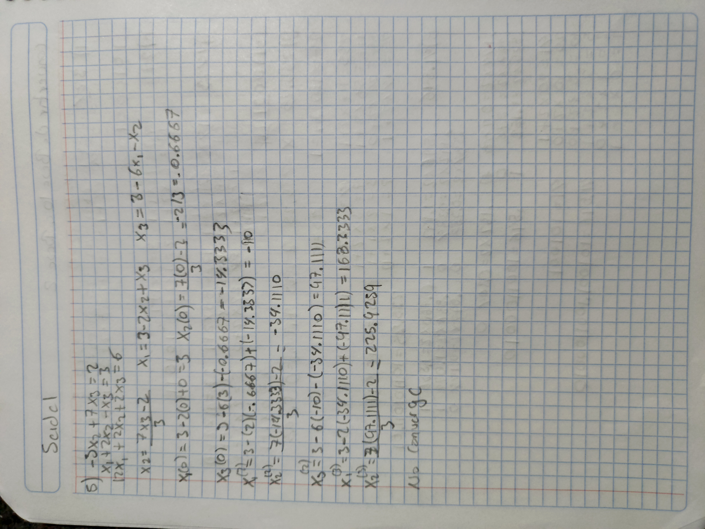{width=600}

#### Sistema: 6
$$
A = \begin{bmatrix}
0.15 & 2.11 & 30.75 & = & -26.38 \\
0.64 & 1.21 & 2.05 & = & 1.01 \\
3.21 & 1.53 & 1.04 & = & 5.23
\end{bmatrix}
$$

```{r}

A <- matrix(c(0.15,2.11,30.75,
              0.64,1.21,2.05,
              3.21,1.53,1.04), nrow = 3, byrow = TRUE)

b <- c(-26.38,1.01,5.23)

# Vector inicial x^(0)
x <- rep(0, 3)
cat("x^(0) =", paste(sprintf("%.8f", x), collapse = ", "), "\n")

#### Iteración 1
x_old <- x
cat("\nIteración 1\n")
# x1 = (b1 - a12*x2_old - a13*x3_old) / a11
x[1] <- (b[1] - A[1, 2] * x_old[2] - A[1, 3] * x_old[3]) / A[1, 1]
# x2 = (b2 - a21*x1_new - a23*x3_old) / a22
x[2] <- (b[2] - A[2, 1] * x[1] - A[2, 3] * x_old[3]) / A[2, 2]
# x3 = (b3 - a31*x1_new - a32*x2_new) / a33
x[3] <- (b[3] - A[3, 1] * x[1] - A[3, 2] * x[2]) / A[3, 3]

r <- b - A %*% x
dx_inf <- max(abs(x - x_old))
cat(sprintf("x^(1) = %s\n", paste(sprintf("%.8f", x), collapse = ", ")))
cat(sprintf("||dx||_inf = %.8e | ||r||_inf = %.8e\n", dx_inf, max(abs(r))))

#### Iteración 2
x_old <- x
cat("\nIteración 2\n")
# x1 = (b1 - a12*x2_old - a13*x3_old) / a11
x[1] <- (b[1] - A[1, 2] * x_old[2] - A[1, 3] * x_old[3]) / A[1, 1]
# x2 = (b2 - a21*x1_new - a23*x3_old) / a22
x[2] <- (b[2] - A[2, 1] * x[1] - A[2, 3] * x_old[3]) / A[2, 2]
# x3 = (b3 - a31*x1_new - a32*x2_new) / a33
x[3] <- (b[3] - A[3, 1] * x[1] - A[3, 2] * x[2]) / A[3, 3]

r <- b - A %*% x
dx_inf <- max(abs(x - x_old))
cat(sprintf("x^(2) = %s\n", paste(sprintf("%.8f", x), collapse = ", ")))
cat(sprintf("||dx||_inf = %.8e | ||r||_inf = %.8e\n", dx_inf, max(abs(r))))

#### Iteración 3
x_old <- x
cat("\nIteración 3\n")
# x1 = (b1 - a12*x2_old - a13*x3_old) / a11
x[1] <- (b[1] - A[1, 2] * x_old[2] - A[1, 3] * x_old[3]) / A[1, 1]
# x2 = (b2 - a21*x1_new - a23*x3_old) / a22
x[2] <- (b[2] - A[2, 1] * x[1] - A[2, 3] * x_old[3]) / A[2, 2]
# x3 = (b3 - a31*x1_new - a32*x2_new) / a33
x[3] <- (b[3] - A[3, 1] * x[1] - A[3, 2] * x[2]) / A[3, 3]

r <- b - A %*% x
dx_inf <- max(abs(x - x_old))
cat(sprintf("x^(3) = %s\n", paste(sprintf("%.8f", x), collapse = ", ")))
cat(sprintf("||dx||_inf = %.8e | ||r||_inf = %.8e\n", dx_inf, max(abs(r))))

#### Iteración 4
x_old <- x
cat("\nIteración 4\n")
# x1 = (b1 - a12*x2_old - a13*x3_old) / a11
x[1] <- (b[1] - A[1, 2] * x_old[2] - A[1, 3] * x_old[3]) / A[1, 1]
# x2 = (b2 - a21*x1_new - a23*x3_old) / a22
x[2] <- (b[2] - A[2, 1] * x[1] - A[2, 3] * x_old[3]) / A[2, 2]
# x3 = (b3 - a31*x1_new - a32*x2_new) / a33
x[3] <- (b[3] - A[3, 1] * x[1] - A[3, 2] * x[2]) / A[3, 3]

r <- b - A %*% x
dx_inf <- max(abs(x - x_old))
cat(sprintf("x^(4) = %s\n", paste(sprintf("%.8f", x), collapse = ", ")))
cat(sprintf("||dx||_inf = %.8e | ||r||_inf = %.8e\n", dx_inf, max(abs(r))))

#### Iteración 5
x_old <- x
cat("\nIteración 5\n")
# x1 = (b1 - a12*x2_old - a13*x3_old) / a11
x[1] <- (b[1] - A[1, 2] * x_old[2] - A[1, 3] * x_old[3]) / A[1, 1]
# x2 = (b2 - a21*x1_new - a23*x3_old) / a22
x[2] <- (b[2] - A[2, 1] * x[1] - A[2, 3] * x_old[3]) / A[2, 2]
# x3 = (b3 - a31*x1_new - a32*x2_new) / a33
x[3] <- (b[3] - A[3, 1] * x[1] - A[3, 2] * x[2]) / A[3, 3]

r <- b - A %*% x
dx_inf <- max(abs(x - x_old))
cat(sprintf("x^(5) = %s\n", paste(sprintf("%.8f", x), collapse = ", ")))
cat(sprintf("||dx||_inf = %.8e | ||r||_inf = %.8e\n", dx_inf, max(abs(r))))

#### Iteración 6
x_old <- x
cat("\nIteración 6\n")
# x1 = (b1 - a12*x2_old - a13*x3_old) / a11
x[1] <- (b[1] - A[1, 2] * x_old[2] - A[1, 3] * x_old[3]) / A[1, 1]
# x2 = (b2 - a21*x1_new - a23*x3_old) / a22
x[2] <- (b[2] - A[2, 1] * x[1] - A[2, 3] * x_old[3]) / A[2, 2]
# x3 = (b3 - a31*x1_new - a32*x2_new) / a33
x[3] <- (b[3] - A[3, 1] * x[1] - A[3, 2] * x[2]) / A[3, 3]

r <- b - A %*% x
dx_inf <- max(abs(x - x_old))
cat(sprintf("x^(6) = %s\n", paste(sprintf("%.8f", x), collapse = ", ")))
cat(sprintf("||dx||_inf = %.8e | ||r||_inf = %.8e\n", dx_inf, max(abs(r))))

#### Iteración 7
x_old <- x
cat("\nIteración 7\n")
# x1 = (b1 - a12*x2_old - a13*x3_old) / a11
x[1] <- (b[1] - A[1, 2] * x_old[2] - A[1, 3] * x_old[3]) / A[1, 1]
# x2 = (b2 - a21*x1_new - a23*x3_old) / a22
x[2] <- (b[2] - A[2, 1] * x[1] - A[2, 3] * x_old[3]) / A[2, 2]
# x3 = (b3 - a31*x1_new - a32*x2_new) / a33
x[3] <- (b[3] - A[3, 1] * x[1] - A[3, 2] * x[2]) / A[3, 3]

r <- b - A %*% x
dx_inf <- max(abs(x - x_old))
cat(sprintf("x^(7) = %s\n", paste(sprintf("%.8f", x), collapse = ", ")))
cat(sprintf("||dx||_inf = %.8e | ||r||_inf = %.8e\n", dx_inf, max(abs(r))))

#### Iteración 8
x_old <- x
cat("\nIteración 8\n")
# x1 = (b1 - a12*x2_old - a13*x3_old) / a11
x[1] <- (b[1] - A[1, 2] * x_old[2] - A[1, 3] * x_old[3]) / A[1, 1]
# x2 = (b2 - a21*x1_new - a23*x3_old) / a22
x[2] <- (b[2] - A[2, 1] * x[1] - A[2, 3] * x_old[3]) / A[2, 2]
# x3 = (b3 - a31*x1_new - a32*x2_new) / a33
x[3] <- (b[3] - A[3, 1] * x[1] - A[3, 2] * x[2]) / A[3, 3]

r <- b - A %*% x
dx_inf <- max(abs(x - x_old))
cat(sprintf("x^(8) = %s\n", paste(sprintf("%.8f", x), collapse = ", ")))
cat(sprintf("||dx||_inf = %.8e | ||r||_inf = %.8e\n", dx_inf, max(abs(r))))

#### Iteración 9
x_old <- x
cat("\nIteración 9\n")
# x1 = (b1 - a12*x2_old - a13*x3_old) / a11
x[1] <- (b[1] - A[1, 2] * x_old[2] - A[1, 3] * x_old[3]) / A[1, 1]
# x2 = (b2 - a21*x1_new - a23*x3_old) / a22
x[2] <- (b[2] - A[2, 1] * x[1] - A[2, 3] * x_old[3]) / A[2, 2]
# x3 = (b3 - a31*x1_new - a32*x2_new) / a33
x[3] <- (b[3] - A[3, 1] * x[1] - A[3, 2] * x[2]) / A[3, 3]

r <- b - A %*% x
dx_inf <- max(abs(x - x_old))
cat(sprintf("x^(9) = %s\n", paste(sprintf("%.8f", x), collapse = ", ")))
cat(sprintf("||dx||_inf = %.8e | ||r||_inf = %.8e\n", dx_inf, max(abs(r))))

#### Iteración 10
x_old <- x
cat("\nIteración 10\n")
# x1 = (b1 - a12*x2_old - a13*x3_old) / a11
x[1] <- (b[1] - A[1, 2] * x_old[2] - A[1, 3] * x_old[3]) / A[1, 1]
# x2 = (b2 - a21*x1_new - a23*x3_old) / a22
x[2] <- (b[2] - A[2, 1] * x[1] - A[2, 3] * x_old[3]) / A[2, 2]
# x3 = (b3 - a31*x1_new - a32*x2_new) / a33
x[3] <- (b[3] - A[3, 1] * x[1] - A[3, 2] * x[2]) / A[3, 3]

r <- b - A %*% x
dx_inf <- max(abs(x - x_old))
cat(sprintf("x^(10) = %s\n", paste(sprintf("%.8f", x), collapse = ", ")))
cat(sprintf("||dx||_inf = %.8e | ||r||_inf = %.8e\n", dx_inf, max(abs(r))))

#### Iteración 11
x_old <- x
cat("\nIteración 11\n")
# x1 = (b1 - a12*x2_old - a13*x3_old) / a11
x[1] <- (b[1] - A[1, 2] * x_old[2] - A[1, 3] * x_old[3]) / A[1, 1]
# x2 = (b2 - a21*x1_new - a23*x3_old) / a22
x[2] <- (b[2] - A[2, 1] * x[1] - A[2, 3] * x_old[3]) / A[2, 2]
# x3 = (b3 - a31*x1_new - a32*x2_new) / a33
x[3] <- (b[3] - A[3, 1] * x[1] - A[3, 2] * x[2]) / A[3, 3]

r <- b - A %*% x
dx_inf <- max(abs(x - x_old))
cat(sprintf("x^(11) = %s\n", paste(sprintf("%.8f", x), collapse = ", ")))
cat(sprintf("||dx||_inf = %.8e | ||r||_inf = %.8e\n", dx_inf, max(abs(r))))

#### Iteración 12
x_old <- x
cat("\nIteración 12\n")
# x1 = (b1 - a12*x2_old - a13*x3_old) / a11
x[1] <- (b[1] - A[1, 2] * x_old[2] - A[1, 3] * x_old[3]) / A[1, 1]
# x2 = (b2 - a21*x1_new - a23*x3_old) / a22
x[2] <- (b[2] - A[2, 1] * x[1] - A[2, 3] * x_old[3]) / A[2, 2]
# x3 = (b3 - a31*x1_new - a32*x2_new) / a33
x[3] <- (b[3] - A[3, 1] * x[1] - A[3, 2] * x[2]) / A[3, 3]

r <- b - A %*% x
dx_inf <- max(abs(x - x_old))
cat(sprintf("x^(12) = %s\n", paste(sprintf("%.8f", x), collapse = ", ")))
cat(sprintf("||dx||_inf = %.8e | ||r||_inf = %.8e\n", dx_inf, max(abs(r))))

#### Iteración 13
x_old <- x
cat("\nIteración 13\n")
# x1 = (b1 - a12*x2_old - a13*x3_old) / a11
x[1] <- (b[1] - A[1, 2] * x_old[2] - A[1, 3] * x_old[3]) / A[1, 1]
# x2 = (b2 - a21*x1_new - a23*x3_old) / a22
x[2] <- (b[2] - A[2, 1] * x[1] - A[2, 3] * x_old[3]) / A[2, 2]
# x3 = (b3 - a31*x1_new - a32*x2_new) / a33
x[3] <- (b[3] - A[3, 1] * x[1] - A[3, 2] * x[2]) / A[3, 3]

r <- b - A %*% x
dx_inf <- max(abs(x - x_old))
cat(sprintf("x^(13) = %s\n", paste(sprintf("%.8f", x), collapse = ", ")))
cat(sprintf("||dx||_inf = %.8e | ||r||_inf = %.8e\n", dx_inf, max(abs(r))))

#### Iteración 14
x_old <- x
cat("\nIteración 14\n")
# x1 = (b1 - a12*x2_old - a13*x3_old) / a11
x[1] <- (b[1] - A[1, 2] * x_old[2] - A[1, 3] * x_old[3]) / A[1, 1]
# x2 = (b2 - a21*x1_new - a23*x3_old) / a22
x[2] <- (b[2] - A[2, 1] * x[1] - A[2, 3] * x_old[3]) / A[2, 2]
# x3 = (b3 - a31*x1_new - a32*x2_new) / a33
x[3] <- (b[3] - A[3, 1] * x[1] - A[3, 2] * x[2]) / A[3, 3]

r <- b - A %*% x
dx_inf <- max(abs(x - x_old))
cat(sprintf("x^(14) = %s\n", paste(sprintf("%.8f", x), collapse = ", ")))
cat(sprintf("||dx||_inf = %.8e | ||r||_inf = %.8e\n", dx_inf, max(abs(r))))

#### Iteración 15
x_old <- x
cat("\nIteración 15\n")
# x1 = (b1 - a12*x2_old - a13*x3_old) / a11
x[1] <- (b[1] - A[1, 2] * x_old[2] - A[1, 3] * x_old[3]) / A[1, 1]
# x2 = (b2 - a21*x1_new - a23*x3_old) / a22
x[2] <- (b[2] - A[2, 1] * x[1] - A[2, 3] * x_old[3]) / A[2, 2]
# x3 = (b3 - a31*x1_new - a32*x2_new) / a33
x[3] <- (b[3] - A[3, 1] * x[1] - A[3, 2] * x[2]) / A[3, 3]

r <- b - A %*% x
dx_inf <- max(abs(x - x_old))
cat(sprintf("x^(15) = %s\n", paste(sprintf("%.8f", x), collapse = ", ")))
cat(sprintf("||dx||_inf = %.8e | ||r||_inf = %.8e\n", dx_inf, max(abs(r))))

#### Iteración 16
x_old <- x
cat("\nIteración 16\n")
# x1 = (b1 - a12*x2_old - a13*x3_old) / a11
x[1] <- (b[1] - A[1, 2] * x_old[2] - A[1, 3] * x_old[3]) / A[1, 1]
# x2 = (b2 - a21*x1_new - a23*x3_old) / a22
x[2] <- (b[2] - A[2, 1] * x[1] - A[2, 3] * x_old[3]) / A[2, 2]
# x3 = (b3 - a31*x1_new - a32*x2_new) / a33
x[3] <- (b[3] - A[3, 1] * x[1] - A[3, 2] * x[2]) / A[3, 3]

r <- b - A %*% x
dx_inf <- max(abs(x - x_old))
cat(sprintf("x^(16) = %s\n", paste(sprintf("%.8f", x), collapse = ", ")))
cat(sprintf("||dx||_inf = %.8e | ||r||_inf = %.8e\n", dx_inf, max(abs(r))))

#### Iteración 17
x_old <- x
cat("\nIteración 17\n")
# x1 = (b1 - a12*x2_old - a13*x3_old) / a11
x[1] <- (b[1] - A[1, 2] * x_old[2] - A[1, 3] * x_old[3]) / A[1, 1]
# x2 = (b2 - a21*x1_new - a23*x3_old) / a22
x[2] <- (b[2] - A[2, 1] * x[1] - A[2, 3] * x_old[3]) / A[2, 2]
# x3 = (b3 - a31*x1_new - a32*x2_new) / a33
x[3] <- (b[3] - A[3, 1] * x[1] - A[3, 2] * x[2]) / A[3, 3]

r <- b - A %*% x
dx_inf <- max(abs(x - x_old))
cat(sprintf("x^(17) = %s\n", paste(sprintf("%.8f", x), collapse = ", ")))
cat(sprintf("||dx||_inf = %.8e | ||r||_inf = %.8e\n", dx_inf, max(abs(r))))

#### Iteración 18
x_old <- x
cat("\nIteración 18\n")
# x1 = (b1 - a12*x2_old - a13*x3_old) / a11
x[1] <- (b[1] - A[1, 2] * x_old[2] - A[1, 3] * x_old[3]) / A[1, 1]
# x2 = (b2 - a21*x1_new - a23*x3_old) / a22
x[2] <- (b[2] - A[2, 1] * x[1] - A[2, 3] * x_old[3]) / A[2, 2]
# x3 = (b3 - a31*x1_new - a32*x2_new) / a33
x[3] <- (b[3] - A[3, 1] * x[1] - A[3, 2] * x[2]) / A[3, 3]

r <- b - A %*% x
dx_inf <- max(abs(x - x_old))
cat(sprintf("x^(18) = %s\n", paste(sprintf("%.8f", x), collapse = ", ")))
cat(sprintf("||dx||_inf = %.8e | ||r||_inf = %.8e\n", dx_inf, max(abs(r))))

#### Iteración 19
x_old <- x
cat("\nIteración 19\n")
# x1 = (b1 - a12*x2_old - a13*x3_old) / a11
x[1] <- (b[1] - A[1, 2] * x_old[2] - A[1, 3] * x_old[3]) / A[1, 1]
# x2 = (b2 - a21*x1_new - a23*x3_old) / a22
x[2] <- (b[2] - A[2, 1] * x[1] - A[2, 3] * x_old[3]) / A[2, 2]
# x3 = (b3 - a31*x1_new - a32*x2_new) / a33
x[3] <- (b[3] - A[3, 1] * x[1] - A[3, 2] * x[2]) / A[3, 3]

r <- b - A %*% x
dx_inf <- max(abs(x - x_old))
cat(sprintf("x^(19) = %s\n", paste(sprintf("%.8f", x), collapse = ", ")))
cat(sprintf("||dx||_inf = %.8e | ||r||_inf = %.8e\n", dx_inf, max(abs(r))))

#### Iteración 20
x_old <- x
cat("\nIteración 20\n")
# x1 = (b1 - a12*x2_old - a13*x3_old) / a11
x[1] <- (b[1] - A[1, 2] * x_old[2] - A[1, 3] * x_old[3]) / A[1, 1]
# x2 = (b2 - a21*x1_new - a23*x3_old) / a22
x[2] <- (b[2] - A[2, 1] * x[1] - A[2, 3] * x_old[3]) / A[2, 2]
# x3 = (b3 - a31*x1_new - a32*x2_new) / a33
x[3] <- (b[3] - A[3, 1] * x[1] - A[3, 2] * x[2]) / A[3, 3]

r <- b - A %*% x
dx_inf <- max(abs(x - x_old))
cat(sprintf("x^(20) = %s\n", paste(sprintf("%.8f", x), collapse = ", ")))
cat(sprintf("||dx||_inf = %.8e | ||r||_inf = %.8e\n", dx_inf, max(abs(r))))

cat("Solución aproximada después de 20 iteraciones:\n")
print(round(x, 8))
####no converge
```

#### Sistema: 7
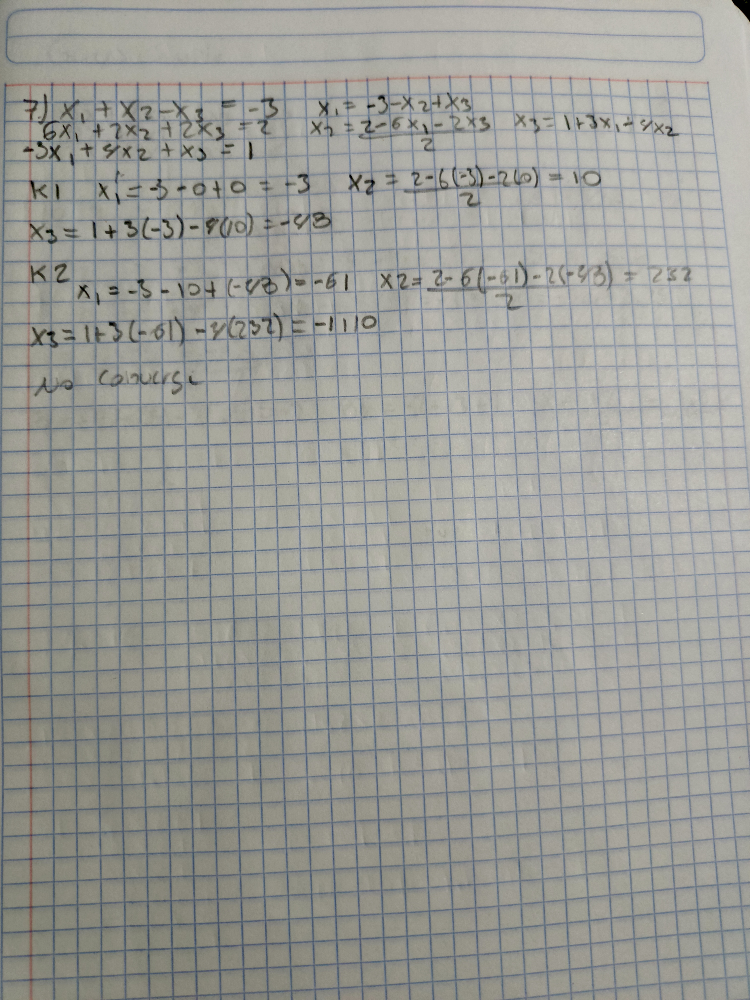{width=600}

#### Sistema: 8
$$
A = \begin{bmatrix}
2 & 1 & -1 &  = & 1 \\
5 & 2 & 2 &  = & -4 \\
3 & 1 & 1 &  = & 5
\end{bmatrix}
$$
 
```{r}

A <- matrix(c(2,1,-1,
              5,2,2,
              3,1,1), nrow = 3, byrow = TRUE)

b <- c(1,-4,5)

# Vector inicial x^(0)
x <- rep(0, 3)
cat("x^(0) =", paste(sprintf("%.8f", x), collapse = ", "), "\n")

#### Iteración 1
x_old <- x
cat("\nIteración 1\n")
# x1 = (b1 - a12*x2_old - a13*x3_old) / a11
x[1] <- (b[1] - A[1, 2] * x_old[2] - A[1, 3] * x_old[3]) / A[1, 1]
# x2 = (b2 - a21*x1_new - a23*x3_old) / a22
x[2] <- (b[2] - A[2, 1] * x[1] - A[2, 3] * x_old[3]) / A[2, 2]
# x3 = (b3 - a31*x1_new - a32*x2_new) / a33
x[3] <- (b[3] - A[3, 1] * x[1] - A[3, 2] * x[2]) / A[3, 3]

r <- b - A %*% x
dx_inf <- max(abs(x - x_old))
cat(sprintf("x^(1) = %s\n", paste(sprintf("%.8f", x), collapse = ", ")))
cat(sprintf("||dx||_inf = %.8e | ||r||_inf = %.8e\n", dx_inf, max(abs(r))))

#### Iteración 2
x_old <- x
cat("\nIteración 2\n")
# x1 = (b1 - a12*x2_old - a13*x3_old) / a11
x[1] <- (b[1] - A[1, 2] * x_old[2] - A[1, 3] * x_old[3]) / A[1, 1]
# x2 = (b2 - a21*x1_new - a23*x3_old) / a22
x[2] <- (b[2] - A[2, 1] * x[1] - A[2, 3] * x_old[3]) / A[2, 2]
# x3 = (b3 - a31*x1_new - a32*x2_new) / a33
x[3] <- (b[3] - A[3, 1] * x[1] - A[3, 2] * x[2]) / A[3, 3]

r <- b - A %*% x
dx_inf <- max(abs(x - x_old))
cat(sprintf("x^(2) = %s\n", paste(sprintf("%.8f", x), collapse = ", ")))
cat(sprintf("||dx||_inf = %.8e | ||r||_inf = %.8e\n", dx_inf, max(abs(r))))

#### Iteración 3
x_old <- x
cat("\nIteración 3\n")
# x1 = (b1 - a12*x2_old - a13*x3_old) / a11
x[1] <- (b[1] - A[1, 2] * x_old[2] - A[1, 3] * x_old[3]) / A[1, 1]
# x2 = (b2 - a21*x1_new - a23*x3_old) / a22
x[2] <- (b[2] - A[2, 1] * x[1] - A[2, 3] * x_old[3]) / A[2, 2]
# x3 = (b3 - a31*x1_new - a32*x2_new) / a33
x[3] <- (b[3] - A[3, 1] * x[1] - A[3, 2] * x[2]) / A[3, 3]

r <- b - A %*% x
dx_inf <- max(abs(x - x_old))
cat(sprintf("x^(3) = %s\n", paste(sprintf("%.8f", x), collapse = ", ")))
cat(sprintf("||dx||_inf = %.8e | ||r||_inf = %.8e\n", dx_inf, max(abs(r))))

#### Iteración 4
x_old <- x
cat("\nIteración 4\n")
# x1 = (b1 - a12*x2_old - a13*x3_old) / a11
x[1] <- (b[1] - A[1, 2] * x_old[2] - A[1, 3] * x_old[3]) / A[1, 1]
# x2 = (b2 - a21*x1_new - a23*x3_old) / a22
x[2] <- (b[2] - A[2, 1] * x[1] - A[2, 3] * x_old[3]) / A[2, 2]
# x3 = (b3 - a31*x1_new - a32*x2_new) / a33
x[3] <- (b[3] - A[3, 1] * x[1] - A[3, 2] * x[2]) / A[3, 3]

r <- b - A %*% x
dx_inf <- max(abs(x - x_old))
cat(sprintf("x^(4) = %s\n", paste(sprintf("%.8f", x), collapse = ", ")))
cat(sprintf("||dx||_inf = %.8e | ||r||_inf = %.8e\n", dx_inf, max(abs(r))))

#### Iteración 5
x_old <- x
cat("\nIteración 5\n")
# x1 = (b1 - a12*x2_old - a13*x3_old) / a11
x[1] <- (b[1] - A[1, 2] * x_old[2] - A[1, 3] * x_old[3]) / A[1, 1]
# x2 = (b2 - a21*x1_new - a23*x3_old) / a22
x[2] <- (b[2] - A[2, 1] * x[1] - A[2, 3] * x_old[3]) / A[2, 2]
# x3 = (b3 - a31*x1_new - a32*x2_new) / a33
x[3] <- (b[3] - A[3, 1] * x[1] - A[3, 2] * x[2]) / A[3, 3]

r <- b - A %*% x
dx_inf <- max(abs(x - x_old))
cat(sprintf("x^(5) = %s\n", paste(sprintf("%.8f", x), collapse = ", ")))
cat(sprintf("||dx||_inf = %.8e | ||r||_inf = %.8e\n", dx_inf, max(abs(r))))

#### Iteración 6
x_old <- x
cat("\nIteración 6\n")
# x1 = (b1 - a12*x2_old - a13*x3_old) / a11
x[1] <- (b[1] - A[1, 2] * x_old[2] - A[1, 3] * x_old[3]) / A[1, 1]
# x2 = (b2 - a21*x1_new - a23*x3_old) / a22
x[2] <- (b[2] - A[2, 1] * x[1] - A[2, 3] * x_old[3]) / A[2, 2]
# x3 = (b3 - a31*x1_new - a32*x2_new) / a33
x[3] <- (b[3] - A[3, 1] * x[1] - A[3, 2] * x[2]) / A[3, 3]

r <- b - A %*% x
dx_inf <- max(abs(x - x_old))
cat(sprintf("x^(6) = %s\n", paste(sprintf("%.8f", x), collapse = ", ")))
cat(sprintf("||dx||_inf = %.8e | ||r||_inf = %.8e\n", dx_inf, max(abs(r))))

#### Iteración 7
x_old <- x
cat("\nIteración 7\n")
# x1 = (b1 - a12*x2_old - a13*x3_old) / a11
x[1] <- (b[1] - A[1, 2] * x_old[2] - A[1, 3] * x_old[3]) / A[1, 1]
# x2 = (b2 - a21*x1_new - a23*x3_old) / a22
x[2] <- (b[2] - A[2, 1] * x[1] - A[2, 3] * x_old[3]) / A[2, 2]
# x3 = (b3 - a31*x1_new - a32*x2_new) / a33
x[3] <- (b[3] - A[3, 1] * x[1] - A[3, 2] * x[2]) / A[3, 3]

r <- b - A %*% x
dx_inf <- max(abs(x - x_old))
cat(sprintf("x^(7) = %s\n", paste(sprintf("%.8f", x), collapse = ", ")))
cat(sprintf("||dx||_inf = %.8e | ||r||_inf = %.8e\n", dx_inf, max(abs(r))))

#### Iteración 8
x_old <- x
cat("\nIteración 8\n")
# x1 = (b1 - a12*x2_old - a13*x3_old) / a11
x[1] <- (b[1] - A[1, 2] * x_old[2] - A[1, 3] * x_old[3]) / A[1, 1]
# x2 = (b2 - a21*x1_new - a23*x3_old) / a22
x[2] <- (b[2] - A[2, 1] * x[1] - A[2, 3] * x_old[3]) / A[2, 2]
# x3 = (b3 - a31*x1_new - a32*x2_new) / a33
x[3] <- (b[3] - A[3, 1] * x[1] - A[3, 2] * x[2]) / A[3, 3]

r <- b - A %*% x
dx_inf <- max(abs(x - x_old))
cat(sprintf("x^(8) = %s\n", paste(sprintf("%.8f", x), collapse = ", ")))
cat(sprintf("||dx||_inf = %.8e | ||r||_inf = %.8e\n", dx_inf, max(abs(r))))

#### Iteración 9
x_old <- x
cat("\nIteración 9\n")
# x1 = (b1 - a12*x2_old - a13*x3_old) / a11
x[1] <- (b[1] - A[1, 2] * x_old[2] - A[1, 3] * x_old[3]) / A[1, 1]
# x2 = (b2 - a21*x1_new - a23*x3_old) / a22
x[2] <- (b[2] - A[2, 1] * x[1] - A[2, 3] * x_old[3]) / A[2, 2]
# x3 = (b3 - a31*x1_new - a32*x2_new) / a33
x[3] <- (b[3] - A[3, 1] * x[1] - A[3, 2] * x[2]) / A[3, 3]

r <- b - A %*% x
dx_inf <- max(abs(x - x_old))
cat(sprintf("x^(9) = %s\n", paste(sprintf("%.8f", x), collapse = ", ")))
cat(sprintf("||dx||_inf = %.8e | ||r||_inf = %.8e\n", dx_inf, max(abs(r))))

#### Iteración 10
x_old <- x
cat("\nIteración 10\n")
# x1 = (b1 - a12*x2_old - a13*x3_old) / a11
x[1] <- (b[1] - A[1, 2] * x_old[2] - A[1, 3] * x_old[3]) / A[1, 1]
# x2 = (b2 - a21*x1_new - a23*x3_old) / a22
x[2] <- (b[2] - A[2, 1] * x[1] - A[2, 3] * x_old[3]) / A[2, 2]
# x3 = (b3 - a31*x1_new - a32*x2_new) / a33
x[3] <- (b[3] - A[3, 1] * x[1] - A[3, 2] * x[2]) / A[3, 3]

r <- b - A %*% x
dx_inf <- max(abs(x - x_old))
cat(sprintf("x^(10) = %s\n", paste(sprintf("%.8f", x), collapse = ", ")))
cat(sprintf("||dx||_inf = %.8e | ||r||_inf = %.8e\n", dx_inf, max(abs(r))))

#### Iteración 11
x_old <- x
cat("\nIteración 11\n")
# x1 = (b1 - a12*x2_old - a13*x3_old) / a11
x[1] <- (b[1] - A[1, 2] * x_old[2] - A[1, 3] * x_old[3]) / A[1, 1]
# x2 = (b2 - a21*x1_new - a23*x3_old) / a22
x[2] <- (b[2] - A[2, 1] * x[1] - A[2, 3] * x_old[3]) / A[2, 2]
# x3 = (b3 - a31*x1_new - a32*x2_new) / a33
x[3] <- (b[3] - A[3, 1] * x[1] - A[3, 2] * x[2]) / A[3, 3]

r <- b - A %*% x
dx_inf <- max(abs(x - x_old))
cat(sprintf("x^(11) = %s\n", paste(sprintf("%.8f", x), collapse = ", ")))
cat(sprintf("||dx||_inf = %.8e | ||r||_inf = %.8e\n", dx_inf, max(abs(r))))

#### Iteración 12
x_old <- x
cat("\nIteración 12\n")
# x1 = (b1 - a12*x2_old - a13*x3_old) / a11
x[1] <- (b[1] - A[1, 2] * x_old[2] - A[1, 3] * x_old[3]) / A[1, 1]
# x2 = (b2 - a21*x1_new - a23*x3_old) / a22
x[2] <- (b[2] - A[2, 1] * x[1] - A[2, 3] * x_old[3]) / A[2, 2]
# x3 = (b3 - a31*x1_new - a32*x2_new) / a33
x[3] <- (b[3] - A[3, 1] * x[1] - A[3, 2] * x[2]) / A[3, 3]

r <- b - A %*% x
dx_inf <- max(abs(x - x_old))
cat(sprintf("x^(12) = %s\n", paste(sprintf("%.8f", x), collapse = ", ")))
cat(sprintf("||dx||_inf = %.8e | ||r||_inf = %.8e\n", dx_inf, max(abs(r))))

#### Iteración 13
x_old <- x
cat("\nIteración 13\n")
# x1 = (b1 - a12*x2_old - a13*x3_old) / a11
x[1] <- (b[1] - A[1, 2] * x_old[2] - A[1, 3] * x_old[3]) / A[1, 1]
# x2 = (b2 - a21*x1_new - a23*x3_old) / a22
x[2] <- (b[2] - A[2, 1] * x[1] - A[2, 3] * x_old[3]) / A[2, 2]
# x3 = (b3 - a31*x1_new - a32*x2_new) / a33
x[3] <- (b[3] - A[3, 1] * x[1] - A[3, 2] * x[2]) / A[3, 3]

r <- b - A %*% x
dx_inf <- max(abs(x - x_old))
cat(sprintf("x^(13) = %s\n", paste(sprintf("%.8f", x), collapse = ", ")))
cat(sprintf("||dx||_inf = %.8e | ||r||_inf = %.8e\n", dx_inf, max(abs(r))))

#### Iteración 14
x_old <- x
cat("\nIteración 14\n")
# x1 = (b1 - a12*x2_old - a13*x3_old) / a11
x[1] <- (b[1] - A[1, 2] * x_old[2] - A[1, 3] * x_old[3]) / A[1, 1]
# x2 = (b2 - a21*x1_new - a23*x3_old) / a22
x[2] <- (b[2] - A[2, 1] * x[1] - A[2, 3] * x_old[3]) / A[2, 2]
# x3 = (b3 - a31*x1_new - a32*x2_new) / a33
x[3] <- (b[3] - A[3, 1] * x[1] - A[3, 2] * x[2]) / A[3, 3]

r <- b - A %*% x
dx_inf <- max(abs(x - x_old))
cat(sprintf("x^(14) = %s\n", paste(sprintf("%.8f", x), collapse = ", ")))
cat(sprintf("||dx||_inf = %.8e | ||r||_inf = %.8e\n", dx_inf, max(abs(r))))

#### Iteración 15
x_old <- x
cat("\nIteración 15\n")
# x1 = (b1 - a12*x2_old - a13*x3_old) / a11
x[1] <- (b[1] - A[1, 2] * x_old[2] - A[1, 3] * x_old[3]) / A[1, 1]
# x2 = (b2 - a21*x1_new - a23*x3_old) / a22
x[2] <- (b[2] - A[2, 1] * x[1] - A[2, 3] * x_old[3]) / A[2, 2]
# x3 = (b3 - a31*x1_new - a32*x2_new) / a33
x[3] <- (b[3] - A[3, 1] * x[1] - A[3, 2] * x[2]) / A[3, 3]

r <- b - A %*% x
dx_inf <- max(abs(x - x_old))
cat(sprintf("x^(15) = %s\n", paste(sprintf("%.8f", x), collapse = ", ")))
cat(sprintf("||dx||_inf = %.8e | ||r||_inf = %.8e\n", dx_inf, max(abs(r))))

#### Iteración 16
x_old <- x
cat("\nIteración 16\n")
# x1 = (b1 - a12*x2_old - a13*x3_old) / a11
x[1] <- (b[1] - A[1, 2] * x_old[2] - A[1, 3] * x_old[3]) / A[1, 1]
# x2 = (b2 - a21*x1_new - a23*x3_old) / a22
x[2] <- (b[2] - A[2, 1] * x[1] - A[2, 3] * x_old[3]) / A[2, 2]
# x3 = (b3 - a31*x1_new - a32*x2_new) / a33
x[3] <- (b[3] - A[3, 1] * x[1] - A[3, 2] * x[2]) / A[3, 3]

r <- b - A %*% x
dx_inf <- max(abs(x - x_old))
cat(sprintf("x^(16) = %s\n", paste(sprintf("%.8f", x), collapse = ", ")))
cat(sprintf("||dx||_inf = %.8e | ||r||_inf = %.8e\n", dx_inf, max(abs(r))))

#### Iteración 17
x_old <- x
cat("\nIteración 17\n")
# x1 = (b1 - a12*x2_old - a13*x3_old) / a11
x[1] <- (b[1] - A[1, 2] * x_old[2] - A[1, 3] * x_old[3]) / A[1, 1]
# x2 = (b2 - a21*x1_new - a23*x3_old) / a22
x[2] <- (b[2] - A[2, 1] * x[1] - A[2, 3] * x_old[3]) / A[2, 2]
# x3 = (b3 - a31*x1_new - a32*x2_new) / a33
x[3] <- (b[3] - A[3, 1] * x[1] - A[3, 2] * x[2]) / A[3, 3]

r <- b - A %*% x
dx_inf <- max(abs(x - x_old))
cat(sprintf("x^(17) = %s\n", paste(sprintf("%.8f", x), collapse = ", ")))
cat(sprintf("||dx||_inf = %.8e | ||r||_inf = %.8e\n", dx_inf, max(abs(r))))

#### Iteración 18
x_old <- x
cat("\nIteración 18\n")
# x1 = (b1 - a12*x2_old - a13*x3_old) / a11
x[1] <- (b[1] - A[1, 2] * x_old[2] - A[1, 3] * x_old[3]) / A[1, 1]
# x2 = (b2 - a21*x1_new - a23*x3_old) / a22
x[2] <- (b[2] - A[2, 1] * x[1] - A[2, 3] * x_old[3]) / A[2, 2]
# x3 = (b3 - a31*x1_new - a32*x2_new) / a33
x[3] <- (b[3] - A[3, 1] * x[1] - A[3, 2] * x[2]) / A[3, 3]

r <- b - A %*% x
dx_inf <- max(abs(x - x_old))
cat(sprintf("x^(18) = %s\n", paste(sprintf("%.8f", x), collapse = ", ")))
cat(sprintf("||dx||_inf = %.8e | ||r||_inf = %.8e\n", dx_inf, max(abs(r))))

#### Iteración 19
x_old <- x
cat("\nIteración 19\n")
# x1 = (b1 - a12*x2_old - a13*x3_old) / a11
x[1] <- (b[1] - A[1, 2] * x_old[2] - A[1, 3] * x_old[3]) / A[1, 1]
# x2 = (b2 - a21*x1_new - a23*x3_old) / a22
x[2] <- (b[2] - A[2, 1] * x[1] - A[2, 3] * x_old[3]) / A[2, 2]
# x3 = (b3 - a31*x1_new - a32*x2_new) / a33
x[3] <- (b[3] - A[3, 1] * x[1] - A[3, 2] * x[2]) / A[3, 3]

r <- b - A %*% x
dx_inf <- max(abs(x - x_old))
cat(sprintf("x^(19) = %s\n", paste(sprintf("%.8f", x), collapse = ", ")))
cat(sprintf("||dx||_inf = %.8e | ||r||_inf = %.8e\n", dx_inf, max(abs(r))))

#### Iteración 20
x_old <- x
cat("\nIteración 20\n")
# x1 = (b1 - a12*x2_old - a13*x3_old) / a11
x[1] <- (b[1] - A[1, 2] * x_old[2] - A[1, 3] * x_old[3]) / A[1, 1]
# x2 = (b2 - a21*x1_new - a23*x3_old) / a22
x[2] <- (b[2] - A[2, 1] * x[1] - A[2, 3] * x_old[3]) / A[2, 2]
# x3 = (b3 - a31*x1_new - a32*x2_new) / a33
x[3] <- (b[3] - A[3, 1] * x[1] - A[3, 2] * x[2]) / A[3, 3]

r <- b - A %*% x
dx_inf <- max(abs(x - x_old))
cat(sprintf("x^(20) = %s\n", paste(sprintf("%.8f", x), collapse = ", ")))
cat(sprintf("||dx||_inf = %.8e | ||r||_inf = %.8e\n", dx_inf, max(abs(r))))

cat("Solución aproximada después de 20 iteraciones:\n")
print(round(x, 8))
#####no converge
```
 
#### Sistema: 9 
$$
A = \begin{bmatrix}
3 & -0.1 & -0.2 &  = & 7.85 \\
0.1 & 7 & -0.3 &  = & -19.3 \\
0.3 & -0.2 & 10 &  = & 71.4
\end{bmatrix}
$$


```{r}

A <- matrix(c(3,-0.1,-0.2,
              0.1,7,-0.3,
              0.3,-0.2,10), nrow = 3, byrow = TRUE)

b <- c(7.85, -19.3, 71.4)

# Vector inicial x^(0)
x <- rep(0, 3)
cat("x^(0) =", paste(sprintf("%.8f", x), collapse = ", "), "\n")

#### Iteración 1
x_old <- x
cat("\nIteración 1\n")
# x1 = (b1 - a12*x2_old - a13*x3_old) / a11
x[1] <- (b[1] - A[1, 2] * x_old[2] - A[1, 3] * x_old[3]) / A[1, 1]
# x2 = (b2 - a21*x1_new - a23*x3_old) / a22
x[2] <- (b[2] - A[2, 1] * x[1] - A[2, 3] * x_old[3]) / A[2, 2]
# x3 = (b3 - a31*x1_new - a32*x2_new) / a33
x[3] <- (b[3] - A[3, 1] * x[1] - A[3, 2] * x[2]) / A[3, 3]

r <- b - A %*% x
dx_inf <- max(abs(x - x_old))
cat(sprintf("x^(1) = %s\n", paste(sprintf("%.8f", x), collapse = ", ")))
cat(sprintf("||dx||_inf = %.8e | ||r||_inf = %.8e\n", dx_inf, max(abs(r))))

#### Iteración 2
x_old <- x
cat("\nIteración 2\n")
# x1 = (b1 - a12*x2_old - a13*x3_old) / a11
x[1] <- (b[1] - A[1, 2] * x_old[2] - A[1, 3] * x_old[3]) / A[1, 1]
# x2 = (b2 - a21*x1_new - a23*x3_old) / a22
x[2] <- (b[2] - A[2, 1] * x[1] - A[2, 3] * x_old[3]) / A[2, 2]
# x3 = (b3 - a31*x1_new - a32*x2_new) / a33
x[3] <- (b[3] - A[3, 1] * x[1] - A[3, 2] * x[2]) / A[3, 3]

r <- b - A %*% x
dx_inf <- max(abs(x - x_old))
cat(sprintf("x^(2) = %s\n", paste(sprintf("%.8f", x), collapse = ", ")))
cat(sprintf("||dx||_inf = %.8e | ||r||_inf = %.8e\n", dx_inf, max(abs(r))))

#### Iteración 3
x_old <- x
cat("\nIteración 3\n")
# x1 = (b1 - a12*x2_old - a13*x3_old) / a11
x[1] <- (b[1] - A[1, 2] * x_old[2] - A[1, 3] * x_old[3]) / A[1, 1]
# x2 = (b2 - a21*x1_new - a23*x3_old) / a22
x[2] <- (b[2] - A[2, 1] * x[1] - A[2, 3] * x_old[3]) / A[2, 2]
# x3 = (b3 - a31*x1_new - a32*x2_new) / a33
x[3] <- (b[3] - A[3, 1] * x[1] - A[3, 2] * x[2]) / A[3, 3]

r <- b - A %*% x
dx_inf <- max(abs(x - x_old))
cat(sprintf("x^(3) = %s\n", paste(sprintf("%.8f", x), collapse = ", ")))
cat(sprintf("||dx||_inf = %.8e | ||r||_inf = %.8e\n", dx_inf, max(abs(r))))

#### Iteración 4
x_old <- x
cat("\nIteración 4\n")
# x1 = (b1 - a12*x2_old - a13*x3_old) / a11
x[1] <- (b[1] - A[1, 2] * x_old[2] - A[1, 3] * x_old[3]) / A[1, 1]
# x2 = (b2 - a21*x1_new - a23*x3_old) / a22
x[2] <- (b[2] - A[2, 1] * x[1] - A[2, 3] * x_old[3]) / A[2, 2]
# x3 = (b3 - a31*x1_new - a32*x2_new) / a33
x[3] <- (b[3] - A[3, 1] * x[1] - A[3, 2] * x[2]) / A[3, 3]

r <- b - A %*% x
dx_inf <- max(abs(x - x_old))
cat(sprintf("x^(4) = %s\n", paste(sprintf("%.8f", x), collapse = ", ")))
cat(sprintf("||dx||_inf = %.8e | ||r||_inf = %.8e\n", dx_inf, max(abs(r))))

#### Iteración 5
x_old <- x
cat("\nIteración 5\n")
# x1 = (b1 - a12*x2_old - a13*x3_old) / a11
x[1] <- (b[1] - A[1, 2] * x_old[2] - A[1, 3] * x_old[3]) / A[1, 1]
# x2 = (b2 - a21*x1_new - a23*x3_old) / a22
x[2] <- (b[2] - A[2, 1] * x[1] - A[2, 3] * x_old[3]) / A[2, 2]
# x3 = (b3 - a31*x1_new - a32*x2_new) / a33
x[3] <- (b[3] - A[3, 1] * x[1] - A[3, 2] * x[2]) / A[3, 3]

r <- b - A %*% x
dx_inf <- max(abs(x - x_old))
cat(sprintf("x^(5) = %s\n", paste(sprintf("%.8f", x), collapse = ", ")))
cat(sprintf("||dx||_inf = %.8e | ||r||_inf = %.8e\n", dx_inf, max(abs(r))))

#### Iteración 6
x_old <- x
cat("\nIteración 6\n")
# x1 = (b1 - a12*x2_old - a13*x3_old) / a11
x[1] <- (b[1] - A[1, 2] * x_old[2] - A[1, 3] * x_old[3]) / A[1, 1]
# x2 = (b2 - a21*x1_new - a23*x3_old) / a22
x[2] <- (b[2] - A[2, 1] * x[1] - A[2, 3] * x_old[3]) / A[2, 2]
# x3 = (b3 - a31*x1_new - a32*x2_new) / a33
x[3] <- (b[3] - A[3, 1] * x[1] - A[3, 2] * x[2]) / A[3, 3]

r <- b - A %*% x
dx_inf <- max(abs(x - x_old))
cat(sprintf("x^(6) = %s\n", paste(sprintf("%.8f", x), collapse = ", ")))
cat(sprintf("||dx||_inf = %.8e | ||r||_inf = %.8e\n", dx_inf, max(abs(r))))

#### Iteración 7
x_old <- x
cat("\nIteración 7\n")
# x1 = (b1 - a12*x2_old - a13*x3_old) / a11
x[1] <- (b[1] - A[1, 2] * x_old[2] - A[1, 3] * x_old[3]) / A[1, 1]
# x2 = (b2 - a21*x1_new - a23*x3_old) / a22
x[2] <- (b[2] - A[2, 1] * x[1] - A[2, 3] * x_old[3]) / A[2, 2]
# x3 = (b3 - a31*x1_new - a32*x2_new) / a33
x[3] <- (b[3] - A[3, 1] * x[1] - A[3, 2] * x[2]) / A[3, 3]

r <- b - A %*% x
dx_inf <- max(abs(x - x_old))
cat(sprintf("x^(7) = %s\n", paste(sprintf("%.8f", x), collapse = ", ")))
cat(sprintf("||dx||_inf = %.8e | ||r||_inf = %.8e\n", dx_inf, max(abs(r))))

#### Iteración 8
x_old <- x
cat("\nIteración 8\n")
# x1 = (b1 - a12*x2_old - a13*x3_old) / a11
x[1] <- (b[1] - A[1, 2] * x_old[2] - A[1, 3] * x_old[3]) / A[1, 1]
# x2 = (b2 - a21*x1_new - a23*x3_old) / a22
x[2] <- (b[2] - A[2, 1] * x[1] - A[2, 3] * x_old[3]) / A[2, 2]
# x3 = (b3 - a31*x1_new - a32*x2_new) / a33
x[3] <- (b[3] - A[3, 1] * x[1] - A[3, 2] * x[2]) / A[3, 3]

r <- b - A %*% x
dx_inf <- max(abs(x - x_old))
cat(sprintf("x^(8) = %s\n", paste(sprintf("%.8f", x), collapse = ", ")))
cat(sprintf("||dx||_inf = %.8e | ||r||_inf = %.8e\n", dx_inf, max(abs(r))))

#### Iteración 9
x_old <- x
cat("\nIteración 9\n")
# x1 = (b1 - a12*x2_old - a13*x3_old) / a11
x[1] <- (b[1] - A[1, 2] * x_old[2] - A[1, 3] * x_old[3]) / A[1, 1]
# x2 = (b2 - a21*x1_new - a23*x3_old) / a22
x[2] <- (b[2] - A[2, 1] * x[1] - A[2, 3] * x_old[3]) / A[2, 2]
# x3 = (b3 - a31*x1_new - a32*x2_new) / a33
x[3] <- (b[3] - A[3, 1] * x[1] - A[3, 2] * x[2]) / A[3, 3]

r <- b - A %*% x
dx_inf <- max(abs(x - x_old))
cat(sprintf("x^(9) = %s\n", paste(sprintf("%.8f", x), collapse = ", ")))
cat(sprintf("||dx||_inf = %.8e | ||r||_inf = %.8e\n", dx_inf, max(abs(r))))

#### Iteración 10
x_old <- x
cat("\nIteración 10\n")
# x1 = (b1 - a12*x2_old - a13*x3_old) / a11
x[1] <- (b[1] - A[1, 2] * x_old[2] - A[1, 3] * x_old[3]) / A[1, 1]
# x2 = (b2 - a21*x1_new - a23*x3_old) / a22
x[2] <- (b[2] - A[2, 1] * x[1] - A[2, 3] * x_old[3]) / A[2, 2]
# x3 = (b3 - a31*x1_new - a32*x2_new) / a33
x[3] <- (b[3] - A[3, 1] * x[1] - A[3, 2] * x[2]) / A[3, 3]

r <- b - A %*% x
dx_inf <- max(abs(x - x_old))
cat(sprintf("x^(10) = %s\n", paste(sprintf("%.8f", x), collapse = ", ")))
cat(sprintf("||dx||_inf = %.8e | ||r||_inf = %.8e\n", dx_inf, max(abs(r))))

#### Iteración 11
x_old <- x
cat("\nIteración 11\n")
# x1 = (b1 - a12*x2_old - a13*x3_old) / a11
x[1] <- (b[1] - A[1, 2] * x_old[2] - A[1, 3] * x_old[3]) / A[1, 1]
# x2 = (b2 - a21*x1_new - a23*x3_old) / a22
x[2] <- (b[2] - A[2, 1] * x[1] - A[2, 3] * x_old[3]) / A[2, 2]
# x3 = (b3 - a31*x1_new - a32*x2_new) / a33
x[3] <- (b[3] - A[3, 1] * x[1] - A[3, 2] * x[2]) / A[3, 3]

r <- b - A %*% x
dx_inf <- max(abs(x - x_old))
cat(sprintf("x^(11) = %s\n", paste(sprintf("%.8f", x), collapse = ", ")))
cat(sprintf("||dx||_inf = %.8e | ||r||_inf = %.8e\n", dx_inf, max(abs(r))))

#### Iteración 12
x_old <- x
cat("\nIteración 12\n")
# x1 = (b1 - a12*x2_old - a13*x3_old) / a11
x[1] <- (b[1] - A[1, 2] * x_old[2] - A[1, 3] * x_old[3]) / A[1, 1]
# x2 = (b2 - a21*x1_new - a23*x3_old) / a22
x[2] <- (b[2] - A[2, 1] * x[1] - A[2, 3] * x_old[3]) / A[2, 2]
# x3 = (b3 - a31*x1_new - a32*x2_new) / a33
x[3] <- (b[3] - A[3, 1] * x[1] - A[3, 2] * x[2]) / A[3, 3]

r <- b - A %*% x
dx_inf <- max(abs(x - x_old))
cat(sprintf("x^(12) = %s\n", paste(sprintf("%.8f", x), collapse = ", ")))
cat(sprintf("||dx||_inf = %.8e | ||r||_inf = %.8e\n", dx_inf, max(abs(r))))

#### Iteración 13
x_old <- x
cat("\nIteración 13\n")
# x1 = (b1 - a12*x2_old - a13*x3_old) / a11
x[1] <- (b[1] - A[1, 2] * x_old[2] - A[1, 3] * x_old[3]) / A[1, 1]
# x2 = (b2 - a21*x1_new - a23*x3_old) / a22
x[2] <- (b[2] - A[2, 1] * x[1] - A[2, 3] * x_old[3]) / A[2, 2]
# x3 = (b3 - a31*x1_new - a32*x2_new) / a33
x[3] <- (b[3] - A[3, 1] * x[1] - A[3, 2] * x[2]) / A[3, 3]

r <- b - A %*% x
dx_inf <- max(abs(x - x_old))
cat(sprintf("x^(13) = %s\n", paste(sprintf("%.8f", x), collapse = ", ")))
cat(sprintf("||dx||_inf = %.8e | ||r||_inf = %.8e\n", dx_inf, max(abs(r))))

#### Iteración 14
x_old <- x
cat("\nIteración 14\n")
# x1 = (b1 - a12*x2_old - a13*x3_old) / a11
x[1] <- (b[1] - A[1, 2] * x_old[2] - A[1, 3] * x_old[3]) / A[1, 1]
# x2 = (b2 - a21*x1_new - a23*x3_old) / a22
x[2] <- (b[2] - A[2, 1] * x[1] - A[2, 3] * x_old[3]) / A[2, 2]
# x3 = (b3 - a31*x1_new - a32*x2_new) / a33
x[3] <- (b[3] - A[3, 1] * x[1] - A[3, 2] * x[2]) / A[3, 3]

r <- b - A %*% x
dx_inf <- max(abs(x - x_old))
cat(sprintf("x^(14) = %s\n", paste(sprintf("%.8f", x), collapse = ", ")))
cat(sprintf("||dx||_inf = %.8e | ||r||_inf = %.8e\n", dx_inf, max(abs(r))))

#### Iteración 15
x_old <- x
cat("\nIteración 15\n")
# x1 = (b1 - a12*x2_old - a13*x3_old) / a11
x[1] <- (b[1] - A[1, 2] * x_old[2] - A[1, 3] * x_old[3]) / A[1, 1]
# x2 = (b2 - a21*x1_new - a23*x3_old) / a22
x[2] <- (b[2] - A[2, 1] * x[1] - A[2, 3] * x_old[3]) / A[2, 2]
# x3 = (b3 - a31*x1_new - a32*x2_new) / a33
x[3] <- (b[3] - A[3, 1] * x[1] - A[3, 2] * x[2]) / A[3, 3]

r <- b - A %*% x
dx_inf <- max(abs(x - x_old))
cat(sprintf("x^(15) = %s\n", paste(sprintf("%.8f", x), collapse = ", ")))
cat(sprintf("||dx||_inf = %.8e | ||r||_inf = %.8e\n", dx_inf, max(abs(r))))

#### Iteración 16
x_old <- x
cat("\nIteración 16\n")
# x1 = (b1 - a12*x2_old - a13*x3_old) / a11
x[1] <- (b[1] - A[1, 2] * x_old[2] - A[1, 3] * x_old[3]) / A[1, 1]
# x2 = (b2 - a21*x1_new - a23*x3_old) / a22
x[2] <- (b[2] - A[2, 1] * x[1] - A[2, 3] * x_old[3]) / A[2, 2]
# x3 = (b3 - a31*x1_new - a32*x2_new) / a33
x[3] <- (b[3] - A[3, 1] * x[1] - A[3, 2] * x[2]) / A[3, 3]

r <- b - A %*% x
dx_inf <- max(abs(x - x_old))
cat(sprintf("x^(16) = %s\n", paste(sprintf("%.8f", x), collapse = ", ")))
cat(sprintf("||dx||_inf = %.8e | ||r||_inf = %.8e\n", dx_inf, max(abs(r))))

#### Iteración 17
x_old <- x
cat("\nIteración 17\n")
# x1 = (b1 - a12*x2_old - a13*x3_old) / a11
x[1] <- (b[1] - A[1, 2] * x_old[2] - A[1, 3] * x_old[3]) / A[1, 1]
# x2 = (b2 - a21*x1_new - a23*x3_old) / a22
x[2] <- (b[2] - A[2, 1] * x[1] - A[2, 3] * x_old[3]) / A[2, 2]
# x3 = (b3 - a31*x1_new - a32*x2_new) / a33
x[3] <- (b[3] - A[3, 1] * x[1] - A[3, 2] * x[2]) / A[3, 3]

r <- b - A %*% x
dx_inf <- max(abs(x - x_old))
cat(sprintf("x^(17) = %s\n", paste(sprintf("%.8f", x), collapse = ", ")))
cat(sprintf("||dx||_inf = %.8e | ||r||_inf = %.8e\n", dx_inf, max(abs(r))))

#### Iteración 18
x_old <- x
cat("\nIteración 18\n")
# x1 = (b1 - a12*x2_old - a13*x3_old) / a11
x[1] <- (b[1] - A[1, 2] * x_old[2] - A[1, 3] * x_old[3]) / A[1, 1]
# x2 = (b2 - a21*x1_new - a23*x3_old) / a22
x[2] <- (b[2] - A[2, 1] * x[1] - A[2, 3] * x_old[3]) / A[2, 2]
# x3 = (b3 - a31*x1_new - a32*x2_new) / a33
x[3] <- (b[3] - A[3, 1] * x[1] - A[3, 2] * x[2]) / A[3, 3]

r <- b - A %*% x
dx_inf <- max(abs(x - x_old))
cat(sprintf("x^(18) = %s\n", paste(sprintf("%.8f", x), collapse = ", ")))
cat(sprintf("||dx||_inf = %.8e | ||r||_inf = %.8e\n", dx_inf, max(abs(r))))

#### Iteración 19
x_old <- x
cat("\nIteración 19\n")
# x1 = (b1 - a12*x2_old - a13*x3_old) / a11
x[1] <- (b[1] - A[1, 2] * x_old[2] - A[1, 3] * x_old[3]) / A[1, 1]
# x2 = (b2 - a21*x1_new - a23*x3_old) / a22
x[2] <- (b[2] - A[2, 1] * x[1] - A[2, 3] * x_old[3]) / A[2, 2]
# x3 = (b3 - a31*x1_new - a32*x2_new) / a33
x[3] <- (b[3] - A[3, 1] * x[1] - A[3, 2] * x[2]) / A[3, 3]

r <- b - A %*% x
dx_inf <- max(abs(x - x_old))
cat(sprintf("x^(19) = %s\n", paste(sprintf("%.8f", x), collapse = ", ")))
cat(sprintf("||dx||_inf = %.8e | ||r||_inf = %.8e\n", dx_inf, max(abs(r))))

#### Iteración 20
x_old <- x
cat("\nIteración 20\n")
# x1 = (b1 - a12*x2_old - a13*x3_old) / a11
x[1] <- (b[1] - A[1, 2] * x_old[2] - A[1, 3] * x_old[3]) / A[1, 1]
# x2 = (b2 - a21*x1_new - a23*x3_old) / a22
x[2] <- (b[2] - A[2, 1] * x[1] - A[2, 3] * x_old[3]) / A[2, 2]
# x3 = (b3 - a31*x1_new - a32*x2_new) / a33
x[3] <- (b[3] - A[3, 1] * x[1] - A[3, 2] * x[2]) / A[3, 3]

r <- b - A %*% x
dx_inf <- max(abs(x - x_old))
cat(sprintf("x^(20) = %s\n", paste(sprintf("%.8f", x), collapse = ", ")))
cat(sprintf("||dx||_inf = %.8e | ||r||_inf = %.8e\n", dx_inf, max(abs(r))))

cat("Solución aproximada después de 20 iteraciones:\n")
print(round(x, 8))

```

#### Sistema: 10
$$
A = \begin{bmatrix}
17 & -2 & -3 &  = & 500 \\
-5 & 21 & -2 &  = & 200 \\
-5 & -5 & 22 &  = & 30
\end{bmatrix}
$$

```{r}

A <- matrix(c(17,-2,-3,
              -5,21,-2,
              -5,-5,22), nrow = 3, byrow = TRUE)

b <- c(500,200,30)

# Vector inicial x^(0)
x <- rep(0, 3)
cat("x^(0) =", paste(sprintf("%.8f", x), collapse = ", "), "\n")

#### Iteración 1
x_old <- x
cat("\nIteración 1\n")
# x1 = (b1 - a12*x2_old - a13*x3_old) / a11
x[1] <- (b[1] - A[1, 2] * x_old[2] - A[1, 3] * x_old[3]) / A[1, 1]
# x2 = (b2 - a21*x1_new - a23*x3_old) / a22
x[2] <- (b[2] - A[2, 1] * x[1] - A[2, 3] * x_old[3]) / A[2, 2]
# x3 = (b3 - a31*x1_new - a32*x2_new) / a33
x[3] <- (b[3] - A[3, 1] * x[1] - A[3, 2] * x[2]) / A[3, 3]

r <- b - A %*% x
dx_inf <- max(abs(x - x_old))
cat(sprintf("x^(1) = %s\n", paste(sprintf("%.8f", x), collapse = ", ")))
cat(sprintf("||dx||_inf = %.8e | ||r||_inf = %.8e\n", dx_inf, max(abs(r))))

#### Iteración 2
x_old <- x
cat("\nIteración 2\n")
# x1 = (b1 - a12*x2_old - a13*x3_old) / a11
x[1] <- (b[1] - A[1, 2] * x_old[2] - A[1, 3] * x_old[3]) / A[1, 1]
# x2 = (b2 - a21*x1_new - a23*x3_old) / a22
x[2] <- (b[2] - A[2, 1] * x[1] - A[2, 3] * x_old[3]) / A[2, 2]
# x3 = (b3 - a31*x1_new - a32*x2_new) / a33
x[3] <- (b[3] - A[3, 1] * x[1] - A[3, 2] * x[2]) / A[3, 3]

r <- b - A %*% x
dx_inf <- max(abs(x - x_old))
cat(sprintf("x^(2) = %s\n", paste(sprintf("%.8f", x), collapse = ", ")))
cat(sprintf("||dx||_inf = %.8e | ||r||_inf = %.8e\n", dx_inf, max(abs(r))))

#### Iteración 3
x_old <- x
cat("\nIteración 3\n")
# x1 = (b1 - a12*x2_old - a13*x3_old) / a11
x[1] <- (b[1] - A[1, 2] * x_old[2] - A[1, 3] * x_old[3]) / A[1, 1]
# x2 = (b2 - a21*x1_new - a23*x3_old) / a22
x[2] <- (b[2] - A[2, 1] * x[1] - A[2, 3] * x_old[3]) / A[2, 2]
# x3 = (b3 - a31*x1_new - a32*x2_new) / a33
x[3] <- (b[3] - A[3, 1] * x[1] - A[3, 2] * x[2]) / A[3, 3]

r <- b - A %*% x
dx_inf <- max(abs(x - x_old))
cat(sprintf("x^(3) = %s\n", paste(sprintf("%.8f", x), collapse = ", ")))
cat(sprintf("||dx||_inf = %.8e | ||r||_inf = %.8e\n", dx_inf, max(abs(r))))

#### Iteración 4
x_old <- x
cat("\nIteración 4\n")
# x1 = (b1 - a12*x2_old - a13*x3_old) / a11
x[1] <- (b[1] - A[1, 2] * x_old[2] - A[1, 3] * x_old[3]) / A[1, 1]
# x2 = (b2 - a21*x1_new - a23*x3_old) / a22
x[2] <- (b[2] - A[2, 1] * x[1] - A[2, 3] * x_old[3]) / A[2, 2]
# x3 = (b3 - a31*x1_new - a32*x2_new) / a33
x[3] <- (b[3] - A[3, 1] * x[1] - A[3, 2] * x[2]) / A[3, 3]

r <- b - A %*% x
dx_inf <- max(abs(x - x_old))
cat(sprintf("x^(4) = %s\n", paste(sprintf("%.8f", x), collapse = ", ")))
cat(sprintf("||dx||_inf = %.8e | ||r||_inf = %.8e\n", dx_inf, max(abs(r))))

#### Iteración 5
x_old <- x
cat("\nIteración 5\n")
# x1 = (b1 - a12*x2_old - a13*x3_old) / a11
x[1] <- (b[1] - A[1, 2] * x_old[2] - A[1, 3] * x_old[3]) / A[1, 1]
# x2 = (b2 - a21*x1_new - a23*x3_old) / a22
x[2] <- (b[2] - A[2, 1] * x[1] - A[2, 3] * x_old[3]) / A[2, 2]
# x3 = (b3 - a31*x1_new - a32*x2_new) / a33
x[3] <- (b[3] - A[3, 1] * x[1] - A[3, 2] * x[2]) / A[3, 3]

r <- b - A %*% x
dx_inf <- max(abs(x - x_old))
cat(sprintf("x^(5) = %s\n", paste(sprintf("%.8f", x), collapse = ", ")))
cat(sprintf("||dx||_inf = %.8e | ||r||_inf = %.8e\n", dx_inf, max(abs(r))))

#### Iteración 6
x_old <- x
cat("\nIteración 6\n")
# x1 = (b1 - a12*x2_old - a13*x3_old) / a11
x[1] <- (b[1] - A[1, 2] * x_old[2] - A[1, 3] * x_old[3]) / A[1, 1]
# x2 = (b2 - a21*x1_new - a23*x3_old) / a22
x[2] <- (b[2] - A[2, 1] * x[1] - A[2, 3] * x_old[3]) / A[2, 2]
# x3 = (b3 - a31*x1_new - a32*x2_new) / a33
x[3] <- (b[3] - A[3, 1] * x[1] - A[3, 2] * x[2]) / A[3, 3]

r <- b - A %*% x
dx_inf <- max(abs(x - x_old))
cat(sprintf("x^(6) = %s\n", paste(sprintf("%.8f", x), collapse = ", ")))
cat(sprintf("||dx||_inf = %.8e | ||r||_inf = %.8e\n", dx_inf, max(abs(r))))

#### Iteración 7
x_old <- x
cat("\nIteración 7\n")
# x1 = (b1 - a12*x2_old - a13*x3_old) / a11
x[1] <- (b[1] - A[1, 2] * x_old[2] - A[1, 3] * x_old[3]) / A[1, 1]
# x2 = (b2 - a21*x1_new - a23*x3_old) / a22
x[2] <- (b[2] - A[2, 1] * x[1] - A[2, 3] * x_old[3]) / A[2, 2]
# x3 = (b3 - a31*x1_new - a32*x2_new) / a33
x[3] <- (b[3] - A[3, 1] * x[1] - A[3, 2] * x[2]) / A[3, 3]

r <- b - A %*% x
dx_inf <- max(abs(x - x_old))
cat(sprintf("x^(7) = %s\n", paste(sprintf("%.8f", x), collapse = ", ")))
cat(sprintf("||dx||_inf = %.8e | ||r||_inf = %.8e\n", dx_inf, max(abs(r))))

#### Iteración 8
x_old <- x
cat("\nIteración 8\n")
# x1 = (b1 - a12*x2_old - a13*x3_old) / a11
x[1] <- (b[1] - A[1, 2] * x_old[2] - A[1, 3] * x_old[3]) / A[1, 1]
# x2 = (b2 - a21*x1_new - a23*x3_old) / a22
x[2] <- (b[2] - A[2, 1] * x[1] - A[2, 3] * x_old[3]) / A[2, 2]
# x3 = (b3 - a31*x1_new - a32*x2_new) / a33
x[3] <- (b[3] - A[3, 1] * x[1] - A[3, 2] * x[2]) / A[3, 3]

r <- b - A %*% x
dx_inf <- max(abs(x - x_old))
cat(sprintf("x^(8) = %s\n", paste(sprintf("%.8f", x), collapse = ", ")))
cat(sprintf("||dx||_inf = %.8e | ||r||_inf = %.8e\n", dx_inf, max(abs(r))))

#### Iteración 9
x_old <- x
cat("\nIteración 9\n")
# x1 = (b1 - a12*x2_old - a13*x3_old) / a11
x[1] <- (b[1] - A[1, 2] * x_old[2] - A[1, 3] * x_old[3]) / A[1, 1]
# x2 = (b2 - a21*x1_new - a23*x3_old) / a22
x[2] <- (b[2] - A[2, 1] * x[1] - A[2, 3] * x_old[3]) / A[2, 2]
# x3 = (b3 - a31*x1_new - a32*x2_new) / a33
x[3] <- (b[3] - A[3, 1] * x[1] - A[3, 2] * x[2]) / A[3, 3]

r <- b - A %*% x
dx_inf <- max(abs(x - x_old))
cat(sprintf("x^(9) = %s\n", paste(sprintf("%.8f", x), collapse = ", ")))
cat(sprintf("||dx||_inf = %.8e | ||r||_inf = %.8e\n", dx_inf, max(abs(r))))

#### Iteración 10
x_old <- x
cat("\nIteración 10\n")
# x1 = (b1 - a12*x2_old - a13*x3_old) / a11
x[1] <- (b[1] - A[1, 2] * x_old[2] - A[1, 3] * x_old[3]) / A[1, 1]
# x2 = (b2 - a21*x1_new - a23*x3_old) / a22
x[2] <- (b[2] - A[2, 1] * x[1] - A[2, 3] * x_old[3]) / A[2, 2]
# x3 = (b3 - a31*x1_new - a32*x2_new) / a33
x[3] <- (b[3] - A[3, 1] * x[1] - A[3, 2] * x[2]) / A[3, 3]

r <- b - A %*% x
dx_inf <- max(abs(x - x_old))
cat(sprintf("x^(10) = %s\n", paste(sprintf("%.8f", x), collapse = ", ")))
cat(sprintf("||dx||_inf = %.8e | ||r||_inf = %.8e\n", dx_inf, max(abs(r))))

#### Iteración 11
x_old <- x
cat("\nIteración 11\n")
# x1 = (b1 - a12*x2_old - a13*x3_old) / a11
x[1] <- (b[1] - A[1, 2] * x_old[2] - A[1, 3] * x_old[3]) / A[1, 1]
# x2 = (b2 - a21*x1_new - a23*x3_old) / a22
x[2] <- (b[2] - A[2, 1] * x[1] - A[2, 3] * x_old[3]) / A[2, 2]
# x3 = (b3 - a31*x1_new - a32*x2_new) / a33
x[3] <- (b[3] - A[3, 1] * x[1] - A[3, 2] * x[2]) / A[3, 3]

r <- b - A %*% x
dx_inf <- max(abs(x - x_old))
cat(sprintf("x^(11) = %s\n", paste(sprintf("%.8f", x), collapse = ", ")))
cat(sprintf("||dx||_inf = %.8e | ||r||_inf = %.8e\n", dx_inf, max(abs(r))))

#### Iteración 12
x_old <- x
cat("\nIteración 12\n")
# x1 = (b1 - a12*x2_old - a13*x3_old) / a11
x[1] <- (b[1] - A[1, 2] * x_old[2] - A[1, 3] * x_old[3]) / A[1, 1]
# x2 = (b2 - a21*x1_new - a23*x3_old) / a22
x[2] <- (b[2] - A[2, 1] * x[1] - A[2, 3] * x_old[3]) / A[2, 2]
# x3 = (b3 - a31*x1_new - a32*x2_new) / a33
x[3] <- (b[3] - A[3, 1] * x[1] - A[3, 2] * x[2]) / A[3, 3]

r <- b - A %*% x
dx_inf <- max(abs(x - x_old))
cat(sprintf("x^(12) = %s\n", paste(sprintf("%.8f", x), collapse = ", ")))
cat(sprintf("||dx||_inf = %.8e | ||r||_inf = %.8e\n", dx_inf, max(abs(r))))

#### Iteración 13
x_old <- x
cat("\nIteración 13\n")
# x1 = (b1 - a12*x2_old - a13*x3_old) / a11
x[1] <- (b[1] - A[1, 2] * x_old[2] - A[1, 3] * x_old[3]) / A[1, 1]
# x2 = (b2 - a21*x1_new - a23*x3_old) / a22
x[2] <- (b[2] - A[2, 1] * x[1] - A[2, 3] * x_old[3]) / A[2, 2]
# x3 = (b3 - a31*x1_new - a32*x2_new) / a33
x[3] <- (b[3] - A[3, 1] * x[1] - A[3, 2] * x[2]) / A[3, 3]

r <- b - A %*% x
dx_inf <- max(abs(x - x_old))
cat(sprintf("x^(13) = %s\n", paste(sprintf("%.8f", x), collapse = ", ")))
cat(sprintf("||dx||_inf = %.8e | ||r||_inf = %.8e\n", dx_inf, max(abs(r))))

#### Iteración 14
x_old <- x
cat("\nIteración 14\n")
# x1 = (b1 - a12*x2_old - a13*x3_old) / a11
x[1] <- (b[1] - A[1, 2] * x_old[2] - A[1, 3] * x_old[3]) / A[1, 1]
# x2 = (b2 - a21*x1_new - a23*x3_old) / a22
x[2] <- (b[2] - A[2, 1] * x[1] - A[2, 3] * x_old[3]) / A[2, 2]
# x3 = (b3 - a31*x1_new - a32*x2_new) / a33
x[3] <- (b[3] - A[3, 1] * x[1] - A[3, 2] * x[2]) / A[3, 3]

r <- b - A %*% x
dx_inf <- max(abs(x - x_old))
cat(sprintf("x^(14) = %s\n", paste(sprintf("%.8f", x), collapse = ", ")))
cat(sprintf("||dx||_inf = %.8e | ||r||_inf = %.8e\n", dx_inf, max(abs(r))))

#### Iteración 15
x_old <- x
cat("\nIteración 15\n")
# x1 = (b1 - a12*x2_old - a13*x3_old) / a11
x[1] <- (b[1] - A[1, 2] * x_old[2] - A[1, 3] * x_old[3]) / A[1, 1]
# x2 = (b2 - a21*x1_new - a23*x3_old) / a22
x[2] <- (b[2] - A[2, 1] * x[1] - A[2, 3] * x_old[3]) / A[2, 2]
# x3 = (b3 - a31*x1_new - a32*x2_new) / a33
x[3] <- (b[3] - A[3, 1] * x[1] - A[3, 2] * x[2]) / A[3, 3]

r <- b - A %*% x
dx_inf <- max(abs(x - x_old))
cat(sprintf("x^(15) = %s\n", paste(sprintf("%.8f", x), collapse = ", ")))
cat(sprintf("||dx||_inf = %.8e | ||r||_inf = %.8e\n", dx_inf, max(abs(r))))

#### Iteración 16
x_old <- x
cat("\nIteración 16\n")
# x1 = (b1 - a12*x2_old - a13*x3_old) / a11
x[1] <- (b[1] - A[1, 2] * x_old[2] - A[1, 3] * x_old[3]) / A[1, 1]
# x2 = (b2 - a21*x1_new - a23*x3_old) / a22
x[2] <- (b[2] - A[2, 1] * x[1] - A[2, 3] * x_old[3]) / A[2, 2]
# x3 = (b3 - a31*x1_new - a32*x2_new) / a33
x[3] <- (b[3] - A[3, 1] * x[1] - A[3, 2] * x[2]) / A[3, 3]

r <- b - A %*% x
dx_inf <- max(abs(x - x_old))
cat(sprintf("x^(16) = %s\n", paste(sprintf("%.8f", x), collapse = ", ")))
cat(sprintf("||dx||_inf = %.8e | ||r||_inf = %.8e\n", dx_inf, max(abs(r))))

#### Iteración 17
x_old <- x
cat("\nIteración 17\n")
# x1 = (b1 - a12*x2_old - a13*x3_old) / a11
x[1] <- (b[1] - A[1, 2] * x_old[2] - A[1, 3] * x_old[3]) / A[1, 1]
# x2 = (b2 - a21*x1_new - a23*x3_old) / a22
x[2] <- (b[2] - A[2, 1] * x[1] - A[2, 3] * x_old[3]) / A[2, 2]
# x3 = (b3 - a31*x1_new - a32*x2_new) / a33
x[3] <- (b[3] - A[3, 1] * x[1] - A[3, 2] * x[2]) / A[3, 3]

r <- b - A %*% x
dx_inf <- max(abs(x - x_old))
cat(sprintf("x^(17) = %s\n", paste(sprintf("%.8f", x), collapse = ", ")))
cat(sprintf("||dx||_inf = %.8e | ||r||_inf = %.8e\n", dx_inf, max(abs(r))))

#### Iteración 18
x_old <- x
cat("\nIteración 18\n")
# x1 = (b1 - a12*x2_old - a13*x3_old) / a11
x[1] <- (b[1] - A[1, 2] * x_old[2] - A[1, 3] * x_old[3]) / A[1, 1]
# x2 = (b2 - a21*x1_new - a23*x3_old) / a22
x[2] <- (b[2] - A[2, 1] * x[1] - A[2, 3] * x_old[3]) / A[2, 2]
# x3 = (b3 - a31*x1_new - a32*x2_new) / a33
x[3] <- (b[3] - A[3, 1] * x[1] - A[3, 2] * x[2]) / A[3, 3]

r <- b - A %*% x
dx_inf <- max(abs(x - x_old))
cat(sprintf("x^(18) = %s\n", paste(sprintf("%.8f", x), collapse = ", ")))
cat(sprintf("||dx||_inf = %.8e | ||r||_inf = %.8e\n", dx_inf, max(abs(r))))

#### Iteración 19
x_old <- x
cat("\nIteración 19\n")
# x1 = (b1 - a12*x2_old - a13*x3_old) / a11
x[1] <- (b[1] - A[1, 2] * x_old[2] - A[1, 3] * x_old[3]) / A[1, 1]
# x2 = (b2 - a21*x1_new - a23*x3_old) / a22
x[2] <- (b[2] - A[2, 1] * x[1] - A[2, 3] * x_old[3]) / A[2, 2]
# x3 = (b3 - a31*x1_new - a32*x2_new) / a33
x[3] <- (b[3] - A[3, 1] * x[1] - A[3, 2] * x[2]) / A[3, 3]

r <- b - A %*% x
dx_inf <- max(abs(x - x_old))
cat(sprintf("x^(19) = %s\n", paste(sprintf("%.8f", x), collapse = ", ")))
cat(sprintf("||dx||_inf = %.8e | ||r||_inf = %.8e\n", dx_inf, max(abs(r))))

#### Iteración 20
x_old <- x
cat("\nIteración 20\n")
# x1 = (b1 - a12*x2_old - a13*x3_old) / a11
x[1] <- (b[1] - A[1, 2] * x_old[2] - A[1, 3] * x_old[3]) / A[1, 1]
# x2 = (b2 - a21*x1_new - a23*x3_old) / a22
x[2] <- (b[2] - A[2, 1] * x[1] - A[2, 3] * x_old[3]) / A[2, 2]
# x3 = (b3 - a31*x1_new - a32*x2_new) / a33
x[3] <- (b[3] - A[3, 1] * x[1] - A[3, 2] * x[2]) / A[3, 3]

r <- b - A %*% x
dx_inf <- max(abs(x - x_old))
cat(sprintf("x^(20) = %s\n", paste(sprintf("%.8f", x), collapse = ", ")))
cat(sprintf("||dx||_inf = %.8e | ||r||_inf = %.8e\n", dx_inf, max(abs(r))))

cat("Solución aproximada después de 20 iteraciones:\n")
print(round(x, 8))

```

### Gauss-Jacobi

#### Sistema:1

$$
A = \begin{bmatrix}
10 & 2 & -1 & 0 & = & 26 \\
1 & 20 & -2 & 3 & = & -15 \\
-2 & 1 & 30 & 0 & = & 53\\
1 & 2 & 3 & 20 & = & 47
\end{bmatrix}
$$
 
```{r}
A <- matrix(c(10, 2, -1, 0,
              1, 20, -2, 3,
              -2, 1, 30, 0,
              1, 2, 3, 20), nrow = 4, byrow = TRUE)

# b: Vector de términos independientes
b <- c(26, -15, 53, 47)

cat("Matriz A:\n")
print(A)
cat("\nVector b:\n")
print(b)

#  2. Preparación de la Iteración 
# Vector inicial x^(0)
x <- rep(0, 4)
cat("Iteración 0\nx^(0) =", paste(sprintf("%.8f", x), collapse=", "), "\n")


#  3. Proceso Iterativo Manual (20 Pasos) 

#### Bloque de Iteración 1
x_old <- x
x_new <- numeric(4)
x_new[1] <- (b[1] - A[1, 2]*x_old[2] - A[1, 3]*x_old[3] - A[1, 4]*x_old[4]) / A[1, 1]
x_new[2] <- (b[2] - A[2, 1]*x_old[1] - A[2, 3]*x_old[3] - A[2, 4]*x_old[4]) / A[2, 2]
x_new[3] <- (b[3] - A[3, 1]*x_old[1] - A[3, 2]*x_old[2] - A[3, 4]*x_old[4]) / A[3, 3]
x_new[4] <- (b[4] - A[4, 1]*x_old[1] - A[4, 2]*x_old[2] - A[4, 3]*x_old[3]) / A[4, 4]

dx_inf <- max(abs(x_new - x_old))
x <- x_new
cat("Iteración 1\nx^(1) =", paste(sprintf("%.8f", x), collapse=", "), "\n")
cat(sprintf("||dx||_inf = %.8e\n", dx_inf))

#### Bloque de Iteración 2
x_old <- x
x_new <- numeric(4)
x_new[1] <- (b[1] - A[1, 2]*x_old[2] - A[1, 3]*x_old[3] - A[1, 4]*x_old[4]) / A[1, 1]
x_new[2] <- (b[2] - A[2, 1]*x_old[1] - A[2, 3]*x_old[3] - A[2, 4]*x_old[4]) / A[2, 2]
x_new[3] <- (b[3] - A[3, 1]*x_old[1] - A[3, 2]*x_old[2] - A[3, 4]*x_old[4]) / A[3, 3]
x_new[4] <- (b[4] - A[4, 1]*x_old[1] - A[4, 2]*x_old[2] - A[4, 3]*x_old[3]) / A[4, 4]

dx_inf <- max(abs(x_new - x_old))
x <- x_new
cat("\nIteración 2\nx^(2) =", paste(sprintf("%.8f", x), collapse=", "), "\n")
cat(sprintf("||dx||_inf = %.8e\n", dx_inf))

#### Bloque de Iteración 3
x_old <- x
x_new <- numeric(4)
x_new[1] <- (b[1] - A[1, 2]*x_old[2] - A[1, 3]*x_old[3] - A[1, 4]*x_old[4]) / A[1, 1]
x_new[2] <- (b[2] - A[2, 1]*x_old[1] - A[2, 3]*x_old[3] - A[2, 4]*x_old[4]) / A[2, 2]
x_new[3] <- (b[3] - A[3, 1]*x_old[1] - A[3, 2]*x_old[2] - A[3, 4]*x_old[4]) / A[3, 3]
x_new[4] <- (b[4] - A[4, 1]*x_old[1] - A[4, 2]*x_old[2] - A[4, 3]*x_old[3]) / A[4, 4]

dx_inf <- max(abs(x_new - x_old))
x <- x_new
cat("\nIteración 3\nx^(3) =", paste(sprintf("%.8f", x), collapse=", "), "\n")
cat(sprintf("||dx||_inf = %.8e\n", dx_inf))

#### Bloque de Iteración 4
x_old <- x
x_new <- numeric(4)
x_new[1] <- (b[1] - A[1, 2]*x_old[2] - A[1, 3]*x_old[3] - A[1, 4]*x_old[4]) / A[1, 1]
x_new[2] <- (b[2] - A[2, 1]*x_old[1] - A[2, 3]*x_old[3] - A[2, 4]*x_old[4]) / A[2, 2]
x_new[3] <- (b[3] - A[3, 1]*x_old[1] - A[3, 2]*x_old[2] - A[3, 4]*x_old[4]) / A[3, 3]
x_new[4] <- (b[4] - A[4, 1]*x_old[1] - A[4, 2]*x_old[2] - A[4, 3]*x_old[3]) / A[4, 4]

dx_inf <- max(abs(x_new - x_old))
x <- x_new
cat("\nIteración 4\nx^(4) =", paste(sprintf("%.8f", x), collapse=", "), "\n")
cat(sprintf("||dx||_inf = %.8e\n", dx_inf))

#### Bloque de Iteración 5
x_old <- x
x_new <- numeric(4)
x_new[1] <- (b[1] - A[1, 2]*x_old[2] - A[1, 3]*x_old[3] - A[1, 4]*x_old[4]) / A[1, 1]
x_new[2] <- (b[2] - A[2, 1]*x_old[1] - A[2, 3]*x_old[3] - A[2, 4]*x_old[4]) / A[2, 2]
x_new[3] <- (b[3] - A[3, 1]*x_old[1] - A[3, 2]*x_old[2] - A[3, 4]*x_old[4]) / A[3, 3]
x_new[4] <- (b[4] - A[4, 1]*x_old[1] - A[4, 2]*x_old[2] - A[4, 3]*x_old[3]) / A[4, 4]

dx_inf <- max(abs(x_new - x_old))
x <- x_new
cat("\nIteración 5\nx^(5) =", paste(sprintf("%.8f", x), collapse=", "), "\n")
cat(sprintf("||dx||_inf = %.8e\n", dx_inf))

#### Bloque de Iteración 6
x_old <- x
x_new <- numeric(4)
x_new[1] <- (b[1] - A[1, 2]*x_old[2] - A[1, 3]*x_old[3] - A[1, 4]*x_old[4]) / A[1, 1]
x_new[2] <- (b[2] - A[2, 1]*x_old[1] - A[2, 3]*x_old[3] - A[2, 4]*x_old[4]) / A[2, 2]
x_new[3] <- (b[3] - A[3, 1]*x_old[1] - A[3, 2]*x_old[2] - A[3, 4]*x_old[4]) / A[3, 3]
x_new[4] <- (b[4] - A[4, 1]*x_old[1] - A[4, 2]*x_old[2] - A[4, 3]*x_old[3]) / A[4, 4]

dx_inf <- max(abs(x_new - x_old))
x <- x_new
cat("\nIteración 6\nx^(6) =", paste(sprintf("%.8f", x), collapse=", "), "\n")
cat(sprintf("||dx||_inf = %.8e\n", dx_inf))

#### Bloque de Iteración 7
x_old <- x
x_new <- numeric(4)
x_new[1] <- (b[1] - A[1, 2]*x_old[2] - A[1, 3]*x_old[3] - A[1, 4]*x_old[4]) / A[1, 1]
x_new[2] <- (b[2] - A[2, 1]*x_old[1] - A[2, 3]*x_old[3] - A[2, 4]*x_old[4]) / A[2, 2]
x_new[3] <- (b[3] - A[3, 1]*x_old[1] - A[3, 2]*x_old[2] - A[3, 4]*x_old[4]) / A[3, 3]
x_new[4] <- (b[4] - A[4, 1]*x_old[1] - A[4, 2]*x_old[2] - A[4, 3]*x_old[3]) / A[4, 4]

dx_inf <- max(abs(x_new - x_old))
x <- x_new
cat("\nIteración 7\nx^(7) =", paste(sprintf("%.8f", x), collapse=", "), "\n")
cat(sprintf("||dx||_inf = %.8e\n", dx_inf))

#### Bloque de Iteración 8
x_old <- x
x_new <- numeric(4)
x_new[1] <- (b[1] - A[1, 2]*x_old[2] - A[1, 3]*x_old[3] - A[1, 4]*x_old[4]) / A[1, 1]
x_new[2] <- (b[2] - A[2, 1]*x_old[1] - A[2, 3]*x_old[3] - A[2, 4]*x_old[4]) / A[2, 2]
x_new[3] <- (b[3] - A[3, 1]*x_old[1] - A[3, 2]*x_old[2] - A[3, 4]*x_old[4]) / A[3, 3]
x_new[4] <- (b[4] - A[4, 1]*x_old[1] - A[4, 2]*x_old[2] - A[4, 3]*x_old[3]) / A[4, 4]

dx_inf <- max(abs(x_new - x_old))
x <- x_new
cat("\nIteración 8\nx^(8) =", paste(sprintf("%.8f", x), collapse=", "), "\n")
cat(sprintf("||dx||_inf = %.8e\n", dx_inf))

#### Bloque de Iteración 9
x_old <- x
x_new <- numeric(4)
x_new[1] <- (b[1] - A[1, 2]*x_old[2] - A[1, 3]*x_old[3] - A[1, 4]*x_old[4]) / A[1, 1]
x_new[2] <- (b[2] - A[2, 1]*x_old[1] - A[2, 3]*x_old[3] - A[2, 4]*x_old[4]) / A[2, 2]
x_new[3] <- (b[3] - A[3, 1]*x_old[1] - A[3, 2]*x_old[2] - A[3, 4]*x_old[4]) / A[3, 3]
x_new[4] <- (b[4] - A[4, 1]*x_old[1] - A[4, 2]*x_old[2] - A[4, 3]*x_old[3]) / A[4, 4]

dx_inf <- max(abs(x_new - x_old))
x <- x_new
cat("\nIteración 9\nx^(9) =", paste(sprintf("%.8f", x), collapse=", "), "\n")
cat(sprintf("||dx||_inf = %.8e\n", dx_inf))

#### Bloque de Iteración 10
x_old <- x
x_new <- numeric(4)
x_new[1] <- (b[1] - A[1, 2]*x_old[2] - A[1, 3]*x_old[3] - A[1, 4]*x_old[4]) / A[1, 1]
x_new[2] <- (b[2] - A[2, 1]*x_old[1] - A[2, 3]*x_old[3] - A[2, 4]*x_old[4]) / A[2, 2]
x_new[3] <- (b[3] - A[3, 1]*x_old[1] - A[3, 2]*x_old[2] - A[3, 4]*x_old[4]) / A[3, 3]
x_new[4] <- (b[4] - A[4, 1]*x_old[1] - A[4, 2]*x_old[2] - A[4, 3]*x_old[3]) / A[4, 4]

dx_inf <- max(abs(x_new - x_old))
x <- x_new
cat("\nIteración 10\nx^(10) =", paste(sprintf("%.8f", x), collapse=", "), "\n")
cat(sprintf("||dx||_inf = %.8e\n", dx_inf))

#### Bloque de Iteración 11
x_old <- x
x_new <- numeric(4)
x_new[1] <- (b[1] - A[1, 2]*x_old[2] - A[1, 3]*x_old[3] - A[1, 4]*x_old[4]) / A[1, 1]
x_new[2] <- (b[2] - A[2, 1]*x_old[1] - A[2, 3]*x_old[3] - A[2, 4]*x_old[4]) / A[2, 2]
x_new[3] <- (b[3] - A[3, 1]*x_old[1] - A[3, 2]*x_old[2] - A[3, 4]*x_old[4]) / A[3, 3]
x_new[4] <- (b[4] - A[4, 1]*x_old[1] - A[4, 2]*x_old[2] - A[4, 3]*x_old[3]) / A[4, 4]

dx_inf <- max(abs(x_new - x_old))
x <- x_new
cat("\nIteración 11\nx^(11) =", paste(sprintf("%.8f", x), collapse=", "), "\n")
cat(sprintf("||dx||_inf = %.8e\n", dx_inf))

#### Bloque de Iteración 12
x_old <- x
x_new <- numeric(4)
x_new[1] <- (b[1] - A[1, 2]*x_old[2] - A[1, 3]*x_old[3] - A[1, 4]*x_old[4]) / A[1, 1]
x_new[2] <- (b[2] - A[2, 1]*x_old[1] - A[2, 3]*x_old[3] - A[2, 4]*x_old[4]) / A[2, 2]
x_new[3] <- (b[3] - A[3, 1]*x_old[1] - A[3, 2]*x_old[2] - A[3, 4]*x_old[4]) / A[3, 3]
x_new[4] <- (b[4] - A[4, 1]*x_old[1] - A[4, 2]*x_old[2] - A[4, 3]*x_old[3]) / A[4, 4]

dx_inf <- max(abs(x_new - x_old))
x <- x_new
cat("\nIteración 12\nx^(12) =", paste(sprintf("%.8f", x), collapse=", "), "\n")
cat(sprintf("||dx||_inf = %.8e\n", dx_inf))

#### Bloque de Iteración 13
x_old <- x
x_new <- numeric(4)
x_new[1] <- (b[1] - A[1, 2]*x_old[2] - A[1, 3]*x_old[3] - A[1, 4]*x_old[4]) / A[1, 1]
x_new[2] <- (b[2] - A[2, 1]*x_old[1] - A[2, 3]*x_old[3] - A[2, 4]*x_old[4]) / A[2, 2]
x_new[3] <- (b[3] - A[3, 1]*x_old[1] - A[3, 2]*x_old[2] - A[3, 4]*x_old[4]) / A[3, 3]
x_new[4] <- (b[4] - A[4, 1]*x_old[1] - A[4, 2]*x_old[2] - A[4, 3]*x_old[3]) / A[4, 4]

dx_inf <- max(abs(x_new - x_old))
x <- x_new
cat("\nIteración 13\nx^(13) =", paste(sprintf("%.8f", x), collapse=", "), "\n")
cat(sprintf("||dx||_inf = %.8e\n", dx_inf))

#### Bloque de Iteración 14
x_old <- x
x_new <- numeric(4)
x_new[1] <- (b[1] - A[1, 2]*x_old[2] - A[1, 3]*x_old[3] - A[1, 4]*x_old[4]) / A[1, 1]
x_new[2] <- (b[2] - A[2, 1]*x_old[1] - A[2, 3]*x_old[3] - A[2, 4]*x_old[4]) / A[2, 2]
x_new[3] <- (b[3] - A[3, 1]*x_old[1] - A[3, 2]*x_old[2] - A[3, 4]*x_old[4]) / A[3, 3]
x_new[4] <- (b[4] - A[4, 1]*x_old[1] - A[4, 2]*x_old[2] - A[4, 3]*x_old[3]) / A[4, 4]

dx_inf <- max(abs(x_new - x_old))
x <- x_new
cat("\nIteración 14\nx^(14) =", paste(sprintf("%.8f", x), collapse=", "), "\n")
cat(sprintf("||dx||_inf = %.8e\n", dx_inf))

#### Bloque de Iteración 15
x_old <- x
x_new <- numeric(4)
x_new[1] <- (b[1] - A[1, 2]*x_old[2] - A[1, 3]*x_old[3] - A[1, 4]*x_old[4]) / A[1, 1]
x_new[2] <- (b[2] - A[2, 1]*x_old[1] - A[2, 3]*x_old[3] - A[2, 4]*x_old[4]) / A[2, 2]
x_new[3] <- (b[3] - A[3, 1]*x_old[1] - A[3, 2]*x_old[2] - A[3, 4]*x_old[4]) / A[3, 3]
x_new[4] <- (b[4] - A[4, 1]*x_old[1] - A[4, 2]*x_old[2] - A[4, 3]*x_old[3]) / A[4, 4]

dx_inf <- max(abs(x_new - x_old))
x <- x_new
cat("\nIteración 15\nx^(15) =", paste(sprintf("%.8f", x), collapse=", "), "\n")
cat(sprintf("||dx||_inf = %.8e\n", dx_inf))

#### Bloque de Iteración 16
x_old <- x
x_new <- numeric(4)
x_new[1] <- (b[1] - A[1, 2]*x_old[2] - A[1, 3]*x_old[3] - A[1, 4]*x_old[4]) / A[1, 1]
x_new[2] <- (b[2] - A[2, 1]*x_old[1] - A[2, 3]*x_old[3] - A[2, 4]*x_old[4]) / A[2, 2]
x_new[3] <- (b[3] - A[3, 1]*x_old[1] - A[3, 2]*x_old[2] - A[3, 4]*x_old[4]) / A[3, 3]
x_new[4] <- (b[4] - A[4, 1]*x_old[1] - A[4, 2]*x_old[2] - A[4, 3]*x_old[3]) / A[4, 4]

dx_inf <- max(abs(x_new - x_old))
x <- x_new
cat("\nIteración 16\nx^(16) =", paste(sprintf("%.8f", x), collapse=", "), "\n")
cat(sprintf("||dx||_inf = %.8e\n", dx_inf))

#### Bloque de Iteración 17
x_old <- x
x_new <- numeric(4)
x_new[1] <- (b[1] - A[1, 2]*x_old[2] - A[1, 3]*x_old[3] - A[1, 4]*x_old[4]) / A[1, 1]
x_new[2] <- (b[2] - A[2, 1]*x_old[1] - A[2, 3]*x_old[3] - A[2, 4]*x_old[4]) / A[2, 2]
x_new[3] <- (b[3] - A[3, 1]*x_old[1] - A[3, 2]*x_old[2] - A[3, 4]*x_old[4]) / A[3, 3]
x_new[4] <- (b[4] - A[4, 1]*x_old[1] - A[4, 2]*x_old[2] - A[4, 3]*x_old[3]) / A[4, 4]

dx_inf <- max(abs(x_new - x_old))
x <- x_new
cat("\nIteración 17\nx^(17) =", paste(sprintf("%.8f", x), collapse=", "), "\n")
cat(sprintf("||dx||_inf = %.8e\n", dx_inf))

#### Bloque de Iteración 18
x_old <- x
x_new <- numeric(4)
x_new[1] <- (b[1] - A[1, 2]*x_old[2] - A[1, 3]*x_old[3] - A[1, 4]*x_old[4]) / A[1, 1]
x_new[2] <- (b[2] - A[2, 1]*x_old[1] - A[2, 3]*x_old[3] - A[2, 4]*x_old[4]) / A[2, 2]
x_new[3] <- (b[3] - A[3, 1]*x_old[1] - A[3, 2]*x_old[2] - A[3, 4]*x_old[4]) / A[3, 3]
x_new[4] <- (b[4] - A[4, 1]*x_old[1] - A[4, 2]*x_old[2] - A[4, 3]*x_old[3]) / A[4, 4]

dx_inf <- max(abs(x_new - x_old))
x <- x_new
cat("\nIteración 18\nx^(18) =", paste(sprintf("%.8f", x), collapse=", "), "\n")
cat(sprintf("||dx||_inf = %.8e\n", dx_inf))

#### Bloque de Iteración 19
x_old <- x
x_new <- numeric(4)
x_new[1] <- (b[1] - A[1, 2]*x_old[2] - A[1, 3]*x_old[3] - A[1, 4]*x_old[4]) / A[1, 1]
x_new[2] <- (b[2] - A[2, 1]*x_old[1] - A[2, 3]*x_old[3] - A[2, 4]*x_old[4]) / A[2, 2]
x_new[3] <- (b[3] - A[3, 1]*x_old[1] - A[3, 2]*x_old[2] - A[3, 4]*x_old[4]) / A[3, 3]
x_new[4] <- (b[4] - A[4, 1]*x_old[1] - A[4, 2]*x_old[2] - A[4, 3]*x_old[3]) / A[4, 4]

dx_inf <- max(abs(x_new - x_old))
x <- x_new
cat("\nIteración 19\nx^(19) =", paste(sprintf("%.8f", x), collapse=", "), "\n")
cat(sprintf("||dx||_inf = %.8e\n", dx_inf))

#### Bloque de Iteración 20
x_old <- x
x_new <- numeric(4)
x_new[1] <- (b[1] - A[1, 2]*x_old[2] - A[1, 3]*x_old[3] - A[1, 4]*x_old[4]) / A[1, 1]
x_new[2] <- (b[2] - A[2, 1]*x_old[1] - A[2, 3]*x_old[3] - A[2, 4]*x_old[4]) / A[2, 2]
x_new[3] <- (b[3] - A[3, 1]*x_old[1] - A[3, 2]*x_old[2] - A[3, 4]*x_old[4]) / A[3, 3]
x_new[4] <- (b[4] - A[4, 1]*x_old[1] - A[4, 2]*x_old[2] - A[4, 3]*x_old[3]) / A[4, 4]

dx_inf <- max(abs(x_new - x_old))
x <- x_new
cat("\nIteración 20\nx^(20) =", paste(sprintf("%.8f", x), collapse=", "), "\n")
cat(sprintf("||dx||_inf = %.8e\n", dx_inf))

cat("Solución aproximada después de 20 iteraciones (Método de Jacobi):\n")
print(round(x, 8))

```

#### Sistema:2
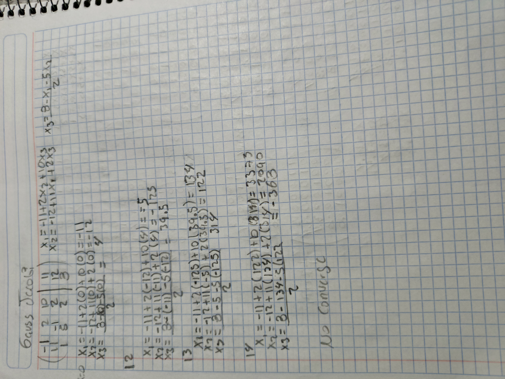{width=600}

#### Sistema: 3
 
$$
A = \begin{bmatrix}
8 & 2 & 3 & = & 51 \\
2 & 5 & 1 &  = & 23 \\
-3 & 1 & 6 &  = & 20
\end{bmatrix}
$$

```{r}
A <- matrix(c(8, 2,  3,
2,  5, 1,
-3,  1,  6), nrow = 3, byrow = TRUE)

b <- c(51, 23, 20)

# Vector inicial x^(0)
x <- rep(0, 3)
cat("x^(0) =", paste(sprintf("%.8f", x), collapse = ", "), "\n")

#  2. Proceso Iterativo Manual (20 Pasos) 

#### Iteración 1
x_old <- x
x_new <- rep(0, 3) # Vector temporal para almacenar los nuevos valores (Jacobi)
cat("\nIteración 1\n")

# x1 = (b1 - a12*x2_old - a13*x3_old) / a11
x_new[1] <- (b[1] - A[1, 2] * x_old[2] - A[1, 3] * x_old[3]) / A[1, 1]
# x2 = (b2 - a21*x1_old - a23*x3_old) / a22
x_new[2] <- (b[2] - A[2, 1] * x_old[1] - A[2, 3] * x_old[3]) / A[2, 2]
# x3 = (b3 - a31*x1_old - a32*x2_old) / a33
x_new[3] <- (b[3] - A[3, 1] * x_old[1] - A[3, 2] * x_old[2]) / A[3, 3]

# Actualizar x para la siguiente iteración
x <- x_new

r <- b - A %*% x
dx_inf <- max(abs(x - x_old))
cat(sprintf("x^(1) = %s\n", paste(sprintf("%.8f", x), collapse = ", ")))
cat(sprintf("||dx||_inf = %.8e | ||r||_inf = %.8e\n", dx_inf, max(abs(r))))


#### Iteración 2
x_old <- x
x_new <- rep(0, 3)
cat("\nIteración 2\n")

# x1 = (b1 - a12*x2_old - a13*x3_old) / a11
x_new[1] <- (b[1] - A[1, 2] * x_old[2] - A[1, 3] * x_old[3]) / A[1, 1]
# x2 = (b2 - a21*x1_old - a23*x3_old) / a22
x_new[2] <- (b[2] - A[2, 1] * x_old[1] - A[2, 3] * x_old[3]) / A[2, 2]
# x3 = (b3 - a31*x1_old - a32*x2_old) / a33
x_new[3] <- (b[3] - A[3, 1] * x_old[1] - A[3, 2] * x_old[2]) / A[3, 3]

x <- x_new

r <- b - A %*% x
dx_inf <- max(abs(x - x_old))
cat(sprintf("x^(2) = %s\n", paste(sprintf("%.8f", x), collapse = ", ")))
cat(sprintf("||dx||_inf = %.8e | ||r||_inf = %.8e\n", dx_inf, max(abs(r))))

#### Iteración 3
x_old <- x
x_new <- rep(0, 3)
cat("\nIteración 3\n")

# x1 = (b1 - a12*x2_old - a13*x3_old) / a11
x_new[1] <- (b[1] - A[1, 2] * x_old[2] - A[1, 3] * x_old[3]) / A[1, 1]
# x2 = (b2 - a21*x1_old - a23*x3_old) / a22
x_new[2] <- (b[2] - A[2, 1] * x_old[1] - A[2, 3] * x_old[3]) / A[2, 2]
# x3 = (b3 - a31*x1_old - a32*x2_old) / a33
x_new[3] <- (b[3] - A[3, 1] * x_old[1] - A[3, 2] * x_old[2]) / A[3, 3]

x <- x_new

r <- b - A %*% x
dx_inf <- max(abs(x - x_old))
cat(sprintf("x^(3) = %s\n", paste(sprintf("%.8f", x), collapse = ", ")))
cat(sprintf("||dx||_inf = %.8e | ||r||_inf = %.8e\n", dx_inf, max(abs(r))))

#### Iteración 4
x_old <- x
x_new <- rep(0, 3)
cat("\nIteración 4\n")

# x1 = (b1 - a12*x2_old - a13*x3_old) / a11
x_new[1] <- (b[1] - A[1, 2] * x_old[2] - A[1, 3] * x_old[3]) / A[1, 1]
# x2 = (b2 - a21*x1_old - a23*x3_old) / a22
x_new[2] <- (b[2] - A[2, 1] * x_old[1] - A[2, 3] * x_old[3]) / A[2, 2]
# x3 = (b3 - a31*x1_old - a32*x2_old) / a33
x_new[3] <- (b[3] - A[3, 1] * x_old[1] - A[3, 2] * x_old[2]) / A[3, 3]

x <- x_new

r <- b - A %*% x
dx_inf <- max(abs(x - x_old))
cat(sprintf("x^(4) = %s\n", paste(sprintf("%.8f", x), collapse = ", ")))
cat(sprintf("||dx||_inf = %.8e | ||r||_inf = %.8e\n", dx_inf, max(abs(r))))

#### Iteración 5
x_old <- x
x_new <- rep(0, 3)
cat("\nIteración 5\n")

# x1 = (b1 - a12*x2_old - a13*x3_old) / a11
x_new[1] <- (b[1] - A[1, 2] * x_old[2] - A[1, 3] * x_old[3]) / A[1, 1]
# x2 = (b2 - a21*x1_old - a23*x3_old) / a22
x_new[2] <- (b[2] - A[2, 1] * x_old[1] - A[2, 3] * x_old[3]) / A[2, 2]
# x3 = (b3 - a31*x1_old - a32*x2_old) / a33
x_new[3] <- (b[3] - A[3, 1] * x_old[1] - A[3, 2] * x_old[2]) / A[3, 3]

x <- x_new

r <- b - A %*% x
dx_inf <- max(abs(x - x_old))
cat(sprintf("x^(5) = %s\n", paste(sprintf("%.8f", x), collapse = ", ")))
cat(sprintf("||dx||_inf = %.8e | ||r||_inf = %.8e\n", dx_inf, max(abs(r))))

#### Iteración 6
x_old <- x
x_new <- rep(0, 3)
cat("\nIteración 6\n")

# x1 = (b1 - a12*x2_old - a13*x3_old) / a11
x_new[1] <- (b[1] - A[1, 2] * x_old[2] - A[1, 3] * x_old[3]) / A[1, 1]
# x2 = (b2 - a21*x1_old - a23*x3_old) / a22
x_new[2] <- (b[2] - A[2, 1] * x_old[1] - A[2, 3] * x_old[3]) / A[2, 2]
# x3 = (b3 - a31*x1_old - a32*x2_old) / a33
x_new[3] <- (b[3] - A[3, 1] * x_old[1] - A[3, 2] * x_old[2]) / A[3, 3]

x <- x_new

r <- b - A %*% x
dx_inf <- max(abs(x - x_old))
cat(sprintf("x^(6) = %s\n", paste(sprintf("%.8f", x), collapse = ", ")))
cat(sprintf("||dx||_inf = %.8e | ||r||_inf = %.8e\n", dx_inf, max(abs(r))))

#### Iteración 7
x_old <- x
x_new <- rep(0, 3)
cat("\nIteración 7\n")

# x1 = (b1 - a12*x2_old - a13*x3_old) / a11
x_new[1] <- (b[1] - A[1, 2] * x_old[2] - A[1, 3] * x_old[3]) / A[1, 1]
# x2 = (b2 - a21*x1_old - a23*x3_old) / a22
x_new[2] <- (b[2] - A[2, 1] * x_old[1] - A[2, 3] * x_old[3]) / A[2, 2]
# x3 = (b3 - a31*x1_old - a32*x2_old) / a33
x_new[3] <- (b[3] - A[3, 1] * x_old[1] - A[3, 2] * x_old[2]) / A[3, 3]

x <- x_new

r <- b - A %*% x
dx_inf <- max(abs(x - x_old))
cat(sprintf("x^(7) = %s\n", paste(sprintf("%.8f", x), collapse = ", ")))
cat(sprintf("||dx||_inf = %.8e | ||r||_inf = %.8e\n", dx_inf, max(abs(r))))

#### Iteración 8
x_old <- x
x_new <- rep(0, 3)
cat("\nIteración 8\n")

# x1 = (b1 - a12*x2_old - a13*x3_old) / a11
x_new[1] <- (b[1] - A[1, 2] * x_old[2] - A[1, 3] * x_old[3]) / A[1, 1]
# x2 = (b2 - a21*x1_old - a23*x3_old) / a22
x_new[2] <- (b[2] - A[2, 1] * x_old[1] - A[2, 3] * x_old[3]) / A[2, 2]
# x3 = (b3 - a31*x1_old - a32*x2_old) / a33
x_new[3] <- (b[3] - A[3, 1] * x_old[1] - A[3, 2] * x_old[2]) / A[3, 3]

x <- x_new

r <- b - A %*% x
dx_inf <- max(abs(x - x_old))
cat(sprintf("x^(8) = %s\n", paste(sprintf("%.8f", x), collapse = ", ")))
cat(sprintf("||dx||_inf = %.8e | ||r||_inf = %.8e\n", dx_inf, max(abs(r))))

#### Iteración 9
x_old <- x
x_new <- rep(0, 3)
cat("\nIteración 9\n")

# x1 = (b1 - a12*x2_old - a13*x3_old) / a11
x_new[1] <- (b[1] - A[1, 2] * x_old[2] - A[1, 3] * x_old[3]) / A[1, 1]
# x2 = (b2 - a21*x1_old - a23*x3_old) / a22
x_new[2] <- (b[2] - A[2, 1] * x_old[1] - A[2, 3] * x_old[3]) / A[2, 2]
# x3 = (b3 - a31*x1_old - a32*x2_old) / a33
x_new[3] <- (b[3] - A[3, 1] * x_old[1] - A[3, 2] * x_old[2]) / A[3, 3]

x <- x_new

r <- b - A %*% x
dx_inf <- max(abs(x - x_old))
cat(sprintf("x^(9) = %s\n", paste(sprintf("%.8f", x), collapse = ", ")))
cat(sprintf("||dx||_inf = %.8e | ||r||_inf = %.8e\n", dx_inf, max(abs(r))))

#### Iteración 10
x_old <- x
x_new <- rep(0, 3)
cat("\nIteración 10\n")

# x1 = (b1 - a12*x2_old - a13*x3_old) / a11
x_new[1] <- (b[1] - A[1, 2] * x_old[2] - A[1, 3] * x_old[3]) / A[1, 1]
# x2 = (b2 - a21*x1_old - a23*x3_old) / a22
x_new[2] <- (b[2] - A[2, 1] * x_old[1] - A[2, 3] * x_old[3]) / A[2, 2]
# x3 = (b3 - a31*x1_old - a32*x2_old) / a33
x_new[3] <- (b[3] - A[3, 1] * x_old[1] - A[3, 2] * x_old[2]) / A[3, 3]

x <- x_new

r <- b - A %*% x
dx_inf <- max(abs(x - x_old))
cat(sprintf("x^(10) = %s\n", paste(sprintf("%.8f", x), collapse = ", ")))
cat(sprintf("||dx||_inf = %.8e | ||r||_inf = %.8e\n", dx_inf, max(abs(r))))

#### Iteración 11
x_old <- x
x_new <- rep(0, 3)
cat("\nIteración 11\n")

# x1 = (b1 - a12*x2_old - a13*x3_old) / a11
x_new[1] <- (b[1] - A[1, 2] * x_old[2] - A[1, 3] * x_old[3]) / A[1, 1]
# x2 = (b2 - a21*x1_old - a23*x3_old) / a22
x_new[2] <- (b[2] - A[2, 1] * x_old[1] - A[2, 3] * x_old[3]) / A[2, 2]
# x3 = (b3 - a31*x1_old - a32*x2_old) / a33
x_new[3] <- (b[3] - A[3, 1] * x_old[1] - A[3, 2] * x_old[2]) / A[3, 3]

x <- x_new

r <- b - A %*% x
dx_inf <- max(abs(x - x_old))
cat(sprintf("x^(11) = %s\n", paste(sprintf("%.8f", x), collapse = ", ")))
cat(sprintf("||dx||_inf = %.8e | ||r||_inf = %.8e\n", dx_inf, max(abs(r))))

#### Iteración 12
x_old <- x
x_new <- rep(0, 3)
cat("\nIteración 12\n")

# x1 = (b1 - a12*x2_old - a13*x3_old) / a11
x_new[1] <- (b[1] - A[1, 2] * x_old[2] - A[1, 3] * x_old[3]) / A[1, 1]
# x2 = (b2 - a21*x1_old - a23*x3_old) / a22
x_new[2] <- (b[2] - A[2, 1] * x_old[1] - A[2, 3] * x_old[3]) / A[2, 2]
# x3 = (b3 - a31*x1_old - a32*x2_old) / a33
x_new[3] <- (b[3] - A[3, 1] * x_old[1] - A[3, 2] * x_old[2]) / A[3, 3]

x <- x_new

r <- b - A %*% x
dx_inf <- max(abs(x - x_old))
cat(sprintf("x^(12) = %s\n", paste(sprintf("%.8f", x), collapse = ", ")))
cat(sprintf("||dx||_inf = %.8e | ||r||_inf = %.8e\n", dx_inf, max(abs(r))))

#### Iteración 13
x_old <- x
x_new <- rep(0, 3)
cat("\nIteración 13\n")

# x1 = (b1 - a12*x2_old - a13*x3_old) / a11
x_new[1] <- (b[1] - A[1, 2] * x_old[2] - A[1, 3] * x_old[3]) / A[1, 1]
# x2 = (b2 - a21*x1_old - a23*x3_old) / a22
x_new[2] <- (b[2] - A[2, 1] * x_old[1] - A[2, 3] * x_old[3]) / A[2, 2]
# x3 = (b3 - a31*x1_old - a32*x2_old) / a33
x_new[3] <- (b[3] - A[3, 1] * x_old[1] - A[3, 2] * x_old[2]) / A[3, 3]

x <- x_new

r <- b - A %*% x
dx_inf <- max(abs(x - x_old))
cat(sprintf("x^(13) = %s\n", paste(sprintf("%.8f", x), collapse = ", ")))
cat(sprintf("||dx||_inf = %.8e | ||r||_inf = %.8e\n", dx_inf, max(abs(r))))

#### Iteración 14
x_old <- x
x_new <- rep(0, 3)
cat("\nIteración 14\n")

# x1 = (b1 - a12*x2_old - a13*x3_old) / a11
x_new[1] <- (b[1] - A[1, 2] * x_old[2] - A[1, 3] * x_old[3]) / A[1, 1]
# x2 = (b2 - a21*x1_old - a23*x3_old) / a22
x_new[2] <- (b[2] - A[2, 1] * x_old[1] - A[2, 3] * x_old[3]) / A[2, 2]
# x3 = (b3 - a31*x1_old - a32*x2_old) / a33
x_new[3] <- (b[3] - A[3, 1] * x_old[1] - A[3, 2] * x_old[2]) / A[3, 3]

x <- x_new

r <- b - A %*% x
dx_inf <- max(abs(x - x_old))
cat(sprintf("x^(14) = %s\n", paste(sprintf("%.8f", x), collapse = ", ")))
cat(sprintf("||dx||_inf = %.8e | ||r||_inf = %.8e\n", dx_inf, max(abs(r))))

#### Iteración 15
x_old <- x
x_new <- rep(0, 3)
cat("\nIteración 15\n")

# x1 = (b1 - a12*x2_old - a13*x3_old) / a11
x_new[1] <- (b[1] - A[1, 2] * x_old[2] - A[1, 3] * x_old[3]) / A[1, 1]
# x2 = (b2 - a21*x1_old - a23*x3_old) / a22
x_new[2] <- (b[2] - A[2, 1] * x_old[1] - A[2, 3] * x_old[3]) / A[2, 2]
# x3 = (b3 - a31*x1_old - a32*x2_old) / a33
x_new[3] <- (b[3] - A[3, 1] * x_old[1] - A[3, 2] * x_old[2]) / A[3, 3]

x <- x_new

r <- b - A %*% x
dx_inf <- max(abs(x - x_old))
cat(sprintf("x^(15) = %s\n", paste(sprintf("%.8f", x), collapse = ", ")))
cat(sprintf("||dx||_inf = %.8e | ||r||_inf = %.8e\n", dx_inf, max(abs(r))))

#### Iteración 16
x_old <- x
x_new <- rep(0, 3)
cat("\nIteración 16\n")

# x1 = (b1 - a12*x2_old - a13*x3_old) / a11
x_new[1] <- (b[1] - A[1, 2] * x_old[2] - A[1, 3] * x_old[3]) / A[1, 1]
# x2 = (b2 - a21*x1_old - a23*x3_old) / a22
x_new[2] <- (b[2] - A[2, 1] * x_old[1] - A[2, 3] * x_old[3]) / A[2, 2]
# x3 = (b3 - a31*x1_old - a32*x2_old) / a33
x_new[3] <- (b[3] - A[3, 1] * x_old[1] - A[3, 2] * x_old[2]) / A[3, 3]

x <- x_new

r <- b - A %*% x
dx_inf <- max(abs(x - x_old))
cat(sprintf("x^(16) = %s\n", paste(sprintf("%.8f", x), collapse = ", ")))
cat(sprintf("||dx||_inf = %.8e | ||r||_inf = %.8e\n", dx_inf, max(abs(r))))

#### Iteración 17
x_old <- x
x_new <- rep(0, 3)
cat("\nIteración 17\n")

# x1 = (b1 - a12*x2_old - a13*x3_old) / a11
x_new[1] <- (b[1] - A[1, 2] * x_old[2] - A[1, 3] * x_old[3]) / A[1, 1]
# x2 = (b2 - a21*x1_old - a23*x3_old) / a22
x_new[2] <- (b[2] - A[2, 1] * x_old[1] - A[2, 3] * x_old[3]) / A[2, 2]
# x3 = (b3 - a31*x1_old - a32*x2_old) / a33
x_new[3] <- (b[3] - A[3, 1] * x_old[1] - A[3, 2] * x_old[2]) / A[3, 3]

x <- x_new

r <- b - A %*% x
dx_inf <- max(abs(x - x_old))
cat(sprintf("x^(17) = %s\n", paste(sprintf("%.8f", x), collapse = ", ")))
cat(sprintf("||dx||_inf = %.8e | ||r||_inf = %.8e\n", dx_inf, max(abs(r))))

#### Iteración 18
x_old <- x
x_new <- rep(0, 3)
cat("\nIteración 18\n")

# x1 = (b1 - a12*x2_old - a13*x3_old) / a11
x_new[1] <- (b[1] - A[1, 2] * x_old[2] - A[1, 3] * x_old[3]) / A[1, 1]
# x2 = (b2 - a21*x1_old - a23*x3_old) / a22
x_new[2] <- (b[2] - A[2, 1] * x_old[1] - A[2, 3] * x_old[3]) / A[2, 2]
# x3 = (b3 - a31*x1_old - a32*x2_old) / a33
x_new[3] <- (b[3] - A[3, 1] * x_old[1] - A[3, 2] * x_old[2]) / A[3, 3]

x <- x_new

r <- b - A %*% x
dx_inf <- max(abs(x - x_old))
cat(sprintf("x^(18) = %s\n", paste(sprintf("%.8f", x), collapse = ", ")))
cat(sprintf("||dx||_inf = %.8e | ||r||_inf = %.8e\n", dx_inf, max(abs(r))))

#### Iteración 19
x_old <- x
x_new <- rep(0, 3)
cat("\nIteración 19\n")

# x1 = (b1 - a12*x2_old - a13*x3_old) / a11
x_new[1] <- (b[1] - A[1, 2] * x_old[2] - A[1, 3] * x_old[3]) / A[1, 1]
# x2 = (b2 - a21*x1_old - a23*x3_old) / a22
x_new[2] <- (b[2] - A[2, 1] * x_old[1] - A[2, 3] * x_old[3]) / A[2, 2]
# x3 = (b3 - a31*x1_old - a32*x2_old) / a33
x_new[3] <- (b[3] - A[3, 1] * x_old[1] - A[3, 2] * x_old[2]) / A[3, 3]

x <- x_new

r <- b - A %*% x
dx_inf <- max(abs(x - x_old))
cat(sprintf("x^(19) = %s\n", paste(sprintf("%.8f", x), collapse = ", ")))
cat(sprintf("||dx||_inf = %.8e | ||r||_inf = %.8e\n", dx_inf, max(abs(r))))

#### Iteración 20
x_old <- x
x_new <- rep(0, 3)
cat("\nIteración 20\n")

# x1 = (b1 - a12*x2_old - a13*x3_old) / a11
x_new[1] <- (b[1] - A[1, 2] * x_old[2] - A[1, 3] * x_old[3]) / A[1, 1]
# x2 = (b2 - a21*x1_old - a23*x3_old) / a22
x_new[2] <- (b[2] - A[2, 1] * x_old[1] - A[2, 3] * x_old[3]) / A[2, 2]
# x3 = (b3 - a31*x1_old - a32*x2_old) / a33
x_new[3] <- (b[3] - A[3, 1] * x_old[1] - A[3, 2] * x_old[2]) / A[3, 3]

x <- x_new

r <- b - A %*% x
dx_inf <- max(abs(x - x_old))
cat(sprintf("x^(20) = %s\n", paste(sprintf("%.8f", x), collapse = ", ")))
cat(sprintf("||dx||_inf = %.8e | ||r||_inf = %.8e\n", dx_inf, max(abs(r))))

cat("Solución aproximada después de 20 iteraciones (Método de Jacobi):\n")
print(round(x, 8))
```

#### Sistema: 4

$$
A = \begin{bmatrix}
2 & -1 & 1 & 3 & = & 10 \\
2 & 2 & 2 & 2 & = & 1 \\
-1 & -1 & 2 & 2 & = & -5\\
3 & 1 & -1 & 4 & = & 6
\end{bmatrix}
$$
 
```{r}
A <- matrix(c(2,-1,1,3,
              2,2,2,2,
              -1,-1,2,2,
              3,1,-1,4), nrow = 4, byrow = TRUE)

# b: Vector de términos independientes
b <- c(10,1,-5,6)

cat("Matriz A:\n")
print(A)
cat("\nVector b:\n")
print(b)

#  2. Preparación de la Iteración 
# Vector inicial x^(0)
x <- rep(0, 4)
cat("Iteración 0\nx^(0) =", paste(sprintf("%.8f", x), collapse=", "), "\n")

#  3. Proceso Iterativo Manual (20 Pasos) 

#### Bloque de Iteración 1
x_old <- x
x_new <- numeric(4)
x_new[1] <- (b[1] - A[1, 2]*x_old[2] - A[1, 3]*x_old[3] - A[1, 4]*x_old[4]) / A[1, 1]
x_new[2] <- (b[2] - A[2, 1]*x_old[1] - A[2, 3]*x_old[3] - A[2, 4]*x_old[4]) / A[2, 2]
x_new[3] <- (b[3] - A[3, 1]*x_old[1] - A[3, 2]*x_old[2] - A[3, 4]*x_old[4]) / A[3, 3]
x_new[4] <- (b[4] - A[4, 1]*x_old[1] - A[4, 2]*x_old[2] - A[4, 3]*x_old[3]) / A[4, 4]

dx_inf <- max(abs(x_new - x_old))
x <- x_new
cat("Iteración 1\nx^(1) =", paste(sprintf("%.8f", x), collapse=", "), "\n")
cat(sprintf("||dx||_inf = %.8e\n", dx_inf))

#### Bloque de Iteración 2
x_old <- x
x_new <- numeric(4)
x_new[1] <- (b[1] - A[1, 2]*x_old[2] - A[1, 3]*x_old[3] - A[1, 4]*x_old[4]) / A[1, 1]
x_new[2] <- (b[2] - A[2, 1]*x_old[1] - A[2, 3]*x_old[3] - A[2, 4]*x_old[4]) / A[2, 2]
x_new[3] <- (b[3] - A[3, 1]*x_old[1] - A[3, 2]*x_old[2] - A[3, 4]*x_old[4]) / A[3, 3]
x_new[4] <- (b[4] - A[4, 1]*x_old[1] - A[4, 2]*x_old[2] - A[4, 3]*x_old[3]) / A[4, 4]

dx_inf <- max(abs(x_new - x_old))
x <- x_new
cat("\nIteración 2\nx^(2) =", paste(sprintf("%.8f", x), collapse=", "), "\n")
cat(sprintf("||dx||_inf = %.8e\n", dx_inf))

#### Bloque de Iteración 3
x_old <- x
x_new <- numeric(4)
x_new[1] <- (b[1] - A[1, 2]*x_old[2] - A[1, 3]*x_old[3] - A[1, 4]*x_old[4]) / A[1, 1]
x_new[2] <- (b[2] - A[2, 1]*x_old[1] - A[2, 3]*x_old[3] - A[2, 4]*x_old[4]) / A[2, 2]
x_new[3] <- (b[3] - A[3, 1]*x_old[1] - A[3, 2]*x_old[2] - A[3, 4]*x_old[4]) / A[3, 3]
x_new[4] <- (b[4] - A[4, 1]*x_old[1] - A[4, 2]*x_old[2] - A[4, 3]*x_old[3]) / A[4, 4]

dx_inf <- max(abs(x_new - x_old))
x <- x_new
cat("\nIteración 3\nx^(3) =", paste(sprintf("%.8f", x), collapse=", "), "\n")
cat(sprintf("||dx||_inf = %.8e\n", dx_inf))

#### Bloque de Iteración 4
x_old <- x
x_new <- numeric(4)
x_new[1] <- (b[1] - A[1, 2]*x_old[2] - A[1, 3]*x_old[3] - A[1, 4]*x_old[4]) / A[1, 1]
x_new[2] <- (b[2] - A[2, 1]*x_old[1] - A[2, 3]*x_old[3] - A[2, 4]*x_old[4]) / A[2, 2]
x_new[3] <- (b[3] - A[3, 1]*x_old[1] - A[3, 2]*x_old[2] - A[3, 4]*x_old[4]) / A[3, 3]
x_new[4] <- (b[4] - A[4, 1]*x_old[1] - A[4, 2]*x_old[2] - A[4, 3]*x_old[3]) / A[4, 4]

dx_inf <- max(abs(x_new - x_old))
x <- x_new
cat("\nIteración 4\nx^(4) =", paste(sprintf("%.8f", x), collapse=", "), "\n")
cat(sprintf("||dx||_inf = %.8e\n", dx_inf))

#### Bloque de Iteración 5
x_old <- x
x_new <- numeric(4)
x_new[1] <- (b[1] - A[1, 2]*x_old[2] - A[1, 3]*x_old[3] - A[1, 4]*x_old[4]) / A[1, 1]
x_new[2] <- (b[2] - A[2, 1]*x_old[1] - A[2, 3]*x_old[3] - A[2, 4]*x_old[4]) / A[2, 2]
x_new[3] <- (b[3] - A[3, 1]*x_old[1] - A[3, 2]*x_old[2] - A[3, 4]*x_old[4]) / A[3, 3]
x_new[4] <- (b[4] - A[4, 1]*x_old[1] - A[4, 2]*x_old[2] - A[4, 3]*x_old[3]) / A[4, 4]

dx_inf <- max(abs(x_new - x_old))
x <- x_new
cat("\nIteración 5\nx^(5) =", paste(sprintf("%.8f", x), collapse=", "), "\n")
cat(sprintf("||dx||_inf = %.8e\n", dx_inf))

#### Bloque de Iteración 6
x_old <- x
x_new <- numeric(4)
x_new[1] <- (b[1] - A[1, 2]*x_old[2] - A[1, 3]*x_old[3] - A[1, 4]*x_old[4]) / A[1, 1]
x_new[2] <- (b[2] - A[2, 1]*x_old[1] - A[2, 3]*x_old[3] - A[2, 4]*x_old[4]) / A[2, 2]
x_new[3] <- (b[3] - A[3, 1]*x_old[1] - A[3, 2]*x_old[2] - A[3, 4]*x_old[4]) / A[3, 3]
x_new[4] <- (b[4] - A[4, 1]*x_old[1] - A[4, 2]*x_old[2] - A[4, 3]*x_old[3]) / A[4, 4]

dx_inf <- max(abs(x_new - x_old))
x <- x_new
cat("\nIteración 6\nx^(6) =", paste(sprintf("%.8f", x), collapse=", "), "\n")
cat(sprintf("||dx||_inf = %.8e\n", dx_inf))

#### Bloque de Iteración 7
x_old <- x
x_new <- numeric(4)
x_new[1] <- (b[1] - A[1, 2]*x_old[2] - A[1, 3]*x_old[3] - A[1, 4]*x_old[4]) / A[1, 1]
x_new[2] <- (b[2] - A[2, 1]*x_old[1] - A[2, 3]*x_old[3] - A[2, 4]*x_old[4]) / A[2, 2]
x_new[3] <- (b[3] - A[3, 1]*x_old[1] - A[3, 2]*x_old[2] - A[3, 4]*x_old[4]) / A[3, 3]
x_new[4] <- (b[4] - A[4, 1]*x_old[1] - A[4, 2]*x_old[2] - A[4, 3]*x_old[3]) / A[4, 4]

dx_inf <- max(abs(x_new - x_old))
x <- x_new
cat("\nIteración 7\nx^(7) =", paste(sprintf("%.8f", x), collapse=", "), "\n")
cat(sprintf("||dx||_inf = %.8e\n", dx_inf))

#### Bloque de Iteración 8
x_old <- x
x_new <- numeric(4)
x_new[1] <- (b[1] - A[1, 2]*x_old[2] - A[1, 3]*x_old[3] - A[1, 4]*x_old[4]) / A[1, 1]
x_new[2] <- (b[2] - A[2, 1]*x_old[1] - A[2, 3]*x_old[3] - A[2, 4]*x_old[4]) / A[2, 2]
x_new[3] <- (b[3] - A[3, 1]*x_old[1] - A[3, 2]*x_old[2] - A[3, 4]*x_old[4]) / A[3, 3]
x_new[4] <- (b[4] - A[4, 1]*x_old[1] - A[4, 2]*x_old[2] - A[4, 3]*x_old[3]) / A[4, 4]

dx_inf <- max(abs(x_new - x_old))
x <- x_new
cat("\nIteración 8\nx^(8) =", paste(sprintf("%.8f", x), collapse=", "), "\n")
cat(sprintf("||dx||_inf = %.8e\n", dx_inf))

#### Bloque de Iteración 9
x_old <- x
x_new <- numeric(4)
x_new[1] <- (b[1] - A[1, 2]*x_old[2] - A[1, 3]*x_old[3] - A[1, 4]*x_old[4]) / A[1, 1]
x_new[2] <- (b[2] - A[2, 1]*x_old[1] - A[2, 3]*x_old[3] - A[2, 4]*x_old[4]) / A[2, 2]
x_new[3] <- (b[3] - A[3, 1]*x_old[1] - A[3, 2]*x_old[2] - A[3, 4]*x_old[4]) / A[3, 3]
x_new[4] <- (b[4] - A[4, 1]*x_old[1] - A[4, 2]*x_old[2] - A[4, 3]*x_old[3]) / A[4, 4]

dx_inf <- max(abs(x_new - x_old))
x <- x_new
cat("\nIteración 9\nx^(9) =", paste(sprintf("%.8f", x), collapse=", "), "\n")
cat(sprintf("||dx||_inf = %.8e\n", dx_inf))

#### Bloque de Iteración 10
x_old <- x
x_new <- numeric(4)
x_new[1] <- (b[1] - A[1, 2]*x_old[2] - A[1, 3]*x_old[3] - A[1, 4]*x_old[4]) / A[1, 1]
x_new[2] <- (b[2] - A[2, 1]*x_old[1] - A[2, 3]*x_old[3] - A[2, 4]*x_old[4]) / A[2, 2]
x_new[3] <- (b[3] - A[3, 1]*x_old[1] - A[3, 2]*x_old[2] - A[3, 4]*x_old[4]) / A[3, 3]
x_new[4] <- (b[4] - A[4, 1]*x_old[1] - A[4, 2]*x_old[2] - A[4, 3]*x_old[3]) / A[4, 4]

dx_inf <- max(abs(x_new - x_old))
x <- x_new
cat("\nIteración 10\nx^(10) =", paste(sprintf("%.8f", x), collapse=", "), "\n")
cat(sprintf("||dx||_inf = %.8e\n", dx_inf))

#### Bloque de Iteración 11
x_old <- x
x_new <- numeric(4)
x_new[1] <- (b[1] - A[1, 2]*x_old[2] - A[1, 3]*x_old[3] - A[1, 4]*x_old[4]) / A[1, 1]
x_new[2] <- (b[2] - A[2, 1]*x_old[1] - A[2, 3]*x_old[3] - A[2, 4]*x_old[4]) / A[2, 2]
x_new[3] <- (b[3] - A[3, 1]*x_old[1] - A[3, 2]*x_old[2] - A[3, 4]*x_old[4]) / A[3, 3]
x_new[4] <- (b[4] - A[4, 1]*x_old[1] - A[4, 2]*x_old[2] - A[4, 3]*x_old[3]) / A[4, 4]

dx_inf <- max(abs(x_new - x_old))
x <- x_new
cat("\nIteración 11\nx^(11) =", paste(sprintf("%.8f", x), collapse=", "), "\n")
cat(sprintf("||dx||_inf = %.8e\n", dx_inf))

#### Bloque de Iteración 12
x_old <- x
x_new <- numeric(4)
x_new[1] <- (b[1] - A[1, 2]*x_old[2] - A[1, 3]*x_old[3] - A[1, 4]*x_old[4]) / A[1, 1]
x_new[2] <- (b[2] - A[2, 1]*x_old[1] - A[2, 3]*x_old[3] - A[2, 4]*x_old[4]) / A[2, 2]
x_new[3] <- (b[3] - A[3, 1]*x_old[1] - A[3, 2]*x_old[2] - A[3, 4]*x_old[4]) / A[3, 3]
x_new[4] <- (b[4] - A[4, 1]*x_old[1] - A[4, 2]*x_old[2] - A[4, 3]*x_old[3]) / A[4, 4]

dx_inf <- max(abs(x_new - x_old))
x <- x_new
cat("\nIteración 12\nx^(12) =", paste(sprintf("%.8f", x), collapse=", "), "\n")
cat(sprintf("||dx||_inf = %.8e\n", dx_inf))

#### Bloque de Iteración 13
x_old <- x
x_new <- numeric(4)
x_new[1] <- (b[1] - A[1, 2]*x_old[2] - A[1, 3]*x_old[3] - A[1, 4]*x_old[4]) / A[1, 1]
x_new[2] <- (b[2] - A[2, 1]*x_old[1] - A[2, 3]*x_old[3] - A[2, 4]*x_old[4]) / A[2, 2]
x_new[3] <- (b[3] - A[3, 1]*x_old[1] - A[3, 2]*x_old[2] - A[3, 4]*x_old[4]) / A[3, 3]
x_new[4] <- (b[4] - A[4, 1]*x_old[1] - A[4, 2]*x_old[2] - A[4, 3]*x_old[3]) / A[4, 4]

dx_inf <- max(abs(x_new - x_old))
x <- x_new
cat("\nIteración 13\nx^(13) =", paste(sprintf("%.8f", x), collapse=", "), "\n")
cat(sprintf("||dx||_inf = %.8e\n", dx_inf))

#### Bloque de Iteración 14
x_old <- x
x_new <- numeric(4)
x_new[1] <- (b[1] - A[1, 2]*x_old[2] - A[1, 3]*x_old[3] - A[1, 4]*x_old[4]) / A[1, 1]
x_new[2] <- (b[2] - A[2, 1]*x_old[1] - A[2, 3]*x_old[3] - A[2, 4]*x_old[4]) / A[2, 2]
x_new[3] <- (b[3] - A[3, 1]*x_old[1] - A[3, 2]*x_old[2] - A[3, 4]*x_old[4]) / A[3, 3]
x_new[4] <- (b[4] - A[4, 1]*x_old[1] - A[4, 2]*x_old[2] - A[4, 3]*x_old[3]) / A[4, 4]

dx_inf <- max(abs(x_new - x_old))
x <- x_new
cat("\nIteración 14\nx^(14) =", paste(sprintf("%.8f", x), collapse=", "), "\n")
cat(sprintf("||dx||_inf = %.8e\n", dx_inf))

#### Bloque de Iteración 15
x_old <- x
x_new <- numeric(4)
x_new[1] <- (b[1] - A[1, 2]*x_old[2] - A[1, 3]*x_old[3] - A[1, 4]*x_old[4]) / A[1, 1]
x_new[2] <- (b[2] - A[2, 1]*x_old[1] - A[2, 3]*x_old[3] - A[2, 4]*x_old[4]) / A[2, 2]
x_new[3] <- (b[3] - A[3, 1]*x_old[1] - A[3, 2]*x_old[2] - A[3, 4]*x_old[4]) / A[3, 3]
x_new[4] <- (b[4] - A[4, 1]*x_old[1] - A[4, 2]*x_old[2] - A[4, 3]*x_old[3]) / A[4, 4]

dx_inf <- max(abs(x_new - x_old))
x <- x_new
cat("\nIteración 15\nx^(15) =", paste(sprintf("%.8f", x), collapse=", "), "\n")
cat(sprintf("||dx||_inf = %.8e\n", dx_inf))

#### Bloque de Iteración 16
x_old <- x
x_new <- numeric(4)
x_new[1] <- (b[1] - A[1, 2]*x_old[2] - A[1, 3]*x_old[3] - A[1, 4]*x_old[4]) / A[1, 1]
x_new[2] <- (b[2] - A[2, 1]*x_old[1] - A[2, 3]*x_old[3] - A[2, 4]*x_old[4]) / A[2, 2]
x_new[3] <- (b[3] - A[3, 1]*x_old[1] - A[3, 2]*x_old[2] - A[3, 4]*x_old[4]) / A[3, 3]
x_new[4] <- (b[4] - A[4, 1]*x_old[1] - A[4, 2]*x_old[2] - A[4, 3]*x_old[3]) / A[4, 4]

dx_inf <- max(abs(x_new - x_old))
x <- x_new
cat("\nIteración 16\nx^(16) =", paste(sprintf("%.8f", x), collapse=", "), "\n")
cat(sprintf("||dx||_inf = %.8e\n", dx_inf))

#### Bloque de Iteración 17
x_old <- x
x_new <- numeric(4)
x_new[1] <- (b[1] - A[1, 2]*x_old[2] - A[1, 3]*x_old[3] - A[1, 4]*x_old[4]) / A[1, 1]
x_new[2] <- (b[2] - A[2, 1]*x_old[1] - A[2, 3]*x_old[3] - A[2, 4]*x_old[4]) / A[2, 2]
x_new[3] <- (b[3] - A[3, 1]*x_old[1] - A[3, 2]*x_old[2] - A[3, 4]*x_old[4]) / A[3, 3]
x_new[4] <- (b[4] - A[4, 1]*x_old[1] - A[4, 2]*x_old[2] - A[4, 3]*x_old[3]) / A[4, 4]

dx_inf <- max(abs(x_new - x_old))
x <- x_new
cat("\nIteración 17\nx^(17) =", paste(sprintf("%.8f", x), collapse=", "), "\n")
cat(sprintf("||dx||_inf = %.8e\n", dx_inf))

#### Bloque de Iteración 18
x_old <- x
x_new <- numeric(4)
x_new[1] <- (b[1] - A[1, 2]*x_old[2] - A[1, 3]*x_old[3] - A[1, 4]*x_old[4]) / A[1, 1]
x_new[2] <- (b[2] - A[2, 1]*x_old[1] - A[2, 3]*x_old[3] - A[2, 4]*x_old[4]) / A[2, 2]
x_new[3] <- (b[3] - A[3, 1]*x_old[1] - A[3, 2]*x_old[2] - A[3, 4]*x_old[4]) / A[3, 3]
x_new[4] <- (b[4] - A[4, 1]*x_old[1] - A[4, 2]*x_old[2] - A[4, 3]*x_old[3]) / A[4, 4]

dx_inf <- max(abs(x_new - x_old))
x <- x_new
cat("\nIteración 18\nx^(18) =", paste(sprintf("%.8f", x), collapse=", "), "\n")
cat(sprintf("||dx||_inf = %.8e\n", dx_inf))

#### Bloque de Iteración 19
x_old <- x
x_new <- numeric(4)
x_new[1] <- (b[1] - A[1, 2]*x_old[2] - A[1, 3]*x_old[3] - A[1, 4]*x_old[4]) / A[1, 1]
x_new[2] <- (b[2] - A[2, 1]*x_old[1] - A[2, 3]*x_old[3] - A[2, 4]*x_old[4]) / A[2, 2]
x_new[3] <- (b[3] - A[3, 1]*x_old[1] - A[3, 2]*x_old[2] - A[3, 4]*x_old[4]) / A[3, 3]
x_new[4] <- (b[4] - A[4, 1]*x_old[1] - A[4, 2]*x_old[2] - A[4, 3]*x_old[3]) / A[4, 4]

dx_inf <- max(abs(x_new - x_old))
x <- x_new
cat("\nIteración 19\nx^(19) =", paste(sprintf("%.8f", x), collapse=", "), "\n")
cat(sprintf("||dx||_inf = %.8e\n", dx_inf))

#### Bloque de Iteración 20
x_old <- x
x_new <- numeric(4)
x_new[1] <- (b[1] - A[1, 2]*x_old[2] - A[1, 3]*x_old[3] - A[1, 4]*x_old[4]) / A[1, 1]
x_new[2] <- (b[2] - A[2, 1]*x_old[1] - A[2, 3]*x_old[3] - A[2, 4]*x_old[4]) / A[2, 2]
x_new[3] <- (b[3] - A[3, 1]*x_old[1] - A[3, 2]*x_old[2] - A[3, 4]*x_old[4]) / A[3, 3]
x_new[4] <- (b[4] - A[4, 1]*x_old[1] - A[4, 2]*x_old[2] - A[4, 3]*x_old[3]) / A[4, 4]

dx_inf <- max(abs(x_new - x_old))
x <- x_new
cat("\nIteración 20\nx^(20) =", paste(sprintf("%.8f", x), collapse=", "), "\n")
cat(sprintf("||dx||_inf = %.8e\n", dx_inf))

cat("Solución aproximada después de 20 iteraciones (Método de Jacobi):\n")
print(round(x, 8))

```

#### Sistema: 5
$$
A = \begin{bmatrix}
3 & 1 & 1 & -1 & = & 5 \\
0 & 2 & 1 & 4 & = & 0 \\
1 & 1 & -1 & 9 & = & 1\\
2 & 4 & 6 & 3 & = & 0
\end{bmatrix}
$$

```{r}
A <- matrix(c(3,1,1,-1,
             0,2,1,4,
              1,1,-1,9,
              2,4,6,3), nrow = 4, byrow = TRUE)

# b: Vector de términos independientes
b <- c(5,0,1,0)

cat("Matriz A:\n")
print(A)
cat("\nVector b:\n")
print(b)

#  2. Preparación de la Iteración 
# Vector inicial x^(0)
x <- rep(0, 4)
cat("Iteración 0\nx^(0) =", paste(sprintf("%.8f", x), collapse=", "), "\n")

#  3. Proceso Iterativo Manual (20 Pasos) 

#### Bloque de Iteración 1
x_old <- x
x_new <- numeric(4)
x_new[1] <- (b[1] - A[1, 2]*x_old[2] - A[1, 3]*x_old[3] - A[1, 4]*x_old[4]) / A[1, 1]
x_new[2] <- (b[2] - A[2, 1]*x_old[1] - A[2, 3]*x_old[3] - A[2, 4]*x_old[4]) / A[2, 2]
x_new[3] <- (b[3] - A[3, 1]*x_old[1] - A[3, 2]*x_old[2] - A[3, 4]*x_old[4]) / A[3, 3]
x_new[4] <- (b[4] - A[4, 1]*x_old[1] - A[4, 2]*x_old[2] - A[4, 3]*x_old[3]) / A[4, 4]

dx_inf <- max(abs(x_new - x_old))
x <- x_new
cat("Iteración 1\nx^(1) =", paste(sprintf("%.8f", x), collapse=", "), "\n")
cat(sprintf("||dx||_inf = %.8e\n", dx_inf))

#### Bloque de Iteración 2
x_old <- x
x_new <- numeric(4)
x_new[1] <- (b[1] - A[1, 2]*x_old[2] - A[1, 3]*x_old[3] - A[1, 4]*x_old[4]) / A[1, 1]
x_new[2] <- (b[2] - A[2, 1]*x_old[1] - A[2, 3]*x_old[3] - A[2, 4]*x_old[4]) / A[2, 2]
x_new[3] <- (b[3] - A[3, 1]*x_old[1] - A[3, 2]*x_old[2] - A[3, 4]*x_old[4]) / A[3, 3]
x_new[4] <- (b[4] - A[4, 1]*x_old[1] - A[4, 2]*x_old[2] - A[4, 3]*x_old[3]) / A[4, 4]

dx_inf <- max(abs(x_new - x_old))
x <- x_new
cat("\nIteración 2\nx^(2) =", paste(sprintf("%.8f", x), collapse=", "), "\n")
cat(sprintf("||dx||_inf = %.8e\n", dx_inf))

#### Bloque de Iteración 3
x_old <- x
x_new <- numeric(4)
x_new[1] <- (b[1] - A[1, 2]*x_old[2] - A[1, 3]*x_old[3] - A[1, 4]*x_old[4]) / A[1, 1]
x_new[2] <- (b[2] - A[2, 1]*x_old[1] - A[2, 3]*x_old[3] - A[2, 4]*x_old[4]) / A[2, 2]
x_new[3] <- (b[3] - A[3, 1]*x_old[1] - A[3, 2]*x_old[2] - A[3, 4]*x_old[4]) / A[3, 3]
x_new[4] <- (b[4] - A[4, 1]*x_old[1] - A[4, 2]*x_old[2] - A[4, 3]*x_old[3]) / A[4, 4]

dx_inf <- max(abs(x_new - x_old))
x <- x_new
cat("\nIteración 3\nx^(3) =", paste(sprintf("%.8f", x), collapse=", "), "\n")
cat(sprintf("||dx||_inf = %.8e\n", dx_inf))

#### Bloque de Iteración 4
x_old <- x
x_new <- numeric(4)
x_new[1] <- (b[1] - A[1, 2]*x_old[2] - A[1, 3]*x_old[3] - A[1, 4]*x_old[4]) / A[1, 1]
x_new[2] <- (b[2] - A[2, 1]*x_old[1] - A[2, 3]*x_old[3] - A[2, 4]*x_old[4]) / A[2, 2]
x_new[3] <- (b[3] - A[3, 1]*x_old[1] - A[3, 2]*x_old[2] - A[3, 4]*x_old[4]) / A[3, 3]
x_new[4] <- (b[4] - A[4, 1]*x_old[1] - A[4, 2]*x_old[2] - A[4, 3]*x_old[3]) / A[4, 4]

dx_inf <- max(abs(x_new - x_old))
x <- x_new
cat("\nIteración 4\nx^(4) =", paste(sprintf("%.8f", x), collapse=", "), "\n")
cat(sprintf("||dx||_inf = %.8e\n", dx_inf))

#### Bloque de Iteración 5
x_old <- x
x_new <- numeric(4)
x_new[1] <- (b[1] - A[1, 2]*x_old[2] - A[1, 3]*x_old[3] - A[1, 4]*x_old[4]) / A[1, 1]
x_new[2] <- (b[2] - A[2, 1]*x_old[1] - A[2, 3]*x_old[3] - A[2, 4]*x_old[4]) / A[2, 2]
x_new[3] <- (b[3] - A[3, 1]*x_old[1] - A[3, 2]*x_old[2] - A[3, 4]*x_old[4]) / A[3, 3]
x_new[4] <- (b[4] - A[4, 1]*x_old[1] - A[4, 2]*x_old[2] - A[4, 3]*x_old[3]) / A[4, 4]

dx_inf <- max(abs(x_new - x_old))
x <- x_new
cat("\nIteración 5\nx^(5) =", paste(sprintf("%.8f", x), collapse=", "), "\n")
cat(sprintf("||dx||_inf = %.8e\n", dx_inf))

#### Bloque de Iteración 6
x_old <- x
x_new <- numeric(4)
x_new[1] <- (b[1] - A[1, 2]*x_old[2] - A[1, 3]*x_old[3] - A[1, 4]*x_old[4]) / A[1, 1]
x_new[2] <- (b[2] - A[2, 1]*x_old[1] - A[2, 3]*x_old[3] - A[2, 4]*x_old[4]) / A[2, 2]
x_new[3] <- (b[3] - A[3, 1]*x_old[1] - A[3, 2]*x_old[2] - A[3, 4]*x_old[4]) / A[3, 3]
x_new[4] <- (b[4] - A[4, 1]*x_old[1] - A[4, 2]*x_old[2] - A[4, 3]*x_old[3]) / A[4, 4]

dx_inf <- max(abs(x_new - x_old))
x <- x_new
cat("\nIteración 6\nx^(6) =", paste(sprintf("%.8f", x), collapse=", "), "\n")
cat(sprintf("||dx||_inf = %.8e\n", dx_inf))

#### Bloque de Iteración 7
x_old <- x
x_new <- numeric(4)
x_new[1] <- (b[1] - A[1, 2]*x_old[2] - A[1, 3]*x_old[3] - A[1, 4]*x_old[4]) / A[1, 1]
x_new[2] <- (b[2] - A[2, 1]*x_old[1] - A[2, 3]*x_old[3] - A[2, 4]*x_old[4]) / A[2, 2]
x_new[3] <- (b[3] - A[3, 1]*x_old[1] - A[3, 2]*x_old[2] - A[3, 4]*x_old[4]) / A[3, 3]
x_new[4] <- (b[4] - A[4, 1]*x_old[1] - A[4, 2]*x_old[2] - A[4, 3]*x_old[3]) / A[4, 4]

dx_inf <- max(abs(x_new - x_old))
x <- x_new
cat("\nIteración 7\nx^(7) =", paste(sprintf("%.8f", x), collapse=", "), "\n")
cat(sprintf("||dx||_inf = %.8e\n", dx_inf))

#### Bloque de Iteración 8
x_old <- x
x_new <- numeric(4)
x_new[1] <- (b[1] - A[1, 2]*x_old[2] - A[1, 3]*x_old[3] - A[1, 4]*x_old[4]) / A[1, 1]
x_new[2] <- (b[2] - A[2, 1]*x_old[1] - A[2, 3]*x_old[3] - A[2, 4]*x_old[4]) / A[2, 2]
x_new[3] <- (b[3] - A[3, 1]*x_old[1] - A[3, 2]*x_old[2] - A[3, 4]*x_old[4]) / A[3, 3]
x_new[4] <- (b[4] - A[4, 1]*x_old[1] - A[4, 2]*x_old[2] - A[4, 3]*x_old[3]) / A[4, 4]

dx_inf <- max(abs(x_new - x_old))
x <- x_new
cat("\nIteración 8\nx^(8) =", paste(sprintf("%.8f", x), collapse=", "), "\n")
cat(sprintf("||dx||_inf = %.8e\n", dx_inf))

#### Bloque de Iteración 9
x_old <- x
x_new <- numeric(4)
x_new[1] <- (b[1] - A[1, 2]*x_old[2] - A[1, 3]*x_old[3] - A[1, 4]*x_old[4]) / A[1, 1]
x_new[2] <- (b[2] - A[2, 1]*x_old[1] - A[2, 3]*x_old[3] - A[2, 4]*x_old[4]) / A[2, 2]
x_new[3] <- (b[3] - A[3, 1]*x_old[1] - A[3, 2]*x_old[2] - A[3, 4]*x_old[4]) / A[3, 3]
x_new[4] <- (b[4] - A[4, 1]*x_old[1] - A[4, 2]*x_old[2] - A[4, 3]*x_old[3]) / A[4, 4]

dx_inf <- max(abs(x_new - x_old))
x <- x_new
cat("\nIteración 9\nx^(9) =", paste(sprintf("%.8f", x), collapse=", "), "\n")
cat(sprintf("||dx||_inf = %.8e\n", dx_inf))

#### Bloque de Iteración 10
x_old <- x
x_new <- numeric(4)
x_new[1] <- (b[1] - A[1, 2]*x_old[2] - A[1, 3]*x_old[3] - A[1, 4]*x_old[4]) / A[1, 1]
x_new[2] <- (b[2] - A[2, 1]*x_old[1] - A[2, 3]*x_old[3] - A[2, 4]*x_old[4]) / A[2, 2]
x_new[3] <- (b[3] - A[3, 1]*x_old[1] - A[3, 2]*x_old[2] - A[3, 4]*x_old[4]) / A[3, 3]
x_new[4] <- (b[4] - A[4, 1]*x_old[1] - A[4, 2]*x_old[2] - A[4, 3]*x_old[3]) / A[4, 4]

dx_inf <- max(abs(x_new - x_old))
x <- x_new
cat("\nIteración 10\nx^(10) =", paste(sprintf("%.8f", x), collapse=", "), "\n")
cat(sprintf("||dx||_inf = %.8e\n", dx_inf))

#### Bloque de Iteración 11
x_old <- x
x_new <- numeric(4)
x_new[1] <- (b[1] - A[1, 2]*x_old[2] - A[1, 3]*x_old[3] - A[1, 4]*x_old[4]) / A[1, 1]
x_new[2] <- (b[2] - A[2, 1]*x_old[1] - A[2, 3]*x_old[3] - A[2, 4]*x_old[4]) / A[2, 2]
x_new[3] <- (b[3] - A[3, 1]*x_old[1] - A[3, 2]*x_old[2] - A[3, 4]*x_old[4]) / A[3, 3]
x_new[4] <- (b[4] - A[4, 1]*x_old[1] - A[4, 2]*x_old[2] - A[4, 3]*x_old[3]) / A[4, 4]

dx_inf <- max(abs(x_new - x_old))
x <- x_new
cat("\nIteración 11\nx^(11) =", paste(sprintf("%.8f", x), collapse=", "), "\n")
cat(sprintf("||dx||_inf = %.8e\n", dx_inf))

#### Bloque de Iteración 12
x_old <- x
x_new <- numeric(4)
x_new[1] <- (b[1] - A[1, 2]*x_old[2] - A[1, 3]*x_old[3] - A[1, 4]*x_old[4]) / A[1, 1]
x_new[2] <- (b[2] - A[2, 1]*x_old[1] - A[2, 3]*x_old[3] - A[2, 4]*x_old[4]) / A[2, 2]
x_new[3] <- (b[3] - A[3, 1]*x_old[1] - A[3, 2]*x_old[2] - A[3, 4]*x_old[4]) / A[3, 3]
x_new[4] <- (b[4] - A[4, 1]*x_old[1] - A[4, 2]*x_old[2] - A[4, 3]*x_old[3]) / A[4, 4]

dx_inf <- max(abs(x_new - x_old))
x <- x_new
cat("\nIteración 12\nx^(12) =", paste(sprintf("%.8f", x), collapse=", "), "\n")
cat(sprintf("||dx||_inf = %.8e\n", dx_inf))

#### Bloque de Iteración 13
x_old <- x
x_new <- numeric(4)
x_new[1] <- (b[1] - A[1, 2]*x_old[2] - A[1, 3]*x_old[3] - A[1, 4]*x_old[4]) / A[1, 1]
x_new[2] <- (b[2] - A[2, 1]*x_old[1] - A[2, 3]*x_old[3] - A[2, 4]*x_old[4]) / A[2, 2]
x_new[3] <- (b[3] - A[3, 1]*x_old[1] - A[3, 2]*x_old[2] - A[3, 4]*x_old[4]) / A[3, 3]
x_new[4] <- (b[4] - A[4, 1]*x_old[1] - A[4, 2]*x_old[2] - A[4, 3]*x_old[3]) / A[4, 4]

dx_inf <- max(abs(x_new - x_old))
x <- x_new
cat("\nIteración 13\nx^(13) =", paste(sprintf("%.8f", x), collapse=", "), "\n")
cat(sprintf("||dx||_inf = %.8e\n", dx_inf))

#### Bloque de Iteración 14
x_old <- x
x_new <- numeric(4)
x_new[1] <- (b[1] - A[1, 2]*x_old[2] - A[1, 3]*x_old[3] - A[1, 4]*x_old[4]) / A[1, 1]
x_new[2] <- (b[2] - A[2, 1]*x_old[1] - A[2, 3]*x_old[3] - A[2, 4]*x_old[4]) / A[2, 2]
x_new[3] <- (b[3] - A[3, 1]*x_old[1] - A[3, 2]*x_old[2] - A[3, 4]*x_old[4]) / A[3, 3]
x_new[4] <- (b[4] - A[4, 1]*x_old[1] - A[4, 2]*x_old[2] - A[4, 3]*x_old[3]) / A[4, 4]

dx_inf <- max(abs(x_new - x_old))
x <- x_new
cat("\nIteración 14\nx^(14) =", paste(sprintf("%.8f", x), collapse=", "), "\n")
cat(sprintf("||dx||_inf = %.8e\n", dx_inf))

#### Bloque de Iteración 15
x_old <- x
x_new <- numeric(4)
x_new[1] <- (b[1] - A[1, 2]*x_old[2] - A[1, 3]*x_old[3] - A[1, 4]*x_old[4]) / A[1, 1]
x_new[2] <- (b[2] - A[2, 1]*x_old[1] - A[2, 3]*x_old[3] - A[2, 4]*x_old[4]) / A[2, 2]
x_new[3] <- (b[3] - A[3, 1]*x_old[1] - A[3, 2]*x_old[2] - A[3, 4]*x_old[4]) / A[3, 3]
x_new[4] <- (b[4] - A[4, 1]*x_old[1] - A[4, 2]*x_old[2] - A[4, 3]*x_old[3]) / A[4, 4]

dx_inf <- max(abs(x_new - x_old))
x <- x_new
cat("\nIteración 15\nx^(15) =", paste(sprintf("%.8f", x), collapse=", "), "\n")
cat(sprintf("||dx||_inf = %.8e\n", dx_inf))

#### Bloque de Iteración 16
x_old <- x
x_new <- numeric(4)
x_new[1] <- (b[1] - A[1, 2]*x_old[2] - A[1, 3]*x_old[3] - A[1, 4]*x_old[4]) / A[1, 1]
x_new[2] <- (b[2] - A[2, 1]*x_old[1] - A[2, 3]*x_old[3] - A[2, 4]*x_old[4]) / A[2, 2]
x_new[3] <- (b[3] - A[3, 1]*x_old[1] - A[3, 2]*x_old[2] - A[3, 4]*x_old[4]) / A[3, 3]
x_new[4] <- (b[4] - A[4, 1]*x_old[1] - A[4, 2]*x_old[2] - A[4, 3]*x_old[3]) / A[4, 4]

dx_inf <- max(abs(x_new - x_old))
x <- x_new
cat("\nIteración 16\nx^(16) =", paste(sprintf("%.8f", x), collapse=", "), "\n")
cat(sprintf("||dx||_inf = %.8e\n", dx_inf))

#### Bloque de Iteración 17
x_old <- x
x_new <- numeric(4)
x_new[1] <- (b[1] - A[1, 2]*x_old[2] - A[1, 3]*x_old[3] - A[1, 4]*x_old[4]) / A[1, 1]
x_new[2] <- (b[2] - A[2, 1]*x_old[1] - A[2, 3]*x_old[3] - A[2, 4]*x_old[4]) / A[2, 2]
x_new[3] <- (b[3] - A[3, 1]*x_old[1] - A[3, 2]*x_old[2] - A[3, 4]*x_old[4]) / A[3, 3]
x_new[4] <- (b[4] - A[4, 1]*x_old[1] - A[4, 2]*x_old[2] - A[4, 3]*x_old[3]) / A[4, 4]

dx_inf <- max(abs(x_new - x_old))
x <- x_new
cat("\nIteración 17\nx^(17) =", paste(sprintf("%.8f", x), collapse=", "), "\n")
cat(sprintf("||dx||_inf = %.8e\n", dx_inf))

#### Bloque de Iteración 18
x_old <- x
x_new <- numeric(4)
x_new[1] <- (b[1] - A[1, 2]*x_old[2] - A[1, 3]*x_old[3] - A[1, 4]*x_old[4]) / A[1, 1]
x_new[2] <- (b[2] - A[2, 1]*x_old[1] - A[2, 3]*x_old[3] - A[2, 4]*x_old[4]) / A[2, 2]
x_new[3] <- (b[3] - A[3, 1]*x_old[1] - A[3, 2]*x_old[2] - A[3, 4]*x_old[4]) / A[3, 3]
x_new[4] <- (b[4] - A[4, 1]*x_old[1] - A[4, 2]*x_old[2] - A[4, 3]*x_old[3]) / A[4, 4]

dx_inf <- max(abs(x_new - x_old))
x <- x_new
cat("\nIteración 18\nx^(18) =", paste(sprintf("%.8f", x), collapse=", "), "\n")
cat(sprintf("||dx||_inf = %.8e\n", dx_inf))

#### Bloque de Iteración 19
x_old <- x
x_new <- numeric(4)
x_new[1] <- (b[1] - A[1, 2]*x_old[2] - A[1, 3]*x_old[3] - A[1, 4]*x_old[4]) / A[1, 1]
x_new[2] <- (b[2] - A[2, 1]*x_old[1] - A[2, 3]*x_old[3] - A[2, 4]*x_old[4]) / A[2, 2]
x_new[3] <- (b[3] - A[3, 1]*x_old[1] - A[3, 2]*x_old[2] - A[3, 4]*x_old[4]) / A[3, 3]
x_new[4] <- (b[4] - A[4, 1]*x_old[1] - A[4, 2]*x_old[2] - A[4, 3]*x_old[3]) / A[4, 4]

dx_inf <- max(abs(x_new - x_old))
x <- x_new
cat("\nIteración 19\nx^(19) =", paste(sprintf("%.8f", x), collapse=", "), "\n")
cat(sprintf("||dx||_inf = %.8e\n", dx_inf))

#### Bloque de Iteración 20
x_old <- x
x_new <- numeric(4)
x_new[1] <- (b[1] - A[1, 2]*x_old[2] - A[1, 3]*x_old[3] - A[1, 4]*x_old[4]) / A[1, 1]
x_new[2] <- (b[2] - A[2, 1]*x_old[1] - A[2, 3]*x_old[3] - A[2, 4]*x_old[4]) / A[2, 2]
x_new[3] <- (b[3] - A[3, 1]*x_old[1] - A[3, 2]*x_old[2] - A[3, 4]*x_old[4]) / A[3, 3]
x_new[4] <- (b[4] - A[4, 1]*x_old[1] - A[4, 2]*x_old[2] - A[4, 3]*x_old[3]) / A[4, 4]

dx_inf <- max(abs(x_new - x_old))
x <- x_new
cat("\nIteración 20\nx^(20) =", paste(sprintf("%.8f", x), collapse=", "), "\n")
cat(sprintf("||dx||_inf = %.8e\n", dx_inf))

cat("Solución aproximada después de 20 iteraciones (Método de Jacobi):\n")
print(round(x, 8))

```

#### Sistema: 6
$$
A = \begin{bmatrix}
10 & -1 & 2 & 0 & = & 6 \\
-1 & 11 & -1 & 3 & = & 25 \\
2 & -1 & 10 & -1 & = & -11\\
0 & 2 & -1 & 8 & = & 15
\end{bmatrix}
$$

```{r}
A <- matrix(c(10,-1,2, 0,
              -1,11,-1,3,
              2,-1,10,-1,
              0,2,-1,8), nrow = 4, byrow = TRUE)

# b: Vector de términos independientes
b <- c(6,25,-11,15)

cat("Matriz A:\n")
print(A)
cat("\nVector b:\n")
print(b)

#  2. Preparación de la Iteración 
# Vector inicial x^(0)
x <- rep(0, 4)
cat("Iteración 0\nx^(0) =", paste(sprintf("%.8f", x), collapse=", "), "\n")

#  3. Proceso Iterativo Manual (20 Pasos) 

#### Bloque de Iteración 1
x_old <- x
x_new <- numeric(4)
x_new[1] <- (b[1] - A[1, 2]*x_old[2] - A[1, 3]*x_old[3] - A[1, 4]*x_old[4]) / A[1, 1]
x_new[2] <- (b[2] - A[2, 1]*x_old[1] - A[2, 3]*x_old[3] - A[2, 4]*x_old[4]) / A[2, 2]
x_new[3] <- (b[3] - A[3, 1]*x_old[1] - A[3, 2]*x_old[2] - A[3, 4]*x_old[4]) / A[3, 3]
x_new[4] <- (b[4] - A[4, 1]*x_old[1] - A[4, 2]*x_old[2] - A[4, 3]*x_old[3]) / A[4, 4]

dx_inf <- max(abs(x_new - x_old))
x <- x_new
cat("Iteración 1\nx^(1) =", paste(sprintf("%.8f", x), collapse=", "), "\n")
cat(sprintf("||dx||_inf = %.8e\n", dx_inf))

#### Bloque de Iteración 2
x_old <- x
x_new <- numeric(4)
x_new[1] <- (b[1] - A[1, 2]*x_old[2] - A[1, 3]*x_old[3] - A[1, 4]*x_old[4]) / A[1, 1]
x_new[2] <- (b[2] - A[2, 1]*x_old[1] - A[2, 3]*x_old[3] - A[2, 4]*x_old[4]) / A[2, 2]
x_new[3] <- (b[3] - A[3, 1]*x_old[1] - A[3, 2]*x_old[2] - A[3, 4]*x_old[4]) / A[3, 3]
x_new[4] <- (b[4] - A[4, 1]*x_old[1] - A[4, 2]*x_old[2] - A[4, 3]*x_old[3]) / A[4, 4]

dx_inf <- max(abs(x_new - x_old))
x <- x_new
cat("\nIteración 2\nx^(2) =", paste(sprintf("%.8f", x), collapse=", "), "\n")
cat(sprintf("||dx||_inf = %.8e\n", dx_inf))

#### Bloque de Iteración 3
x_old <- x
x_new <- numeric(4)
x_new[1] <- (b[1] - A[1, 2]*x_old[2] - A[1, 3]*x_old[3] - A[1, 4]*x_old[4]) / A[1, 1]
x_new[2] <- (b[2] - A[2, 1]*x_old[1] - A[2, 3]*x_old[3] - A[2, 4]*x_old[4]) / A[2, 2]
x_new[3] <- (b[3] - A[3, 1]*x_old[1] - A[3, 2]*x_old[2] - A[3, 4]*x_old[4]) / A[3, 3]
x_new[4] <- (b[4] - A[4, 1]*x_old[1] - A[4, 2]*x_old[2] - A[4, 3]*x_old[3]) / A[4, 4]

dx_inf <- max(abs(x_new - x_old))
x <- x_new
cat("\nIteración 3\nx^(3) =", paste(sprintf("%.8f", x), collapse=", "), "\n")
cat(sprintf("||dx||_inf = %.8e\n", dx_inf))

#### Bloque de Iteración 4
x_old <- x
x_new <- numeric(4)
x_new[1] <- (b[1] - A[1, 2]*x_old[2] - A[1, 3]*x_old[3] - A[1, 4]*x_old[4]) / A[1, 1]
x_new[2] <- (b[2] - A[2, 1]*x_old[1] - A[2, 3]*x_old[3] - A[2, 4]*x_old[4]) / A[2, 2]
x_new[3] <- (b[3] - A[3, 1]*x_old[1] - A[3, 2]*x_old[2] - A[3, 4]*x_old[4]) / A[3, 3]
x_new[4] <- (b[4] - A[4, 1]*x_old[1] - A[4, 2]*x_old[2] - A[4, 3]*x_old[3]) / A[4, 4]

dx_inf <- max(abs(x_new - x_old))
x <- x_new
cat("\nIteración 4\nx^(4) =", paste(sprintf("%.8f", x), collapse=", "), "\n")
cat(sprintf("||dx||_inf = %.8e\n", dx_inf))

#### Bloque de Iteración 5
x_old <- x
x_new <- numeric(4)
x_new[1] <- (b[1] - A[1, 2]*x_old[2] - A[1, 3]*x_old[3] - A[1, 4]*x_old[4]) / A[1, 1]
x_new[2] <- (b[2] - A[2, 1]*x_old[1] - A[2, 3]*x_old[3] - A[2, 4]*x_old[4]) / A[2, 2]
x_new[3] <- (b[3] - A[3, 1]*x_old[1] - A[3, 2]*x_old[2] - A[3, 4]*x_old[4]) / A[3, 3]
x_new[4] <- (b[4] - A[4, 1]*x_old[1] - A[4, 2]*x_old[2] - A[4, 3]*x_old[3]) / A[4, 4]

dx_inf <- max(abs(x_new - x_old))
x <- x_new
cat("\nIteración 5\nx^(5) =", paste(sprintf("%.8f", x), collapse=", "), "\n")
cat(sprintf("||dx||_inf = %.8e\n", dx_inf))

#### Bloque de Iteración 6
x_old <- x
x_new <- numeric(4)
x_new[1] <- (b[1] - A[1, 2]*x_old[2] - A[1, 3]*x_old[3] - A[1, 4]*x_old[4]) / A[1, 1]
x_new[2] <- (b[2] - A[2, 1]*x_old[1] - A[2, 3]*x_old[3] - A[2, 4]*x_old[4]) / A[2, 2]
x_new[3] <- (b[3] - A[3, 1]*x_old[1] - A[3, 2]*x_old[2] - A[3, 4]*x_old[4]) / A[3, 3]
x_new[4] <- (b[4] - A[4, 1]*x_old[1] - A[4, 2]*x_old[2] - A[4, 3]*x_old[3]) / A[4, 4]

dx_inf <- max(abs(x_new - x_old))
x <- x_new
cat("\nIteración 6\nx^(6) =", paste(sprintf("%.8f", x), collapse=", "), "\n")
cat(sprintf("||dx||_inf = %.8e\n", dx_inf))

#### Bloque de Iteración 7
x_old <- x
x_new <- numeric(4)
x_new[1] <- (b[1] - A[1, 2]*x_old[2] - A[1, 3]*x_old[3] - A[1, 4]*x_old[4]) / A[1, 1]
x_new[2] <- (b[2] - A[2, 1]*x_old[1] - A[2, 3]*x_old[3] - A[2, 4]*x_old[4]) / A[2, 2]
x_new[3] <- (b[3] - A[3, 1]*x_old[1] - A[3, 2]*x_old[2] - A[3, 4]*x_old[4]) / A[3, 3]
x_new[4] <- (b[4] - A[4, 1]*x_old[1] - A[4, 2]*x_old[2] - A[4, 3]*x_old[3]) / A[4, 4]

dx_inf <- max(abs(x_new - x_old))
x <- x_new
cat("\nIteración 7\nx^(7) =", paste(sprintf("%.8f", x), collapse=", "), "\n")
cat(sprintf("||dx||_inf = %.8e\n", dx_inf))

#### Bloque de Iteración 8
x_old <- x
x_new <- numeric(4)
x_new[1] <- (b[1] - A[1, 2]*x_old[2] - A[1, 3]*x_old[3] - A[1, 4]*x_old[4]) / A[1, 1]
x_new[2] <- (b[2] - A[2, 1]*x_old[1] - A[2, 3]*x_old[3] - A[2, 4]*x_old[4]) / A[2, 2]
x_new[3] <- (b[3] - A[3, 1]*x_old[1] - A[3, 2]*x_old[2] - A[3, 4]*x_old[4]) / A[3, 3]
x_new[4] <- (b[4] - A[4, 1]*x_old[1] - A[4, 2]*x_old[2] - A[4, 3]*x_old[3]) / A[4, 4]

dx_inf <- max(abs(x_new - x_old))
x <- x_new
cat("\nIteración 8\nx^(8) =", paste(sprintf("%.8f", x), collapse=", "), "\n")
cat(sprintf("||dx||_inf = %.8e\n", dx_inf))

#### Bloque de Iteración 9
x_old <- x
x_new <- numeric(4)
x_new[1] <- (b[1] - A[1, 2]*x_old[2] - A[1, 3]*x_old[3] - A[1, 4]*x_old[4]) / A[1, 1]
x_new[2] <- (b[2] - A[2, 1]*x_old[1] - A[2, 3]*x_old[3] - A[2, 4]*x_old[4]) / A[2, 2]
x_new[3] <- (b[3] - A[3, 1]*x_old[1] - A[3, 2]*x_old[2] - A[3, 4]*x_old[4]) / A[3, 3]
x_new[4] <- (b[4] - A[4, 1]*x_old[1] - A[4, 2]*x_old[2] - A[4, 3]*x_old[3]) / A[4, 4]

dx_inf <- max(abs(x_new - x_old))
x <- x_new
cat("\nIteración 9\nx^(9) =", paste(sprintf("%.8f", x), collapse=", "), "\n")
cat(sprintf("||dx||_inf = %.8e\n", dx_inf))

#### Bloque de Iteración 10
x_old <- x
x_new <- numeric(4)
x_new[1] <- (b[1] - A[1, 2]*x_old[2] - A[1, 3]*x_old[3] - A[1, 4]*x_old[4]) / A[1, 1]
x_new[2] <- (b[2] - A[2, 1]*x_old[1] - A[2, 3]*x_old[3] - A[2, 4]*x_old[4]) / A[2, 2]
x_new[3] <- (b[3] - A[3, 1]*x_old[1] - A[3, 2]*x_old[2] - A[3, 4]*x_old[4]) / A[3, 3]
x_new[4] <- (b[4] - A[4, 1]*x_old[1] - A[4, 2]*x_old[2] - A[4, 3]*x_old[3]) / A[4, 4]

dx_inf <- max(abs(x_new - x_old))
x <- x_new
cat("\nIteración 10\nx^(10) =", paste(sprintf("%.8f", x), collapse=", "), "\n")
cat(sprintf("||dx||_inf = %.8e\n", dx_inf))

#### Bloque de Iteración 11
x_old <- x
x_new <- numeric(4)
x_new[1] <- (b[1] - A[1, 2]*x_old[2] - A[1, 3]*x_old[3] - A[1, 4]*x_old[4]) / A[1, 1]
x_new[2] <- (b[2] - A[2, 1]*x_old[1] - A[2, 3]*x_old[3] - A[2, 4]*x_old[4]) / A[2, 2]
x_new[3] <- (b[3] - A[3, 1]*x_old[1] - A[3, 2]*x_old[2] - A[3, 4]*x_old[4]) / A[3, 3]
x_new[4] <- (b[4] - A[4, 1]*x_old[1] - A[4, 2]*x_old[2] - A[4, 3]*x_old[3]) / A[4, 4]

dx_inf <- max(abs(x_new - x_old))
x <- x_new
cat("\nIteración 11\nx^(11) =", paste(sprintf("%.8f", x), collapse=", "), "\n")
cat(sprintf("||dx||_inf = %.8e\n", dx_inf))

#### Bloque de Iteración 12
x_old <- x
x_new <- numeric(4)
x_new[1] <- (b[1] - A[1, 2]*x_old[2] - A[1, 3]*x_old[3] - A[1, 4]*x_old[4]) / A[1, 1]
x_new[2] <- (b[2] - A[2, 1]*x_old[1] - A[2, 3]*x_old[3] - A[2, 4]*x_old[4]) / A[2, 2]
x_new[3] <- (b[3] - A[3, 1]*x_old[1] - A[3, 2]*x_old[2] - A[3, 4]*x_old[4]) / A[3, 3]
x_new[4] <- (b[4] - A[4, 1]*x_old[1] - A[4, 2]*x_old[2] - A[4, 3]*x_old[3]) / A[4, 4]

dx_inf <- max(abs(x_new - x_old))
x <- x_new
cat("\nIteración 12\nx^(12) =", paste(sprintf("%.8f", x), collapse=", "), "\n")
cat(sprintf("||dx||_inf = %.8e\n", dx_inf))

#### Bloque de Iteración 13
x_old <- x
x_new <- numeric(4)
x_new[1] <- (b[1] - A[1, 2]*x_old[2] - A[1, 3]*x_old[3] - A[1, 4]*x_old[4]) / A[1, 1]
x_new[2] <- (b[2] - A[2, 1]*x_old[1] - A[2, 3]*x_old[3] - A[2, 4]*x_old[4]) / A[2, 2]
x_new[3] <- (b[3] - A[3, 1]*x_old[1] - A[3, 2]*x_old[2] - A[3, 4]*x_old[4]) / A[3, 3]
x_new[4] <- (b[4] - A[4, 1]*x_old[1] - A[4, 2]*x_old[2] - A[4, 3]*x_old[3]) / A[4, 4]

dx_inf <- max(abs(x_new - x_old))
x <- x_new
cat("\nIteración 13\nx^(13) =", paste(sprintf("%.8f", x), collapse=", "), "\n")
cat(sprintf("||dx||_inf = %.8e\n", dx_inf))

#### Bloque de Iteración 14
x_old <- x
x_new <- numeric(4)
x_new[1] <- (b[1] - A[1, 2]*x_old[2] - A[1, 3]*x_old[3] - A[1, 4]*x_old[4]) / A[1, 1]
x_new[2] <- (b[2] - A[2, 1]*x_old[1] - A[2, 3]*x_old[3] - A[2, 4]*x_old[4]) / A[2, 2]
x_new[3] <- (b[3] - A[3, 1]*x_old[1] - A[3, 2]*x_old[2] - A[3, 4]*x_old[4]) / A[3, 3]
x_new[4] <- (b[4] - A[4, 1]*x_old[1] - A[4, 2]*x_old[2] - A[4, 3]*x_old[3]) / A[4, 4]

dx_inf <- max(abs(x_new - x_old))
x <- x_new
cat("\nIteración 14\nx^(14) =", paste(sprintf("%.8f", x), collapse=", "), "\n")
cat(sprintf("||dx||_inf = %.8e\n", dx_inf))

#### Bloque de Iteración 15
x_old <- x
x_new <- numeric(4)
x_new[1] <- (b[1] - A[1, 2]*x_old[2] - A[1, 3]*x_old[3] - A[1, 4]*x_old[4]) / A[1, 1]
x_new[2] <- (b[2] - A[2, 1]*x_old[1] - A[2, 3]*x_old[3] - A[2, 4]*x_old[4]) / A[2, 2]
x_new[3] <- (b[3] - A[3, 1]*x_old[1] - A[3, 2]*x_old[2] - A[3, 4]*x_old[4]) / A[3, 3]
x_new[4] <- (b[4] - A[4, 1]*x_old[1] - A[4, 2]*x_old[2] - A[4, 3]*x_old[3]) / A[4, 4]

dx_inf <- max(abs(x_new - x_old))
x <- x_new
cat("\nIteración 15\nx^(15) =", paste(sprintf("%.8f", x), collapse=", "), "\n")
cat(sprintf("||dx||_inf = %.8e\n", dx_inf))

#### Bloque de Iteración 16
x_old <- x
x_new <- numeric(4)
x_new[1] <- (b[1] - A[1, 2]*x_old[2] - A[1, 3]*x_old[3] - A[1, 4]*x_old[4]) / A[1, 1]
x_new[2] <- (b[2] - A[2, 1]*x_old[1] - A[2, 3]*x_old[3] - A[2, 4]*x_old[4]) / A[2, 2]
x_new[3] <- (b[3] - A[3, 1]*x_old[1] - A[3, 2]*x_old[2] - A[3, 4]*x_old[4]) / A[3, 3]
x_new[4] <- (b[4] - A[4, 1]*x_old[1] - A[4, 2]*x_old[2] - A[4, 3]*x_old[3]) / A[4, 4]

dx_inf <- max(abs(x_new - x_old))
x <- x_new
cat("\nIteración 16\nx^(16) =", paste(sprintf("%.8f", x), collapse=", "), "\n")
cat(sprintf("||dx||_inf = %.8e\n", dx_inf))

#### Bloque de Iteración 17
x_old <- x
x_new <- numeric(4)
x_new[1] <- (b[1] - A[1, 2]*x_old[2] - A[1, 3]*x_old[3] - A[1, 4]*x_old[4]) / A[1, 1]
x_new[2] <- (b[2] - A[2, 1]*x_old[1] - A[2, 3]*x_old[3] - A[2, 4]*x_old[4]) / A[2, 2]
x_new[3] <- (b[3] - A[3, 1]*x_old[1] - A[3, 2]*x_old[2] - A[3, 4]*x_old[4]) / A[3, 3]
x_new[4] <- (b[4] - A[4, 1]*x_old[1] - A[4, 2]*x_old[2] - A[4, 3]*x_old[3]) / A[4, 4]

dx_inf <- max(abs(x_new - x_old))
x <- x_new
cat("\nIteración 17\nx^(17) =", paste(sprintf("%.8f", x), collapse=", "), "\n")
cat(sprintf("||dx||_inf = %.8e\n", dx_inf))

#### Bloque de Iteración 18
x_old <- x
x_new <- numeric(4)
x_new[1] <- (b[1] - A[1, 2]*x_old[2] - A[1, 3]*x_old[3] - A[1, 4]*x_old[4]) / A[1, 1]
x_new[2] <- (b[2] - A[2, 1]*x_old[1] - A[2, 3]*x_old[3] - A[2, 4]*x_old[4]) / A[2, 2]
x_new[3] <- (b[3] - A[3, 1]*x_old[1] - A[3, 2]*x_old[2] - A[3, 4]*x_old[4]) / A[3, 3]
x_new[4] <- (b[4] - A[4, 1]*x_old[1] - A[4, 2]*x_old[2] - A[4, 3]*x_old[3]) / A[4, 4]

dx_inf <- max(abs(x_new - x_old))
x <- x_new
cat("\nIteración 18\nx^(18) =", paste(sprintf("%.8f", x), collapse=", "), "\n")
cat(sprintf("||dx||_inf = %.8e\n", dx_inf))

#### Bloque de Iteración 19
x_old <- x
x_new <- numeric(4)
x_new[1] <- (b[1] - A[1, 2]*x_old[2] - A[1, 3]*x_old[3] - A[1, 4]*x_old[4]) / A[1, 1]
x_new[2] <- (b[2] - A[2, 1]*x_old[1] - A[2, 3]*x_old[3] - A[2, 4]*x_old[4]) / A[2, 2]
x_new[3] <- (b[3] - A[3, 1]*x_old[1] - A[3, 2]*x_old[2] - A[3, 4]*x_old[4]) / A[3, 3]
x_new[4] <- (b[4] - A[4, 1]*x_old[1] - A[4, 2]*x_old[2] - A[4, 3]*x_old[3]) / A[4, 4]

dx_inf <- max(abs(x_new - x_old))
x <- x_new
cat("\nIteración 19\nx^(19) =", paste(sprintf("%.8f", x), collapse=", "), "\n")
cat(sprintf("||dx||_inf = %.8e\n", dx_inf))

#### Bloque de Iteración 20
x_old <- x
x_new <- numeric(4)
x_new[1] <- (b[1] - A[1, 2]*x_old[2] - A[1, 3]*x_old[3] - A[1, 4]*x_old[4]) / A[1, 1]
x_new[2] <- (b[2] - A[2, 1]*x_old[1] - A[2, 3]*x_old[3] - A[2, 4]*x_old[4]) / A[2, 2]
x_new[3] <- (b[3] - A[3, 1]*x_old[1] - A[3, 2]*x_old[2] - A[3, 4]*x_old[4]) / A[3, 3]
x_new[4] <- (b[4] - A[4, 1]*x_old[1] - A[4, 2]*x_old[2] - A[4, 3]*x_old[3]) / A[4, 4]

dx_inf <- max(abs(x_new - x_old))
x <- x_new
cat("\nIteración 20\nx^(20) =", paste(sprintf("%.8f", x), collapse=", "), "\n")
cat(sprintf("||dx||_inf = %.8e\n", dx_inf))

cat("Solución aproximada después de 20 iteraciones (Método de Jacobi):\n")
print(round(x, 8))

```

#### Sistema:7

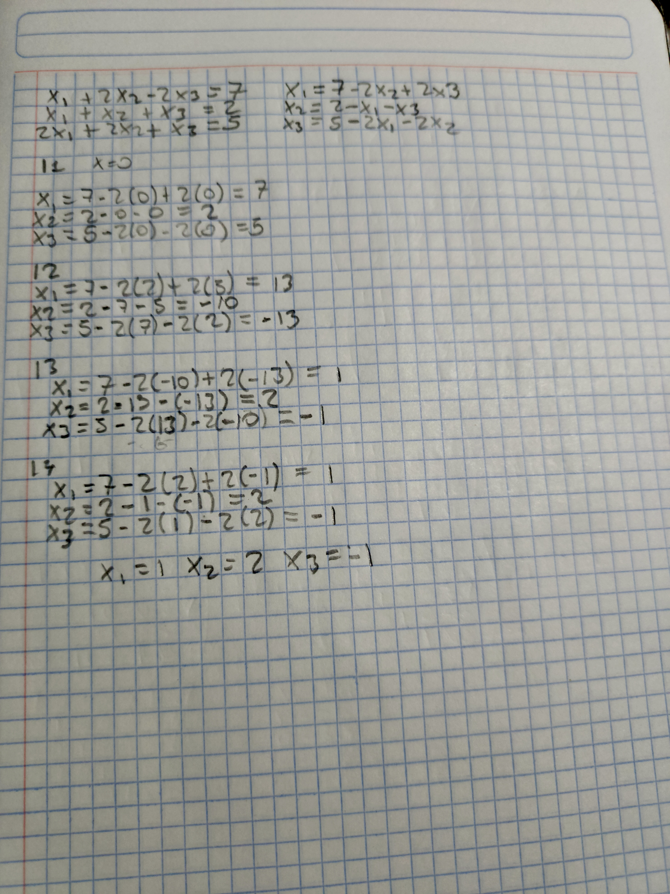{width=600}


#### Sistema: 8

$$
A = \begin{bmatrix}
-4 & 14 & 0 &  = & 10 \\
-5 & 13 & 0 &  = & 8 \\
-1 & 0 & 2 &  = & 1
\end{bmatrix}
$$

```{r}
A <- matrix(c(-4,14,0,
-5,13,0,
-1,0,2), nrow = 3, byrow = TRUE)

b <- c(10,8,1)

# Vector inicial x^(0)
x <- rep(0, 3)
cat("x^(0) =", paste(sprintf("%.8f", x), collapse = ", "), "\n")

#  2. Proceso Iterativo Manual (20 Pasos) 

#### Iteración 1
x_old <- x
x_new <- rep(0, 3) # Vector temporal para almacenar los nuevos valores (Jacobi)
cat("\nIteración 1\n")

# x1 = (b1 - a12*x2_old - a13*x3_old) / a11
x_new[1] <- (b[1] - A[1, 2] * x_old[2] - A[1, 3] * x_old[3]) / A[1, 1]
# x2 = (b2 - a21*x1_old - a23*x3_old) / a22
x_new[2] <- (b[2] - A[2, 1] * x_old[1] - A[2, 3] * x_old[3]) / A[2, 2]
# x3 = (b3 - a31*x1_old - a32*x2_old) / a33
x_new[3] <- (b[3] - A[3, 1] * x_old[1] - A[3, 2] * x_old[2]) / A[3, 3]

# Actualizar x para la siguiente iteración
x <- x_new

r <- b - A %*% x
dx_inf <- max(abs(x - x_old))
cat(sprintf("x^(1) = %s\n", paste(sprintf("%.8f", x), collapse = ", ")))
cat(sprintf("||dx||_inf = %.8e | ||r||_inf = %.8e\n", dx_inf, max(abs(r))))


#### Iteración 2
x_old <- x
x_new <- rep(0, 3)
cat("\nIteración 2\n")

# x1 = (b1 - a12*x2_old - a13*x3_old) / a11
x_new[1] <- (b[1] - A[1, 2] * x_old[2] - A[1, 3] * x_old[3]) / A[1, 1]
# x2 = (b2 - a21*x1_old - a23*x3_old) / a22
x_new[2] <- (b[2] - A[2, 1] * x_old[1] - A[2, 3] * x_old[3]) / A[2, 2]
# x3 = (b3 - a31*x1_old - a32*x2_old) / a33
x_new[3] <- (b[3] - A[3, 1] * x_old[1] - A[3, 2] * x_old[2]) / A[3, 3]

x <- x_new

r <- b - A %*% x
dx_inf <- max(abs(x - x_old))
cat(sprintf("x^(2) = %s\n", paste(sprintf("%.8f", x), collapse = ", ")))
cat(sprintf("||dx||_inf = %.8e | ||r||_inf = %.8e\n", dx_inf, max(abs(r))))

#### Iteración 3
x_old <- x
x_new <- rep(0, 3)
cat("\nIteración 3\n")

# x1 = (b1 - a12*x2_old - a13*x3_old) / a11
x_new[1] <- (b[1] - A[1, 2] * x_old[2] - A[1, 3] * x_old[3]) / A[1, 1]
# x2 = (b2 - a21*x1_old - a23*x3_old) / a22
x_new[2] <- (b[2] - A[2, 1] * x_old[1] - A[2, 3] * x_old[3]) / A[2, 2]
# x3 = (b3 - a31*x1_old - a32*x2_old) / a33
x_new[3] <- (b[3] - A[3, 1] * x_old[1] - A[3, 2] * x_old[2]) / A[3, 3]

x <- x_new

r <- b - A %*% x
dx_inf <- max(abs(x - x_old))
cat(sprintf("x^(3) = %s\n", paste(sprintf("%.8f", x), collapse = ", ")))
cat(sprintf("||dx||_inf = %.8e | ||r||_inf = %.8e\n", dx_inf, max(abs(r))))

#### Iteración 4
x_old <- x
x_new <- rep(0, 3)
cat("\nIteración 4\n")

# x1 = (b1 - a12*x2_old - a13*x3_old) / a11
x_new[1] <- (b[1] - A[1, 2] * x_old[2] - A[1, 3] * x_old[3]) / A[1, 1]
# x2 = (b2 - a21*x1_old - a23*x3_old) / a22
x_new[2] <- (b[2] - A[2, 1] * x_old[1] - A[2, 3] * x_old[3]) / A[2, 2]
# x3 = (b3 - a31*x1_old - a32*x2_old) / a33
x_new[3] <- (b[3] - A[3, 1] * x_old[1] - A[3, 2] * x_old[2]) / A[3, 3]

x <- x_new

r <- b - A %*% x
dx_inf <- max(abs(x - x_old))
cat(sprintf("x^(4) = %s\n", paste(sprintf("%.8f", x), collapse = ", ")))
cat(sprintf("||dx||_inf = %.8e | ||r||_inf = %.8e\n", dx_inf, max(abs(r))))

#### Iteración 5
x_old <- x
x_new <- rep(0, 3)
cat("\nIteración 5\n")

# x1 = (b1 - a12*x2_old - a13*x3_old) / a11
x_new[1] <- (b[1] - A[1, 2] * x_old[2] - A[1, 3] * x_old[3]) / A[1, 1]
# x2 = (b2 - a21*x1_old - a23*x3_old) / a22
x_new[2] <- (b[2] - A[2, 1] * x_old[1] - A[2, 3] * x_old[3]) / A[2, 2]
# x3 = (b3 - a31*x1_old - a32*x2_old) / a33
x_new[3] <- (b[3] - A[3, 1] * x_old[1] - A[3, 2] * x_old[2]) / A[3, 3]

x <- x_new

r <- b - A %*% x
dx_inf <- max(abs(x - x_old))
cat(sprintf("x^(5) = %s\n", paste(sprintf("%.8f", x), collapse = ", ")))
cat(sprintf("||dx||_inf = %.8e | ||r||_inf = %.8e\n", dx_inf, max(abs(r))))

#### Iteración 6
x_old <- x
x_new <- rep(0, 3)
cat("\nIteración 6\n")

# x1 = (b1 - a12*x2_old - a13*x3_old) / a11
x_new[1] <- (b[1] - A[1, 2] * x_old[2] - A[1, 3] * x_old[3]) / A[1, 1]
# x2 = (b2 - a21*x1_old - a23*x3_old) / a22
x_new[2] <- (b[2] - A[2, 1] * x_old[1] - A[2, 3] * x_old[3]) / A[2, 2]
# x3 = (b3 - a31*x1_old - a32*x2_old) / a33
x_new[3] <- (b[3] - A[3, 1] * x_old[1] - A[3, 2] * x_old[2]) / A[3, 3]

x <- x_new

r <- b - A %*% x
dx_inf <- max(abs(x - x_old))
cat(sprintf("x^(6) = %s\n", paste(sprintf("%.8f", x), collapse = ", ")))
cat(sprintf("||dx||_inf = %.8e | ||r||_inf = %.8e\n", dx_inf, max(abs(r))))

#### Iteración 7
x_old <- x
x_new <- rep(0, 3)
cat("\nIteración 7\n")

# x1 = (b1 - a12*x2_old - a13*x3_old) / a11
x_new[1] <- (b[1] - A[1, 2] * x_old[2] - A[1, 3] * x_old[3]) / A[1, 1]
# x2 = (b2 - a21*x1_old - a23*x3_old) / a22
x_new[2] <- (b[2] - A[2, 1] * x_old[1] - A[2, 3] * x_old[3]) / A[2, 2]
# x3 = (b3 - a31*x1_old - a32*x2_old) / a33
x_new[3] <- (b[3] - A[3, 1] * x_old[1] - A[3, 2] * x_old[2]) / A[3, 3]

x <- x_new

r <- b - A %*% x
dx_inf <- max(abs(x - x_old))
cat(sprintf("x^(7) = %s\n", paste(sprintf("%.8f", x), collapse = ", ")))
cat(sprintf("||dx||_inf = %.8e | ||r||_inf = %.8e\n", dx_inf, max(abs(r))))

#### Iteración 8
x_old <- x
x_new <- rep(0, 3)
cat("\nIteración 8\n")

# x1 = (b1 - a12*x2_old - a13*x3_old) / a11
x_new[1] <- (b[1] - A[1, 2] * x_old[2] - A[1, 3] * x_old[3]) / A[1, 1]
# x2 = (b2 - a21*x1_old - a23*x3_old) / a22
x_new[2] <- (b[2] - A[2, 1] * x_old[1] - A[2, 3] * x_old[3]) / A[2, 2]
# x3 = (b3 - a31*x1_old - a32*x2_old) / a33
x_new[3] <- (b[3] - A[3, 1] * x_old[1] - A[3, 2] * x_old[2]) / A[3, 3]

x <- x_new

r <- b - A %*% x
dx_inf <- max(abs(x - x_old))
cat(sprintf("x^(8) = %s\n", paste(sprintf("%.8f", x), collapse = ", ")))
cat(sprintf("||dx||_inf = %.8e | ||r||_inf = %.8e\n", dx_inf, max(abs(r))))

#### Iteración 9
x_old <- x
x_new <- rep(0, 3)
cat("\nIteración 9\n")

# x1 = (b1 - a12*x2_old - a13*x3_old) / a11
x_new[1] <- (b[1] - A[1, 2] * x_old[2] - A[1, 3] * x_old[3]) / A[1, 1]
# x2 = (b2 - a21*x1_old - a23*x3_old) / a22
x_new[2] <- (b[2] - A[2, 1] * x_old[1] - A[2, 3] * x_old[3]) / A[2, 2]
# x3 = (b3 - a31*x1_old - a32*x2_old) / a33
x_new[3] <- (b[3] - A[3, 1] * x_old[1] - A[3, 2] * x_old[2]) / A[3, 3]

x <- x_new

r <- b - A %*% x
dx_inf <- max(abs(x - x_old))
cat(sprintf("x^(9) = %s\n", paste(sprintf("%.8f", x), collapse = ", ")))
cat(sprintf("||dx||_inf = %.8e | ||r||_inf = %.8e\n", dx_inf, max(abs(r))))

#### Iteración 10
x_old <- x
x_new <- rep(0, 3)
cat("\nIteración 10\n")

# x1 = (b1 - a12*x2_old - a13*x3_old) / a11
x_new[1] <- (b[1] - A[1, 2] * x_old[2] - A[1, 3] * x_old[3]) / A[1, 1]
# x2 = (b2 - a21*x1_old - a23*x3_old) / a22
x_new[2] <- (b[2] - A[2, 1] * x_old[1] - A[2, 3] * x_old[3]) / A[2, 2]
# x3 = (b3 - a31*x1_old - a32*x2_old) / a33
x_new[3] <- (b[3] - A[3, 1] * x_old[1] - A[3, 2] * x_old[2]) / A[3, 3]

x <- x_new

r <- b - A %*% x
dx_inf <- max(abs(x - x_old))
cat(sprintf("x^(10) = %s\n", paste(sprintf("%.8f", x), collapse = ", ")))
cat(sprintf("||dx||_inf = %.8e | ||r||_inf = %.8e\n", dx_inf, max(abs(r))))

#### Iteración 11
x_old <- x
x_new <- rep(0, 3)
cat("\nIteración 11\n")

# x1 = (b1 - a12*x2_old - a13*x3_old) / a11
x_new[1] <- (b[1] - A[1, 2] * x_old[2] - A[1, 3] * x_old[3]) / A[1, 1]
# x2 = (b2 - a21*x1_old - a23*x3_old) / a22
x_new[2] <- (b[2] - A[2, 1] * x_old[1] - A[2, 3] * x_old[3]) / A[2, 2]
# x3 = (b3 - a31*x1_old - a32*x2_old) / a33
x_new[3] <- (b[3] - A[3, 1] * x_old[1] - A[3, 2] * x_old[2]) / A[3, 3]

x <- x_new

r <- b - A %*% x
dx_inf <- max(abs(x - x_old))
cat(sprintf("x^(11) = %s\n", paste(sprintf("%.8f", x), collapse = ", ")))
cat(sprintf("||dx||_inf = %.8e | ||r||_inf = %.8e\n", dx_inf, max(abs(r))))

#### Iteración 12
x_old <- x
x_new <- rep(0, 3)
cat("\nIteración 12\n")

# x1 = (b1 - a12*x2_old - a13*x3_old) / a11
x_new[1] <- (b[1] - A[1, 2] * x_old[2] - A[1, 3] * x_old[3]) / A[1, 1]
# x2 = (b2 - a21*x1_old - a23*x3_old) / a22
x_new[2] <- (b[2] - A[2, 1] * x_old[1] - A[2, 3] * x_old[3]) / A[2, 2]
# x3 = (b3 - a31*x1_old - a32*x2_old) / a33
x_new[3] <- (b[3] - A[3, 1] * x_old[1] - A[3, 2] * x_old[2]) / A[3, 3]

x <- x_new

r <- b - A %*% x
dx_inf <- max(abs(x - x_old))
cat(sprintf("x^(12) = %s\n", paste(sprintf("%.8f", x), collapse = ", ")))
cat(sprintf("||dx||_inf = %.8e | ||r||_inf = %.8e\n", dx_inf, max(abs(r))))

#### Iteración 13
x_old <- x
x_new <- rep(0, 3)
cat("\nIteración 13\n")

# x1 = (b1 - a12*x2_old - a13*x3_old) / a11
x_new[1] <- (b[1] - A[1, 2] * x_old[2] - A[1, 3] * x_old[3]) / A[1, 1]
# x2 = (b2 - a21*x1_old - a23*x3_old) / a22
x_new[2] <- (b[2] - A[2, 1] * x_old[1] - A[2, 3] * x_old[3]) / A[2, 2]
# x3 = (b3 - a31*x1_old - a32*x2_old) / a33
x_new[3] <- (b[3] - A[3, 1] * x_old[1] - A[3, 2] * x_old[2]) / A[3, 3]

x <- x_new

r <- b - A %*% x
dx_inf <- max(abs(x - x_old))
cat(sprintf("x^(13) = %s\n", paste(sprintf("%.8f", x), collapse = ", ")))
cat(sprintf("||dx||_inf = %.8e | ||r||_inf = %.8e\n", dx_inf, max(abs(r))))

#### Iteración 14
x_old <- x
x_new <- rep(0, 3)
cat("\nIteración 14\n")

# x1 = (b1 - a12*x2_old - a13*x3_old) / a11
x_new[1] <- (b[1] - A[1, 2] * x_old[2] - A[1, 3] * x_old[3]) / A[1, 1]
# x2 = (b2 - a21*x1_old - a23*x3_old) / a22
x_new[2] <- (b[2] - A[2, 1] * x_old[1] - A[2, 3] * x_old[3]) / A[2, 2]
# x3 = (b3 - a31*x1_old - a32*x2_old) / a33
x_new[3] <- (b[3] - A[3, 1] * x_old[1] - A[3, 2] * x_old[2]) / A[3, 3]

x <- x_new

r <- b - A %*% x
dx_inf <- max(abs(x - x_old))
cat(sprintf("x^(14) = %s\n", paste(sprintf("%.8f", x), collapse = ", ")))
cat(sprintf("||dx||_inf = %.8e | ||r||_inf = %.8e\n", dx_inf, max(abs(r))))

#### Iteración 15
x_old <- x
x_new <- rep(0, 3)
cat("\nIteración 15\n")

# x1 = (b1 - a12*x2_old - a13*x3_old) / a11
x_new[1] <- (b[1] - A[1, 2] * x_old[2] - A[1, 3] * x_old[3]) / A[1, 1]
# x2 = (b2 - a21*x1_old - a23*x3_old) / a22
x_new[2] <- (b[2] - A[2, 1] * x_old[1] - A[2, 3] * x_old[3]) / A[2, 2]
# x3 = (b3 - a31*x1_old - a32*x2_old) / a33
x_new[3] <- (b[3] - A[3, 1] * x_old[1] - A[3, 2] * x_old[2]) / A[3, 3]

x <- x_new

r <- b - A %*% x
dx_inf <- max(abs(x - x_old))
cat(sprintf("x^(15) = %s\n", paste(sprintf("%.8f", x), collapse = ", ")))
cat(sprintf("||dx||_inf = %.8e | ||r||_inf = %.8e\n", dx_inf, max(abs(r))))

#### Iteración 16
x_old <- x
x_new <- rep(0, 3)
cat("\nIteración 16\n")

# x1 = (b1 - a12*x2_old - a13*x3_old) / a11
x_new[1] <- (b[1] - A[1, 2] * x_old[2] - A[1, 3] * x_old[3]) / A[1, 1]
# x2 = (b2 - a21*x1_old - a23*x3_old) / a22
x_new[2] <- (b[2] - A[2, 1] * x_old[1] - A[2, 3] * x_old[3]) / A[2, 2]
# x3 = (b3 - a31*x1_old - a32*x2_old) / a33
x_new[3] <- (b[3] - A[3, 1] * x_old[1] - A[3, 2] * x_old[2]) / A[3, 3]

x <- x_new

r <- b - A %*% x
dx_inf <- max(abs(x - x_old))
cat(sprintf("x^(16) = %s\n", paste(sprintf("%.8f", x), collapse = ", ")))
cat(sprintf("||dx||_inf = %.8e | ||r||_inf = %.8e\n", dx_inf, max(abs(r))))

#### Iteración 17
x_old <- x
x_new <- rep(0, 3)
cat("\nIteración 17\n")

# x1 = (b1 - a12*x2_old - a13*x3_old) / a11
x_new[1] <- (b[1] - A[1, 2] * x_old[2] - A[1, 3] * x_old[3]) / A[1, 1]
# x2 = (b2 - a21*x1_old - a23*x3_old) / a22
x_new[2] <- (b[2] - A[2, 1] * x_old[1] - A[2, 3] * x_old[3]) / A[2, 2]
# x3 = (b3 - a31*x1_old - a32*x2_old) / a33
x_new[3] <- (b[3] - A[3, 1] * x_old[1] - A[3, 2] * x_old[2]) / A[3, 3]

x <- x_new

r <- b - A %*% x
dx_inf <- max(abs(x - x_old))
cat(sprintf("x^(17) = %s\n", paste(sprintf("%.8f", x), collapse = ", ")))
cat(sprintf("||dx||_inf = %.8e | ||r||_inf = %.8e\n", dx_inf, max(abs(r))))

#### Iteración 18
x_old <- x
x_new <- rep(0, 3)
cat("\nIteración 18\n")

# x1 = (b1 - a12*x2_old - a13*x3_old) / a11
x_new[1] <- (b[1] - A[1, 2] * x_old[2] - A[1, 3] * x_old[3]) / A[1, 1]
# x2 = (b2 - a21*x1_old - a23*x3_old) / a22
x_new[2] <- (b[2] - A[2, 1] * x_old[1] - A[2, 3] * x_old[3]) / A[2, 2]
# x3 = (b3 - a31*x1_old - a32*x2_old) / a33
x_new[3] <- (b[3] - A[3, 1] * x_old[1] - A[3, 2] * x_old[2]) / A[3, 3]

x <- x_new

r <- b - A %*% x
dx_inf <- max(abs(x - x_old))
cat(sprintf("x^(18) = %s\n", paste(sprintf("%.8f", x), collapse = ", ")))
cat(sprintf("||dx||_inf = %.8e | ||r||_inf = %.8e\n", dx_inf, max(abs(r))))

#### Iteración 19
x_old <- x
x_new <- rep(0, 3)
cat("\nIteración 19\n")

# x1 = (b1 - a12*x2_old - a13*x3_old) / a11
x_new[1] <- (b[1] - A[1, 2] * x_old[2] - A[1, 3] * x_old[3]) / A[1, 1]
# x2 = (b2 - a21*x1_old - a23*x3_old) / a22
x_new[2] <- (b[2] - A[2, 1] * x_old[1] - A[2, 3] * x_old[3]) / A[2, 2]
# x3 = (b3 - a31*x1_old - a32*x2_old) / a33
x_new[3] <- (b[3] - A[3, 1] * x_old[1] - A[3, 2] * x_old[2]) / A[3, 3]

x <- x_new

r <- b - A %*% x
dx_inf <- max(abs(x - x_old))
cat(sprintf("x^(19) = %s\n", paste(sprintf("%.8f", x), collapse = ", ")))
cat(sprintf("||dx||_inf = %.8e | ||r||_inf = %.8e\n", dx_inf, max(abs(r))))

#### Iteración 20
x_old <- x
x_new <- rep(0, 3)
cat("\nIteración 20\n")

# x1 = (b1 - a12*x2_old - a13*x3_old) / a11
x_new[1] <- (b[1] - A[1, 2] * x_old[2] - A[1, 3] * x_old[3]) / A[1, 1]
# x2 = (b2 - a21*x1_old - a23*x3_old) / a22
x_new[2] <- (b[2] - A[2, 1] * x_old[1] - A[2, 3] * x_old[3]) / A[2, 2]
# x3 = (b3 - a31*x1_old - a32*x2_old) / a33
x_new[3] <- (b[3] - A[3, 1] * x_old[1] - A[3, 2] * x_old[2]) / A[3, 3]

x <- x_new

r <- b - A %*% x
dx_inf <- max(abs(x - x_old))
cat(sprintf("x^(20) = %s\n", paste(sprintf("%.8f", x), collapse = ", ")))
cat(sprintf("||dx||_inf = %.8e | ||r||_inf = %.8e\n", dx_inf, max(abs(r))))

cat("Solución aproximada después de 20 iteraciones (Método de Jacobi):\n")
print(round(x, 8))
``` 

#### Sistema: 9
$$
A = \begin{bmatrix}
1 & 1 & 2 & = & 1 \\
1 & 2 & 1 & = & 1 \\
2 & 1 & 1 & = & 1
\end{bmatrix}
$$

```{r}
A <- matrix(c(1,1,2,
1,2,1,
2,1,1), nrow = 3, byrow = TRUE)

b <- c(1,1,1)

# Vector inicial x^(0)
x <- rep(0, 3)
cat("x^(0) =", paste(sprintf("%.8f", x), collapse = ", "), "\n")

# --- 2. Proceso Iterativo Manual (20 Pasos) ---

#### Iteración 1
x_old <- x
x_new <- rep(0, 3) # Vector temporal para almacenar los nuevos valores (Jacobi)
cat("\nIteración 1\n")

# x1 = (b1 - a12*x2_old - a13*x3_old) / a11
x_new[1] <- (b[1] - A[1, 2] * x_old[2] - A[1, 3] * x_old[3]) / A[1, 1]
# x2 = (b2 - a21*x1_old - a23*x3_old) / a22
x_new[2] <- (b[2] - A[2, 1] * x_old[1] - A[2, 3] * x_old[3]) / A[2, 2]
# x3 = (b3 - a31*x1_old - a32*x2_old) / a33
x_new[3] <- (b[3] - A[3, 1] * x_old[1] - A[3, 2] * x_old[2]) / A[3, 3]

# Actualizar x para la siguiente iteración
x <- x_new

r <- b - A %*% x
dx_inf <- max(abs(x - x_old))
cat(sprintf("x^(1) = %s\n", paste(sprintf("%.8f", x), collapse = ", ")))
cat(sprintf("||dx||_inf = %.8e | ||r||_inf = %.8e\n", dx_inf, max(abs(r))))


#### Iteración 2
x_old <- x
x_new <- rep(0, 3)
cat("\nIteración 2\n")

# x1 = (b1 - a12*x2_old - a13*x3_old) / a11
x_new[1] <- (b[1] - A[1, 2] * x_old[2] - A[1, 3] * x_old[3]) / A[1, 1]
# x2 = (b2 - a21*x1_old - a23*x3_old) / a22
x_new[2] <- (b[2] - A[2, 1] * x_old[1] - A[2, 3] * x_old[3]) / A[2, 2]
# x3 = (b3 - a31*x1_old - a32*x2_old) / a33
x_new[3] <- (b[3] - A[3, 1] * x_old[1] - A[3, 2] * x_old[2]) / A[3, 3]

x <- x_new

r <- b - A %*% x
dx_inf <- max(abs(x - x_old))
cat(sprintf("x^(2) = %s\n", paste(sprintf("%.8f", x), collapse = ", ")))
cat(sprintf("||dx||_inf = %.8e | ||r||_inf = %.8e\n", dx_inf, max(abs(r))))

#### Iteración 3
x_old <- x
x_new <- rep(0, 3)
cat("\nIteración 3\n")

# x1 = (b1 - a12*x2_old - a13*x3_old) / a11
x_new[1] <- (b[1] - A[1, 2] * x_old[2] - A[1, 3] * x_old[3]) / A[1, 1]
# x2 = (b2 - a21*x1_old - a23*x3_old) / a22
x_new[2] <- (b[2] - A[2, 1] * x_old[1] - A[2, 3] * x_old[3]) / A[2, 2]
# x3 = (b3 - a31*x1_old - a32*x2_old) / a33
x_new[3] <- (b[3] - A[3, 1] * x_old[1] - A[3, 2] * x_old[2]) / A[3, 3]

x <- x_new

r <- b - A %*% x
dx_inf <- max(abs(x - x_old))
cat(sprintf("x^(3) = %s\n", paste(sprintf("%.8f", x), collapse = ", ")))
cat(sprintf("||dx||_inf = %.8e | ||r||_inf = %.8e\n", dx_inf, max(abs(r))))

#### Iteración 4
x_old <- x
x_new <- rep(0, 3)
cat("\nIteración 4\n")

# x1 = (b1 - a12*x2_old - a13*x3_old) / a11
x_new[1] <- (b[1] - A[1, 2] * x_old[2] - A[1, 3] * x_old[3]) / A[1, 1]
# x2 = (b2 - a21*x1_old - a23*x3_old) / a22
x_new[2] <- (b[2] - A[2, 1] * x_old[1] - A[2, 3] * x_old[3]) / A[2, 2]
# x3 = (b3 - a31*x1_old - a32*x2_old) / a33
x_new[3] <- (b[3] - A[3, 1] * x_old[1] - A[3, 2] * x_old[2]) / A[3, 3]

x <- x_new

r <- b - A %*% x
dx_inf <- max(abs(x - x_old))
cat(sprintf("x^(4) = %s\n", paste(sprintf("%.8f", x), collapse = ", ")))
cat(sprintf("||dx||_inf = %.8e | ||r||_inf = %.8e\n", dx_inf, max(abs(r))))

#### Iteración 5
x_old <- x
x_new <- rep(0, 3)
cat("\nIteración 5\n")

# x1 = (b1 - a12*x2_old - a13*x3_old) / a11
x_new[1] <- (b[1] - A[1, 2] * x_old[2] - A[1, 3] * x_old[3]) / A[1, 1]
# x2 = (b2 - a21*x1_old - a23*x3_old) / a22
x_new[2] <- (b[2] - A[2, 1] * x_old[1] - A[2, 3] * x_old[3]) / A[2, 2]
# x3 = (b3 - a31*x1_old - a32*x2_old) / a33
x_new[3] <- (b[3] - A[3, 1] * x_old[1] - A[3, 2] * x_old[2]) / A[3, 3]

x <- x_new

r <- b - A %*% x
dx_inf <- max(abs(x - x_old))
cat(sprintf("x^(5) = %s\n", paste(sprintf("%.8f", x), collapse = ", ")))
cat(sprintf("||dx||_inf = %.8e | ||r||_inf = %.8e\n", dx_inf, max(abs(r))))

#### Iteración 6
x_old <- x
x_new <- rep(0, 3)
cat("\nIteración 6\n")

# x1 = (b1 - a12*x2_old - a13*x3_old) / a11
x_new[1] <- (b[1] - A[1, 2] * x_old[2] - A[1, 3] * x_old[3]) / A[1, 1]
# x2 = (b2 - a21*x1_old - a23*x3_old) / a22
x_new[2] <- (b[2] - A[2, 1] * x_old[1] - A[2, 3] * x_old[3]) / A[2, 2]
# x3 = (b3 - a31*x1_old - a32*x2_old) / a33
x_new[3] <- (b[3] - A[3, 1] * x_old[1] - A[3, 2] * x_old[2]) / A[3, 3]

x <- x_new

r <- b - A %*% x
dx_inf <- max(abs(x - x_old))
cat(sprintf("x^(6) = %s\n", paste(sprintf("%.8f", x), collapse = ", ")))
cat(sprintf("||dx||_inf = %.8e | ||r||_inf = %.8e\n", dx_inf, max(abs(r))))

#### Iteración 7
x_old <- x
x_new <- rep(0, 3)
cat("\nIteración 7\n")

# x1 = (b1 - a12*x2_old - a13*x3_old) / a11
x_new[1] <- (b[1] - A[1, 2] * x_old[2] - A[1, 3] * x_old[3]) / A[1, 1]
# x2 = (b2 - a21*x1_old - a23*x3_old) / a22
x_new[2] <- (b[2] - A[2, 1] * x_old[1] - A[2, 3] * x_old[3]) / A[2, 2]
# x3 = (b3 - a31*x1_old - a32*x2_old) / a33
x_new[3] <- (b[3] - A[3, 1] * x_old[1] - A[3, 2] * x_old[2]) / A[3, 3]

x <- x_new

r <- b - A %*% x
dx_inf <- max(abs(x - x_old))
cat(sprintf("x^(7) = %s\n", paste(sprintf("%.8f", x), collapse = ", ")))
cat(sprintf("||dx||_inf = %.8e | ||r||_inf = %.8e\n", dx_inf, max(abs(r))))

#### Iteración 8
x_old <- x
x_new <- rep(0, 3)
cat("\nIteración 8\n")

# x1 = (b1 - a12*x2_old - a13*x3_old) / a11
x_new[1] <- (b[1] - A[1, 2] * x_old[2] - A[1, 3] * x_old[3]) / A[1, 1]
# x2 = (b2 - a21*x1_old - a23*x3_old) / a22
x_new[2] <- (b[2] - A[2, 1] * x_old[1] - A[2, 3] * x_old[3]) / A[2, 2]
# x3 = (b3 - a31*x1_old - a32*x2_old) / a33
x_new[3] <- (b[3] - A[3, 1] * x_old[1] - A[3, 2] * x_old[2]) / A[3, 3]

x <- x_new

r <- b - A %*% x
dx_inf <- max(abs(x - x_old))
cat(sprintf("x^(8) = %s\n", paste(sprintf("%.8f", x), collapse = ", ")))
cat(sprintf("||dx||_inf = %.8e | ||r||_inf = %.8e\n", dx_inf, max(abs(r))))

#### Iteración 9
x_old <- x
x_new <- rep(0, 3)
cat("\nIteración 9\n")

# x1 = (b1 - a12*x2_old - a13*x3_old) / a11
x_new[1] <- (b[1] - A[1, 2] * x_old[2] - A[1, 3] * x_old[3]) / A[1, 1]
# x2 = (b2 - a21*x1_old - a23*x3_old) / a22
x_new[2] <- (b[2] - A[2, 1] * x_old[1] - A[2, 3] * x_old[3]) / A[2, 2]
# x3 = (b3 - a31*x1_old - a32*x2_old) / a33
x_new[3] <- (b[3] - A[3, 1] * x_old[1] - A[3, 2] * x_old[2]) / A[3, 3]

x <- x_new

r <- b - A %*% x
dx_inf <- max(abs(x - x_old))
cat(sprintf("x^(9) = %s\n", paste(sprintf("%.8f", x), collapse = ", ")))
cat(sprintf("||dx||_inf = %.8e | ||r||_inf = %.8e\n", dx_inf, max(abs(r))))

#### Iteración 10
x_old <- x
x_new <- rep(0, 3)
cat("\nIteración 10\n")

# x1 = (b1 - a12*x2_old - a13*x3_old) / a11
x_new[1] <- (b[1] - A[1, 2] * x_old[2] - A[1, 3] * x_old[3]) / A[1, 1]
# x2 = (b2 - a21*x1_old - a23*x3_old) / a22
x_new[2] <- (b[2] - A[2, 1] * x_old[1] - A[2, 3] * x_old[3]) / A[2, 2]
# x3 = (b3 - a31*x1_old - a32*x2_old) / a33
x_new[3] <- (b[3] - A[3, 1] * x_old[1] - A[3, 2] * x_old[2]) / A[3, 3]

x <- x_new

r <- b - A %*% x
dx_inf <- max(abs(x - x_old))
cat(sprintf("x^(10) = %s\n", paste(sprintf("%.8f", x), collapse = ", ")))
cat(sprintf("||dx||_inf = %.8e | ||r||_inf = %.8e\n", dx_inf, max(abs(r))))

#### Iteración 11
x_old <- x
x_new <- rep(0, 3)
cat("\nIteración 11\n")

# x1 = (b1 - a12*x2_old - a13*x3_old) / a11
x_new[1] <- (b[1] - A[1, 2] * x_old[2] - A[1, 3] * x_old[3]) / A[1, 1]
# x2 = (b2 - a21*x1_old - a23*x3_old) / a22
x_new[2] <- (b[2] - A[2, 1] * x_old[1] - A[2, 3] * x_old[3]) / A[2, 2]
# x3 = (b3 - a31*x1_old - a32*x2_old) / a33
x_new[3] <- (b[3] - A[3, 1] * x_old[1] - A[3, 2] * x_old[2]) / A[3, 3]

x <- x_new

r <- b - A %*% x
dx_inf <- max(abs(x - x_old))
cat(sprintf("x^(11) = %s\n", paste(sprintf("%.8f", x), collapse = ", ")))
cat(sprintf("||dx||_inf = %.8e | ||r||_inf = %.8e\n", dx_inf, max(abs(r))))

#### Iteración 12
x_old <- x
x_new <- rep(0, 3)
cat("\nIteración 12\n")

# x1 = (b1 - a12*x2_old - a13*x3_old) / a11
x_new[1] <- (b[1] - A[1, 2] * x_old[2] - A[1, 3] * x_old[3]) / A[1, 1]
# x2 = (b2 - a21*x1_old - a23*x3_old) / a22
x_new[2] <- (b[2] - A[2, 1] * x_old[1] - A[2, 3] * x_old[3]) / A[2, 2]
# x3 = (b3 - a31*x1_old - a32*x2_old) / a33
x_new[3] <- (b[3] - A[3, 1] * x_old[1] - A[3, 2] * x_old[2]) / A[3, 3]

x <- x_new

r <- b - A %*% x
dx_inf <- max(abs(x - x_old))
cat(sprintf("x^(12) = %s\n", paste(sprintf("%.8f", x), collapse = ", ")))
cat(sprintf("||dx||_inf = %.8e | ||r||_inf = %.8e\n", dx_inf, max(abs(r))))

#### Iteración 13
x_old <- x
x_new <- rep(0, 3)
cat("\nIteración 13\n")

# x1 = (b1 - a12*x2_old - a13*x3_old) / a11
x_new[1] <- (b[1] - A[1, 2] * x_old[2] - A[1, 3] * x_old[3]) / A[1, 1]
# x2 = (b2 - a21*x1_old - a23*x3_old) / a22
x_new[2] <- (b[2] - A[2, 1] * x_old[1] - A[2, 3] * x_old[3]) / A[2, 2]
# x3 = (b3 - a31*x1_old - a32*x2_old) / a33
x_new[3] <- (b[3] - A[3, 1] * x_old[1] - A[3, 2] * x_old[2]) / A[3, 3]

x <- x_new

r <- b - A %*% x
dx_inf <- max(abs(x - x_old))
cat(sprintf("x^(13) = %s\n", paste(sprintf("%.8f", x), collapse = ", ")))
cat(sprintf("||dx||_inf = %.8e | ||r||_inf = %.8e\n", dx_inf, max(abs(r))))

#### Iteración 14
x_old <- x
x_new <- rep(0, 3)
cat("\nIteración 14\n")

# x1 = (b1 - a12*x2_old - a13*x3_old) / a11
x_new[1] <- (b[1] - A[1, 2] * x_old[2] - A[1, 3] * x_old[3]) / A[1, 1]
# x2 = (b2 - a21*x1_old - a23*x3_old) / a22
x_new[2] <- (b[2] - A[2, 1] * x_old[1] - A[2, 3] * x_old[3]) / A[2, 2]
# x3 = (b3 - a31*x1_old - a32*x2_old) / a33
x_new[3] <- (b[3] - A[3, 1] * x_old[1] - A[3, 2] * x_old[2]) / A[3, 3]

x <- x_new

r <- b - A %*% x
dx_inf <- max(abs(x - x_old))
cat(sprintf("x^(14) = %s\n", paste(sprintf("%.8f", x), collapse = ", ")))
cat(sprintf("||dx||_inf = %.8e | ||r||_inf = %.8e\n", dx_inf, max(abs(r))))

#### Iteración 15
x_old <- x
x_new <- rep(0, 3)
cat("\nIteración 15\n")

# x1 = (b1 - a12*x2_old - a13*x3_old) / a11
x_new[1] <- (b[1] - A[1, 2] * x_old[2] - A[1, 3] * x_old[3]) / A[1, 1]
# x2 = (b2 - a21*x1_old - a23*x3_old) / a22
x_new[2] <- (b[2] - A[2, 1] * x_old[1] - A[2, 3] * x_old[3]) / A[2, 2]
# x3 = (b3 - a31*x1_old - a32*x2_old) / a33
x_new[3] <- (b[3] - A[3, 1] * x_old[1] - A[3, 2] * x_old[2]) / A[3, 3]

x <- x_new

r <- b - A %*% x
dx_inf <- max(abs(x - x_old))
cat(sprintf("x^(15) = %s\n", paste(sprintf("%.8f", x), collapse = ", ")))
cat(sprintf("||dx||_inf = %.8e | ||r||_inf = %.8e\n", dx_inf, max(abs(r))))

#### Iteración 16
x_old <- x
x_new <- rep(0, 3)
cat("\nIteración 16\n")

# x1 = (b1 - a12*x2_old - a13*x3_old) / a11
x_new[1] <- (b[1] - A[1, 2] * x_old[2] - A[1, 3] * x_old[3]) / A[1, 1]
# x2 = (b2 - a21*x1_old - a23*x3_old) / a22
x_new[2] <- (b[2] - A[2, 1] * x_old[1] - A[2, 3] * x_old[3]) / A[2, 2]
# x3 = (b3 - a31*x1_old - a32*x2_old) / a33
x_new[3] <- (b[3] - A[3, 1] * x_old[1] - A[3, 2] * x_old[2]) / A[3, 3]

x <- x_new

r <- b - A %*% x
dx_inf <- max(abs(x - x_old))
cat(sprintf("x^(16) = %s\n", paste(sprintf("%.8f", x), collapse = ", ")))
cat(sprintf("||dx||_inf = %.8e | ||r||_inf = %.8e\n", dx_inf, max(abs(r))))

#### Iteración 17
x_old <- x
x_new <- rep(0, 3)
cat("\nIteración 17\n")

# x1 = (b1 - a12*x2_old - a13*x3_old) / a11
x_new[1] <- (b[1] - A[1, 2] * x_old[2] - A[1, 3] * x_old[3]) / A[1, 1]
# x2 = (b2 - a21*x1_old - a23*x3_old) / a22
x_new[2] <- (b[2] - A[2, 1] * x_old[1] - A[2, 3] * x_old[3]) / A[2, 2]
# x3 = (b3 - a31*x1_old - a32*x2_old) / a33
x_new[3] <- (b[3] - A[3, 1] * x_old[1] - A[3, 2] * x_old[2]) / A[3, 3]

x <- x_new

r <- b - A %*% x
dx_inf <- max(abs(x - x_old))
cat(sprintf("x^(17) = %s\n", paste(sprintf("%.8f", x), collapse = ", ")))
cat(sprintf("||dx||_inf = %.8e | ||r||_inf = %.8e\n", dx_inf, max(abs(r))))

#### Iteración 18
x_old <- x
x_new <- rep(0, 3)
cat("\nIteración 18\n")

# x1 = (b1 - a12*x2_old - a13*x3_old) / a11
x_new[1] <- (b[1] - A[1, 2] * x_old[2] - A[1, 3] * x_old[3]) / A[1, 1]
# x2 = (b2 - a21*x1_old - a23*x3_old) / a22
x_new[2] <- (b[2] - A[2, 1] * x_old[1] - A[2, 3] * x_old[3]) / A[2, 2]
# x3 = (b3 - a31*x1_old - a32*x2_old) / a33
x_new[3] <- (b[3] - A[3, 1] * x_old[1] - A[3, 2] * x_old[2]) / A[3, 3]

x <- x_new

r <- b - A %*% x
dx_inf <- max(abs(x - x_old))
cat(sprintf("x^(18) = %s\n", paste(sprintf("%.8f", x), collapse = ", ")))
cat(sprintf("||dx||_inf = %.8e | ||r||_inf = %.8e\n", dx_inf, max(abs(r))))

#### Iteración 19
x_old <- x
x_new <- rep(0, 3)
cat("\nIteración 19\n")

# x1 = (b1 - a12*x2_old - a13*x3_old) / a11
x_new[1] <- (b[1] - A[1, 2] * x_old[2] - A[1, 3] * x_old[3]) / A[1, 1]
# x2 = (b2 - a21*x1_old - a23*x3_old) / a22
x_new[2] <- (b[2] - A[2, 1] * x_old[1] - A[2, 3] * x_old[3]) / A[2, 2]
# x3 = (b3 - a31*x1_old - a32*x2_old) / a33
x_new[3] <- (b[3] - A[3, 1] * x_old[1] - A[3, 2] * x_old[2]) / A[3, 3]

x <- x_new

r <- b - A %*% x
dx_inf <- max(abs(x - x_old))
cat(sprintf("x^(19) = %s\n", paste(sprintf("%.8f", x), collapse = ", ")))
cat(sprintf("||dx||_inf = %.8e | ||r||_inf = %.8e\n", dx_inf, max(abs(r))))

#### Iteración 20
x_old <- x
x_new <- rep(0, 3)
cat("\nIteración 20\n")

# x1 = (b1 - a12*x2_old - a13*x3_old) / a11
x_new[1] <- (b[1] - A[1, 2] * x_old[2] - A[1, 3] * x_old[3]) / A[1, 1]
# x2 = (b2 - a21*x1_old - a23*x3_old) / a22
x_new[2] <- (b[2] - A[2, 1] * x_old[1] - A[2, 3] * x_old[3]) / A[2, 2]
# x3 = (b3 - a31*x1_old - a32*x2_old) / a33
x_new[3] <- (b[3] - A[3, 1] * x_old[1] - A[3, 2] * x_old[2]) / A[3, 3]

x <- x_new

r <- b - A %*% x
dx_inf <- max(abs(x - x_old))
cat(sprintf("x^(20) = %s\n", paste(sprintf("%.8f", x), collapse = ", ")))
cat(sprintf("||dx||_inf = %.8e | ||r||_inf = %.8e\n", dx_inf, max(abs(r))))

cat("Solución aproximada después de 20 iteraciones (Método de Jacobi):\n")
print(round(x, 8))
```


#### Sistema: 10 
$$
A = \begin{bmatrix}
6 & -2 & 2 & 4 & = & 10 \\
12 & -8 & 6 & 10 & = & 20 \\
3 & -13 & 9 & 3 & = & 2\\
-6 & 4 & 1 & -18 & = & -19
\end{bmatrix}
$$

```{r}
A <- matrix(c(6,-2,2,4,
              12,-8,6,10,
              3,-13,9,3,
              -6,4,1,-18), nrow = 4, byrow = TRUE)

# b: Vector de términos independientes
b <- c(10,20,2,-19)

cat("Matriz A:\n")
print(A)
cat("\nVector b:\n")
print(b)

#  2. Preparación de la Iteración 
# Vector inicial x^(0)
x <- rep(0, 4)
cat("Iteración 0\nx^(0) =", paste(sprintf("%.8f", x), collapse=", "), "\n")

#  3. Proceso Iterativo Manual (20 Pasos) 

#### Bloque de Iteración 1
x_old <- x
x_new <- numeric(4)
x_new[1] <- (b[1] - A[1, 2]*x_old[2] - A[1, 3]*x_old[3] - A[1, 4]*x_old[4]) / A[1, 1]
x_new[2] <- (b[2] - A[2, 1]*x_old[1] - A[2, 3]*x_old[3] - A[2, 4]*x_old[4]) / A[2, 2]
x_new[3] <- (b[3] - A[3, 1]*x_old[1] - A[3, 2]*x_old[2] - A[3, 4]*x_old[4]) / A[3, 3]
x_new[4] <- (b[4] - A[4, 1]*x_old[1] - A[4, 2]*x_old[2] - A[4, 3]*x_old[3]) / A[4, 4]

dx_inf <- max(abs(x_new - x_old))
x <- x_new
cat("Iteración 1\nx^(1) =", paste(sprintf("%.8f", x), collapse=", "), "\n")
cat(sprintf("||dx||_inf = %.8e\n", dx_inf))

#### Bloque de Iteración 2
x_old <- x
x_new <- numeric(4)
x_new[1] <- (b[1] - A[1, 2]*x_old[2] - A[1, 3]*x_old[3] - A[1, 4]*x_old[4]) / A[1, 1]
x_new[2] <- (b[2] - A[2, 1]*x_old[1] - A[2, 3]*x_old[3] - A[2, 4]*x_old[4]) / A[2, 2]
x_new[3] <- (b[3] - A[3, 1]*x_old[1] - A[3, 2]*x_old[2] - A[3, 4]*x_old[4]) / A[3, 3]
x_new[4] <- (b[4] - A[4, 1]*x_old[1] - A[4, 2]*x_old[2] - A[4, 3]*x_old[3]) / A[4, 4]

dx_inf <- max(abs(x_new - x_old))
x <- x_new
cat("\nIteración 2\nx^(2) =", paste(sprintf("%.8f", x), collapse=", "), "\n")
cat(sprintf("||dx||_inf = %.8e\n", dx_inf))

#### Bloque de Iteración 3
x_old <- x
x_new <- numeric(4)
x_new[1] <- (b[1] - A[1, 2]*x_old[2] - A[1, 3]*x_old[3] - A[1, 4]*x_old[4]) / A[1, 1]
x_new[2] <- (b[2] - A[2, 1]*x_old[1] - A[2, 3]*x_old[3] - A[2, 4]*x_old[4]) / A[2, 2]
x_new[3] <- (b[3] - A[3, 1]*x_old[1] - A[3, 2]*x_old[2] - A[3, 4]*x_old[4]) / A[3, 3]
x_new[4] <- (b[4] - A[4, 1]*x_old[1] - A[4, 2]*x_old[2] - A[4, 3]*x_old[3]) / A[4, 4]

dx_inf <- max(abs(x_new - x_old))
x <- x_new
cat("\nIteración 3\nx^(3) =", paste(sprintf("%.8f", x), collapse=", "), "\n")
cat(sprintf("||dx||_inf = %.8e\n", dx_inf))

#### Bloque de Iteración 4
x_old <- x
x_new <- numeric(4)
x_new[1] <- (b[1] - A[1, 2]*x_old[2] - A[1, 3]*x_old[3] - A[1, 4]*x_old[4]) / A[1, 1]
x_new[2] <- (b[2] - A[2, 1]*x_old[1] - A[2, 3]*x_old[3] - A[2, 4]*x_old[4]) / A[2, 2]
x_new[3] <- (b[3] - A[3, 1]*x_old[1] - A[3, 2]*x_old[2] - A[3, 4]*x_old[4]) / A[3, 3]
x_new[4] <- (b[4] - A[4, 1]*x_old[1] - A[4, 2]*x_old[2] - A[4, 3]*x_old[3]) / A[4, 4]

dx_inf <- max(abs(x_new - x_old))
x <- x_new
cat("\nIteración 4\nx^(4) =", paste(sprintf("%.8f", x), collapse=", "), "\n")
cat(sprintf("||dx||_inf = %.8e\n", dx_inf))

#### Bloque de Iteración 5
x_old <- x
x_new <- numeric(4)
x_new[1] <- (b[1] - A[1, 2]*x_old[2] - A[1, 3]*x_old[3] - A[1, 4]*x_old[4]) / A[1, 1]
x_new[2] <- (b[2] - A[2, 1]*x_old[1] - A[2, 3]*x_old[3] - A[2, 4]*x_old[4]) / A[2, 2]
x_new[3] <- (b[3] - A[3, 1]*x_old[1] - A[3, 2]*x_old[2] - A[3, 4]*x_old[4]) / A[3, 3]
x_new[4] <- (b[4] - A[4, 1]*x_old[1] - A[4, 2]*x_old[2] - A[4, 3]*x_old[3]) / A[4, 4]

dx_inf <- max(abs(x_new - x_old))
x <- x_new
cat("\nIteración 5\nx^(5) =", paste(sprintf("%.8f", x), collapse=", "), "\n")
cat(sprintf("||dx||_inf = %.8e\n", dx_inf))

#### Bloque de Iteración 6
x_old <- x
x_new <- numeric(4)
x_new[1] <- (b[1] - A[1, 2]*x_old[2] - A[1, 3]*x_old[3] - A[1, 4]*x_old[4]) / A[1, 1]
x_new[2] <- (b[2] - A[2, 1]*x_old[1] - A[2, 3]*x_old[3] - A[2, 4]*x_old[4]) / A[2, 2]
x_new[3] <- (b[3] - A[3, 1]*x_old[1] - A[3, 2]*x_old[2] - A[3, 4]*x_old[4]) / A[3, 3]
x_new[4] <- (b[4] - A[4, 1]*x_old[1] - A[4, 2]*x_old[2] - A[4, 3]*x_old[3]) / A[4, 4]

dx_inf <- max(abs(x_new - x_old))
x <- x_new
cat("\nIteración 6\nx^(6) =", paste(sprintf("%.8f", x), collapse=", "), "\n")
cat(sprintf("||dx||_inf = %.8e\n", dx_inf))

#### Bloque de Iteración 7
x_old <- x
x_new <- numeric(4)
x_new[1] <- (b[1] - A[1, 2]*x_old[2] - A[1, 3]*x_old[3] - A[1, 4]*x_old[4]) / A[1, 1]
x_new[2] <- (b[2] - A[2, 1]*x_old[1] - A[2, 3]*x_old[3] - A[2, 4]*x_old[4]) / A[2, 2]
x_new[3] <- (b[3] - A[3, 1]*x_old[1] - A[3, 2]*x_old[2] - A[3, 4]*x_old[4]) / A[3, 3]
x_new[4] <- (b[4] - A[4, 1]*x_old[1] - A[4, 2]*x_old[2] - A[4, 3]*x_old[3]) / A[4, 4]

dx_inf <- max(abs(x_new - x_old))
x <- x_new
cat("\nIteración 7\nx^(7) =", paste(sprintf("%.8f", x), collapse=", "), "\n")
cat(sprintf("||dx||_inf = %.8e\n", dx_inf))

#### Bloque de Iteración 8
x_old <- x
x_new <- numeric(4)
x_new[1] <- (b[1] - A[1, 2]*x_old[2] - A[1, 3]*x_old[3] - A[1, 4]*x_old[4]) / A[1, 1]
x_new[2] <- (b[2] - A[2, 1]*x_old[1] - A[2, 3]*x_old[3] - A[2, 4]*x_old[4]) / A[2, 2]
x_new[3] <- (b[3] - A[3, 1]*x_old[1] - A[3, 2]*x_old[2] - A[3, 4]*x_old[4]) / A[3, 3]
x_new[4] <- (b[4] - A[4, 1]*x_old[1] - A[4, 2]*x_old[2] - A[4, 3]*x_old[3]) / A[4, 4]

dx_inf <- max(abs(x_new - x_old))
x <- x_new
cat("\nIteración 8\nx^(8) =", paste(sprintf("%.8f", x), collapse=", "), "\n")
cat(sprintf("||dx||_inf = %.8e\n", dx_inf))

#### Bloque de Iteración 9
x_old <- x
x_new <- numeric(4)
x_new[1] <- (b[1] - A[1, 2]*x_old[2] - A[1, 3]*x_old[3] - A[1, 4]*x_old[4]) / A[1, 1]
x_new[2] <- (b[2] - A[2, 1]*x_old[1] - A[2, 3]*x_old[3] - A[2, 4]*x_old[4]) / A[2, 2]
x_new[3] <- (b[3] - A[3, 1]*x_old[1] - A[3, 2]*x_old[2] - A[3, 4]*x_old[4]) / A[3, 3]
x_new[4] <- (b[4] - A[4, 1]*x_old[1] - A[4, 2]*x_old[2] - A[4, 3]*x_old[3]) / A[4, 4]

dx_inf <- max(abs(x_new - x_old))
x <- x_new
cat("\nIteración 9\nx^(9) =", paste(sprintf("%.8f", x), collapse=", "), "\n")
cat(sprintf("||dx||_inf = %.8e\n", dx_inf))

#### Bloque de Iteración 10
x_old <- x
x_new <- numeric(4)
x_new[1] <- (b[1] - A[1, 2]*x_old[2] - A[1, 3]*x_old[3] - A[1, 4]*x_old[4]) / A[1, 1]
x_new[2] <- (b[2] - A[2, 1]*x_old[1] - A[2, 3]*x_old[3] - A[2, 4]*x_old[4]) / A[2, 2]
x_new[3] <- (b[3] - A[3, 1]*x_old[1] - A[3, 2]*x_old[2] - A[3, 4]*x_old[4]) / A[3, 3]
x_new[4] <- (b[4] - A[4, 1]*x_old[1] - A[4, 2]*x_old[2] - A[4, 3]*x_old[3]) / A[4, 4]

dx_inf <- max(abs(x_new - x_old))
x <- x_new
cat("\nIteración 10\nx^(10) =", paste(sprintf("%.8f", x), collapse=", "), "\n")
cat(sprintf("||dx||_inf = %.8e\n", dx_inf))

#### Bloque de Iteración 11
x_old <- x
x_new <- numeric(4)
x_new[1] <- (b[1] - A[1, 2]*x_old[2] - A[1, 3]*x_old[3] - A[1, 4]*x_old[4]) / A[1, 1]
x_new[2] <- (b[2] - A[2, 1]*x_old[1] - A[2, 3]*x_old[3] - A[2, 4]*x_old[4]) / A[2, 2]
x_new[3] <- (b[3] - A[3, 1]*x_old[1] - A[3, 2]*x_old[2] - A[3, 4]*x_old[4]) / A[3, 3]
x_new[4] <- (b[4] - A[4, 1]*x_old[1] - A[4, 2]*x_old[2] - A[4, 3]*x_old[3]) / A[4, 4]

dx_inf <- max(abs(x_new - x_old))
x <- x_new
cat("\nIteración 11\nx^(11) =", paste(sprintf("%.8f", x), collapse=", "), "\n")
cat(sprintf("||dx||_inf = %.8e\n", dx_inf))

#### Bloque de Iteración 12
x_old <- x
x_new <- numeric(4)
x_new[1] <- (b[1] - A[1, 2]*x_old[2] - A[1, 3]*x_old[3] - A[1, 4]*x_old[4]) / A[1, 1]
x_new[2] <- (b[2] - A[2, 1]*x_old[1] - A[2, 3]*x_old[3] - A[2, 4]*x_old[4]) / A[2, 2]
x_new[3] <- (b[3] - A[3, 1]*x_old[1] - A[3, 2]*x_old[2] - A[3, 4]*x_old[4]) / A[3, 3]
x_new[4] <- (b[4] - A[4, 1]*x_old[1] - A[4, 2]*x_old[2] - A[4, 3]*x_old[3]) / A[4, 4]

dx_inf <- max(abs(x_new - x_old))
x <- x_new
cat("\nIteración 12\nx^(12) =", paste(sprintf("%.8f", x), collapse=", "), "\n")
cat(sprintf("||dx||_inf = %.8e\n", dx_inf))

#### Bloque de Iteración 13
x_old <- x
x_new <- numeric(4)
x_new[1] <- (b[1] - A[1, 2]*x_old[2] - A[1, 3]*x_old[3] - A[1, 4]*x_old[4]) / A[1, 1]
x_new[2] <- (b[2] - A[2, 1]*x_old[1] - A[2, 3]*x_old[3] - A[2, 4]*x_old[4]) / A[2, 2]
x_new[3] <- (b[3] - A[3, 1]*x_old[1] - A[3, 2]*x_old[2] - A[3, 4]*x_old[4]) / A[3, 3]
x_new[4] <- (b[4] - A[4, 1]*x_old[1] - A[4, 2]*x_old[2] - A[4, 3]*x_old[3]) / A[4, 4]

dx_inf <- max(abs(x_new - x_old))
x <- x_new
cat("\nIteración 13\nx^(13) =", paste(sprintf("%.8f", x), collapse=", "), "\n")
cat(sprintf("||dx||_inf = %.8e\n", dx_inf))

#### Bloque de Iteración 14
x_old <- x
x_new <- numeric(4)
x_new[1] <- (b[1] - A[1, 2]*x_old[2] - A[1, 3]*x_old[3] - A[1, 4]*x_old[4]) / A[1, 1]
x_new[2] <- (b[2] - A[2, 1]*x_old[1] - A[2, 3]*x_old[3] - A[2, 4]*x_old[4]) / A[2, 2]
x_new[3] <- (b[3] - A[3, 1]*x_old[1] - A[3, 2]*x_old[2] - A[3, 4]*x_old[4]) / A[3, 3]
x_new[4] <- (b[4] - A[4, 1]*x_old[1] - A[4, 2]*x_old[2] - A[4, 3]*x_old[3]) / A[4, 4]

dx_inf <- max(abs(x_new - x_old))
x <- x_new
cat("\nIteración 14\nx^(14) =", paste(sprintf("%.8f", x), collapse=", "), "\n")
cat(sprintf("||dx||_inf = %.8e\n", dx_inf))

#### Bloque de Iteración 15
x_old <- x
x_new <- numeric(4)
x_new[1] <- (b[1] - A[1, 2]*x_old[2] - A[1, 3]*x_old[3] - A[1, 4]*x_old[4]) / A[1, 1]
x_new[2] <- (b[2] - A[2, 1]*x_old[1] - A[2, 3]*x_old[3] - A[2, 4]*x_old[4]) / A[2, 2]
x_new[3] <- (b[3] - A[3, 1]*x_old[1] - A[3, 2]*x_old[2] - A[3, 4]*x_old[4]) / A[3, 3]
x_new[4] <- (b[4] - A[4, 1]*x_old[1] - A[4, 2]*x_old[2] - A[4, 3]*x_old[3]) / A[4, 4]

dx_inf <- max(abs(x_new - x_old))
x <- x_new
cat("\nIteración 15\nx^(15) =", paste(sprintf("%.8f", x), collapse=", "), "\n")
cat(sprintf("||dx||_inf = %.8e\n", dx_inf))

#### Bloque de Iteración 16
x_old <- x
x_new <- numeric(4)
x_new[1] <- (b[1] - A[1, 2]*x_old[2] - A[1, 3]*x_old[3] - A[1, 4]*x_old[4]) / A[1, 1]
x_new[2] <- (b[2] - A[2, 1]*x_old[1] - A[2, 3]*x_old[3] - A[2, 4]*x_old[4]) / A[2, 2]
x_new[3] <- (b[3] - A[3, 1]*x_old[1] - A[3, 2]*x_old[2] - A[3, 4]*x_old[4]) / A[3, 3]
x_new[4] <- (b[4] - A[4, 1]*x_old[1] - A[4, 2]*x_old[2] - A[4, 3]*x_old[3]) / A[4, 4]

dx_inf <- max(abs(x_new - x_old))
x <- x_new
cat("\nIteración 16\nx^(16) =", paste(sprintf("%.8f", x), collapse=", "), "\n")
cat(sprintf("||dx||_inf = %.8e\n", dx_inf))

#### Bloque de Iteración 17
x_old <- x
x_new <- numeric(4)
x_new[1] <- (b[1] - A[1, 2]*x_old[2] - A[1, 3]*x_old[3] - A[1, 4]*x_old[4]) / A[1, 1]
x_new[2] <- (b[2] - A[2, 1]*x_old[1] - A[2, 3]*x_old[3] - A[2, 4]*x_old[4]) / A[2, 2]
x_new[3] <- (b[3] - A[3, 1]*x_old[1] - A[3, 2]*x_old[2] - A[3, 4]*x_old[4]) / A[3, 3]
x_new[4] <- (b[4] - A[4, 1]*x_old[1] - A[4, 2]*x_old[2] - A[4, 3]*x_old[3]) / A[4, 4]

dx_inf <- max(abs(x_new - x_old))
x <- x_new
cat("\nIteración 17\nx^(17) =", paste(sprintf("%.8f", x), collapse=", "), "\n")
cat(sprintf("||dx||_inf = %.8e\n", dx_inf))

#### Bloque de Iteración 18
x_old <- x
x_new <- numeric(4)
x_new[1] <- (b[1] - A[1, 2]*x_old[2] - A[1, 3]*x_old[3] - A[1, 4]*x_old[4]) / A[1, 1]
x_new[2] <- (b[2] - A[2, 1]*x_old[1] - A[2, 3]*x_old[3] - A[2, 4]*x_old[4]) / A[2, 2]
x_new[3] <- (b[3] - A[3, 1]*x_old[1] - A[3, 2]*x_old[2] - A[3, 4]*x_old[4]) / A[3, 3]
x_new[4] <- (b[4] - A[4, 1]*x_old[1] - A[4, 2]*x_old[2] - A[4, 3]*x_old[3]) / A[4, 4]

dx_inf <- max(abs(x_new - x_old))
x <- x_new
cat("\nIteración 18\nx^(18) =", paste(sprintf("%.8f", x), collapse=", "), "\n")
cat(sprintf("||dx||_inf = %.8e\n", dx_inf))

#### Bloque de Iteración 19
x_old <- x
x_new <- numeric(4)
x_new[1] <- (b[1] - A[1, 2]*x_old[2] - A[1, 3]*x_old[3] - A[1, 4]*x_old[4]) / A[1, 1]
x_new[2] <- (b[2] - A[2, 1]*x_old[1] - A[2, 3]*x_old[3] - A[2, 4]*x_old[4]) / A[2, 2]
x_new[3] <- (b[3] - A[3, 1]*x_old[1] - A[3, 2]*x_old[2] - A[3, 4]*x_old[4]) / A[3, 3]
x_new[4] <- (b[4] - A[4, 1]*x_old[1] - A[4, 2]*x_old[2] - A[4, 3]*x_old[3]) / A[4, 4]

dx_inf <- max(abs(x_new - x_old))
x <- x_new
cat("\nIteración 19\nx^(19) =", paste(sprintf("%.8f", x), collapse=", "), "\n")
cat(sprintf("||dx||_inf = %.8e\n", dx_inf))

#### Bloque de Iteración 20
x_old <- x
x_new <- numeric(4)
x_new[1] <- (b[1] - A[1, 2]*x_old[2] - A[1, 3]*x_old[3] - A[1, 4]*x_old[4]) / A[1, 1]
x_new[2] <- (b[2] - A[2, 1]*x_old[1] - A[2, 3]*x_old[3] - A[2, 4]*x_old[4]) / A[2, 2]
x_new[3] <- (b[3] - A[3, 1]*x_old[1] - A[3, 2]*x_old[2] - A[3, 4]*x_old[4]) / A[3, 3]
x_new[4] <- (b[4] - A[4, 1]*x_old[1] - A[4, 2]*x_old[2] - A[4, 3]*x_old[3]) / A[4, 4]

dx_inf <- max(abs(x_new - x_old))
x <- x_new
cat("\nIteración 20\nx^(20) =", paste(sprintf("%.8f", x), collapse=", "), "\n")
cat(sprintf("||dx||_inf = %.8e\n", dx_inf))

cat("Solución aproximada después de 20 iteraciones (Método de Jacobi):\n")
print(round(x, 8))

```


# Raices de Funciones

## MÉTODO DE BISECCIÓN 

### 1

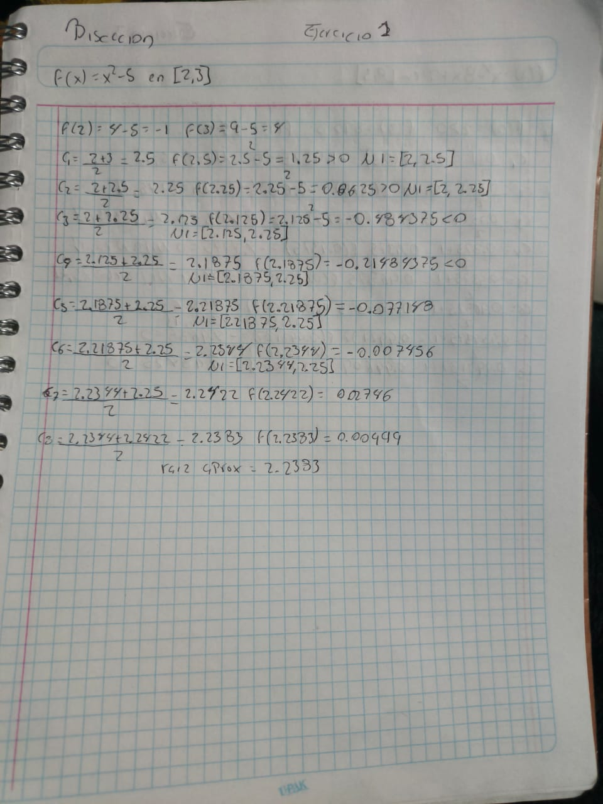{width=600}


### 2

```{r}

f <- function(x) { x^3 -4*x +1  }  

a1 <- 0
b1 <- 1

# ==== Iteración 1 ====
c1 <- (a1 + b1)/2
fa1 <- f(a1); fb1 <- f(b1); fc1 <- f(c1)
s1 <- sign(fa1 * fc1)
e1 <- abs(b1 - a1)
a2 <- if (fa1 * fc1 < 0) a1 else c1
b2 <- if (fa1 * fc1 < 0) c1 else b1

# ==== Iteración 2 ====
c2 <- (a2 + b2)/2
fa2 <- f(a2); fb2 <- f(b2); fc2 <- f(c2)
s2 <- sign(fa2 * fc2)
e2 <- abs(b2 - a2)
a3 <- if (fa2 * fc2 < 0) a2 else c2
b3 <- if (fa2 * fc2 < 0) c2 else b2

# ==== Iteración 3 ====
c3 <- (a3 + b3)/2
fa3 <- f(a3); fb3 <- f(b3); fc3 <- f(c3)
s3 <- sign(fa3 * fc3)
e3 <- abs(b3 - a3)
a4 <- if (fa3 * fc3 < 0) a3 else c3
b4 <- if (fa3 * fc3 < 0) c3 else b3

# ==== Iteración 4 ====
c4 <- (a4 + b4)/2
fa4 <- f(a4); fb4 <- f(b4); fc4 <- f(c4)
s4 <- sign(fa4 * fc4)
e4 <- abs(b4 - a4)
a5 <- if (fa4 * fc4 < 0) a4 else c4
b5 <- if (fa4 * fc4 < 0) c4 else b4

# ==== Iteración 5 ====
c5 <- (a5 + b5)/2
fa5 <- f(a5); fb5 <- f(b5); fc5 <- f(c5)
s5 <- sign(fa5 * fc5)
e5 <- abs(b5 - a5)
a6 <- if (fa5 * fc5 < 0) a5 else c5
b6 <- if (fa5 * fc5 < 0) c5 else b5

# ==== Iteración 6 ====
c6 <- (a6 + b6)/2
fa6 <- f(a6); fb6 <- f(b6); fc6 <- f(c6)
s6 <- sign(fa6 * fc6)
e6 <- abs(b6 - a6)
a7 <- if (fa6 * fc6 < 0) a6 else c6
b7 <- if (fa6 * fc6 < 0) c6 else b6

# ==== Iteración 7 ====
c7 <- (a7 + b7)/2
fa7 <- f(a7); fb7 <- f(b7); fc7 <- f(c7)
s7 <- sign(fa7 * fc7)
e7 <- abs(b7 - a7)
a8 <- if (fa7 * fc7 < 0) a7 else c7
b8 <- if (fa7 * fc7 < 0) c7 else b7

# ==== Iteración 8 ====
c8 <- (a8 + b8)/2
fa8 <- f(a8); fb8 <- f(b8); fc8 <- f(c8)
s8 <- sign(fa8 * fc8)
e8 <- abs(b8 - a8)

raiz_aprox <- c8
f_raiz <- f(c8)

cat("Raíz aproximada tras 8 iteraciones:", raiz_aprox, "\n")
cat("f(raiz) =", f_raiz, "\n")

# Tabla resumen (8 iteraciones)

iter <- 1:8
Acol <- c(a1,a2,a3,a4,a5,a6,a7,a8)
Bcol <- c(b1,b2,b3,b4,b5,b6,b7,b8)
Ccol <- c(c1,c2,c3,c4,c5,c6,c7,c8)
FA <- c(fa1,fa2,fa3,fa4,fa5,fa6,fa7,fa8)
FB <- c(fb1,fb2,fb3,fb4,fb5,fb6,fb7,fb8)
FC <- c(fc1,fc2,fc3,fc4,fc5,fc6,fc7,fc8)
SIGN <- c(s1,s2,s3,s4,s5,s6,s7,s8)
ERR <- c(e1,e2,e3,e4,e5,e6,e7,e8)

TAB <- data.frame(
  iter, ak=Acol, bk=Bcol, ck=Ccol,
  f.ak=FA, f.bk=FB, f.ck=FC,
  sign_fa_fc=SIGN,
  error=ERR
)

print(round(TAB,6))

# Gráfica con reducción de intervalos

library(ggplot2)

x_plot <- seq(min(a1,b1)-1, max(a1,b1)+1, length.out=400)

df_intervals <- data.frame(
  iter = 1:8,
  a = Acol,
  b = Bcol
)

ggplot() +
  geom_line(aes(x = x_plot, y = f(x_plot))) +
  geom_segment(data=df_intervals,
               aes(x=a, xend=b, y=0, yend=0, color=factor(iter)),
               linewidth=1.5) +
  labs(title="Método de Bisección: Reducción de Intervalos",
       x="x", y="f(x)", color="Iteración") +
  theme_minimal()
```

### 3

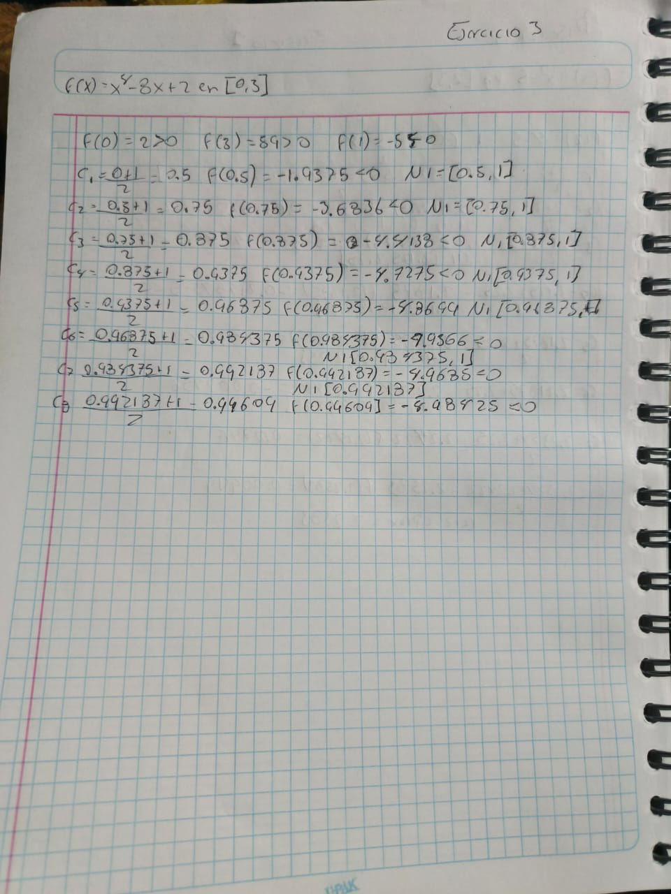{width=600}


### 4

```{r}

f <- function(x) { (exp(1)^-x) -(x/2)  }  

a1 <- 0
b1 <- 2

# ==== Iteración 1 ====
c1 <- (a1 + b1)/2
fa1 <- f(a1); fb1 <- f(b1); fc1 <- f(c1)
s1 <- sign(fa1 * fc1)
e1 <- abs(b1 - a1)
a2 <- if (fa1 * fc1 < 0) a1 else c1
b2 <- if (fa1 * fc1 < 0) c1 else b1

# ==== Iteración 2 ====
c2 <- (a2 + b2)/2
fa2 <- f(a2); fb2 <- f(b2); fc2 <- f(c2)
s2 <- sign(fa2 * fc2)
e2 <- abs(b2 - a2)
a3 <- if (fa2 * fc2 < 0) a2 else c2
b3 <- if (fa2 * fc2 < 0) c2 else b2

# ==== Iteración 3 ====
c3 <- (a3 + b3)/2
fa3 <- f(a3); fb3 <- f(b3); fc3 <- f(c3)
s3 <- sign(fa3 * fc3)
e3 <- abs(b3 - a3)
a4 <- if (fa3 * fc3 < 0) a3 else c3
b4 <- if (fa3 * fc3 < 0) c3 else b3

# ==== Iteración 4 ====
c4 <- (a4 + b4)/2
fa4 <- f(a4); fb4 <- f(b4); fc4 <- f(c4)
s4 <- sign(fa4 * fc4)
e4 <- abs(b4 - a4)
a5 <- if (fa4 * fc4 < 0) a4 else c4
b5 <- if (fa4 * fc4 < 0) c4 else b4

# ==== Iteración 5 ====
c5 <- (a5 + b5)/2
fa5 <- f(a5); fb5 <- f(b5); fc5 <- f(c5)
s5 <- sign(fa5 * fc5)
e5 <- abs(b5 - a5)
a6 <- if (fa5 * fc5 < 0) a5 else c5
b6 <- if (fa5 * fc5 < 0) c5 else b5

# ==== Iteración 6 ====
c6 <- (a6 + b6)/2
fa6 <- f(a6); fb6 <- f(b6); fc6 <- f(c6)
s6 <- sign(fa6 * fc6)
e6 <- abs(b6 - a6)
a7 <- if (fa6 * fc6 < 0) a6 else c6
b7 <- if (fa6 * fc6 < 0) c6 else b6

# ==== Iteración 7 ====
c7 <- (a7 + b7)/2
fa7 <- f(a7); fb7 <- f(b7); fc7 <- f(c7)
s7 <- sign(fa7 * fc7)
e7 <- abs(b7 - a7)
a8 <- if (fa7 * fc7 < 0) a7 else c7
b8 <- if (fa7 * fc7 < 0) c7 else b7

# ==== Iteración 8 ====
c8 <- (a8 + b8)/2
fa8 <- f(a8); fb8 <- f(b8); fc8 <- f(c8)
s8 <- sign(fa8 * fc8)
e8 <- abs(b8 - a8)

raiz_aprox <- c8
f_raiz <- f(c8)

cat("Raíz aproximada tras 8 iteraciones:", raiz_aprox, "\n")
cat("f(raiz) =", f_raiz, "\n")

# Tabla resumen (8 iteraciones)

iter <- 1:8
Acol <- c(a1,a2,a3,a4,a5,a6,a7,a8)
Bcol <- c(b1,b2,b3,b4,b5,b6,b7,b8)
Ccol <- c(c1,c2,c3,c4,c5,c6,c7,c8)
FA <- c(fa1,fa2,fa3,fa4,fa5,fa6,fa7,fa8)
FB <- c(fb1,fb2,fb3,fb4,fb5,fb6,fb7,fb8)
FC <- c(fc1,fc2,fc3,fc4,fc5,fc6,fc7,fc8)
SIGN <- c(s1,s2,s3,s4,s5,s6,s7,s8)
ERR <- c(e1,e2,e3,e4,e5,e6,e7,e8)

TAB <- data.frame(
  iter, ak=Acol, bk=Bcol, ck=Ccol,
  f.ak=FA, f.bk=FB, f.ck=FC,
  sign_fa_fc=SIGN,
  error=ERR
)

print(round(TAB,6))

# Gráfica con reducción de intervalos

library(ggplot2)

x_plot <- seq(min(a1,b1)-1, max(a1,b1)+1, length.out=400)

df_intervals <- data.frame(
  iter = 1:8,
  a = Acol,
  b = Bcol
)

ggplot() +
  geom_line(aes(x = x_plot, y = f(x_plot))) +
  geom_segment(data=df_intervals,
               aes(x=a, xend=b, y=0, yend=0, color=factor(iter)),
               linewidth=1.5) +
  labs(title="Método de Bisección: Reducción de Intervalos",
       x="x", y="f(x)", color="Iteración") +
  theme_minimal()
```

### 5

```{r}

f <- function(x) { cos(x) -x^2 }  

a1 <- 0
b1 <- 1

# ==== Iteración 1 ====
c1 <- (a1 + b1)/2
fa1 <- f(a1); fb1 <- f(b1); fc1 <- f(c1)
s1 <- sign(fa1 * fc1)
e1 <- abs(b1 - a1)
a2 <- if (fa1 * fc1 < 0) a1 else c1
b2 <- if (fa1 * fc1 < 0) c1 else b1

# ==== Iteración 2 ====
c2 <- (a2 + b2)/2
fa2 <- f(a2); fb2 <- f(b2); fc2 <- f(c2)
s2 <- sign(fa2 * fc2)
e2 <- abs(b2 - a2)
a3 <- if (fa2 * fc2 < 0) a2 else c2
b3 <- if (fa2 * fc2 < 0) c2 else b2

# ==== Iteración 3 ====
c3 <- (a3 + b3)/2
fa3 <- f(a3); fb3 <- f(b3); fc3 <- f(c3)
s3 <- sign(fa3 * fc3)
e3 <- abs(b3 - a3)
a4 <- if (fa3 * fc3 < 0) a3 else c3
b4 <- if (fa3 * fc3 < 0) c3 else b3

# ==== Iteración 4 ====
c4 <- (a4 + b4)/2
fa4 <- f(a4); fb4 <- f(b4); fc4 <- f(c4)
s4 <- sign(fa4 * fc4)
e4 <- abs(b4 - a4)
a5 <- if (fa4 * fc4 < 0) a4 else c4
b5 <- if (fa4 * fc4 < 0) c4 else b4

# ==== Iteración 5 ====
c5 <- (a5 + b5)/2
fa5 <- f(a5); fb5 <- f(b5); fc5 <- f(c5)
s5 <- sign(fa5 * fc5)
e5 <- abs(b5 - a5)
a6 <- if (fa5 * fc5 < 0) a5 else c5
b6 <- if (fa5 * fc5 < 0) c5 else b5

# ==== Iteración 6 ====
c6 <- (a6 + b6)/2
fa6 <- f(a6); fb6 <- f(b6); fc6 <- f(c6)
s6 <- sign(fa6 * fc6)
e6 <- abs(b6 - a6)
a7 <- if (fa6 * fc6 < 0) a6 else c6
b7 <- if (fa6 * fc6 < 0) c6 else b6

# ==== Iteración 7 ====
c7 <- (a7 + b7)/2
fa7 <- f(a7); fb7 <- f(b7); fc7 <- f(c7)
s7 <- sign(fa7 * fc7)
e7 <- abs(b7 - a7)
a8 <- if (fa7 * fc7 < 0) a7 else c7
b8 <- if (fa7 * fc7 < 0) c7 else b7

# ==== Iteración 8 ====
c8 <- (a8 + b8)/2
fa8 <- f(a8); fb8 <- f(b8); fc8 <- f(c8)
s8 <- sign(fa8 * fc8)
e8 <- abs(b8 - a8)

raiz_aprox <- c8
f_raiz <- f(c8)

cat("Raíz aproximada tras 8 iteraciones:", raiz_aprox, "\n")
cat("f(raiz) =", f_raiz, "\n")

# Tabla resumen (8 iteraciones)

iter <- 1:8
Acol <- c(a1,a2,a3,a4,a5,a6,a7,a8)
Bcol <- c(b1,b2,b3,b4,b5,b6,b7,b8)
Ccol <- c(c1,c2,c3,c4,c5,c6,c7,c8)
FA <- c(fa1,fa2,fa3,fa4,fa5,fa6,fa7,fa8)
FB <- c(fb1,fb2,fb3,fb4,fb5,fb6,fb7,fb8)
FC <- c(fc1,fc2,fc3,fc4,fc5,fc6,fc7,fc8)
SIGN <- c(s1,s2,s3,s4,s5,s6,s7,s8)
ERR <- c(e1,e2,e3,e4,e5,e6,e7,e8)

TAB <- data.frame(
  iter, ak=Acol, bk=Bcol, ck=Ccol,
  f.ak=FA, f.bk=FB, f.ck=FC,
  sign_fa_fc=SIGN,
  error=ERR
)

print(round(TAB,6))

# Gráfica con reducción de intervalos

library(ggplot2)

x_plot <- seq(min(a1,b1)-1, max(a1,b1)+1, length.out=400)

df_intervals <- data.frame(
  iter = 1:8,
  a = Acol,
  b = Bcol
)

ggplot() +
  geom_line(aes(x = x_plot, y = f(x_plot))) +
  geom_segment(data=df_intervals,
               aes(x=a, xend=b, y=0, yend=0, color=factor(iter)),
               linewidth=1.5) +
  labs(title="Método de Bisección: Reducción de Intervalos",
       x="x", y="f(x)", color="Iteración") +
  theme_minimal()
```

### 6

```{r}

f <- function(x) { (3*x^2) - 7*x -2  }  

a1 <- -1
b1 <- 0

# ==== Iteración 1 ====
c1 <- (a1 + b1)/2
fa1 <- f(a1); fb1 <- f(b1); fc1 <- f(c1)
s1 <- sign(fa1 * fc1)
e1 <- abs(b1 - a1)
a2 <- if (fa1 * fc1 < 0) a1 else c1
b2 <- if (fa1 * fc1 < 0) c1 else b1

# ==== Iteración 2 ====
c2 <- (a2 + b2)/2
fa2 <- f(a2); fb2 <- f(b2); fc2 <- f(c2)
s2 <- sign(fa2 * fc2)
e2 <- abs(b2 - a2)
a3 <- if (fa2 * fc2 < 0) a2 else c2
b3 <- if (fa2 * fc2 < 0) c2 else b2

# ==== Iteración 3 ====
c3 <- (a3 + b3)/2
fa3 <- f(a3); fb3 <- f(b3); fc3 <- f(c3)
s3 <- sign(fa3 * fc3)
e3 <- abs(b3 - a3)
a4 <- if (fa3 * fc3 < 0) a3 else c3
b4 <- if (fa3 * fc3 < 0) c3 else b3

# ==== Iteración 4 ====
c4 <- (a4 + b4)/2
fa4 <- f(a4); fb4 <- f(b4); fc4 <- f(c4)
s4 <- sign(fa4 * fc4)
e4 <- abs(b4 - a4)
a5 <- if (fa4 * fc4 < 0) a4 else c4
b5 <- if (fa4 * fc4 < 0) c4 else b4

# ==== Iteración 5 ====
c5 <- (a5 + b5)/2
fa5 <- f(a5); fb5 <- f(b5); fc5 <- f(c5)
s5 <- sign(fa5 * fc5)
e5 <- abs(b5 - a5)
a6 <- if (fa5 * fc5 < 0) a5 else c5
b6 <- if (fa5 * fc5 < 0) c5 else b5

# ==== Iteración 6 ====
c6 <- (a6 + b6)/2
fa6 <- f(a6); fb6 <- f(b6); fc6 <- f(c6)
s6 <- sign(fa6 * fc6)
e6 <- abs(b6 - a6)
a7 <- if (fa6 * fc6 < 0) a6 else c6
b7 <- if (fa6 * fc6 < 0) c6 else b6

# ==== Iteración 7 ====
c7 <- (a7 + b7)/2
fa7 <- f(a7); fb7 <- f(b7); fc7 <- f(c7)
s7 <- sign(fa7 * fc7)
e7 <- abs(b7 - a7)
a8 <- if (fa7 * fc7 < 0) a7 else c7
b8 <- if (fa7 * fc7 < 0) c7 else b7

# ==== Iteración 8 ====
c8 <- (a8 + b8)/2
fa8 <- f(a8); fb8 <- f(b8); fc8 <- f(c8)
s8 <- sign(fa8 * fc8)
e8 <- abs(b8 - a8)

raiz_aprox <- c8
f_raiz <- f(c8)

cat("Raíz aproximada tras 8 iteraciones:", raiz_aprox, "\n")
cat("f(raiz) =", f_raiz, "\n")

# Tabla resumen (8 iteraciones)

iter <- 1:8
Acol <- c(a1,a2,a3,a4,a5,a6,a7,a8)
Bcol <- c(b1,b2,b3,b4,b5,b6,b7,b8)
Ccol <- c(c1,c2,c3,c4,c5,c6,c7,c8)
FA <- c(fa1,fa2,fa3,fa4,fa5,fa6,fa7,fa8)
FB <- c(fb1,fb2,fb3,fb4,fb5,fb6,fb7,fb8)
FC <- c(fc1,fc2,fc3,fc4,fc5,fc6,fc7,fc8)
SIGN <- c(s1,s2,s3,s4,s5,s6,s7,s8)
ERR <- c(e1,e2,e3,e4,e5,e6,e7,e8)

TAB <- data.frame(
  iter, ak=Acol, bk=Bcol, ck=Ccol,
  f.ak=FA, f.bk=FB, f.ck=FC,
  sign_fa_fc=SIGN,
  error=ERR
)

print(round(TAB,6))


# Gráfica con reducción de intervalos

library(ggplot2)

x_plot <- seq(min(a1,b1)-1, max(a1,b1)+1, length.out=400)

df_intervals <- data.frame(
  iter = 1:8,
  a = Acol,
  b = Bcol
)

ggplot() +
  geom_line(aes(x = x_plot, y = f(x_plot))) +
  geom_segment(data=df_intervals,
               aes(x=a, xend=b, y=0, yend=0, color=factor(iter)),
               linewidth=1.5) +
  labs(title="Método de Bisección: Reducción de Intervalos",
       x="x", y="f(x)", color="Iteración") +
  theme_minimal()
```

### 7

```{r}

f <- function(x) { (-4*x^2) +5*x +6  }  

a1 <- -1
b1 <- 0

# ==== Iteración 1 ====
c1 <- (a1 + b1)/2
fa1 <- f(a1); fb1 <- f(b1); fc1 <- f(c1)
s1 <- sign(fa1 * fc1)
e1 <- abs(b1 - a1)
a2 <- if (fa1 * fc1 < 0) a1 else c1
b2 <- if (fa1 * fc1 < 0) c1 else b1

# ==== Iteración 2 ====
c2 <- (a2 + b2)/2
fa2 <- f(a2); fb2 <- f(b2); fc2 <- f(c2)
s2 <- sign(fa2 * fc2)
e2 <- abs(b2 - a2)
a3 <- if (fa2 * fc2 < 0) a2 else c2
b3 <- if (fa2 * fc2 < 0) c2 else b2

# ==== Iteración 3 ====
c3 <- (a3 + b3)/2
fa3 <- f(a3); fb3 <- f(b3); fc3 <- f(c3)
s3 <- sign(fa3 * fc3)
e3 <- abs(b3 - a3)
a4 <- if (fa3 * fc3 < 0) a3 else c3
b4 <- if (fa3 * fc3 < 0) c3 else b3

# ==== Iteración 4 ====
c4 <- (a4 + b4)/2
fa4 <- f(a4); fb4 <- f(b4); fc4 <- f(c4)
s4 <- sign(fa4 * fc4)
e4 <- abs(b4 - a4)
a5 <- if (fa4 * fc4 < 0) a4 else c4
b5 <- if (fa4 * fc4 < 0) c4 else b4

# ==== Iteración 5 ====
c5 <- (a5 + b5)/2
fa5 <- f(a5); fb5 <- f(b5); fc5 <- f(c5)
s5 <- sign(fa5 * fc5)
e5 <- abs(b5 - a5)
a6 <- if (fa5 * fc5 < 0) a5 else c5
b6 <- if (fa5 * fc5 < 0) c5 else b5

# ==== Iteración 6 ====
c6 <- (a6 + b6)/2
fa6 <- f(a6); fb6 <- f(b6); fc6 <- f(c6)
s6 <- sign(fa6 * fc6)
e6 <- abs(b6 - a6)
a7 <- if (fa6 * fc6 < 0) a6 else c6
b7 <- if (fa6 * fc6 < 0) c6 else b6

# ==== Iteración 7 ====
c7 <- (a7 + b7)/2
fa7 <- f(a7); fb7 <- f(b7); fc7 <- f(c7)
s7 <- sign(fa7 * fc7)
e7 <- abs(b7 - a7)
a8 <- if (fa7 * fc7 < 0) a7 else c7
b8 <- if (fa7 * fc7 < 0) c7 else b7

# ==== Iteración 8 ====
c8 <- (a8 + b8)/2
fa8 <- f(a8); fb8 <- f(b8); fc8 <- f(c8)
s8 <- sign(fa8 * fc8)
e8 <- abs(b8 - a8)

raiz_aprox <- c8
f_raiz <- f(c8)

cat("Raíz aproximada tras 8 iteraciones:", raiz_aprox, "\n")
cat("f(raiz) =", f_raiz, "\n")

# Tabla resumen (8 iteraciones)

iter <- 1:8
Acol <- c(a1,a2,a3,a4,a5,a6,a7,a8)
Bcol <- c(b1,b2,b3,b4,b5,b6,b7,b8)
Ccol <- c(c1,c2,c3,c4,c5,c6,c7,c8)
FA <- c(fa1,fa2,fa3,fa4,fa5,fa6,fa7,fa8)
FB <- c(fb1,fb2,fb3,fb4,fb5,fb6,fb7,fb8)
FC <- c(fc1,fc2,fc3,fc4,fc5,fc6,fc7,fc8)
SIGN <- c(s1,s2,s3,s4,s5,s6,s7,s8)
ERR <- c(e1,e2,e3,e4,e5,e6,e7,e8)

TAB <- data.frame(
  iter, ak=Acol, bk=Bcol, ck=Ccol,
  f.ak=FA, f.bk=FB, f.ck=FC,
  sign_fa_fc=SIGN,
  error=ERR
)

print(round(TAB,6))


# Gráfica con reducción de intervalos

library(ggplot2)

x_plot <- seq(min(a1,b1)-1, max(a1,b1)+1, length.out=400)

df_intervals <- data.frame(
  iter = 1:8,
  a = Acol,
  b = Bcol
)

ggplot() +
  geom_line(aes(x = x_plot, y = f(x_plot))) +
  geom_segment(data=df_intervals,
               aes(x=a, xend=b, y=0, yend=0, color=factor(iter)),
               linewidth=1.5) +
  labs(title="Método de Bisección: Reducción de Intervalos",
       x="x", y="f(x)", color="Iteración") +
  theme_minimal()
```

### 8

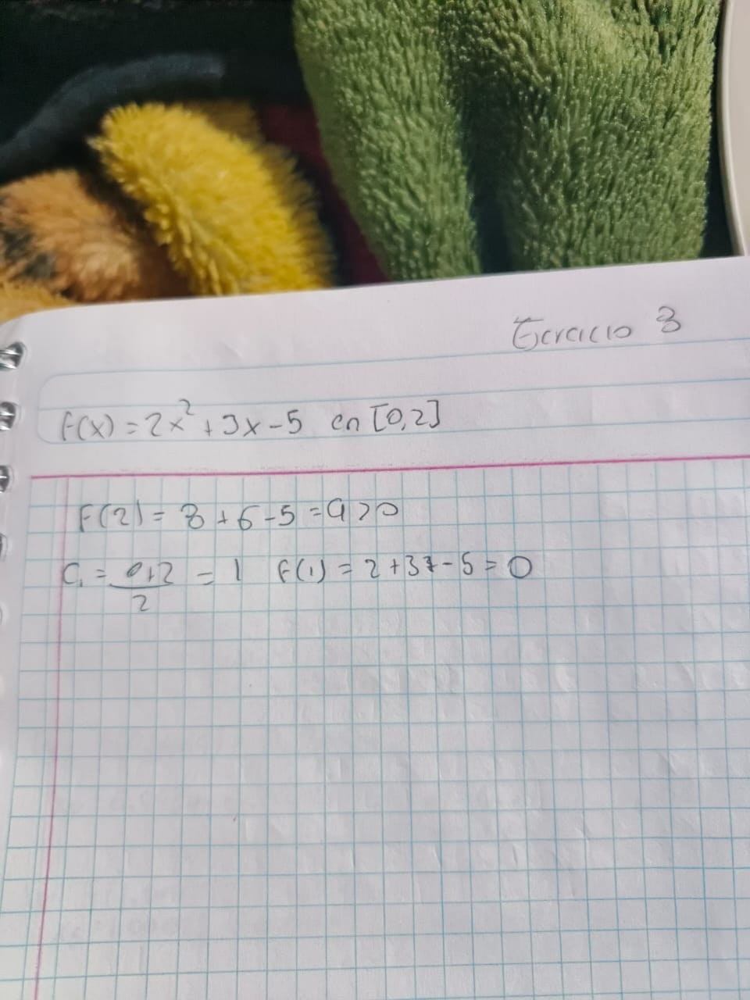{width=600}


### 9

```{r}

f <- function(x) { (x^3) -5*x +1  }  

a1 <- 0
b1 <- 1

# ==== Iteración 1 ====
c1 <- (a1 + b1)/2
fa1 <- f(a1); fb1 <- f(b1); fc1 <- f(c1)
s1 <- sign(fa1 * fc1)
e1 <- abs(b1 - a1)
a2 <- if (fa1 * fc1 < 0) a1 else c1
b2 <- if (fa1 * fc1 < 0) c1 else b1

# ==== Iteración 2 ====
c2 <- (a2 + b2)/2
fa2 <- f(a2); fb2 <- f(b2); fc2 <- f(c2)
s2 <- sign(fa2 * fc2)
e2 <- abs(b2 - a2)
a3 <- if (fa2 * fc2 < 0) a2 else c2
b3 <- if (fa2 * fc2 < 0) c2 else b2

# ==== Iteración 3 ====
c3 <- (a3 + b3)/2
fa3 <- f(a3); fb3 <- f(b3); fc3 <- f(c3)
s3 <- sign(fa3 * fc3)
e3 <- abs(b3 - a3)
a4 <- if (fa3 * fc3 < 0) a3 else c3
b4 <- if (fa3 * fc3 < 0) c3 else b3

# ==== Iteración 4 ====
c4 <- (a4 + b4)/2
fa4 <- f(a4); fb4 <- f(b4); fc4 <- f(c4)
s4 <- sign(fa4 * fc4)
e4 <- abs(b4 - a4)
a5 <- if (fa4 * fc4 < 0) a4 else c4
b5 <- if (fa4 * fc4 < 0) c4 else b4

# ==== Iteración 5 ====
c5 <- (a5 + b5)/2
fa5 <- f(a5); fb5 <- f(b5); fc5 <- f(c5)
s5 <- sign(fa5 * fc5)
e5 <- abs(b5 - a5)
a6 <- if (fa5 * fc5 < 0) a5 else c5
b6 <- if (fa5 * fc5 < 0) c5 else b5

# ==== Iteración 6 ====
c6 <- (a6 + b6)/2
fa6 <- f(a6); fb6 <- f(b6); fc6 <- f(c6)
s6 <- sign(fa6 * fc6)
e6 <- abs(b6 - a6)
a7 <- if (fa6 * fc6 < 0) a6 else c6
b7 <- if (fa6 * fc6 < 0) c6 else b6

# ==== Iteración 7 ====
c7 <- (a7 + b7)/2
fa7 <- f(a7); fb7 <- f(b7); fc7 <- f(c7)
s7 <- sign(fa7 * fc7)
e7 <- abs(b7 - a7)
a8 <- if (fa7 * fc7 < 0) a7 else c7
b8 <- if (fa7 * fc7 < 0) c7 else b7

# ==== Iteración 8 ====
c8 <- (a8 + b8)/2
fa8 <- f(a8); fb8 <- f(b8); fc8 <- f(c8)
s8 <- sign(fa8 * fc8)
e8 <- abs(b8 - a8)

raiz_aprox <- c8
f_raiz <- f(c8)

cat("Raíz aproximada tras 8 iteraciones:", raiz_aprox, "\n")
cat("f(raiz) =", f_raiz, "\n")

# Tabla resumen (8 iteraciones)

iter <- 1:8
Acol <- c(a1,a2,a3,a4,a5,a6,a7,a8)
Bcol <- c(b1,b2,b3,b4,b5,b6,b7,b8)
Ccol <- c(c1,c2,c3,c4,c5,c6,c7,c8)
FA <- c(fa1,fa2,fa3,fa4,fa5,fa6,fa7,fa8)
FB <- c(fb1,fb2,fb3,fb4,fb5,fb6,fb7,fb8)
FC <- c(fc1,fc2,fc3,fc4,fc5,fc6,fc7,fc8)
SIGN <- c(s1,s2,s3,s4,s5,s6,s7,s8)
ERR <- c(e1,e2,e3,e4,e5,e6,e7,e8)

TAB <- data.frame(
  iter, ak=Acol, bk=Bcol, ck=Ccol,
  f.ak=FA, f.bk=FB, f.ck=FC,
  sign_fa_fc=SIGN,
  error=ERR
)

print(round(TAB,6))


# Gráfica con reducción de intervalos

library(ggplot2)

x_plot <- seq(min(a1,b1)-1, max(a1,b1)+1, length.out=400)

df_intervals <- data.frame(
  iter = 1:8,
  a = Acol,
  b = Bcol
)

ggplot() +
  geom_line(aes(x = x_plot, y = f(x_plot))) +
  geom_segment(data=df_intervals,
               aes(x=a, xend=b, y=0, yend=0, color=factor(iter)),
               linewidth=1.5) +
  labs(title="Método de Bisección: Reducción de Intervalos",
       x="x", y="f(x)", color="Iteración") +
  theme_minimal()
```

### 10

```{r}

f <- function(x) { (x^4) - (6*x^3) + (5*x^2) +8*x -4  }  

a1 <- 0
b1 <- 1

# ==== Iteración 1 ====
c1 <- (a1 + b1)/2
fa1 <- f(a1); fb1 <- f(b1); fc1 <- f(c1)
s1 <- sign(fa1 * fc1)
e1 <- abs(b1 - a1)
a2 <- if (fa1 * fc1 < 0) a1 else c1
b2 <- if (fa1 * fc1 < 0) c1 else b1

# ==== Iteración 2 ====
c2 <- (a2 + b2)/2
fa2 <- f(a2); fb2 <- f(b2); fc2 <- f(c2)
s2 <- sign(fa2 * fc2)
e2 <- abs(b2 - a2)
a3 <- if (fa2 * fc2 < 0) a2 else c2
b3 <- if (fa2 * fc2 < 0) c2 else b2

# ==== Iteración 3 ====
c3 <- (a3 + b3)/2
fa3 <- f(a3); fb3 <- f(b3); fc3 <- f(c3)
s3 <- sign(fa3 * fc3)
e3 <- abs(b3 - a3)
a4 <- if (fa3 * fc3 < 0) a3 else c3
b4 <- if (fa3 * fc3 < 0) c3 else b3

# ==== Iteración 4 ====
c4 <- (a4 + b4)/2
fa4 <- f(a4); fb4 <- f(b4); fc4 <- f(c4)
s4 <- sign(fa4 * fc4)
e4 <- abs(b4 - a4)
a5 <- if (fa4 * fc4 < 0) a4 else c4
b5 <- if (fa4 * fc4 < 0) c4 else b4

# ==== Iteración 5 ====
c5 <- (a5 + b5)/2
fa5 <- f(a5); fb5 <- f(b5); fc5 <- f(c5)
s5 <- sign(fa5 * fc5)
e5 <- abs(b5 - a5)
a6 <- if (fa5 * fc5 < 0) a5 else c5
b6 <- if (fa5 * fc5 < 0) c5 else b5

# ==== Iteración 6 ====
c6 <- (a6 + b6)/2
fa6 <- f(a6); fb6 <- f(b6); fc6 <- f(c6)
s6 <- sign(fa6 * fc6)
e6 <- abs(b6 - a6)
a7 <- if (fa6 * fc6 < 0) a6 else c6
b7 <- if (fa6 * fc6 < 0) c6 else b6

# ==== Iteración 7 ====
c7 <- (a7 + b7)/2
fa7 <- f(a7); fb7 <- f(b7); fc7 <- f(c7)
s7 <- sign(fa7 * fc7)
e7 <- abs(b7 - a7)
a8 <- if (fa7 * fc7 < 0) a7 else c7
b8 <- if (fa7 * fc7 < 0) c7 else b7

# ==== Iteración 8 ====
c8 <- (a8 + b8)/2
fa8 <- f(a8); fb8 <- f(b8); fc8 <- f(c8)
s8 <- sign(fa8 * fc8)
e8 <- abs(b8 - a8)

raiz_aprox <- c8
f_raiz <- f(c8)

cat("Raíz aproximada tras 8 iteraciones:", raiz_aprox, "\n")
cat("f(raiz) =", f_raiz, "\n")

# Tabla resumen (8 iteraciones)

iter <- 1:8
Acol <- c(a1,a2,a3,a4,a5,a6,a7,a8)
Bcol <- c(b1,b2,b3,b4,b5,b6,b7,b8)
Ccol <- c(c1,c2,c3,c4,c5,c6,c7,c8)
FA <- c(fa1,fa2,fa3,fa4,fa5,fa6,fa7,fa8)
FB <- c(fb1,fb2,fb3,fb4,fb5,fb6,fb7,fb8)
FC <- c(fc1,fc2,fc3,fc4,fc5,fc6,fc7,fc8)
SIGN <- c(s1,s2,s3,s4,s5,s6,s7,s8)
ERR <- c(e1,e2,e3,e4,e5,e6,e7,e8)

TAB <- data.frame(
  iter, ak=Acol, bk=Bcol, ck=Ccol,
  f.ak=FA, f.bk=FB, f.ck=FC,
  sign_fa_fc=SIGN,
  error=ERR
)

print(round(TAB,6))


# Gráfica con reducción de intervalos

library(ggplot2)

x_plot <- seq(min(a1,b1)-1, max(a1,b1)+1, length.out=400)

df_intervals <- data.frame(
  iter = 1:8,
  a = Acol,
  b = Bcol
)

ggplot() +
  geom_line(aes(x = x_plot, y = f(x_plot))) +
  geom_segment(data=df_intervals,
               aes(x=a, xend=b, y=0, yend=0, color=factor(iter)),
               linewidth=1.5) +
  labs(title="Método de Bisección: Reducción de Intervalos",
       x="x", y="f(x)", color="Iteración") +
  theme_minimal()
```

### 11

```{r}

f <- function(x) { (-2*x^4) +(4*x^3) +(6*x^2) -3*x +2  }  

a1 <- -2
b1 <- -1

# ==== Iteración 1 ====
c1 <- (a1 + b1)/2
fa1 <- f(a1); fb1 <- f(b1); fc1 <- f(c1)
s1 <- sign(fa1 * fc1)
e1 <- abs(b1 - a1)
a2 <- if (fa1 * fc1 < 0) a1 else c1
b2 <- if (fa1 * fc1 < 0) c1 else b1

# ==== Iteración 2 ====
c2 <- (a2 + b2)/2
fa2 <- f(a2); fb2 <- f(b2); fc2 <- f(c2)
s2 <- sign(fa2 * fc2)
e2 <- abs(b2 - a2)
a3 <- if (fa2 * fc2 < 0) a2 else c2
b3 <- if (fa2 * fc2 < 0) c2 else b2

# ==== Iteración 3 ====
c3 <- (a3 + b3)/2
fa3 <- f(a3); fb3 <- f(b3); fc3 <- f(c3)
s3 <- sign(fa3 * fc3)
e3 <- abs(b3 - a3)
a4 <- if (fa3 * fc3 < 0) a3 else c3
b4 <- if (fa3 * fc3 < 0) c3 else b3

# ==== Iteración 4 ====
c4 <- (a4 + b4)/2
fa4 <- f(a4); fb4 <- f(b4); fc4 <- f(c4)
s4 <- sign(fa4 * fc4)
e4 <- abs(b4 - a4)
a5 <- if (fa4 * fc4 < 0) a4 else c4
b5 <- if (fa4 * fc4 < 0) c4 else b4

# ==== Iteración 5 ====
c5 <- (a5 + b5)/2
fa5 <- f(a5); fb5 <- f(b5); fc5 <- f(c5)
s5 <- sign(fa5 * fc5)
e5 <- abs(b5 - a5)
a6 <- if (fa5 * fc5 < 0) a5 else c5
b6 <- if (fa5 * fc5 < 0) c5 else b5

# ==== Iteración 6 ====
c6 <- (a6 + b6)/2
fa6 <- f(a6); fb6 <- f(b6); fc6 <- f(c6)
s6 <- sign(fa6 * fc6)
e6 <- abs(b6 - a6)
a7 <- if (fa6 * fc6 < 0) a6 else c6
b7 <- if (fa6 * fc6 < 0) c6 else b6

# ==== Iteración 7 ====
c7 <- (a7 + b7)/2
fa7 <- f(a7); fb7 <- f(b7); fc7 <- f(c7)
s7 <- sign(fa7 * fc7)
e7 <- abs(b7 - a7)
a8 <- if (fa7 * fc7 < 0) a7 else c7
b8 <- if (fa7 * fc7 < 0) c7 else b7

# ==== Iteración 8 ====
c8 <- (a8 + b8)/2
fa8 <- f(a8); fb8 <- f(b8); fc8 <- f(c8)
s8 <- sign(fa8 * fc8)
e8 <- abs(b8 - a8)

raiz_aprox <- c8
f_raiz <- f(c8)

cat("Raíz aproximada tras 8 iteraciones:", raiz_aprox, "\n")
cat("f(raiz) =", f_raiz, "\n")

# Tabla resumen (8 iteraciones)

iter <- 1:8
Acol <- c(a1,a2,a3,a4,a5,a6,a7,a8)
Bcol <- c(b1,b2,b3,b4,b5,b6,b7,b8)
Ccol <- c(c1,c2,c3,c4,c5,c6,c7,c8)
FA <- c(fa1,fa2,fa3,fa4,fa5,fa6,fa7,fa8)
FB <- c(fb1,fb2,fb3,fb4,fb5,fb6,fb7,fb8)
FC <- c(fc1,fc2,fc3,fc4,fc5,fc6,fc7,fc8)
SIGN <- c(s1,s2,s3,s4,s5,s6,s7,s8)
ERR <- c(e1,e2,e3,e4,e5,e6,e7,e8)

TAB <- data.frame(
  iter, ak=Acol, bk=Bcol, ck=Ccol,
  f.ak=FA, f.bk=FB, f.ck=FC,
  sign_fa_fc=SIGN,
  error=ERR
)

print(round(TAB,6))


# Gráfica con reducción de intervalos

library(ggplot2)

x_plot <- seq(min(a1,b1)-1, max(a1,b1)+1, length.out=400)

df_intervals <- data.frame(
  iter = 1:8,
  a = Acol,
  b = Bcol
)

ggplot() +
  geom_line(aes(x = x_plot, y = f(x_plot))) +
  geom_segment(data=df_intervals,
               aes(x=a, xend=b, y=0, yend=0, color=factor(iter)),
               linewidth=1.5) +
  labs(title="Método de Bisección: Reducción de Intervalos",
       x="x", y="f(x)", color="Iteración") +
  theme_minimal()
```

### 12

```{r}

f <- function(x) { (2*x^4) -(x^3) -(7*x^2) +4*x +3  }  

a1 <- -1
b1 <- 0

# ==== Iteración 1 ====
c1 <- (a1 + b1)/2
fa1 <- f(a1); fb1 <- f(b1); fc1 <- f(c1)
s1 <- sign(fa1 * fc1)
e1 <- abs(b1 - a1)
a2 <- if (fa1 * fc1 < 0) a1 else c1
b2 <- if (fa1 * fc1 < 0) c1 else b1

# ==== Iteración 2 ====
c2 <- (a2 + b2)/2
fa2 <- f(a2); fb2 <- f(b2); fc2 <- f(c2)
s2 <- sign(fa2 * fc2)
e2 <- abs(b2 - a2)
a3 <- if (fa2 * fc2 < 0) a2 else c2
b3 <- if (fa2 * fc2 < 0) c2 else b2

# ==== Iteración 3 ====
c3 <- (a3 + b3)/2
fa3 <- f(a3); fb3 <- f(b3); fc3 <- f(c3)
s3 <- sign(fa3 * fc3)
e3 <- abs(b3 - a3)
a4 <- if (fa3 * fc3 < 0) a3 else c3
b4 <- if (fa3 * fc3 < 0) c3 else b3

# ==== Iteración 4 ====
c4 <- (a4 + b4)/2
fa4 <- f(a4); fb4 <- f(b4); fc4 <- f(c4)
s4 <- sign(fa4 * fc4)
e4 <- abs(b4 - a4)
a5 <- if (fa4 * fc4 < 0) a4 else c4
b5 <- if (fa4 * fc4 < 0) c4 else b4

# ==== Iteración 5 ====
c5 <- (a5 + b5)/2
fa5 <- f(a5); fb5 <- f(b5); fc5 <- f(c5)
s5 <- sign(fa5 * fc5)
e5 <- abs(b5 - a5)
a6 <- if (fa5 * fc5 < 0) a5 else c5
b6 <- if (fa5 * fc5 < 0) c5 else b5

# ==== Iteración 6 ====
c6 <- (a6 + b6)/2
fa6 <- f(a6); fb6 <- f(b6); fc6 <- f(c6)
s6 <- sign(fa6 * fc6)
e6 <- abs(b6 - a6)
a7 <- if (fa6 * fc6 < 0) a6 else c6
b7 <- if (fa6 * fc6 < 0) c6 else b6

# ==== Iteración 7 ====
c7 <- (a7 + b7)/2
fa7 <- f(a7); fb7 <- f(b7); fc7 <- f(c7)
s7 <- sign(fa7 * fc7)
e7 <- abs(b7 - a7)
a8 <- if (fa7 * fc7 < 0) a7 else c7
b8 <- if (fa7 * fc7 < 0) c7 else b7

# ==== Iteración 8 ====
c8 <- (a8 + b8)/2
fa8 <- f(a8); fb8 <- f(b8); fc8 <- f(c8)
s8 <- sign(fa8 * fc8)
e8 <- abs(b8 - a8)

raiz_aprox <- c8
f_raiz <- f(c8)

cat("Raíz aproximada tras 8 iteraciones:", raiz_aprox, "\n")
cat("f(raiz) =", f_raiz, "\n")

# Tabla resumen (8 iteraciones)

iter <- 1:8
Acol <- c(a1,a2,a3,a4,a5,a6,a7,a8)
Bcol <- c(b1,b2,b3,b4,b5,b6,b7,b8)
Ccol <- c(c1,c2,c3,c4,c5,c6,c7,c8)
FA <- c(fa1,fa2,fa3,fa4,fa5,fa6,fa7,fa8)
FB <- c(fb1,fb2,fb3,fb4,fb5,fb6,fb7,fb8)
FC <- c(fc1,fc2,fc3,fc4,fc5,fc6,fc7,fc8)
SIGN <- c(s1,s2,s3,s4,s5,s6,s7,s8)
ERR <- c(e1,e2,e3,e4,e5,e6,e7,e8)

TAB <- data.frame(
  iter, ak=Acol, bk=Bcol, ck=Ccol,
  f.ak=FA, f.bk=FB, f.ck=FC,
  sign_fa_fc=SIGN,
  error=ERR
)

print(round(TAB,6))


# Gráfica con reducción de intervalos

library(ggplot2)

x_plot <- seq(min(a1,b1)-1, max(a1,b1)+1, length.out=400)

df_intervals <- data.frame(
  iter = 1:8,
  a = Acol,
  b = Bcol
)

ggplot() +
  geom_line(aes(x = x_plot, y = f(x_plot))) +
  geom_segment(data=df_intervals,
               aes(x=a, xend=b, y=0, yend=0, color=factor(iter)),
               linewidth=1.5) +
  labs(title="Método de Bisección: Reducción de Intervalos",
       x="x", y="f(x)", color="Iteración") +
  theme_minimal()
```

### 13

```{r}

f <- function(x) { (x^4) +(2*x^3) -(10*x^2) -x +5  }  

a1 <- 0
b1 <- 1

# ==== Iteración 1 ====
c1 <- (a1 + b1)/2
fa1 <- f(a1); fb1 <- f(b1); fc1 <- f(c1)
s1 <- sign(fa1 * fc1)
e1 <- abs(b1 - a1)
a2 <- if (fa1 * fc1 < 0) a1 else c1
b2 <- if (fa1 * fc1 < 0) c1 else b1

# ==== Iteración 2 ====
c2 <- (a2 + b2)/2
fa2 <- f(a2); fb2 <- f(b2); fc2 <- f(c2)
s2 <- sign(fa2 * fc2)
e2 <- abs(b2 - a2)
a3 <- if (fa2 * fc2 < 0) a2 else c2
b3 <- if (fa2 * fc2 < 0) c2 else b2

# ==== Iteración 3 ====
c3 <- (a3 + b3)/2
fa3 <- f(a3); fb3 <- f(b3); fc3 <- f(c3)
s3 <- sign(fa3 * fc3)
e3 <- abs(b3 - a3)
a4 <- if (fa3 * fc3 < 0) a3 else c3
b4 <- if (fa3 * fc3 < 0) c3 else b3

# ==== Iteración 4 ====
c4 <- (a4 + b4)/2
fa4 <- f(a4); fb4 <- f(b4); fc4 <- f(c4)
s4 <- sign(fa4 * fc4)
e4 <- abs(b4 - a4)
a5 <- if (fa4 * fc4 < 0) a4 else c4
b5 <- if (fa4 * fc4 < 0) c4 else b4

# ==== Iteración 5 ====
c5 <- (a5 + b5)/2
fa5 <- f(a5); fb5 <- f(b5); fc5 <- f(c5)
s5 <- sign(fa5 * fc5)
e5 <- abs(b5 - a5)
a6 <- if (fa5 * fc5 < 0) a5 else c5
b6 <- if (fa5 * fc5 < 0) c5 else b5

# ==== Iteración 6 ====
c6 <- (a6 + b6)/2
fa6 <- f(a6); fb6 <- f(b6); fc6 <- f(c6)
s6 <- sign(fa6 * fc6)
e6 <- abs(b6 - a6)
a7 <- if (fa6 * fc6 < 0) a6 else c6
b7 <- if (fa6 * fc6 < 0) c6 else b6

# ==== Iteración 7 ====
c7 <- (a7 + b7)/2
fa7 <- f(a7); fb7 <- f(b7); fc7 <- f(c7)
s7 <- sign(fa7 * fc7)
e7 <- abs(b7 - a7)
a8 <- if (fa7 * fc7 < 0) a7 else c7
b8 <- if (fa7 * fc7 < 0) c7 else b7

# ==== Iteración 8 ====
c8 <- (a8 + b8)/2
fa8 <- f(a8); fb8 <- f(b8); fc8 <- f(c8)
s8 <- sign(fa8 * fc8)
e8 <- abs(b8 - a8)

raiz_aprox <- c8
f_raiz <- f(c8)

cat("Raíz aproximada tras 8 iteraciones:", raiz_aprox, "\n")
cat("f(raiz) =", f_raiz, "\n")

# Tabla resumen (8 iteraciones)

iter <- 1:8
Acol <- c(a1,a2,a3,a4,a5,a6,a7,a8)
Bcol <- c(b1,b2,b3,b4,b5,b6,b7,b8)
Ccol <- c(c1,c2,c3,c4,c5,c6,c7,c8)
FA <- c(fa1,fa2,fa3,fa4,fa5,fa6,fa7,fa8)
FB <- c(fb1,fb2,fb3,fb4,fb5,fb6,fb7,fb8)
FC <- c(fc1,fc2,fc3,fc4,fc5,fc6,fc7,fc8)
SIGN <- c(s1,s2,s3,s4,s5,s6,s7,s8)
ERR <- c(e1,e2,e3,e4,e5,e6,e7,e8)

TAB <- data.frame(
  iter, ak=Acol, bk=Bcol, ck=Ccol,
  f.ak=FA, f.bk=FB, f.ck=FC,
  sign_fa_fc=SIGN,
  error=ERR
)

print(round(TAB,6))


# Gráfica con reducción de intervalos

library(ggplot2)

x_plot <- seq(min(a1,b1)-1, max(a1,b1)+1, length.out=400)

df_intervals <- data.frame(
  iter = 1:8,
  a = Acol,
  b = Bcol
)

ggplot() +
  geom_line(aes(x = x_plot, y = f(x_plot))) +
  geom_segment(data=df_intervals,
               aes(x=a, xend=b, y=0, yend=0, color=factor(iter)),
               linewidth=1.5) +
  labs(title="Método de Bisección: Reducción de Intervalos",
       x="x", y="f(x)", color="Iteración") +
  theme_minimal()
```

### 14

```{r}

f <- function(x) { (5*exp(1)^(0.6*x)) -3    }  

a1 <- 0
b1 <- 2

# ==== Iteración 1 ====
c1 <- (a1 + b1)/2
fa1 <- f(a1); fb1 <- f(b1); fc1 <- f(c1)
s1 <- sign(fa1 * fc1)
e1 <- abs(b1 - a1)
a2 <- if (fa1 * fc1 < 0) a1 else c1
b2 <- if (fa1 * fc1 < 0) c1 else b1

# ==== Iteración 2 ====
c2 <- (a2 + b2)/2
fa2 <- f(a2); fb2 <- f(b2); fc2 <- f(c2)
s2 <- sign(fa2 * fc2)
e2 <- abs(b2 - a2)
a3 <- if (fa2 * fc2 < 0) a2 else c2
b3 <- if (fa2 * fc2 < 0) c2 else b2

# ==== Iteración 3 ====
c3 <- (a3 + b3)/2
fa3 <- f(a3); fb3 <- f(b3); fc3 <- f(c3)
s3 <- sign(fa3 * fc3)
e3 <- abs(b3 - a3)
a4 <- if (fa3 * fc3 < 0) a3 else c3
b4 <- if (fa3 * fc3 < 0) c3 else b3

# ==== Iteración 4 ====
c4 <- (a4 + b4)/2
fa4 <- f(a4); fb4 <- f(b4); fc4 <- f(c4)
s4 <- sign(fa4 * fc4)
e4 <- abs(b4 - a4)
a5 <- if (fa4 * fc4 < 0) a4 else c4
b5 <- if (fa4 * fc4 < 0) c4 else b4

# ==== Iteración 5 ====
c5 <- (a5 + b5)/2
fa5 <- f(a5); fb5 <- f(b5); fc5 <- f(c5)
s5 <- sign(fa5 * fc5)
e5 <- abs(b5 - a5)
a6 <- if (fa5 * fc5 < 0) a5 else c5
b6 <- if (fa5 * fc5 < 0) c5 else b5

# ==== Iteración 6 ====
c6 <- (a6 + b6)/2
fa6 <- f(a6); fb6 <- f(b6); fc6 <- f(c6)
s6 <- sign(fa6 * fc6)
e6 <- abs(b6 - a6)
a7 <- if (fa6 * fc6 < 0) a6 else c6
b7 <- if (fa6 * fc6 < 0) c6 else b6

#  Iteración 7
c7 <- (a7 + b7)/2
fa7 <- f(a7); fb7 <- f(b7); fc7 <- f(c7)
s7 <- sign(fa7 * fc7)
e7 <- abs(b7 - a7)
a8 <- if (fa7 * fc7 < 0) a7 else c7
b8 <- if (fa7 * fc7 < 0) c7 else b7

#  Iteración 8
c8 <- (a8 + b8)/2
fa8 <- f(a8); fb8 <- f(b8); fc8 <- f(c8)
s8 <- sign(fa8 * fc8)
e8 <- abs(b8 - a8)

raiz_aprox <- c8
f_raiz <- f(c8)

cat("Raíz aproximada tras 8 iteraciones:", raiz_aprox, "\n")
cat("f(raiz) =", f_raiz, "\n")

# Tabla resumen (8 iteraciones)

iter <- 1:8
Acol <- c(a1,a2,a3,a4,a5,a6,a7,a8)
Bcol <- c(b1,b2,b3,b4,b5,b6,b7,b8)
Ccol <- c(c1,c2,c3,c4,c5,c6,c7,c8)
FA <- c(fa1,fa2,fa3,fa4,fa5,fa6,fa7,fa8)
FB <- c(fb1,fb2,fb3,fb4,fb5,fb6,fb7,fb8)
FC <- c(fc1,fc2,fc3,fc4,fc5,fc6,fc7,fc8)
SIGN <- c(s1,s2,s3,s4,s5,s6,s7,s8)
ERR <- c(e1,e2,e3,e4,e5,e6,e7,e8)

TAB <- data.frame(
  iter, ak=Acol, bk=Bcol, ck=Ccol,
  f.ak=FA, f.bk=FB, f.ck=FC,
  sign_fa_fc=SIGN,
  error=ERR
)

print(round(TAB,6))


# Gráfica con reducción de intervalos

library(ggplot2)

x_plot <- seq(min(a1,b1)-1, max(a1,b1)+1, length.out=400)

df_intervals <- data.frame(
  iter = 1:8,
  a = Acol,
  b = Bcol
)

ggplot() +
  geom_line(aes(x = x_plot, y = f(x_plot))) +
  geom_segment(data=df_intervals,
               aes(x=a, xend=b, y=0, yend=0, color=factor(iter)),
               linewidth=1.5) +
  labs(title="Método de Bisección: Reducción de Intervalos",
       x="x", y="f(x)", color="Iteración") +
  theme_minimal()
```

### 15

```{r}

f <- function(x) { 7-4*exp(1)^(-0.9*x+0.2)  }  

a1 <- -2
b1 <- 0

#  Iteración 1
c1 <- (a1 + b1)/2
fa1 <- f(a1); fb1 <- f(b1); fc1 <- f(c1)
s1 <- sign(fa1 * fc1)
e1 <- abs(b1 - a1)
a2 <- if (fa1 * fc1 < 0) a1 else c1
b2 <- if (fa1 * fc1 < 0) c1 else b1

#  Iteración 2
c2 <- (a2 + b2)/2
fa2 <- f(a2); fb2 <- f(b2); fc2 <- f(c2)
s2 <- sign(fa2 * fc2)
e2 <- abs(b2 - a2)
a3 <- if (fa2 * fc2 < 0) a2 else c2
b3 <- if (fa2 * fc2 < 0) c2 else b2

#  Iteración 3
c3 <- (a3 + b3)/2
fa3 <- f(a3); fb3 <- f(b3); fc3 <- f(c3)
s3 <- sign(fa3 * fc3)
e3 <- abs(b3 - a3)
a4 <- if (fa3 * fc3 < 0) a3 else c3
b4 <- if (fa3 * fc3 < 0) c3 else b3

#  Iteración 4
c4 <- (a4 + b4)/2
fa4 <- f(a4); fb4 <- f(b4); fc4 <- f(c4)
s4 <- sign(fa4 * fc4)
e4 <- abs(b4 - a4)
a5 <- if (fa4 * fc4 < 0) a4 else c4
b5 <- if (fa4 * fc4 < 0) c4 else b4

#  Iteración 5
c5 <- (a5 + b5)/2
fa5 <- f(a5); fb5 <- f(b5); fc5 <- f(c5)
s5 <- sign(fa5 * fc5)
e5 <- abs(b5 - a5)
a6 <- if (fa5 * fc5 < 0) a5 else c5
b6 <- if (fa5 * fc5 < 0) c5 else b5

#  Iteración 6
c6 <- (a6 + b6)/2
fa6 <- f(a6); fb6 <- f(b6); fc6 <- f(c6)
s6 <- sign(fa6 * fc6)
e6 <- abs(b6 - a6)
a7 <- if (fa6 * fc6 < 0) a6 else c6
b7 <- if (fa6 * fc6 < 0) c6 else b6

#  Iteración 7
c7 <- (a7 + b7)/2
fa7 <- f(a7); fb7 <- f(b7); fc7 <- f(c7)
s7 <- sign(fa7 * fc7)
e7 <- abs(b7 - a7)
a8 <- if (fa7 * fc7 < 0) a7 else c7
b8 <- if (fa7 * fc7 < 0) c7 else b7

#  Iteración 8
c8 <- (a8 + b8)/2
fa8 <- f(a8); fb8 <- f(b8); fc8 <- f(c8)
s8 <- sign(fa8 * fc8)
e8 <- abs(b8 - a8)

raiz_aprox <- c8
f_raiz <- f(c8)

cat("Raíz aproximada tras 8 iteraciones:", raiz_aprox, "\n")
cat("f(raiz) =", f_raiz, "\n")

# Tabla resumen (8 iteraciones)

iter <- 1:8
Acol <- c(a1,a2,a3,a4,a5,a6,a7,a8)
Bcol <- c(b1,b2,b3,b4,b5,b6,b7,b8)
Ccol <- c(c1,c2,c3,c4,c5,c6,c7,c8)
FA <- c(fa1,fa2,fa3,fa4,fa5,fa6,fa7,fa8)
FB <- c(fb1,fb2,fb3,fb4,fb5,fb6,fb7,fb8)
FC <- c(fc1,fc2,fc3,fc4,fc5,fc6,fc7,fc8)
SIGN <- c(s1,s2,s3,s4,s5,s6,s7,s8)
ERR <- c(e1,e2,e3,e4,e5,e6,e7,e8)

TAB <- data.frame(
  iter, ak=Acol, bk=Bcol, ck=Ccol,
  f.ak=FA, f.bk=FB, f.ck=FC,
  sign_fa_fc=SIGN,
  error=ERR
)

print(round(TAB,6))


# Gráfica con reducción de intervalos

library(ggplot2)

x_plot <- seq(min(a1,b1)-1, max(a1,b1)+1, length.out=400)

df_intervals <- data.frame(
  iter = 1:8,
  a = Acol,
  b = Bcol
)

ggplot() +
  geom_line(aes(x = x_plot, y = f(x_plot))) +
  geom_segment(data=df_intervals,
               aes(x=a, xend=b, y=0, yend=0, color=factor(iter)),
               linewidth=1.5) +
  labs(title="Método de Bisección: Reducción de Intervalos",
       x="x", y="f(x)", color="Iteración") +
  theme_minimal()
```

### 16

```{r}

f <- function(x) { sin(2*x) - (x/2)  }  

a1 <- 1
b1 <- 2

#  Iteración 1
c1 <- (a1 + b1)/2
fa1 <- f(a1); fb1 <- f(b1); fc1 <- f(c1)
s1 <- sign(fa1 * fc1)
e1 <- abs(b1 - a1)
a2 <- if (fa1 * fc1 < 0) a1 else c1
b2 <- if (fa1 * fc1 < 0) c1 else b1

#  Iteración 2
c2 <- (a2 + b2)/2
fa2 <- f(a2); fb2 <- f(b2); fc2 <- f(c2)
s2 <- sign(fa2 * fc2)
e2 <- abs(b2 - a2)
a3 <- if (fa2 * fc2 < 0) a2 else c2
b3 <- if (fa2 * fc2 < 0) c2 else b2

#  Iteración 3
c3 <- (a3 + b3)/2
fa3 <- f(a3); fb3 <- f(b3); fc3 <- f(c3)
s3 <- sign(fa3 * fc3)
e3 <- abs(b3 - a3)
a4 <- if (fa3 * fc3 < 0) a3 else c3
b4 <- if (fa3 * fc3 < 0) c3 else b3

#  Iteración 4 
c4 <- (a4 + b4)/2
fa4 <- f(a4); fb4 <- f(b4); fc4 <- f(c4)
s4 <- sign(fa4 * fc4)
e4 <- abs(b4 - a4)
a5 <- if (fa4 * fc4 < 0) a4 else c4
b5 <- if (fa4 * fc4 < 0) c4 else b4

#  Iteración 5
c5 <- (a5 + b5)/2
fa5 <- f(a5); fb5 <- f(b5); fc5 <- f(c5)
s5 <- sign(fa5 * fc5)
e5 <- abs(b5 - a5)
a6 <- if (fa5 * fc5 < 0) a5 else c5
b6 <- if (fa5 * fc5 < 0) c5 else b5

#  Iteración 6
c6 <- (a6 + b6)/2
fa6 <- f(a6); fb6 <- f(b6); fc6 <- f(c6)
s6 <- sign(fa6 * fc6)
e6 <- abs(b6 - a6)
a7 <- if (fa6 * fc6 < 0) a6 else c6
b7 <- if (fa6 * fc6 < 0) c6 else b6

#  Iteración 7
c7 <- (a7 + b7)/2
fa7 <- f(a7); fb7 <- f(b7); fc7 <- f(c7)
s7 <- sign(fa7 * fc7)
e7 <- abs(b7 - a7)
a8 <- if (fa7 * fc7 < 0) a7 else c7
b8 <- if (fa7 * fc7 < 0) c7 else b7

#  Iteración 8
c8 <- (a8 + b8)/2
fa8 <- f(a8); fb8 <- f(b8); fc8 <- f(c8)
s8 <- sign(fa8 * fc8)
e8 <- abs(b8 - a8)

raiz_aprox <- c8
f_raiz <- f(c8)

cat("Raíz aproximada tras 8 iteraciones:", raiz_aprox, "\n")
cat("f(raiz) =", f_raiz, "\n")

# Tabla resumen (8 iteraciones)

iter <- 1:8
Acol <- c(a1,a2,a3,a4,a5,a6,a7,a8)
Bcol <- c(b1,b2,b3,b4,b5,b6,b7,b8)
Ccol <- c(c1,c2,c3,c4,c5,c6,c7,c8)
FA <- c(fa1,fa2,fa3,fa4,fa5,fa6,fa7,fa8)
FB <- c(fb1,fb2,fb3,fb4,fb5,fb6,fb7,fb8)
FC <- c(fc1,fc2,fc3,fc4,fc5,fc6,fc7,fc8)
SIGN <- c(s1,s2,s3,s4,s5,s6,s7,s8)
ERR <- c(e1,e2,e3,e4,e5,e6,e7,e8)

TAB <- data.frame(
  iter, ak=Acol, bk=Bcol, ck=Ccol,
  f.ak=FA, f.bk=FB, f.ck=FC,
  sign_fa_fc=SIGN,
  error=ERR
)

print(round(TAB,6))


# Gráfica con reducción de intervalos

library(ggplot2)

x_plot <- seq(min(a1,b1)-1, max(a1,b1)+1, length.out=400)

df_intervals <- data.frame(
  iter = 1:8,
  a = Acol,
  b = Bcol
)

ggplot() +
  geom_line(aes(x = x_plot, y = f(x_plot))) +
  geom_segment(data=df_intervals,
               aes(x=a, xend=b, y=0, yend=0, color=factor(iter)),
               linewidth=1.5) +
  labs(title="Método de Bisección: Reducción de Intervalos",
       x="x", y="f(x)", color="Iteración") +
  theme_minimal()
```

### 17

```{r}

f <- function(x) { (2*x+1.4)* cos(3*x+(pi/4))  }  

a1 <- 0.1
b1 <- 0.6

#  Iteración 1
c1 <- (a1 + b1)/2
fa1 <- f(a1); fb1 <- f(b1); fc1 <- f(c1)
s1 <- sign(fa1 * fc1)
e1 <- abs(b1 - a1)
a2 <- if (fa1 * fc1 < 0) a1 else c1
b2 <- if (fa1 * fc1 < 0) c1 else b1

#  Iteración 2 
c2 <- (a2 + b2)/2
fa2 <- f(a2); fb2 <- f(b2); fc2 <- f(c2)
s2 <- sign(fa2 * fc2)
e2 <- abs(b2 - a2)
a3 <- if (fa2 * fc2 < 0) a2 else c2
b3 <- if (fa2 * fc2 < 0) c2 else b2

#  Iteración 3 
c3 <- (a3 + b3)/2
fa3 <- f(a3); fb3 <- f(b3); fc3 <- f(c3)
s3 <- sign(fa3 * fc3)
e3 <- abs(b3 - a3)
a4 <- if (fa3 * fc3 < 0) a3 else c3
b4 <- if (fa3 * fc3 < 0) c3 else b3

#  Iteración 4
c4 <- (a4 + b4)/2
fa4 <- f(a4); fb4 <- f(b4); fc4 <- f(c4)
s4 <- sign(fa4 * fc4)
e4 <- abs(b4 - a4)
a5 <- if (fa4 * fc4 < 0) a4 else c4
b5 <- if (fa4 * fc4 < 0) c4 else b4

#  Iteración 5
c5 <- (a5 + b5)/2
fa5 <- f(a5); fb5 <- f(b5); fc5 <- f(c5)
s5 <- sign(fa5 * fc5)
e5 <- abs(b5 - a5)
a6 <- if (fa5 * fc5 < 0) a5 else c5
b6 <- if (fa5 * fc5 < 0) c5 else b5

#  Iteración 6
c6 <- (a6 + b6)/2
fa6 <- f(a6); fb6 <- f(b6); fc6 <- f(c6)
s6 <- sign(fa6 * fc6)
e6 <- abs(b6 - a6)
a7 <- if (fa6 * fc6 < 0) a6 else c6
b7 <- if (fa6 * fc6 < 0) c6 else b6

#  Iteración 7
c7 <- (a7 + b7)/2
fa7 <- f(a7); fb7 <- f(b7); fc7 <- f(c7)
s7 <- sign(fa7 * fc7)
e7 <- abs(b7 - a7)
a8 <- if (fa7 * fc7 < 0) a7 else c7
b8 <- if (fa7 * fc7 < 0) c7 else b7

#  Iteración 8
c8 <- (a8 + b8)/2
fa8 <- f(a8); fb8 <- f(b8); fc8 <- f(c8)
s8 <- sign(fa8 * fc8)
e8 <- abs(b8 - a8)

raiz_aprox <- c8
f_raiz <- f(c8)

cat("Raíz aproximada tras 8 iteraciones:", raiz_aprox, "\n")
cat("f(raiz) =", f_raiz, "\n")

# Tabla resumen (8 iteraciones)

iter <- 1:8
Acol <- c(a1,a2,a3,a4,a5,a6,a7,a8)
Bcol <- c(b1,b2,b3,b4,b5,b6,b7,b8)
Ccol <- c(c1,c2,c3,c4,c5,c6,c7,c8)
FA <- c(fa1,fa2,fa3,fa4,fa5,fa6,fa7,fa8)
FB <- c(fb1,fb2,fb3,fb4,fb5,fb6,fb7,fb8)
FC <- c(fc1,fc2,fc3,fc4,fc5,fc6,fc7,fc8)
SIGN <- c(s1,s2,s3,s4,s5,s6,s7,s8)
ERR <- c(e1,e2,e3,e4,e5,e6,e7,e8)

TAB <- data.frame(
  iter, ak=Acol, bk=Bcol, ck=Ccol,
  f.ak=FA, f.bk=FB, f.ck=FC,
  sign_fa_fc=SIGN,
  error=ERR
)

print(round(TAB,6))


# Gráfica con reducción de intervalos
library(ggplot2)

x_plot <- seq(min(a1,b1)-1, max(a1,b1)+1, length.out=400)

df_intervals <- data.frame(
  iter = 1:8,
  a = Acol,
  b = Bcol
)

ggplot() +
  geom_line(aes(x = x_plot, y = f(x_plot))) +
  geom_segment(data=df_intervals,
               aes(x=a, xend=b, y=0, yend=0, color=factor(iter)),
               linewidth=1.5) +
  labs(title="Método de Bisección: Reducción de Intervalos",
       x="x", y="f(x)", color="Iteración") +
  theme_minimal()
```

### 18

```{r}

f <- function(x) { (-1.5*x+0.9)* sin(4*x+(pi/6))  }  


a1 <- 0.2
b1 <- 0.9

#  Iteración 1 
c1 <- (a1 + b1)/2
fa1 <- f(a1); fb1 <- f(b1); fc1 <- f(c1)
s1 <- sign(fa1 * fc1)
e1 <- abs(b1 - a1)
a2 <- if (fa1 * fc1 < 0) a1 else c1
b2 <- if (fa1 * fc1 < 0) c1 else b1

#  Iteración 2 
c2 <- (a2 + b2)/2
fa2 <- f(a2); fb2 <- f(b2); fc2 <- f(c2)
s2 <- sign(fa2 * fc2)
e2 <- abs(b2 - a2)
a3 <- if (fa2 * fc2 < 0) a2 else c2
b3 <- if (fa2 * fc2 < 0) c2 else b2

#  Iteración 3 
c3 <- (a3 + b3)/2
fa3 <- f(a3); fb3 <- f(b3); fc3 <- f(c3)
s3 <- sign(fa3 * fc3)
e3 <- abs(b3 - a3)
a4 <- if (fa3 * fc3 < 0) a3 else c3
b4 <- if (fa3 * fc3 < 0) c3 else b3

# Iteración 4 
c4 <- (a4 + b4)/2
fa4 <- f(a4); fb4 <- f(b4); fc4 <- f(c4)
s4 <- sign(fa4 * fc4)
e4 <- abs(b4 - a4)
a5 <- if (fa4 * fc4 < 0) a4 else c4
b5 <- if (fa4 * fc4 < 0) c4 else b4

#  Iteración 5 
c5 <- (a5 + b5)/2
fa5 <- f(a5); fb5 <- f(b5); fc5 <- f(c5)
s5 <- sign(fa5 * fc5)
e5 <- abs(b5 - a5)
a6 <- if (fa5 * fc5 < 0) a5 else c5
b6 <- if (fa5 * fc5 < 0) c5 else b5

#  Iteración 6 
c6 <- (a6 + b6)/2
fa6 <- f(a6); fb6 <- f(b6); fc6 <- f(c6)
s6 <- sign(fa6 * fc6)
e6 <- abs(b6 - a6)
a7 <- if (fa6 * fc6 < 0) a6 else c6
b7 <- if (fa6 * fc6 < 0) c6 else b6

#  Iteración 7
c7 <- (a7 + b7)/2
fa7 <- f(a7); fb7 <- f(b7); fc7 <- f(c7)
s7 <- sign(fa7 * fc7)
e7 <- abs(b7 - a7)
a8 <- if (fa7 * fc7 < 0) a7 else c7
b8 <- if (fa7 * fc7 < 0) c7 else b7

#  Iteración 8 
c8 <- (a8 + b8)/2
fa8 <- f(a8); fb8 <- f(b8); fc8 <- f(c8)
s8 <- sign(fa8 * fc8)
e8 <- abs(b8 - a8)

raiz_aprox <- c8
f_raiz <- f(c8)

cat("Raíz aproximada tras 8 iteraciones:", raiz_aprox, "\n")
cat("f(raiz) =", f_raiz, "\n")


# Tabla resumen (8 iteraciones)

iter <- 1:8
Acol <- c(a1,a2,a3,a4,a5,a6,a7,a8)
Bcol <- c(b1,b2,b3,b4,b5,b6,b7,b8)
Ccol <- c(c1,c2,c3,c4,c5,c6,c7,c8)
FA <- c(fa1,fa2,fa3,fa4,fa5,fa6,fa7,fa8)
FB <- c(fb1,fb2,fb3,fb4,fb5,fb6,fb7,fb8)
FC <- c(fc1,fc2,fc3,fc4,fc5,fc6,fc7,fc8)
SIGN <- c(s1,s2,s3,s4,s5,s6,s7,s8)
ERR <- c(e1,e2,e3,e4,e5,e6,e7,e8)

TAB <- data.frame(
  iter, ak=Acol, bk=Bcol, ck=Ccol,
  f.ak=FA, f.bk=FB, f.ck=FC,
  sign_fa_fc=SIGN,
  error=ERR
)

print(round(TAB,6))


# Gráfica con reducción de intervalos

library(ggplot2)

x_plot <- seq(min(a1,b1)-1, max(a1,b1)+1, length.out=400)

df_intervals <- data.frame(
  iter = 1:8,
  a = Acol,
  b = Bcol
)

ggplot() +
  geom_line(aes(x = x_plot, y = f(x_plot))) +
  geom_segment(data=df_intervals,
               aes(x=a, xend=b, y=0, yend=0, color=factor(iter)),
               linewidth=1.5) +
  labs(title="Método de Bisección: Reducción de Intervalos",
       x="x", y="f(x)", color="Iteración") +
  theme_minimal()
```

## MÉTODO DE LA SECANTE 

### 1

```{r}

f <- function(x) x^2 - 2*x -3

x0 <- 0
x1 <- 3
tol <- 1e-10

tabla <- data.frame(
  k = numeric(),
  x_k_1 = numeric(),
  x_k = numeric(),
  f_xk = numeric(),
  x_k1 = numeric(),
  e_k = numeric()
)

# Guardar puntos para graficar
sec_x0 <- c()
sec_x1 <- c()

cat("Iteración 0: x0 =", x0, "\n")
cat("Iteración 1: x1 =", x1, "\n\n")

# Función para registrar en la tabla
registrar <- function(k, x_prev, x_act) {
  fx_prev <- f(x_prev)
  fx_act  <- f(x_act)
  x_new <- x_act - fx_act * (x_act - x_prev) / (fx_act - fx_prev)
  error <- abs(x_new - x_act)

  tabla[nrow(tabla) + 1, ] <<- c(k, x_prev, x_act, fx_act, x_new, error)

  return(x_new)
}

# =================== Iteración 1 ===================
sec_x0 <- c(sec_x0, x0)
sec_x1 <- c(sec_x1, x1)
x2 <- registrar(1, x0, x1)
cat("Iteración 2: x2 =", x2, "\n")
x0 <- x1; x1 <- x2

# Resultado final
root_aprox <- x2

cat("\nTABLA DE RESULTADOS:\n")
print(tabla)
cat("\nRaíz aproximada =", root_aprox, "\n")


# =============================
# GRÁFICA DE LAS SECANTES
# =============================

curve(f, from = -1, to = 5, col = "blue", lwd = 2,
      main = "Método de la Secante", ylab = "f(x)")

abline(h = 0, col = "black")

# Dibujar cada secante
for(i in 1:length(sec_x0)){
  xA <- sec_x0[i]
  xB <- sec_x1[i]
  
  yA <- f(xA)
  yB <- f(xB)

  # Verificar valores seguros antes de graficar
  if( is.finite(xA) && is.finite(xB) &&
      is.finite(yA) && is.finite(yB) &&
      xA != xB ){

      pendiente <- (yB - yA) / (xB - xA)

      if(is.finite(pendiente)){
        intercepto <- yA - pendiente * xA
        if(is.finite(intercepto)){
          abline(a = intercepto, b = pendiente, col = "red")
        }
      }
  }
}

```

### 2

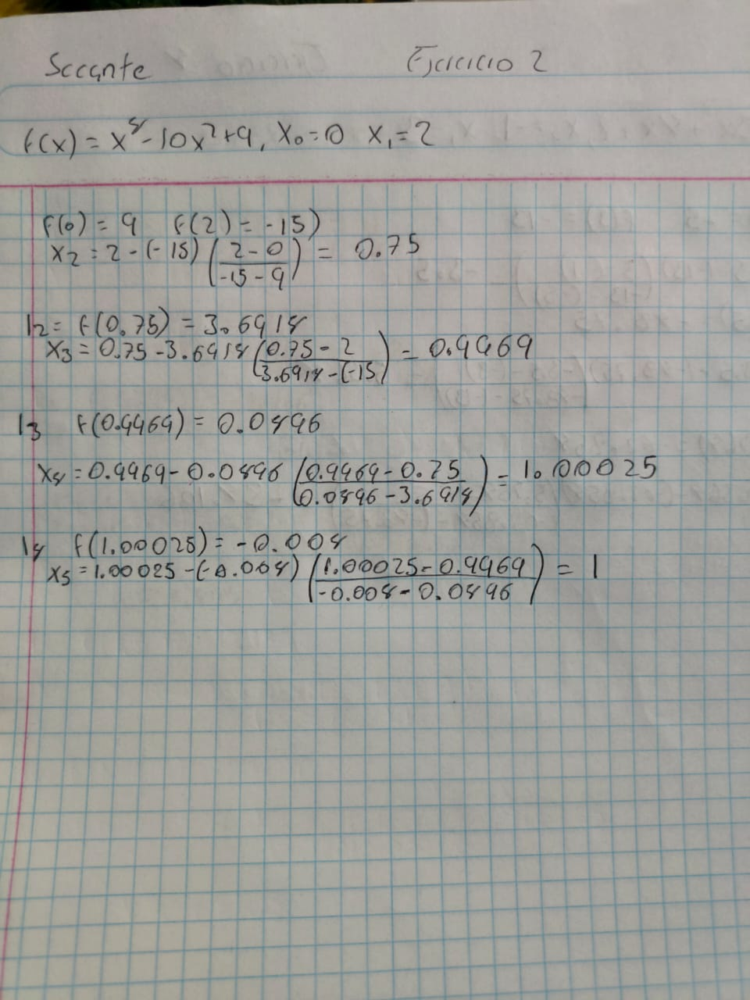{width=600}


### 3

```{r}

f <- function(x) (2*x^2) - (5*x)+3

x0 <- -1
x1 <- 2

tabla <- data.frame(
  k = numeric(),
  x_k_1 = numeric(),
  x_k = numeric(),
  f_xk = numeric(),
  x_k1 = numeric(),
  e_k = numeric()
)

# Guardar puntos para graficar
sec_x0 <- c()
sec_x1 <- c()

cat("Iteración 0: x0 =", x0, "\n")
cat("Iteración 1: x1 =", x1, "\n\n")

# Función para registrar en la tabla
registrar <- function(k, x_prev, x_act) {
  fx_prev <- f(x_prev)
  fx_act  <- f(x_act)
  x_new <- x_act - fx_act * (x_act - x_prev) / (fx_act - fx_prev)
  error <- abs(x_new - x_act)

  tabla[nrow(tabla) + 1, ] <<- c(k, x_prev, x_act, fx_act, x_new, error)

  return(x_new)
}

# =================== Iteración 1 ===================
sec_x0 <- c(sec_x0, x0)
sec_x1 <- c(sec_x1, x1)
x2 <- registrar(1, x0, x1)
cat("Iteración 2: x2 =", x2, "\n")
x0 <- x1; x1 <- x2

# =================== Iteración 2 ===================
sec_x0 <- c(sec_x0, x0)
sec_x1 <- c(sec_x1, x1)
x2 <- registrar(2, x0, x1)
cat("Iteración 3: x2 =", x2, "\n")
x0 <- x1; x1 <- x2

# =================== Iteración 3 ===================
sec_x0 <- c(sec_x0, x0)
sec_x1 <- c(sec_x1, x1)
x2 <- registrar(3, x0, x1)
cat("Iteración 4: x2 =", x2, "\n")
x0 <- x1; x1 <- x2

# =================== Iteración 4 ===================
sec_x0 <- c(sec_x0, x0)
sec_x1 <- c(sec_x1, x1)
x2 <- registrar(4, x0, x1)
cat("Iteración 5: x2 =", x2, "\n")
x0 <- x1; x1 <- x2

# =================== Iteración 5 ===================
sec_x0 <- c(sec_x0, x0)
sec_x1 <- c(sec_x1, x1)
x2 <- registrar(5, x0, x1)
cat("Iteración 6: x2 =", x2, "\n")
x0 <- x1; x1 <- x2

# =================== Iteración 6 ===================
sec_x0 <- c(sec_x0, x0)
sec_x1 <- c(sec_x1, x1)
x2 <- registrar(6, x0, x1)
cat("Iteración 7: x2 =", x2, "\n")
x0 <- x1; x1 <- x2

# =================== Iteración 7 ===================
sec_x0 <- c(sec_x0, x0)
sec_x1 <- c(sec_x1, x1)
x2 <- registrar(7, x0, x1)
cat("Iteración 8: x2 =", x2, "\n")
x0 <- x1; x1 <- x2

# =================== Iteración 8 ===================
sec_x0 <- c(sec_x0, x0)
sec_x1 <- c(sec_x1, x1)
x2 <- registrar(8, x0, x1)
cat("Iteración 9: x2 =", x2, "\n")
x0 <- x1; x1 <- x2

# =================== Iteración 9 ===================
sec_x0 <- c(sec_x0, x0)
sec_x1 <- c(sec_x1, x1)
x2 <- registrar(9, x0, x1)
cat("Iteración 10: x2 =", x2, "\n")
x0 <- x1; x1 <- x2

# Resultado final
root_aprox <- x2

cat("\nTABLA DE RESULTADOS:\n")
print(tabla)
cat("\nRaíz aproximada =", root_aprox, "\n")


# =============================
# GRÁFICA DE LAS SECANTES
# =============================

curve(f, from = -1, to = 5, col = "blue", lwd = 2,
      main = "Método de la Secante", ylab = "f(x)")

abline(h = 0, col = "black")

# Dibujar cada secante
for(i in 1:length(sec_x0)){
  xA <- sec_x0[i]
  xB <- sec_x1[i]
  
  yA <- f(xA)
  yB <- f(xB)

  # Verificar valores seguros antes de graficar
  if( is.finite(xA) && is.finite(xB) &&
      is.finite(yA) && is.finite(yB) &&
      xA != xB ){

      pendiente <- (yB - yA) / (xB - xA)

      if(is.finite(pendiente)){
        intercepto <- yA - pendiente * xA
        if(is.finite(intercepto)){
          abline(a = intercepto, b = pendiente, col = "red")
        }
      }
  }
}

```

### 4

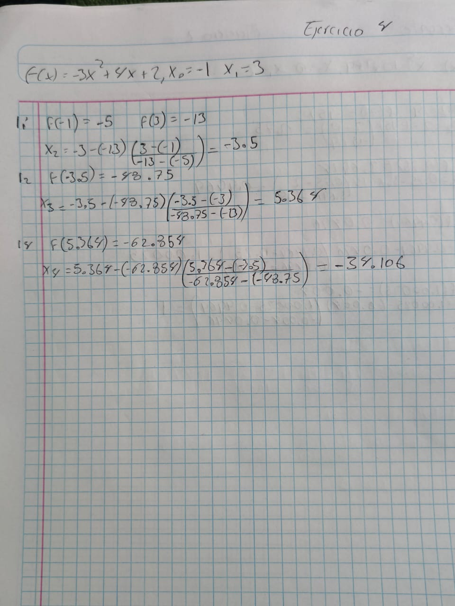{width=600}


### 5

```{r}

f <- function(x) (x^3) + (4*x^2)- x -1

x0 <- -3
x1 <- 1.5

tabla <- data.frame(
  k = numeric(),
  x_k_1 = numeric(),
  x_k = numeric(),
  f_xk = numeric(),
  x_k1 = numeric(),
  e_k = numeric()
)

# Guardar puntos para graficar
sec_x0 <- c()
sec_x1 <- c()

cat("Iteración 0: x0 =", x0, "\n")
cat("Iteración 1: x1 =", x1, "\n\n")

# Función para registrar en la tabla
registrar <- function(k, x_prev, x_act) {
  fx_prev <- f(x_prev)
  fx_act  <- f(x_act)
  x_new <- x_act - fx_act * (x_act - x_prev) / (fx_act - fx_prev)
  error <- abs(x_new - x_act)

  tabla[nrow(tabla) + 1, ] <<- c(k, x_prev, x_act, fx_act, x_new, error)

  return(x_new)
}

# =================== Iteración 1 ===================
sec_x0 <- c(sec_x0, x0)
sec_x1 <- c(sec_x1, x1)
x2 <- registrar(1, x0, x1)
cat("Iteración 2: x2 =", x2, "\n")
x0 <- x1; x1 <- x2

# =================== Iteración 2 ===================
sec_x0 <- c(sec_x0, x0)
sec_x1 <- c(sec_x1, x1)
x2 <- registrar(2, x0, x1)
cat("Iteración 3: x2 =", x2, "\n")
x0 <- x1; x1 <- x2

# =================== Iteración 3 ===================
sec_x0 <- c(sec_x0, x0)
sec_x1 <- c(sec_x1, x1)
x2 <- registrar(3, x0, x1)
cat("Iteración 4: x2 =", x2, "\n")
x0 <- x1; x1 <- x2

# =================== Iteración 4 ===================
sec_x0 <- c(sec_x0, x0)
sec_x1 <- c(sec_x1, x1)
x2 <- registrar(4, x0, x1)
cat("Iteración 5: x2 =", x2, "\n")
x0 <- x1; x1 <- x2

# =================== Iteración 5 ===================
sec_x0 <- c(sec_x0, x0)
sec_x1 <- c(sec_x1, x1)
x2 <- registrar(5, x0, x1)
cat("Iteración 6: x2 =", x2, "\n")
x0 <- x1; x1 <- x2

# =================== Iteración 6 ===================
sec_x0 <- c(sec_x0, x0)
sec_x1 <- c(sec_x1, x1)
x2 <- registrar(6, x0, x1)
cat("Iteración 7: x2 =", x2, "\n")
x0 <- x1; x1 <- x2

# =================== Iteración 7 ===================
sec_x0 <- c(sec_x0, x0)
sec_x1 <- c(sec_x1, x1)
x2 <- registrar(7, x0, x1)
cat("Iteración 8: x2 =", x2, "\n")
x0 <- x1; x1 <- x2

# =================== Iteración 8 ===================
sec_x0 <- c(sec_x0, x0)
sec_x1 <- c(sec_x1, x1)
x2 <- registrar(8, x0, x1)
cat("Iteración 9: x2 =", x2, "\n")
x0 <- x1; x1 <- x2

# =================== Iteración 9 ===================
sec_x0 <- c(sec_x0, x0)
sec_x1 <- c(sec_x1, x1)
x2 <- registrar(9, x0, x1)
cat("Iteración 10: x2 =", x2, "\n")
x0 <- x1; x1 <- x2

# Resultado final
root_aprox <- x2

cat("\nTABLA DE RESULTADOS:\n")
print(tabla)
cat("\nRaíz aproximada =", root_aprox, "\n")


# =============================
# GRÁFICA DE LAS SECANTES
# =============================

curve(f, from = -1, to = 5, col = "blue", lwd = 2,
      main = "Método de la Secante", ylab = "f(x)")

abline(h = 0, col = "black")

# Dibujar cada secante
for(i in 1:length(sec_x0)){
  xA <- sec_x0[i]
  xB <- sec_x1[i]
  
  yA <- f(xA)
  yB <- f(xB)

  # Verificar valores seguros antes de graficar
  if( is.finite(xA) && is.finite(xB) &&
      is.finite(yA) && is.finite(yB) &&
      xA != xB ){

      pendiente <- (yB - yA) / (xB - xA)

      if(is.finite(pendiente)){
        intercepto <- yA - pendiente * xA
        if(is.finite(intercepto)){
          abline(a = intercepto, b = pendiente, col = "red")
        }
      }
  }
}

```

### 6

```{r}

f <- function(x) (x^4) - (5*x^3)+ (6*x^2)+4*x-8

x0 <- 0
x1 <- 3

tabla <- data.frame(
  k = numeric(),
  x_k_1 = numeric(),
  x_k = numeric(),
  f_xk = numeric(),
  x_k1 = numeric(),
  e_k = numeric()
)

# Guardar puntos para graficar
sec_x0 <- c()
sec_x1 <- c()

cat("Iteración 0: x0 =", x0, "\n")
cat("Iteración 1: x1 =", x1, "\n\n")

# Función para registrar en la tabla
registrar <- function(k, x_prev, x_act) {
  fx_prev <- f(x_prev)
  fx_act  <- f(x_act)
  x_new <- x_act - fx_act * (x_act - x_prev) / (fx_act - fx_prev)
  error <- abs(x_new - x_act)

  tabla[nrow(tabla) + 1, ] <<- c(k, x_prev, x_act, fx_act, x_new, error)

  return(x_new)
}

# =================== Iteración 1 ===================
sec_x0 <- c(sec_x0, x0)
sec_x1 <- c(sec_x1, x1)
x2 <- registrar(1, x0, x1)
cat("Iteración 2: x2 =", x2, "\n")
x0 <- x1; x1 <- x2

# =================== Iteración 2 ===================
sec_x0 <- c(sec_x0, x0)
sec_x1 <- c(sec_x1, x1)
x2 <- registrar(2, x0, x1)
cat("Iteración 3: x2 =", x2, "\n")
x0 <- x1; x1 <- x2

# =================== Iteración 3 ===================
sec_x0 <- c(sec_x0, x0)
sec_x1 <- c(sec_x1, x1)
x2 <- registrar(3, x0, x1)
cat("Iteración 4: x2 =", x2, "\n")
x0 <- x1; x1 <- x2

# =================== Iteración 4 ===================
sec_x0 <- c(sec_x0, x0)
sec_x1 <- c(sec_x1, x1)
x2 <- registrar(4, x0, x1)
cat("Iteración 5: x2 =", x2, "\n")
x0 <- x1; x1 <- x2

# =================== Iteración 5 ===================
sec_x0 <- c(sec_x0, x0)
sec_x1 <- c(sec_x1, x1)
x2 <- registrar(5, x0, x1)
cat("Iteración 6: x2 =", x2, "\n")
x0 <- x1; x1 <- x2

# =================== Iteración 6 ===================
sec_x0 <- c(sec_x0, x0)
sec_x1 <- c(sec_x1, x1)
x2 <- registrar(6, x0, x1)
cat("Iteración 7: x2 =", x2, "\n")
x0 <- x1; x1 <- x2

# =================== Iteración 7 ===================
sec_x0 <- c(sec_x0, x0)
sec_x1 <- c(sec_x1, x1)
x2 <- registrar(7, x0, x1)
cat("Iteración 8: x2 =", x2, "\n")
x0 <- x1; x1 <- x2

# =================== Iteración 8 ===================
sec_x0 <- c(sec_x0, x0)
sec_x1 <- c(sec_x1, x1)
x2 <- registrar(8, x0, x1)
cat("Iteración 9: x2 =", x2, "\n")
x0 <- x1; x1 <- x2

# =================== Iteración 9 ===================
sec_x0 <- c(sec_x0, x0)
sec_x1 <- c(sec_x1, x1)
x2 <- registrar(9, x0, x1)
cat("Iteración 10: x2 =", x2, "\n")
x0 <- x1; x1 <- x2

# Resultado final
root_aprox <- x2

cat("\nTABLA DE RESULTADOS:\n")
print(tabla)
cat("\nRaíz aproximada =", root_aprox, "\n")


# =============================
# GRÁFICA DE LAS SECANTES
# =============================

curve(f, from = -1, to = 5, col = "blue", lwd = 2,
      main = "Método de la Secante", ylab = "f(x)")

abline(h = 0, col = "black")

# Dibujar cada secante
for(i in 1:length(sec_x0)){
  xA <- sec_x0[i]
  xB <- sec_x1[i]
  
  yA <- f(xA)
  yB <- f(xB)

  # Verificar valores seguros antes de graficar
  if( is.finite(xA) && is.finite(xB) &&
      is.finite(yA) && is.finite(yB) &&
      xA != xB ){

      pendiente <- (yB - yA) / (xB - xA)

      if(is.finite(pendiente)){
        intercepto <- yA - pendiente * xA
        if(is.finite(intercepto)){
          abline(a = intercepto, b = pendiente, col = "red")
        }
      }
  }
}

```

### 7

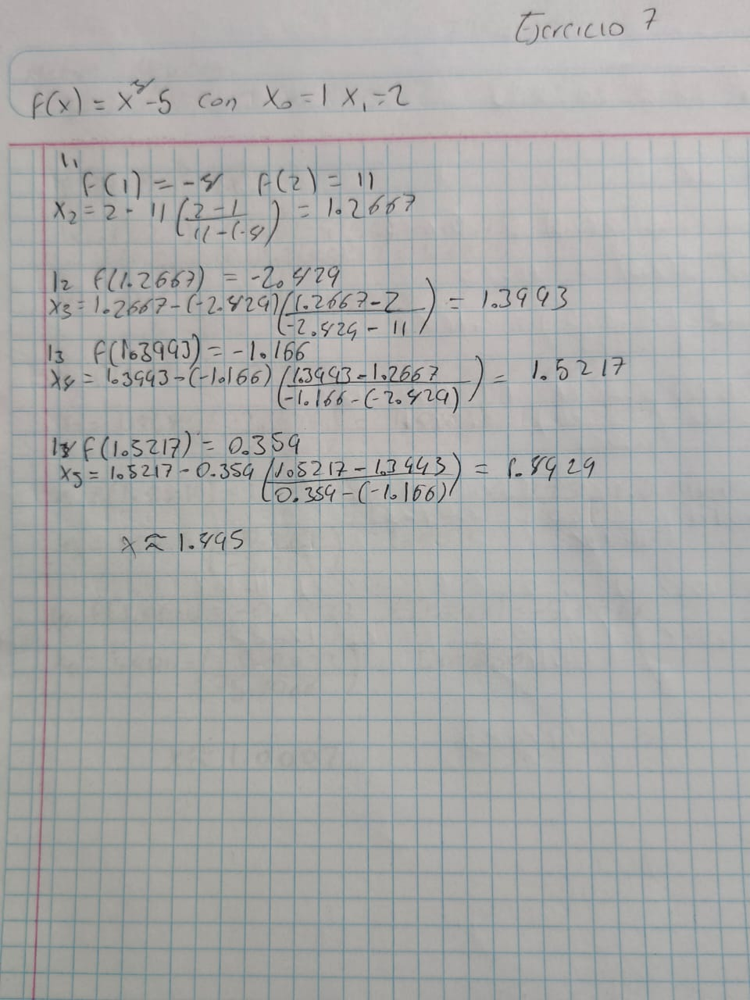{width=600}


### 8

```{r}

f <- function(x) (2*x^4) + (3*x^3)+ (7*x^2)-5*x+1

x0 <- 2
x1 <- 4

tabla <- data.frame(
  k = numeric(),
  x_k_1 = numeric(),
  x_k = numeric(),
  f_xk = numeric(),
  x_k1 = numeric(),
  e_k = numeric()
)

# Guardar puntos para graficar
sec_x0 <- c()
sec_x1 <- c()

cat("Iteración 0: x0 =", x0, "\n")
cat("Iteración 1: x1 =", x1, "\n\n")

# Función para registrar en la tabla
registrar <- function(k, x_prev, x_act) {
  fx_prev <- f(x_prev)
  fx_act  <- f(x_act)
  x_new <- x_act - fx_act * (x_act - x_prev) / (fx_act - fx_prev)
  error <- abs(x_new - x_act)

  tabla[nrow(tabla) + 1, ] <<- c(k, x_prev, x_act, fx_act, x_new, error)

  return(x_new)
}

# =================== Iteración 1 ===================
sec_x0 <- c(sec_x0, x0)
sec_x1 <- c(sec_x1, x1)
x2 <- registrar(1, x0, x1)
cat("Iteración 2: x2 =", x2, "\n")
x0 <- x1; x1 <- x2

# =================== Iteración 2 ===================
sec_x0 <- c(sec_x0, x0)
sec_x1 <- c(sec_x1, x1)
x2 <- registrar(2, x0, x1)
cat("Iteración 3: x2 =", x2, "\n")
x0 <- x1; x1 <- x2

# =================== Iteración 3 ===================
sec_x0 <- c(sec_x0, x0)
sec_x1 <- c(sec_x1, x1)
x2 <- registrar(3, x0, x1)
cat("Iteración 4: x2 =", x2, "\n")
x0 <- x1; x1 <- x2

# =================== Iteración 4 ===================
sec_x0 <- c(sec_x0, x0)
sec_x1 <- c(sec_x1, x1)
x2 <- registrar(4, x0, x1)
cat("Iteración 5: x2 =", x2, "\n")
x0 <- x1; x1 <- x2

# =================== Iteración 5 ===================
sec_x0 <- c(sec_x0, x0)
sec_x1 <- c(sec_x1, x1)
x2 <- registrar(5, x0, x1)
cat("Iteración 6: x2 =", x2, "\n")
x0 <- x1; x1 <- x2

# =================== Iteración 6 ===================
sec_x0 <- c(sec_x0, x0)
sec_x1 <- c(sec_x1, x1)
x2 <- registrar(6, x0, x1)
cat("Iteración 7: x2 =", x2, "\n")
x0 <- x1; x1 <- x2

# =================== Iteración 7 ===================
sec_x0 <- c(sec_x0, x0)
sec_x1 <- c(sec_x1, x1)
x2 <- registrar(7, x0, x1)
cat("Iteración 8: x2 =", x2, "\n")
x0 <- x1; x1 <- x2

# =================== Iteración 8 ===================
sec_x0 <- c(sec_x0, x0)
sec_x1 <- c(sec_x1, x1)
x2 <- registrar(8, x0, x1)
cat("Iteración 9: x2 =", x2, "\n")
x0 <- x1; x1 <- x2

# =================== Iteración 9 ===================
sec_x0 <- c(sec_x0, x0)
sec_x1 <- c(sec_x1, x1)
x2 <- registrar(9, x0, x1)
cat("Iteración 10: x2 =", x2, "\n")
x0 <- x1; x1 <- x2

# Resultado final
root_aprox <- x2

cat("\nTABLA DE RESULTADOS:\n")
print(tabla)
cat("\nRaíz aproximada =", root_aprox, "\n")


# =============================
# GRÁFICA DE LAS SECANTES
# =============================

curve(f, from = -1, to = 5, col = "blue", lwd = 2,
      main = "Método de la Secante", ylab = "f(x)")

abline(h = 0, col = "black")

# Dibujar cada secante
for(i in 1:length(sec_x0)){
  xA <- sec_x0[i]
  xB <- sec_x1[i]
  
  yA <- f(xA)
  yB <- f(xB)

  # Verificar valores seguros antes de graficar
  if( is.finite(xA) && is.finite(xB) &&
      is.finite(yA) && is.finite(yB) &&
      xA != xB ){

      pendiente <- (yB - yA) / (xB - xA)

      if(is.finite(pendiente)){
        intercepto <- yA - pendiente * xA
        if(is.finite(intercepto)){
          abline(a = intercepto, b = pendiente, col = "red")
        }
      }
  }
}

```

### 9

```{r}

f <- function(x) (4*exp(1)^(-0.8*x-0.5))-7

x0 <- 0
x1 <- 1.5

tabla <- data.frame(
  k = numeric(),
  x_k_1 = numeric(),
  x_k = numeric(),
  f_xk = numeric(),
  x_k1 = numeric(),
  e_k = numeric()
)

# Guardar puntos para graficar
sec_x0 <- c()
sec_x1 <- c()

cat("Iteración 0: x0 =", x0, "\n")
cat("Iteración 1: x1 =", x1, "\n\n")

# Función para registrar en la tabla
registrar <- function(k, x_prev, x_act) {
  fx_prev <- f(x_prev)
  fx_act  <- f(x_act)
  x_new <- x_act - fx_act * (x_act - x_prev) / (fx_act - fx_prev)
  error <- abs(x_new - x_act)

  tabla[nrow(tabla) + 1, ] <<- c(k, x_prev, x_act, fx_act, x_new, error)

  return(x_new)
}

# =================== Iteración 1 ===================
sec_x0 <- c(sec_x0, x0)
sec_x1 <- c(sec_x1, x1)
x2 <- registrar(1, x0, x1)
cat("Iteración 2: x2 =", x2, "\n")
x0 <- x1; x1 <- x2

# =================== Iteración 2 ===================
sec_x0 <- c(sec_x0, x0)
sec_x1 <- c(sec_x1, x1)
x2 <- registrar(2, x0, x1)
cat("Iteración 3: x2 =", x2, "\n")
x0 <- x1; x1 <- x2

# =================== Iteración 3 ===================
sec_x0 <- c(sec_x0, x0)
sec_x1 <- c(sec_x1, x1)
x2 <- registrar(3, x0, x1)
cat("Iteración 4: x2 =", x2, "\n")
x0 <- x1; x1 <- x2

# =================== Iteración 4 ===================
sec_x0 <- c(sec_x0, x0)
sec_x1 <- c(sec_x1, x1)
x2 <- registrar(4, x0, x1)
cat("Iteración 5: x2 =", x2, "\n")
x0 <- x1; x1 <- x2

# =================== Iteración 5 ===================
sec_x0 <- c(sec_x0, x0)
sec_x1 <- c(sec_x1, x1)
x2 <- registrar(5, x0, x1)
cat("Iteración 6: x2 =", x2, "\n")
x0 <- x1; x1 <- x2

# =================== Iteración 6 ===================
sec_x0 <- c(sec_x0, x0)
sec_x1 <- c(sec_x1, x1)
x2 <- registrar(6, x0, x1)
cat("Iteración 7: x2 =", x2, "\n")
x0 <- x1; x1 <- x2

# =================== Iteración 7 ===================
sec_x0 <- c(sec_x0, x0)
sec_x1 <- c(sec_x1, x1)
x2 <- registrar(7, x0, x1)
cat("Iteración 8: x2 =", x2, "\n")
x0 <- x1; x1 <- x2

# =================== Iteración 8 ===================
sec_x0 <- c(sec_x0, x0)
sec_x1 <- c(sec_x1, x1)
x2 <- registrar(8, x0, x1)
cat("Iteración 9: x2 =", x2, "\n")
x0 <- x1; x1 <- x2

# =================== Iteración 9 ===================
sec_x0 <- c(sec_x0, x0)
sec_x1 <- c(sec_x1, x1)
x2 <- registrar(9, x0, x1)
cat("Iteración 10: x2 =", x2, "\n")
x0 <- x1; x1 <- x2

# Resultado final
root_aprox <- x2

cat("\nTABLA DE RESULTADOS:\n")
print(tabla)
cat("\nRaíz aproximada =", root_aprox, "\n")


# =============================
# GRÁFICA DE LAS SECANTES
# =============================

curve(f, from = -1, to = 5, col = "blue", lwd = 2,
      main = "Método de la Secante", ylab = "f(x)")

abline(h = 0, col = "black")

# Dibujar cada secante
for(i in 1:length(sec_x0)){
  xA <- sec_x0[i]
  xB <- sec_x1[i]
  
  yA <- f(xA)
  yB <- f(xB)

  # Verificar valores seguros antes de graficar
  if( is.finite(xA) && is.finite(xB) &&
      is.finite(yA) && is.finite(yB) &&
      xA != xB ){

      pendiente <- (yB - yA) / (xB - xA)

      if(is.finite(pendiente)){
        intercepto <- yA - pendiente * xA
        if(is.finite(intercepto)){
          abline(a = intercepto, b = pendiente, col = "red")
        }
      }
  }
}

```

### 10

```{r}

f <- function(x)  (-3*exp(1)^(-1.2*x+0.4))+2

x0 <- 0
x1 <- 1.1

tabla <- data.frame(
  k = numeric(),
  x_k_1 = numeric(),
  x_k = numeric(),
  f_xk = numeric(),
  x_k1 = numeric(),
  e_k = numeric()
)

# Guardar puntos para graficar
sec_x0 <- c()
sec_x1 <- c()

cat("Iteración 0: x0 =", x0, "\n")
cat("Iteración 1: x1 =", x1, "\n\n")

# Función para registrar en la tabla
registrar <- function(k, x_prev, x_act) {
  fx_prev <- f(x_prev)
  fx_act  <- f(x_act)
  x_new <- x_act - fx_act * (x_act - x_prev) / (fx_act - fx_prev)
  error <- abs(x_new - x_act)

  tabla[nrow(tabla) + 1, ] <<- c(k, x_prev, x_act, fx_act, x_new, error)

  return(x_new)
}

# =================== Iteración 1 ===================
sec_x0 <- c(sec_x0, x0)
sec_x1 <- c(sec_x1, x1)
x2 <- registrar(1, x0, x1)
cat("Iteración 2: x2 =", x2, "\n")
x0 <- x1; x1 <- x2

# =================== Iteración 2 ===================
sec_x0 <- c(sec_x0, x0)
sec_x1 <- c(sec_x1, x1)
x2 <- registrar(2, x0, x1)
cat("Iteración 3: x2 =", x2, "\n")
x0 <- x1; x1 <- x2

# =================== Iteración 3 ===================
sec_x0 <- c(sec_x0, x0)
sec_x1 <- c(sec_x1, x1)
x2 <- registrar(3, x0, x1)
cat("Iteración 4: x2 =", x2, "\n")
x0 <- x1; x1 <- x2

# =================== Iteración 4 ===================
sec_x0 <- c(sec_x0, x0)
sec_x1 <- c(sec_x1, x1)
x2 <- registrar(4, x0, x1)
cat("Iteración 5: x2 =", x2, "\n")
x0 <- x1; x1 <- x2

# =================== Iteración 5 ===================
sec_x0 <- c(sec_x0, x0)
sec_x1 <- c(sec_x1, x1)
x2 <- registrar(5, x0, x1)
cat("Iteración 6: x2 =", x2, "\n")
x0 <- x1; x1 <- x2

# =================== Iteración 6 ===================
sec_x0 <- c(sec_x0, x0)
sec_x1 <- c(sec_x1, x1)
x2 <- registrar(6, x0, x1)
cat("Iteración 7: x2 =", x2, "\n")
x0 <- x1; x1 <- x2

# =================== Iteración 7 ===================
sec_x0 <- c(sec_x0, x0)
sec_x1 <- c(sec_x1, x1)
x2 <- registrar(7, x0, x1)
cat("Iteración 8: x2 =", x2, "\n")
x0 <- x1; x1 <- x2

# =================== Iteración 8 ===================
sec_x0 <- c(sec_x0, x0)
sec_x1 <- c(sec_x1, x1)
x2 <- registrar(8, x0, x1)
cat("Iteración 9: x2 =", x2, "\n")
x0 <- x1; x1 <- x2

# Resultado final
root_aprox <- x2

cat("\nTABLA DE RESULTADOS:\n")
print(tabla)
cat("\nRaíz aproximada =", root_aprox, "\n")


# =============================
# GRÁFICA DE LAS SECANTES
# =============================

curve(f, from = -1, to = 5, col = "blue", lwd = 2,
      main = "Método de la Secante", ylab = "f(x)")

abline(h = 0, col = "black")

# Dibujar cada secante
for(i in 1:length(sec_x0)){
  xA <- sec_x0[i]
  xB <- sec_x1[i]
  
  yA <- f(xA)
  yB <- f(xB)

  # Verificar valores seguros antes de graficar
  if( is.finite(xA) && is.finite(xB) &&
      is.finite(yA) && is.finite(yB) &&
      xA != xB ){

      pendiente <- (yB - yA) / (xB - xA)

      if(is.finite(pendiente)){
        intercepto <- yA - pendiente * xA
        if(is.finite(intercepto)){
          abline(a = intercepto, b = pendiente, col = "red")
        }
      }
  }
}

```

### 11

```{r}

f <- function(x)  sin(x) -x/3

x0 <- 0
x1 <- 1

tabla <- data.frame(
  k = numeric(),
  x_k_1 = numeric(),
  x_k = numeric(),
  f_xk = numeric(),
  x_k1 = numeric(),
  e_k = numeric()
)

# Guardar puntos para graficar
sec_x0 <- c()
sec_x1 <- c()

cat("Iteración 0: x0 =", x0, "\n")
cat("Iteración 1: x1 =", x1, "\n\n")

# Función para registrar en la tabla
registrar <- function(k, x_prev, x_act) {
  fx_prev <- f(x_prev)
  fx_act  <- f(x_act)
  x_new <- x_act - fx_act * (x_act - x_prev) / (fx_act - fx_prev)
  error <- abs(x_new - x_act)

  tabla[nrow(tabla) + 1, ] <<- c(k, x_prev, x_act, fx_act, x_new, error)

  return(x_new)
}

# =================== Iteración 1 ===================
sec_x0 <- c(sec_x0, x0)
sec_x1 <- c(sec_x1, x1)
x2 <- registrar(1, x0, x1)
cat("Iteración 2: x2 =", x2, "\n")
x0 <- x1; x1 <- x2

# =================== Iteración 2 ===================
sec_x0 <- c(sec_x0, x0)
sec_x1 <- c(sec_x1, x1)
x2 <- registrar(2, x0, x1)
cat("Iteración 3: x2 =", x2, "\n")
x0 <- x1; x1 <- x2

# =================== Iteración 3 ===================
sec_x0 <- c(sec_x0, x0)
sec_x1 <- c(sec_x1, x1)
x2 <- registrar(3, x0, x1)
cat("Iteración 4: x2 =", x2, "\n")
x0 <- x1; x1 <- x2

# =================== Iteración 4 ===================
sec_x0 <- c(sec_x0, x0)
sec_x1 <- c(sec_x1, x1)
x2 <- registrar(4, x0, x1)
cat("Iteración 5: x2 =", x2, "\n")
x0 <- x1; x1 <- x2

# =================== Iteración 5 ===================
sec_x0 <- c(sec_x0, x0)
sec_x1 <- c(sec_x1, x1)
x2 <- registrar(5, x0, x1)
cat("Iteración 6: x2 =", x2, "\n")
x0 <- x1; x1 <- x2

# =================== Iteración 6 ===================
sec_x0 <- c(sec_x0, x0)
sec_x1 <- c(sec_x1, x1)
x2 <- registrar(6, x0, x1)
cat("Iteración 7: x2 =", x2, "\n")
x0 <- x1; x1 <- x2

# =================== Iteración 7 ===================
sec_x0 <- c(sec_x0, x0)
sec_x1 <- c(sec_x1, x1)
x2 <- registrar(7, x0, x1)
cat("Iteración 8: x2 =", x2, "\n")
x0 <- x1; x1 <- x2

# =================== Iteración 8 ===================
sec_x0 <- c(sec_x0, x0)
sec_x1 <- c(sec_x1, x1)
x2 <- registrar(8, x0, x1)
cat("Iteración 9: x2 =", x2, "\n")
x0 <- x1; x1 <- x2

# =================== Iteración 9 ===================
sec_x0 <- c(sec_x0, x0)
sec_x1 <- c(sec_x1, x1)
x2 <- registrar(9, x0, x1)
cat("Iteración 10: x2 =", x2, "\n")
x0 <- x1; x1 <- x2

# Resultado final
root_aprox <- x2

cat("\nTABLA DE RESULTADOS:\n")
print(tabla)
cat("\nRaíz aproximada =", root_aprox, "\n")


# =============================
# GRÁFICA DE LAS SECANTES
# =============================

curve(f, from = -1, to = 5, col = "blue", lwd = 2,
      main = "Método de la Secante", ylab = "f(x)")

abline(h = 0, col = "black")

# Dibujar cada secante
for(i in 1:length(sec_x0)){
  xA <- sec_x0[i]
  xB <- sec_x1[i]
  
  yA <- f(xA)
  yB <- f(xB)

  # Verificar valores seguros antes de graficar
  if( is.finite(xA) && is.finite(xB) &&
      is.finite(yA) && is.finite(yB) &&
      xA != xB ){

      pendiente <- (yB - yA) / (xB - xA)

      if(is.finite(pendiente)){
        intercepto <- yA - pendiente * xA
        if(is.finite(intercepto)){
          abline(a = intercepto, b = pendiente, col = "red")
        }
      }
  }
}

```

### 12

```{r}

f <- function(x)  (3*x+3.1)* cos(2*x+(pi/6))

x0 <- 0.3
x1 <- 0.8

tabla <- data.frame(
  k = numeric(),
  x_k_1 = numeric(),
  x_k = numeric(),
  f_xk = numeric(),
  x_k1 = numeric(),
  e_k = numeric()
)

# Guardar puntos para graficar
sec_x0 <- c()
sec_x1 <- c()

cat("Iteración 0: x0 =", x0, "\n")
cat("Iteración 1: x1 =", x1, "\n\n")

# Función para registrar en la tabla
registrar <- function(k, x_prev, x_act) {
  fx_prev <- f(x_prev)
  fx_act  <- f(x_act)
  x_new <- x_act - fx_act * (x_act - x_prev) / (fx_act - fx_prev)
  error <- abs(x_new - x_act)

  tabla[nrow(tabla) + 1, ] <<- c(k, x_prev, x_act, fx_act, x_new, error)

  return(x_new)
}

# =================== Iteración 1 ===================
sec_x0 <- c(sec_x0, x0)
sec_x1 <- c(sec_x1, x1)
x2 <- registrar(1, x0, x1)
cat("Iteración 2: x2 =", x2, "\n")
x0 <- x1; x1 <- x2

# =================== Iteración 2 ===================
sec_x0 <- c(sec_x0, x0)
sec_x1 <- c(sec_x1, x1)
x2 <- registrar(2, x0, x1)
cat("Iteración 3: x2 =", x2, "\n")
x0 <- x1; x1 <- x2

# =================== Iteración 3 ===================
sec_x0 <- c(sec_x0, x0)
sec_x1 <- c(sec_x1, x1)
x2 <- registrar(3, x0, x1)
cat("Iteración 4: x2 =", x2, "\n")
x0 <- x1; x1 <- x2

# =================== Iteración 4 ===================
sec_x0 <- c(sec_x0, x0)
sec_x1 <- c(sec_x1, x1)
x2 <- registrar(4, x0, x1)
cat("Iteración 5: x2 =", x2, "\n")
x0 <- x1; x1 <- x2

# =================== Iteración 5 ===================
sec_x0 <- c(sec_x0, x0)
sec_x1 <- c(sec_x1, x1)
x2 <- registrar(5, x0, x1)
cat("Iteración 6: x2 =", x2, "\n")
x0 <- x1; x1 <- x2

# =================== Iteración 6 ===================
sec_x0 <- c(sec_x0, x0)
sec_x1 <- c(sec_x1, x1)
x2 <- registrar(6, x0, x1)
cat("Iteración 7: x2 =", x2, "\n")
x0 <- x1; x1 <- x2


# Resultado final
root_aprox <- x2

cat("\nTABLA DE RESULTADOS:\n")
print(tabla)

cat("\nRaíz aproximada =", root_aprox, "\n")


# =============================
# GRÁFICA DE LAS SECANTES
# =============================

curve(f, from = -1, to = 5, col = "blue", lwd = 2,
      main = "Método de la Secante", ylab = "f(x)")

abline(h = 0, col = "black")

# Dibujar cada secante
for(i in 1:length(sec_x0)){
  xA <- sec_x0[i]
  xB <- sec_x1[i]
  
  yA <- f(xA)
  yB <- f(xB)

  # Verificar valores seguros antes de graficar
  if( is.finite(xA) && is.finite(xB) &&
      is.finite(yA) && is.finite(yB) &&
      xA != xB ){

      pendiente <- (yB - yA) / (xB - xA)

      if(is.finite(pendiente)){
        intercepto <- yA - pendiente * xA
        if(is.finite(intercepto)){
          abline(a = intercepto, b = pendiente, col = "red")
        }
      }
  }
}

```

### 13

```{r}

f <- function(x)  (-2*x+1.1)*sin(5*x-(pi/3))

x0 <- 0.05
x1 <- 0.35

tabla <- data.frame(
  k = numeric(),
  x_k_1 = numeric(),
  x_k = numeric(),
  f_xk = numeric(),
  x_k1 = numeric(),
  e_k = numeric()
)

# Guardar puntos para graficar
sec_x0 <- c()
sec_x1 <- c()

cat("Iteración 0: x0 =", x0, "\n")
cat("Iteración 1: x1 =", x1, "\n\n")

# Función para registrar en la tabla
registrar <- function(k, x_prev, x_act) {
  fx_prev <- f(x_prev)
  fx_act  <- f(x_act)
  x_new <- x_act - fx_act * (x_act - x_prev) / (fx_act - fx_prev)
  error <- abs(x_new - x_act)

  tabla[nrow(tabla) + 1, ] <<- c(k, x_prev, x_act, fx_act, x_new, error)

  return(x_new)
}

# =================== Iteración 1 ===================
sec_x0 <- c(sec_x0, x0)
sec_x1 <- c(sec_x1, x1)
x2 <- registrar(1, x0, x1)
cat("Iteración 2: x2 =", x2, "\n")
x0 <- x1; x1 <- x2

# =================== Iteración 2 ===================
sec_x0 <- c(sec_x0, x0)
sec_x1 <- c(sec_x1, x1)
x2 <- registrar(2, x0, x1)
cat("Iteración 3: x2 =", x2, "\n")
x0 <- x1; x1 <- x2

# =================== Iteración 3 ===================
sec_x0 <- c(sec_x0, x0)
sec_x1 <- c(sec_x1, x1)
x2 <- registrar(3, x0, x1)
cat("Iteración 4: x2 =", x2, "\n")
x0 <- x1; x1 <- x2

# =================== Iteración 4 ===================
sec_x0 <- c(sec_x0, x0)
sec_x1 <- c(sec_x1, x1)
x2 <- registrar(4, x0, x1)
cat("Iteración 5: x2 =", x2, "\n")
x0 <- x1; x1 <- x2

# =================== Iteración 5 ===================
sec_x0 <- c(sec_x0, x0)
sec_x1 <- c(sec_x1, x1)
x2 <- registrar(5, x0, x1)
cat("Iteración 6: x2 =", x2, "\n")
x0 <- x1; x1 <- x2

# =================== Iteración 6 ===================
sec_x0 <- c(sec_x0, x0)
sec_x1 <- c(sec_x1, x1)
x2 <- registrar(6, x0, x1)
cat("Iteración 7: x2 =", x2, "\n")
x0 <- x1; x1 <- x2

# =================== Iteración 7 ===================
sec_x0 <- c(sec_x0, x0)
sec_x1 <- c(sec_x1, x1)
x2 <- registrar(7, x0, x1)
cat("Iteración 8: x2 =", x2, "\n")
x0 <- x1; x1 <- x2

# =================== Iteración 8 ===================
sec_x0 <- c(sec_x0, x0)
sec_x1 <- c(sec_x1, x1)
x2 <- registrar(8, x0, x1)
cat("Iteración 9: x2 =", x2, "\n")
x0 <- x1; x1 <- x2

# =================== Iteración 9 ===================
sec_x0 <- c(sec_x0, x0)
sec_x1 <- c(sec_x1, x1)
x2 <- registrar(9, x0, x1)
cat("Iteración 10: x2 =", x2, "\n")
x0 <- x1; x1 <- x2

# Resultado final
root_aprox <- x2

cat("\nTABLA DE RESULTADOS:\n")
print(tabla)

cat("\nRaíz aproximada =", root_aprox, "\n")

# =============================
# GRÁFICA DE LAS SECANTES
# =============================

curve(f, from = -1, to = 5, col = "blue", lwd = 2,
      main = "Método de la Secante", ylab = "f(x)")

abline(h = 0, col = "black")

# Dibujar cada secante
for(i in 1:length(sec_x0)){
  xA <- sec_x0[i]
  xB <- sec_x1[i]
  
  yA <- f(xA)
  yB <- f(xB)

  if( is.finite(xA) && is.finite(xB) &&
      is.finite(yA) && is.finite(yB) &&
      xA != xB ){

      pendiente <- (yB - yA) / (xB - xA)

      if(is.finite(pendiente)){
        intercepto <- yA - pendiente * xA
        if(is.finite(intercepto)){
          abline(a = intercepto, b = pendiente, col = "red")
        }
      }
  }
}

```

## Método de Newton-Raphson

### 1

```{r}

# 1. Definir función y derivada
f  <- function(x) { (x^3) - 7*x+6 }     
df <- function(x) { (3*x^2) + 7 }        

# Valor inicial
x <- 0.5

# Crear tabla vacía
tabla <- data.frame(
  k = 1:10,
  xk = numeric(10),
  fxk = numeric(10),
  dfxk = numeric(10),
  error = numeric(10)
)

# ====== k = 1 ======
tabla$xk[1]   <- x
tabla$fxk[1]  <- f(x)
tabla$dfxk[1] <- df(x)
x1 <- x - tabla$fxk[1]/tabla$dfxk[1]
tabla$error[1] <- abs(x1 - x)
x <- x1

# ====== k = 2 ======
tabla$xk[2]   <- x
tabla$fxk[2]  <- f(x)
tabla$dfxk[2] <- df(x)
x1 <- x - tabla$fxk[2]/tabla$dfxk[2]
tabla$error[2] <- abs(x1 - x)
x <- x1

# ====== k = 3 ======
tabla$xk[3]   <- x
tabla$fxk[3]  <- f(x)
tabla$dfxk[3] <- df(x)
x1 <- x - tabla$fxk[3]/tabla$dfxk[3]
tabla$error[3] <- abs(x1 - x)
x <- x1

# ====== k = 4 ======
tabla$xk[4]   <- x
tabla$fxk[4]  <- f(x)
tabla$dfxk[4] <- df(x)
x1 <- x - tabla$fxk[4]/tabla$dfxk[4]
tabla$error[4] <- abs(x1 - x)
x <- x1

# ====== k = 5 ======
tabla$xk[5]   <- x
tabla$fxk[5]  <- f(x)
tabla$dfxk[5] <- df(x)
x1 <- x - tabla$fxk[5]/tabla$dfxk[5]
tabla$error[5] <- abs(x1 - x)
x <- x1

# ====== k = 6 ======
tabla$xk[6]   <- x
tabla$fxk[6]  <- f(x)
tabla$dfxk[6] <- df(x)
x1 <- x - tabla$fxk[6]/tabla$dfxk[6]
tabla$error[6] <- abs(x1 - x)
x <- x1

# ====== k = 7 ======
tabla$xk[7]   <- x
tabla$fxk[7]  <- f(x)
tabla$dfxk[7] <- df(x)
x1 <- x - tabla$fxk[7]/tabla$dfxk[7]
tabla$error[7] <- abs(x1 - x)
x <- x1

# ====== k = 8 ======
tabla$xk[8]   <- x
tabla$fxk[8]  <- f(x)
tabla$dfxk[8] <- df(x)
x1 <- x - tabla$fxk[8]/tabla$dfxk[8]
tabla$error[8] <- abs(x1 - x)
x <- x1

# ====== k = 9 ======
tabla$xk[9]   <- x
tabla$fxk[9]  <- f(x)
tabla$dfxk[9] <- df(x)
x1 <- x - tabla$fxk[9]/tabla$dfxk[9]
tabla$error[9] <- abs(x1 - x)
x <- x1

# ====== k = 10 ======
tabla$xk[10]   <- x
tabla$fxk[10]  <- f(x)
tabla$dfxk[10] <- df(x)
x1 <- x - tabla$fxk[10]/tabla$dfxk[10]
tabla$error[10] <- abs(x1 - x)
x <- x1

# Resultado final
root_aprox <- x
print(tabla)
cat("Raíz aproximada =", root_aprox, "\n")

curve(f, from = -5, to = 5, col = "blue", lwd = 2,
      xlab = "x", ylab = "f(x)", main = "Método de Newton")
abline(h = 0, col = "black")

# Marcar la raíz
points(root_aprox, f(root_aprox), col = "red", pch = 19, cex = 1.5)
text(root_aprox, f(root_aprox), labels = "  Raíz", pos = 4, col = "red")
```

### 2

```{r}

# 1. Definir función y derivada
f  <- function(x) { (x^3) - (2*x^2)-5 }     
df <- function(x) { (3*x^2)-(4*x) }        

# Valor inicial
x <- 1.5

# Crear tabla vacía
tabla <- data.frame(
  k = 1:10,
  xk = numeric(10),
  fxk = numeric(10),
  dfxk = numeric(10),
  error = numeric(10)
)

# ====== k = 1 ======
tabla$xk[1]   <- x
tabla$fxk[1]  <- f(x)
tabla$dfxk[1] <- df(x)
x1 <- x - tabla$fxk[1]/tabla$dfxk[1]
tabla$error[1] <- abs(x1 - x)
x <- x1

# ====== k = 2 ======
tabla$xk[2]   <- x
tabla$fxk[2]  <- f(x)
tabla$dfxk[2] <- df(x)
x1 <- x - tabla$fxk[2]/tabla$dfxk[2]
tabla$error[2] <- abs(x1 - x)
x <- x1

# ====== k = 3 ======
tabla$xk[3]   <- x
tabla$fxk[3]  <- f(x)
tabla$dfxk[3] <- df(x)
x1 <- x - tabla$fxk[3]/tabla$dfxk[3]
tabla$error[3] <- abs(x1 - x)
x <- x1

# ====== k = 4 ======
tabla$xk[4]   <- x
tabla$fxk[4]  <- f(x)
tabla$dfxk[4] <- df(x)
x1 <- x - tabla$fxk[4]/tabla$dfxk[4]
tabla$error[4] <- abs(x1 - x)
x <- x1

# ====== k = 5 ======
tabla$xk[5]   <- x
tabla$fxk[5]  <- f(x)
tabla$dfxk[5] <- df(x)
x1 <- x - tabla$fxk[5]/tabla$dfxk[5]
tabla$error[5] <- abs(x1 - x)
x <- x1

# ====== k = 6 ======
tabla$xk[6]   <- x
tabla$fxk[6]  <- f(x)
tabla$dfxk[6] <- df(x)
x1 <- x - tabla$fxk[6]/tabla$dfxk[6]
tabla$error[6] <- abs(x1 - x)
x <- x1

# ====== k = 7 ======
tabla$xk[7]   <- x
tabla$fxk[7]  <- f(x)
tabla$dfxk[7] <- df(x)
x1 <- x - tabla$fxk[7]/tabla$dfxk[7]
tabla$error[7] <- abs(x1 - x)
x <- x1

# ====== k = 8 ======
tabla$xk[8]   <- x
tabla$fxk[8]  <- f(x)
tabla$dfxk[8] <- df(x)
x1 <- x - tabla$fxk[8]/tabla$dfxk[8]
tabla$error[8] <- abs(x1 - x)
x <- x1

# ====== k = 9 ======
tabla$xk[9]   <- x
tabla$fxk[9]  <- f(x)
tabla$dfxk[9] <- df(x)
x1 <- x - tabla$fxk[9]/tabla$dfxk[9]
tabla$error[9] <- abs(x1 - x)
x <- x1

# ====== k = 10 ======
tabla$xk[10]   <- x
tabla$fxk[10]  <- f(x)
tabla$dfxk[10] <- df(x)
x1 <- x - tabla$fxk[10]/tabla$dfxk[10]
tabla$error[10] <- abs(x1 - x)
x <- x1

# Resultado final
root_aprox <- x
print(tabla)
cat("Raíz aproximada =", root_aprox, "\n")

curve(f, from = -5, to = 5, col = "blue", lwd = 2,
      xlab = "x", ylab = "f(x)", main = "Método de Newton")
abline(h = 0, col = "black")

# Marcar la raíz
points(root_aprox, f(root_aprox), col = "red", pch = 19, cex = 1.5)
text(root_aprox, f(root_aprox), labels = "  Raíz", pos = 4, col = "red")
```

### 3

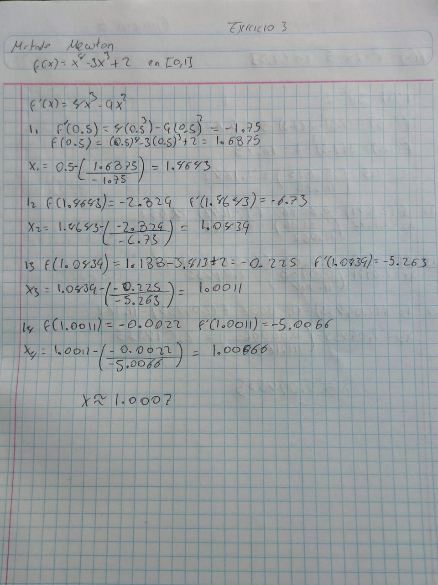{width=600}


### 4

```{r}

# 1. Definir función y derivada
f  <- function(x) { sin(x) - (x/3) }     
df <- function(x) { cos(x) - 1/3 }        

# Valor inicial
x <- 1

# Crear tabla vacía
tabla <- data.frame(
  k = 1:10,
  xk = numeric(10),
  fxk = numeric(10),
  dfxk = numeric(10),
  error = numeric(10)
)

# ====== k = 1 ======
tabla$xk[1]   <- x
tabla$fxk[1]  <- f(x)
tabla$dfxk[1] <- df(x)
x1 <- x - tabla$fxk[1]/tabla$dfxk[1]
tabla$error[1] <- abs(x1 - x)
x <- x1

# ====== k = 2 ======
tabla$xk[2]   <- x
tabla$fxk[2]  <- f(x)
tabla$dfxk[2] <- df(x)
x1 <- x - tabla$fxk[2]/tabla$dfxk[2]
tabla$error[2] <- abs(x1 - x)
x <- x1

# ====== k = 3 ======
tabla$xk[3]   <- x
tabla$fxk[3]  <- f(x)
tabla$dfxk[3] <- df(x)
x1 <- x - tabla$fxk[3]/tabla$dfxk[3]
tabla$error[3] <- abs(x1 - x)
x <- x1

# ====== k = 4 ======
tabla$xk[4]   <- x
tabla$fxk[4]  <- f(x)
tabla$dfxk[4] <- df(x)
x1 <- x - tabla$fxk[4]/tabla$dfxk[4]
tabla$error[4] <- abs(x1 - x)
x <- x1

# ====== k = 5 ======
tabla$xk[5]   <- x
tabla$fxk[5]  <- f(x)
tabla$dfxk[5] <- df(x)
x1 <- x - tabla$fxk[5]/tabla$dfxk[5]
tabla$error[5] <- abs(x1 - x)
x <- x1

# ====== k = 6 ======
tabla$xk[6]   <- x
tabla$fxk[6]  <- f(x)
tabla$dfxk[6] <- df(x)
x1 <- x - tabla$fxk[6]/tabla$dfxk[6]
tabla$error[6] <- abs(x1 - x)
x <- x1

# ====== k = 7 ======
tabla$xk[7]   <- x
tabla$fxk[7]  <- f(x)
tabla$dfxk[7] <- df(x)
x1 <- x - tabla$fxk[7]/tabla$dfxk[7]
tabla$error[7] <- abs(x1 - x)
x <- x1

# ====== k = 8 ======
tabla$xk[8]   <- x
tabla$fxk[8]  <- f(x)
tabla$dfxk[8] <- df(x)
x1 <- x - tabla$fxk[8]/tabla$dfxk[8]
tabla$error[8] <- abs(x1 - x)
x <- x1

# ====== k = 9 ======
tabla$xk[9]   <- x
tabla$fxk[9]  <- f(x)
tabla$dfxk[9] <- df(x)
x1 <- x - tabla$fxk[9]/tabla$dfxk[9]
tabla$error[9] <- abs(x1 - x)
x <- x1

# ====== k = 10 ======
tabla$xk[10]   <- x
tabla$fxk[10]  <- f(x)
tabla$dfxk[10] <- df(x)
x1 <- x - tabla$fxk[10]/tabla$dfxk[10]
tabla$error[10] <- abs(x1 - x)
x <- x1

# Resultado final
root_aprox <- x
print(tabla)
cat("Raíz aproximada =", root_aprox, "\n")

curve(f, from = -5, to = 5, col = "blue", lwd = 2,
      xlab = "x", ylab = "f(x)", main = "Método de Newton")
abline(h = 0, col = "black")

# Marcar la raíz
points(root_aprox, f(root_aprox), col = "red", pch = 19, cex = 1.5)
text(root_aprox, f(root_aprox), labels = "  Raíz", pos = 4, col = "red")
```

### 5

```{r}

# 1. Definir función y derivada
f  <- function(x) { (exp(1)^-x)- x }     
df <- function(x) { (-exp(1)^-x)- 1 }        

# Valor inicial
x <- 0.5

# Crear tabla vacía
tabla <- data.frame(
  k = 1:10,
  xk = numeric(10),
  fxk = numeric(10),
  dfxk = numeric(10),
  error = numeric(10)
)

# ====== k = 1 ======
tabla$xk[1]   <- x
tabla$fxk[1]  <- f(x)
tabla$dfxk[1] <- df(x)
x1 <- x - tabla$fxk[1]/tabla$dfxk[1]
tabla$error[1] <- abs(x1 - x)
x <- x1

# ====== k = 2 ======
tabla$xk[2]   <- x
tabla$fxk[2]  <- f(x)
tabla$dfxk[2] <- df(x)
x1 <- x - tabla$fxk[2]/tabla$dfxk[2]
tabla$error[2] <- abs(x1 - x)
x <- x1

# ====== k = 3 ======
tabla$xk[3]   <- x
tabla$fxk[3]  <- f(x)
tabla$dfxk[3] <- df(x)
x1 <- x - tabla$fxk[3]/tabla$dfxk[3]
tabla$error[3] <- abs(x1 - x)
x <- x1

# ====== k = 4 ======
tabla$xk[4]   <- x
tabla$fxk[4]  <- f(x)
tabla$dfxk[4] <- df(x)
x1 <- x - tabla$fxk[4]/tabla$dfxk[4]
tabla$error[4] <- abs(x1 - x)
x <- x1

# ====== k = 5 ======
tabla$xk[5]   <- x
tabla$fxk[5]  <- f(x)
tabla$dfxk[5] <- df(x)
x1 <- x - tabla$fxk[5]/tabla$dfxk[5]
tabla$error[5] <- abs(x1 - x)
x <- x1

# ====== k = 6 ======
tabla$xk[6]   <- x
tabla$fxk[6]  <- f(x)
tabla$dfxk[6] <- df(x)
x1 <- x - tabla$fxk[6]/tabla$dfxk[6]
tabla$error[6] <- abs(x1 - x)
x <- x1

# ====== k = 7 ======
tabla$xk[7]   <- x
tabla$fxk[7]  <- f(x)
tabla$dfxk[7] <- df(x)
x1 <- x - tabla$fxk[7]/tabla$dfxk[7]
tabla$error[7] <- abs(x1 - x)
x <- x1

# ====== k = 8 ======
tabla$xk[8]   <- x
tabla$fxk[8]  <- f(x)
tabla$dfxk[8] <- df(x)
x1 <- x - tabla$fxk[8]/tabla$dfxk[8]
tabla$error[8] <- abs(x1 - x)
x <- x1

# ====== k = 9 ======
tabla$xk[9]   <- x
tabla$fxk[9]  <- f(x)
tabla$dfxk[9] <- df(x)
x1 <- x - tabla$fxk[9]/tabla$dfxk[9]
tabla$error[9] <- abs(x1 - x)
x <- x1

# ====== k = 10 ======
tabla$xk[10]   <- x
tabla$fxk[10]  <- f(x)
tabla$dfxk[10] <- df(x)
x1 <- x - tabla$fxk[10]/tabla$dfxk[10]
tabla$error[10] <- abs(x1 - x)
x <- x1

# Resultado final
root_aprox <- x
print(tabla)
cat("Raíz aproximada =", root_aprox, "\n")

curve(f, from = -5, to = 5, col = "blue", lwd = 2,
      xlab = "x", ylab = "f(x)", main = "Método de Newton")
abline(h = 0, col = "black")

# Marcar la raíz
points(root_aprox, f(root_aprox), col = "red", pch = 19, cex = 1.5)
text(root_aprox, f(root_aprox), labels = "  Raíz", pos = 4, col = "red")
```

### 6

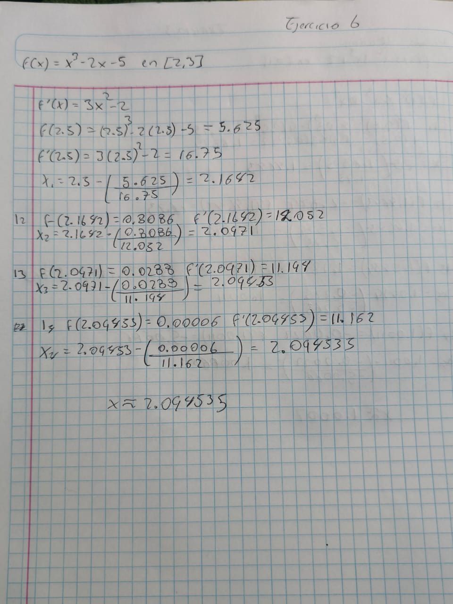{width=600}


### 7

```{r}

# 1. Definir función y derivada
f  <- function(x) { x^5 - 3*x +1 }     
df <- function(x) { (5*x^4) - 3 }        

# Valor inicial
x <- 0.2

# Crear tabla vacía
tabla <- data.frame(
  k = 1:10,
  xk = numeric(10),
  fxk = numeric(10),
  dfxk = numeric(10),
  error = numeric(10)
)

# ====== k = 1 ======
tabla$xk[1]   <- x
tabla$fxk[1]  <- f(x)
tabla$dfxk[1] <- df(x)
x1 <- x - tabla$fxk[1]/tabla$dfxk[1]
tabla$error[1] <- abs(x1 - x)
x <- x1

# ====== k = 2 ======
tabla$xk[2]   <- x
tabla$fxk[2]  <- f(x)
tabla$dfxk[2] <- df(x)
x1 <- x - tabla$fxk[2]/tabla$dfxk[2]
tabla$error[2] <- abs(x1 - x)
x <- x1

# ====== k = 3 ======
tabla$xk[3]   <- x
tabla$fxk[3]  <- f(x)
tabla$dfxk[3] <- df(x)
x1 <- x - tabla$fxk[3]/tabla$dfxk[3]
tabla$error[3] <- abs(x1 - x)
x <- x1

# ====== k = 4 ======
tabla$xk[4]   <- x
tabla$fxk[4]  <- f(x)
tabla$dfxk[4] <- df(x)
x1 <- x - tabla$fxk[4]/tabla$dfxk[4]
tabla$error[4] <- abs(x1 - x)
x <- x1

# ====== k = 5 ======
tabla$xk[5]   <- x
tabla$fxk[5]  <- f(x)
tabla$dfxk[5] <- df(x)
x1 <- x - tabla$fxk[5]/tabla$dfxk[5]
tabla$error[5] <- abs(x1 - x)
x <- x1

# ====== k = 6 ======
tabla$xk[6]   <- x
tabla$fxk[6]  <- f(x)
tabla$dfxk[6] <- df(x)
x1 <- x - tabla$fxk[6]/tabla$dfxk[6]
tabla$error[6] <- abs(x1 - x)
x <- x1

# ====== k = 7 ======
tabla$xk[7]   <- x
tabla$fxk[7]  <- f(x)
tabla$dfxk[7] <- df(x)
x1 <- x - tabla$fxk[7]/tabla$dfxk[7]
tabla$error[7] <- abs(x1 - x)
x <- x1

# ====== k = 8 ======
tabla$xk[8]   <- x
tabla$fxk[8]  <- f(x)
tabla$dfxk[8] <- df(x)
x1 <- x - tabla$fxk[8]/tabla$dfxk[8]
tabla$error[8] <- abs(x1 - x)
x <- x1

# ====== k = 9 ======
tabla$xk[9]   <- x
tabla$fxk[9]  <- f(x)
tabla$dfxk[9] <- df(x)
x1 <- x - tabla$fxk[9]/tabla$dfxk[9]
tabla$error[9] <- abs(x1 - x)
x <- x1

# ====== k = 10 ======
tabla$xk[10]   <- x
tabla$fxk[10]  <- f(x)
tabla$dfxk[10] <- df(x)
x1 <- x - tabla$fxk[10]/tabla$dfxk[10]
tabla$error[10] <- abs(x1 - x)
x <- x1

# Resultado final
root_aprox <- x
print(tabla)
cat("Raíz aproximada =", root_aprox, "\n")

curve(f, from = -5, to = 5, col = "blue", lwd = 2,
      xlab = "x", ylab = "f(x)", main = "Método de Newton")
abline(h = 0, col = "black")

# Marcar la raíz
points(root_aprox, f(root_aprox), col = "red", pch = 19, cex = 1.5)
text(root_aprox, f(root_aprox), labels = "  Raíz", pos = 4, col = "red")
```

### 8

```{r}

# 1. Definir función y derivada
f  <- function(x) { cos(x)-2*x }     
df <- function(x) { -sin(x)-2 }        

# Valor inicial
x <- 0.8

# Crear tabla vacía
tabla <- data.frame(
  k = 1:10,
  xk = numeric(10),
  fxk = numeric(10),
  dfxk = numeric(10),
  error = numeric(10)
)

# ====== k = 1 ======
tabla$xk[1]   <- x
tabla$fxk[1]  <- f(x)
tabla$dfxk[1] <- df(x)
x1 <- x - tabla$fxk[1]/tabla$dfxk[1]
tabla$error[1] <- abs(x1 - x)
x <- x1

# ====== k = 2 ======
tabla$xk[2]   <- x
tabla$fxk[2]  <- f(x)
tabla$dfxk[2] <- df(x)
x1 <- x - tabla$fxk[2]/tabla$dfxk[2]
tabla$error[2] <- abs(x1 - x)
x <- x1

# ====== k = 3 ======
tabla$xk[3]   <- x
tabla$fxk[3]  <- f(x)
tabla$dfxk[3] <- df(x)
x1 <- x - tabla$fxk[3]/tabla$dfxk[3]
tabla$error[3] <- abs(x1 - x)
x <- x1

# ====== k = 4 ======
tabla$xk[4]   <- x
tabla$fxk[4]  <- f(x)
tabla$dfxk[4] <- df(x)
x1 <- x - tabla$fxk[4]/tabla$dfxk[4]
tabla$error[4] <- abs(x1 - x)
x <- x1

# ====== k = 5 ======
tabla$xk[5]   <- x
tabla$fxk[5]  <- f(x)
tabla$dfxk[5] <- df(x)
x1 <- x - tabla$fxk[5]/tabla$dfxk[5]
tabla$error[5] <- abs(x1 - x)
x <- x1

# ====== k = 6 ======
tabla$xk[6]   <- x
tabla$fxk[6]  <- f(x)
tabla$dfxk[6] <- df(x)
x1 <- x - tabla$fxk[6]/tabla$dfxk[6]
tabla$error[6] <- abs(x1 - x)
x <- x1

# ====== k = 7 ======
tabla$xk[7]   <- x
tabla$fxk[7]  <- f(x)
tabla$dfxk[7] <- df(x)
x1 <- x - tabla$fxk[7]/tabla$dfxk[7]
tabla$error[7] <- abs(x1 - x)
x <- x1

# ====== k = 8 ======
tabla$xk[8]   <- x
tabla$fxk[8]  <- f(x)
tabla$dfxk[8] <- df(x)
x1 <- x - tabla$fxk[8]/tabla$dfxk[8]
tabla$error[8] <- abs(x1 - x)
x <- x1

# ====== k = 9 ======
tabla$xk[9]   <- x
tabla$fxk[9]  <- f(x)
tabla$dfxk[9] <- df(x)
x1 <- x - tabla$fxk[9]/tabla$dfxk[9]
tabla$error[9] <- abs(x1 - x)
x <- x1

# ====== k = 10 ======
tabla$xk[10]   <- x
tabla$fxk[10]  <- f(x)
tabla$dfxk[10] <- df(x)
x1 <- x - tabla$fxk[10]/tabla$dfxk[10]
tabla$error[10] <- abs(x1 - x)
x <- x1

# Resultado final
root_aprox <- x
print(tabla)
cat("Raíz aproximada =", root_aprox, "\n")

curve(f, from = -5, to = 5, col = "blue", lwd = 2,
      xlab = "x", ylab = "f(x)", main = "Método de Newton")
abline(h = 0, col = "black")

# Marcar la raíz
points(root_aprox, f(root_aprox), col = "red", pch = 19, cex = 1.5)
text(root_aprox, f(root_aprox), labels = "  Raíz", pos = 4, col = "red")
```
### 9 

```{r}

# 1. Definir función y derivada
f  <- function(x) { log(x + 2) + x - 1 }     
df <- function(x) { 1/(x + 2) + 1 }        

# Valor inicial
x <- -0.5

# Crear tabla vacía
tabla <- data.frame(
  k = 1:10,
  xk = numeric(10),
  fxk = numeric(10),
  dfxk = numeric(10),
  error = numeric(10)
)

# ====== k = 1 ======
tabla$xk[1]   <- x
tabla$fxk[1]  <- f(x)
tabla$dfxk[1] <- df(x)
x1 <- x - tabla$fxk[1]/tabla$dfxk[1]
tabla$error[1] <- abs(x1 - x)
x <- x1

# ====== k = 2 ======
tabla$xk[2]   <- x
tabla$fxk[2]  <- f(x)
tabla$dfxk[2] <- df(x)
x1 <- x - tabla$fxk[2]/tabla$dfxk[2]
tabla$error[2] <- abs(x1 - x)
x <- x1

# ====== k = 3 ======
tabla$xk[3]   <- x
tabla$fxk[3]  <- f(x)
tabla$dfxk[3] <- df(x)
x1 <- x - tabla$fxk[3]/tabla$dfxk[3]
tabla$error[3] <- abs(x1 - x)
x <- x1

# ====== k = 4 ======
tabla$xk[4]   <- x
tabla$fxk[4]  <- f(x)
tabla$dfxk[4] <- df(x)
x1 <- x - tabla$fxk[4]/tabla$dfxk[4]
tabla$error[4] <- abs(x1 - x)
x <- x1

# ====== k = 5 ======
tabla$xk[5]   <- x
tabla$fxk[5]  <- f(x)
tabla$dfxk[5] <- df(x)
x1 <- x - tabla$fxk[5]/tabla$dfxk[5]
tabla$error[5] <- abs(x1 - x)
x <- x1

# ====== k = 6 ======
tabla$xk[6]   <- x
tabla$fxk[6]  <- f(x)
tabla$dfxk[6] <- df(x)
x1 <- x - tabla$fxk[6]/tabla$dfxk[6]
tabla$error[6] <- abs(x1 - x)
x <- x1

# ====== k = 7 ======
tabla$xk[7]   <- x
tabla$fxk[7]  <- f(x)
tabla$dfxk[7] <- df(x)
x1 <- x - tabla$fxk[7]/tabla$dfxk[7]
tabla$error[7] <- abs(x1 - x)
x <- x1

# ====== k = 8 ======
tabla$xk[8]   <- x
tabla$fxk[8]  <- f(x)
tabla$dfxk[8] <- df(x)
x1 <- x - tabla$fxk[8]/tabla$dfxk[8]
tabla$error[8] <- abs(x1 - x)
x <- x1

# ====== k = 9 ======
tabla$xk[9]   <- x
tabla$fxk[9]  <- f(x)
tabla$dfxk[9] <- df(x)
x1 <- x - tabla$fxk[9]/tabla$dfxk[9]
tabla$error[9] <- abs(x1 - x)
x <- x1

# ====== k = 10 ======
tabla$xk[10]   <- x
tabla$fxk[10]  <- f(x)
tabla$dfxk[10] <- df(x)
x1 <- x - tabla$fxk[10]/tabla$dfxk[10]
tabla$error[10] <- abs(x1 - x)
x <- x1

# Resultado final
root_aprox <- x
print(tabla)
cat("Raíz aproximada =", root_aprox, "\n")

curve(f, from = -5, to = 5, col = "blue", lwd = 2,
      xlab = "x", ylab = "f(x)", main = "Método de Newton")
abline(h = 0, col = "black")

# Marcar la raíz
points(root_aprox, f(root_aprox), col = "red", pch = 19, cex = 1.5)
text(root_aprox, f(root_aprox), labels = "  Raíz", pos = 4, col = "red")
```

### 10

```{r}

# 1. Definir función y derivada
f  <- function(x) { x*(exp(1)^-(x)) - 0.1 }     
df <- function(x) { -x*(exp(1)^-(x)) + (exp(1)^-(x)) }        

# Valor inicial
x <- 0.5

# Crear tabla vacía
tabla <- data.frame(
  k = 1:10,
  xk = numeric(10),
  fxk = numeric(10),
  dfxk = numeric(10),
  error = numeric(10)
)

# ====== k = 1 ======
tabla$xk[1]   <- x
tabla$fxk[1]  <- f(x)
tabla$dfxk[1] <- df(x)
x1 <- x - tabla$fxk[1]/tabla$dfxk[1]
tabla$error[1] <- abs(x1 - x)
x <- x1

# ====== k = 2 ======
tabla$xk[2]   <- x
tabla$fxk[2]  <- f(x)
tabla$dfxk[2] <- df(x)
x1 <- x - tabla$fxk[2]/tabla$dfxk[2]
tabla$error[2] <- abs(x1 - x)
x <- x1

# ====== k = 3 ======
tabla$xk[3]   <- x
tabla$fxk[3]  <- f(x)
tabla$dfxk[3] <- df(x)
x1 <- x - tabla$fxk[3]/tabla$dfxk[3]
tabla$error[3] <- abs(x1 - x)
x <- x1

# ====== k = 4 ======
tabla$xk[4]   <- x
tabla$fxk[4]  <- f(x)
tabla$dfxk[4] <- df(x)
x1 <- x - tabla$fxk[4]/tabla$dfxk[4]
tabla$error[4] <- abs(x1 - x)
x <- x1

# ====== k = 5 ======
tabla$xk[5]   <- x
tabla$fxk[5]  <- f(x)
tabla$dfxk[5] <- df(x)
x1 <- x - tabla$fxk[5]/tabla$dfxk[5]
tabla$error[5] <- abs(x1 - x)
x <- x1

# ====== k = 6 ======
tabla$xk[6]   <- x
tabla$fxk[6]  <- f(x)
tabla$dfxk[6] <- df(x)
x1 <- x - tabla$fxk[6]/tabla$dfxk[6]
tabla$error[6] <- abs(x1 - x)
x <- x1

# ====== k = 7 ======
tabla$xk[7]   <- x
tabla$fxk[7]  <- f(x)
tabla$dfxk[7] <- df(x)
x1 <- x - tabla$fxk[7]/tabla$dfxk[7]
tabla$error[7] <- abs(x1 - x)
x <- x1

# ====== k = 8 ======
tabla$xk[8]   <- x
tabla$fxk[8]  <- f(x)
tabla$dfxk[8] <- df(x)
x1 <- x - tabla$fxk[8]/tabla$dfxk[8]
tabla$error[8] <- abs(x1 - x)
x <- x1

# ====== k = 9 ======
tabla$xk[9]   <- x
tabla$fxk[9]  <- f(x)
tabla$dfxk[9] <- df(x)
x1 <- x - tabla$fxk[9]/tabla$dfxk[9]
tabla$error[9] <- abs(x1 - x)
x <- x1

# ====== k = 10 ======
tabla$xk[10]   <- x
tabla$fxk[10]  <- f(x)
tabla$dfxk[10] <- df(x)
x1 <- x - tabla$fxk[10]/tabla$dfxk[10]
tabla$error[10] <- abs(x1 - x)
x <- x1

# Resultado final
root_aprox <- x
print(tabla)
cat("Raíz aproximada =", root_aprox, "\n")

curve(f, from = -5, to = 5, col = "blue", lwd = 2,
      xlab = "x", ylab = "f(x)", main = "Método de Newton")
abline(h = 0, col = "black")

# Marcar la raíz
points(root_aprox, f(root_aprox), col = "red", pch = 19, cex = 1.5)
text(root_aprox, f(root_aprox), labels = "  Raíz", pos = 4, col = "red")
```

### 11

```{r}

# 1. Definir función y derivada
f  <- function(x) { (x^3) - 4*sin(x) }     
df <- function(x) { 3*x^2 - 4*cos(x) }        

# Valor inicial
x <- 1.7

# Crear tabla vacía
tabla <- data.frame(
  k = 1:10,
  xk = numeric(10),
  fxk = numeric(10),
  dfxk = numeric(10),
  error = numeric(10)
)

# ====== k = 1 ======
tabla$xk[1]   <- x
tabla$fxk[1]  <- f(x)
tabla$dfxk[1] <- df(x)
x1 <- x - tabla$fxk[1]/tabla$dfxk[1]
tabla$error[1] <- abs(x1 - x)
x <- x1

# ====== k = 2 ======
tabla$xk[2]   <- x
tabla$fxk[2]  <- f(x)
tabla$dfxk[2] <- df(x)
x1 <- x - tabla$fxk[2]/tabla$dfxk[2]
tabla$error[2] <- abs(x1 - x)
x <- x1

# ====== k = 3 ======
tabla$xk[3]   <- x
tabla$fxk[3]  <- f(x)
tabla$dfxk[3] <- df(x)
x1 <- x - tabla$fxk[3]/tabla$dfxk[3]
tabla$error[3] <- abs(x1 - x)
x <- x1

# ====== k = 4 ======
tabla$xk[4]   <- x
tabla$fxk[4]  <- f(x)
tabla$dfxk[4] <- df(x)
x1 <- x - tabla$fxk[4]/tabla$dfxk[4]
tabla$error[4] <- abs(x1 - x)
x <- x1

# ====== k = 5 ======
tabla$xk[5]   <- x
tabla$fxk[5]  <- f(x)
tabla$dfxk[5] <- df(x)
x1 <- x - tabla$fxk[5]/tabla$dfxk[5]
tabla$error[5] <- abs(x1 - x)
x <- x1

# ====== k = 6 ======
tabla$xk[6]   <- x
tabla$fxk[6]  <- f(x)
tabla$dfxk[6] <- df(x)
x1 <- x - tabla$fxk[6]/tabla$dfxk[6]
tabla$error[6] <- abs(x1 - x)
x <- x1

# ====== k = 7 ======
tabla$xk[7]   <- x
tabla$fxk[7]  <- f(x)
tabla$dfxk[7] <- df(x)
x1 <- x - tabla$fxk[7]/tabla$dfxk[7]
tabla$error[7] <- abs(x1 - x)
x <- x1

# ====== k = 8 ======
tabla$xk[8]   <- x
tabla$fxk[8]  <- f(x)
tabla$dfxk[8] <- df(x)
x1 <- x - tabla$fxk[8]/tabla$dfxk[8]
tabla$error[8] <- abs(x1 - x)
x <- x1

# ====== k = 9 ======
tabla$xk[9]   <- x
tabla$fxk[9]  <- f(x)
tabla$dfxk[9] <- df(x)
x1 <- x - tabla$fxk[9]/tabla$dfxk[9]
tabla$error[9] <- abs(x1 - x)
x <- x1

# ====== k = 10 ======
tabla$xk[10]   <- x
tabla$fxk[10]  <- f(x)
tabla$dfxk[10] <- df(x)
x1 <- x - tabla$fxk[10]/tabla$dfxk[10]
tabla$error[10] <- abs(x1 - x)
x <- x1

# Resultado final
root_aprox <- x
print(tabla)
cat("Raíz aproximada =", root_aprox, "\n")

curve(f, from = -5, to = 5, col = "blue", lwd = 2,
      xlab = "x", ylab = "f(x)", main = "Método de Newton")
abline(h = 0, col = "black")

# Marcar la raíz
points(root_aprox, f(root_aprox), col = "red", pch = 19, cex = 1.5)
text(root_aprox, f(root_aprox), labels = "  Raíz", pos = 4, col = "red")
```

### 12

```{r}

# 1. Definir función y derivada
f  <- function(x) { (exp(1)^x) - 3*x^2 }     
df <- function(x) { (exp(1)^x) - 6*x }        

# Valor inicial
x <- 0.6

# Crear tabla vacía
tabla <- data.frame(
  k = 1:10,
  xk = numeric(10),
  fxk = numeric(10),
  dfxk = numeric(10),
  error = numeric(10)
)

# ====== k = 1 ======
tabla$xk[1]   <- x
tabla$fxk[1]  <- f(x)
tabla$dfxk[1] <- df(x)
x1 <- x - tabla$fxk[1]/tabla$dfxk[1]
tabla$error[1] <- abs(x1 - x)
x <- x1

# ====== k = 2 ======
tabla$xk[2]   <- x
tabla$fxk[2]  <- f(x)
tabla$dfxk[2] <- df(x)
x1 <- x - tabla$fxk[2]/tabla$dfxk[2]
tabla$error[2] <- abs(x1 - x)
x <- x1

# ====== k = 3 ======
tabla$xk[3]   <- x
tabla$fxk[3]  <- f(x)
tabla$dfxk[3] <- df(x)
x1 <- x - tabla$fxk[3]/tabla$dfxk[3]
tabla$error[3] <- abs(x1 - x)
x <- x1

# ====== k = 4 ======
tabla$xk[4]   <- x
tabla$fxk[4]  <- f(x)
tabla$dfxk[4] <- df(x)
x1 <- x - tabla$fxk[4]/tabla$dfxk[4]
tabla$error[4] <- abs(x1 - x)
x <- x1

# ====== k = 5 ======
tabla$xk[5]   <- x
tabla$fxk[5]  <- f(x)
tabla$dfxk[5] <- df(x)
x1 <- x - tabla$fxk[5]/tabla$dfxk[5]
tabla$error[5] <- abs(x1 - x)
x <- x1

# ====== k = 6 ======
tabla$xk[6]   <- x
tabla$fxk[6]  <- f(x)
tabla$dfxk[6] <- df(x)
x1 <- x - tabla$fxk[6]/tabla$dfxk[6]
tabla$error[6] <- abs(x1 - x)
x <- x1

# ====== k = 7 ======
tabla$xk[7]   <- x
tabla$fxk[7]  <- f(x)
tabla$dfxk[7] <- df(x)
x1 <- x - tabla$fxk[7]/tabla$dfxk[7]
tabla$error[7] <- abs(x1 - x)
x <- x1

# ====== k = 8 ======
tabla$xk[8]   <- x
tabla$fxk[8]  <- f(x)
tabla$dfxk[8] <- df(x)
x1 <- x - tabla$fxk[8]/tabla$dfxk[8]
tabla$error[8] <- abs(x1 - x)
x <- x1

# ====== k = 9 ======
tabla$xk[9]   <- x
tabla$fxk[9]  <- f(x)
tabla$dfxk[9] <- df(x)
x1 <- x - tabla$fxk[9]/tabla$dfxk[9]
tabla$error[9] <- abs(x1 - x)
x <- x1

# ====== k = 10 ======
tabla$xk[10]   <- x
tabla$fxk[10]  <- f(x)
tabla$dfxk[10] <- df(x)
x1 <- x - tabla$fxk[10]/tabla$dfxk[10]
tabla$error[10] <- abs(x1 - x)
x <- x1

# Resultado final
root_aprox <- x
print(tabla)
cat("Raíz aproximada =", root_aprox, "\n")

curve(f, from = -5, to = 5, col = "blue", lwd = 2,
      xlab = "x", ylab = "f(x)", main = "Método de Newton")
abline(h = 0, col = "black")

# Marcar la raíz
points(root_aprox, f(root_aprox), col = "red", pch = 19, cex = 1.5)
text(root_aprox, f(root_aprox), labels = "  Raíz", pos = 4, col = "red")
```
### 13

```{r}

# 1. Definir función y derivada
f  <- function(x) { x^2 - cos(x) }     
df <- function(x) { 2*x + sin(x) }        

# Valor inicial
x <- 0.2

# Crear tabla vacía
tabla <- data.frame(
  k = 1:10,
  xk = numeric(10),
  fxk = numeric(10),
  dfxk = numeric(10),
  error = numeric(10)
)

# ====== k = 1 ======
tabla$xk[1]   <- x
tabla$fxk[1]  <- f(x)
tabla$dfxk[1] <- df(x)
x1 <- x - tabla$fxk[1]/tabla$dfxk[1]
tabla$error[1] <- abs(x1 - x)
x <- x1

# ====== k = 2 ======
tabla$xk[2]   <- x
tabla$fxk[2]  <- f(x)
tabla$dfxk[2] <- df(x)
x1 <- x - tabla$fxk[2]/tabla$dfxk[2]
tabla$error[2] <- abs(x1 - x)
x <- x1

# ====== k = 3 ======
tabla$xk[3]   <- x
tabla$fxk[3]  <- f(x)
tabla$dfxk[3] <- df(x)
x1 <- x - tabla$fxk[3]/tabla$dfxk[3]
tabla$error[3] <- abs(x1 - x)
x <- x1

# ====== k = 4 ======
tabla$xk[4]   <- x
tabla$fxk[4]  <- f(x)
tabla$dfxk[4] <- df(x)
x1 <- x - tabla$fxk[4]/tabla$dfxk[4]
tabla$error[4] <- abs(x1 - x)
x <- x1

# ====== k = 5 ======
tabla$xk[5]   <- x
tabla$fxk[5]  <- f(x)
tabla$dfxk[5] <- df(x)
x1 <- x - tabla$fxk[5]/tabla$dfxk[5]
tabla$error[5] <- abs(x1 - x)
x <- x1

# ====== k = 6 ======
tabla$xk[6]   <- x
tabla$fxk[6]  <- f(x)
tabla$dfxk[6] <- df(x)
x1 <- x - tabla$fxk[6]/tabla$dfxk[6]
tabla$error[6] <- abs(x1 - x)
x <- x1

# ====== k = 7 ======
tabla$xk[7]   <- x
tabla$fxk[7]  <- f(x)
tabla$dfxk[7] <- df(x)
x1 <- x - tabla$fxk[7]/tabla$dfxk[7]
tabla$error[7] <- abs(x1 - x)
x <- x1

# ====== k = 8 ======
tabla$xk[8]   <- x
tabla$fxk[8]  <- f(x)
tabla$dfxk[8] <- df(x)
x1 <- x - tabla$fxk[8]/tabla$dfxk[8]
tabla$error[8] <- abs(x1 - x)
x <- x1

# ====== k = 9 ======
tabla$xk[9]   <- x
tabla$fxk[9]  <- f(x)
tabla$dfxk[9] <- df(x)
x1 <- x - tabla$fxk[9]/tabla$dfxk[9]
tabla$error[9] <- abs(x1 - x)
x <- x1

# ====== k = 10 ======
tabla$xk[10]   <- x
tabla$fxk[10]  <- f(x)
tabla$dfxk[10] <- df(x)
x1 <- x - tabla$fxk[10]/tabla$dfxk[10]
tabla$error[10] <- abs(x1 - x)
x <- x1

# Resultado final
root_aprox <- x
print(tabla)
cat("Raíz aproximada =", root_aprox, "\n")

curve(f, from = -5, to = 5, col = "blue", lwd = 2,
      xlab = "x", ylab = "f(x)", main = "Método de Newton")
abline(h = 0, col = "black")

# Marcar la raíz
points(root_aprox, f(root_aprox), col = "red", pch = 19, cex = 1.5)
text(root_aprox, f(root_aprox), labels = "  Raíz", pos = 4, col = "red")
```

### 14

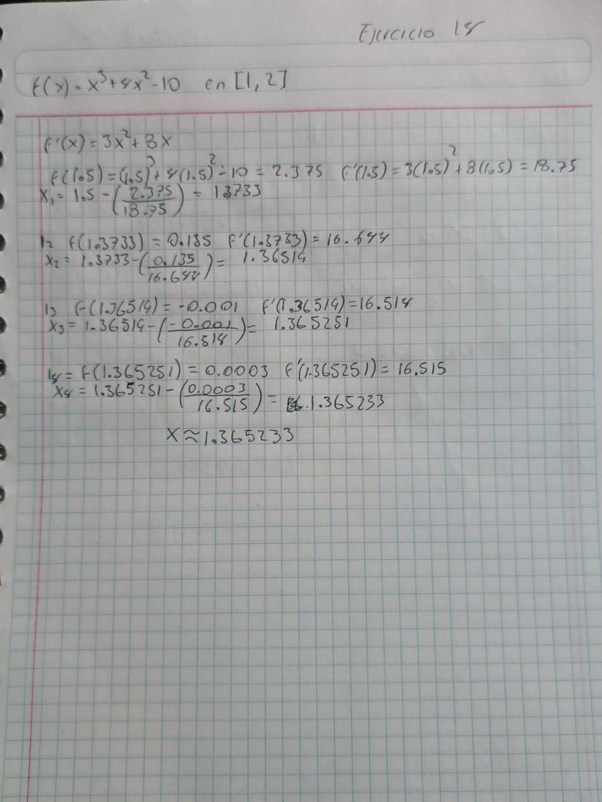{width=600}

### 15

```{r}

# 1. Definir función y derivada
f  <- function(x) { (2*x)*sin(x) - 1  }     
df <- function(x) { (2*x)*cos(x) + 2*sin(x) }        

# Valor inicial
x <- 0.1

# Crear tabla vacía
tabla <- data.frame(
  k = 1:10,
  xk = numeric(10),
  fxk = numeric(10),
  dfxk = numeric(10),
  error = numeric(10)
)

# ====== k = 1 ======
tabla$xk[1]   <- x
tabla$fxk[1]  <- f(x)
tabla$dfxk[1] <- df(x)
x1 <- x - tabla$fxk[1]/tabla$dfxk[1]
tabla$error[1] <- abs(x1 - x)
x <- x1

# ====== k = 2 ======
tabla$xk[2]   <- x
tabla$fxk[2]  <- f(x)
tabla$dfxk[2] <- df(x)
x1 <- x - tabla$fxk[2]/tabla$dfxk[2]
tabla$error[2] <- abs(x1 - x)
x <- x1

# ====== k = 3 ======
tabla$xk[3]   <- x
tabla$fxk[3]  <- f(x)
tabla$dfxk[3] <- df(x)
x1 <- x - tabla$fxk[3]/tabla$dfxk[3]
tabla$error[3] <- abs(x1 - x)
x <- x1

# ====== k = 4 ======
tabla$xk[4]   <- x
tabla$fxk[4]  <- f(x)
tabla$dfxk[4] <- df(x)
x1 <- x - tabla$fxk[4]/tabla$dfxk[4]
tabla$error[4] <- abs(x1 - x)
x <- x1

# ====== k = 5 ======
tabla$xk[5]   <- x
tabla$fxk[5]  <- f(x)
tabla$dfxk[5] <- df(x)
x1 <- x - tabla$fxk[5]/tabla$dfxk[5]
tabla$error[5] <- abs(x1 - x)
x <- x1

# ====== k = 6 ======
tabla$xk[6]   <- x
tabla$fxk[6]  <- f(x)
tabla$dfxk[6] <- df(x)
x1 <- x - tabla$fxk[6]/tabla$dfxk[6]
tabla$error[6] <- abs(x1 - x)
x <- x1

# ====== k = 7 ======
tabla$xk[7]   <- x
tabla$fxk[7]  <- f(x)
tabla$dfxk[7] <- df(x)
x1 <- x - tabla$fxk[7]/tabla$dfxk[7]
tabla$error[7] <- abs(x1 - x)
x <- x1

# ====== k = 8 ======
tabla$xk[8]   <- x
tabla$fxk[8]  <- f(x)
tabla$dfxk[8] <- df(x)
x1 <- x - tabla$fxk[8]/tabla$dfxk[8]
tabla$error[8] <- abs(x1 - x)
x <- x1

# ====== k = 9 ======
tabla$xk[9]   <- x
tabla$fxk[9]  <- f(x)
tabla$dfxk[9] <- df(x)
x1 <- x - tabla$fxk[9]/tabla$dfxk[9]
tabla$error[9] <- abs(x1 - x)
x <- x1

# ====== k = 10 ======
tabla$xk[10]   <- x
tabla$fxk[10]  <- f(x)
tabla$dfxk[10] <- df(x)
x1 <- x - tabla$fxk[10]/tabla$dfxk[10]
tabla$error[10] <- abs(x1 - x)
x <- x1

# Resultado final
root_aprox <- x
print(tabla)
cat("Raíz aproximada =", root_aprox, "\n")

curve(f, from = -5, to = 5, col = "blue", lwd = 2,
      xlab = "x", ylab = "f(x)", main = "Método de Newton")
abline(h = 0, col = "black")

# Marcar la raíz
points(root_aprox, f(root_aprox), col = "red", pch = 19, cex = 1.5)
text(root_aprox, f(root_aprox), labels = "  Raíz", pos = 4, col = "red")
```

##  Método del Punto Fijo 

### 1. f(x) = cos(x) − x

```{r}

g <- function(x){ cos(x) }
x0 <- 0.5

# Iteración 1
x1  <- g(x0)
e1  <- abs(x1 - x0)

# Iteración 2
x2  <- g(x1)
e2  <- abs(x2 - x1)

# Iteración 3
x3  <- g(x2)
e3  <- abs(x3 - x2)

# Iteración 4
x4  <- g(x3)
e4  <- abs(x4 - x3)

# Iteración 5
x5  <- g(x4)
e5  <- abs(x5 - x4)

# Iteración 6
x6  <- g(x5)
e6  <- abs(x6 - x5)

# Iteración 7
x7  <- g(x6)
e7  <- abs(x7 - x6)

# Iteración 8
x8  <- g(x7)
e8  <- abs(x8 - x7)

# Iteración 9
x9  <- g(x8)
e9  <- abs(x9 - x8)

# Iteración 10
x10 <- g(x9)
e10 <- abs(x10 - x9)

root_aprox <- x10

cat("Raíz aproximada (x10) =", format(root_aprox, digits = 12), "\n")

# TABLA FINAL

tabla <- data.frame(
  k = 1:10,
  xk = c(x0, x1, x2, x3, x4, x5, x6, x7, x8, x9),
  g_xk = c(x1, x2, x3, x4, x5, x6, x7, x8, x9, x10),
  Error = c(e1, e2, e3, e4, e5, e6, e7, e8, e9, e10)
)

print(tabla)

#      GRÁFICA

r1 <- min(tabla$xk) - 1
r2 <- max(tabla$xk) + 1

curve(g(x), from = r1, to = r2, col = "blue", lwd = 2,
      xlab = "x", ylab = "y",
      main = "Punto fijo: y = g(x) y y = x")
abline(a = 0, b = 1, col = "red", lwd = 2)

points(x10, g(x10), col = "black", pch = 19)
```

### 2. f(x) = x^3 + x − 1

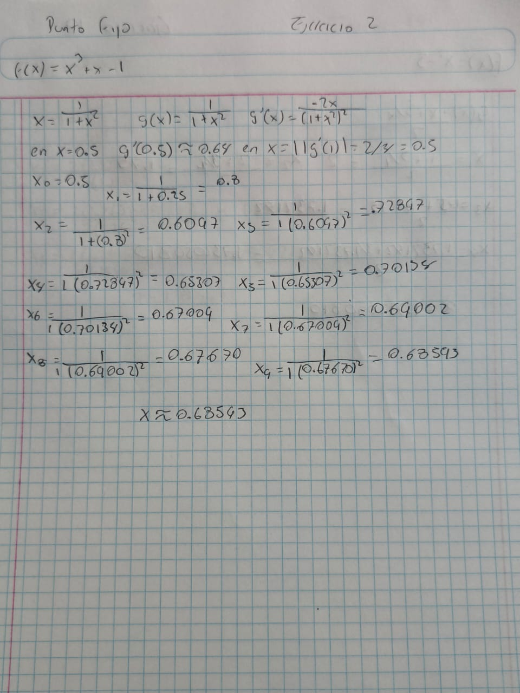{width=600}


### 3. f(x) = exp(-x) − x

```{r}

g <- function(x){ exp(-x) }
x0 <- 0.5

# Iteración 1
x1  <- g(x0)
e1  <- abs(x1 - x0)

# Iteración 2
x2  <- g(x1)
e2  <- abs(x2 - x1)

# Iteración 3
x3  <- g(x2)
e3  <- abs(x3 - x2)

# Iteración 4
x4  <- g(x3)
e4  <- abs(x4 - x3)

# Iteración 5
x5  <- g(x4)
e5  <- abs(x5 - x4)

# Iteración 6
x6  <- g(x5)
e6  <- abs(x6 - x5)

# Iteración 7
x7  <- g(x6)
e7  <- abs(x7 - x6)

# Iteración 8
x8  <- g(x7)
e8  <- abs(x8 - x7)

# Iteración 9
x9  <- g(x8)
e9  <- abs(x9 - x8)

# Iteración 10
x10 <- g(x9)
e10 <- abs(x10 - x9)

root_aprox <- x10

cat("Raíz aproximada (x10) =", format(root_aprox, digits = 12), "\n")

# TABLA FINAL

tabla <- data.frame(
  k = 1:10,
  xk = c(x0, x1, x2, x3, x4, x5, x6, x7, x8, x9),
  g_xk = c(x1, x2, x3, x4, x5, x6, x7, x8, x9, x10),
  Error = c(e1, e2, e3, e4, e5, e6, e7, e8, e9, e10)
)

print(tabla)

#      GRÁFICA

r1 <- min(tabla$xk) - 1
r2 <- max(tabla$xk) + 1

curve(g(x), from = r1, to = r2, col = "blue", lwd = 2,
      xlab = "x", ylab = "y",
      main = "Punto fijo: y = g(x) y y = x")
abline(a = 0, b = 1, col = "red", lwd = 2)

points(x10, g(x10), col = "black", pch = 19)
```

### 4. f(x) = x^2 − 4x + 1

```{r}

g <- function(x){ (x^2 + 1)/4 }
x0 <- 1

# Iteración 1
x1  <- g(x0)
e1  <- abs(x1 - x0)

# Iteración 2
x2  <- g(x1)
e2  <- abs(x2 - x1)

# Iteración 3
x3  <- g(x2)
e3  <- abs(x3 - x2)

# Iteración 4
x4  <- g(x3)
e4  <- abs(x4 - x3)

# Iteración 5
x5  <- g(x4)
e5  <- abs(x5 - x4)

# Iteración 6
x6  <- g(x5)
e6  <- abs(x6 - x5)

# Iteración 7
x7  <- g(x6)
e7  <- abs(x7 - x6)

# Iteración 8
x8  <- g(x7)
e8  <- abs(x8 - x7)

# Iteración 9
x9  <- g(x8)
e9  <- abs(x9 - x8)

# Iteración 10
x10 <- g(x9)
e10 <- abs(x10 - x9)

root_aprox <- x10

cat("Raíz aproximada (x10) =", format(root_aprox, digits = 12), "\n")

# TABLA FINAL

tabla <- data.frame(
  k = 1:10,
  xk = c(x0, x1, x2, x3, x4, x5, x6, x7, x8, x9),
  g_xk = c(x1, x2, x3, x4, x5, x6, x7, x8, x9, x10),
  Error = c(e1, e2, e3, e4, e5, e6, e7, e8, e9, e10)
)

print(tabla)

#      GRÁFICA

r1 <- min(tabla$xk) - 1
r2 <- max(tabla$xk) + 1

curve(g(x), from = r1, to = r2, col = "blue", lwd = 2,
      xlab = "x", ylab = "y",
      main = "Punto fijo: y = g(x) y y = x")
abline(a = 0, b = 1, col = "red", lwd = 2)

points(x10, g(x10), col = "black", pch = 19)
```

### 5. f(x) = x^3 − 2x − 5

```{r}

g <- function(x){ (2*x + 5)^(1/3) }
x0 <- 2

# Iteración 1
x1  <- g(x0)
e1  <- abs(x1 - x0)

# Iteración 2
x2  <- g(x1)
e2  <- abs(x2 - x1)

# Iteración 3
x3  <- g(x2)
e3  <- abs(x3 - x2)

# Iteración 4
x4  <- g(x3)
e4  <- abs(x4 - x3)

# Iteración 5
x5  <- g(x4)
e5  <- abs(x5 - x4)

# Iteración 6
x6  <- g(x5)
e6  <- abs(x6 - x5)

# Iteración 7
x7  <- g(x6)
e7  <- abs(x7 - x6)

# Iteración 8
x8  <- g(x7)
e8  <- abs(x8 - x7)

# Iteración 9
x9  <- g(x8)
e9  <- abs(x9 - x8)

# Iteración 10
x10 <- g(x9)
e10 <- abs(x10 - x9)

root_aprox <- x10

cat("Raíz aproximada (x10) =", format(root_aprox, digits = 12), "\n")

# TABLA FINAL

tabla <- data.frame(
  k = 1:10,
  xk = c(x0, x1, x2, x3, x4, x5, x6, x7, x8, x9),
  g_xk = c(x1, x2, x3, x4, x5, x6, x7, x8, x9, x10),
  Error = c(e1, e2, e3, e4, e5, e6, e7, e8, e9, e10)
)

print(tabla)

#      GRÁFICA

r1 <- min(tabla$xk) - 1
r2 <- max(tabla$xk) + 1

curve(g(x), from = r1, to = r2, col = "blue", lwd = 2,
      xlab = "x", ylab = "y",
      main = "Punto fijo: y = g(x) y y = x")
abline(a = 0, b = 1, col = "red", lwd = 2)

points(x10, g(x10), col = "black", pch = 19)
```
### 6. f(x)=x2−e^x+2

```{r}

g <- function(x){ ((exp(1)^x) - 2)^1/2 }
x0 <- 0.5

# Iteración 1
x1  <- g(x0)
e1  <- abs(x1 - x0)

# Iteración 2
x2  <- g(x1)
e2  <- abs(x2 - x1)

# Iteración 3
x3  <- g(x2)
e3  <- abs(x3 - x2)

# Iteración 4
x4  <- g(x3)
e4  <- abs(x4 - x3)

# Iteración 5
x5  <- g(x4)
e5  <- abs(x5 - x4)

# Iteración 6
x6  <- g(x5)
e6  <- abs(x6 - x5)

# Iteración 7
x7  <- g(x6)
e7  <- abs(x7 - x6)

# Iteración 8
x8  <- g(x7)
e8  <- abs(x8 - x7)

# Iteración 9
x9  <- g(x8)
e9  <- abs(x9 - x8)

# Iteración 10
x10 <- g(x9)
e10 <- abs(x10 - x9)

root_aprox <- x10

cat("Raíz aproximada (x10) =", format(root_aprox, digits = 12), "\n")

# TABLA FINAL

tabla <- data.frame(
  k = 1:10,
  xk = c(x0, x1, x2, x3, x4, x5, x6, x7, x8, x9),
  g_xk = c(x1, x2, x3, x4, x5, x6, x7, x8, x9, x10),
  Error = c(e1, e2, e3, e4, e5, e6, e7, e8, e9, e10)
)

print(tabla)

#      GRÁFICA

r1 <- min(tabla$xk) - 1
r2 <- max(tabla$xk) + 1

curve(g(x), from = r1, to = r2, col = "blue", lwd = 2,
      xlab = "x", ylab = "y",
      main = "Punto fijo: y = g(x) y y = x")
abline(a = 0, b = 1, col = "red", lwd = 2)

points(x10, g(x10), col = "black", pch = 19)
```
### 7. f(x) = ln(x + 1) + x − 2

```{r}

g <- function(x){ 2 - log(x + 1) }
x0 <- 1

# Iteración 1
x1  <- g(x0)
e1  <- abs(x1 - x0)

# Iteración 2
x2  <- g(x1)
e2  <- abs(x2 - x1)

# Iteración 3
x3  <- g(x2)
e3  <- abs(x3 - x2)

# Iteración 4
x4  <- g(x3)
e4  <- abs(x4 - x3)

# Iteración 5
x5  <- g(x4)
e5  <- abs(x5 - x4)

# Iteración 6
x6  <- g(x5)
e6  <- abs(x6 - x5)

# Iteración 7
x7  <- g(x6)
e7  <- abs(x7 - x6)

# Iteración 8
x8  <- g(x7)
e8  <- abs(x8 - x7)

# Iteración 9
x9  <- g(x8)
e9  <- abs(x9 - x8)

# Iteración 10
x10 <- g(x9)
e10 <- abs(x10 - x9)

root_aprox <- x10

cat("Raíz aproximada (x10) =", format(root_aprox, digits = 12), "\n")

# TABLA FINAL

tabla <- data.frame(
  k = 1:10,
  xk = c(x0, x1, x2, x3, x4, x5, x6, x7, x8, x9),
  g_xk = c(x1, x2, x3, x4, x5, x6, x7, x8, x9, x10),
  Error = c(e1, e2, e3, e4, e5, e6, e7, e8, e9, e10)
)

print(tabla)

#      GRÁFICA

r1 <- min(tabla$xk) - 1
r2 <- max(tabla$xk) + 1

curve(g(x), from = r1, to = r2, col = "blue", lwd = 2,
      xlab = "x", ylab = "y",
      main = "Punto fijo: y = g(x) y y = x")
abline(a = 0, b = 1, col = "red", lwd = 2)

points(x10, g(x10), col = "black", pch = 19)
```

### 8. f(x) = x^3 − 3x + 1

```{r}

g <- function(x){ (3*x - 1)^(1/3) }
x0 <- 1

# Iteración 1
x1  <- g(x0)
e1  <- abs(x1 - x0)

# Iteración 2
x2  <- g(x1)
e2  <- abs(x2 - x1)

# Iteración 3
x3  <- g(x2)
e3  <- abs(x3 - x2)

# Iteración 4
x4  <- g(x3)
e4  <- abs(x4 - x3)

# Iteración 5
x5  <- g(x4)
e5  <- abs(x5 - x4)

# Iteración 6
x6  <- g(x5)
e6  <- abs(x6 - x5)

# Iteración 7
x7  <- g(x6)
e7  <- abs(x7 - x6)

# Iteración 8
x8  <- g(x7)
e8  <- abs(x8 - x7)

# Iteración 9
x9  <- g(x8)
e9  <- abs(x9 - x8)

# Iteración 10
x10 <- g(x9)
e10 <- abs(x10 - x9)

root_aprox <- x10

cat("Raíz aproximada (x10) =", format(root_aprox, digits = 12), "\n")

# TABLA FINAL

tabla <- data.frame(
  k = 1:10,
  xk = c(x0, x1, x2, x3, x4, x5, x6, x7, x8, x9),
  g_xk = c(x1, x2, x3, x4, x5, x6, x7, x8, x9, x10),
  Error = c(e1, e2, e3, e4, e5, e6, e7, e8, e9, e10)
)

print(tabla)

#      GRÁFICA

r1 <- min(tabla$xk) - 1
r2 <- max(tabla$xk) + 1

curve(g(x), from = r1, to = r2, col = "blue", lwd = 2,
      xlab = "x", ylab = "y",
      main = "Punto fijo: y = g(x) y y = x")
abline(a = 0, b = 1, col = "red", lwd = 2)

points(x10, g(x10), col = "black", pch = 19)
```

### 9. f(x) = x − sin(x) − 1

```{r}

g <- function(x){ sin(x) + 1 }
x0 <- 1

# Iteración 1
x1  <- g(x0)
e1  <- abs(x1 - x0)

# Iteración 2
x2  <- g(x1)
e2  <- abs(x2 - x1)

# Iteración 3
x3  <- g(x2)
e3  <- abs(x3 - x2)

# Iteración 4
x4  <- g(x3)
e4  <- abs(x4 - x3)

# Iteración 5
x5  <- g(x4)
e5  <- abs(x5 - x4)

# Iteración 6
x6  <- g(x5)
e6  <- abs(x6 - x5)

# Iteración 7
x7  <- g(x6)
e7  <- abs(x7 - x6)

# Iteración 8
x8  <- g(x7)
e8  <- abs(x8 - x7)

# Iteración 9
x9  <- g(x8)
e9  <- abs(x9 - x8)

# Iteración 10
x10 <- g(x9)
e10 <- abs(x10 - x9)

root_aprox <- x10

cat("Raíz aproximada (x10) =", format(root_aprox, digits = 12), "\n")

# TABLA FINAL

tabla <- data.frame(
  k = 1:10,
  xk = c(x0, x1, x2, x3, x4, x5, x6, x7, x8, x9),
  g_xk = c(x1, x2, x3, x4, x5, x6, x7, x8, x9, x10),
  Error = c(e1, e2, e3, e4, e5, e6, e7, e8, e9, e10)
)

print(tabla)

#      GRÁFICA

r1 <- min(tabla$xk) - 1
r2 <- max(tabla$xk) + 1

curve(g(x), from = r1, to = r2, col = "blue", lwd = 2,
      xlab = "x", ylab = "y",
      main = "Punto fijo: y = g(x) y y = x")
abline(a = 0, b = 1, col = "red", lwd = 2)

points(x10, g(x10), col = "black", pch = 19)
```
### 10. f(x) = x^2 − 3

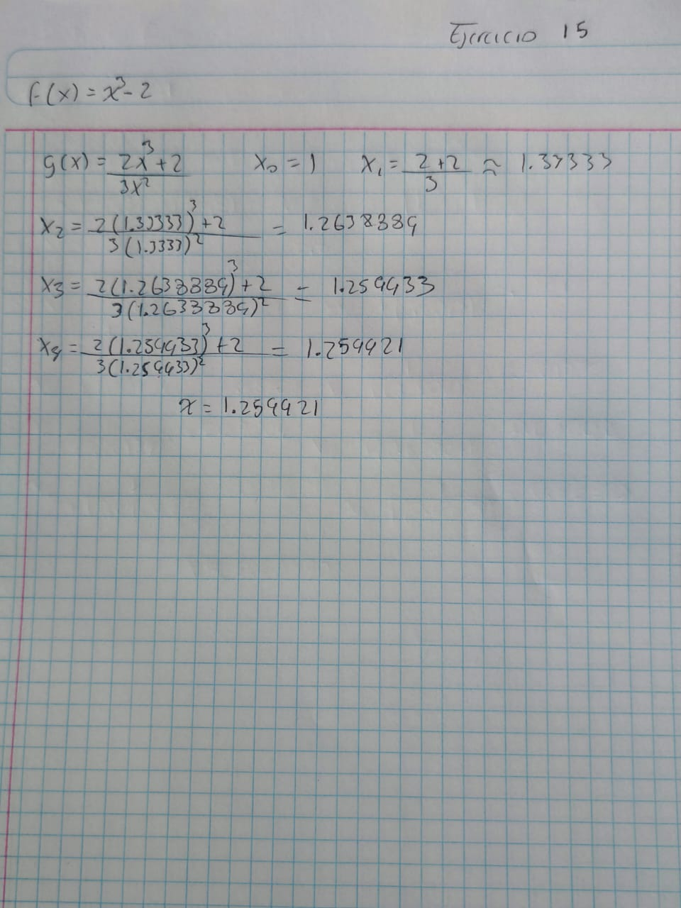{width=600}


### 11. f(x) = 2x − e^(−x)

```{r}

g <- function(x){ (exp(1)^-x) / 2 }
x0 <- 0.5

# Iteración 1
x1  <- g(x0)
e1  <- abs(x1 - x0)

# Iteración 2
x2  <- g(x1)
e2  <- abs(x2 - x1)

# Iteración 3
x3  <- g(x2)
e3  <- abs(x3 - x2)

# Iteración 4
x4  <- g(x3)
e4  <- abs(x4 - x3)

# Iteración 5
x5  <- g(x4)
e5  <- abs(x5 - x4)

# Iteración 6
x6  <- g(x5)
e6  <- abs(x6 - x5)

# Iteración 7
x7  <- g(x6)
e7  <- abs(x7 - x6)

# Iteración 8
x8  <- g(x7)
e8  <- abs(x8 - x7)

# Iteración 9
x9  <- g(x8)
e9  <- abs(x9 - x8)

# Iteración 10
x10 <- g(x9)
e10 <- abs(x10 - x9)

root_aprox <- x10

cat("Raíz aproximada (x10) =", format(root_aprox, digits = 12), "\n")

# TABLA FINAL

tabla <- data.frame(
  k = 1:10,
  xk = c(x0, x1, x2, x3, x4, x5, x6, x7, x8, x9),
  g_xk = c(x1, x2, x3, x4, x5, x6, x7, x8, x9, x10),
  Error = c(e1, e2, e3, e4, e5, e6, e7, e8, e9, e10)
)

print(tabla)

#      GRÁFICA

r1 <- min(tabla$xk) - 1
r2 <- max(tabla$xk) + 1

curve(g(x), from = r1, to = r2, col = "blue", lwd = 2,
      xlab = "x", ylab = "y",
      main = "Punto fijo: y = g(x) y y = x")
abline(a = 0, b = 1, col = "red", lwd = 2)

points(x10, g(x10), col = "black", pch = 19)
```

### 12. f(x) = x^3 + 4x^2 − 10

```{r}

g <- function(x){  ((10 - x^3) / 4 )^(1/2) }
x0 <- 1

# Iteración 1
x1  <- g(x0)
e1  <- abs(x1 - x0)

# Iteración 2
x2  <- g(x1)
e2  <- abs(x2 - x1)

# Iteración 3
x3  <- g(x2)
e3  <- abs(x3 - x2)

# Iteración 4
x4  <- g(x3)
e4  <- abs(x4 - x3)

# Iteración 5
x5  <- g(x4)
e5  <- abs(x5 - x4)

# Iteración 6
x6  <- g(x5)
e6  <- abs(x6 - x5)

# Iteración 7
x7  <- g(x6)
e7  <- abs(x7 - x6)

# Iteración 8
x8  <- g(x7)
e8  <- abs(x8 - x7)

# Iteración 9
x9  <- g(x8)
e9  <- abs(x9 - x8)

# Iteración 10
x10 <- g(x9)
e10 <- abs(x10 - x9)

root_aprox <- x10

cat("Raíz aproximada (x10) =", format(root_aprox, digits = 12), "\n")

# TABLA FINAL

tabla <- data.frame(
  k = 1:10,
  xk = c(x0, x1, x2, x3, x4, x5, x6, x7, x8, x9),
  g_xk = c(x1, x2, x3, x4, x5, x6, x7, x8, x9, x10),
  Error = c(e1, e2, e3, e4, e5, e6, e7, e8, e9, e10)
)

print(tabla)

#      GRÁFICA

r1 <- min(tabla$xk) - 1
r2 <- max(tabla$xk) + 1

curve(g(x), from = r1, to = r2, col = "blue", lwd = 2,
      xlab = "x", ylab = "y",
      main = "Punto fijo: y = g(x) y y = x")
abline(a = 0, b = 1, col = "red", lwd = 2)

points(x10, g(x10), col = "black", pch = 19)
```

### 13. f(x) = x² − cos(x)

```{r}

g <- function(x){ (cos(x))^(1/2) }
x0 <- 0.5

# Iteración 1
x1  <- g(x0)
e1  <- abs(x1 - x0)

# Iteración 2
x2  <- g(x1)
e2  <- abs(x2 - x1)

# Iteración 3
x3  <- g(x2)
e3  <- abs(x3 - x2)

# Iteración 4
x4  <- g(x3)
e4  <- abs(x4 - x3)

# Iteración 5
x5  <- g(x4)
e5  <- abs(x5 - x4)

# Iteración 6
x6  <- g(x5)
e6  <- abs(x6 - x5)

# Iteración 7
x7  <- g(x6)
e7  <- abs(x7 - x6)

# Iteración 8
x8  <- g(x7)
e8  <- abs(x8 - x7)

# Iteración 9
x9  <- g(x8)
e9  <- abs(x9 - x8)

# Iteración 10
x10 <- g(x9)
e10 <- abs(x10 - x9)

root_aprox <- x10

cat("Raíz aproximada (x10) =", format(root_aprox, digits = 12), "\n")

# TABLA FINAL

tabla <- data.frame(
  k = 1:10,
  xk = c(x0, x1, x2, x3, x4, x5, x6, x7, x8, x9),
  g_xk = c(x1, x2, x3, x4, x5, x6, x7, x8, x9, x10),
  Error = c(e1, e2, e3, e4, e5, e6, e7, e8, e9, e10)
)

print(tabla)

#      GRÁFICA

r1 <- min(tabla$xk) - 1
r2 <- max(tabla$xk) + 1

curve(g(x), from = r1, to = r2, col = "blue", lwd = 2,
      xlab = "x", ylab = "y",
      main = "Punto fijo: y = g(x) y y = x")
abline(a = 0, b = 1, col = "red", lwd = 2)

points(x10, g(x10), col = "black", pch = 19)
```

### 14. f(x) = x − e^(−x²)

```{r}

g <- function(x){ exp(1)^(-x^2) }
x0 <- 0.5

# Iteración 1
x1  <- g(x0)
e1  <- abs(x1 - x0)

# Iteración 2
x2  <- g(x1)
e2  <- abs(x2 - x1)

# Iteración 3
x3  <- g(x2)
e3  <- abs(x3 - x2)

# Iteración 4
x4  <- g(x3)
e4  <- abs(x4 - x3)

# Iteración 5
x5  <- g(x4)
e5  <- abs(x5 - x4)

# Iteración 6
x6  <- g(x5)
e6  <- abs(x6 - x5)

# Iteración 7
x7  <- g(x6)
e7  <- abs(x7 - x6)

# Iteración 8
x8  <- g(x7)
e8  <- abs(x8 - x7)

# Iteración 9
x9  <- g(x8)
e9  <- abs(x9 - x8)

# Iteración 10
x10 <- g(x9)
e10 <- abs(x10 - x9)

root_aprox <- x10

cat("Raíz aproximada (x10) =", format(root_aprox, digits = 12), "\n")

# TABLA FINAL

tabla <- data.frame(
  k = 1:10,
  xk = c(x0, x1, x2, x3, x4, x5, x6, x7, x8, x9),
  g_xk = c(x1, x2, x3, x4, x5, x6, x7, x8, x9, x10),
  Error = c(e1, e2, e3, e4, e5, e6, e7, e8, e9, e10)
)

print(tabla)

#      GRÁFICA

r1 <- min(tabla$xk) - 1
r2 <- max(tabla$xk) + 1

curve(g(x), from = r1, to = r2, col = "blue", lwd = 2,
      xlab = "x", ylab = "y",
      main = "Punto fijo: y = g(x) y y = x")
abline(a = 0, b = 1, col = "red", lwd = 2)

points(x10, g(x10), col = "black", pch = 19)
```

### 15. f(x) = x^3 − 2

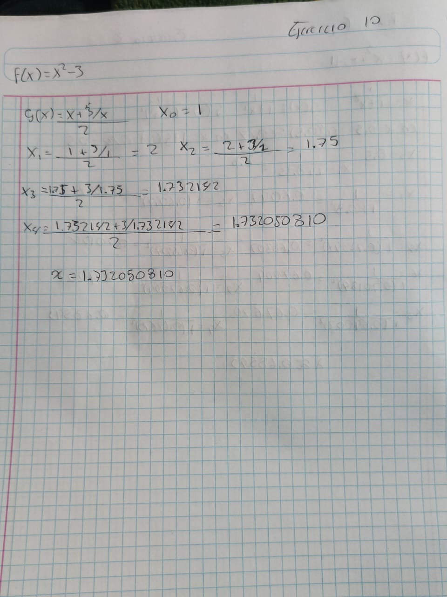{width=600}


#  Interpolación Numérica

```{r}
 #--- Forma clasica O(n^2) por evaluacion--
lagrange_eval <- function(x, y, xq) {
 # x, y: vectores de longitud n+1
 # xq: escalar o vector
 sapply(xq, function(xx) {
 n <- length(x)- 1
 p <- 0
 for (i in 0:n) {
 Li <- 1
 for (j in 0:n) {
 if (j != i) {
 Li <- Li * (xx- x[j+1]) / (x[i+1]- x[j+1])
 }
 }
 p <- p + y[i+1] * Li
 }
 p
 })
 }
 #--- Pesos baricentricos (precomputo O(n^2))--
barycentric_weights <- function(x) {
 n <- length(x)- 1
 w <- rep(1, n+1)
 for (i in 0:n) {
 for (j in 0:n) {
 if (j != i) w[i+1] <- w[i+1] / (x[i+1]- x[j+1])
 }
 }
 w
 }
 #--- Evaluacion baricentrica O(n) por punto--
barycentric_eval <- function(x, y, w, xq) {
 sapply(xq, function(xx) {
 # Coincidencia exacta con un nodo
 idx <- which(xx == x)
 if (length(idx) > 0) return(y[idx[1]])
 terms <- w / (xx- x)
 sum(terms * y) / sum(terms)
 })
 }
```

```{r}
 #--- Tabla de diferencias divididas--
newton_diffdiv <- function(x, y) {
 n <- length(x)
 F <- matrix(0, n, n)
 F[,1] <- y
 for (j in 2:n) {
 for (i in 1:(n-j+1)) {
 F[i,j] <- (F[i+1,j-1]- F[i,j-1]) / (x[i+j-1]- x[i])
 }
 }
 F
 }

#--- Evaluacion del polinomio de Newton--
newton_eval <- function(x, F, xq) {
 n <- length(x)
 sapply(xq, function(xx) {
 p <- F[1,1]
 prod <- 1
 for (j in 2:n) {
 prod <- prod * (xx- x[j-1])
 p <- p + F[1,j]*prod
 }
 p
 })
 }
```

```{r}
newton_to_poly <- function(x, y){
  T <- forward_diff_table(x, y)
  n <- length(x)
  coef <- c(0)
  
  for(k in 1:n){
    term <- c(1)
    if(k > 1){
      for(j in 1:(k-1)){
        term <- convolve(term, c(-x[j],1), type="open")
      }
    }
    coef <- c(coef, rep(0, length(term)-length(coef)))
    coef <- coef + (T[1,k]/factorial(k-1)) * c(term, rep(0, length(coef)-length(term)))
  }
  coef
}
```

```{r}
is_equispaced <- function(x, tol = 1e-9) {
 if (length(x) < 2) return(TRUE)
 h <- diff(x)
 max(abs(h- h[1])) < tol
 }
 falling_prod <- function(p, k) {
 # p(p-1)(p-2)...(p-k+1), falling factorial
 34
if (k == 0) return(1)
 prod(p- 0:(k-1))
 }
 rising_prod <- function(q, k) {
 # q(q+1)(q+2)...(q+k-1), rising factorial
 if (k == 0) return(1)
 prod(q + 0:(k-1))
 }
```

```{r}
 is_equispaced <- function(x, tol = 1e-9) {
 if (length(x) < 2) return(TRUE)
 h <- diff(x)
 max(abs(h- h[1])) < tol
 }
 falling_prod <- function(p, k) {
 # p(p-1)(p-2)...(p-k+1), falling factorial
 34
if (k == 0) return(1)
 prod(p- 0:(k-1))
 }
 rising_prod <- function(q, k) {
 # q(q+1)(q+2)...(q+k-1), rising factorial
 if (k == 0) return(1)
 prod(q + 0:(k-1))
 }
```

```{r}
 forward_diff_table <- function(x, y, check_equispaced = TRUE) {
 n <- length(x)
 if (length(y) != n) stop("x e y deben tener la misma longitud.")
 if (check_equispaced && !is_equispaced(x)) {
 stop("Los nodos no son equiespaciados.")
 }
 T <- matrix(0, nrow = n, ncol = n)
 T[, 1] <- y
 if (n >= 2) {
 for (j in 2:n) {
 for (i in 1:(n- j + 1)) {
 T[i, j] <- T[i + 1, j- 1]- T[i, j- 1] # Delta^j y_i
 }
 }
 }
 T
 }
```

```{r}
newton_forward_eval <- function(x, T, xq) {
 n <- length(x)
 h <- x[2]- x[1]
 p <- (xq- x[1]) / h
 # T[1, k] contiene ^(k-1) y_0, con k empezando en 1
 P <- T[1, 1]
 for (k in 2:n) {
 coef <- falling_prod(p, k- 1) / factorial(k- 1)
 P <- P + coef * T[1, k]
 }
 P
 }
```

```{r}
 backward_diff_table <- function(x, y, check_equispaced = TRUE) {
 n <- length(x)
 if (length(y) != n) stop("x e y deben tener la misma longitud.")
 if (check_equispaced && !is_equispaced(x)) {
 stop("Los nodos no son equiespaciados.")
 }
 T <- matrix(0, nrow = n, ncol = n)
 T[, 1] <- y
 if (n >= 2) {
 for (j in 2:n) {
 for (i in n:j) {
 T[i, j] <- T[i, j- 1]- T[i- 1, j- 1] # Nabla^j y_i
 }
 }
 }
 T
 }
```

```{r}
 newton_backward_eval <- function(x, T, xq) {
 n <- length(x)
 h <- x[2]- x[1]
 q <- (xq- x[n]) / h
 P <- T[n, 1]
 for (k in 2:n) {
 coef <- rising_prod(q, k- 1) / factorial(k- 1)
 P <- P + coef * T[n, k]
 }
 P
 }
```

```{r}
format_diff_table <- function(x, T, type = c("forward", "backward")) {
 type <- match.arg(type)
 n <- length(x)
 df <- data.frame(x = x, y = T[, 1])
 colnames(df) <- c("x", "y")
 for (j in 2:n) {
 colname <- if (type == "forward") paste0("Delta^", j- 1)
 else paste0("Nabla^", j- 1)
df[[colname]] <- T[, j]
 }
 df
 }
```

### ejercicio 5

```{r}
x1 <- c(0,1,2)
y1 <- c(1,3,11)

# a) Lagrange (forma evaluada)
cat("\n--- 1a) LAGRANGE (evaluaciones y polinomio) ---\n")
# evaluar en una malla para ver curva
xx <- seq(0,2,by=0.25)
yy_lag <- lagrange_eval(x1, y1, xx)
print(data.frame(x=xx, P_lagrange=yy_lag))

# b) Tabla de diferencias divididas (Newton)
cat("\n--- 1b) DIFERENCIAS DIVIDIDAS (F) ---\n")
F1 <- newton_diffdiv(x1, y1)
print(F1)

# Forma de Newton (a partir de F1[1,])
cat("\nPolinomio de Newton (forma):\n")
cat(sprintf("P(x) = %g + %g*(x - %g) + %g*(x - %g)*(x - %g)\n",
            F1[1,1], F1[1,2], x1[1], F1[1,3], x1[1], x1[2]))

# Expandir con Vandermonde para coef. estándar (opcional)
V1 <- outer(x1, 0:2, `^`)
coef1 <- solve(V1, y1)   # [a0, a1, a2]
cat("\nCoeficientes (forma estándar) a0 + a1 x + a2 x^2:\n")
print(coef1)

# c) Evaluar en x = 1.5
cat("\n--- 1c) EVALUACION EN x = 1.5 ---\n")
val_lag_15  <- lagrange_eval(x1, y1, 1.5)
val_newt_15 <- newton_eval(x1, F1, 1.5)
cat("Lagrange: ", val_lag_15, "\n")
cat("Newton:   ", val_newt_15, "\n")

# Polinomio final (escribirlo)
cat("\nPolinomio interpolante:\n")
cat(sprintf("P(x) = %.0f x^2 %+ .0f x %+ .0f\n", coef1[3], coef1[2], coef1[1]))


```

```{r}
# Ejercicio 5.2

x2 <- c(1,2,3,4)
y2 <- c(2,5,10,17)

cat("\n--- 2a/2b) NEWTON - DIFERENCIAS Y POLINOMIO ---\n")
F2 <- newton_diffdiv(x2, y2)
print(F2)   # tabla completa

cat("\nPolinomio de Newton (a partir de F2[1,]):\n")
cat("P(x) = ", F2[1,1])
for (j in 2:ncol(F2)){
  if (abs(F2[1,j]) < 1e-12) { cat("") } else {
    cat(sprintf(" + (%g)", F2[1,j]))
    for (k in 1:(j-1)) cat(sprintf("*(x - %g)", x2[k]))
  }
}
cat("\n")

# c) Evaluar en x=2.5
val2_25 <- newton_eval(x2, F2, 2.5)
cat("\nP(2.5) =", val2_25, "\n")

# d) Verificación directa: f(x)=x^2 + 1
cat("\nVerificacion directa f(2.5) = 2.5^2 + 1 =", 2.5^2 + 1, "\n")
```

```{r}
# Ejercicio 5.3
x3 <- c(-1,0,2)
y3 <- c(4,1,3)

cat("\n--- 3a/3b/3c) LAGRANGE, EXPANSION Y VERIFICACION ---\n")

# a) Evaluaciones por Lagrange (comprobación)
cat("Evaluaciones Lagrange en nodos (deben coincidir):\n")
print(lagrange_eval(x3, y3, x3))

# b) Tabla de diferencias divididas y Newton
F3 <- newton_diffdiv(x3, y3)
cat("\nTabla F3:\n")
print(F3)

# forma Newton simbólica
cat("\nPolinomio de Newton (forma):\n")
cat(sprintf("P(x) = %g + (%g)*(x - %g) + (%g)*(x - %g)*(x - %g)\n",
            F3[1,1], F3[1,2], x3[1], F3[1,3], x3[1], x3[2]))

# expandir a forma estándar (usando Vandermonde solve):
V3 <- outer(x3, 0:2, `^`)
coef3 <- solve(V3, y3)
cat("\nCoeficientes estándar [a0, a1, a2]:\n")
print(coef3)

# c) verificar valores en nodos
val3 <- newton_eval(x3, F3, x3)
cat("\nVerificación P(-1), P(0), P(2):\n")
print(val3)
```

### ejercicio 6 

```{r}
x1 <- c(0,1,2,3,4)
y1 <- c(1,2,4,8,16)

T1 <- forward_diff_table(x1, y1)

cat("\nTabla de diferencias:\n")
print(T1)

# Polinomio
coef <- newton_to_poly(x1, y1)
cat("\nPolinomio aproximado:\n")
cat(sprintf("P(x) = %.4f x^4 + %.4f x^3 + %.4f x^2 + %.4f x + %.4f\n",
            coef[5], coef[4], coef[3], coef[2], coef[1]))

cat("\nEvaluación en x = 2.5\n")
aprox1 <- newton_forward_eval(x1, T1, 2.5)
real1  <- 2^2.5

cat("Interpolación:", aprox1, "\n")
cat("Valor real:    ", real1, "\n")
cat("Error:         ", abs(real1 - aprox1), "\n")

# ============================
# PROBLEMA 2
# ============================

cat("\n--- PROBLEMA 2 ---\n")

x2 <- c(1,2,3,4)
y2 <- c(1,8,27,64)

T2 <- backward_diff_table(x2, y2)
cat("\nTabla de diferencias:\n")
print(T2)

cat("\nEvaluación en x = 3.4\n")
aprox2 <- newton_backward_eval(x2, T2, 3.4)
real2  <- 3.4^3

cat("Interpolación:", aprox2, "\n")
cat("Valor real:    ", real2, "\n")
cat("Error:         ", abs(real2 - aprox2), "\n")

# ============================
# PROBLEMA 3
# ============================

cat("\n--- PROBLEMA 3 ---\n")

x3 <- c(10,20,30,40,50)
y3 <- c(20.5,24.0,32.0,42.5,51.0)

cat("\n¿Son equiespaciados?: ", is_equispaced(x3), "\n")

T3 <- forward_diff_table(x3, y3)
cat("\nTabla de diferencias (hasta 3er orden):\n")
print(T3[,1:4])

cat("\nEvaluación en x = 25\n")
aprox3 <- newton_forward_eval(x3, T3, 25)
cat("y(25) ≈ ", aprox3, "\n")
```
### ejercicio 9

```{r}
x <- c(1, 2, 3, 4)
y <- c(2, 5, 10, 17)

F <- newton_diffdiv(x, y)

print(F)

newton_symbolic <- function(x, F) {
  n <- length(x)
  expr <- paste(F[1,1])
  
  for (j in 2:n) {
    coef <- F[1,j]
    if (abs(coef) < 1e-12) next
    
    term <- paste0(ifelse(coef >= 0, " + ", " - "), abs(coef))
    for (k in 1:(j-1)) {
      term <- paste0(term, "*(x - ", x[k], ")")
    }
    expr <- paste0(expr, term)
  }
  
  expr
}

polinomio <- newton_symbolic(x, F)

cat("\nPolinomio de Newton:\n")
cat(polinomio, "\n")

cat("\n--- Tabla de diferencias divididas ---\n")
print(F)

valor <- newton_eval(x, F, 2.5)

cat("\nP(2.5) =", valor, "\n")

cat("\nVerificación directa:\n")
cat("f(2.5) = 2.5^2 + 1 =", 2.5^2 + 1, "\n")
```

### ejercicio 8

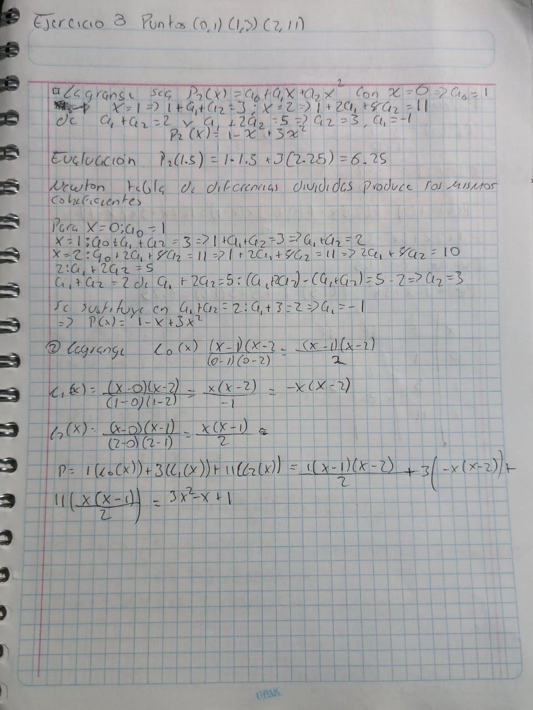{width=600}

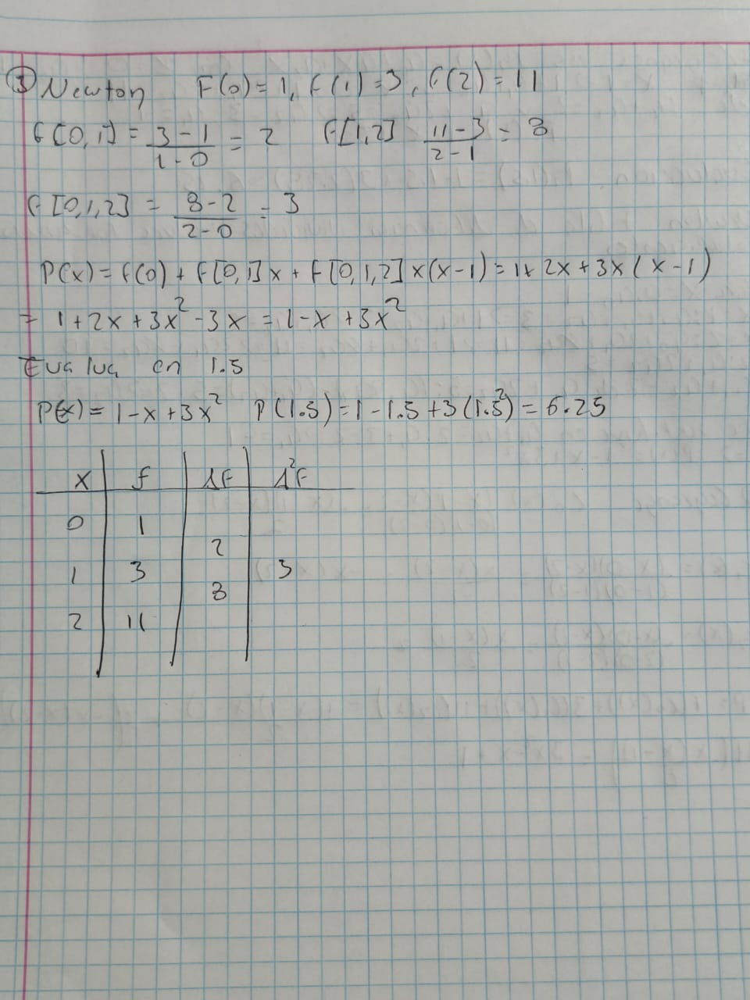{width=600}

### ejercicio 10 

```{r}
x <- c(-1, 0, 2)
y <- c(4, 1, 3)

# ======================
# PARTE (a) LAGRANGE
# ======================
cat("\n--- POLINOMIO POR LAGRANGE (EVALUACIONES) ---\n")

p_neg1 <- lagrange_eval(x, y, -1)
p_0    <- lagrange_eval(x, y,  0)
p_2    <- lagrange_eval(x, y,  2)

cat("P(-1) =", p_neg1, "\n")
cat("P(0)  =", p_0, "\n")
cat("P(2)  =", p_2, "\n")

# ======================
# PARTE (b) NEWTON
# ======================
cat("\n--- TABLA DE DIFERENCIAS DIVIDIDAS ---\n")
F <- newton_diffdiv(x, y)
print(F)

# ======================
# PARTE (c) EVALUACIÓN CON NEWTON
# ======================
cat("\n--- EVALUACION CON NEWTON ---\n")

valores <- newton_eval(x, F, c(-1,0,2))
names(valores) <- c("P(-1)", "P(0)", "P(2)")
print(valores)

# ======================
# POLINOMIO SIMBÓLICO (FORMA NEWTON)
# ======================
newton_symbolic <- function(x, F) {
  n <- length(x)
  expr <- paste(F[1,1])
  for (j in 2:n) {
    coef <- F[1,j]
    if (abs(coef) < 1e-12) next
    term <- paste0(ifelse(coef >= 0, " + ", " - "), abs(coef))
    for (k in 1:(j-1)) {
      term <- paste0(term, "*(x - ", x[k], ")")
    }
    expr <- paste0(expr, term)
  }
  expr
}

cat("\n--- POLINOMIO DE NEWTON (FORMA SIMBOLICA) ---\n")
cat(newton_symbolic(x, F), "\n")
```

### ejercicio 14

```{r}
set.seed(123)

a <- 2; b <- -3; c <- 1
x <- seq(-2, 2, length.out = 5)

y_sin_ruido <- a*x^2 + b*x + c

sigma <- 0.3
y_con_ruido <- y_sin_ruido + rnorm(length(x), 0, sigma)
```

```{r}
F_sin <- newton_diffdiv(x, y_sin_ruido)

puntos <- seq(-2, 2, length.out = 20)

lag_sin  <- lagrange_eval(x, y_sin_ruido, puntos)
newt_sin <- newton_eval(x, F_sin, puntos)

cbind(puntos, lag_sin, newt_sin)
```

```{r}
F_con <- newton_diffdiv(x, y_con_ruido)

lag_con  <- lagrange_eval(x, y_con_ruido, puntos)
newt_con <- newton_eval(x, F_con, puntos)
tabla_ruido <- cbind(
  x = puntos,
  Lagrange = lag_con,
  Newton   = newt_con
)
print(tabla_ruido)
```

```{r}
x_trunc <- x[1:3]
y_trunc <- y_con_ruido[1:3]

F_trunc <- newton_diffdiv(x_trunc, y_trunc)

newt_trunc <- newton_eval(x_trunc, F_trunc, puntos)

tabla_trunc <- cbind(
  x = puntos,
  Newton_truncado = newt_trunc
)
print(tabla_trunc)
```

```{r}
plot(puntos, lag_con, type="l", lty=1, main="Interpolación con ruido",
     xlab="x", ylab="y")

lines(puntos, newt_con, lty=2)
lines(puntos, newt_trunc, lty=3)

points(x, y_con_ruido, pch=19)

legend("topright", legend=c("Lagrange", "Newton", "Newton truncado", "Datos"),
       lty=c(1,2,3,NA), pch=c(NA,NA,NA,19))
```

### ejercicio 11

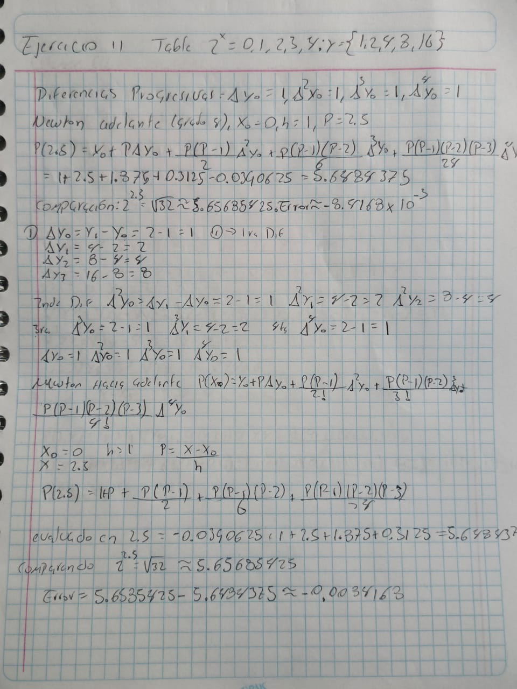{width=600}

### ejercicio 12

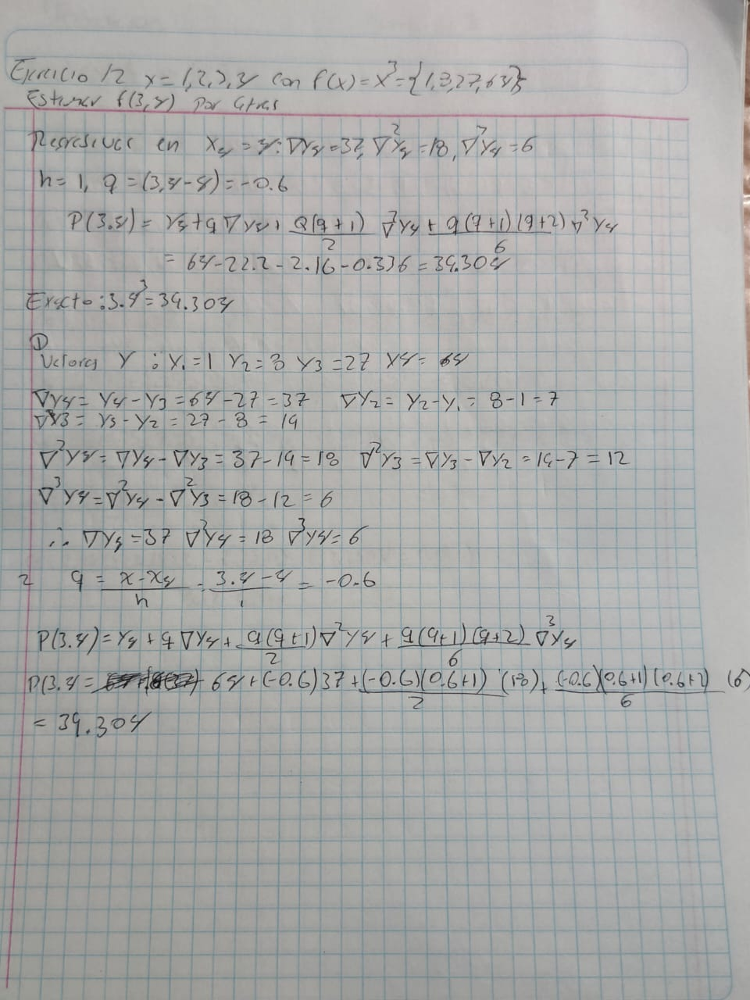{width=600}


# Practicas de laboratorio


# Revision de programas

# Mis notas


